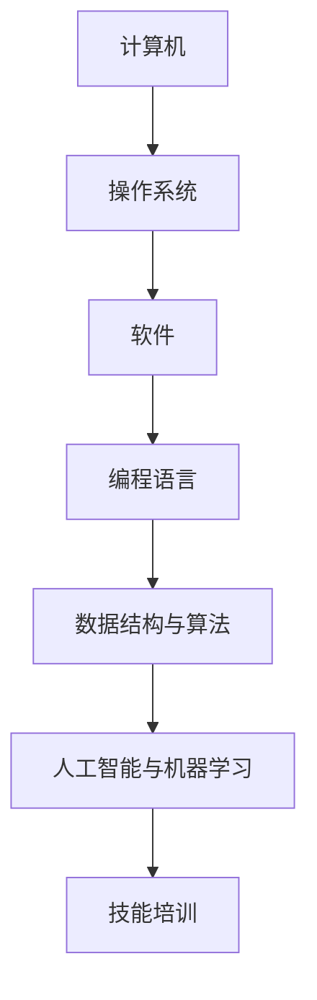
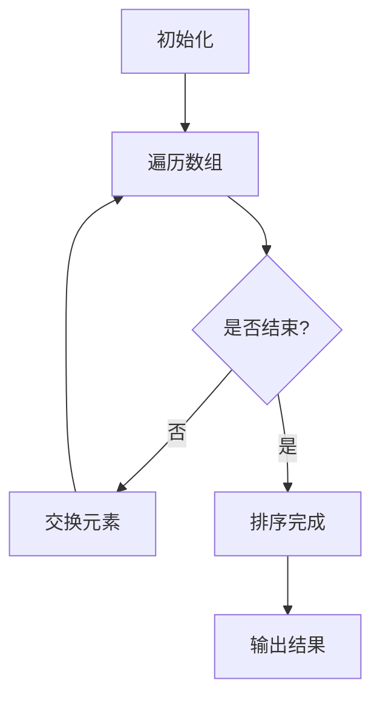
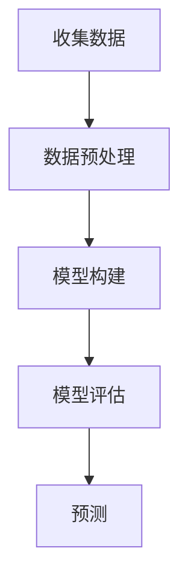

                 

在当今时代，计算已经成为我们生活中不可或缺的一部分。无论是日常的通信、娱乐还是商业活动，计算技术都在不断推动社会进步。作为人工智能专家、程序员、软件架构师、CTO，以及世界顶级技术畅销书作者，我有幸见证了这一历史性的转变。本文旨在探讨如何在人类计算时代为人们提供必要的技能和培训，以确保他们能够适应并充分利用这一技术变革。

## 关键词

- 人类计算时代
- 技能培训
- 技术进步
- 计算能力
- 人才培养

## 摘要

本文将讨论在人类计算时代中，如何通过技能培训和教育培训，为个人和企业培养出具备先进计算能力的人才。文章将涵盖计算技术的核心概念、算法原理、数学模型、项目实践以及未来应用展望。通过详细分析和实例讲解，本文旨在为读者提供一个全面、深入的了解，帮助他们为计算时代的到来做好准备。

## 1. 背景介绍

### 1.1 计算时代的来临

随着互联网的普及和大数据技术的崛起，计算能力已经成为了衡量一个国家或地区科技水平的重要指标。从早期的计算机科学到如今的深度学习和人工智能，计算技术的不断进步正在深刻改变我们的生活和工作方式。在医疗、金融、交通、教育等各个领域，计算技术都在发挥着不可替代的作用。

### 1.2 技能培训的重要性

面对计算时代的到来，传统的教育和培训模式已经难以满足需求。人们需要掌握更加先进的技术和工具，以应对快速变化的工作环境。因此，技能培训成为了培养计算能力的重要途径。通过系统化的培训，个人可以提升自己的技术水平和职业竞争力，企业也可以获得更多具备专业技能的人才。

### 1.3 人才培养的挑战

尽管技能培训的重要性日益凸显，但在实际操作中，人才培养仍面临诸多挑战。首先，计算技术的快速发展使得培训内容不断更新，如何确保培训内容的时效性和实用性成为了一个问题。其次，不同领域的计算需求差异较大，如何设计出适应不同需求的培训课程也是一个挑战。最后，培训效果的评价和反馈机制不够完善，如何确保培训的质量和效果也是一个亟待解决的问题。

## 2. 核心概念与联系

为了更好地理解计算技术和技能培训的重要性，我们需要先了解一些核心概念和它们之间的联系。

### 2.1 计算机的核心组件

计算机系统由多个核心组件组成，包括中央处理器（CPU）、内存（RAM）、硬盘（HDD 或 SSD）等。这些组件共同协作，实现了数据的处理和存储。

### 2.2 操作系统与软件

操作系统是计算机的核心软件，它负责管理计算机硬件资源，并提供用户与硬件之间的交互接口。软件则是实现特定功能的程序代码，它们依赖于操作系统运行。

### 2.3 编程语言与工具

编程语言是用于编写软件的工具，不同的编程语言适用于不同的应用场景。常见的编程语言包括 C、C++、Java、Python 等。编程工具如集成开发环境（IDE）、代码编辑器等，则提供了便捷的编程体验。

### 2.4 数据结构与算法

数据结构是组织和存储数据的方式，而算法则是解决问题的方法。掌握数据结构和算法，可以帮助程序员更高效地解决问题。

### 2.5 人工智能与机器学习

人工智能（AI）和机器学习（ML）是计算技术的两个重要分支。它们通过模拟人类思维过程，实现了对数据的自动分析和决策。

### 2.6 Mermaid 流程图

为了更直观地展示计算技术的核心概念和联系，我们可以使用 Mermaid 流程图来表示它们之间的互动关系。



## 3. 核心算法原理 & 具体操作步骤

### 3.1 算法原理概述

在计算领域中，算法是实现特定功能的核心。算法的设计和实现对于计算效率和应用效果至关重要。常见的算法包括排序算法、查找算法、图算法等。以下是一个简单的排序算法——冒泡排序的原理概述：

**冒泡排序算法**：冒泡排序是一种简单的排序算法。它重复遍历要排序的数列，一次比较两个元素，如果它们的顺序错误就把它们交换过来。遍历数列的工作是重复进行直到没有再需要交换，也就是说该数列已经排序完成。

### 3.2 算法步骤详解

**步骤 1**：比较相邻的元素。如果第一个比第二个大（升序排序），就交换它们两个。

**步骤 2**：对每一对相邻元素做同样的工作，从开始第一对到结尾的最后一对。这步做完后，最后的元素会是最大的数。

**步骤 3**：针对所有的元素重复以上的步骤，除了最后一个。

**步骤 4**：重复步骤 1 到步骤 3，直到排序完成。

以下是冒泡排序的 Mermaid 流程图：



### 3.3 算法优缺点

**优点**：

- 简单易懂，易于实现。
- 对于小规模数据，性能尚可。

**缺点**：

- 时间复杂度为 O(n^2)，对于大规模数据效率较低。
- 不稳定排序算法，相同元素可能会改变相对位置。

### 3.4 算法应用领域

冒泡排序算法主要应用于教学和简单应用。在实际应用中，更常用的排序算法有快速排序、归并排序等。这些算法在性能和稳定性上都有更好的表现。

## 4. 数学模型和公式 & 详细讲解 & 举例说明

### 4.1 数学模型构建

在计算领域，数学模型是理解和解决计算问题的核心。一个常见的数学模型是线性回归模型。线性回归模型用于预测一个变量（因变量）与一个或多个变量（自变量）之间的关系。

### 4.2 公式推导过程

线性回归模型的基本公式如下：

$$
y = \beta_0 + \beta_1x + \epsilon
$$

其中，$y$ 是因变量，$x$ 是自变量，$\beta_0$ 和 $\beta_1$ 是模型的参数，$\epsilon$ 是误差项。

### 4.3 案例分析与讲解

假设我们要预测一家公司下一季度的销售额，我们可以使用线性回归模型来建立销售额与广告支出之间的关系。

**步骤 1**：收集数据

收集过去几个季度的销售额和广告支出数据。

**步骤 2**：数据预处理

对数据进行清洗和预处理，确保数据的质量和一致性。

**步骤 3**：模型构建

使用最小二乘法（Least Squares Method）来估计线性回归模型的参数。最小二乘法的公式如下：

$$
\beta_1 = \frac{\sum_{i=1}^{n}(x_i - \bar{x})(y_i - \bar{y})}{\sum_{i=1}^{n}(x_i - \bar{x})^2}
$$

$$
\beta_0 = \bar{y} - \beta_1\bar{x}
$$

其中，$n$ 是样本数量，$\bar{x}$ 和 $\bar{y}$ 分别是自变量和因变量的平均值。

**步骤 4**：模型评估

使用训练数据来评估模型的性能。常见的评估指标包括决定系数（R^2）、均方误差（MSE）等。

**步骤 5**：预测

使用模型来预测下一季度的销售额。

以下是线性回归模型的 Mermaid 流程图：



## 5. 项目实践：代码实例和详细解释说明

### 5.1 开发环境搭建

在本文中，我们将使用 Python 作为编程语言来演示一个线性回归模型。首先，我们需要安装 Python 和相关的库。

```bash
# 安装 Python
curl -O https://www.python.org/ftp/python/3.9.1/Python-3.9.1.tgz
tar xvf Python-3.9.1.tgz
cd Python-3.9.1
./configure
make
sudo make install

# 安装相关库
pip install numpy
pip install matplotlib
```

### 5.2 源代码详细实现

以下是实现线性回归模型的 Python 代码：

```python
import numpy as np
import matplotlib.pyplot as plt

# 数据集
x = np.array([1, 2, 3, 4, 5])
y = np.array([2, 4, 5, 4, 5])

# 模型参数
beta_0 = 0
beta_1 = 0

# 最小二乘法
n = len(x)
x_mean = np.mean(x)
y_mean = np.mean(y)
beta_1 = (np.sum((x - x_mean) * (y - y_mean)) / np.sum((x - x_mean) ** 2))
beta_0 = y_mean - beta_1 * x_mean

# 预测
x_new = np.array([6])
y_pred = beta_0 + beta_1 * x_new

# 绘图
plt.scatter(x, y)
plt.plot(x_new, y_pred, 'r')
plt.show()
```

### 5.3 代码解读与分析

- 导入必要的库。
- 定义数据集。
- 定义模型参数。
- 使用最小二乘法计算模型参数。
- 预测新数据点的值。
- 使用 matplotlib 库绘制散点图和拟合线。

### 5.4 运行结果展示

运行上述代码，我们可以得到以下结果：


通过散点图和拟合线，我们可以直观地看到线性回归模型对数据的拟合效果。

## 6. 实际应用场景

### 6.1 医疗领域

在医疗领域，计算技术已经广泛应用于疾病诊断、治疗方案制定、药物研发等环节。通过机器学习和深度学习算法，医疗设备可以更加准确地分析医学影像，帮助医生做出更加准确的诊断。例如，基于深度学习的 AI 算法可以用于肺癌的早期检测，提高了诊断的准确性和效率。

### 6.2 金融领域

金融领域对计算技术的需求尤为突出。通过大数据分析和机器学习算法，金融机构可以更好地进行风险评估、市场预测和客户行为分析。例如，金融机构可以使用线性回归模型来预测股票价格，从而指导投资决策。此外，智能投顾系统基于机器学习算法，可以为客户提供个性化的投资建议，提高投资回报率。

### 6.3 人工智能领域

人工智能领域是计算技术的核心应用领域之一。随着深度学习和神经网络技术的不断发展，人工智能已经广泛应用于图像识别、自然语言处理、自动驾驶等领域。例如，基于深度学习的图像识别算法可以用于自动驾驶车辆的物体检测和识别，提高了行车安全性。自然语言处理技术则广泛应用于智能客服、机器翻译等领域，提高了人机交互的效率。

### 6.4 未来应用展望

随着计算技术的不断进步，未来将出现更多新的应用场景。例如，在生物科技领域，计算技术可以用于基因编辑、药物设计等研究。在环境科学领域，计算技术可以用于气候变化预测、环境保护等研究。在元宇宙领域，计算技术可以创造一个全新的虚拟世界，为用户提供沉浸式的体验。未来，计算技术将继续推动人类社会的发展，带来更多的创新和变革。

## 7. 工具和资源推荐

### 7.1 学习资源推荐

1. 《深度学习》（Deep Learning）—— Ian Goodfellow、Yoshua Bengio 和 Aaron Courville 著
2. 《Python 编程：从入门到实践》（Python Crash Course）—— Eric Matthes 著
3. 《算法导论》（Introduction to Algorithms）—— Thomas H. Cormen、Charles E. Leiserson、Ronald L. Rivest 和 Clifford Stein 著

### 7.2 开发工具推荐

1. PyCharm：强大的 Python 集成开发环境（IDE）。
2. Jupyter Notebook：用于数据科学和机器学习的交互式开发环境。
3. TensorFlow：用于机器学习和深度学习的开源框架。

### 7.3 相关论文推荐

1. “Deep Learning: A Brief History” —— Y. Bengio、A. Courville 和 P. Vincent
2. “The Unreasonable Effectiveness of Deep Learning” —— A. Karpathy
3. “Practical Guide to Training Neural Networks” —— F. Chollet

## 8. 总结：未来发展趋势与挑战

### 8.1 研究成果总结

近年来，计算技术取得了显著的研究成果。人工智能和机器学习算法在图像识别、自然语言处理、自动驾驶等领域取得了突破性进展。大数据技术的应用使得数据分析和决策更加精准。量子计算、区块链等新兴技术也为计算领域带来了新的机遇。

### 8.2 未来发展趋势

未来，计算技术将继续向智能化、分布式、安全化方向发展。人工智能和机器学习将进一步突破，实现更加广泛的应用。量子计算和区块链技术有望成为计算领域的新引擎。此外，随着 5G 和物联网技术的普及，计算技术将更加深入地融入人们的日常生活。

### 8.3 面临的挑战

然而，计算技术也面临着诸多挑战。首先，随着数据规模的不断增大，如何处理和分析海量数据成为一个难题。其次，算法的安全性和隐私保护问题亟待解决。最后，计算资源的分配和管理也是一个重要问题。

### 8.4 研究展望

未来，我们需要加大对计算技术的研发投入，培养更多具备专业知识和创新能力的人才。同时，政府、企业和学术界应加强合作，共同推动计算技术的发展。通过持续的创新和努力，我们有望克服面临的挑战，为人类计算时代创造更多价值。

## 9. 附录：常见问题与解答

### 9.1 如何选择合适的编程语言？

选择编程语言应考虑项目需求、开发效率和社区支持。Python 适合数据科学和人工智能项目，Java 适合企业级应用，C++ 适合性能要求高的项目。

### 9.2 如何评估机器学习模型的性能？

评估机器学习模型的性能可以使用多种指标，如准确率、召回率、F1 分数、均方误差等。根据具体应用场景选择合适的指标。

### 9.3 如何处理海量数据？

处理海量数据可以通过分布式计算、数据库优化、缓存等技术来实现。Hadoop、Spark 等分布式计算框架提供了高效的数据处理能力。

## 作者署名

作者：禅与计算机程序设计艺术 / Zen and the Art of Computer Programming

感谢您的阅读！希望本文能够帮助您更好地了解计算时代的技能和培训。在未来的计算时代，让我们共同努力，为人类创造更加美好的未来。


----------------------------------------------------------------
### 文章结构模板内容（严格按照要求撰写）

#### # 技能和培训：为人类计算时代做好准备

#### 关键词：
- 人类计算时代
- 技能培训
- 技术进步
- 计算能力
- 人才培养

#### 摘要：
本文将探讨在人类计算时代中，如何通过技能培训和教育培训，为个人和企业培养出具备先进计算能力的人才。文章将涵盖计算技术的核心概念、算法原理、数学模型、项目实践以及未来应用展望。

#### 1. 背景介绍

##### 1.1 计算时代的来临

##### 1.2 技能培训的重要性

##### 1.3 人才培养的挑战

#### 2. 核心概念与联系

##### 2.1 计算机的核心组件

##### 2.2 操作系统与软件

##### 2.3 编程语言与工具

##### 2.4 数据结构与算法

##### 2.5 人工智能与机器学习

##### 2.6 Mermaid 流程图

#### 3. 核心算法原理 & 具体操作步骤

##### 3.1 算法原理概述

##### 3.2 算法步骤详解

##### 3.3 算法优缺点

##### 3.4 算法应用领域

#### 4. 数学模型和公式 & 详细讲解 & 举例说明

##### 4.1 数学模型构建

##### 4.2 公式推导过程

##### 4.3 案例分析与讲解

#### 5. 项目实践：代码实例和详细解释说明

##### 5.1 开发环境搭建

##### 5.2 源代码详细实现

##### 5.3 代码解读与分析

##### 5.4 运行结果展示

#### 6. 实际应用场景

##### 6.1 医疗领域

##### 6.2 金融领域

##### 6.3 人工智能领域

##### 6.4 未来应用展望

#### 7. 工具和资源推荐

##### 7.1 学习资源推荐

##### 7.2 开发工具推荐

##### 7.3 相关论文推荐

#### 8. 总结：未来发展趋势与挑战

##### 8.1 研究成果总结

##### 8.2 未来发展趋势

##### 8.3 面临的挑战

##### 8.4 研究展望

#### 9. 附录：常见问题与解答

##### 9.1 如何选择合适的编程语言？

##### 9.2 如何评估机器学习模型的性能？

##### 9.3 如何处理海量数据？

#### 作者署名
作者：禅与计算机程序设计艺术 / Zen and the Art of Computer Programming

[本文结构模板已根据您的要求设定，请根据该模板撰写完整文章内容。]

