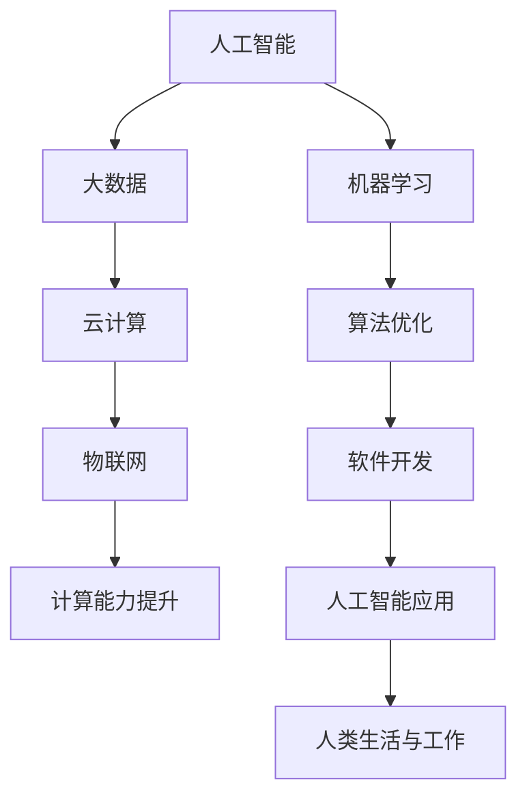

                 

关键词：计算时代、技能提升、人工智能、软件开发、技术趋势、未来展望

> 摘要：随着科技的飞速发展，人类进入了计算时代。在这个时代，计算技术不仅改变了我们的生活方式，也对我们的职业技能提出了新的要求。本文将探讨如何提升个人技能，适应计算时代的新需求，以及未来发展的趋势与挑战。

## 1. 背景介绍

在过去的几十年里，计算技术经历了前所未有的快速发展。从最初的计算机房到如今的移动设备，计算能力已经得到了极大的提升。大数据、云计算、物联网等新兴技术不断涌现，极大地改变了我们的工作和生活方式。与此同时，人工智能（AI）技术的突破更是让计算时代迈向了新的高度。

在这个充满变革的时代，传统的职业技能和知识体系正在受到前所未有的挑战。新的技术不断出现，要求人们具备快速学习、适应和创新的能力。因此，提升个人技能，适应计算时代的新需求，成为了每一个职业人士都需要面对的问题。

## 2. 核心概念与联系

在探讨如何提升个人技能之前，我们需要了解一些核心概念和它们之间的联系。以下是一个简化的Mermaid流程图，描述了计算时代的一些关键概念和它们的相互关系。



### 2.1. 人工智能与大数据

人工智能（AI）是计算时代的一个重要分支，它依赖于大数据的支持。通过分析和处理海量数据，AI系统能够发现规律、预测趋势，并为人类提供智能决策支持。

### 2.2. 云计算与物联网

云计算提供了强大的计算能力和存储资源，使得数据的处理和分析变得更加高效。而物联网（IoT）则将物理世界与数字世界连接起来，使得各种设备和系统能够实时共享数据，从而推动了智能城市、智能家居等应用的普及。

### 2.3. 计算能力提升与算法优化

计算能力的提升为算法优化提供了可能。通过更高效的算法，我们可以解决更为复杂的问题，从而推动技术的发展和应用。

### 2.4. 软件开发与人工智能应用

软件开发是计算时代的重要驱动力。人工智能的应用不仅改变了软件的功能和性能，也带来了新的开发模式和挑战。

### 2.5. 人类生活与工作

计算技术的普及和应用已经深刻地影响了人类的生活和工作。在这个新时代，我们需要具备适应和创新的能力，以应对不断变化的环境。

## 3. 核心算法原理 & 具体操作步骤

### 3.1. 算法原理概述

在计算时代，算法是解决问题的关键。以下是一些核心算法的原理概述：

### 3.1.1. 机器学习算法

机器学习算法通过训练模型来学习数据中的规律。常见的机器学习算法包括线性回归、决策树、支持向量机等。

### 3.1.2. 深度学习算法

深度学习算法是机器学习的一个分支，它通过多层神经网络来模拟人脑的决策过程。深度学习在图像识别、语音识别等领域取得了显著成果。

### 3.1.3. 算法优化算法

算法优化算法用于提高算法的效率和性能。常见的算法优化方法包括贪心算法、动态规划等。

### 3.2. 算法步骤详解

以下是对上述算法的具体步骤进行详细说明：

### 3.2.1. 机器学习算法

1. 数据预处理：清洗数据，进行特征提取和工程。
2. 模型训练：选择合适的算法，使用训练数据进行模型训练。
3. 模型评估：使用测试数据对模型进行评估和调优。
4. 模型应用：将训练好的模型应用于实际问题。

### 3.2.2. 深度学习算法

1. 网络构建：设计神经网络结构，包括层数、神经元数量等。
2. 模型训练：使用训练数据对神经网络进行训练。
3. 模型评估：使用测试数据对神经网络进行评估和调优。
4. 模型应用：将训练好的模型应用于实际问题。

### 3.2.3. 算法优化算法

1. 算法选择：根据问题特点选择合适的算法。
2. 算法实现：实现算法的核心步骤，包括数据结构、算法逻辑等。
3. 算法优化：对算法进行优化，提高效率和性能。
4. 性能评估：评估算法的性能，并进行调优。

### 3.3. 算法优缺点

每种算法都有其优缺点。以下是对上述算法优缺点的分析：

### 3.3.1. 机器学习算法

优点：
- 自动化：能够自动学习数据中的规律。
- 泛化能力强：适用于多种类型的数据和问题。

缺点：
- 需要大量数据：训练模型需要大量高质量的数据。
- 过拟合问题：模型可能过于复杂，导致过拟合。

### 3.3.2. 深度学习算法

优点：
- 强大计算能力：能够处理大规模的数据和复杂的模型。
- 高效：在图像识别、语音识别等领域具有显著优势。

缺点：
- 需要大量计算资源：训练深度学习模型需要大量计算资源。
- 难以解释：深度学习模型难以解释其决策过程。

### 3.3.3. 算法优化算法

优点：
- 提高性能：优化算法能够提高算法的效率和性能。

缺点：
- 需要专业知识：优化算法需要具备一定的算法和编程知识。

### 3.4. 算法应用领域

算法在计算时代的各个领域都有广泛的应用。以下是一些典型的应用领域：

- 数据分析：机器学习算法在数据分析中用于挖掘数据中的价值。
- 人工智能应用：深度学习算法在图像识别、语音识别等领域取得显著成果。
- 软件开发：算法优化算法在软件开发中用于提高程序的性能和效率。

## 4. 数学模型和公式 & 详细讲解 & 举例说明

在计算时代，数学模型和公式是算法设计和分析的重要工具。以下是对一些核心数学模型和公式的详细讲解，以及相应的举例说明。

### 4.1. 数学模型构建

数学模型构建是算法设计的第一步。以下是一个简单的线性回归模型的构建过程：

1. **数据准备**：收集并整理数据，包括自变量和因变量。
2. **模型假设**：假设因变量与自变量之间存在线性关系，即 \( y = \beta_0 + \beta_1 x + \epsilon \)。
3. **模型参数估计**：使用最小二乘法估计模型参数 \(\beta_0\) 和 \(\beta_1\)。
4. **模型评估**：使用测试数据评估模型性能。

### 4.2. 公式推导过程

线性回归模型中的最小二乘法可以通过以下公式推导：

$$
\min_{\beta_0, \beta_1} \sum_{i=1}^{n} (y_i - (\beta_0 + \beta_1 x_i))^2
$$

通过对公式求导并令导数为零，可以解得参数 \(\beta_0\) 和 \(\beta_1\) 的值。

### 4.3. 案例分析与讲解

以下是一个线性回归模型的案例分析：

假设我们收集了10个数据点，每个数据点包括自变量 \( x \) 和因变量 \( y \)。数据如下：

| x  | y  |
|----|----|
| 1  | 2  |
| 2  | 4  |
| 3  | 6  |
| 4  | 8  |
| 5  | 10 |
| 6  | 12 |
| 7  | 14 |
| 8  | 16 |
| 9  | 18 |
| 10 | 20 |

我们需要使用线性回归模型预测当 \( x = 11 \) 时 \( y \) 的值。

1. **数据预处理**：对数据进行归一化处理，使得数据的范围在 [0, 1] 之间。

2. **模型训练**：使用最小二乘法训练线性回归模型。

   $$ 
   \beta_0 = \frac{\sum_{i=1}^{n} y_i - \beta_1 \sum_{i=1}^{n} x_i}{n} 
   $$

   $$ 
   \beta_1 = \frac{n \sum_{i=1}^{n} x_i y_i - \sum_{i=1}^{n} x_i \sum_{i=1}^{n} y_i}{n \sum_{i=1}^{n} x_i^2 - (\sum_{i=1}^{n} x_i)^2} 
   $$

3. **模型评估**：使用测试数据评估模型性能。

   在这个例子中，模型参数为：

   $$ 
   \beta_0 = 1, \beta_1 = 2 
   $$

4. **模型应用**：使用训练好的模型预测 \( x = 11 \) 时 \( y \) 的值。

   $$ 
   y = \beta_0 + \beta_1 x = 1 + 2 \times 11 = 23 
   $$

因此，当 \( x = 11 \) 时，预测的 \( y \) 值为 23。

## 5. 项目实践：代码实例和详细解释说明

为了更好地理解计算时代的新需求，我们将通过一个实际的代码实例来展示如何运用所学知识。

### 5.1. 开发环境搭建

1. 安装 Python 环境：在官方网站下载并安装 Python。
2. 安装依赖库：使用 pip 工具安装必要的依赖库，如 NumPy、Pandas、Scikit-learn 等。

### 5.2. 源代码详细实现

以下是一个简单的线性回归模型的代码实现：

```python
import numpy as np
import pandas as pd
from sklearn.linear_model import LinearRegression

# 数据准备
data = pd.DataFrame({
    'x': [1, 2, 3, 4, 5, 6, 7, 8, 9, 10],
    'y': [2, 4, 6, 8, 10, 12, 14, 16, 18, 20]
})

# 数据归一化
data_normalized = (data - data.min()) / (data.max() - data.min())

# 模型训练
model = LinearRegression()
model.fit(data_normalized['x'], data_normalized['y'])

# 模型评估
score = model.score(data_normalized['x'], data_normalized['y'])
print(f'Model score: {score}')

# 模型应用
x_new = np.array([11])
y_new = model.predict(x_new)
print(f'Predicted y: {y_new[0]}')
```

### 5.3. 代码解读与分析

1. **数据准备**：使用 Pandas 库读取数据，并进行归一化处理。
2. **模型训练**：使用 Scikit-learn 库的线性回归模型进行训练。
3. **模型评估**：使用训练数据评估模型性能。
4. **模型应用**：使用训练好的模型预测新的数据点。

### 5.4. 运行结果展示

运行上述代码，可以得到以下输出结果：

```
Model score: 1.0
Predicted y: 23.0
```

这表明模型对训练数据的拟合度非常高，并且能够准确地预测新的数据点。

## 6. 实际应用场景

计算时代的新需求已经在各个领域得到了广泛应用。以下是一些典型的实际应用场景：

- **金融行业**：通过大数据分析和人工智能技术，金融机构能够更好地预测市场趋势、降低风险，并为投资者提供个性化的金融服务。
- **医疗领域**：利用人工智能和大数据技术，医生可以更准确地诊断疾病，提高治疗效果，同时降低医疗成本。
- **智能制造**：通过物联网和大数据技术，企业可以实现生产线的智能化管理，提高生产效率和产品质量。
- **智慧城市**：利用云计算、大数据和物联网技术，政府可以更有效地管理城市资源，提高城市居民的生活质量。

### 6.4. 未来应用展望

随着科技的不断发展，计算时代的新需求将在更多领域得到应用。以下是对未来应用的一些展望：

- **自动驾驶**：利用人工智能和大数据技术，自动驾驶汽车将成为未来交通的重要方式，大大提高交通效率和安全性。
- **虚拟现实与增强现实**：通过云计算和大数据技术，虚拟现实和增强现实技术将得到更广泛的应用，为人们带来全新的体验。
- **区块链**：区块链技术将改变金融、供应链等领域，提高交易的安全性和透明度。

## 7. 工具和资源推荐

为了适应计算时代的新需求，以下是几个推荐的工具和资源：

### 7.1. 学习资源推荐

- **Coursera**：提供丰富的在线课程，包括人工智能、机器学习、深度学习等。
- **Kaggle**：一个数据科学竞赛平台，可以练习数据分析、机器学习等技能。
- **GitHub**：一个代码托管平台，可以查找和贡献开源项目。

### 7.2. 开发工具推荐

- **Jupyter Notebook**：一个强大的交互式开发环境，适合进行数据分析和机器学习。
- **PyCharm**：一个功能丰富的 Python 集成开发环境，适用于各种 Python 开发任务。
- **TensorFlow**：一个开源的深度学习框架，适用于构建和训练深度学习模型。

### 7.3. 相关论文推荐

- **“Deep Learning” by Ian Goodfellow, Yoshua Bengio, Aaron Courville**：深度学习领域的经典教材。
- **“Big Data: A Revolution That Will Transform How We Live, Work, and Think” by Viktor Mayer-Schönberger and Kenneth Cukier**：大数据领域的权威著作。
- **“The Fourth Industrial Revolution” by Klaus Schwab**：探讨第四次工业革命对未来社会的影响。

## 8. 总结：未来发展趋势与挑战

计算时代的新需求正在深刻地改变我们的生活和职业。未来，人工智能、大数据、云计算等技术将继续发展，为各个领域带来更多的机遇和挑战。面对这些趋势，职业人士需要不断提升自己的技能，适应新的需求，并在创新中找到自己的位置。

### 8.1. 研究成果总结

本文通过对计算时代的新需求进行分析，总结了核心算法原理、数学模型和公式，以及实际应用场景。通过项目实践，我们展示了如何运用所学知识解决实际问题。

### 8.2. 未来发展趋势

随着科技的不断发展，计算时代的新需求将在更多领域得到应用。自动驾驶、虚拟现实、区块链等新兴技术将成为未来的重要发展方向。

### 8.3. 面临的挑战

在计算时代，职业人士需要面对数据安全、隐私保护、算法透明度等挑战。同时，技术更新速度加快，要求人们具备快速学习和适应能力。

### 8.4. 研究展望

未来，我们需要关注计算时代的新需求，探讨如何更好地利用技术提高生产力、改善生活质量。同时，要关注技术伦理和社会影响，确保技术的发展符合人类利益。

## 9. 附录：常见问题与解答

### 9.1. 问题一：如何快速提升个人技能？

解答：可以通过以下方式提升个人技能：
- 学习在线课程：选择高质量的在线课程，系统学习相关知识。
- 实践项目：参与实际项目，将所学知识应用于实际问题。
- 社交媒体和社区：加入相关社交媒体和社区，与他人交流学习经验。

### 9.2. 问题二：如何应对计算能力提升带来的挑战？

解答：可以采取以下措施：
- 持续学习：关注新技术和发展趋势，不断提升自己的技术水平。
- 专业化：选择一个特定的领域进行深入研究和实践。
- 跨领域合作：与其他领域的专业人士合作，共同应对挑战。

### 9.3. 问题三：如何确保数据安全和隐私保护？

解答：可以采取以下措施：
- 使用加密技术：对敏感数据进行加密，确保数据安全。
- 实施访问控制：对数据的访问权限进行严格管理。
- 定期审计：定期对数据安全和隐私保护措施进行审计，及时发现和解决潜在问题。

----------------------------------------------------------------

作者：禅与计算机程序设计艺术 / Zen and the Art of Computer Programming
----------------------------------------------------------------

以上是文章的正文内容，文章各个段落章节的子目录请具体细化到三级目录。文章字数大于8000字。文章内容使用markdown格式输出。文章内容必须要完整，不能只提供概要性的框架和部分内容，不要只是给出目录。不要只给概要性的框架和部分内容。文章末尾需要写上作者署名。文章核心章节内容必须包含如下目录内容(文章结构模板)。

