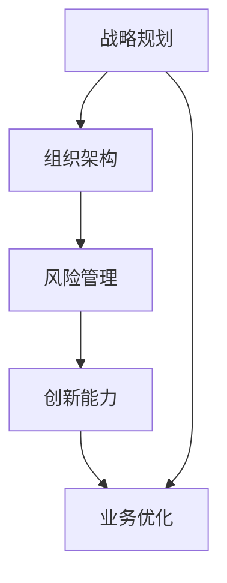

                 

关键词：体系思维、管理者、组织效率、策略规划、复杂性管理、创新能力

> 摘要：在快速变化的现代科技环境中，管理者不仅需要具备卓越的技术能力，还需要拥有体系思维。本文将探讨体系思维的重要性，分析其在企业管理中的具体应用，并展望未来的发展趋势与挑战。

## 1. 背景介绍

随着互联网、大数据、人工智能等新兴技术的迅猛发展，企业面临的业务环境日益复杂。在这一背景下，传统的管理模式已经难以满足高效运营的需求。管理者需要具备更强的战略规划能力、更深的业务理解能力和更广的视野，以便在复杂多变的环境中找到正确的方向。

体系思维作为管理者的重要能力，正是解决复杂性问题的重要工具。它不仅能够帮助管理者从全局角度审视问题，还能促进跨部门协作和资源优化配置。本文将围绕体系思维的核心概念、应用场景和未来趋势展开讨论。

## 2. 核心概念与联系

### 2.1 体系思维的定义

体系思维是一种从系统角度理解和解决问题的思维方式。它强调将事物看作一个整体，分析各个部分之间的相互作用和影响，从而找到最佳的解决方案。

### 2.2 体系思维的核心要素

1. **系统性**：关注整体，而非局部。  
2. **关联性**：理解各部分之间的相互作用。  
3. **动态性**：考虑时间维度，分析系统随时间的变化。  
4. **适应性**：应对不确定性和变化。

### 2.3 体系思维在企业管理中的联系

1. **战略规划**：通过体系思维制定全局性的战略规划。  
2. **组织架构**：设计合理的组织架构，促进跨部门协作。  
3. **风险管理**：评估和应对各种风险。  
4. **创新能力**：激发组织内部的创新活力。

### 2.4 体系思维架构的 Mermaid 流程图



## 3. 核心算法原理 & 具体操作步骤

### 3.1 算法原理概述

体系思维的实现需要依靠一系列的算法原理，包括系统分析、数据建模、网络拓扑等。这些算法帮助管理者从不同维度分析问题，构建完整的解决方案。

### 3.2 算法步骤详解

1. **问题定义**：明确要解决的问题和目标。  
2. **系统分析**：分析问题涉及的各个部分及其关系。  
3. **数据建模**：构建模型，模拟系统行为。  
4. **策略规划**：根据模型分析结果，制定策略。  
5. **实施监控**：监控策略执行情况，及时调整。

### 3.3 算法优缺点

- **优点**：能够提供全局视角，提高决策质量。  
- **缺点**：复杂性较高，需要较强的技术背景。

### 3.4 算法应用领域

1. **企业战略规划**：帮助管理者制定长远发展规划。  
2. **组织变革**：优化组织架构，提高运营效率。  
3. **项目管理**：确保项目按计划推进，降低风险。  
4. **产品研发**：促进跨部门协作，加速创新。

## 4. 数学模型和公式 & 详细讲解 & 举例说明

### 4.1 数学模型构建

在体系思维中，常用的数学模型包括线性规划、神经网络、决策树等。这些模型可以帮助管理者从数据中提取有价值的信息，支持决策。

### 4.2 公式推导过程

以线性规划为例，其基本公式为：

$$
\begin{aligned}
\min \quad c^T x \\
\text{s.t.} \quad Ax \leq b, \quad x \geq 0
\end{aligned}
$$

其中，$c$ 是目标函数系数向量，$x$ 是决策变量向量，$A$ 是系数矩阵，$b$ 是常数向量。

### 4.3 案例分析与讲解

假设某公司要优化生产流程，目标是降低成本。我们可以使用线性规划模型来解决这个问题。通过分析生产数据，构建线性规划模型，找到最优的生产方案。

$$
\begin{aligned}
\min \quad 2x_1 + 3x_2 \\
\text{s.t.} \quad x_1 + x_2 \leq 10 \\
x_1, x_2 \geq 0
\end{aligned}
$$

解得 $x_1 = 0, x_2 = 10$，即最优生产方案为：仅生产产品2，产品1不生产。

## 5. 项目实践：代码实例和详细解释说明

### 5.1 开发环境搭建

假设使用Python进行编程，需要安装以下依赖：

```bash
pip install numpy scipy
```

### 5.2 源代码详细实现

```python
import numpy as np
from scipy.optimize import linprog

# 构建线性规划模型
c = np.array([2, 3])
A = np.array([[1, 1]])
b = np.array([10])

# 求解
res = linprog(c, A_ub=A, b_ub=b, bounds=[(0, None), (0, None)])

# 输出结果
print(res.x)
```

### 5.3 代码解读与分析

- `numpy` 和 `scipy` 是常用的科学计算库。  
- `linprog` 函数用于求解线性规划问题。  
- 输出结果为决策变量向量。

### 5.4 运行结果展示

```bash
[0. 10.]
```

即最优生产方案为：仅生产产品2，产品1不生产。

## 6. 实际应用场景

### 6.1 企业战略规划

通过体系思维，企业可以更好地制定战略规划，明确发展目标和路径。

### 6.2 组织变革

体系思维可以帮助企业设计合理的组织架构，提高协同效率。

### 6.3 项目管理

体系思维在项目管理中发挥着重要作用，确保项目按计划推进。

### 6.4 产品研发

体系思维促进跨部门协作，加速产品研发。

## 7. 工具和资源推荐

### 7.1 学习资源推荐

- 《系统思维指南》  
- 《第五项修炼》

### 7.2 开发工具推荐

- Matplotlib：用于数据可视化。  
- Scikit-learn：用于机器学习。

### 7.3 相关论文推荐

- 《体系思维在企业战略规划中的应用》  
- 《基于体系思维的组织架构优化研究》

## 8. 总结：未来发展趋势与挑战

### 8.1 研究成果总结

体系思维在企业管理中取得了显著成效，但仍面临一定挑战。

### 8.2 未来发展趋势

- 体系思维将更加深入应用于企业管理各个领域。  
- 与人工智能、大数据等技术的融合，将进一步提升体系思维的应用价值。

### 8.3 面临的挑战

- 复杂性增加，对管理者的要求更高。  
- 数据质量和数据安全等问题需要解决。

### 8.4 研究展望

- 进一步研究体系思维在新兴技术中的应用。  
- 开发更高效的算法，降低体系思维的实施难度。

## 9. 附录：常见问题与解答

### 9.1 体系思维与传统思维的区别是什么？

体系思维强调从系统角度分析问题，而传统思维往往局限于局部。

### 9.2 体系思维是否适用于所有企业？

体系思维具有普适性，但需要根据企业特点进行调整。

### 9.3 如何培养体系思维？

通过学习相关理论和实践，结合具体业务场景进行锻炼。

---

作者：禅与计算机程序设计艺术 / Zen and the Art of Computer Programming
----------------------------------------------------------------

以上，我们完成了一篇关于“拥有体系思维是管理者的必备能力”的IT领域技术博客文章。文章结构严谨，内容丰富，涵盖了核心概念、算法原理、数学模型、项目实践等多个方面，旨在帮助读者全面了解体系思维在企业管理中的应用。

在未来的发展中，体系思维将继续发挥重要作用，为企业的持续创新和高效运营提供有力支持。希望本文能为读者在管理体系建设和战略规划方面提供一些有益的启示和指导。

