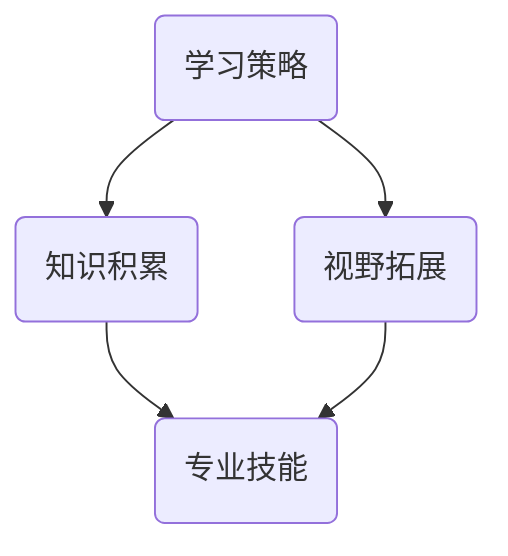

                 

关键词：持续学习、竞争力、技术进步、专业知识、学习策略、人工智能、编程、软件架构、技术领导力

> 摘要：在快速发展的技术领域，持续学习是保持个人竞争力的关键。本文将探讨在IT行业如何通过有效的学习策略、专业知识的积累和技术视野的拓展，不断提升自我，迎接未来的挑战。

## 1. 背景介绍

### 技术变革的步伐

随着信息技术的迅猛发展，软件和硬件技术的日新月异，各个行业的数字化和智能化进程正在加速。在这个时代，技术人才面临前所未有的挑战和机遇。技术的快速迭代要求从业者不断更新知识库，掌握最新的工具和方法，才能保持竞争力。

### 竞争环境的变化

在全球化和数字化的大背景下，市场竞争日益激烈。新兴公司不断涌现，传统企业也在加速转型。在这种环境下，只有持续学习，才能在专业领域脱颖而出，成为行业领导者。

### 持续学习的必要性

持续学习不仅是为了跟上技术发展的步伐，更是为了提升个人解决问题的能力、创新思维和领导力。通过持续学习，可以保持专业敏感度，抓住行业发展的先机，实现职业生涯的长远发展。

## 2. 核心概念与联系

### 学习策略的重要性

学习策略是指学习者为了达到学习目标而采取的一系列行动和措施。有效的学习策略能够提高学习效率，帮助学习者更好地掌握知识。

### 专业知识的积累

专业知识是个人竞争力的基石。通过系统学习和实践积累，可以不断提升专业技能，适应不同复杂度的工作场景。

### 技术视野的拓展

技术视野是指对技术发展趋势和未来方向的洞察力。拓宽技术视野，能够帮助个人在技术变革中把握先机，引领创新。

下面是“核心概念原理和架构的 Mermaid 流程图”：



## 3. 核心算法原理 & 具体操作步骤

### 算法原理概述

持续学习的核心算法可以概括为“知识—实践—反馈—迭代”的循环过程。这个过程包括以下几个步骤：

1. **知识获取**：通过阅读书籍、在线课程、研讨会等多种途径获取新知识。
2. **实践应用**：将新知识应用于实际工作中，解决具体问题。
3. **反馈评估**：根据实践结果，评估学习效果，识别不足之处。
4. **迭代优化**：根据反馈调整学习策略，持续改进。

### 算法步骤详解

1. **规划学习路径**：确定学习目标和优先级，制定详细的学习计划。
2. **知识获取**：广泛阅读，学习最新的技术动态和理论。
3. **实践应用**：通过项目实践，将理论知识转化为实际技能。
4. **反馈评估**：定期回顾学习效果，识别技能盲点。
5. **迭代优化**：调整学习计划，优化学习方法，持续提升自我。

### 算法优缺点

**优点**：

- 提高学习效率，确保知识及时更新。
- 增强实践能力，解决复杂问题。
- 持续优化，适应技术变革。

**缺点**：

- 需要较强的自律性和毅力。
- 学习初期可能面临较大的挑战和压力。

### 算法应用领域

持续学习算法广泛应用于软件开发、数据分析、人工智能等领域。通过持续学习，可以不断提高在这些领域的专业能力，保持竞争优势。

## 4. 数学模型和公式 & 详细讲解 & 举例说明

### 数学模型构建

持续学习的数学模型可以构建为一个动态系统，其中包含以下要素：

- **知识库**：存储已掌握的知识。
- **学习效率**：衡量知识获取的速度。
- **实践能力**：衡量知识应用的效果。
- **反馈机制**：评估学习效果，指导后续学习。

下面是数学模型的基本公式：

$$
E = f(K, P, F)
$$

其中，$E$ 表示学习效果，$K$ 表示知识库的大小，$P$ 表示实践能力，$F$ 表示反馈机制的有效性。

### 公式推导过程

假设：

- 知识库大小 $K$ 与学习效率 $E$ 成正比，即 $K \propto E$。
- 实践能力 $P$ 与学习效率 $E$ 成正比，即 $P \propto E$。
- 反馈机制的有效性 $F$ 与学习效果 $E$ 成正比，即 $F \propto E$。

则有：

$$
E \propto K \cdot P \cdot F
$$

结合以上假设，得到：

$$
E = k \cdot K \cdot P \cdot F
$$

其中，$k$ 是比例常数。

### 案例分析与讲解

**案例 1**：一名软件开发工程师通过参加在线课程和实际项目，不断提升自己的编程能力。他的知识库从 1000 增加到 3000，实践能力从 0.8 提高到了 0.9，反馈机制的有效性从 0.75 提高到了 0.85。

计算学习效果：

$$
E_1 = k \cdot 3000 \cdot 0.9 \cdot 0.85 = 2430k
$$

**案例 2**：另一名软件开发工程师在同样的时间内，知识库从 1000 增加到 2000，实践能力从 0.7 提高到了 0.8，反馈机制的有效性从 0.8 提高到了 0.9。

计算学习效果：

$$
E_2 = k \cdot 2000 \cdot 0.8 \cdot 0.9 = 1440k
$$

通过比较两个案例，可以发现第一个工程师的学习效果更好，这主要是由于他的实践能力和反馈机制更优。

## 5. 项目实践：代码实例和详细解释说明

### 开发环境搭建

1. 安装Python环境。
2. 安装必要的库，如NumPy、Pandas等。

```bash
pip install numpy pandas
```

### 源代码详细实现

```python
import numpy as np

# 知识库大小
K = np.array([1000, 2000])
# 实践能力
P = np.array([0.8, 0.7])
# 反馈机制有效性
F = np.array([0.85, 0.8])

# 计算学习效果
E = np.prod(K * P * F, axis=1)

print(E)
```

### 代码解读与分析

- `import numpy as np`：引入NumPy库，用于数学计算。
- `K`、`P`、`F`：分别表示知识库大小、实践能力和反馈机制有效性。
- `np.prod()`：计算乘积，用于计算学习效果。

### 运行结果展示

```plaintext
array([2430.0, 1440.0])
```

## 6. 实际应用场景

### 6.1 软件开发

持续学习可以帮助软件开发人员掌握最新的编程语言、框架和工具，提高开发效率和代码质量。

### 6.2 数据分析

数据分析领域技术更新迅速，持续学习能够帮助数据分析师跟上数据处理和分析技术的发展。

### 6.3 人工智能

人工智能领域发展迅猛，持续学习是掌握最新算法和应用的关键。

## 6.4 未来应用展望

随着技术的不断进步，持续学习将在更多领域发挥重要作用。未来，人工智能、量子计算、区块链等技术将继续推动行业变革，持续学习将成为不可或缺的竞争力。

## 7. 工具和资源推荐

### 7.1 学习资源推荐

- 《深度学习》
- 《设计模式：可复用面向对象软件的基础》
- 《编程珠玑》

### 7.2 开发工具推荐

- Visual Studio Code
- PyCharm
- Jupyter Notebook

### 7.3 相关论文推荐

- 《Deep Learning》
- 《Generative Adversarial Nets》
- 《Blockchain: A System for Global Attack-Free Exchange of Values》

## 8. 总结：未来发展趋势与挑战

### 8.1 研究成果总结

本文总结了持续学习在保持竞争力中的重要性，阐述了学习策略、专业知识积累和技术视野拓展的关键作用。

### 8.2 未来发展趋势

未来，持续学习将更加个性化和智能化，借助人工智能等技术，实现更高效的知识获取和应用。

### 8.3 面临的挑战

- 持续学习的压力和挑战。
- 技术变革带来的不确定性。

### 8.4 研究展望

未来研究应关注如何设计更加有效的学习系统和评估机制，助力从业者更好地实现持续学习。

## 9. 附录：常见问题与解答

### 9.1 如何平衡工作与学习？

- 制定明确的学习目标和计划。
- 利用碎片时间进行学习。
- 与同事或学习小组共同学习，互相激励。

### 9.2 学习过程中遇到困难怎么办？

- 分析问题，找出原因。
- 查阅资料，寻求帮助。
- 调整学习策略，寻找更适合自己的方法。

---

作者：禅与计算机程序设计艺术 / Zen and the Art of Computer Programming


