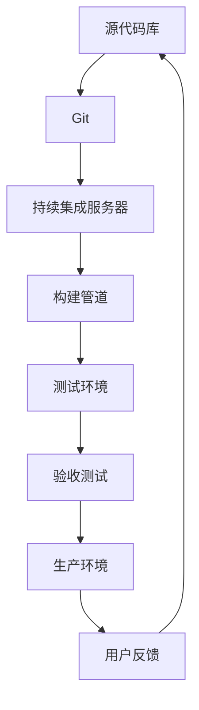

                 

持续部署（CD，Continuous Deployment）是一种软件开发方法，旨在通过自动化的方式，快速且安全地将代码更改部署到生产环境中。它显著提高了软件交付的速度和质量，同时降低了人工干预的风险。本文将深入探讨持续部署的核心概念、关键组件、最佳实践以及未来发展趋势。

## 关键词

- 持续部署
- 自动化
- CI/CD
- 构建管道
- 自动化测试
- 版本控制

## 摘要

本文将为您提供一个全面指南，介绍如何实施持续部署（CD）策略。我们将从背景介绍开始，逐步讲解核心概念、自动化部署流程、数学模型和公式、项目实践案例，以及实际应用场景。最后，我们将探讨持续部署的未来发展趋势和面临的挑战。

## 1. 背景介绍

在软件开发领域，传统的方法是将代码更新手动部署到生产环境，这不仅耗时且容易出错。随着软件复杂性的增加和迭代速度的加快，这种方法已经无法满足现代软件开发的快速迭代和高质量交付的要求。

持续部署（CD）作为DevOps文化的一部分，旨在通过自动化工具和流程，实现持续集成（CI）和持续部署。这种方法可以显著减少部署时间，提高部署频率，同时确保软件质量。

### 持续部署的核心原则

- **自动化**：通过自动化工具，实现从代码提交到生产环境部署的整个流程。
- **频繁部署**：频繁地部署代码更改，以快速响应客户需求和反馈。
- **质量保证**：在部署过程中，通过自动化测试确保软件质量。
- **快速反馈**：快速收集部署反馈，以便及时调整和优化部署流程。

## 2. 核心概念与联系

### 架构图



### 组件介绍

- **源代码库**：代码存储的地方，如Git仓库。
- **持续集成服务器**：自动化构建和测试代码更改的中央系统。
- **构建管道**：将代码从源代码库提取出来，构建和测试的过程。
- **测试环境**：用于运行自动化测试的环境。
- **验收测试**：确保软件满足业务需求的测试。
- **生产环境**：软件最终部署运行的环境。
- **用户反馈**：从用户收集的反馈，用于优化软件。

## 3. 核心算法原理 & 具体操作步骤

### 3.1 算法原理概述

持续部署的核心在于自动化，将代码从提交到生产环境部署的过程自动化。这通常包括以下几个步骤：

1. **代码提交**：开发者将代码提交到源代码库。
2. **构建**：持续集成服务器提取提交的代码并构建。
3. **测试**：构建过程中运行自动化测试，确保代码质量。
4. **部署**：测试通过后，代码被部署到测试环境或生产环境。
5. **反馈**：收集用户反馈，用于优化部署流程。

### 3.2 算法步骤详解

1. **设置源代码库**：选择合适的版本控制系统，如Git，并将其与持续集成服务器关联。
2. **配置持续集成服务器**：设置构建管道，包括构建脚本、测试脚本等。
3. **编写测试脚本**：编写自动化测试脚本，确保代码质量。
4. **部署脚本**：编写部署脚本，用于将代码部署到测试环境或生产环境。
5. **监控和反馈**：设置监控工具，收集部署过程中的数据，并根据用户反馈进行优化。

### 3.3 算法优缺点

#### 优点

- **提高部署速度**：自动化部署可以快速地将代码更改部署到生产环境。
- **提高软件质量**：通过自动化测试，确保每次部署的代码质量。
- **降低风险**：减少手动干预，降低部署过程中出错的风险。
- **快速反馈**：及时收集用户反馈，快速响应市场需求。

#### 缺点

- **初始设置复杂**：需要配置持续集成服务器、构建管道和测试环境。
- **需要持续维护**：自动化流程需要定期维护和优化。

### 3.4 算法应用领域

持续部署适用于各种软件开发项目，尤其是那些需要快速迭代和高质量交付的项目。例如，互联网服务、移动应用、企业级应用等。

## 4. 数学模型和公式 & 详细讲解 & 举例说明

### 4.1 数学模型构建

持续部署的数学模型可以看作是一个反馈循环系统，其中质量指标（如测试覆盖率、缺陷率）作为输出，反馈作为输入，用于调整部署流程。

$$
反馈 = \frac{缺陷数}{测试用例数}
$$

### 4.2 公式推导过程

公式的推导基于以下假设：

- **缺陷数**：每次部署后，测试发现的问题数量。
- **测试用例数**：每次部署时运行的测试用例数量。

### 4.3 案例分析与讲解

假设一个持续部署系统，每次部署后测试用例数为1000，当前缺陷数为10。根据公式，反馈为：

$$
反馈 = \frac{10}{1000} = 0.01
$$

这意味着每次部署的缺陷率为1%。如果连续几次部署的缺陷率都高于这个阈值，可以认为部署流程需要优化。

## 5. 项目实践：代码实例和详细解释说明

### 5.1 开发环境搭建

搭建一个持续部署环境需要以下步骤：

1. 安装Git：用于版本控制。
2. 安装Jenkins：用于持续集成和持续部署。
3. 配置Jenkins：设置构建管道和测试脚本。
4. 安装测试工具：如Selenium、JUnit等。
5. 配置部署脚本：用于将代码部署到测试或生产环境。

### 5.2 源代码详细实现

以下是一个简单的Jenkins构建管道配置示例：

```groovy
pipeline {
    agent any
    stages {
        stage('Checkout') {
            steps {
                git branch: 'master', url: 'https://github.com/user/repo.git'
            }
        }
        stage('Build') {
            steps {
                sh 'mvn clean install'
            }
        }
        stage('Test') {
            steps {
                sh 'mvn test'
            }
        }
        stage('Deploy') {
            steps {
                sh 'java -jar deploy.jar'
            }
        }
    }
    post {
        always {
            echo 'Deployment completed'
        }
    }
}
```

### 5.3 代码解读与分析

- **Checkout**：从Git仓库检出代码。
- **Build**：构建项目。
- **Test**：运行测试。
- **Deploy**：部署代码。

### 5.4 运行结果展示

当提交代码后，Jenkins会自动触发构建管道，执行以上步骤。如果所有步骤都成功完成，会显示“Deployment completed”信息。

## 6. 实际应用场景

持续部署在许多行业中都有广泛的应用，例如：

- **金融科技**：快速迭代和发布新功能，以保持竞争优势。
- **电子商务**：实时更新商品信息，提供更好的用户体验。
- **社交媒体**：频繁更新功能和界面，以吸引更多用户。

## 6.4 未来应用展望

随着人工智能和机器学习的不断发展，持续部署将会更加智能化。例如，使用机器学习算法来自动化测试和优化部署流程，提高软件质量和效率。

## 7. 工具和资源推荐

### 7.1 学习资源推荐

- 《持续交付：释放软件的速度》
- 《Jenkins实战》
- 《Git权威指南》

### 7.2 开发工具推荐

- Jenkins：用于持续集成和持续部署。
- Git：用于版本控制。
- Docker：用于容器化部署。

### 7.3 相关论文推荐

- "Continuous Integration in the Cloud" by Martin Fowler
- "Building, Testing, and Delivering Cloud Applications" by Microsoft Azure

## 8. 总结：未来发展趋势与挑战

### 8.1 研究成果总结

持续部署在提高软件交付速度和质量方面取得了显著成果。随着自动化和人工智能技术的发展，持续部署将变得更加智能化和高效。

### 8.2 未来发展趋势

- 更加智能化的自动化测试和部署流程。
- 容器化部署的普及。
- 与云计算的深度融合。

### 8.3 面临的挑战

- 需要持续维护和优化的自动化流程。
- 高度复杂的系统架构带来的挑战。

### 8.4 研究展望

持续部署将继续在软件开发领域发挥重要作用。未来研究方向包括：更加智能的自动化测试、优化部署流程和架构设计。

## 9. 附录：常见问题与解答

### Q：持续部署需要多长时间设置？

A：设置一个持续部署环境的时间因项目规模和复杂性而异，通常需要几天到几周。

### Q：持续部署是否适用于所有项目？

A：持续部署适用于大多数软件开发项目，尤其是需要快速迭代和高质量交付的项目。

### Q：如何处理持续部署中的错误？

A：使用错误跟踪工具，如JIRA，记录和追踪错误，并迅速修复。

## 参考文献

- Fowler, M. (2006). *Continuous Integration*. Agile Alliance.
- Humble, J., & Farley, D. (2016). *Continuous Delivery: Reliable Software Releases Through Build, Test, and Deployment Automation*. Pragmatic Bookshelf.
- Hildebrandt, J. (2015). *Jenkins: The Definitive Guide*. O'Reilly Media.

## 作者署名

作者：禅与计算机程序设计艺术 / Zen and the Art of Computer Programming

----------------------------------------------------------------

以上内容是一个完整的、详细的技术博客文章框架，您可以根据这个框架和指南来撰写您的文章。请注意，本文仅供参考，您需要根据自己的研究和实践经验来丰富和调整内容。祝您撰写成功！

