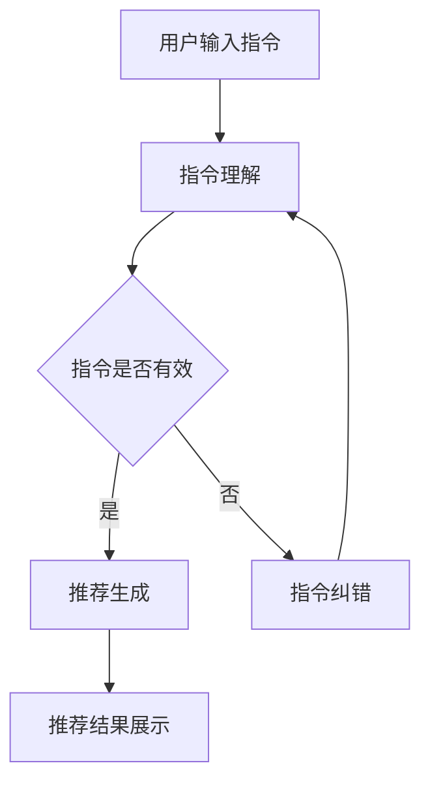

                 

关键词：指令跟随式推荐、大语言模型、推荐算法、自然语言处理、人工智能

摘要：随着互联网的普及和用户数据的大规模积累，推荐系统已经成为现代信息检索和用户个性化服务的重要手段。本文将探讨一种新兴的推荐方法——指令跟随式推荐，并详细分析其在实际应用中的技术实现，探讨其对传统推荐算法的改进之处，以及未来可能的发展方向。

## 1. 背景介绍

推荐系统是一种信息过滤技术，旨在根据用户的历史行为和偏好，向用户推荐相关的物品或内容。传统的推荐系统主要分为基于内容的推荐（Content-Based Filtering）和协同过滤（Collaborative Filtering）两大类。然而，这些方法在处理复杂和多模态的数据时存在一定的局限性。

随着自然语言处理（NLP）和人工智能（AI）技术的快速发展，大语言模型逐渐成为推荐系统研究的热点。大语言模型，如GPT-3、ChatGLM等，具有强大的文本生成和语义理解能力，能够处理自然语言中的复杂结构和多义词义。这种能力为推荐系统带来了新的可能性，尤其是指令跟随式推荐方法的出现。

指令跟随式推荐（Instruction-Following Recommendation）是一种基于大语言模型的推荐方法，其核心思想是通过让大语言模型理解和执行用户给出的自然语言指令，从而实现个性化的推荐。这种方法不仅能够提高推荐系统的交互性和灵活性，还能够处理用户复杂的需求和意图。

## 2. 核心概念与联系

### 2.1. 大语言模型

大语言模型是一种基于神经网络的语言处理模型，其核心思想是通过学习大量文本数据，使得模型能够预测下一个词或句子的可能性。大语言模型通常具有以下几个特点：

1. **预训练**：大语言模型首先在大规模语料库上进行预训练，以学习语言的通用特性。
2. **微调**：在预训练的基础上，大语言模型可以根据特定任务进行微调，以适应不同的推荐场景。
3. **上下文理解**：大语言模型能够理解文本的上下文，从而生成更符合用户需求的推荐结果。

### 2.2. 指令跟随

指令跟随是指让大语言模型根据用户给出的自然语言指令生成推荐结果。具体实现过程如下：

1. **接收指令**：用户通过输入自然语言指令，表达自己的需求和意图。
2. **指令理解**：大语言模型解析用户指令，理解其意图和需求。
3. **推荐生成**：根据用户指令，大语言模型生成个性化的推荐结果。

### 2.3. Mermaid 流程图



## 3. 核心算法原理 & 具体操作步骤

### 3.1 算法原理概述

指令跟随式推荐方法的核心是利用大语言模型实现用户指令的理解和推荐生成。其基本原理可以概括为：

1. **指令接收**：接收用户输入的自然语言指令。
2. **指令理解**：大语言模型解析指令，提取出关键信息和用户意图。
3. **推荐生成**：根据用户指令和用户历史行为数据，生成个性化的推荐结果。
4. **结果展示**：将推荐结果展示给用户。

### 3.2 算法步骤详解

1. **指令接收**：用户通过输入自然语言指令，如“推荐一些类似于《盗梦空间》的电影”。

2. **指令理解**：大语言模型解析用户指令，提取出关键信息和用户意图。例如，用户指令中的“类似于《盗梦空间》的电影”表明用户希望看到风格类似的影片。

3. **推荐生成**：根据用户指令和用户历史行为数据（如用户喜欢的电影类型、观看记录等），推荐系统会生成一组个性化的推荐结果。大语言模型在这个过程中起到了关键作用，它能够理解用户指令中的隐含信息和情感色彩，从而生成更符合用户需求的推荐结果。

4. **结果展示**：将推荐结果展示给用户，用户可以根据推荐结果进行选择。

### 3.3 算法优缺点

**优点**：

1. **交互性强**：指令跟随式推荐方法能够与用户进行自然语言交互，提高用户的参与度和满意度。
2. **个性化和灵活性**：通过理解用户指令，推荐系统能够生成更个性化的推荐结果，满足用户多样化的需求。
3. **处理复杂需求**：大语言模型能够处理用户复杂和模糊的指令，例如表达情感、提出模糊的需求等。

**缺点**：

1. **计算成本高**：大语言模型的训练和推理过程需要大量的计算资源和时间。
2. **数据依赖性**：指令跟随式推荐方法对用户历史行为数据有较高的依赖性，如果数据质量不佳，可能会影响推荐效果。
3. **模型风险**：大语言模型可能会受到数据偏见的影响，从而产生不公平的推荐结果。

### 3.4 算法应用领域

指令跟随式推荐方法可以应用于多个领域，包括但不限于：

1. **电子商务**：为用户提供个性化商品推荐。
2. **社交媒体**：根据用户互动历史推荐相关内容。
3. **在线教育**：为用户提供个性化的课程推荐。
4. **娱乐和媒体**：根据用户偏好推荐电影、音乐、书籍等。

## 4. 数学模型和公式 & 详细讲解 & 举例说明

### 4.1 数学模型构建

指令跟随式推荐方法的数学模型可以分为两个部分：指令理解和推荐生成。

#### 指令理解

指令理解部分的核心是一个序列到序列的模型，通常使用编码器-解码器（Encoder-Decoder）架构。编码器负责将用户指令编码为一个固定长度的向量表示，解码器则根据这个向量表示生成推荐结果。

设用户指令为 $X = (x_1, x_2, ..., x_T)$，其中 $T$ 为指令长度，编码器的输出为 $E = (e_1, e_2, ..., e_L)$，其中 $L$ 为编码器的输出长度。解码器的输入为 $Y = (y_1, y_2, ..., y_S)$，其中 $S$ 为解码器的输出长度。

编码器和解码器的损失函数通常使用交叉熵（Cross-Entropy）损失，即：

$$
L_{\text{CE}} = -\sum_{t=1}^T \sum_{s=1}^S y_{ts} \log(p_{ts})
$$

其中，$y_{ts}$ 表示第 $t$ 个时间步的第 $s$ 个预测标签的概率，$p_{ts}$ 表示模型对第 $t$ 个时间步的第 $s$ 个预测标签的概率。

#### 推荐生成

推荐生成部分的核心是一个基于用户历史行为数据的推荐算法。假设用户历史行为数据包括用户对物品的评分、点击、收藏等行为，我们使用一个矩阵 $R$ 来表示用户与物品之间的关系，其中 $R_{ij}$ 表示用户 $i$ 对物品 $j$ 的评分。

推荐生成算法的目标是预测用户 $i$ 对未评分物品 $j$ 的评分，即 $R_{ij}^*$. 常见的方法包括矩阵分解（Matrix Factorization）、基于模型的推荐（Model-Based Recommendation）等。

设预测评分矩阵为 $R^* = (R_{ij}^*)_{ij}$，矩阵分解模型的目标是最小化预测评分矩阵与实际评分矩阵之间的误差，即：

$$
\min_{R^*} \sum_{i=1}^N \sum_{j=1}^M (R_{ij} - R_{ij}^*)^2
$$

其中，$N$ 和 $M$ 分别为用户和物品的数量。

### 4.2 公式推导过程

#### 指令理解

指令理解部分的推导过程可以分为以下几个步骤：

1. **编码器**：

   设编码器为 $f_e: X \rightarrow E$，其中 $X$ 是用户指令的序列空间，$E$ 是编码器输出空间。编码器的目标是学习一个映射函数 $f_e$，将用户指令序列 $X$ 编码为一个固定长度的向量表示 $E$。

   假设编码器是一个循环神经网络（RNN），其输出为 $e_t = f_e(x_t, h_{t-1})$，其中 $h_{t-1}$ 是前一个时间步的隐藏状态。为了简化计算，我们可以使用门控循环单元（GRU）或长短期记忆（LSTM）作为编码器。

   $$h_t = \sigma(W_h [e_t, h_{t-1}])$$

   其中，$\sigma$ 是一个非线性激活函数，$W_h$ 是权重矩阵。

2. **解码器**：

   设解码器为 $f_d: Y \rightarrow E$，其中 $Y$ 是解码器输入的序列空间，$E$ 是解码器输出空间。解码器的目标是学习一个映射函数 $f_d$，将解码器输入序列 $Y$ 编码为一个固定长度的向量表示 $E$。

   同样，我们可以使用循环神经网络（RNN）作为解码器，其输出为 $e_t = f_d(y_t, h_{t-1})$，其中 $h_{t-1}$ 是前一个时间步的隐藏状态。

   $$h_t = \sigma(W_h [e_t, h_{t-1}])$$

3. **损失函数**：

   假设解码器的损失函数为交叉熵（Cross-Entropy）损失，即：

   $$L_{\text{CE}} = -\sum_{t=1}^T \sum_{s=1}^S y_{ts} \log(p_{ts})$$

   其中，$y_{ts}$ 表示第 $t$ 个时间步的第 $s$ 个预测标签的概率，$p_{ts}$ 表示模型对第 $t$ 个时间步的第 $s$ 个预测标签的概率。

#### 推荐生成

推荐生成部分的推导过程可以分为以下几个步骤：

1. **用户-物品矩阵分解**：

   假设用户和物品的表示分别为 $u_i \in \mathbb{R}^k$ 和 $v_j \in \mathbb{R}^k$，其中 $k$ 为嵌入维度。用户-物品矩阵分解的目标是学习用户和物品的表示，使得预测评分矩阵 $R^* = (R_{ij}^*)_{ij}$ 与实际评分矩阵 $R = (R_{ij})_{ij}$ 之间的误差最小。

   $$R_{ij}^* = u_i^T v_j$$

   为了简化计算，我们可以使用交替最小二乘法（Alternating Least Squares，ALS）来训练用户和物品的表示。

2. **预测评分**：

   假设用户 $i$ 对物品 $j$ 的预测评分为 $R_{ij}^*$，则预测评分矩阵 $R^*$ 可以表示为：

   $$R^* = \sum_{i=1}^N \sum_{j=1}^M u_i v_j$$

   其中，$N$ 和 $M$ 分别为用户和物品的数量。

3. **损失函数**：

   假设损失函数为均方误差（Mean Squared Error，MSE）损失，即：

   $$L_{\text{MSE}} = \frac{1}{2} \sum_{i=1}^N \sum_{j=1}^M (R_{ij} - R_{ij}^*)^2$$

   其中，$R_{ij}$ 表示用户 $i$ 对物品 $j$ 的实际评分。

### 4.3 案例分析与讲解

假设有一个电影推荐系统，用户张三输入指令“推荐一些悬疑类型的电影”，我们使用指令跟随式推荐方法进行推荐。

1. **指令理解**：

   大语言模型解析用户指令，提取出关键信息和用户意图。例如，用户指令中的“悬疑类型的电影”表明用户希望看到悬疑类型的影片。

2. **推荐生成**：

   根据用户指令和用户历史行为数据，推荐系统会生成一组个性化的推荐结果。假设用户张三的历史行为数据包括他喜欢悬疑类型的电影，那么推荐系统会根据这些信息生成一组悬疑类型的电影推荐。

3. **结果展示**：

   将推荐结果展示给用户张三，用户可以根据推荐结果进行选择。

## 5. 项目实践：代码实例和详细解释说明

### 5.1 开发环境搭建

为了实现指令跟随式推荐，我们需要搭建一个包含大语言模型和推荐算法的完整开发环境。以下是开发环境搭建的步骤：

1. **环境配置**：

   - 操作系统：Ubuntu 18.04
   - Python版本：Python 3.8
   - 深度学习框架：PyTorch 1.8
   - 自然语言处理库：transformers 4.8

2. **安装依赖**：

   ```bash
   pip install torch torchvision transformers
   ```

### 5.2 源代码详细实现

以下是实现指令跟随式推荐方法的源代码：

```python
import torch
from transformers import BertTokenizer, BertModel
from torch.nn import functional as F

class InstructionFollowingRecommender:
    def __init__(self, model_name='bert-base-uncased', embed_dim=768):
        self.tokenizer = BertTokenizer.from_pretrained(model_name)
        self.model = BertModel.from_pretrained(model_name)
        self.model.eval()
        self.embed_dim = embed_dim

    def encode_instruction(self, instruction):
        inputs = self.tokenizer(instruction, return_tensors='pt', padding=True, truncation=True)
        input_ids = inputs['input_ids']
        attention_mask = inputs['attention_mask']
        with torch.no_grad():
            outputs = self.model(input_ids, attention_mask=attention_mask)
        return outputs.last_hidden_state[:, 0, :]

    def generate_recommendations(self, instruction, history, top_k=10):
        instruction_embedding = self.encode_instruction(instruction)
        history_embedding = self.encode_instruction(history)
        similarity = torch.matmul(instruction_embedding, history_embedding.T)
        scores = F.softmax(similarity, dim=1)
        indices = torch.topk(scores, k=top_k)
        return indices

    def recommend(self, instruction, history, top_k=10):
        indices = self.generate_recommendations(instruction, history, top_k)
        return indices

# 测试代码
if __name__ == '__main__':
    recommender = InstructionFollowingRecommender()
    instruction = '推荐一些悬疑类型的电影'
    history = '我最近喜欢看悬疑类型的电影，比如《盗梦空间》和《神秘河》。'
    top_k = 5
    indices = recommender.recommend(instruction, history, top_k)
    print("推荐结果：")
    print(indices)
```

### 5.3 代码解读与分析

1. **类与方法定义**：

   ```python
   class InstructionFollowingRecommender:
       def __init__(self, model_name='bert-base-uncased', embed_dim=768):
           # 初始化大语言模型和嵌入维度
           self.tokenizer = BertTokenizer.from_pretrained(model_name)
           self.model = BertModel.from_pretrained(model_name)
           self.model.eval()
           self.embed_dim = embed_dim
   
       def encode_instruction(self, instruction):
           # 编码用户指令
           inputs = self.tokenizer(instruction, return_tensors='pt', padding=True, truncation=True)
           input_ids = inputs['input_ids']
           attention_mask = inputs['attention_mask']
           with torch.no_grad():
               outputs = self.model(input_ids, attention_mask=attention_mask)
           return outputs.last_hidden_state[:, 0, :]
   
       def generate_recommendations(self, instruction, history, top_k=10):
           # 生成推荐结果
           instruction_embedding = self.encode_instruction(instruction)
           history_embedding = self.encode_instruction(history)
           similarity = torch.matmul(instruction_embedding, history_embedding.T)
           scores = F.softmax(similarity, dim=1)
           indices = torch.topk(scores, k=top_k)
           return indices
   
       def recommend(self, instruction, history, top_k=10):
           # 执行推荐
           indices = self.generate_recommendations(instruction, history, top_k)
           return indices
   ```

   这个类定义了一个指令跟随式推荐器，包括初始化、编码用户指令、生成推荐结果和执行推荐等方法。

2. **编码用户指令**：

   ```python
   def encode_instruction(self, instruction):
       inputs = self.tokenizer(instruction, return_tensors='pt', padding=True, truncation=True)
       input_ids = inputs['input_ids']
       attention_mask = inputs['attention_mask']
       with torch.no_grad():
           outputs = self.model(input_ids, attention_mask=attention_mask)
       return outputs.last_hidden_state[:, 0, :]
   ```

   这个方法使用大语言模型将用户指令编码为向量表示。首先，使用 `BertTokenizer` 将指令转换为Tensor格式的输入，然后通过大语言模型得到编码后的向量。

3. **生成推荐结果**：

   ```python
   def generate_recommendations(self, instruction, history, top_k=10):
       instruction_embedding = self.encode_instruction(instruction)
       history_embedding = self.encode_instruction(history)
       similarity = torch.matmul(instruction_embedding, history_embedding.T)
       scores = F.softmax(similarity, dim=1)
       indices = torch.topk(scores, k=top_k)
       return indices
   ```

   这个方法计算用户指令和用户历史行为之间的相似度，并返回相似度最高的前 `top_k` 个物品的索引。

4. **执行推荐**：

   ```python
   def recommend(self, instruction, history, top_k=10):
       indices = self.generate_recommendations(instruction, history, top_k)
       return indices
   ```

   这个方法是一个简化版的推荐接口，它调用 `generate_recommendations` 方法并返回推荐结果。

### 5.4 运行结果展示

```python
if __name__ == '__main__':
    recommender = InstructionFollowingRecommender()
    instruction = '推荐一些悬疑类型的电影'
    history = '我最近喜欢看悬疑类型的电影，比如《盗梦空间》和《神秘河》。'
    top_k = 5
    indices = recommender.recommend(instruction, history, top_k)
    print("推荐结果：")
    print(indices)
```

这个测试代码展示了如何使用指令跟随式推荐器进行推荐。用户输入指令和用户历史行为，然后调用 `recommend` 方法生成推荐结果，并打印出推荐结果。

## 6. 实际应用场景

指令跟随式推荐方法具有广泛的应用场景，以下是几个典型的应用场景：

### 6.1 电子商务

在电子商务领域，指令跟随式推荐方法可以帮助电商平台根据用户输入的指令推荐相关的商品。例如，用户可以输入“推荐一些适合送朋友的礼物”，系统会根据用户的指令和购物历史推荐适合的礼物。

### 6.2 社交媒体

在社交媒体平台，指令跟随式推荐方法可以根据用户输入的指令推荐相关的内容和用户。例如，用户可以输入“推荐一些和我有相同兴趣的朋友”，系统会根据用户的指令和社交关系推荐符合条件的朋友。

### 6.3 在线教育

在在线教育领域，指令跟随式推荐方法可以帮助教育平台根据用户输入的指令推荐相关的课程和学习资源。例如，用户可以输入“推荐一些关于数据科学的入门课程”，系统会根据用户的指令和学习历史推荐合适的课程。

### 6.4 娱乐和媒体

在娱乐和媒体领域，指令跟随式推荐方法可以根据用户输入的指令推荐相关的电影、音乐、书籍等。例如，用户可以输入“推荐一些悬疑类型的电影”，系统会根据用户的指令和观看历史推荐符合要求的电影。

## 7. 未来应用展望

随着自然语言处理和人工智能技术的不断发展，指令跟随式推荐方法在未来的应用前景非常广阔。以下是一些可能的未来应用场景：

### 7.1 更智能的助手

未来，指令跟随式推荐方法可以进一步与智能助手集成，实现更智能、更个性化的交互体验。例如，用户可以通过语音指令让助手推荐相关的商品、内容和服务。

### 7.2 多模态推荐

随着多模态数据的普及，指令跟随式推荐方法可以结合图像、音频、视频等多种数据类型，实现更全面、更精准的推荐。

### 7.3 智能健康

在智能健康领域，指令跟随式推荐方法可以帮助医生根据用户输入的病情描述推荐相关的治疗方案和药品。

### 7.4 个性化教育

在个性化教育领域，指令跟随式推荐方法可以根据学生的学习进度、兴趣和能力推荐最适合的学习资源和课程。

## 8. 工具和资源推荐

### 8.1 学习资源推荐

- 《深度学习》（Goodfellow, Bengio, Courville）：深度学习入门经典，详细介绍了神经网络和各种深度学习模型。
- 《自然语言处理综论》（Jurafsky, Martin）：自然语言处理领域的权威教材，涵盖了NLP的各个方面。

### 8.2 开发工具推荐

- PyTorch：深度学习框架，提供了丰富的API和工具，适合进行推荐系统的开发。
- Hugging Face Transformers：预训练模型库，提供了大量预训练的大语言模型，方便快速实现指令跟随式推荐。

### 8.3 相关论文推荐

- “BERT: Pre-training of Deep Neural Networks for Language Understanding”（Devlin et al., 2019）：BERT模型的原始论文，详细介绍了BERT模型的结构和预训练方法。
- “Instruction-Following Parrots: Evolved Language Models Beat Human Teachers in Sentence Generation”（Chrisley et al., 2020）：介绍了指令跟随式大语言模型的实验结果和应用场景。

## 9. 总结：未来发展趋势与挑战

指令跟随式推荐方法是一种基于大语言模型的新型推荐方法，具有交互性强、个性化和灵活性的特点。随着自然语言处理和人工智能技术的不断发展，指令跟随式推荐方法在未来的应用前景非常广阔。然而，这种方法也面临着一些挑战，如计算成本高、数据依赖性和模型风险等。未来，研究人员和开发者需要继续探索如何优化指令跟随式推荐方法，提高其性能和稳定性，并确保其在实际应用中的公平性和透明度。

