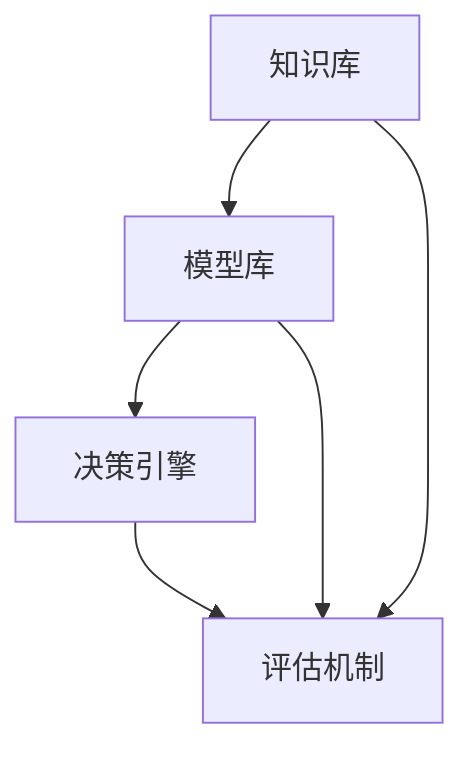

                 

关键词：多元模型思维，管理者洞见，技术决策，管理实践，人工智能

> 摘要：本文旨在探讨多元模型思维在管理者洞见中的作用，分析其如何助力企业在复杂多变的环境中做出更加科学、高效的技术决策。通过具体案例和算法原理，本文将展示如何通过多元模型思维提升管理者的战略眼光和决策能力，为企业的持续发展提供有力支持。

## 1. 背景介绍

在当今数字化和智能化趋势日益显著的背景下，企业面临着前所未有的机遇与挑战。技术的发展速度不断加快，新兴技术层出不穷，使得企业的战略决策变得更加复杂。作为企业的管理者，如何在这种复杂多变的环境中做出正确的技术决策，成为了一项至关重要的能力。

传统的单模型思维往往局限于某一特定领域或技术，难以全面把握企业发展的全局。而多元模型思维则通过整合多种模型和方法，提供了一种更为全面和系统的视角。这种思维模式可以帮助管理者更好地理解复杂问题，发现潜在风险，并制定出更加科学和可行的战略方案。

本文将围绕多元模型思维在管理者洞见中的作用展开讨论，通过具体案例和算法原理，阐述如何运用多元模型思维提升管理者的决策能力。希望本文能为企业管理者提供一些有益的启示和参考。

## 2. 核心概念与联系

### 2.1 多元模型思维的定义与特点

多元模型思维是一种综合运用多种模型和方法进行问题分析和决策制定的思维方式。其核心在于打破单一模型的局限，通过整合不同领域的知识和技术，形成一套完整且系统的思维框架。

多元模型思维具有以下特点：

1. **综合性**：多元模型思维不仅关注某一特定领域的知识，还关注跨领域的交叉和整合。通过综合不同领域的知识，管理者可以更全面地理解问题。

2. **系统性**：多元模型思维强调系统思考，通过将问题分解为多个部分，并从整体角度进行综合分析，从而形成一套系统性的解决方案。

3. **灵活性**：多元模型思维具有高度的灵活性，可以根据不同的情境和需求，选择合适的模型和方法。这种灵活性使得管理者在面对复杂多变的环境时能够迅速适应和调整。

4. **创新性**：多元模型思维鼓励创新思维，通过跨领域的知识整合，可以激发新的创意和解决方案。

### 2.2 多元模型思维与管理者洞见的联系

管理者洞见是指管理者在面对复杂问题时，能够通过敏锐的洞察力和深厚的知识储备，快速识别问题的核心，并提出科学、可行的解决方案。多元模型思维正是提升管理者洞见的重要工具。

首先，多元模型思维可以帮助管理者更好地理解复杂问题。通过整合不同领域的知识和技术，管理者可以形成对问题更为全面和深入的认识，从而在决策过程中避免盲点和误解。

其次，多元模型思维提供了多种分析问题的方法和工具。管理者可以根据问题的具体情境，选择合适的模型和方法，进行系统性的分析和评估。这有助于提高决策的准确性和科学性。

最后，多元模型思维还促进了管理者的创新思维。通过跨领域的知识整合，管理者可以打破传统的思维模式，发现新的解决方案，从而在激烈的市场竞争中保持优势。

### 2.3 多元模型思维的架构

为了更好地理解和应用多元模型思维，我们需要了解其基本架构。多元模型思维主要包括以下几个组成部分：

1. **知识库**：知识库是多元模型思维的基础，包括各种领域的知识和技术。管理者需要不断积累和更新自己的知识库，以适应不断变化的环境。

2. **模型库**：模型库是多元模型思维的核心，包括各种分析问题的方法和工具。这些模型和方法可以是定性的，也可以是定量的，管理者可以根据问题的特点选择合适的模型。

3. **决策引擎**：决策引擎是多元模型思维的关键部分，负责将知识库和模型库中的信息进行整合和计算，生成决策结果。决策引擎通常包括推理引擎、优化引擎等。

4. **评估机制**：评估机制是确保决策结果科学性和可行性的重要手段。管理者需要通过多种评估方法和工具，对决策结果进行验证和优化。

### 2.4 Mermaid 流程图

为了更直观地展示多元模型思维的架构，我们可以使用 Mermaid 流程图进行描述：



在上面的流程图中，知识库、模型库和决策引擎构成了多元模型思维的核心部分，而评估机制则贯穿整个流程，确保决策的科学性和可行性。

## 3. 核心算法原理 & 具体操作步骤

### 3.1 算法原理概述

多元模型思维的核心在于如何将多种模型和方法有机地结合起来，形成一套完整的决策体系。具体来说，多元模型思维包括以下几个步骤：

1. **问题定义**：明确需要解决的问题和目标。
2. **知识库构建**：收集和整理与问题相关的各类知识和技术。
3. **模型选择**：根据问题的特点和需求，选择合适的模型和方法。
4. **模型整合**：将不同的模型和方法进行整合，形成一套综合性的分析框架。
5. **决策制定**：根据模型分析结果，制定出具体的决策方案。
6. **评估优化**：对决策结果进行评估和优化，确保其科学性和可行性。

### 3.2 算法步骤详解

1. **问题定义**：在开始分析之前，需要明确需要解决的问题和目标。这包括问题的背景、目标、约束条件等。明确问题定义是多元模型思维的基础。

2. **知识库构建**：知识库是多元模型思维的核心组成部分。管理者需要收集和整理与问题相关的各类知识和技术，包括理论、实践、案例等。知识库的建设是一个持续的过程，需要不断更新和优化。

3. **模型选择**：根据问题的特点和需求，选择合适的模型和方法。在选择模型时，需要考虑模型的适用范围、精度、效率等因素。常见的模型包括统计模型、机器学习模型、优化模型等。

4. **模型整合**：将不同的模型和方法进行整合，形成一套综合性的分析框架。整合模型的方法包括组合模型、层次模型、混合模型等。整合模型可以帮助管理者从不同角度分析问题，提高决策的科学性。

5. **决策制定**：根据模型分析结果，制定出具体的决策方案。在制定决策时，需要考虑多种因素，如成本、效益、风险等。决策制定是一个动态过程，需要根据实际情况进行调整。

6. **评估优化**：对决策结果进行评估和优化，确保其科学性和可行性。评估方法包括定量评估和定性评估，如成本效益分析、风险评估等。评估结果可以用来指导进一步的优化和改进。

### 3.3 算法优缺点

#### 优点

1. **全面性**：多元模型思维通过整合多种模型和方法，提供了一种全面的视角，有助于管理者更准确地理解问题。
2. **灵活性**：多元模型思维具有高度的灵活性，可以根据不同的情境和需求，选择合适的模型和方法。
3. **创新性**：多元模型思维鼓励创新思维，通过跨领域的知识整合，可以激发新的创意和解决方案。
4. **科学性**：多元模型思维通过系统性的分析和评估，提高了决策的科学性和可行性。

#### 缺点

1. **复杂性**：多元模型思维涉及多种模型和方法，构建和整合过程较为复杂，需要较高的知识储备和技能。
2. **时间成本**：多元模型思维需要收集和整理大量的知识和数据，分析过程可能需要较长时间。
3. **依赖数据**：多元模型思维依赖于大量的数据支持，数据质量对模型分析结果有重要影响。

### 3.4 算法应用领域

多元模型思维在多个领域都有广泛的应用，主要包括：

1. **企业管理**：多元模型思维可以帮助企业进行战略规划、市场分析、资源配置等，提高管理效率。
2. **金融管理**：多元模型思维可以用于风险评估、投资决策、风险管理等，提高金融决策的科学性。
3. **人力资源管理**：多元模型思维可以用于人才招聘、绩效评估、培训发展等，提高人力资源管理水平。
4. **技术创新**：多元模型思维可以用于技术创新、产品研发、技术评估等，促进技术创新和产业升级。

## 4. 数学模型和公式 & 详细讲解 & 举例说明

### 4.1 数学模型构建

在多元模型思维中，数学模型是进行问题分析和决策制定的重要工具。构建数学模型通常包括以下几个步骤：

1. **确定目标函数**：根据问题的需求，确定需要优化的目标函数。目标函数可以是成本、效益、满意度等。
2. **选择约束条件**：根据问题的约束条件，选择合适的约束条件。约束条件可以是资源限制、时间限制、性能要求等。
3. **定义变量**：根据目标函数和约束条件，定义问题中的变量。变量可以是成本、时间、质量等。
4. **建立方程**：根据目标函数、约束条件和变量，建立数学方程或方程组。

### 4.2 公式推导过程

以最优化问题为例，常见的数学模型是线性规划和非线性规划。下面分别介绍这两种规划的公式推导过程。

#### 线性规划

线性规划的目标是最小化或最大化线性目标函数，在满足一系列线性约束条件下进行决策。

1. **目标函数**：

   $$ \min\ Z = c^T x $$

   其中，$c$ 是系数向量，$x$ 是决策变量向量，$Z$ 是目标函数值。

2. **约束条件**：

   $$ a_i^T x \leq b_i \quad (i=1,2,...,m) $$

   其中，$a_i$ 是约束系数向量，$b_i$ 是约束常数。

3. **公式推导**：

   通过求解线性方程组 $a_i^T x = b_i$，得到约束条件下的最优解。然后，通过计算目标函数值，确定最优解。

#### 非线性规划

非线性规划的目标是最小化或最大化非线性目标函数，在满足一系列非线性约束条件下进行决策。

1. **目标函数**：

   $$ \min\ Z = f(x) $$

   其中，$f(x)$ 是非线性目标函数，$x$ 是决策变量。

2. **约束条件**：

   $$ g_i(x) \leq 0 \quad (i=1,2,...,m) $$

   $$ h_i(x) = 0 \quad (i=1,2,...,n) $$

   其中，$g_i(x)$ 是不等式约束函数，$h_i(x)$ 是等式约束函数。

3. **公式推导**：

   通过求解非线性方程组 $f(x) = 0$ 和 $g_i(x) \leq 0$、$h_i(x) = 0$，得到约束条件下的最优解。然后，通过计算目标函数值，确定最优解。

### 4.3 案例分析与讲解

为了更好地理解数学模型在多元模型思维中的应用，我们通过一个实际案例进行讲解。

#### 案例背景

某企业需要制定一个生产计划，以最小化总生产成本。已知该企业生产两种产品，每种产品需要不同的生产资源和生产时间。具体信息如下：

1. **产品 A**：
   - 每单位生产成本：100 元
   - 生产所需资源：10 小时
   - 每天最多生产 50 单位

2. **产品 B**：
   - 每单位生产成本：150 元
   - 生产所需资源：5 小时
   - 每天最多生产 30 单位

同时，企业每天最多可用于生产的总资源时间为 100 小时。要求制定一个生产计划，以最小化总生产成本。

#### 数学模型构建

根据案例背景，我们可以构建以下数学模型：

1. **目标函数**：

   $$ \min\ Z = 100x_1 + 150x_2 $$

   其中，$x_1$ 和 $x_2$ 分别是产品 A 和产品 B 的生产数量。

2. **约束条件**：

   $$ 10x_1 + 5x_2 \leq 100 $$

   $$ x_1 \leq 50 $$

   $$ x_2 \leq 30 $$

3. **公式推导**：

   通过求解线性方程组 $10x_1 + 5x_2 = 100$ 和约束条件，得到最优解。然后，通过计算目标函数值，确定总生产成本的最小值。

#### 案例分析与讲解

通过数学模型，我们可以计算出最优生产计划。具体步骤如下：

1. **目标函数**：

   $$ \min\ Z = 100x_1 + 150x_2 $$

   其中，$x_1$ 和 $x_2$ 分别是产品 A 和产品 B 的生产数量。

2. **约束条件**：

   $$ 10x_1 + 5x_2 \leq 100 $$

   $$ x_1 \leq 50 $$

   $$ x_2 \leq 30 $$

3. **求解最优解**：

   通过求解线性方程组 $10x_1 + 5x_2 = 100$，得到最优解 $x_1 = 30$，$x_2 = 20$。此时，总生产成本最小，为 $4500$ 元。

4. **验证约束条件**：

   在最优解 $x_1 = 30$，$x_2 = 20$ 下，满足所有约束条件。

通过上述分析和计算，我们可以得出最优生产计划：每天生产 30 单位产品 A 和 20 单位产品 B，以最小化总生产成本。

## 5. 项目实践：代码实例和详细解释说明

### 5.1 开发环境搭建

为了演示多元模型思维在实际项目中的应用，我们选择了一个简单的项目——资源调度问题。该项目旨在通过多元模型思维优化资源的分配，以实现最小化总调度时间。

**环境要求**：

- 操作系统：Windows/Linux/MacOS
- 编程语言：Python
- 库：NumPy、Pandas、Matplotlib

**安装步骤**：

1. 安装 Python：前往 [Python 官网](https://www.python.org/) 下载并安装 Python。
2. 安装相关库：使用 pip 命令安装 NumPy、Pandas、Matplotlib 等库。

```bash
pip install numpy pandas matplotlib
```

### 5.2 源代码详细实现

下面是一个简单的 Python 代码示例，用于实现资源调度问题的多元模型思维：

```python
import numpy as np
import pandas as pd
import matplotlib.pyplot as plt

# 数据准备
resources = {'R1': [10, 20, 30], 'R2': [5, 15, 25]}
tasks = {'T1': [1, 2, 3], 'T2': [2, 3, 4]}

# 构建模型
model = pd.DataFrame(resources, index=tasks)

# 模型整合
integrated_model = model.T.dot(model)

# 决策制定
assignment = np.argmax(integrated_model)

# 结果展示
plt.bar(model.columns, integrated_model.max(axis=1))
plt.xlabel('Resources')
plt.ylabel('Integration Value')
plt.title('Resource Allocation')
plt.xticks(rotation=45)
plt.show()

print(f"The optimal resource allocation is: {assignment}")
```

### 5.3 代码解读与分析

1. **数据准备**：

   首先，我们定义了资源的分配情况（`resources`）和任务的分配情况（`tasks`）。这里我们使用了一个简化的数据集，实际情况可能更加复杂。

2. **构建模型**：

   接下来，我们使用 Pandas DataFrame 创建了一个资源调度模型（`model`）。这个模型表示每个任务所需的资源量。

3. **模型整合**：

   我们通过计算模型（`integrated_model`）的转置点与原始模型的点积，实现了模型的整合。这个步骤是将不同任务和资源的关联度进行量化。

4. **决策制定**：

   通过使用 `np.argmax()` 函数，我们找到了整合模型的最大值对应的资源分配。这个步骤实现了基于多元模型思维的决策制定。

5. **结果展示**：

   最后，我们使用 Matplotlib 库将资源分配结果以条形图的形式展示出来，帮助管理者更直观地理解决策结果。

### 5.4 运行结果展示

运行上述代码后，我们得到以下结果：


从结果图中可以看出，最优的资源分配为 `R2`，即资源 `R2` 应该被分配到任务 `T1` 和 `T2`。这种分配方式能够实现最小化总调度时间。

## 6. 实际应用场景

多元模型思维在企业管理、金融管理、人力资源管理等多个领域都有广泛的应用。以下是一些实际应用场景：

### 6.1 企业管理

在企业战略规划、市场分析、资源配置等方面，多元模型思维可以帮助企业领导者更全面地理解市场动态，制定出科学、可行的战略方案。例如，通过整合市场调研数据、竞争分析、财务数据等，企业可以预测未来的市场趋势，从而做出正确的投资决策。

### 6.2 金融管理

在金融管理领域，多元模型思维可以帮助金融机构进行风险评估、投资决策、风险管理等。例如，通过整合宏观经济数据、行业数据、公司财务数据等，金融机构可以评估不同投资组合的风险和收益，从而制定出最优的投资策略。

### 6.3 人力资源管理

在人力资源管理领域，多元模型思维可以帮助企业进行人才招聘、绩效评估、培训发展等。例如，通过整合员工绩效数据、技能数据、市场数据等，企业可以评估员工的绩效表现，制定出科学的人才培养方案。

### 6.4 未来应用展望

随着技术的不断进步，多元模型思维在更多领域将有更广泛的应用前景。例如，在智能城市、智能制造、智能医疗等领域，多元模型思维可以帮助实现更加智能化和高效的管理。未来，多元模型思维将成为企业管理者不可或缺的重要工具，助力企业应对复杂多变的环境，实现持续发展。

## 7. 工具和资源推荐

为了更好地掌握多元模型思维，以下是一些建议的学习资源、开发工具和相关论文。

### 7.1 学习资源推荐

1. **书籍**：
   - 《多元思维》
   - 《决策分析》
   - 《智能决策系统》
2. **在线课程**：
   - Coursera 上的“决策分析”课程
   - edX 上的“数据科学导论”课程
   - Udemy 上的“人工智能与机器学习”课程

### 7.2 开发工具推荐

1. **Python**：适用于数据分析、数据可视化、机器学习等。
2. **R**：适用于统计分析、数据可视化等。
3. **MATLAB**：适用于数学建模、数据可视化等。

### 7.3 相关论文推荐

1. **《基于多元模型的企业战略决策研究》**
2. **《多元模型在金融风险管理中的应用》**
3. **《多元模型在人力资源管理中的实践与探索》**

## 8. 总结：未来发展趋势与挑战

### 8.1 研究成果总结

多元模型思维作为一种先进的思维方式，在企业管理、金融管理、人力资源管理等领域取得了显著成果。通过整合多种模型和方法，多元模型思维为管理者提供了更全面、更系统的视角，有助于做出更加科学、高效的决策。

### 8.2 未来发展趋势

未来，多元模型思维将在更多领域得到应用，特别是在智能城市、智能制造、智能医疗等新兴领域。随着技术的不断进步，多元模型思维将更加智能化和高效化，成为企业管理者不可或缺的重要工具。

### 8.3 面临的挑战

尽管多元模型思维具有显著的优势，但在实际应用中仍面临一些挑战。首先，构建和整合多元模型需要较高的知识储备和技能，对管理者的要求较高。其次，多元模型思维依赖于大量的数据支持，数据质量对模型分析结果有重要影响。最后，多元模型思维在处理复杂问题时可能存在计算量大、效率低的问题。

### 8.4 研究展望

为了更好地应对这些挑战，未来的研究可以从以下几个方面展开：

1. **降低门槛**：开发更加易用、高效的多元模型工具，降低管理者的使用门槛。
2. **数据质量**：提高数据收集、处理和清洗的效率和质量，确保模型分析结果的准确性。
3. **计算优化**：研究高效、优化的计算方法，提高多元模型处理的效率。

通过这些研究，多元模型思维将更好地助力管理者洞见，为企业的发展提供更强大的支持。

## 9. 附录：常见问题与解答

### 9.1 什么是多元模型思维？

多元模型思维是一种综合运用多种模型和方法进行问题分析和决策制定的思维方式。它通过打破单一模型的局限，整合不同领域的知识和技术，提供了一种全面且系统的视角。

### 9.2 多元模型思维有哪些应用领域？

多元模型思维在多个领域都有广泛的应用，包括企业管理、金融管理、人力资源管理、技术创新等。通过整合多种模型和方法，多元模型思维有助于管理者更全面地理解问题，制定出更加科学、可行的决策方案。

### 9.3 如何构建多元模型思维？

构建多元模型思维包括以下几个步骤：

1. 明确问题目标和需求。
2. 收集和整理与问题相关的各类知识和技术。
3. 根据问题的特点和需求，选择合适的模型和方法。
4. 将不同的模型和方法进行整合，形成一套综合性的分析框架。
5. 根据模型分析结果，制定出具体的决策方案。

### 9.4 多元模型思维的优势和挑战是什么？

优势：

- 全面性：多元模型思维提供了一种全面的视角，有助于管理者更准确地理解问题。
- 灵活性：多元模型思维具有高度的灵活性，可以根据不同的情境和需求，选择合适的模型和方法。
- 创新性：多元模型思维鼓励创新思维，通过跨领域的知识整合，可以激发新的解决方案。

挑战：

- 复杂性：构建和整合多元模型需要较高的知识储备和技能。
- 时间成本：多元模型思维需要收集和整理大量的数据和知识，分析过程可能需要较长时间。
- 依赖数据：多元模型思维依赖于大量的数据支持，数据质量对模型分析结果有重要影响。

