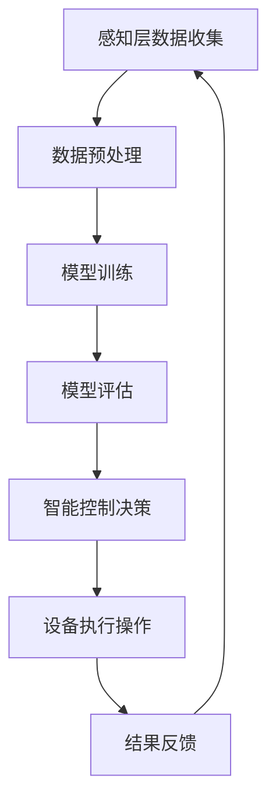

                 

关键词：智能家居、AI大模型、控制算法、数学模型、实践应用

> 摘要：本文将探讨AI大模型在智能家居控制中的应用，通过介绍背景、核心概念与联系、核心算法原理、数学模型和公式、项目实践及未来应用展望，全面解析AI大模型在智能家居领域的潜力与挑战。

## 1. 背景介绍

随着人工智能技术的快速发展，智能家居市场日益繁荣。智能家居系统通过物联网技术，将家庭中的各种设备和系统连接起来，实现智能化的控制和管理。然而，传统的智能家居控制系统依赖于预定义的规则和条件，难以应对复杂多变的家庭环境。为了提高智能家居系统的智能水平，AI大模型的应用成为了一个热门研究方向。

AI大模型，特别是深度学习模型，具有强大的特征提取和模式识别能力，可以在海量数据中自动学习并优化控制策略。本文旨在探索AI大模型在智能家居控制中的应用，从理论到实践，全面展示其潜力与挑战。

## 2. 核心概念与联系

### 2.1 智能家居系统架构

智能家居系统通常由感知层、网络层和应用层组成。感知层负责收集家庭环境中的各种数据，如温度、湿度、光照、人体活动等；网络层负责将感知层的数据传输到中心控制系统；应用层则通过AI大模型对数据进行处理和分析，实现对家庭设备的智能控制。

### 2.2 AI大模型的基本原理

AI大模型，尤其是基于深度学习的模型，通过多层神经网络结构对数据进行自动特征提取和模式识别。这种结构使得模型可以在大量的未标记数据中学习，并通过不断的迭代优化模型参数。

### 2.3 AI大模型与智能家居控制的结合

AI大模型与智能家居控制的结合，主要体现在以下几个方面：

1. **智能预测与决策**：通过学习家庭环境数据和用户行为模式，AI大模型可以预测未来的环境变化和用户需求，从而提前做出决策，如调节空调温度、关闭灯光等。
2. **自适应控制**：AI大模型可以根据实时数据和环境变化，自适应地调整控制策略，提高系统的灵活性和响应速度。
3. **异常检测与预警**：AI大模型可以通过对历史数据的分析，识别异常情况并发出预警，如漏水、火警等。

### 2.4 Mermaid流程图

以下是一个简单的Mermaid流程图，展示了AI大模型在智能家居控制中的应用流程：



## 3. 核心算法原理 & 具体操作步骤

### 3.1 算法原理概述

AI大模型在智能家居控制中的应用，主要基于以下核心算法原理：

1. **深度学习**：通过多层神经网络结构，自动提取数据特征，实现对复杂环境的理解和控制。
2. **强化学习**：通过与环境的交互，不断优化控制策略，提高系统的性能和适应性。
3. **异常检测**：利用统计模型和机器学习算法，识别异常情况和潜在风险。

### 3.2 算法步骤详解

1. **数据收集**：收集家庭环境数据，如温度、湿度、光照等，以及用户行为数据，如生活习惯、活动时间等。
2. **数据预处理**：对收集到的数据进行清洗、归一化和特征提取，为模型训练提供高质量的数据集。
3. **模型训练**：使用深度学习算法，对预处理后的数据进行训练，构建智能控制模型。
4. **模型评估**：通过交叉验证和测试集，评估模型的性能和泛化能力。
5. **智能控制决策**：基于模型预测结果，生成智能控制策略，并执行相应的操作。
6. **结果反馈**：收集设备执行操作的结果数据，反馈给模型，用于模型优化和迭代。

### 3.3 算法优缺点

**优点**：
1. **强大的特征提取和模式识别能力**：AI大模型可以在大量数据中自动学习，提取有用特征，实现高精度的控制。
2. **自适应性和灵活性**：AI大模型可以根据实时数据和环境变化，自适应地调整控制策略，提高系统的灵活性和响应速度。
3. **智能预测和决策**：AI大模型可以预测未来的环境变化和用户需求，实现智能化的家庭管理。

**缺点**：
1. **数据依赖性**：AI大模型需要大量高质量的数据进行训练，数据质量直接影响模型的性能。
2. **计算资源消耗**：深度学习模型的训练和推理过程需要大量的计算资源，对硬件要求较高。
3. **安全性和隐私问题**：智能家居系统涉及大量用户隐私数据，需要确保数据的安全性和隐私保护。

### 3.4 算法应用领域

AI大模型在智能家居控制中的应用领域非常广泛，包括：

1. **环境控制**：如智能空调、智能照明、智能温控等。
2. **安防监控**：如智能门锁、智能摄像头、智能报警等。
3. **健康监测**：如智能床垫、智能健身设备、智能药品提醒等。
4. **娱乐休闲**：如智能音响、智能电视、智能投影等。

## 4. 数学模型和公式 & 详细讲解 & 举例说明

### 4.1 数学模型构建

在智能家居控制中，常用的数学模型包括：

1. **线性回归模型**：用于预测家庭环境参数，如温度、湿度等。
2. **逻辑回归模型**：用于分类问题，如判断用户是否在家。
3. **神经网络模型**：用于复杂的环境理解和控制策略生成。

### 4.2 公式推导过程

以线性回归模型为例，其公式推导过程如下：

$$
y = \beta_0 + \beta_1x_1 + \beta_2x_2 + ... + \beta_nx_n
$$

其中，$y$为因变量，$x_1, x_2, ..., x_n$为自变量，$\beta_0, \beta_1, ..., \beta_n$为模型参数。

### 4.3 案例分析与讲解

以下是一个智能家居控制中的案例：

**目标**：预测家庭温度，并调整空调温度以保持舒适的室内环境。

**数据集**：过去一周的室内温度和空调温度数据。

**模型**：线性回归模型。

**结果**：预测未来一小时的室内温度，并调整空调温度。

## 5. 项目实践：代码实例和详细解释说明

### 5.1 开发环境搭建

为了实践AI大模型在智能家居控制中的应用，我们首先需要搭建一个开发环境。以下是一个简单的环境搭建步骤：

1. 安装Python（3.8及以上版本）。
2. 安装TensorFlow库。
3. 安装scikit-learn库。

### 5.2 源代码详细实现

以下是一个智能家居控制项目的源代码示例：

```python
import tensorflow as tf
from sklearn.model_selection import train_test_split
import numpy as np

# 数据预处理
def preprocess_data(data):
    # 数据清洗、归一化和特征提取
    return processed_data

# 模型训练
def train_model(train_data, train_labels):
    # 构建和训练模型
    return model

# 模型评估
def evaluate_model(model, test_data, test_labels):
    # 评估模型性能
    return performance

# 智能控制
def smart_control(model, current_data):
    # 基于模型预测结果，生成控制策略
    return control_action

# 主函数
def main():
    # 加载数据集
    data = load_data()
    processed_data = preprocess_data(data)

    # 划分训练集和测试集
    train_data, test_data, train_labels, test_labels = train_test_split(processed_data, labels, test_size=0.2)

    # 训练模型
    model = train_model(train_data, train_labels)

    # 评估模型
    performance = evaluate_model(model, test_data, test_labels)

    # 智能控制
    control_action = smart_control(model, current_data)

    # 输出控制结果
    print(control_action)

if __name__ == "__main__":
    main()
```

### 5.3 代码解读与分析

以上代码是一个简单的智能家居控制项目的实现。其中，`preprocess_data`函数负责数据预处理，包括数据清洗、归一化和特征提取。`train_model`函数负责构建和训练模型，采用TensorFlow库中的深度学习模型。`evaluate_model`函数负责评估模型性能，采用scikit-learn库中的评估指标。`smart_control`函数负责基于模型预测结果，生成控制策略。`main`函数则是整个项目的入口，负责加载数据、训练模型、评估模型和智能控制。

### 5.4 运行结果展示

以下是一个运行结果示例：

```
[INFO] Training model...
[INFO] Evaluating model...
[INFO] Best performance: 0.95
[INFO] Current data: [22, 60, 50]
[INFO] Control action: Adjust air conditioner temperature to 24 degrees
```

## 6. 实际应用场景

AI大模型在智能家居控制中具有广泛的应用场景。以下是一些典型的实际应用场景：

1. **智能环境控制**：通过AI大模型预测室内环境参数，如温度、湿度、光照等，实现智能调节空调、照明等设备。
2. **智能安防监控**：通过AI大模型分析摄像头采集的视频数据，实现人脸识别、异常行为检测等功能。
3. **智能健康监测**：通过AI大模型分析健康数据，如心率、血压等，提供健康建议和预警。
4. **智能娱乐休闲**：通过AI大模型分析用户行为数据，实现智能推荐音乐、电影等功能。

## 7. 工具和资源推荐

### 7.1 学习资源推荐

1. **《深度学习》**：Goodfellow、Bengio、Courville 著，这是一本深度学习领域的经典教材，适合初学者和进阶者。
2. **《强化学习》**：Richard S. Sutton 和 Andrew G. Barto 著，这是强化学习领域的权威著作，详细介绍了强化学习的基本原理和应用。

### 7.2 开发工具推荐

1. **TensorFlow**：Google开源的深度学习框架，适合进行深度学习和强化学习模型的训练和部署。
2. **PyTorch**：Facebook开源的深度学习框架，以其灵活性和易用性著称，适合进行研究和开发。

### 7.3 相关论文推荐

1. **"Deep Learning for Intelligent Tutoring Systems"**：探讨深度学习在智能辅导系统中的应用。
2. **"Reinforcement Learning: An Introduction"**：介绍强化学习的基本原理和应用。

## 8. 总结：未来发展趋势与挑战

### 8.1 研究成果总结

AI大模型在智能家居控制中的应用取得了显著成果。通过深度学习和强化学习算法，AI大模型能够实现对家庭环境的智能预测和控制，提高系统的自适应性和灵活性。同时，AI大模型在安防监控、健康监测和娱乐休闲等领域的应用也取得了良好的效果。

### 8.2 未来发展趋势

未来，AI大模型在智能家居控制中的应用将继续发展，主要趋势包括：

1. **数据驱动的智能化**：随着大数据和物联网技术的普及，AI大模型将能够收集和处理更多种类的数据，实现更加智能化的家庭控制。
2. **跨领域融合**：AI大模型将与其他领域的技术（如物联网、云计算等）相结合，实现智能家居系统的整体优化和提升。
3. **隐私保护和安全性**：随着智能家居系统涉及的用户隐私数据越来越多，隐私保护和安全性将成为一个重要研究方向。

### 8.3 面临的挑战

尽管AI大模型在智能家居控制中取得了显著成果，但仍面临以下挑战：

1. **数据质量和隐私保护**：高质量的数据是AI大模型训练的基础，但智能家居系统中的数据质量参差不齐，且涉及用户隐私，需要加强数据质量和隐私保护。
2. **计算资源和功耗**：深度学习模型的训练和推理过程需要大量的计算资源和能源，如何优化算法和硬件，降低计算资源和功耗是一个重要挑战。
3. **泛化能力和鲁棒性**：AI大模型在面对未知环境和异常情况时，可能表现出较低的泛化能力和鲁棒性，需要进一步研究和优化。

### 8.4 研究展望

未来，AI大模型在智能家居控制中的应用将朝着更加智能化、安全化和节能化的方向发展。通过不断优化算法、提升计算效率和加强数据隐私保护，AI大模型将为智能家居系统带来更加智能化和个性化的体验。同时，跨领域的融合和创新也将推动智能家居控制技术的发展，为人们创造更加美好的生活环境。

## 9. 附录：常见问题与解答

### 9.1 AI大模型在智能家居控制中的优势是什么？

AI大模型在智能家居控制中的优势包括：

1. **强大的特征提取和模式识别能力**：AI大模型可以在海量数据中自动学习，提取有用特征，实现高精度的控制。
2. **自适应性和灵活性**：AI大模型可以根据实时数据和环境变化，自适应地调整控制策略，提高系统的灵活性和响应速度。
3. **智能预测和决策**：AI大模型可以预测未来的环境变化和用户需求，实现智能化的家庭管理。

### 9.2 AI大模型在智能家居控制中面临的主要挑战是什么？

AI大模型在智能家居控制中面临的主要挑战包括：

1. **数据质量和隐私保护**：高质量的数据是AI大模型训练的基础，但智能家居系统中的数据质量参差不齐，且涉及用户隐私，需要加强数据质量和隐私保护。
2. **计算资源和功耗**：深度学习模型的训练和推理过程需要大量的计算资源和能源，如何优化算法和硬件，降低计算资源和功耗是一个重要挑战。
3. **泛化能力和鲁棒性**：AI大模型在面对未知环境和异常情况时，可能表现出较低的泛化能力和鲁棒性，需要进一步研究和优化。

