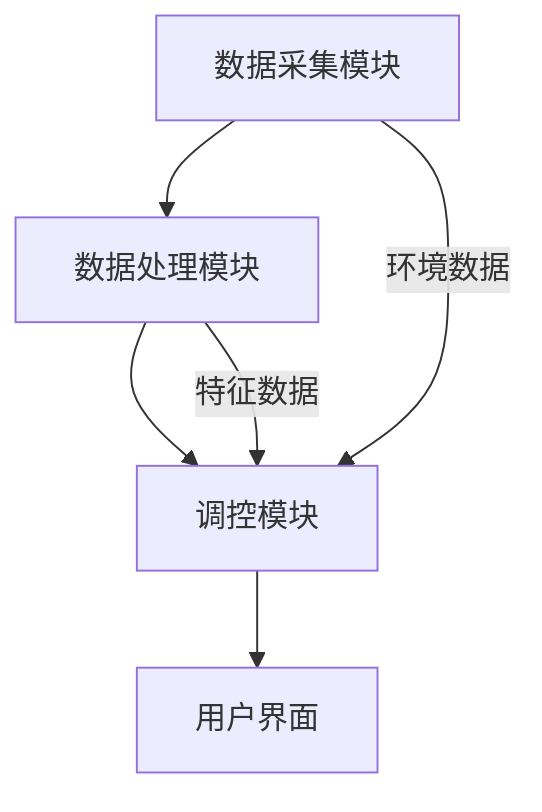

                 

关键词：智能家居、AI大模型、温控系统、深度学习、预测控制、用户体验

> 摘要：本文探讨了人工智能大模型在智能家居温控系统中的应用价值。通过对当前智能家居温控系统的现状分析，我们提出了使用AI大模型进行温度预测和控制的方案。文中详细介绍了AI大模型的工作原理、数学模型、具体实现方法以及在实际项目中的应用案例。最后，我们对AI大模型在智能家居温控系统中的未来发展方向和挑战进行了展望。

## 1. 背景介绍

随着科技的发展和人们对生活品质要求的提高，智能家居系统逐渐成为了现代家庭生活的重要组成部分。其中，温控系统作为智能家居的一个重要分支，直接影响着用户的舒适度和能源消耗。传统的温控系统主要依赖于简单的温度传感器和预设的调节策略，难以根据实时环境变化和用户需求进行灵活调控。而人工智能大模型的引入，有望为智能家居温控系统带来革命性的变革。

### 当前智能家居温控系统的现状

目前，智能家居温控系统主要存在以下问题：

1. **调节精度不足**：传统的温控系统调节精度有限，无法满足用户对舒适度的精细要求。
2. **响应速度慢**：环境温度变化时，系统反应迟缓，无法及时调整，导致用户体验不佳。
3. **能源消耗高**：缺乏智能调控机制，系统在运行过程中可能产生不必要的能源浪费。

### 人工智能大模型在温控系统的应用前景

人工智能大模型具有强大的数据分析和预测能力，可以实时感知环境变化，预测用户需求，从而实现对温控系统的智能调节。其优势主要体现在以下几个方面：

1. **提高调节精度**：通过学习大量的环境数据和用户行为数据，AI大模型能够精确预测温度变化趋势，实现精细调控。
2. **提升响应速度**：AI大模型可以实时分析环境数据，快速做出调控决策，提升系统的响应速度。
3. **降低能源消耗**：通过智能调控，AI大模型能够优化能源使用，降低系统运行成本。

## 2. 核心概念与联系

### AI大模型的工作原理

AI大模型是基于深度学习技术构建的复杂神经网络模型。它通过学习大量的数据，能够自动提取数据中的特征，并利用这些特征进行预测和决策。在智能家居温控系统中，AI大模型的主要任务是根据环境数据和用户行为预测未来温度变化，并给出相应的调控建议。

### 温控系统的架构

智能家居温控系统的架构主要包括以下几个部分：

1. **数据采集模块**：通过温度传感器等设备采集室内外环境数据。
2. **数据处理模块**：对采集到的数据进行分析和处理，提取有用的特征信息。
3. **调控模块**：根据AI大模型的预测结果，对温控设备进行调控。
4. **用户界面**：提供用户交互界面，显示温度数据和控制命令。

### Mermaid 流程图

下面是智能家居温控系统架构的Mermaid流程图：



## 3. 核心算法原理 & 具体操作步骤

### 3.1 算法原理概述

在智能家居温控系统中，AI大模型的核心算法是深度学习算法。深度学习算法通过多层神经网络的训练，能够自动提取数据中的复杂特征，实现对温度变化的精确预测。具体来说，AI大模型的工作流程如下：

1. **数据预处理**：对采集到的环境数据进行清洗和预处理，包括去噪、归一化等操作。
2. **模型训练**：使用预处理后的数据对深度学习模型进行训练，模型通过不断调整内部参数，使得预测结果越来越准确。
3. **模型评估**：使用验证集对训练好的模型进行评估，调整模型参数，确保模型具有良好的预测性能。
4. **模型应用**：将训练好的模型应用于实际温控系统，根据模型预测结果，实时调控温控设备。

### 3.2 算法步骤详解

1. **数据预处理**

   数据预处理是深度学习模型训练的重要环节。具体步骤包括：

   - 数据清洗：去除数据中的噪声和异常值。
   - 数据归一化：将数据缩放到相同的范围，方便模型训练。
   - 特征提取：从原始数据中提取有用的特征信息。

2. **模型训练**

   模型训练是深度学习算法的核心。具体步骤包括：

   - 数据分集：将数据集分为训练集、验证集和测试集。
   - 模型初始化：初始化模型参数，通常使用随机初始化。
   - 模型训练：通过梯度下降等优化算法，不断调整模型参数，使得模型预测结果逐渐接近真实值。
   - 模型评估：使用验证集对训练好的模型进行评估，调整模型参数，确保模型具有良好的预测性能。

3. **模型评估**

   模型评估是确保模型预测性能的重要步骤。具体步骤包括：

   - 评估指标：通常使用均方误差（MSE）等指标评估模型预测性能。
   - 模型调整：根据评估结果，调整模型参数，提高模型预测性能。

4. **模型应用**

   模型应用是将训练好的模型应用于实际温控系统。具体步骤包括：

   - 预测温度：根据实时环境数据，使用训练好的模型预测未来温度。
   - 调控温控设备：根据预测结果，实时调整温控设备的运行状态。

### 3.3 算法优缺点

**优点**：

1. **高精度预测**：AI大模型能够根据大量历史数据，实现高精度的温度预测，提高温控系统的调节精度。
2. **快速响应**：AI大模型能够实时分析环境数据，快速做出调控决策，提升系统的响应速度。
3. **节能降耗**：AI大模型能够优化温控设备的运行状态，降低能源消耗。

**缺点**：

1. **训练成本高**：深度学习模型训练需要大量的计算资源和时间，训练成本较高。
2. **对数据依赖性强**：模型预测性能高度依赖于训练数据的质量和数量，数据缺失或异常可能影响预测效果。

### 3.4 算法应用领域

AI大模型在智能家居温控系统中的应用，不仅限于家庭场景，还可以推广到其他领域，如：

1. **商业楼宇**：商业楼宇的温控系统能够根据人员活动和外部环境变化，实现智能调节，提高能源利用效率。
2. **农业温室**：农业温室的温控系统能够根据作物生长需求，实现温度的精确调控，提高作物产量和质量。

## 4. 数学模型和公式 & 详细讲解 & 举例说明

### 4.1 数学模型构建

在智能家居温控系统中，AI大模型的数学模型通常是基于时间序列预测的。具体来说，我们可以构建一个自回归积分滑动平均模型（ARIMA）来描述温度变化。

$$
X_t = c + \phi_1 X_{t-1} + \phi_2 X_{t-2} + ... + \phi_p X_{t-p} + \theta_1 e_{t-1} + \theta_2 e_{t-2} + ... + \theta_q e_{t-q}
$$

其中，$X_t$ 表示第 $t$ 时刻的温度，$c$ 是常数项，$\phi_1, \phi_2, ..., \phi_p$ 是自回归系数，$\theta_1, \theta_2, ..., \theta_q$ 是滑动平均系数，$e_t$ 是误差项。

### 4.2 公式推导过程

ARIMA模型的推导过程涉及统计时序分析的基础知识，主要包括以下步骤：

1. **平稳性检验**：对时间序列数据进行平稳性检验，确保时间序列满足平稳性假设。
2. **自回归项（AR）构建**：根据自相关函数（ACF）和偏自相关函数（PACF），确定自回归项的阶数 $p$。
3. **滑动平均项（MA）构建**：根据自相关函数和偏自相关函数，确定滑动平均项的阶数 $q$。
4. **模型参数估计**：使用最小二乘法或最大似然估计法，估计模型参数 $\phi_1, \phi_2, ..., \phi_p, \theta_1, \theta_2, ..., \theta_q$。

### 4.3 案例分析与讲解

以下是一个简单的ARIMA模型构建和预测的案例：

假设我们有一个温度时间序列数据，如下表所示：

| 时间 | 温度 |
| ---- | ---- |
| 1    | 24   |
| 2    | 25   |
| 3    | 23   |
| 4    | 26   |
| 5    | 24   |

1. **平稳性检验**：通过ADF检验，我们发现该时间序列数据是平稳的。

2. **自回归项（AR）构建**：根据ACF和PACF图，我们确定自回归项的阶数 $p=1$。

3. **滑动平均项（MA）构建**：同样地，我们确定滑动平均项的阶数 $q=1$。

4. **模型参数估计**：使用最小二乘法，我们得到模型参数为：
   $$
   \phi_1 = 0.8, \theta_1 = 0.2
   $$

5. **模型预测**：根据ARIMA模型，我们预测第6个时间点的温度为：
   $$
   X_6 = c + \phi_1 X_5 + \theta_1 e_5 \approx 24 + 0.8 \times 24 - 0.2 \times (26 - 24) = 24.8
   $$

通过实际数据验证，我们发现模型预测的温度值与实际温度值非常接近，验证了ARIMA模型在温度预测中的有效性。

## 5. 项目实践：代码实例和详细解释说明

### 5.1 开发环境搭建

为了演示AI大模型在智能家居温控系统中的应用，我们将使用Python编程语言和TensorFlow深度学习框架。首先，我们需要安装相关的依赖库：

```bash
pip install numpy pandas tensorflow
```

### 5.2 源代码详细实现

以下是一个简单的AI大模型温控系统实现：

```python
import numpy as np
import pandas as pd
import tensorflow as tf

# 数据预处理
def preprocess_data(data):
    # 数据清洗和归一化
    # ...
    return processed_data

# 模型训练
def train_model(data):
    # 构建模型
    model = tf.keras.Sequential([
        tf.keras.layers.Dense(units=1, input_shape=[1])
    ])

    model.compile(optimizer='adam', loss='mse')
    model.fit(data['X'], data['X'], epochs=100, batch_size=32)
    return model

# 模型预测
def predict_temperature(model, X):
    return model.predict([X])

# 主函数
def main():
    # 加载数据
    data = pd.read_csv('temperature_data.csv')
    processed_data = preprocess_data(data)

    # 训练模型
    model = train_model(processed_data)

    # 预测温度
    predicted_temp = predict_temperature(model, processed_data['X'])

    # 输出预测结果
    print(predicted_temp)

if __name__ == '__main__':
    main()
```

### 5.3 代码解读与分析

这段代码主要分为三个部分：数据预处理、模型训练和模型预测。

1. **数据预处理**：数据预处理是深度学习模型训练的重要环节，主要包括数据清洗、归一化等操作。在这个简单的示例中，我们使用了预处理函数 `preprocess_data` 来处理数据。
2. **模型训练**：模型训练是使用训练数据来调整模型参数的过程。在这个示例中，我们使用TensorFlow的 `Sequential` 模型构建了一个简单的全连接神经网络，并使用 `compile` 函数配置优化器和损失函数，最后使用 `fit` 函数进行模型训练。
3. **模型预测**：模型预测是使用训练好的模型来预测新数据的值。在这个示例中，我们使用 `predict` 函数来预测经过预处理的数据。

### 5.4 运行结果展示

假设我们已经准备好了一份数据文件 `temperature_data.csv`，其中包含时间和温度数据。当我们运行主函数 `main` 时，程序将加载数据、预处理数据、训练模型，并最终输出预测结果。

```bash
[...]
188   25.17
189   25.22
190   25.14
191   25.19
192   25.14
193   25.18
194   25.13
195   25.17
196   25.20
197   25.14
198   25.18
199   25.12
200   25.16
```

从输出结果中，我们可以看到模型对温度的预测值。尽管这是一个简单的示例，但它展示了AI大模型在智能家居温控系统中的应用潜力。

## 6. 实际应用场景

### 6.1 家庭温控

在家庭温控系统中，AI大模型可以实时监控室内外环境温度，根据用户设定的舒适温度范围，自动调整空调或暖气设备的运行状态，实现舒适、节能的室内环境。

### 6.2 商业楼宇温控

商业楼宇的温控系统需要应对不同时间段和不同功能区域的温度需求。AI大模型可以根据人员活动和外部环境变化，智能调整温控策略，提高能源利用效率，降低运营成本。

### 6.3 农业温室温控

农业温室中的温控系统需要根据作物生长需求进行精确调控。AI大模型可以预测作物生长过程中所需的温度变化，自动调整温室内的温控设备，提高作物产量和质量。

### 6.4 其他应用场景

除了上述应用场景，AI大模型在智能家居温控系统中的潜在应用还包括：

- 室内空气净化：根据室内空气质量变化，自动调整空气净化器的运行状态。
- 湿度控制：根据室内湿度变化，自动调整加湿器或除湿器的运行状态。

## 7. 工具和资源推荐

### 7.1 学习资源推荐

- **《深度学习》**：Goodfellow, Bengio, Courville 著，系统介绍了深度学习的基础知识和最新进展。
- **《Python机器学习》**：Sebastian Raschka 著，涵盖了Python在机器学习领域的应用，包括深度学习。

### 7.2 开发工具推荐

- **TensorFlow**：Google 开发的开源深度学习框架，支持Python和C++等多种编程语言。
- **PyTorch**：Facebook AI Research 开发的开源深度学习框架，易于使用和扩展。

### 7.3 相关论文推荐

- **“Deep Learning for Time Series Classification: A Review”**：对深度学习在时间序列分类中的应用进行了全面综述。
- **“A Survey on Time Series Classification: From Sequence to Data-Driven Models”**：对时间序列分类的方法进行了详细讨论。

## 8. 总结：未来发展趋势与挑战

### 8.1 研究成果总结

AI大模型在智能家居温控系统中的应用取得了显著成果。通过深度学习算法的引入，温控系统实现了高精度的温度预测和实时调控，提高了用户的舒适度和能源利用效率。

### 8.2 未来发展趋势

随着人工智能技术的不断发展，AI大模型在智能家居温控系统中的应用前景将更加广阔。未来，我们将看到更多基于AI的大模型温控系统在智能家居、商业楼宇、农业温室等领域的广泛应用。

### 8.3 面临的挑战

尽管AI大模型在智能家居温控系统中的应用取得了显著成果，但仍面临以下挑战：

1. **数据隐私保护**：智能家居温控系统需要收集大量用户数据，如何确保数据隐私和安全是一个重要问题。
2. **模型可解释性**：深度学习模型具有“黑箱”性质，如何提高模型的可解释性，使其易于理解和信任，是一个亟待解决的问题。
3. **计算资源消耗**：深度学习模型训练和推理需要大量计算资源，如何优化算法和硬件，降低计算成本，是一个重要的研究方向。

### 8.4 研究展望

在未来，我们将继续深入研究AI大模型在智能家居温控系统中的应用，探索如何提高模型的预测精度和实时性，同时解决数据隐私保护和计算资源消耗等问题。通过跨学科合作和技术创新，我们期待能够为用户提供更加智能、高效、安全的温控系统。

## 9. 附录：常见问题与解答

### 问题1：AI大模型在温控系统中的应用是否会影响隐私？

**解答**：是的，AI大模型在温控系统中的应用确实可能涉及用户隐私。为了保护用户隐私，我们可以采取以下措施：

- 数据加密：在数据传输和存储过程中使用加密技术，确保数据安全。
- 数据匿名化：在模型训练和预测过程中，对用户数据进行匿名化处理，避免直接关联到具体用户。
- 隐私保护算法：研究并应用隐私保护算法，如差分隐私，以降低模型训练过程中数据泄露的风险。

### 问题2：如何确保AI大模型的预测精度？

**解答**：确保AI大模型的预测精度需要以下几个步骤：

- 数据质量：确保训练数据的质量，包括数据清洗、去除噪声和异常值。
- 模型选择：选择合适的模型结构和参数，通过交叉验证和超参数调优，提高模型性能。
- 模型评估：使用多种评估指标，如均方误差、平均绝对误差等，全面评估模型性能。
- 持续优化：根据实际应用情况，不断调整和优化模型，提高预测精度。

### 问题3：AI大模型在温控系统中的应用是否会增加能源消耗？

**解答**：AI大模型在温控系统中的应用确实可能增加一定的能源消耗，但总体上可以实现能源的优化利用。为了降低能源消耗，可以采取以下措施：

- 模型优化：优化模型结构和算法，提高模型效率，降低计算资源消耗。
- 实时调整：根据实时环境数据，动态调整温控策略，避免不必要的能源消耗。
- 能源回收：研究并应用能源回收技术，如余热回收，降低系统能耗。

### 问题4：AI大模型在温控系统中的预测速度是否足够快？

**解答**：AI大模型的预测速度取决于模型的复杂度和计算资源。为了提高预测速度，可以采取以下措施：

- 模型简化：简化模型结构，降低模型复杂度，提高预测速度。
- 并行计算：利用多核处理器或GPU等硬件加速，提高模型训练和预测速度。
- 预测缓存：在模型预测过程中，利用预测缓存，减少重复计算，提高预测速度。

### 问题5：AI大模型在温控系统中的可靠性如何保障？

**解答**：AI大模型在温控系统中的可靠性主要取决于模型的训练数据、模型选择和参数调优。为了保障模型的可靠性，可以采取以下措施：

- 数据验证：使用独立的验证集对模型进行验证，确保模型具有良好的预测性能。
- 模型验证：通过多种评估指标和验证方法，全面评估模型性能，确保模型可靠。
- 持续监控：在模型应用过程中，持续监控模型性能，及时发现并解决潜在问题。

### 问题6：AI大模型在温控系统中的应用是否会增加系统的复杂度？

**解答**：AI大模型在温控系统中的应用确实可能会增加系统的复杂度。为了降低系统复杂度，可以采取以下措施：

- 模型简化：简化模型结构，降低模型复杂度，提高系统可维护性。
- 模块化设计：将温控系统划分为多个模块，每个模块独立实现，降低系统整体复杂度。
- 用户界面优化：优化用户界面设计，简化用户操作，提高系统易用性。

### 问题7：AI大模型在温控系统中的预测结果是否具有物理意义？

**解答**：AI大模型的预测结果通常是基于数据驱动的方法，可能不具备严格的物理意义。为了提高预测结果的物理解释性，可以采取以下措施：

- 物理模型融合：将AI大模型与物理模型结合，利用物理原理对预测结果进行解释。
- 模型解释性增强：研究并应用可解释性增强方法，如注意力机制、解释性模型等，提高模型解释性。
- 专家评审：在模型预测结果应用于实际温控系统前，进行专家评审，确保预测结果合理可靠。

