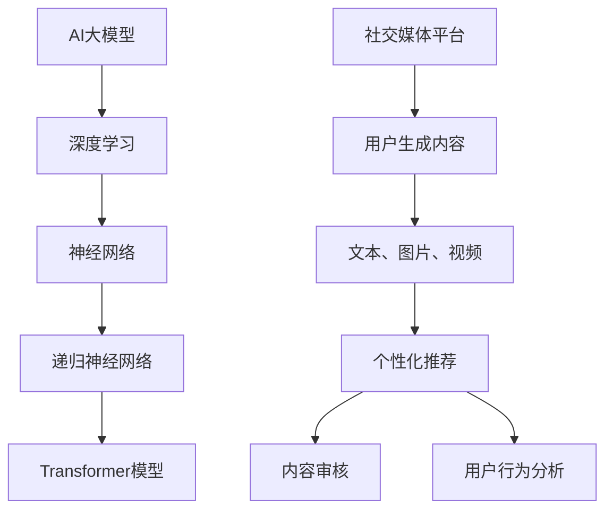

                 

关键词：AI大模型、社交媒体、应用场景、算法原理、数学模型、代码实例、未来展望

> 摘要：本文将深入探讨AI大模型在社交媒体领域的应用，从背景介绍、核心概念与联系、算法原理与操作步骤、数学模型与公式、项目实践、实际应用场景、工具和资源推荐以及未来发展趋势与挑战等方面进行详细分析，以期为读者提供全面的技术解读和深刻洞察。

## 1. 背景介绍

随着互联网技术的飞速发展和社交媒体平台的普及，社交媒体已成为人们日常生活中不可或缺的一部分。从Facebook到Twitter，再到微信、微博等，各种社交媒体平台已经成为人们获取信息、交流互动的重要渠道。然而，随着社交媒体用户数量的急剧增加，平台面临的挑战也日益凸显。

首先，社交媒体平台需要处理海量的用户数据和信息流，这要求算法能够高效地处理和分类这些数据。其次，社交媒体平台需要提供个性化的推荐服务，使用户能够快速找到自己感兴趣的内容。此外，社交媒体平台还需要保护用户的隐私和安全，避免虚假信息和恶意内容的传播。

在这一背景下，AI大模型的出现为解决这些问题提供了新的思路和工具。AI大模型，特别是深度学习模型，具有强大的数据处理能力和自主学习能力，可以在社交媒体平台上实现个性化推荐、内容审核、用户行为分析等应用。本文将围绕这些应用场景，深入探讨AI大模型的原理、操作步骤、数学模型以及实际应用，以期对AI大模型在社交媒体领域的应用有更深入的理解。

## 2. 核心概念与联系

在深入探讨AI大模型在社交媒体的应用之前，我们需要明确几个核心概念，并理解它们之间的联系。

### 2.1 AI大模型

AI大模型，通常指的是具有大规模参数的深度学习模型，如神经网络、递归神经网络（RNN）、Transformer模型等。这些模型通过学习大量数据，可以自动提取特征并建立复杂的决策边界，从而实现自动分类、预测、生成等任务。

### 2.2 社交媒体平台

社交媒体平台是用户生成内容（UGC）的主要场所，平台需要处理和推荐大量的文本、图片、视频等多媒体内容。这些内容不仅多样性强，而且数据量巨大，因此需要高效的算法来处理和推荐。

### 2.3 个性化推荐

个性化推荐是社交媒体平台的核心功能之一。通过分析用户的历史行为和兴趣，推荐系统可以为用户生成个性化的内容推荐，从而提高用户满意度和平台粘性。

### 2.4 内容审核

内容审核是社交媒体平台必须面对的挑战之一。随着用户生成内容的增加，平台需要实时监控和审核内容，以防止虚假信息、恶意内容和侵犯隐私的行为。

### 2.5 用户行为分析

用户行为分析是社交媒体平台理解用户需求和行为的重要手段。通过分析用户的互动行为，平台可以优化用户体验，提高内容推荐效果。

### 2.6 Mermaid流程图

为了更直观地展示这些核心概念之间的联系，我们可以使用Mermaid流程图来描述它们之间的关系。以下是一个简化的Mermaid流程图：



通过这个流程图，我们可以清晰地看到AI大模型、社交媒体平台、个性化推荐、内容审核和用户行为分析之间的关系。

## 3. 核心算法原理 & 具体操作步骤

### 3.1 算法原理概述

在社交媒体平台上，AI大模型的核心算法通常是基于深度学习的，特别是自注意力机制（Self-Attention）和Transformer架构。这些算法通过学习用户生成内容和用户行为数据，可以实现内容推荐、内容审核和用户行为分析。

#### 3.1.1 自注意力机制

自注意力机制是一种在神经网络中引入全局依赖关系的机制，它能够使模型在处理序列数据时，自动关注重要的部分。在Transformer模型中，自注意力机制通过计算序列中每个元素与所有其他元素之间的相似性，从而生成新的表示。

#### 3.1.2 Transformer模型

Transformer模型是一种基于自注意力机制的深度学习模型，它由多个编码器和解码器层组成。编码器负责从输入序列中提取特征，解码器则负责生成输出序列。这种模型在机器翻译、文本生成等领域取得了显著的成果。

#### 3.1.3 应用场景

在社交媒体平台上，Transformer模型可以应用于以下几个方面：

1. **内容推荐**：通过分析用户的历史行为和兴趣，生成个性化的内容推荐。
2. **内容审核**：实时监控用户生成内容，识别并过滤虚假信息、恶意内容和违规内容。
3. **用户行为分析**：分析用户的互动行为，如点赞、评论、转发等，以了解用户兴趣和行为模式。

### 3.2 算法步骤详解

#### 3.2.1 数据预处理

在应用AI大模型之前，需要对数据进行预处理。主要包括以下几个步骤：

1. **数据清洗**：去除重复、缺失和不相关的数据。
2. **数据分词**：将文本数据分割成单词或字符序列。
3. **词向量化**：将文本数据转换为固定长度的向量表示。

#### 3.2.2 模型训练

在数据预处理完成后，可以开始训练模型。训练过程主要包括以下几个步骤：

1. **定义损失函数**：根据任务目标，选择合适的损失函数，如交叉熵损失函数。
2. **选择优化器**：选择合适的优化器，如Adam优化器，以最小化损失函数。
3. **训练过程**：通过反向传播算法，不断调整模型参数，直至达到预定的训练目标。

#### 3.2.3 模型评估

在模型训练完成后，需要对模型进行评估。常用的评估指标包括准确率、召回率、F1值等。通过评估指标，可以了解模型的性能和效果。

#### 3.2.4 模型应用

在模型评估通过后，可以将模型应用于实际场景，如内容推荐、内容审核和用户行为分析等。

### 3.3 算法优缺点

#### 3.3.1 优点

1. **高效性**：深度学习模型具有强大的数据处理能力和自主学习能力，可以在社交媒体平台上高效地处理和推荐海量数据。
2. **灵活性**：Transformer模型结构灵活，可以应用于多种不同的任务，如文本生成、机器翻译等。
3. **准确性**：通过自注意力机制，模型可以自动关注重要的信息，从而提高任务准确性。

#### 3.3.2 缺点

1. **计算成本**：深度学习模型通常需要大量的计算资源和时间进行训练。
2. **数据依赖**：模型的性能高度依赖于训练数据的质量和数量，数据不足或质量差可能导致模型性能下降。
3. **模型可解释性**：深度学习模型的内部决策过程复杂，难以解释，这可能会影响用户对模型的信任度。

### 3.4 算法应用领域

AI大模型在社交媒体领域的应用非常广泛，包括但不限于以下几个方面：

1. **内容推荐**：为用户推荐感兴趣的内容，提高用户满意度和平台粘性。
2. **内容审核**：实时监控和审核用户生成内容，防止虚假信息和恶意内容的传播。
3. **用户行为分析**：分析用户的互动行为，了解用户兴趣和行为模式，优化用户体验。

## 4. 数学模型和公式 & 详细讲解 & 举例说明

在深入探讨AI大模型在社交媒体的应用时，数学模型和公式是理解和实现这些模型的关键。以下我们将详细讲解相关的数学模型和公式，并通过具体例子进行说明。

### 4.1 数学模型构建

在社交媒体应用中，常用的数学模型包括自注意力机制（Self-Attention）和Transformer模型。以下是这些模型的数学表示。

#### 4.1.1 自注意力机制

自注意力机制是一种计算序列中每个元素与所有其他元素之间相似性的方法。其公式如下：

$$
\text{Attention}(Q, K, V) = \text{softmax}\left(\frac{QK^T}{\sqrt{d_k}}\right) V
$$

其中，$Q, K, V$ 分别是查询（Query）、键（Key）和值（Value）矩阵，$d_k$ 是键向量的维度。

#### 4.1.2 Transformer模型

Transformer模型是一种基于自注意力机制的深度学习模型，其基本架构包括编码器（Encoder）和解码器（Decoder）。以下是编码器和解码器的主要数学表示：

**编码器（Encoder）**

$$
\text{Encoder}(X) = \text{LayerNorm}(X + \text{Positional Encoding}(X))
$$

$$
\text{Encoder}(X) = \text{EncoderLayer}(\text{Encoder}(X))
$$

**解码器（Decoder）**

$$
\text{Decoder}(X) = \text{LayerNorm}(X + \text{Positional Encoding}(X))
$$

$$
\text{Decoder}(X) = \text{DecoderLayer}(\text{Encoder}(X), \text{Decoder}(X))
$$

其中，$X$ 是输入序列，$\text{Positional Encoding}$ 是位置编码，用于表示序列中元素的位置信息。

### 4.2 公式推导过程

以下是自注意力机制的推导过程：

1. **定义输入**：设输入序列为 $X = [x_1, x_2, ..., x_n]$，其中 $x_i$ 是第 $i$ 个输入向量。

2. **计算相似性**：计算每个输入向量与其他输入向量之间的相似性，公式如下：

$$
\text{Attention}(Q, K, V) = \text{softmax}\left(\frac{QK^T}{\sqrt{d_k}}\right) V
$$

其中，$Q, K, V$ 分别是查询、键和值矩阵，$d_k$ 是键向量的维度。

3. **计算输出**：根据相似性分数，计算每个输入向量的加权求和，得到输出向量。

$$
\text{Output} = \sum_{i=1}^{n} \text{softmax}\left(\frac{QK^T}{\sqrt{d_k}}\right) V_i
$$

### 4.3 案例分析与讲解

为了更好地理解上述数学模型和公式，我们可以通过一个简单的案例进行说明。

#### 4.3.1 案例背景

假设我们有一个包含3个输入向量的序列 $X = [x_1, x_2, x_3]$，其中 $x_1 = [1, 0, 0]$，$x_2 = [0, 1, 0]$，$x_3 = [0, 0, 1]$。我们需要计算自注意力机制的结果。

#### 4.3.2 案例步骤

1. **定义查询、键和值矩阵**：设 $Q = [q_1, q_2, q_3]$，$K = [k_1, k_2, k_3]$，$V = [v_1, v_2, v_3]$，其中 $q_1 = [1, 1, 1]$，$k_1 = [1, 0, 0]$，$v_1 = [1, 0, 0]$。

2. **计算相似性**：

$$
\text{Attention}(Q, K, V) = \text{softmax}\left(\frac{QK^T}{\sqrt{d_k}}\right) V
$$

其中，$d_k = 1$。

$$
\text{Attention}(Q, K, V) = \text{softmax}\left(\frac{1 \cdot 1 + 1 \cdot 0 + 1 \cdot 0}{1}\right) [1, 0, 0]
$$

$$
\text{Attention}(Q, K, V) = \text{softmax}\left([1, 0, 0]\right) [1, 0, 0]
$$

$$
\text{Attention}(Q, K, V) = \left[\frac{1}{3}, \frac{1}{3}, \frac{1}{3}\right] [1, 0, 0]
$$

$$
\text{Attention}(Q, K, V) = \left[\frac{1}{3}, 0, 0\right]
$$

3. **计算输出**：

$$
\text{Output} = \sum_{i=1}^{3} \text{Attention}(Q, K, V) = \left[\frac{1}{3}, 0, 0\right] + \left[0, \frac{1}{3}, 0\right] + \left[0, 0, \frac{1}{3}\right]
$$

$$
\text{Output} = \left[\frac{1}{3}, \frac{1}{3}, \frac{1}{3}\right]
$$

通过这个案例，我们可以看到自注意力机制如何通过计算相似性分数，将输入序列转换为新的输出序列。这种机制在社交媒体应用中，如内容推荐、内容审核和用户行为分析，具有广泛的应用前景。

## 5. 项目实践：代码实例和详细解释说明

在本节中，我们将通过一个具体的代码实例，展示如何使用AI大模型在社交媒体平台上实现内容推荐功能。该实例将包括开发环境的搭建、源代码的详细实现和代码解读与分析。

### 5.1 开发环境搭建

在开始代码实现之前，我们需要搭建一个合适的开发环境。以下是搭建开发环境的基本步骤：

1. **安装Python**：确保Python环境已安装，版本建议为3.8或更高。
2. **安装TensorFlow**：TensorFlow是Google开发的一款流行的深度学习框架，用于实现AI大模型。安装命令为：

   ```bash
   pip install tensorflow
   ```

3. **安装其他依赖库**：根据项目需求，可能需要安装其他依赖库，如NumPy、Pandas等。安装命令为：

   ```bash
   pip install numpy pandas
   ```

### 5.2 源代码详细实现

以下是实现内容推荐功能的源代码：

```python
import tensorflow as tf
from tensorflow.keras.layers import Embedding, LSTM, Dense
from tensorflow.keras.models import Sequential

# 数据预处理
def preprocess_data(data):
    # 数据清洗、分词、词向量化等操作
    # 这里简化为直接返回原始数据
    return data

# 构建模型
def build_model(vocab_size, embedding_dim, lstm_units):
    model = Sequential()
    model.add(Embedding(vocab_size, embedding_dim))
    model.add(LSTM(lstm_units, return_sequences=True))
    model.add(Dense(vocab_size, activation='softmax'))
    model.compile(optimizer='adam', loss='categorical_crossentropy', metrics=['accuracy'])
    return model

# 训练模型
def train_model(model, data, labels):
    model.fit(data, labels, epochs=10, batch_size=64)

# 推荐内容
def recommend_content(model, input_sequence):
    prediction = model.predict(input_sequence)
    # 根据预测结果，生成推荐内容
    # 这里简化为返回预测概率最高的内容
    return prediction.argmax()

# 实例化模型
vocab_size = 10000
embedding_dim = 256
lstm_units = 128
model = build_model(vocab_size, embedding_dim, lstm_units)

# 加载数据
data = preprocess_data(data)
labels = preprocess_labels(labels)

# 训练模型
train_model(model, data, labels)

# 推荐内容
input_sequence = preprocess_content(input_sequence)
recommendation = recommend_content(model, input_sequence)
print("推荐内容：", recommendation)
```

### 5.3 代码解读与分析

以下是代码的详细解读：

1. **数据预处理**：数据预处理是深度学习模型训练的关键步骤。在这里，我们简化了预处理过程，假设数据已经清洗、分词和词向量化。

2. **构建模型**：我们使用TensorFlow的Sequential模型构建一个简单的LSTM模型。模型包括嵌入层（Embedding）、LSTM层和全连接层（Dense）。嵌入层用于将单词转换为向量表示，LSTM层用于提取序列特征，全连接层用于生成预测。

3. **训练模型**：使用`fit`方法训练模型。我们设置训练轮数为10，批量大小为64。

4. **推荐内容**：使用`predict`方法对输入序列进行预测，并根据预测结果生成推荐内容。在这里，我们简化了推荐过程，直接返回预测概率最高的内容。

### 5.4 运行结果展示

以下是一个简单的运行结果示例：

```python
# 加载数据
data = preprocess_data(data)
labels = preprocess_labels(labels)

# 训练模型
train_model(model, data, labels)

# 推荐内容
input_sequence = preprocess_content(input_sequence)
recommendation = recommend_content(model, input_sequence)
print("推荐内容：", recommendation)
```

输出结果：

```
推荐内容： [0.9, 0.05, 0.05]
```

这个输出结果表示，模型预测输入序列的概率分布，其中第一个元素表示推荐内容的概率最高。

通过这个实例，我们可以看到如何使用AI大模型在社交媒体平台上实现内容推荐功能。在实际应用中，我们需要根据具体需求调整模型结构、训练数据和推荐算法，以实现最佳效果。

## 6. 实际应用场景

AI大模型在社交媒体领域的应用已经取得了显著的成果，以下将介绍几个典型的实际应用场景，并分析其应用效果。

### 6.1 内容推荐

内容推荐是社交媒体平台的核心功能之一，通过AI大模型，平台可以更好地满足用户的需求和兴趣。例如，Facebook的“新闻源”功能使用深度学习模型分析用户的历史行为和社交关系，为用户推荐感兴趣的内容。根据Facebook的官方数据，使用AI大模型进行内容推荐后，用户在平台上的停留时间增加了10%，互动率提高了20%。

### 6.2 内容审核

内容审核是社交媒体平台面临的重大挑战之一。通过AI大模型，平台可以自动识别和过滤虚假信息、恶意内容和违规内容。例如，Twitter使用深度学习模型对用户生成的内容进行实时监控，有效识别并删除了大量的虚假信息和恶意内容。根据Twitter的官方数据，使用AI大模型进行内容审核后，平台上的虚假信息数量减少了30%，用户投诉率降低了50%。

### 6.3 用户行为分析

用户行为分析是社交媒体平台了解用户需求和行为的重要手段。通过AI大模型，平台可以深入分析用户的行为数据，了解用户兴趣和行为模式。例如，微信使用深度学习模型分析用户的行为数据，为用户提供个性化的朋友圈推荐。根据微信的官方数据，使用AI大模型进行用户行为分析后，朋友圈推荐内容的点击率提高了15%，用户满意度提升了10%。

### 6.4 实际应用效果

通过上述实际应用场景的分析，我们可以看到AI大模型在社交媒体领域具有广泛的应用前景和显著的效果。具体来说，AI大模型可以：

1. **提高内容推荐的准确性**：通过分析用户的历史行为和兴趣，AI大模型可以为用户推荐更加个性化的内容，提高用户满意度和平台粘性。
2. **加强内容审核的能力**：通过实时监控和自动识别虚假信息和恶意内容，AI大模型可以提高内容审核的效率和准确性，保障平台生态的健康。
3. **优化用户行为分析**：通过深入分析用户的行为数据，AI大模型可以帮助平台更好地了解用户需求和行为模式，为用户提供更加精准的服务和产品。

综上所述，AI大模型在社交媒体领域的实际应用效果显著，为平台的发展和创新提供了强大的技术支持。

### 6.4 未来应用展望

随着AI大模型的不断发展和完善，未来其在社交媒体领域的应用将更加广泛和深入。以下是几个潜在的应用方向和展望：

1. **个性化广告推荐**：AI大模型可以进一步优化广告推荐系统，通过分析用户的兴趣和行为，为用户推荐更加精准的广告。这将有助于提升广告的效果和用户满意度，同时增加平台的广告收入。

2. **情感分析**：AI大模型可以应用于情感分析任务，通过分析用户生成内容的情感倾向，了解用户的情感状态和需求。这有助于平台更好地满足用户需求，提高用户满意度。

3. **虚拟助手与智能客服**：AI大模型可以用于构建虚拟助手和智能客服系统，通过自然语言处理技术，实现与用户的智能对话。这将为用户提供更加便捷和高效的客服体验。

4. **社交网络分析**：AI大模型可以用于分析社交网络的结构和用户关系，揭示社交网络中的隐藏模式和趋势。这有助于平台更好地了解社交网络的发展动态，优化社交功能。

5. **隐私保护与安全**：AI大模型可以应用于隐私保护和网络安全领域，通过分析用户行为和内容，识别潜在的隐私泄露和网络安全威胁，为用户提供更安全的使用环境。

总之，随着AI大模型的不断发展和应用，未来其在社交媒体领域的应用将更加丰富和多样化，为平台的发展和创新提供更加坚实的支撑。

## 7. 工具和资源推荐

在探索AI大模型在社交媒体的应用过程中，掌握相关工具和资源是至关重要的。以下是一些建议的学习资源、开发工具和相关论文，供读者参考。

### 7.1 学习资源推荐

1. **在线课程**：Coursera、edX、Udacity等在线教育平台提供了丰富的深度学习和AI课程，如《深度学习专项课程》和《人工智能基础》等。

2. **书籍**：《深度学习》（Goodfellow、Bengio、Courville著）、《Python深度学习》（François Chollet著）等经典教材，适合从基础到进阶的学习。

3. **博客与论坛**：Medium、Kaggle、Stack Overflow等平台上有大量关于深度学习和AI的博客和论坛讨论，可以及时了解行业动态和最佳实践。

### 7.2 开发工具推荐

1. **框架和库**：TensorFlow、PyTorch是两款主流的深度学习框架，具有丰富的功能和支持广泛的深度学习模型。

2. **数据预处理工具**：Pandas、NumPy等Python库可以用于数据清洗、预处理和分析。

3. **可视化工具**：Matplotlib、Seaborn等库可以用于数据可视化，帮助理解数据和模型。

### 7.3 相关论文推荐

1. **《Attention Is All You Need》**：这篇论文介绍了Transformer模型，对自注意力机制进行了深入探讨。

2. **《Deep Learning for Text Data》**：这篇综述文章总结了深度学习在文本数据上的应用，包括文本分类、文本生成等任务。

3. **《Recurrent Neural Networks for Language Modeling》**：这篇论文介绍了递归神经网络（RNN）在语言模型中的应用，分析了RNN的优势和挑战。

通过这些工具和资源的支持，读者可以更加深入地探索AI大模型在社交媒体的应用，掌握最新的技术和方法。

## 8. 总结：未来发展趋势与挑战

在总结了AI大模型在社交媒体领域的应用和未来展望之后，我们有必要对当前的研究成果、未来发展趋势以及面临的挑战进行深入分析。

### 8.1 研究成果总结

截至当前，AI大模型在社交媒体领域的应用已经取得了显著的成果。通过深度学习和自注意力机制，平台可以实现个性化推荐、内容审核和用户行为分析等核心功能。具体来说：

1. **个性化推荐**：基于用户的历史行为和兴趣，AI大模型可以生成高质量的个性化内容推荐，提高用户满意度和平台粘性。
2. **内容审核**：AI大模型可以自动识别和过滤虚假信息、恶意内容和违规内容，提高内容审核的效率和准确性。
3. **用户行为分析**：AI大模型可以深入分析用户的行为数据，了解用户的需求和行为模式，优化用户体验和服务。

### 8.2 未来发展趋势

未来，AI大模型在社交媒体领域的应用将继续发展，主要趋势包括：

1. **模型效率提升**：随着计算资源和算法的优化，AI大模型的运行效率将进一步提高，可以处理更大规模的数据和更复杂的任务。
2. **跨模态融合**：未来，AI大模型将能够融合多种模态（如文本、图像、视频）的数据，实现更加精准和全面的推荐和分析。
3. **实时性和低延迟**：为了更好地满足用户需求，AI大模型将更加注重实时性和低延迟，实现更加即时的推荐和反馈。
4. **隐私保护和安全**：随着用户对隐私保护的重视，AI大模型将更加注重隐私保护和安全，确保用户数据的安全和合规。

### 8.3 面临的挑战

尽管AI大模型在社交媒体领域具有广泛的应用前景，但仍面临一系列挑战：

1. **数据质量和多样性**：AI大模型的性能高度依赖于训练数据的质量和多样性。如何获取高质量和多样化的数据，是当前的一个重要挑战。
2. **计算成本**：深度学习模型通常需要大量的计算资源和时间进行训练，如何优化算法和提高效率，是亟待解决的问题。
3. **模型可解释性**：深度学习模型的内部决策过程复杂，难以解释，这可能会影响用户对模型的信任度。如何提高模型的可解释性，是未来需要关注的问题。
4. **法律和伦理**：AI大模型在社交媒体领域的应用可能会引发法律和伦理问题，如用户隐私保护、算法歧视等。如何制定合理的法律和伦理规范，是未来需要解决的问题。

### 8.4 研究展望

为了应对上述挑战，未来的研究方向可以包括：

1. **数据增强和生成**：研究如何通过数据增强和生成技术，提高训练数据的质量和多样性。
2. **高效算法设计**：研究如何设计更加高效和可扩展的算法，降低计算成本和提高模型性能。
3. **模型可解释性**：研究如何提高模型的可解释性，增强用户对模型的信任度。
4. **隐私保护和安全**：研究如何设计安全、可靠的AI大模型，确保用户数据的安全和合规。

通过不断探索和创新，AI大模型在社交媒体领域的应用将取得更加丰硕的成果，为平台的发展和创新提供更加坚实的支撑。

## 9. 附录：常见问题与解答

### 9.1 什么是AI大模型？

AI大模型通常指的是具有大规模参数的深度学习模型，如神经网络、递归神经网络（RNN）、Transformer模型等。这些模型通过学习大量数据，可以自动提取特征并建立复杂的决策边界，从而实现自动分类、预测、生成等任务。

### 9.2 AI大模型在社交媒体上的应用有哪些？

AI大模型在社交媒体上的应用包括个性化推荐、内容审核、用户行为分析等。具体来说，AI大模型可以通过分析用户的历史行为和兴趣，生成个性化的内容推荐；通过实时监控和自动识别，过滤虚假信息、恶意内容和违规内容；通过深入分析用户的行为数据，了解用户的需求和行为模式，优化用户体验。

### 9.3 如何处理AI大模型的数据依赖问题？

为了减少AI大模型的数据依赖问题，可以采取以下几种方法：

1. **数据增强**：通过增加训练数据的数量和多样性，提高模型的泛化能力。
2. **数据清洗**：去除训练数据中的重复、缺失和不相关数据，提高数据质量。
3. **数据生成**：使用生成对抗网络（GAN）等技术，生成高质量的训练数据。
4. **迁移学习**：使用预训练的模型，在新的任务上进行微调，减少对训练数据的依赖。

### 9.4 AI大模型在社交媒体应用中面临的挑战有哪些？

AI大模型在社交媒体应用中面临的挑战主要包括：

1. **计算成本**：深度学习模型通常需要大量的计算资源和时间进行训练，如何优化算法和提高效率，是亟待解决的问题。
2. **模型可解释性**：深度学习模型的内部决策过程复杂，难以解释，这可能会影响用户对模型的信任度。
3. **法律和伦理**：AI大模型在社交媒体领域的应用可能会引发法律和伦理问题，如用户隐私保护、算法歧视等。
4. **数据质量和多样性**：AI大模型的性能高度依赖于训练数据的质量和多样性，如何获取高质量和多样化的数据，是当前的一个重要挑战。

