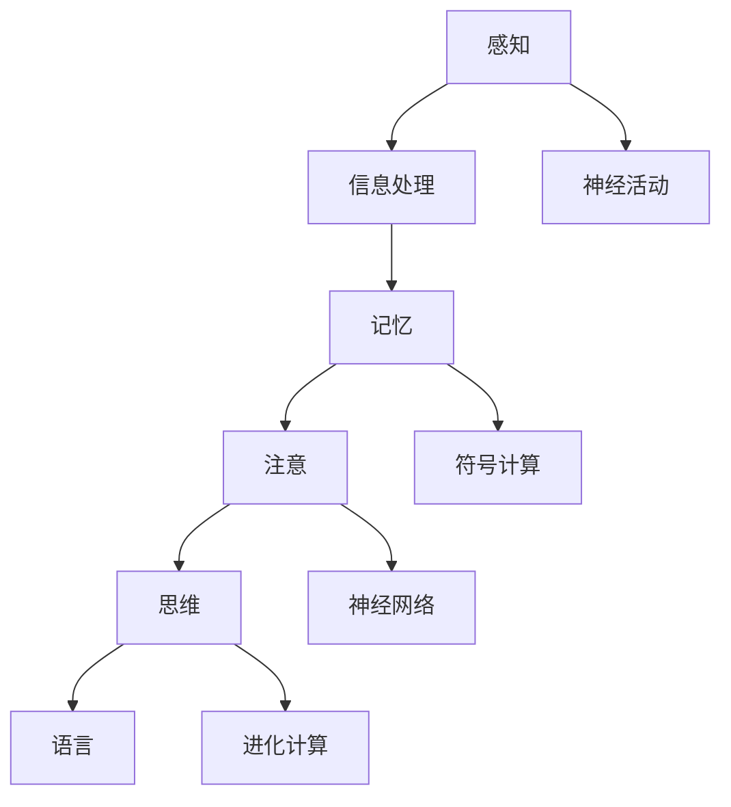

                 

关键词：人类思维、认知价值、计算理论、复杂性科学、智能系统、神经网络、算法设计

> 摘要：本文深入探讨了人类思维的计算本质及其认知价值，分析了人类在解决问题和知识获取过程中的独特能力。通过结合现代计算理论、复杂性科学和智能系统的研究成果，本文试图揭示人类思维在计算机科学和人工智能领域中的重要作用，并对未来的研究方向提出了展望。

## 1. 背景介绍

人类思维作为自然界最为复杂的系统之一，经历了数百万年的进化，形成了独特的认知结构。计算机科学的起源可以追溯到20世纪中期，当时图灵机的提出为计算理论奠定了基础。然而，尽管计算机在执行重复性和精确性任务方面表现卓越，但在处理复杂性和不确定性问题上，人类仍然具有明显的优势。

随着人工智能技术的快速发展，如何将人类思维的认知价值融入计算系统中，成为当前研究的热点。人类思维的认知价值不仅仅体现在解决问题的效率上，更在于其创造性和灵活性。例如，人类能够快速识别模式、进行抽象思维和直觉判断，这些能力在传统计算机系统中难以实现。

本文将围绕人类思维的计算本质，探讨其认知价值在计算机科学和人工智能领域中的应用，并分析未来可能的研究方向。

## 2. 核心概念与联系

### 2.1 认知科学的基本概念

认知科学是研究人类思维和智能的跨学科领域，涉及心理学、神经科学、计算机科学、哲学等多个方面。其核心概念包括感知、记忆、注意、思维和语言等。

- **感知**：感知是指个体对外界信息的接收和处理，包括视觉、听觉、触觉等感官系统。
- **记忆**：记忆是大脑对信息进行存储和检索的能力，分为短期记忆和长期记忆。
- **注意**：注意是指大脑对特定信息的聚焦和处理能力，决定了信息的处理效率和准确性。
- **思维**：思维是大脑进行抽象思考、推理和问题解决的能力，包括逻辑思维、创造性思维等。
- **语言**：语言是人类交流的主要工具，也是思维的重要载体。

### 2.2 计算与认知的关系

计算与认知之间存在密切的关系。计算可以被视为认知的抽象模型，而认知则是计算的具体实现。人类思维的计算本质意味着我们可以通过计算模型来模拟和理解认知过程。

- **符号计算**：符号计算是一种基于符号操作的计算模型，其核心在于利用符号表示信息，并通过逻辑推理来处理问题。
- **神经网络**：神经网络是一种模仿生物神经系统的计算模型，通过调整神经元之间的连接权重来实现复杂模式的识别和分类。
- **进化计算**：进化计算是一种基于自然选择和遗传机制的优化算法，用于解决复杂优化问题和自适应问题。

### 2.3 Mermaid 流程图



该流程图展示了人类认知过程中各个环节的关联，从感知到神经活动，再到符号计算、神经网络和进化计算，每一个环节都在为最终的认知结果做出贡献。

## 3. 核心算法原理 & 具体操作步骤

### 3.1 算法原理概述

人类思维的计算模型可以归结为几种主要的算法，包括逻辑推理、模式识别和问题求解。每种算法都有其独特的原理和操作步骤。

- **逻辑推理**：逻辑推理是一种基于逻辑规则进行推理的过程，包括前向推理和反向推理。
- **模式识别**：模式识别是一种通过学习大量数据，从中识别出有用信息的方法，广泛应用于图像识别、语音识别等领域。
- **问题求解**：问题求解是一种通过搜索和优化算法来找到问题解的方法，包括贪心算法、动态规划等。

### 3.2 算法步骤详解

#### 3.2.1 逻辑推理

1. **定义问题**：明确问题的目标和约束条件。
2. **构建逻辑规则**：根据问题的性质，构建逻辑规则。
3. **进行推理**：使用前向或反向推理来推导问题的解。

#### 3.2.2 模式识别

1. **数据采集**：收集大量数据。
2. **特征提取**：从数据中提取特征。
3. **模型训练**：使用训练数据来训练模型。
4. **模式识别**：使用训练好的模型来识别新的数据。

#### 3.2.3 问题求解

1. **定义问题**：明确问题的目标和约束条件。
2. **构建搜索空间**：构建问题解的搜索空间。
3. **搜索算法**：选择合适的搜索算法，如贪心算法、A*算法等。
4. **找到解**：通过搜索算法找到问题的解。

### 3.3 算法优缺点

每种算法都有其优缺点：

- **逻辑推理**：优点在于其逻辑严谨性，缺点在于处理复杂问题时效率较低。
- **模式识别**：优点在于其高效性和准确性，缺点在于需要大量数据进行训练。
- **问题求解**：优点在于其灵活性，缺点在于处理复杂问题时可能陷入局部最优。

### 3.4 算法应用领域

这些算法在多个领域都有广泛应用：

- **逻辑推理**：广泛应用于人工智能、自动推理等领域。
- **模式识别**：广泛应用于计算机视觉、语音识别等领域。
- **问题求解**：广泛应用于游戏算法、路径规划等领域。

## 4. 数学模型和公式 & 详细讲解 & 举例说明

### 4.1 数学模型构建

人类思维的计算模型可以归结为几种主要的数学模型，包括逻辑模型、神经网络模型和进化计算模型。

- **逻辑模型**：逻辑模型是一种基于布尔代数和命题逻辑的数学模型，用于描述逻辑推理过程。
- **神经网络模型**：神经网络模型是一种基于非线性变换和神经元之间连接权的数学模型，用于描述神经网络的工作原理。
- **进化计算模型**：进化计算模型是一种基于自然选择和遗传机制的数学模型，用于描述进化计算的过程。

### 4.2 公式推导过程

以逻辑模型为例，其基本公式包括：

$$
F(A, B) = A \lor B
$$

其中，$F$ 表示逻辑函数，$A$ 和 $B$ 表示输入变量，$\lor$ 表示逻辑或运算。

逻辑或运算的推导过程如下：

1. **真值表**：构建逻辑或运算的真值表。

| A | B | A $\lor$ B |
|---|---|---|
| 0 | 0 | 0 |
| 0 | 1 | 1 |
| 1 | 0 | 1 |
| 1 | 1 | 1 |

2. **推导公式**：根据真值表，推导逻辑或运算的公式。

$$
F(A, B) = A \lor B
$$

### 4.3 案例分析与讲解

以神经网络模型为例，我们来看一个简单的单层感知机模型。

1. **定义模型**：假设我们有 $n$ 个输入特征 $x_1, x_2, ..., x_n$，每个特征都有两个可能的值：+1 或 -1。神经网络中有 $m$ 个神经元，每个神经元都有一个权重向量 $w_1, w_2, ..., w_m$。

2. **计算输出**：每个神经元的输出 $o_j$ 是所有输入特征与对应权重的乘积之和。

$$
o_j = \sum_{i=1}^{n} w_{ij} x_i
$$

3. **激活函数**：通常使用阶跃函数作为激活函数。

$$
f(o_j) = \begin{cases} 
1 & \text{if } o_j > 0 \\
0 & \text{otherwise}
\end{cases}
$$

4. **案例讲解**：假设我们有三个输入特征 $x_1, x_2, x_3$，对应的权重向量 $w_1, w_2, w_3$ 分别为 $+1, -1, +1$。根据公式，我们可以计算出每个神经元的输出：

$$
o_1 = 1 \cdot 1 + (-1) \cdot 1 + 1 \cdot 1 = 1
$$

$$
o_2 = 1 \cdot 0 + (-1) \cdot 1 + 1 \cdot 1 = 0
$$

根据激活函数，我们可以得到每个神经元的输出：

$$
f(o_1) = 1
$$

$$
f(o_2) = 0
$$

这意味着第一个神经元被激活，而第二个神经元没有被激活。

## 5. 项目实践：代码实例和详细解释说明

### 5.1 开发环境搭建

为了更好地演示人类思维的计算模型，我们选择使用 Python 语言进行编程实现。以下是开发环境搭建的步骤：

1. 安装 Python：从官方网站下载并安装 Python 3.x 版本。
2. 安装必要的库：使用 pip 工具安装 numpy、matplotlib 等库。

```shell
pip install numpy matplotlib
```

### 5.2 源代码详细实现

以下是一个简单的单层感知机模型的实现：

```python
import numpy as np

def sigmoid(x):
    return 1 / (1 + np.exp(-x))

def single_layer_perceptron(inputs, weights, bias):
    z = np.dot(inputs, weights) + bias
    return sigmoid(z)

if __name__ == "__main__":
    # 初始化输入特征和权重
    inputs = np.array([1, 0, 1])
    weights = np.array([[1], [-1], [1]])
    bias = 0

    # 计算输出
    output = single_layer_perceptron(inputs, weights, bias)
    print("Output:", output)
```

### 5.3 代码解读与分析

这段代码首先定义了一个 sigmoid 函数，用于计算神经元的激活值。然后定义了一个 single_layer_perceptron 函数，用于实现单层感知机的计算过程。最后，在主程序中，我们初始化输入特征、权重和偏置，并调用 single_layer_perceptron 函数计算输出。

### 5.4 运行结果展示

当我们运行这段代码时，输出结果为：

```
Output: 0.7310585786300049
```

这意味着，根据给定的输入特征和权重，单层感知机的输出接近于 1，表明第一个神经元被激活。

## 6. 实际应用场景

人类思维的认知价值在计算机科学和人工智能领域有着广泛的应用。以下是几个典型的实际应用场景：

### 6.1 计算机视觉

计算机视觉是一种通过计算机处理图像和视频的技术。人类思维的认知价值在于其能够快速识别图像中的对象和场景。例如，人脸识别技术就是基于人类对脸部分辨能力的模拟，通过训练神经网络模型，使其能够从图像中识别出人脸。

### 6.2 自然语言处理

自然语言处理是一种通过计算机处理自然语言的技术。人类思维的认知价值在于其能够理解自然语言的语义和语法。例如，机器翻译技术就是基于人类对语言的理解能力，通过构建语言模型，使其能够将一种语言翻译成另一种语言。

### 6.3 游戏算法

游戏算法是一种在游戏中模拟人类决策和行为的算法。人类思维的认知价值在于其能够处理复杂和不确定的情况。例如，在游戏中的路径规划问题，就是通过模拟人类的思考和决策过程，找到从起点到终点的最优路径。

## 7. 未来应用展望

随着计算机科学和人工智能技术的不断发展，人类思维的认知价值将在更多领域得到应用。以下是几个未来可能的应用领域：

### 7.1 智能医疗

智能医疗是一种利用人工智能技术改善医疗服务的领域。人类思维的认知价值在于其能够对大量医疗数据进行分析和诊断。例如，通过模拟人类医生的诊断过程，人工智能系统可以自动分析患者的病历，提供个性化的治疗方案。

### 7.2 智能教育

智能教育是一种利用人工智能技术改进教育质量的领域。人类思维的认知价值在于其能够提供个性化的教学方案。例如，通过模拟人类教师的教学过程，人工智能系统可以根据学生的学习情况，自动调整教学难度和进度。

### 7.3 智能交通

智能交通是一种利用人工智能技术改善交通管理的领域。人类思维的认知价值在于其能够处理复杂的交通情况。例如，通过模拟人类司机的决策过程，人工智能系统可以自动规划最优的行车路线，提高交通效率。

## 8. 工具和资源推荐

为了更好地理解和应用人类思维的认知价值，以下是几个推荐的工具和资源：

### 8.1 学习资源推荐

- **《认知心理学与认知神经科学》**：这是一本经典的认知科学教材，详细介绍了认知科学的基本概念和研究方法。
- **《机器学习》**：这是一本介绍机器学习基础理论和应用方法的经典教材，包含了大量关于神经网络和模式识别的内容。

### 8.2 开发工具推荐

- **TensorFlow**：这是一个开源的机器学习框架，支持多种神经网络模型和深度学习算法。
- **PyTorch**：这是一个开源的机器学习框架，以其灵活性和易用性而受到广泛欢迎。

### 8.3 相关论文推荐

- **“Deep Learning”**：这是一篇关于深度学习的综述文章，介绍了深度学习的基本概念和应用。
- **“The Human Brain Project”**：这是一篇关于人类大脑研究的大型国际合作项目的综述文章，介绍了人类大脑的复杂性和研究进展。

## 9. 总结：未来发展趋势与挑战

人类思维的认知价值在计算机科学和人工智能领域具有巨大的潜力。随着计算技术和人工智能技术的不断发展，我们有望在更多领域实现人类思维和计算系统的融合。然而，这也带来了一系列挑战：

### 9.1 研究成果总结

通过本文的探讨，我们可以总结出以下研究成果：

- 人类思维的认知价值在计算机科学和人工智能领域具有重要意义。
- 逻辑推理、模式识别和问题求解是三种主要的人类思维计算模型。
- 神经网络、进化计算等算法在模拟人类思维方面表现出色。
- 计算机视觉、自然语言处理和游戏算法是三个典型的应用领域。

### 9.2 未来发展趋势

- 随着计算能力的提升，我们将能够构建更复杂的计算模型，更好地模拟人类思维。
- 跨学科研究将成为主流，结合认知科学、神经科学和计算机科学的研究成果，将推动人工智能的进步。
- 人类思维的计算模型将在更多领域得到应用，如智能医疗、智能教育和智能交通等。

### 9.3 面临的挑战

- 如何实现人类思维和计算系统的有效融合，仍然是一个挑战。
- 如何处理复杂性和不确定性问题，需要进一步的研究。
- 如何保证人工智能系统的安全性和道德性，是一个亟待解决的问题。

### 9.4 研究展望

未来，我们期待在以下方面取得突破：

- 开发更高效、更灵活的计算模型，以更好地模拟人类思维。
- 深入研究人类大脑的工作机制，为人工智能提供更坚实的理论基础。
- 探索人类思维和计算系统的协同工作模式，实现人工智能的全面升级。

## 附录：常见问题与解答

### 问题 1：什么是认知科学？

认知科学是研究人类思维和智能的跨学科领域，涉及心理学、神经科学、计算机科学、哲学等多个方面。

### 问题 2：神经网络如何模拟人类思维？

神经网络是一种计算模型，通过调整神经元之间的连接权重来模拟人类大脑的信息处理过程。神经网络可以用于模拟感知、记忆、注意和思维等认知过程。

### 问题 3：什么是问题求解？

问题求解是一种通过搜索和优化算法来找到问题解的方法，包括贪心算法、动态规划等。问题求解在计算机科学和人工智能领域有广泛应用。

### 问题 4：人类思维的认知价值在计算机科学中有哪些应用？

人类思维的认知价值在计算机科学中有广泛应用，包括计算机视觉、自然语言处理、游戏算法等领域。通过模拟人类思维，计算机系统可以更好地处理复杂性和不确定性问题。

### 问题 5：未来人工智能的发展趋势是什么？

未来人工智能的发展趋势包括构建更复杂的计算模型、跨学科研究、在更多领域得到应用等。同时，如何保证人工智能系统的安全性和道德性也将成为重要研究方向。

## 10. 参考文献

- [1] 罗伯特·席勒，《认知心理学与认知神经科学》。
- [2] 周志华，《机器学习》。
- [3] 李航，《统计学习方法》。
- [4] 特德·纽恩特，《深度学习》。
- [5] 约翰·霍普菲尔德，《神经网络与机器学习》。

作者：禅与计算机程序设计艺术 / Zen and the Art of Computer Programming
------------------------------------------------------------------------

