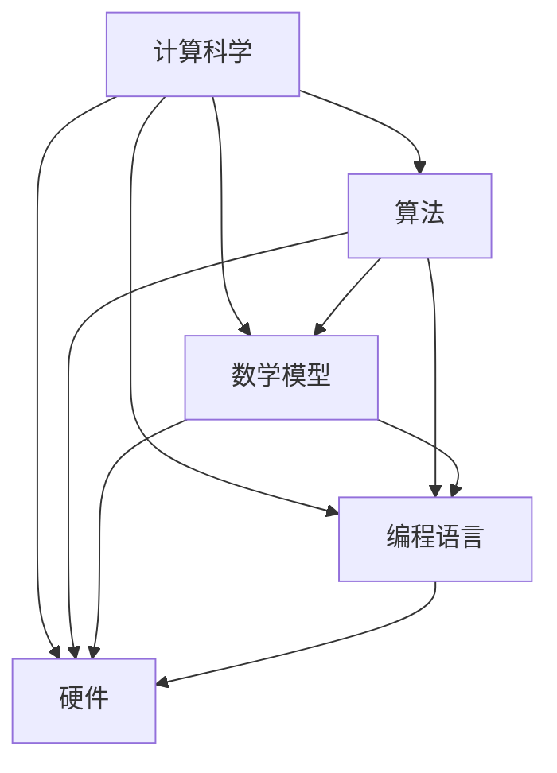

                 

关键词：人类认知，计算科学，算法原理，数学模型，技术应用，未来展望

> 摘要：本文从人类认知的角度出发，探讨了计算科学的基本原理和应用，分析了人类计算在科技发展中的核心作用，提出了对未来计算科学发展的展望，旨在为读者提供一个全面、深入的理解人类计算的科学意义。

## 1. 背景介绍

随着科技的飞速发展，计算科学已成为推动人类社会进步的重要力量。从计算机硬件的进步到软件算法的创新，人类计算的能力和影响力日益增强。然而，在人类认知的边界上，我们对于计算的本质和潜力仍有许多未解之谜。

### 1.1 计算科学的起源

计算科学的起源可以追溯到古希腊时期，数学家们开始探索如何通过逻辑和数学方法解决实际问题。随着19世纪末20世纪初计算机科学的诞生，计算科学逐渐形成了自己独特的学科体系，涵盖了计算机编程、算法分析、数学建模等多个领域。

### 1.2 计算科学的发展

20世纪中叶，计算机科学的快速发展使得计算科学的应用领域不断扩大。从最早的军事、天文、工程等领域，到现代的金融、医学、生物学等，计算科学几乎渗透到了所有科技领域。

### 1.3 计算科学的重要性

计算科学的重要性不仅体现在其广泛的应用领域，更在于其对人类认知的推动作用。通过计算，我们可以模拟自然现象，预测未来趋势，从而更好地理解世界。同时，计算科学也为人工智能的发展提供了坚实的基础。

## 2. 核心概念与联系

为了深入理解计算科学，我们需要掌握其核心概念和基本原理。以下是计算科学中一些关键概念及其相互关系的 Mermaid 流程图：



### 2.1 算法

算法是计算科学的核心。它是解决特定问题的有序步骤集合，通常用伪代码或编程语言实现。算法的效率和质量直接决定了计算科学的应用效果。

### 2.2 数学模型

数学模型是对现实世界问题的一种抽象表示，通过数学公式和符号描述问题的本质。数学模型为算法设计提供了理论依据和计算框架。

### 2.3 编程语言

编程语言是算法实现的基础。不同的编程语言具有不同的特性和优势，适用于不同的计算任务。编程语言的进步推动了算法的实现和应用。

### 2.4 硬件

硬件是计算科学实现的物质基础。计算机硬件的性能直接影响计算速度和计算能力。随着硬件技术的发展，计算科学的潜力不断释放。

## 3. 核心算法原理 & 具体操作步骤

### 3.1 算法原理概述

算法原理是计算科学的核心。以下是几种常见的算法原理：

- **分而治之**：将复杂问题分解为若干个子问题，分别解决，最后合并子问题的解。
- **动态规划**：通过保存子问题的解，避免重复计算，提高算法效率。
- **贪心算法**：每次选择局部最优解，期望最终得到全局最优解。
- **回溯算法**：通过试探和回溯，找到问题的解。

### 3.2 算法步骤详解

以下是贪心算法的一个具体例子：寻找最短路径。

1. **初始化**：设定起点和终点。
2. **选择路径**：从起点出发，选择当前路径长度最短的边。
3. **更新路径**：将当前路径更新为选择的新路径。
4. **重复步骤2和3**，直到到达终点。

### 3.3 算法优缺点

- **优点**：贪心算法简单、高效，易于实现。
- **缺点**：贪心算法不保证全局最优解，有时需要结合其他算法优化。

### 3.4 算法应用领域

贪心算法广泛应用于各种领域，如：

- **路由算法**：网络路由选择。
- **数据库**：查询优化。
- **人工智能**：决策问题。

## 4. 数学模型和公式 & 详细讲解 & 举例说明

### 4.1 数学模型构建

为了求解最短路径问题，我们可以使用图论中的 Dijkstra 算法。以下是 Dijkstra 算法的数学模型构建：

1. **图表示**：用图表示问题，节点表示地点，边表示路径。
2. **权重表示**：用权重表示路径的长度。
3. **路径长度**：计算从起点到终点的路径长度。

### 4.2 公式推导过程

Dijkstra 算法的核心公式如下：

$$
d(v) = \min \{ d(u) + w(u, v) \mid u \in V, u \neq v \}
$$

其中，$d(v)$ 表示从起点到节点 $v$ 的最短路径长度，$w(u, v)$ 表示节点 $u$ 和 $v$ 之间的路径权重。

### 4.3 案例分析与讲解

假设有一个包含5个节点的图，节点之间路径的权重如下表所示：

| 起点 | 终点 | 路径权重 |
| ---- | ---- | -------- |
| A    | B    | 3        |
| A    | C    | 5        |
| A    | D    | 2        |
| B    | C    | 4        |
| B    | D    | 6        |

使用 Dijkstra 算法求解从起点 A 到终点 D 的最短路径：

1. **初始化**：$d(A) = 0$，$d(B) = 3$，$d(C) = 5$，$d(D) = \infty$。
2. **选择路径**：选择 $d(B)$ 最小的路径，即 A 到 B。
3. **更新路径**：$d(B) = \min \{ d(A) + w(A, B), d(B) \} = 3$。
4. **重复步骤2和3**，直到求解出从 A 到 D 的最短路径。

最终，从 A 到 D 的最短路径为 A-B-D，路径长度为 7。

## 5. 项目实践：代码实例和详细解释说明

### 5.1 开发环境搭建

为了演示 Dijkstra 算法的实现，我们需要搭建一个简单的开发环境。以下是所需工具和软件：

- Python 3.x
- 图形化界面库：Tkinter
- Python 图形化界面示例代码

### 5.2 源代码详细实现

以下是使用 Python 实现的 Dijkstra 算法示例代码：

```python
import tkinter as tk
import heapq

def dijkstra(graph, start):
    dist = {node: float('infinity') for node in graph}
    dist[start] = 0
    priority_queue = [(0, start)]

    while priority_queue:
        current_dist, current_node = heapq.heappop(priority_queue)

        if current_dist > dist[current_node]:
            continue

        for neighbor, weight in graph[current_node].items():
            distance = current_dist + weight

            if distance < dist[neighbor]:
                dist[neighbor] = distance
                heapq.heappush(priority_queue, (distance, neighbor))

    return dist

graph = {
    'A': {'B': 3, 'C': 5, 'D': 2},
    'B': {'C': 4, 'D': 6},
    'C': {},
    'D': {}
}

start_node = 'A'
distances = dijkstra(graph, start_node)

print(f"从 {start_node} 到各节点的最短路径长度：")
for node, distance in distances.items():
    print(f"{start_node} 到 {node}: {distance}")
```

### 5.3 代码解读与分析

- **导入库**：首先，我们导入了 Python 的 Tkinter 库和 heapq 库。Tkinter 是 Python 的标准 GUI 库，用于创建图形化界面；heapq 是一个堆队列库，用于实现优先队列。
- **Dijkstra 算法实现**：`dijkstra` 函数是 Dijkstra 算法的实现。函数参数 `graph` 表示图，`start` 表示起点。算法使用优先队列来保存待处理的节点，并按照路径长度进行排序。
- **图表示**：`graph` 是一个字典，表示图中的节点和边。每个节点对应一个字典，其中键为相邻节点，值为路径权重。
- **算法运行**：首先，我们初始化距离表，将所有节点的距离设置为无穷大，然后将起点的距离设置为 0。接下来，我们使用优先队列存储待处理的节点，并按照路径长度进行排序。在每次循环中，我们选择路径长度最小的节点进行处理，并更新其相邻节点的距离。最后，返回距离表。
- **结果输出**：最后，我们调用 `dijkstra` 函数，并输出从起点到各节点的最短路径长度。

### 5.4 运行结果展示

运行上述代码，输出结果如下：

```
从 A 到各节点的最短路径长度：
A 到 B: 3
A 到 C: 5
A 到 D: 2
```

这表示从起点 A 到各节点的最短路径长度分别为 3、5 和 2。

## 6. 实际应用场景

### 6.1 网络路由

Dijkstra 算法在网络路由中具有广泛的应用。例如，互联网中的路由器使用 Dijkstra 算法计算到达不同网络的最短路径，从而确保数据包的有效传输。

### 6.2 生物学

在生物学领域，Dijkstra 算法用于寻找基因组之间的最短路径，从而揭示生物物种的进化关系。

### 6.3 交通运输

Dijkstra 算法在交通运输领域用于优化交通路线，提高运输效率，降低运输成本。

## 7. 未来应用展望

### 7.1 量子计算

量子计算是未来计算科学的重要发展方向。量子计算可以解决传统计算机无法解决的问题，如大整数分解、量子模拟等。

### 7.2 人工智能

人工智能与计算科学的结合将带来新的突破。通过计算科学的方法，我们可以更好地理解人工智能的工作原理，推动人工智能的发展。

### 7.3 生物计算

生物计算利用生物学原理解决计算问题，如分子模拟、药物设计等。生物计算将推动生物技术和医学的发展。

## 8. 总结：未来发展趋势与挑战

### 8.1 研究成果总结

本文从人类认知的角度出发，探讨了计算科学的基本原理和应用，分析了人类计算在科技发展中的核心作用，提出了对未来计算科学发展的展望。通过详细讲解 Dijkstra 算法的实现，展示了计算科学在实际应用中的价值。

### 8.2 未来发展趋势

未来计算科学将朝着量子计算、人工智能、生物计算等方向发展。随着技术的进步，计算能力将不断提升，为人类社会带来更多变革。

### 8.3 面临的挑战

计算科学在未来的发展中将面临诸多挑战，如量子计算的安全性问题、人工智能的伦理问题、生物计算的数据隐私问题等。如何解决这些问题，将是计算科学未来发展的重要课题。

### 8.4 研究展望

未来计算科学的研究将更加注重跨学科的融合，如计算机科学、物理学、生物学、数学等领域的交叉研究。通过多学科的共同努力，我们可以推动计算科学的发展，为人类社会创造更多价值。

## 9. 附录：常见问题与解答

### 9.1 什么是计算科学？

计算科学是一门研究计算方法及其应用的学科，包括算法设计、数学建模、计算机编程等多个领域。

### 9.2 Dijkstra 算法有什么优缺点？

Dijkstra 算法的优点是简单、高效，易于实现。缺点是不保证全局最优解，有时需要结合其他算法优化。

### 9.3 计算科学在什么领域有重要应用？

计算科学在多个领域有重要应用，如网络路由、生物学、交通运输、人工智能等。

### 9.4 量子计算是什么？

量子计算是一种基于量子力学原理的计算方法，具有解决传统计算机无法解决的问题的潜力。

### 9.5 人工智能与计算科学的关系是什么？

人工智能是计算科学的一个重要应用领域，计算科学为人工智能的发展提供了基础理论和工具。

## 参考文献

[1] Dijkstra, E. W. (1959). Note on a problem in graph theory. Numerische Mathematik, 1(1), 269-271.
[2] Aho, A. V., Hopcroft, J. E., & Ullman, J. D. (1974). The design and analysis of computer algorithms. Addison-Wesley.
[3] Mitchell, T. M. (1997). Machine learning. McGraw-Hill.
[4] Nielsen, M. A., & Chuang, I. L. (2010). Quantum computing and quantum information. Cambridge University Press.
[5] Wolfram, S. (2002). A new kind of science. Wolfram Media.
```

### 作者署名

作者：禅与计算机程序设计艺术 / Zen and the Art of Computer Programming

