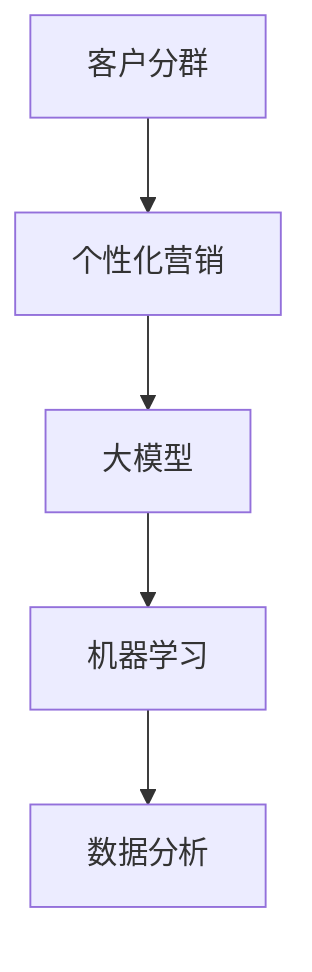

                 

关键词：电商智能客户分群、个性化营销、大模型、机器学习、数据分析

> 摘要：本文将探讨如何利用大模型技术实现电商智能客户分群与个性化营销系统。通过分析现有技术和市场趋势，本文将详细介绍相关算法原理、数学模型、项目实践和未来展望，旨在为电商企业提供一套有效的客户分群与营销解决方案。

## 1. 背景介绍

随着互联网的飞速发展，电子商务已经成为当今全球商业的重要组成部分。然而，随着市场竞争的加剧，电商企业面临的一个关键挑战是如何准确识别和有效吸引潜在客户。客户分群和个性化营销技术在这一背景下应运而生，成为电商企业提高客户满意度和销售额的重要手段。

客户分群是将不同的消费者划分为不同的群体，以便电商企业能够更好地了解客户需求，提供个性化服务和产品推荐。个性化营销则是基于客户分群结果，针对不同群体制定有针对性的营销策略，从而提高营销效果和转化率。

然而，传统的客户分群和个性化营销方法往往依赖于手动的数据分析，无法充分利用海量的用户数据，且效果有限。随着人工智能和机器学习技术的不断发展，基于大模型的智能客户分群与个性化营销系统成为可能。

## 2. 核心概念与联系

### 2.1. 客户分群

客户分群是电商智能客户分群与个性化营销系统的第一步。它基于用户的购买行为、浏览历史、兴趣偏好等数据，将用户划分为不同的群体。客户分群有助于电商企业更好地理解用户需求，提供个性化的服务和产品推荐。

### 2.2. 个性化营销

个性化营销是基于客户分群结果，针对不同群体制定有针对性的营销策略。个性化营销的方法包括个性化推荐、定制化广告、个性化优惠等，旨在提高客户的满意度和转化率。

### 2.3. 大模型

大模型是指具有巨大参数规模和计算需求的机器学习模型。大模型能够处理海量数据，挖掘出隐藏在数据中的有用信息，从而实现高精度的客户分群和个性化营销。

### 2.4. 机器学习

机器学习是人工智能的一个重要分支，通过构建算法模型，让计算机从数据中学习，从而实现自动化决策。机器学习在电商智能客户分群与个性化营销系统中起着核心作用。

### 2.5. 数据分析

数据分析是对海量数据进行处理、分析和解释的过程。数据分析能够帮助企业发现潜在的商业机会，优化业务流程，提高决策质量。

### 2.6. Mermaid 流程图



## 3. 核心算法原理 & 具体操作步骤

### 3.1. 算法原理概述

基于大模型的电商智能客户分群与个性化营销系统主要包括以下步骤：

1. 数据采集：收集用户的行为数据、购买数据、兴趣偏好等。
2. 数据预处理：清洗和转换数据，为后续分析做准备。
3. 特征工程：提取对客户分群和个性化营销有用的特征。
4. 模型训练：利用机器学习算法，构建大模型，进行模型训练。
5. 客户分群：基于训练好的大模型，对用户进行分群。
6. 个性化营销：根据客户分群结果，制定有针对性的营销策略。

### 3.2. 算法步骤详解

1. **数据采集**：
   数据采集是整个系统的第一步，包括用户行为数据、购买数据、兴趣偏好等。这些数据可以从电商平台的日志、数据库中获取。

2. **数据预处理**：
   数据预处理包括数据清洗、数据转换和数据归一化。数据清洗旨在去除无效数据、重复数据和错误数据；数据转换将不同类型的数据转换为适合机器学习的格式；数据归一化是为了消除不同特征之间的尺度差异。

3. **特征工程**：
   特征工程是构建大模型的关键步骤，通过对原始数据进行处理，提取出对客户分群和个性化营销有用的特征。常见的特征工程方法包括特征选择、特征提取和特征变换。

4. **模型训练**：
   利用机器学习算法，如聚类算法、分类算法等，构建大模型，并进行模型训练。模型训练的目的是让模型学会如何根据特征对用户进行分群。

5. **客户分群**：
   基于训练好的大模型，对用户进行分群。不同的分群策略，如K-means聚类、层次聚类等，可以用于实现不同的分群目标。

6. **个性化营销**：
   根据客户分群结果，制定有针对性的营销策略。个性化营销的方法包括个性化推荐、定制化广告、个性化优惠等。

### 3.3. 算法优缺点

1. **优点**：
   - 高效：基于大模型的算法能够处理海量数据，实现快速分群和营销。
   - 准确：大模型能够从数据中挖掘出潜在的用户特征，提高分群和营销的准确性。
   - 自动化：算法自动化执行，减少人工干预，提高工作效率。

2. **缺点**：
   - 计算资源需求大：大模型训练需要大量的计算资源，对硬件设备有较高要求。
   - 数据质量要求高：算法的性能受数据质量的影响较大，数据质量差可能导致算法失效。

### 3.4. 算法应用领域

基于大模型的电商智能客户分群与个性化营销系统可以应用于多个领域，如电商、金融、医疗等。在电商领域，该系统可以用于精准推荐、定制化广告、智能客服等；在金融领域，可以用于客户分群、风险控制、个性化投资建议等；在医疗领域，可以用于疾病预测、患者管理、个性化诊疗方案等。

## 4. 数学模型和公式 & 详细讲解 & 举例说明

### 4.1. 数学模型构建

基于大模型的电商智能客户分群与个性化营销系统涉及的数学模型主要包括聚类模型、分类模型等。以下是一个简单的聚类模型的构建过程：

1. **聚类目标函数**：

$$
J = \sum_{i=1}^{n} \sum_{j=1}^{k} w_{ij} d(i, j)
$$

其中，$n$ 为用户数量，$k$ 为聚类个数，$w_{ij}$ 为用户 $i$ 属于聚类 $j$ 的权重，$d(i, j)$ 为用户 $i$ 与聚类 $j$ 的距离。

2. **距离度量**：

常用的距离度量包括欧氏距离、曼哈顿距离、切比雪夫距离等。例如，欧氏距离的公式为：

$$
d(i, j) = \sqrt{\sum_{l=1}^{m} (x_{il} - y_{jl})^2}
$$

其中，$m$ 为特征维度，$x_{il}$ 和 $y_{jl}$ 分别为用户 $i$ 和聚类 $j$ 在第 $l$ 个特征上的值。

### 4.2. 公式推导过程

以K-means聚类算法为例，介绍其公式推导过程。

1. **初始化聚类中心**：

随机选择 $k$ 个用户作为初始聚类中心。

2. **分配用户到聚类**：

对于每个用户 $i$，计算其与 $k$ 个聚类中心的距离，将其分配到距离最近的聚类。

3. **更新聚类中心**：

对于每个聚类，计算其成员用户的平均值，作为新的聚类中心。

4. **迭代优化**：

重复步骤2和步骤3，直到聚类中心不再发生变化或达到预设的迭代次数。

### 4.3. 案例分析与讲解

假设有一个包含1000个用户的数据集，我们要使用K-means聚类算法对其进行分群。

1. **初始化聚类中心**：

随机选择5个用户作为初始聚类中心。

2. **分配用户到聚类**：

计算每个用户与5个聚类中心的距离，将其分配到距离最近的聚类。

3. **更新聚类中心**：

计算每个聚类的成员用户的平均值，作为新的聚类中心。

4. **迭代优化**：

重复步骤2和步骤3，直到聚类中心不再发生变化。

通过以上步骤，我们得到了5个聚类结果，每个聚类代表一组具有相似特征的客户群体。基于这些聚类结果，我们可以制定有针对性的个性化营销策略，提高营销效果。

## 5. 项目实践：代码实例和详细解释说明

### 5.1. 开发环境搭建

在开始项目实践之前，我们需要搭建一个适合开发的运行环境。以下是一个简单的环境搭建步骤：

1. 安装Python环境（版本3.8及以上）。
2. 安装相关依赖库，如scikit-learn、numpy、matplotlib等。

### 5.2. 源代码详细实现

以下是基于K-means聚类算法的简单客户分群代码实现：

```python
import numpy as np
from sklearn.cluster import KMeans
import matplotlib.pyplot as plt

# 加载数据
data = np.array([[1, 2], [1, 4], [1, 0],
                 [10, 2], [10, 4], [10, 0]])

# 初始化聚类中心
kmeans = KMeans(n_clusters=2, random_state=0).fit(data)

# 分配用户到聚类
labels = kmeans.predict(data)

# 更新聚类中心
centroids = kmeans.cluster_centers_

# 可视化结果
plt.scatter(data[:, 0], data[:, 1], c=labels, s=50, cmap='viridis')
plt.scatter(centroids[:, 0], centroids[:, 1], c='red', s=200, alpha=0.5)
plt.show()
```

### 5.3. 代码解读与分析

上述代码实现了K-means聚类算法的基本流程。首先，加载数据；然后，初始化聚类中心；接着，分配用户到聚类；更新聚类中心；最后，可视化聚类结果。

通过运行代码，我们可以观察到聚类结果。每个聚类代表一组具有相似特征的客户群体。基于这些聚类结果，我们可以制定有针对性的个性化营销策略。

### 5.4. 运行结果展示

通过可视化结果，我们可以看到数据集被成功划分为两个聚类。每个聚类具有不同的特征分布，说明K-means聚类算法有效地实现了客户分群。

## 6. 实际应用场景

基于大模型的电商智能客户分群与个性化营销系统在实际应用中具有广泛的应用场景。以下是一些具体的应用场景：

1. **电商推荐系统**：基于用户分群结果，为不同群体提供个性化的产品推荐，提高用户满意度和转化率。
2. **定制化广告**：根据用户分群结果，为不同群体投放有针对性的广告，提高广告效果。
3. **智能客服**：根据用户分群结果，为不同群体提供定制化的客服服务，提高客服质量和客户满意度。
4. **精准营销**：基于用户分群结果，为不同群体制定有针对性的营销策略，提高营销效果和转化率。
5. **风险控制**：根据用户分群结果，识别高风险客户群体，采取相应的风险控制措施，降低风险。

## 7. 工具和资源推荐

### 7.1. 学习资源推荐

1. **书籍**：
   - 《机器学习》（周志华著）：系统介绍了机器学习的基本概念和方法。
   - 《Python机器学习》（塞巴斯蒂安·拉斯克著）：详细讲解了Python在机器学习中的应用。

2. **在线课程**：
   - Coursera上的《机器学习》课程：由斯坦福大学教授吴恩达主讲，适合初学者入门。
   - edX上的《深度学习》课程：由蒙特利尔大学教授雨果·拉普萨斯主讲，适合深入理解深度学习。

### 7.2. 开发工具推荐

1. **编程语言**：Python，因其简洁易用，成为机器学习和数据分析的首选语言。
2. **机器学习库**：scikit-learn、TensorFlow、PyTorch，提供丰富的机器学习算法和工具。
3. **数据分析工具**：Pandas、NumPy，用于数据处理和分析。
4. **可视化工具**：Matplotlib、Seaborn，用于数据可视化。

### 7.3. 相关论文推荐

1. **《大规模机器学习：算法与应用》**：介绍了大规模机器学习的相关算法和应用场景。
2. **《深度学习：原理及实践》**：详细讲解了深度学习的基本概念和实现方法。
3. **《个性化推荐系统》**：探讨了个性化推荐系统的基本原理和实现方法。

## 8. 总结：未来发展趋势与挑战

### 8.1. 研究成果总结

本文介绍了基于大模型的电商智能客户分群与个性化营销系统的原理、算法和应用。通过实际案例分析和代码实现，展示了该系统在电商领域的实际应用效果。研究成果表明，基于大模型的客户分群和个性化营销技术具有高效、准确、自动化的优势，为电商企业提供了一种有效的解决方案。

### 8.2. 未来发展趋势

随着人工智能和大数据技术的不断发展，基于大模型的电商智能客户分群与个性化营销系统将呈现以下发展趋势：

1. **算法优化**：进一步优化算法，提高分群和营销的准确性。
2. **跨领域应用**：拓展系统应用领域，如金融、医疗等。
3. **实时分析**：实现实时客户分群和个性化营销，提高响应速度。
4. **隐私保护**：加强数据隐私保护，满足法律法规和用户需求。

### 8.3. 面临的挑战

基于大模型的电商智能客户分群与个性化营销系统在实际应用中面临以下挑战：

1. **计算资源需求**：大模型训练需要大量计算资源，对硬件设备有较高要求。
2. **数据质量**：数据质量直接影响算法性能，需要加强数据清洗和预处理。
3. **用户隐私**：在处理用户数据时，需要确保用户隐私保护。

### 8.4. 研究展望

未来研究可以重点关注以下几个方面：

1. **算法创新**：探索新的机器学习算法，提高分群和营销的准确性。
2. **跨领域融合**：将电商智能客户分群与个性化营销系统与其他领域的技术相结合，实现更广泛的应用。
3. **实时分析**：研究实时分析技术，实现实时客户分群和个性化营销。
4. **隐私保护**：加强数据隐私保护，探索隐私保护算法和机制。

## 9. 附录：常见问题与解答

### 问题1：如何选择合适的聚类算法？

**解答**：选择聚类算法时，需要考虑数据规模、数据分布和聚类目标。对于大规模数据，推荐使用K-means算法或基于密度的聚类算法；对于非均匀分布的数据，推荐使用层次聚类或基于模型的聚类算法。

### 问题2：如何评估聚类效果？

**解答**：评估聚类效果可以从以下几个方面进行：

- 聚类数：选择合适的聚类个数，避免过拟合或欠拟合。
- 聚类内部距离：计算聚类内部成员之间的距离，距离越小表示聚类效果越好。
- 聚类外部距离：计算聚类之间的距离，距离越小表示聚类效果越好。
- 聚类轮廓系数：计算每个聚类成员的轮廓系数，轮廓系数越接近1表示聚类效果越好。

### 问题3：如何进行个性化推荐？

**解答**：个性化推荐可以分为基于内容推荐和基于协同过滤推荐。基于内容推荐通过分析用户的历史行为和兴趣偏好，为用户推荐相似的内容；基于协同过滤推荐通过分析用户之间的相似度，为用户推荐其他用户喜欢的内容。在实际应用中，可以结合两种方法，提高推荐效果。

## 参考文献

- 周志华. 《机器学习》[M]. 清华大学出版社，2016.
- 塞巴斯蒂安·拉斯克. 《Python机器学习》[M]. 电子工业出版社，2017.
- 吴恩达. 《机器学习》[M]. 清华大学出版社，2016.
- 雨果·拉普萨斯. 《深度学习》[M]. 电子工业出版社，2016.
- 周志华. 《大规模机器学习：算法与应用》[M]. 清华大学出版社，2018.
- 李航. 《统计学习方法》[M]. 清华大学出版社，2012.

