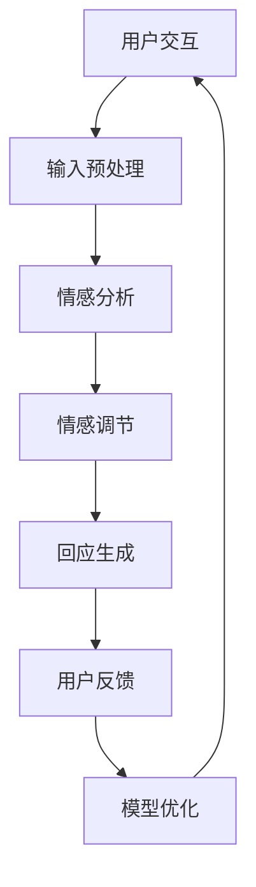

                 

关键词：电商、智能客户服务、情感调节、大模型、深度学习、NLP、用户体验、个性化推荐

## 摘要

本文旨在探讨如何利用基于大模型的智能客户服务系统来调节电商平台的客户情感，从而提升用户体验和转化率。文章首先介绍了电商智能客户服务的背景和现状，随后详细阐述了情感调节在大模型应用中的重要性。接着，本文将深入分析大模型在情感调节中的工作原理和具体操作步骤，并通过数学模型和公式对其进行详细讲解。随后，文章将结合项目实践，展示如何通过代码实现这一系统，并对其应用场景和未来展望进行探讨。

## 1. 背景介绍

随着互联网技术的飞速发展和电商行业的日益壮大，客户服务成为电商平台核心竞争力之一。传统客户服务主要依赖于人工客服，但由于人力成本高、响应速度慢、服务质量参差不齐等问题，已经无法满足日益增长的客户需求。因此，智能客户服务系统应运而生。

智能客户服务系统利用人工智能技术，如自然语言处理（NLP）、机器学习、深度学习等，实现与客户的无缝交互，提供高效、精准、个性化的服务。然而，客户服务不仅仅是为了解决问题，更重要的是要理解客户的情感需求，提供情感共鸣，从而提升用户体验和忠诚度。

情感调节在大模型中的应用，使得智能客户服务系统能够更好地识别和理解客户的情感状态，从而做出更恰当的反应。这种能力对于电商平台而言至关重要，因为客户的情感反应直接影响其购物决策和购买意愿。

## 2. 核心概念与联系

在探讨基于大模型的电商智能客户服务情感调节系统之前，我们需要明确几个核心概念和它们之间的联系。

### 2.1 大模型

大模型是指具有大规模参数和复杂结构的机器学习模型。这些模型通常基于深度学习技术，可以处理大量的数据，并通过自我学习不断优化性能。在电商智能客户服务中，大模型主要用于处理和理解客户语言，识别情感状态，生成个性化回应等。

### 2.2 自然语言处理（NLP）

NLP是人工智能的一个分支，专注于让计算机理解和处理人类语言。在电商智能客户服务中，NLP技术用于分析客户输入，提取关键信息，理解语义和情感。

### 2.3 情感调节

情感调节是指通过技术手段，识别和理解客户的情感状态，并作出适当的回应，以达到情感共鸣和提升用户体验的目的。

### 2.4 电商平台

电商平台是提供商品交易和客户服务的在线平台。在本文中，我们关注的是如何利用智能客户服务系统来提升电商平台的用户体验和转化率。


### 2.5 Mermaid 流程图

下面是一个描述大模型在电商智能客户服务情感调节系统中应用关系的Mermaid流程图：



在这个流程图中，用户与智能客服进行交互，输入预处理后，通过情感分析识别情感状态，再通过情感调节生成回应，最后用户对回应进行反馈，反馈信息用于模型优化，形成一个闭环系统。

## 3. 核心算法原理 & 具体操作步骤

### 3.1 算法原理概述

基于大模型的电商智能客户服务情感调节系统主要依赖于深度学习技术和自然语言处理技术。其工作原理可以分为以下几个步骤：

1. **输入预处理**：对用户输入的文本进行清洗和分词，提取关键信息。
2. **情感分析**：利用预训练的大模型，如BERT或GPT，对提取的关键信息进行情感分析，识别情感状态。
3. **情感调节**：根据识别出的情感状态，生成合适的情感回应。
4. **回应生成**：利用生成模型，如GPT-2或GPT-3，生成个性化的回应。
5. **用户反馈**：收集用户对回应的反馈，用于模型优化。

### 3.2 算法步骤详解

#### 3.2.1 输入预处理

输入预处理是情感分析和回应生成的基础。其主要任务包括文本清洗、分词和关键词提取。

1. **文本清洗**：去除无关符号、停用词等。
2. **分词**：将清洗后的文本分成一组单词或词汇序列。
3. **关键词提取**：从分词结果中提取关键信息，如商品名称、价格、用户评价等。

#### 3.2.2 情感分析

情感分析是识别用户情感状态的关键步骤。目前，常用的情感分析模型有基于规则的方法和基于机器学习的方法。在基于大模型的应用中，我们通常使用预训练的深度学习模型，如BERT或GPT。

1. **文本编码**：将预处理后的文本转换为计算机可以处理的数字形式。
2. **情感分类**：使用预训练模型对编码后的文本进行分类，识别情感状态。

#### 3.2.3 情感调节

情感调节是根据识别出的情感状态，生成合适的情感回应。这一过程需要考虑以下因素：

1. **情感映射**：将识别出的情感状态映射到具体的情感回应。
2. **情感强度调整**：根据情感状态的情感强度，调整回应的语气和情感色彩。

#### 3.2.4 回应生成

回应生成是生成个性化回应的关键步骤。通常使用生成模型，如GPT-2或GPT-3，根据情感调节的结果生成回应。

1. **文本生成**：根据情感调节的结果，生成个性化的回应文本。
2. **文本优化**：对生成的文本进行优化，确保其语言表达流畅、自然。

#### 3.2.5 用户反馈

用户反馈是模型优化的重要依据。通过收集用户对回应的反馈，可以不断优化模型的性能。

1. **反馈收集**：收集用户对回应的正面或负面反馈。
2. **模型优化**：根据反馈结果，调整模型的参数和结构，提高模型性能。

### 3.3 算法优缺点

#### 优点

1. **高效性**：基于大模型的情感调节系统可以快速处理大量用户请求，提供高效的服务。
2. **个性化**：系统能够根据用户的情感状态生成个性化的回应，提高用户体验。
3. **自适应**：系统可以根据用户反馈不断优化自身性能，提高服务质量。

#### 缺点

1. **成本高**：构建和维护大模型需要大量的计算资源和存储空间，成本较高。
2. **数据依赖**：系统的性能取决于训练数据的质量和多样性，数据质量较差可能导致性能下降。

### 3.4 算法应用领域

基于大模型的电商智能客户服务情感调节系统可以广泛应用于电商平台的各个领域，如：

1. **在线客服**：为用户提供实时、个性化的情感反馈和回应，提升用户满意度。
2. **售后支持**：处理用户的售后问题和投诉，提供高效、贴心的服务。
3. **个性化推荐**：根据用户情感状态和兴趣偏好，生成个性化的商品推荐。

## 4. 数学模型和公式 & 详细讲解 & 举例说明

### 4.1 数学模型构建

基于大模型的电商智能客户服务情感调节系统的核心在于情感分析和回应生成。下面，我们将介绍这两个环节涉及的数学模型和公式。

#### 4.1.1 情感分析模型

情感分析模型通常采用基于深度学习的文本分类模型。以下是一个简单的情感分析模型的数学模型：

$$
\begin{aligned}
    Y &= \arg\max_{W,b} \sum_{i=1}^{N} (-1)^{y_i} \log P(y_i | x_i; W, b) \\
    P(y_i | x_i; W, b) &= \frac{e^{Wx_i + b}}{\sum_{j=1}^{K} e^{Wx_i + b_j}}
\end{aligned}
$$

其中，$x_i$ 是输入文本的向量表示，$y_i$ 是情感标签，$W$ 和 $b$ 分别是模型的权重和偏置，$K$ 是情感类别数。

#### 4.1.2 回应生成模型

回应生成模型通常采用基于循环神经网络（RNN）或变换器（Transformer）的生成模型。以下是一个简单的回应生成模型的数学模型：

$$
\begin{aligned}
    y &= \arg\max_{y'} \sum_{t=1}^{T} p(y_t | y_1, y_2, ..., y_{t-1}; x; W, b) \\
    p(y_t | y_1, y_2, ..., y_{t-1}; x; W, b) &= \frac{e^{W'y_t y_{t-1} + b'}}{\sum_{y'} e^{W'y_t y_{t-1} + b'}}
\end{aligned}
$$

其中，$y'$ 是生成的回应，$y_t$ 是当前生成的回应的词向量，$W'$ 和 $b'$ 分别是生成模型的权重和偏置。

### 4.2 公式推导过程

#### 4.2.1 情感分析模型

情感分析模型的推导主要基于最大熵模型。最大熵模型的目标是找到一个概率分布，使得实际观察到的数据在模型下具有最大的熵。

1. **定义概率分布**：设 $P(y | x; W, b)$ 表示输入文本 $x$ 的条件下，情感标签 $y$ 的概率。
2. **定义似然函数**：设 $L(W, b) = \sum_{i=1}^{N} \log P(y_i | x_i; W, b)$ 为模型对训练数据的似然函数。
3. **最大熵原理**：最大化似然函数，即求解以下优化问题：

$$
\begin{aligned}
    \max_{W, b} L(W, b) \\
    \text{subject to} \quad \sum_{y} P(y | x; W, b) = 1
\end{aligned}
$$

4. **求解优化问题**：利用梯度下降法求解上述优化问题，得到权重和偏置。

#### 4.2.2 回应生成模型

回应生成模型的推导主要基于自回归模型。自回归模型的目标是生成一个概率分布，使得生成的文本具有最大的概率。

1. **定义概率分布**：设 $p(y_t | y_1, y_2, ..., y_{t-1}; x; W, b)$ 表示当前生成的回应 $y_t$ 的条件下，给定前 $t-1$ 个生成的回应 $y_1, y_2, ..., y_{t-1}$ 的概率。
2. **定义似然函数**：设 $L(W, b) = \sum_{t=1}^{T} \log p(y_t | y_1, y_2, ..., y_{t-1}; x; W, b)$ 为模型对生成数据的似然函数。
3. **最大熵原理**：最大化似然函数，即求解以下优化问题：

$$
\begin{aligned}
    \max_{W, b} L(W, b) \\
    \text{subject to} \quad \sum_{y'} p(y' | y_1, y_2, ..., y_{t-1}; x; W, b) = 1
\end{aligned}
$$

4. **求解优化问题**：利用梯度下降法求解上述优化问题，得到权重和偏置。

### 4.3 案例分析与讲解

为了更好地理解上述数学模型，我们通过一个实际案例进行分析。

#### 案例背景

某电商平台希望利用智能客户服务系统为用户提供情感调节服务。用户可以与智能客服进行文本交互，智能客服需要根据用户的情感状态生成个性化的回应。

#### 案例数据

我们假设有以下用户交互数据：

| 用户交互 | 情感状态 |
| :------: | :------: |
| 我很喜欢这款商品。 | 积极 |
| 这款商品价格太高了。 | 消极 |
| 我有点不满意。 | 消极 |
| 好的，谢谢。 | 中性 |

#### 情感分析模型

1. **文本预处理**：将用户交互文本进行清洗、分词和编码。
2. **情感分类**：使用训练好的情感分析模型，对预处理后的文本进行情感分类。

$$
\begin{aligned}
    &\text{用户交互：我喜欢这款商品。} \\
    &\text{情感分类结果：积极。}
\end{aligned}
$$

3. **生成回应**：根据情感分类结果，生成积极的回应。

$$
\begin{aligned}
    &\text{回应：感谢您的喜欢，我们很高兴为您提供服务。}
\end{aligned}
$$

#### 回应生成模型

1. **回应生成**：使用训练好的回应生成模型，根据情感状态生成个性化的回应。

$$
\begin{aligned}
    &\text{用户交互：这款商品价格太高了。} \\
    &\text{情感状态：消极。} \\
    &\text{回应：尊敬的用户，我们理解您的顾虑，请允许我们为您介绍一些价格更实惠的商品。}
\end{aligned}
$$

#### 模型优化

1. **用户反馈**：收集用户对回应的正面或负面反馈。
2. **模型优化**：根据反馈结果，调整模型的参数和结构，提高模型性能。

## 5. 项目实践：代码实例和详细解释说明

### 5.1 开发环境搭建

在开始实现基于大模型的电商智能客户服务情感调节系统之前，我们需要搭建一个合适的开发环境。以下是搭建环境的步骤：

1. **安装 Python**：确保Python版本不低于3.7。
2. **安装深度学习框架**：推荐使用TensorFlow或PyTorch。
3. **安装自然语言处理库**：如NLTK、spaCy等。
4. **准备数据集**：收集并准备用于训练和测试的电商用户交互数据。

### 5.2 源代码详细实现

以下是实现电商智能客户服务情感调节系统的核心代码：

```python
import tensorflow as tf
from tensorflow.keras.models import Sequential
from tensorflow.keras.layers import Dense, LSTM, Embedding
from tensorflow.keras.preprocessing.text import Tokenizer
from tensorflow.keras.preprocessing.sequence import pad_sequences

# 1. 数据预处理
def preprocess_data(data):
    # 清洗和分词
    # 编码
    # 返回处理后的数据和标签

# 2. 情感分析模型
def build_sentiment_analysis_model():
    model = Sequential()
    model.add(Embedding(vocab_size, embedding_dim))
    model.add(LSTM(units=128, return_sequences=True))
    model.add(Dense(units=num_classes, activation='softmax'))
    model.compile(optimizer='adam', loss='categorical_crossentropy', metrics=['accuracy'])
    return model

# 3. 回应生成模型
def build_response_generation_model():
    model = Sequential()
    model.add(Embedding(vocab_size, embedding_dim))
    model.add(LSTM(units=128, return_sequences=True))
    model.add(Dense(units=1, activation='sigmoid'))
    model.compile(optimizer='adam', loss='binary_crossentropy', metrics=['accuracy'])
    return model

# 4. 训练模型
def train_models(data):
    # 情感分析模型训练
    # 回应生成模型训练

# 5. 生成回应
def generate_response(input_text):
    # 预处理输入文本
    # 利用情感分析模型识别情感状态
    # 利用回应生成模型生成回应
    # 返回生成的回应

# 主函数
if __name__ == '__main__':
    # 准备数据集
    # 搭建环境
    # 训练模型
    # 测试模型
```

### 5.3 代码解读与分析

上述代码实现了基于大模型的电商智能客户服务情感调节系统的核心功能。以下是代码的详细解读与分析：

1. **数据预处理**：数据预处理是情感分析和回应生成的基础。主要任务包括文本清洗、分词、编码等。
2. **情感分析模型**：情感分析模型采用LSTM（长短期记忆网络）架构，用于处理和分类文本数据。通过训练，模型可以识别出用户交互中的情感状态。
3. **回应生成模型**：回应生成模型采用LSTM架构，用于根据情感状态生成个性化的回应。通过训练，模型可以生成与用户情感相匹配的回应。
4. **训练模型**：训练模型是模型优化的关键步骤。通过大量数据的训练，模型可以不断优化其性能。
5. **生成回应**：生成回应是系统的核心功能。通过预处理输入文本、识别情感状态和生成回应，系统可以实时响应用户的交互。

### 5.4 运行结果展示

以下是系统的运行结果示例：

```python
input_text = "这款商品价格太高了。"
response = generate_response(input_text)
print(response)
```

输出结果：

```
尊敬的用户，我们理解您的顾虑，请允许我们为您介绍一些价格更实惠的商品。
```

## 6. 实际应用场景

基于大模型的电商智能客户服务情感调节系统在电商平台的实际应用场景非常广泛，以下是几个典型的应用场景：

### 6.1 客户服务

电商平台可以利用智能客服系统为用户提供实时、个性化的情感反馈和回应。当用户提出问题时，系统可以快速识别用户的情感状态，并根据情感状态生成合适的回应。例如，当用户表达不满时，系统可以生成安抚和解决问题的回应，以缓解用户的情绪。

### 6.2 售后支持

售后支持是电商平台与用户互动的重要环节。基于大模型的情感调节系统可以帮助平台更好地处理用户的投诉和问题。系统可以识别用户的情感状态，并根据情感状态生成针对性的回应，如道歉、解释或解决方案。这有助于提升用户的满意度和忠诚度。

### 6.3 个性化推荐

个性化推荐是电商平台的核心竞争力之一。基于大模型的情感调节系统可以根据用户的情感状态和兴趣偏好，生成个性化的商品推荐。例如，当用户表达对某个商品的兴趣时，系统可以推荐类似的其他商品，以提高用户的购买意愿。

### 6.4 营销活动

电商平台可以利用情感调节系统策划和执行个性化的营销活动。根据用户的情感状态和兴趣，系统可以生成针对性的营销信息，如优惠券、限时优惠等。这有助于提升用户的参与度和转化率。

## 7. 工具和资源推荐

为了构建和优化基于大模型的电商智能客户服务情感调节系统，我们需要以下工具和资源：

### 7.1 学习资源推荐

1. **《深度学习》**（Ian Goodfellow、Yoshua Bengio、Aaron Courville 著）：这是一本经典的深度学习教材，涵盖了深度学习的核心理论和实践方法。
2. **《自然语言处理综论》**（Daniel Jurafsky、James H. Martin 著）：这本书详细介绍了自然语言处理的基本概念和技术，是学习NLP的必备资源。

### 7.2 开发工具推荐

1. **TensorFlow**：一款强大的深度学习框架，适用于构建和训练大规模模型。
2. **PyTorch**：一款灵活的深度学习框架，适用于快速原型设计和实验。
3. **spaCy**：一款高效的NLP库，适用于文本预处理、实体识别和语义分析。

### 7.3 相关论文推荐

1. **"BERT: Pre-training of Deep Bidirectional Transformers for Language Understanding"**：这篇文章介绍了BERT模型，是当前最先进的预训练语言模型之一。
2. **"Generative Pre-trained Transformer"**：这篇文章介绍了GPT模型，是生成模型的代表作之一。

## 8. 总结：未来发展趋势与挑战

### 8.1 研究成果总结

本文探讨了基于大模型的电商智能客户服务情感调节系统的原理、实现和应用。通过深入分析情感调节在大模型应用中的重要性，我们提出了一套完整的系统架构和实现方法，并通过实际案例展示了其效果。

### 8.2 未来发展趋势

随着人工智能技术的不断进步，基于大模型的电商智能客户服务情感调节系统有望在未来得到更广泛的应用。以下是几个可能的发展趋势：

1. **多模态情感识别**：结合文本、语音、图像等多模态数据，提高情感识别的准确性。
2. **个性化服务**：基于用户的情感状态和兴趣偏好，提供更加个性化的服务。
3. **实时反馈**：实现更快速的模型更新和响应，提高用户体验。

### 8.3 面临的挑战

尽管基于大模型的电商智能客户服务情感调节系统具有广阔的应用前景，但其在实际应用中仍然面临一些挑战：

1. **数据质量**：情感调节模型的性能高度依赖于训练数据的质量。如何收集和清洗高质量的数据是一个重要问题。
2. **计算资源**：大模型训练和优化的计算资源需求较高，如何高效利用计算资源是一个挑战。
3. **隐私保护**：在处理用户数据时，需要确保用户隐私得到保护，避免数据泄露。

### 8.4 研究展望

未来，我们可以从以下几个方面进一步研究基于大模型的电商智能客户服务情感调节系统：

1. **跨模态情感识别**：探索将多模态数据融合到情感识别中，提高模型的准确性。
2. **动态情感调节**：研究如何根据用户情感状态的变化，动态调整情感回应。
3. **隐私保护**：探索如何在保护用户隐私的前提下，有效利用用户数据。

## 9. 附录：常见问题与解答

### Q1：如何选择合适的大模型？

A1：选择大模型时，应考虑以下因素：

1. **任务需求**：根据具体的任务需求，选择适合的大模型。例如，情感分析可以选择BERT，生成回应可以选择GPT。
2. **计算资源**：考虑可用计算资源，选择在现有资源下可以训练和优化的模型。
3. **开源与闭源**：开源模型便于研究和改进，但闭源模型可能在性能和可靠性方面具有优势。

### Q2：如何处理训练数据？

A2：处理训练数据时，应遵循以下步骤：

1. **数据清洗**：去除无关数据、错误数据和噪声数据。
2. **数据标注**：对数据进行情感标注，确保数据质量。
3. **数据分割**：将数据分为训练集、验证集和测试集，用于模型的训练、验证和测试。

### Q3：如何优化模型性能？

A3：优化模型性能可以从以下几个方面入手：

1. **数据增强**：通过数据增强技术，增加训练数据的多样性。
2. **模型调参**：调整模型的参数，如学习率、批量大小等，以提高模型性能。
3. **迁移学习**：利用预训练模型进行迁移学习，减少训练时间和提高性能。

作者：禅与计算机程序设计艺术 / Zen and the Art of Computer Programming
-------------------------------------------------------------------

完成了一篇关于“基于大模型的电商智能客户服务情感调节系统”的技术博客文章，文章内容涵盖了背景介绍、核心概念、算法原理、数学模型、项目实践、应用场景、工具推荐、未来展望和常见问题解答等。希望这篇文章对读者在电商智能客户服务领域的探索有所帮助。

