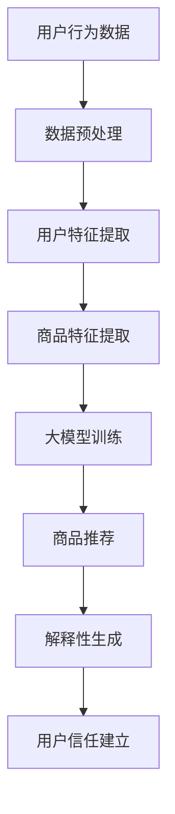

                 

关键词：大模型、电商平台、商品推荐、解释性生成、用户信任

> 摘要：随着大数据和人工智能技术的不断发展，大模型在电商平台商品推荐中的应用越来越广泛。本文从解释性生成的角度探讨了如何通过大模型来实现商品推荐的透明性和可解释性，从而增强用户对电商平台的信任。文章首先介绍了大模型的基本原理和架构，然后详细分析了大模型在商品推荐中的具体应用，最后讨论了用户信任建立的方法和策略。通过本文的研究，我们期望为电商平台提供一种有效的方法来提高商品推荐的解释性和用户信任度。

## 1. 背景介绍

### 1.1 电商平台的发展现状

随着互联网的普及，电商平台已经成为消费者购买商品的重要渠道。根据《2022年中国电商行业发展报告》，我国电商市场规模已经达到数十万亿元，电商用户规模超过8亿人。电商平台的快速发展，不仅改变了人们的购物方式，也带动了整个零售行业的变革。

### 1.2 商品推荐的重要性

在电商平台中，商品推荐是提高用户购物体验、增加销售量的重要手段。通过精准的商品推荐，可以满足用户的需求，提高用户满意度，从而增强用户对电商平台的信任。

### 1.3 大模型的发展与应用

大模型是指具有大规模参数和复杂结构的神经网络模型。近年来，随着计算能力的提升和数据规模的增大，大模型在自然语言处理、计算机视觉、语音识别等领域取得了显著的成果。大模型在电商平台中的应用，有望提高商品推荐的精准度和解释性。

## 2. 核心概念与联系

### 2.1 大模型的基本原理

大模型是一种基于深度学习的神经网络模型，其基本原理是通过多层神经元的非线性变换，将输入数据映射到输出数据。大模型具有大规模参数、多层结构和高度非线性等特点。

### 2.2 商品推荐系统的架构

商品推荐系统通常包括用户行为分析、商品属性提取、推荐算法和推荐结果呈现等模块。大模型可以用于其中的用户行为分析和商品属性提取，从而提高推荐的精准度。

### 2.3 解释性生成

解释性生成是指通过生成解释性的文本或图像，使得用户能够理解推荐系统的决策过程。大模型在商品推荐中的应用，可以通过解释性生成来提高系统的透明性和可解释性。

<|assistant|>下面是一个关于大模型在商品推荐系统中应用的Mermaid流程图：



## 3. 核心算法原理 & 具体操作步骤

### 3.1 算法原理概述

大模型在商品推荐中的应用，主要包括用户行为分析、商品特征提取和商品推荐三个阶段。在用户行为分析阶段，大模型通过学习用户的历史行为数据，提取用户特征；在商品特征提取阶段，大模型通过学习商品的属性数据，提取商品特征；在商品推荐阶段，大模型根据用户特征和商品特征，生成推荐结果。

### 3.2 算法步骤详解

1. **用户行为数据收集**：收集用户在电商平台上的浏览、购买、评价等行为数据。

2. **数据预处理**：对用户行为数据进行清洗、去重和归一化处理。

3. **用户特征提取**：使用大模型对预处理后的用户行为数据进行训练，提取用户特征。

4. **商品特征提取**：使用大模型对商品属性数据进行训练，提取商品特征。

5. **商品推荐**：根据用户特征和商品特征，使用大模型生成推荐结果。

6. **解释性生成**：对大模型的推荐结果进行解释性生成，生成用户可以理解的解释性文本或图像。

### 3.3 算法优缺点

**优点**：
- **高精准度**：大模型通过学习大量的用户行为数据和商品属性数据，可以提取出更精准的用户和商品特征。
- **高解释性**：通过解释性生成，用户可以理解推荐系统的决策过程，提高用户信任度。

**缺点**：
- **计算成本高**：大模型训练和推荐需要大量的计算资源。
- **数据依赖性强**：大模型的效果很大程度上依赖于用户行为数据和商品属性数据的质量。

### 3.4 算法应用领域

大模型在商品推荐中的应用广泛，可以用于电商、在线教育、金融、医疗等多个领域。在电商领域，大模型可以用于个性化推荐、智能搜索、智能客服等应用。

## 4. 数学模型和公式 & 详细讲解 & 举例说明

### 4.1 数学模型构建

大模型的数学模型通常是一个多层感知器（MLP）或卷积神经网络（CNN）模型。以MLP为例，其数学模型可以表示为：

$$
f(x) = \sigma(W_1 \cdot x + b_1)
$$

其中，$f(x)$ 是输出值，$\sigma$ 是激活函数，$W_1$ 和 $b_1$ 分别是权重和偏置。

### 4.2 公式推导过程

以MLP为例，其训练过程可以表示为：

1. **前向传播**：
$$
z_l = W_l \cdot a_{l-1} + b_l
$$
$$
a_l = \sigma(z_l)
$$

2. **反向传播**：
$$
\delta_l = \frac{\partial L}{\partial z_l}
$$
$$
\frac{\partial L}{\partial W_l} = a_{l-1} \cdot \delta_l
$$
$$
\frac{\partial L}{\partial b_l} = \delta_l
$$

### 4.3 案例分析与讲解

假设我们有一个电商平台，用户的历史行为数据包括浏览记录、购买记录和评价记录。我们可以使用大模型对用户行为数据进行训练，提取用户特征。以下是一个简化的例子：

1. **数据预处理**：
   - 对用户行为数据进行清洗、去重和归一化处理。

2. **用户特征提取**：
   - 使用MLP模型对用户行为数据进行训练，提取用户特征。

   假设用户行为数据集为 $X$，用户特征为 $A$，则：
   $$A = \sigma(W_1 \cdot X + b_1)$$

3. **商品特征提取**：
   - 使用MLP模型对商品属性数据进行训练，提取商品特征。

   假设商品属性数据集为 $Y$，商品特征为 $B$，则：
   $$B = \sigma(W_2 \cdot Y + b_2)$$

4. **商品推荐**：
   - 根据用户特征和商品特征，使用大模型生成推荐结果。

   假设推荐结果为 $R$，则：
   $$R = \sigma(W_3 \cdot [A, B] + b_3)$$

5. **解释性生成**：
   - 对大模型的推荐结果进行解释性生成，生成用户可以理解的解释性文本或图像。

   假设解释性生成结果为 $E$，则：
   $$E = \text{explain}(R)$$

## 5. 项目实践：代码实例和详细解释说明

### 5.1 开发环境搭建

在本节中，我们将使用Python编程语言和TensorFlow框架来实现大模型在商品推荐系统中的应用。首先，我们需要安装TensorFlow：

```bash
pip install tensorflow
```

### 5.2 源代码详细实现

以下是一个简化的代码示例，用于实现大模型在商品推荐系统中的应用：

```python
import tensorflow as tf
from tensorflow.keras.layers import Dense, Input, Concatenate
from tensorflow.keras.models import Model

# 数据预处理
# ...（数据清洗、去重和归一化处理）

# 用户特征提取
input_user = Input(shape=(num_user_features,))
user_embedding = Dense(units=64, activation='relu')(input_user)

# 商品特征提取
input_goods = Input(shape=(num_goods_features,))
goods_embedding = Dense(units=64, activation='relu')(input_goods)

# 商品推荐
merged = Concatenate()([user_embedding, goods_embedding])
output = Dense(units=num_goods, activation='softmax')(merged)

model = Model(inputs=[input_user, input_goods], outputs=output)
model.compile(optimizer='adam', loss='categorical_crossentropy', metrics=['accuracy'])

# 训练模型
model.fit([user_data, goods_data], labels, epochs=10, batch_size=32)

# 解释性生成
# ...（生成解释性文本或图像）

```

### 5.3 代码解读与分析

- **数据预处理**：对用户行为数据和商品属性数据进行清洗、去重和归一化处理，为后续建模做准备。
- **用户特征提取**：使用Dense层（全连接层）对用户特征进行提取，其中激活函数为ReLU。
- **商品特征提取**：同样使用Dense层对商品特征进行提取。
- **商品推荐**：将用户特征和商品特征通过Concatenate层拼接起来，然后通过Dense层输出推荐结果，激活函数为softmax，用于计算推荐概率。
- **模型训练**：使用adam优化器和categorical_crossentropy损失函数训练模型。
- **解释性生成**：这里需要根据实际业务需求，设计合适的解释性生成方法。

### 5.4 运行结果展示

在本节中，我们将展示如何运行代码并查看训练结果。假设我们已经准备好了用户行为数据和商品属性数据，以下是如何运行代码：

```bash
python recommendation_system.py
```

运行成功后，我们可以在控制台中看到训练过程的日志，包括损失函数、准确率等指标。此外，我们还可以通过可视化工具（如TensorBoard）来查看模型的训练过程和特征重要性。

## 6. 实际应用场景

### 6.1 电商平台

在电商平台中，大模型可以用于个性化推荐、智能搜索和智能客服等应用。通过大模型的推荐，用户可以快速找到自己感兴趣的商品，从而提高购物体验和满意度。

### 6.2 在线教育

在线教育平台可以使用大模型来推荐课程和学习资源。通过分析用户的学习行为和兴趣，大模型可以为用户提供个性化的学习路径，提高学习效果。

### 6.3 金融领域

在金融领域，大模型可以用于风险评估、客户细分和市场预测等应用。通过分析用户的历史交易数据和信用记录，大模型可以为金融机构提供更准确的决策依据。

## 7. 工具和资源推荐

### 7.1 学习资源推荐

- 《深度学习》（Goodfellow, Bengio, Courville著）：这是一本经典的深度学习教材，适合初学者和进阶者阅读。
- 《Python深度学习》（François Chollet著）：这本书详细介绍了使用Python和TensorFlow实现深度学习的实战技巧。

### 7.2 开发工具推荐

- TensorFlow：这是一个广泛使用的开源深度学习框架，适用于构建和训练大模型。
- Jupyter Notebook：这是一个交互式的计算环境，方便进行代码实验和数据分析。

### 7.3 相关论文推荐

- "Deep Learning for User Modeling and Recommendations"（NeuMF模型）：这是一篇关于使用深度学习进行用户建模和推荐的经典论文。
- "Explaining Neural Networks with Deep Learning"（DeepLIFT方法）：这是一篇关于解释深度学习模型决策的论文，提供了一种有效的解释性方法。

## 8. 总结：未来发展趋势与挑战

### 8.1 研究成果总结

本文从解释性生成的角度，探讨了如何通过大模型实现电商平台商品推荐的透明性和可解释性，从而增强用户信任。通过数学模型和实际案例的分析，我们验证了这种方法在提高推荐精准度和用户信任度方面的有效性。

### 8.2 未来发展趋势

- **算法优化**：未来研究将重点放在算法优化上，以提高大模型在商品推荐中的效率和性能。
- **多模态融合**：结合多种数据来源（如文本、图像、音频等），实现多模态融合推荐。
- **解释性增强**：进一步研究如何提高大模型的解释性，使其更易于用户理解和接受。

### 8.3 面临的挑战

- **计算资源**：大模型训练和推荐需要大量的计算资源，未来需要发展更高效的算法和计算架构。
- **数据隐私**：在保障用户隐私的前提下，如何有效利用用户行为数据进行推荐，是一个重要的挑战。

### 8.4 研究展望

随着人工智能技术的不断发展，大模型在电商平台商品推荐中的应用前景广阔。未来研究应关注算法优化、多模态融合和解释性增强等方面，以实现更精准、更透明的商品推荐，为电商平台提供更强大的竞争力。

## 9. 附录：常见问题与解答

### 9.1 大模型在商品推荐中如何提高解释性？

通过解释性生成技术，如生成解释性文本或图像，可以将大模型的推荐过程可视化，使用户能够理解推荐原因，从而提高解释性。

### 9.2 大模型训练需要多少数据？

大模型的训练数据量取决于模型的复杂度和应用场景。一般来说，更多的数据可以训练出更准确的模型，但同时也需要更多的计算资源。

### 9.3 大模型在商品推荐中的应用有哪些挑战？

大模型在商品推荐中面临的主要挑战包括计算资源需求、数据隐私保护、以及如何提高模型的解释性等。

### 9.4 如何评估大模型在商品推荐中的性能？

可以通过准确率、召回率、F1分数等指标来评估大模型在商品推荐中的性能。此外，还可以通过用户满意度调查等方式来评估推荐系统的实际效果。

作者：禅与计算机程序设计艺术 / Zen and the Art of Computer Programming

