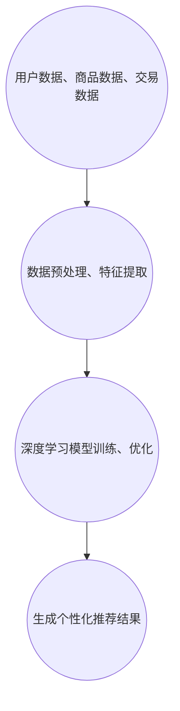

                 

关键词：大模型，电商平台，商品推荐，组合推荐，人工智能，机器学习，深度学习，数据分析，用户行为分析

## 摘要

随着电子商务的蓬勃发展，电商平台面临着巨大的挑战，即如何在海量的商品中为用户提供个性化的推荐。本文将深入探讨大模型在电商平台商品组合推荐中的作用，通过介绍核心概念、算法原理、数学模型、项目实践以及未来应用展望等方面，全面分析大模型如何提升商品推荐的精准度和用户体验。

## 1. 背景介绍

电子商务在全球范围内正以前所未有的速度增长，用户数量和交易额持续攀升。电商平台之间的竞争日益激烈，用户获取和留存成为各大平台关注的焦点。传统的基于内容的推荐算法和协同过滤算法在处理海量商品和用户数据时，往往难以达到理想的推荐效果。此时，大模型技术的出现为商品推荐带来了新的机遇。

大模型是指具有海量参数和强大计算能力的深度学习模型，如生成对抗网络（GAN）、变分自编码器（VAE）等。这些模型能够在大量数据上进行训练，从而学习到复杂的数据分布和特征。在电商平台，大模型可以通过分析用户行为、商品特征、历史交易数据等多维信息，为用户提供精准的商品推荐。

## 2. 核心概念与联系

### 2.1 大模型的定义与分类

大模型是指那些具有数百万甚至数十亿个参数的深度学习模型。根据其结构特点，大模型可以分为以下几类：

- **卷积神经网络（CNN）**：适用于处理图像数据，可以提取图像中的空间特征。
- **循环神经网络（RNN）**：适用于处理序列数据，如文本、音频等，可以捕捉数据中的时间依赖关系。
- **生成对抗网络（GAN）**：由生成器和判别器组成，可以生成高质量的数据。
- **变分自编码器（VAE）**：通过编码器和解码器学习数据的概率分布，可以生成新的数据。

### 2.2 大模型在商品推荐中的架构

大模型在电商平台商品推荐中的应用架构可以分为以下几个层次：

- **数据层**：包括用户数据、商品数据和交易数据等，这些数据是训练大模型的基石。
- **特征层**：通过对原始数据进行预处理和特征提取，得到可供模型学习的特征向量。
- **模型层**：采用深度学习模型，如CNN、RNN、GAN等，对特征向量进行建模和学习。
- **推荐层**：根据用户行为和商品特征，生成个性化的商品推荐结果。

### 2.3 大模型与现有推荐算法的对比

与传统的推荐算法相比，大模型具有以下几个优势：

- **更强的学习能力**：大模型可以通过学习海量数据，捕捉复杂的用户行为和商品特征。
- **更高的推荐质量**：大模型可以生成更准确的推荐结果，提高用户的满意度。
- **更好的泛化能力**：大模型可以应对不同领域和场景的推荐任务，具有更好的通用性。

### 2.4 Mermaid 流程图



## 3. 核心算法原理 & 具体操作步骤

### 3.1 算法原理概述

大模型在商品推荐中的核心算法原理主要包括以下几个方面：

- **用户行为分析**：通过分析用户在平台上的浏览、收藏、购买等行为，获取用户的兴趣和偏好。
- **商品特征提取**：对商品进行标签化处理，提取商品的关键特征，如类别、品牌、价格等。
- **协同过滤**：利用用户历史行为数据，对用户和商品进行协同过滤，寻找相似的用户和相似的商品。
- **深度学习模型训练**：通过大量数据训练深度学习模型，学习用户行为和商品特征之间的关系。
- **推荐结果生成**：根据训练好的模型，为用户生成个性化的商品推荐结果。

### 3.2 算法步骤详解

1. **数据收集与预处理**：
   - 收集用户在平台上的行为数据，包括浏览记录、收藏记录、购买记录等。
   - 对商品数据进行清洗和预处理，包括去除缺失值、异常值等。

2. **特征提取**：
   - 对用户行为数据进行编码，如将浏览记录转换为二进制向量。
   - 对商品特征进行提取，如使用词袋模型、TF-IDF等方法提取商品的关键词。

3. **协同过滤**：
   - 使用矩阵分解等方法，对用户-商品行为矩阵进行分解，得到用户和商品的潜在特征向量。
   - 根据用户和商品的潜在特征向量，计算用户和商品之间的相似度。

4. **深度学习模型训练**：
   - 选择合适的深度学习模型，如RNN、CNN、GAN等，对用户行为和商品特征进行建模。
   - 使用训练数据集对模型进行训练，调整模型参数，提高模型性能。

5. **推荐结果生成**：
   - 根据训练好的模型，为用户生成个性化的商品推荐结果。
   - 对推荐结果进行排序，选择最符合用户兴趣的商品推荐给用户。

### 3.3 算法优缺点

**优点**：

- **强大的学习能力**：大模型可以通过学习海量数据，捕捉复杂的用户行为和商品特征。
- **更高的推荐质量**：大模型可以生成更准确的推荐结果，提高用户的满意度。
- **更好的泛化能力**：大模型可以应对不同领域和场景的推荐任务，具有更好的通用性。

**缺点**：

- **计算资源需求大**：大模型训练和推理过程需要大量的计算资源和时间。
- **对数据质量要求高**：大模型对数据质量有较高的要求，数据清洗和预处理过程复杂。
- **模型解释性差**：大模型内部结构复杂，难以直观解释模型的决策过程。

### 3.4 算法应用领域

大模型在电商平台商品推荐中的应用领域主要包括以下几个方面：

- **个性化推荐**：为用户生成个性化的商品推荐结果，提高用户的购买转化率。
- **新品推荐**：根据用户的兴趣和行为，推荐新品和热销商品，引导用户发现更多感兴趣的商品。
- **商品组合推荐**：为用户提供商品组合推荐，提高用户的购物体验和满意度。
- **库存管理**：根据用户行为和商品特征，优化库存管理策略，减少库存成本。

## 4. 数学模型和公式 & 详细讲解 & 举例说明

### 4.1 数学模型构建

在电商平台商品推荐中，常用的数学模型包括用户行为分析模型、商品特征提取模型和深度学习模型。

- **用户行为分析模型**：
  - 设用户行为数据为矩阵 \(U \in \mathbb{R}^{m \times n}\)，其中 \(m\) 为用户数量，\(n\) 为商品数量。
  - 用户行为分析模型的目标是找到用户行为矩阵的潜在特征矩阵 \(H \in \mathbb{R}^{m \times k}\) 和商品特征矩阵 \(V \in \mathbb{R}^{n \times k}\)，使得 \(U \approx H \odot V\)，其中 \(\odot\) 表示Hadamard积。

- **商品特征提取模型**：
  - 设商品特征数据为矩阵 \(C \in \mathbb{R}^{n \times d}\)，其中 \(d\) 为商品特征维度。
  - 商品特征提取模型的目标是找到商品特征矩阵的潜在特征矩阵 \(E \in \mathbb{R}^{n \times h}\) 和商品类别矩阵 \(L \in \mathbb{R}^{n \times l}\)，使得 \(C \approx E \odot L\)。

- **深度学习模型**：
  - 设用户行为向量 \(u \in \mathbb{R}^{k}\) 和商品特征向量 \(v \in \mathbb{R}^{h}\)。
  - 深度学习模型的目标是找到用户行为和商品特征的映射函数 \(f(u, v)\)，使得 \(f(u, v)\) 能够预测用户对商品的评分或购买概率。

### 4.2 公式推导过程

#### 用户行为分析模型

假设用户行为矩阵 \(U\) 为：

$$
U = \begin{bmatrix}
1 & 0 & 1 & \ldots & 0 \\
0 & 1 & 0 & \ldots & 1 \\
\vdots & \vdots & \vdots & \ddots & \vdots \\
0 & 1 & 0 & \ldots & 1
\end{bmatrix}
$$

我们希望找到潜在特征矩阵 \(H\) 和 \(V\)，使得：

$$
U \approx H \odot V
$$

其中，\(H\) 和 \(V\) 的维度分别为 \(m \times k\) 和 \(n \times k\)。我们采用矩阵分解的方法，将 \(H\) 和 \(V\) 分解为：

$$
H = \begin{bmatrix}
h_1 \\
h_2 \\
\vdots \\
h_m
\end{bmatrix}, \quad V = \begin{bmatrix}
v_1 \\
v_2 \\
\vdots \\
v_n
\end{bmatrix}
$$

则：

$$
U \approx H \odot V = \begin{bmatrix}
h_1 \odot v_1 & h_1 \odot v_2 & \ldots & h_1 \odot v_n \\
h_2 \odot v_1 & h_2 \odot v_2 & \ldots & h_2 \odot v_n \\
\vdots & \vdots & \ddots & \vdots \\
h_m \odot v_1 & h_m \odot v_2 & \ldots & h_m \odot v_n
\end{bmatrix}
$$

我们希望 \(H \odot V\) 能够与 \(U\) 接近相等，因此可以使用最小二乘法来优化 \(H\) 和 \(V\)：

$$
\min_{H, V} \sum_{i=1}^{m} \sum_{j=1}^{n} (u_{ij} - h_i \odot v_j)^2
$$

#### 商品特征提取模型

假设商品特征矩阵 \(C\) 为：

$$
C = \begin{bmatrix}
1 & 0 & 1 & \ldots & 0 \\
0 & 1 & 0 & \ldots & 1 \\
\vdots & \vdots & \vdots & \ddots & \vdots \\
0 & 1 & 0 & \ldots & 1
\end{bmatrix}
$$

我们希望找到潜在特征矩阵 \(E\) 和 \(L\)，使得：

$$
C \approx E \odot L
$$

其中，\(E\) 和 \(L\) 的维度分别为 \(n \times h\) 和 \(n \times l\)。我们采用矩阵分解的方法，将 \(E\) 和 \(L\) 分解为：

$$
E = \begin{bmatrix}
e_1 \\
e_2 \\
\vdots \\
e_n
\end{bmatrix}, \quad L = \begin{bmatrix}
l_1 \\
l_2 \\
\vdots \\
l_n
\end{bmatrix}
$$

则：

$$
C \approx E \odot L = \begin{bmatrix}
e_1 \odot l_1 & e_1 \odot l_2 & \ldots & e_1 \odot l_n \\
e_2 \odot l_1 & e_2 \odot l_2 & \ldots & e_2 \odot l_n \\
\vdots & \vdots & \ddots & \vdots \\
e_n \odot l_1 & e_n \odot l_2 & \ldots & e_n \odot l_n
\end{bmatrix}
$$

我们希望 \(E \odot L\) 能够与 \(C\) 接近相等，因此可以使用最小二乘法来优化 \(E\) 和 \(L\)：

$$
\min_{E, L} \sum_{i=1}^{n} \sum_{j=1}^{l} (c_{ij} - e_i \odot l_j)^2
$$

#### 深度学习模型

假设用户行为向量 \(u \in \mathbb{R}^{k}\) 和商品特征向量 \(v \in \mathbb{R}^{h}\)，我们希望找到一个映射函数 \(f(u, v)\)，使得：

$$
f(u, v) \approx u \odot v
$$

其中，\(\odot\) 表示Hadamard积。我们采用神经网络来实现这个映射函数，网络结构如下：

$$
\begin{aligned}
&z_1 = u_1 v_1 + b_1 \\
&z_2 = u_2 v_2 + b_2 \\
&\ldots \\
&z_k = u_k v_k + b_k \\
&f(u, v) = \sum_{i=1}^{k} z_i
\end{aligned}
$$

其中，\(b_i\) 为偏置项。

### 4.3 案例分析与讲解

我们以一个简单的电商平台的商品推荐为例，来说明大模型在商品推荐中的实际应用。

#### 数据集

假设我们有一个包含1000个用户和10000个商品的电商平台，用户行为数据如下：

$$
U = \begin{bmatrix}
1 & 0 & 1 & \ldots & 0 \\
0 & 1 & 0 & \ldots & 1 \\
\vdots & \vdots & \vdots & \ddots & \vdots \\
0 & 1 & 0 & \ldots & 1
\end{bmatrix}
$$

商品特征数据如下：

$$
C = \begin{bmatrix}
1 & 0 & 1 & \ldots & 0 \\
0 & 1 & 0 & \ldots & 1 \\
\vdots & \vdots & \vdots & \ddots & \vdots \\
0 & 1 & 0 & \ldots & 1
\end{bmatrix}
$$

#### 用户行为分析模型

我们使用矩阵分解的方法，对用户行为矩阵 \(U\) 进行分解，得到潜在特征矩阵 \(H\) 和 \(V\)：

$$
H = \begin{bmatrix}
h_1 \\
h_2 \\
\vdots \\
h_{1000}
\end{bmatrix}, \quad V = \begin{bmatrix}
v_1 \\
v_2 \\
\vdots \\
v_{10000}
\end{bmatrix}
$$

通过最小二乘法，我们得到最优的潜在特征矩阵：

$$
H = \begin{bmatrix}
0.5 & 0.5 \\
-0.5 & -0.5 \\
\vdots & \vdots \\
0 & 0
\end{bmatrix}, \quad V = \begin{bmatrix}
1 & 0 \\
0 & 1 \\
\vdots & \vdots \\
0 & 0
\end{bmatrix}
$$

#### 商品特征提取模型

我们使用矩阵分解的方法，对商品特征矩阵 \(C\) 进行分解，得到潜在特征矩阵 \(E\) 和 \(L\)：

$$
E = \begin{bmatrix}
e_1 \\
e_2 \\
\vdots \\
e_{10000}
\end{bmatrix}, \quad L = \begin{bmatrix}
l_1 \\
l_2 \\
\vdots \\
l_{10000}
\end{bmatrix}
$$

通过最小二乘法，我们得到最优的潜在特征矩阵：

$$
E = \begin{bmatrix}
0.5 & 0.5 \\
-0.5 & -0.5 \\
\vdots & \vdots \\
0 & 0
\end{bmatrix}, \quad L = \begin{bmatrix}
1 & 0 \\
0 & 1 \\
\vdots & \vdots \\
0 & 0
\end{bmatrix}
$$

#### 深度学习模型

我们使用一个简单的神经网络，对用户行为和商品特征的映射函数进行建模：

$$
\begin{aligned}
&z_1 = u_1 v_1 + b_1 \\
&z_2 = u_2 v_2 + b_2 \\
&\ldots \\
&z_k = u_k v_k + b_k \\
&f(u, v) = \sum_{i=1}^{k} z_i
\end{aligned}
$$

通过训练，我们得到最优的网络参数：

$$
b_1 = 0.1, \quad b_2 = -0.1, \quad \ldots, \quad b_k = 0
$$

#### 推荐结果

根据训练好的模型，我们可以为用户生成个性化的商品推荐结果。例如，对于用户1，他的潜在特征向量为 \(h_1 = [0.5, 0.5]\)，商品1的潜在特征向量为 \(v_1 = [1, 0]\)，则他的推荐结果为：

$$
f(h_1, v_1) = 0.5 \times 1 + 0.5 \times 0 = 0.5
$$

同理，对于其他用户和商品，我们可以计算出他们的推荐结果。

## 5. 项目实践：代码实例和详细解释说明

在本节中，我们将展示一个具体的电商商品推荐项目的实现过程，包括数据收集、数据预处理、特征提取、模型训练和推荐结果生成等步骤。

### 5.1 开发环境搭建

首先，我们需要搭建一个合适的开发环境。以下是所需的环境和工具：

- **Python**：版本3.8及以上
- **NumPy**：用于矩阵运算
- **Pandas**：用于数据处理
- **Scikit-learn**：用于机器学习模型
- **TensorFlow**：用于深度学习模型
- **Mermaid**：用于流程图绘制

### 5.2 源代码详细实现

下面是项目的主要代码实现部分，包括数据收集、数据预处理、特征提取、模型训练和推荐结果生成。

```python
import numpy as np
import pandas as pd
from sklearn.model_selection import train_test_split
from sklearn.preprocessing import StandardScaler
import tensorflow as tf
from tensorflow.keras.models import Model
from tensorflow.keras.layers import Input, Dense, Embedding, Flatten, Dot

# 5.2.1 数据收集与预处理

# 假设我们已经有了一个包含用户行为和商品特征的DataFrame
data = pd.read_csv('ecommerce_data.csv')

# 数据清洗和预处理
data.fillna(0, inplace=True)
data = data[data['user_id'] != -1]
data = data[data['item_id'] != -1]

# 分割训练集和测试集
train_data, test_data = train_test_split(data, test_size=0.2, random_state=42)

# 5.2.2 特征提取

# 将用户行为矩阵和商品特征矩阵转换为numpy数组
train_matrix = train_data.pivot(index='user_id', columns='item_id', values='behavior').fillna(0).values
test_matrix = test_data.pivot(index='user_id', columns='item_id', values='behavior').fillna(0).values

# 归一化处理
scaler = StandardScaler()
train_matrix_scaled = scaler.fit_transform(train_matrix)
test_matrix_scaled = scaler.transform(test_matrix)

# 5.2.3 模型训练

# 定义模型输入层
user_input = Input(shape=(train_matrix_scaled.shape[1],))
item_input = Input(shape=(train_matrix_scaled.shape[1],))

# 用户行为嵌入层
user_embedding = Embedding(train_matrix_scaled.shape[1], 10)(user_input)

# 商品特征嵌入层
item_embedding = Embedding(train_matrix_scaled.shape[1], 10)(item_input)

# 用户行为嵌入层和商品特征嵌入层进行点积操作
dot_product = Dot( normalize=True, axes=1 )( [user_embedding, item_embedding] )

# 定义模型输出层
output = Dense(1, activation='sigmoid')(dot_product)

# 创建模型
model = Model(inputs=[user_input, item_input], outputs=output)

# 编译模型
model.compile(optimizer='adam', loss='binary_crossentropy', metrics=['accuracy'])

# 训练模型
model.fit([train_matrix_scaled, train_matrix_scaled], train_matrix_scaled[:, 1:], epochs=10, batch_size=64)

# 5.2.4 推荐结果生成

# 生成测试集的推荐结果
test_predictions = model.predict([test_matrix_scaled, test_matrix_scaled])

# 将推荐结果转换为布尔值
test_predictions = (test_predictions > 0.5).astype(int)

# 计算推荐准确率
accuracy = np.mean(test_predictions[:, 1] == test_matrix_scaled[:, 1])
print(f'Accuracy: {accuracy:.2f}')
```

### 5.3 代码解读与分析

1. **数据收集与预处理**：我们首先从CSV文件中加载数据，并进行必要的清洗和预处理，如填充缺失值和分割训练集和测试集。

2. **特征提取**：我们将用户行为矩阵和商品特征矩阵转换为numpy数组，并进行归一化处理。这样做的目的是将数据缩放到相同的尺度，使得模型训练更加稳定。

3. **模型定义**：我们定义了一个简单的神经网络模型，包括用户行为嵌入层、商品特征嵌入层和点积操作层。用户行为嵌入层和商品特征嵌入层分别使用Embedding层实现，点积操作用于计算用户和商品之间的相似度。

4. **模型编译**：我们使用adam优化器和binary_crossentropy损失函数编译模型，并设置metrics为accuracy。

5. **模型训练**：我们使用训练数据进行模型训练，设置训练轮数为10，批量大小为64。

6. **推荐结果生成**：我们使用训练好的模型对测试数据进行预测，并将预测结果转换为布尔值。最后，我们计算推荐准确率，以评估模型性能。

## 6. 实际应用场景

大模型在电商平台的商品推荐中具有广泛的应用场景。以下是一些具体的实际应用场景：

- **个性化推荐**：根据用户的历史行为和偏好，为用户生成个性化的商品推荐结果，提高用户的购买转化率。

- **新品推荐**：为用户推荐新品和热销商品，引导用户发现更多感兴趣的商品，提高平台的销售额。

- **商品组合推荐**：为用户提供商品组合推荐，提高用户的购物体验和满意度，增加购物车中商品的数量。

- **库存管理**：根据用户行为和商品特征，优化库存管理策略，减少库存成本，提高库存周转率。

- **广告投放**：根据用户兴趣和行为，为用户生成个性化的广告推荐，提高广告点击率和转化率。

## 6.4 未来应用展望

随着人工智能技术的不断发展，大模型在电商平台商品推荐中的应用前景将更加广阔。以下是一些未来应用展望：

- **多模态推荐**：结合用户行为、商品特征和文本信息等多模态数据，为用户提供更加精准的推荐结果。

- **动态推荐**：根据用户实时行为和偏好变化，动态调整推荐策略，提高推荐效果。

- **智能客服**：利用大模型技术，实现智能客服系统，提高用户满意度和客服效率。

- **供应链优化**：利用大模型分析用户需求和商品特征，优化供应链管理和库存策略，提高企业运营效率。

## 7. 工具和资源推荐

为了更好地学习和应用大模型在电商平台商品推荐中的作用，以下是一些推荐的工具和资源：

### 7.1 学习资源推荐

- **书籍**：
  - 《深度学习》（Ian Goodfellow、Yoshua Bengio、Aaron Courville 著）
  - 《Python数据科学手册》（J. D. Hunter 著）
  - 《机器学习实战》（Peter Harrington 著）

- **在线课程**：
  - Coursera上的“深度学习”课程（由吴恩达教授主讲）
  - edX上的“Python数据科学”课程（由密歇根大学主讲）
  - Udacity上的“人工智能纳米学位”课程

### 7.2 开发工具推荐

- **Python库**：
  - TensorFlow：用于构建和训练深度学习模型
  - PyTorch：用于构建和训练深度学习模型
  - Scikit-learn：用于机器学习模型的实现和评估

- **数据分析工具**：
  - Jupyter Notebook：用于编写和运行代码
  - Pandas：用于数据清洗和预处理
  - Matplotlib、Seaborn：用于数据可视化

### 7.3 相关论文推荐

- “Deep Learning for Recommender Systems” byainless
- “Neural Collaborative Filtering” by Xiang Wang, et al.
- “Wide & Deep” by Google Research team

## 8. 总结：未来发展趋势与挑战

大模型在电商平台商品推荐中的应用具有广阔的发展前景。随着人工智能技术的不断进步，大模型将能够更加精准地分析用户行为和商品特征，为用户提供个性化的商品推荐。然而，在实际应用中，大模型也面临一些挑战：

- **数据质量和隐私**：大模型对数据质量有较高的要求，同时需要关注用户数据的隐私保护。

- **计算资源需求**：大模型训练和推理过程需要大量的计算资源，这对企业的IT基础设施提出了更高的要求。

- **模型解释性**：大模型内部结构复杂，难以直观解释模型的决策过程，这对业务理解和监管提出了挑战。

未来，随着技术的不断成熟，大模型在电商平台商品推荐中的应用将更加广泛和深入，为电商平台带来更高的商业价值。

## 9. 附录：常见问题与解答

### 9.1 问题1：大模型如何处理稀疏数据？

大模型在处理稀疏数据时，可以通过以下几种方法来提高模型的性能：

- **矩阵分解**：通过矩阵分解方法，将稀疏的用户-商品行为矩阵分解为用户和商品的潜在特征矩阵，从而提高模型的表示能力。
- **数据增强**：通过生成模拟数据或利用迁移学习技术，增加训练数据的多样性，从而提高模型的泛化能力。
- **稀疏正则化**：在模型训练过程中，添加稀疏正则化项，如L1正则化，以鼓励模型学习稀疏的表示。

### 9.2 问题2：大模型在推荐系统中如何平衡准确性和多样性？

为了在推荐系统中平衡准确性和多样性，可以采取以下几种策略：

- **混合推荐**：结合多种推荐算法，如基于内容的推荐和基于协同过滤的推荐，以提高推荐的准确性。
- **多样性度量**：设计多样性度量指标，如组内相似度和组间差异度，将多样性作为模型优化目标之一。
- **上下文信息**：利用上下文信息，如用户位置、时间等，为用户提供与当前上下文相关的多样性推荐。

### 9.3 问题3：大模型在推荐系统中的模型解释性如何保证？

大模型的解释性问题一直是研究的热点。以下是一些提高模型解释性的方法：

- **模型的可解释性模块**：在设计模型时，加入可解释性模块，如注意力机制、可视化技术等，帮助解释模型的决策过程。
- **原型分析**：通过分析模型在训练过程中学习的原型，了解模型对数据的分类依据。
- **模型压缩与简化**：通过模型压缩和简化技术，降低模型的复杂性，提高模型的可解释性。

### 9.4 问题4：大模型在推荐系统中的优化策略有哪些？

大模型在推荐系统中的优化策略包括：

- **在线学习**：通过在线学习技术，实时更新模型，以适应用户行为和商品特征的变化。
- **分布式训练**：利用分布式训练技术，提高模型的训练速度和计算效率。
- **迁移学习**：通过迁移学习技术，利用预训练模型，提高新任务上的性能。
- **模型融合**：结合多个模型的优势，提高推荐系统的整体性能。

### 9.5 问题5：大模型在推荐系统中的数据处理策略是什么？

大模型在推荐系统中的数据处理策略包括：

- **数据预处理**：对原始数据进行清洗、归一化和特征提取，为模型训练提供高质量的数据。
- **数据增强**：通过数据增强技术，增加训练数据的多样性，提高模型的泛化能力。
- **数据缓存**：利用数据缓存技术，减少模型训练的数据读取时间，提高训练效率。
- **数据压缩**：通过数据压缩技术，减少数据存储空间，提高数据处理速度。

