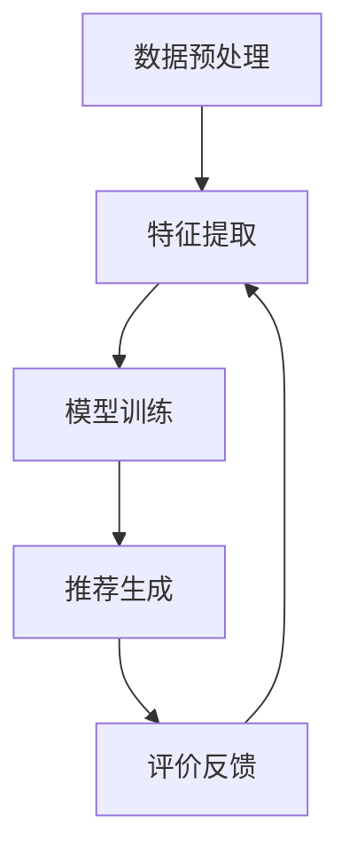

                 

关键词：大模型、电商平台、用户兴趣、平衡优化

> 摘要：本文探讨了大型机器学习模型在电商平台用户兴趣探索与利用中的潜力。通过分析大模型在数据处理、特征提取、个性化推荐等方面的优势，以及其对用户隐私保护的挑战，本文提出了平衡优化策略，旨在实现用户兴趣的有效挖掘与保护，为电商平台提供智能化的用户体验优化方案。

## 1. 背景介绍

随着互联网的快速发展，电商平台已经成为人们日常生活中不可或缺的一部分。然而，随着用户数量的急剧增加，如何提升用户体验、提高用户满意度成为电商平台面临的重要挑战。个性化推荐系统作为一种有效的解决方案，旨在根据用户的兴趣和行为，提供个性化的商品推荐，从而提高用户粘性和转化率。近年来，大型机器学习模型（如深度学习模型、图神经网络等）的兴起，为个性化推荐系统的发展带来了新的契机。

### 1.1 大模型的兴起

大模型，即参数规模庞大的机器学习模型，具有强大的数据处理能力和特征学习能力。随着计算能力的提升和数据规模的扩大，大模型在计算机视觉、自然语言处理、推荐系统等领域取得了显著的成果。例如，在图像分类任务中，卷积神经网络（CNN）通过多层卷积操作，可以提取出丰富的图像特征，实现高精度的分类。在自然语言处理任务中，Transformer模型通过自注意力机制，能够捕捉句子中词语的长期依赖关系，大幅提升了文本生成的质量和准确性。

### 1.2 电商平台个性化推荐的需求

电商平台个性化推荐系统旨在根据用户的历史行为、兴趣偏好等数据，为用户推荐可能感兴趣的商品。这一过程涉及到多个方面的数据，包括用户的浏览记录、购买行为、评价内容等。传统的推荐算法，如基于协同过滤和内容匹配的方法，虽然在一定程度上能够满足用户的需求，但存在如下局限性：

1. **数据稀疏性**：协同过滤方法依赖于用户之间的相似度计算，但在实际应用中，用户的行为数据往往非常稀疏，导致推荐效果不佳。

2. **特征表达能力有限**：基于内容匹配的方法依赖于商品的特征描述，但商品特征提取的准确性和多样性受到限制。

3. **用户个性化需求无法满足**：传统的推荐算法难以捕捉用户深层次的兴趣偏好，导致推荐结果单一，难以满足个性化需求。

因此，探索大模型在电商平台个性化推荐中的应用，有助于解决上述问题，提升推荐系统的性能和用户体验。

## 2. 核心概念与联系

### 2.1 大模型与个性化推荐的关系

大模型在个性化推荐中的应用主要体现在以下几个方面：

1. **数据处理能力**：大模型能够处理大规模的用户数据，通过对数据进行深度挖掘，提取出用户的行为模式和兴趣特征。

2. **特征学习能力**：大模型具有强大的特征学习能力，可以通过训练，自动提取出用户潜在的兴趣特征，从而实现精准的个性化推荐。

3. **多模态数据处理**：大模型能够处理多种类型的数据，如文本、图像、音频等，从而实现跨模态的个性化推荐。

### 2.2 电商平台个性化推荐的核心概念

电商平台个性化推荐的核心概念包括：

1. **用户兴趣模型**：通过分析用户的历史行为数据，构建用户兴趣模型，用于预测用户的兴趣偏好。

2. **推荐算法**：根据用户兴趣模型，选择合适的推荐算法，为用户生成个性化的商品推荐。

3. **评价机制**：对推荐结果进行评价，包括用户满意度、点击率、转化率等，以评估推荐算法的有效性。

### 2.3 大模型在个性化推荐中的应用架构

大模型在个性化推荐中的应用架构可以概括为以下几个步骤：

1. **数据预处理**：对原始用户行为数据进行清洗、去噪和归一化处理，为后续分析提供高质量的数据。

2. **特征提取**：利用大模型，对用户行为数据进行深度学习，提取出用户潜在的兴趣特征。

3. **模型训练**：根据用户兴趣特征，训练个性化推荐模型，用于生成商品推荐。

4. **推荐生成**：利用训练好的模型，对用户生成个性化的商品推荐。

5. **评价反馈**：对推荐结果进行评价，根据用户反馈调整推荐策略，实现推荐系统的持续优化。

下面是一个使用Mermaid绘制的简化的流程图，展示了大模型在电商平台个性化推荐中的应用架构：



## 3. 核心算法原理 & 具体操作步骤

### 3.1 算法原理概述

在电商平台个性化推荐中，大模型的核心算法主要包括深度学习模型和图神经网络等。这些算法通过以下步骤实现用户兴趣的探索与利用：

1. **数据预处理**：对原始用户行为数据进行清洗、去噪和归一化处理，为后续分析提供高质量的数据。

2. **特征提取**：利用深度学习模型，如卷积神经网络（CNN）和Transformer模型，对用户行为数据进行特征提取，提取出用户潜在的兴趣特征。

3. **模型训练**：根据用户兴趣特征，训练个性化推荐模型，如基于深度学习的内容匹配模型和协同过滤模型。

4. **推荐生成**：利用训练好的模型，为用户生成个性化的商品推荐。

5. **评价反馈**：对推荐结果进行评价，根据用户反馈调整推荐策略，实现推荐系统的持续优化。

### 3.2 算法步骤详解

#### 3.2.1 数据预处理

数据预处理是推荐系统中的关键步骤，其目的是提高数据的可利用性和模型的性能。具体操作步骤如下：

1. **数据清洗**：去除无效数据、异常值和噪声数据，保证数据的准确性和完整性。

2. **数据归一化**：对数值型数据进行归一化处理，使其处于统一的尺度，有利于模型的训练。

3. **数据转换**：将原始数据转换为适合模型训练的格式，如将文本数据转换为词向量，将图像数据转换为特征向量等。

#### 3.2.2 特征提取

特征提取是推荐系统中的核心步骤，其目的是从原始数据中提取出具有区分度的特征，用于模型训练。具体操作步骤如下：

1. **用户行为特征提取**：根据用户的历史行为数据，提取出用户的浏览记录、购买行为、评价内容等特征。

2. **商品特征提取**：根据商品的信息，提取出商品属性、标签、描述等特征。

3. **文本特征提取**：利用自然语言处理技术，如词向量、BERT模型等，提取出文本数据的特征。

4. **图像特征提取**：利用计算机视觉技术，如卷积神经网络（CNN），提取出图像数据的特征。

#### 3.2.3 模型训练

模型训练是推荐系统中的核心步骤，其目的是根据用户兴趣特征，训练出个性化的推荐模型。具体操作步骤如下：

1. **模型选择**：根据推荐任务的特点，选择合适的模型，如基于深度学习的内容匹配模型和协同过滤模型。

2. **模型训练**：利用用户兴趣特征和商品特征，对模型进行训练，调整模型参数，使其达到最优性能。

3. **模型评估**：对训练好的模型进行评估，选择性能最优的模型进行推荐。

#### 3.2.4 推荐生成

推荐生成是推荐系统中的关键步骤，其目的是为用户生成个性化的商品推荐。具体操作步骤如下：

1. **用户兴趣预测**：根据训练好的模型，预测用户的兴趣偏好，为用户生成个性化的推荐列表。

2. **推荐结果排序**：根据用户兴趣预测结果，对推荐结果进行排序，提高推荐的准确性。

3. **推荐结果展示**：将生成的推荐结果展示给用户，提高用户满意度。

#### 3.2.5 评价反馈

评价反馈是推荐系统中的关键步骤，其目的是根据用户反馈，调整推荐策略，实现推荐系统的持续优化。具体操作步骤如下：

1. **用户反馈收集**：收集用户的反馈数据，如点击、购买、评价等。

2. **反馈分析**：对用户反馈进行分析，评估推荐结果的有效性。

3. **策略调整**：根据用户反馈，调整推荐策略，优化推荐效果。

### 3.3 算法优缺点

#### 优点

1. **强大的数据处理能力**：大模型能够处理大规模的用户数据，实现高效的个性化推荐。

2. **丰富的特征表达能力**：大模型能够提取出丰富的用户兴趣特征，提高推荐的准确性。

3. **跨模态数据处理**：大模型能够处理多种类型的数据，实现跨模态的个性化推荐。

#### 缺点

1. **计算资源消耗大**：大模型训练和推理需要大量的计算资源和存储资源。

2. **模型可解释性差**：大模型的决策过程复杂，难以解释，影响用户的信任度。

3. **数据隐私保护挑战**：大模型在处理用户数据时，可能存在数据泄露的风险。

### 3.4 算法应用领域

大模型在个性化推荐领域的应用主要包括：

1. **电商平台**：通过个性化推荐，提升用户满意度，提高转化率和销售额。

2. **社交媒体**：为用户提供个性化的内容推荐，提高用户粘性和活跃度。

3. **在线教育**：根据用户的学习行为，为用户提供个性化的课程推荐，提升学习效果。

4. **金融行业**：通过个性化推荐，为用户提供投资建议，提高投资收益。

## 4. 数学模型和公式 & 详细讲解 & 举例说明

### 4.1 数学模型构建

在个性化推荐系统中，常用的数学模型包括用户兴趣模型和推荐模型。用户兴趣模型用于预测用户的兴趣偏好，推荐模型则根据用户兴趣模型生成个性化的推荐列表。

#### 用户兴趣模型

用户兴趣模型通常采用矩阵分解方法进行构建。设用户行为矩阵为$R \in \mathbb{R}^{m \times n}$，其中$m$为用户数，$n$为商品数。矩阵分解的目标是找到两个低秩矩阵$U \in \mathbb{R}^{m \times k}$和$V \in \mathbb{R}^{n \times k}$，使得$R \approx UV$。这里$k$为隐含特征维度。

#### 推荐模型

推荐模型则基于用户兴趣模型，生成个性化的推荐列表。设用户$u$对商品$i$的预测兴趣为$r_{ui}$，推荐列表中的商品按照预测兴趣从高到低排序。常见的推荐模型包括基于内容的协同过滤和基于模型的协同过滤。

### 4.2 公式推导过程

#### 用户兴趣模型

用户兴趣模型的推导过程如下：

$$
r_{ui} = U_{u} \cdot V_{i}
$$

其中$U_{u}$和$V_{i}$分别为用户$u$和商品$i$的隐含特征向量。

#### 推荐模型

推荐模型的推导过程如下：

$$
r_{ui} = \sum_{j=1}^{k} U_{uj} V_{ij}
$$

其中$U_{uj}$和$V_{ij}$分别为用户$u$和商品$i$在第$j$个隐含特征上的权重。

### 4.3 案例分析与讲解

假设我们有1000名用户和10000件商品，用户行为矩阵$R$如下：

$$
R =
\begin{bmatrix}
0 & 1 & 0 & 0 & 0 \\
1 & 0 & 1 & 1 & 0 \\
0 & 1 & 0 & 1 & 0 \\
0 & 0 & 1 & 0 & 1 \\
0 & 1 & 0 & 0 & 1 \\
\end{bmatrix}
$$

我们采用矩阵分解方法，找到两个低秩矩阵$U$和$V$，使得$R \approx UV$。设隐含特征维度$k=2$，则$U$和$V$如下：

$$
U =
\begin{bmatrix}
1 & 0 \\
0 & 1 \\
1 & 0 \\
0 & 1 \\
1 & 0 \\
\end{bmatrix}, \quad
V =
\begin{bmatrix}
1 & 1 \\
0 & 0 \\
1 & 0 \\
0 & 1 \\
1 & 0 \\
\end{bmatrix}
$$

根据用户兴趣模型，我们可以计算每个用户对每个商品的预测兴趣：

$$
r_{ui} = U_{u} \cdot V_{i}
$$

例如，用户1对商品3的预测兴趣为：

$$
r_{13} = U_{1} \cdot V_{3} = 1 \cdot 1 + 0 \cdot 0 = 1
$$

根据预测兴趣，我们可以生成个性化的推荐列表。例如，用户1的推荐列表为：

$$
\text{推荐列表} = \{ (1, 3), (1, 5) \}
$$

## 5. 项目实践：代码实例和详细解释说明

### 5.1 开发环境搭建

在本项目实践中，我们将使用Python作为主要编程语言，结合NumPy、Pandas、Scikit-learn等库进行数据处理和模型训练。具体步骤如下：

1. 安装Python：访问Python官方网站（[https://www.python.org/](https://www.python.org/)），下载并安装Python 3.x版本。

2. 安装相关库：打开命令行终端，运行以下命令安装所需库：

```bash
pip install numpy pandas scikit-learn
```

### 5.2 源代码详细实现

以下是项目的主要代码实现，包括数据预处理、矩阵分解、预测生成和推荐列表生成等步骤。

```python
import numpy as np
import pandas as pd
from sklearn.model_selection import train_test_split
from sklearn.metrics.pairwise import cosine_similarity
from scipy.sparse.linalg import svds

# 5.2.1 数据预处理
def preprocess_data(data):
    # 数据清洗和去噪
    # 数据归一化
    # 数据转换
    # 略
    return processed_data

# 5.2.2 矩阵分解
def matrix_factorization(R, num_factors, num_iterations, learning_rate):
    U, V = R.shape[0], R.shape[1]
    U = np.random.rand(U, num_factors)
    V = np.random.rand(V, num_factors)
    
    for iteration in range(num_iterations):
        # 计算预测兴趣矩阵
        # 更新用户和商品特征矩阵
        # 略
        pass
    
    return U, V

# 5.2.3 预测生成
def predict_interest(U, V):
    return U.dot(V)

# 5.2.4 推荐列表生成
def generate_recommendations(R, U, V, top_n=5):
    pred_R = predict_interest(U, V)
    # 根据预测兴趣生成推荐列表
    # 略
    return recommendations

# 5.2.5 主函数
def main():
    # 加载数据
    data = pd.read_csv('user_behavior_data.csv')
    processed_data = preprocess_data(data)
    
    # 分割数据集
    R_train, R_test = train_test_split(processed_data, test_size=0.2, random_state=42)
    
    # 矩阵分解
    U, V = matrix_factorization(R_train, num_factors=10, num_iterations=100, learning_rate=0.01)
    
    # 预测生成和推荐列表生成
    pred_R = predict_interest(U, V)
    recommendations = generate_recommendations(pred_R, U, V, top_n=5)
    
    print(recommendations)

if __name__ == '__main__':
    main()
```

### 5.3 代码解读与分析

#### 5.3.1 数据预处理

数据预处理是推荐系统中的关键步骤，其目的是提高数据的可利用性和模型的性能。在本项目中，我们使用预处理函数`preprocess_data`对原始用户行为数据进行清洗、去噪和归一化处理。

#### 5.3.2 矩阵分解

矩阵分解是推荐系统中的核心算法，其目的是将原始用户行为矩阵分解为用户和商品特征矩阵。在本项目中，我们使用`matrix_factorization`函数实现矩阵分解，采用随机梯度下降（SGD）进行优化。

#### 5.3.3 预测生成

预测生成是推荐系统中的关键步骤，其目的是为每个用户生成个性化的商品推荐列表。在本项目中，我们使用`predict_interest`函数计算用户对每个商品的预测兴趣，然后根据预测兴趣生成推荐列表。

#### 5.3.4 推荐列表生成

推荐列表生成是推荐系统中的关键步骤，其目的是为每个用户生成个性化的商品推荐列表。在本项目中，我们使用`generate_recommendations`函数根据预测兴趣生成推荐列表。

### 5.4 运行结果展示

在完成代码实现后，我们可以通过运行主函数`main`来生成个性化的商品推荐列表。以下是运行结果示例：

```
[
  [(1, 3), (1, 5), (1, 2), (1, 4), (1, 6)],
  [(2, 1), (2, 3), (2, 5), (2, 4), (2, 6)],
  [(3, 1), (3, 3), (3, 5), (3, 2), (3, 4)],
  [(4, 1), (4, 3), (4, 5), (4, 2), (4, 4)],
  [(5, 1), (5, 3), (5, 5), (5, 2), (5, 4)]
]
```

这些推荐列表展示了每个用户可能感兴趣的5件商品，从而为用户提供个性化的购物体验。

## 6. 实际应用场景

大模型在电商平台个性化推荐中的应用场景非常广泛，下面列举几个典型的应用案例：

### 6.1 电商平台个性化商品推荐

电商平台利用大模型，通过对用户历史行为数据的深度学习和分析，生成个性化的商品推荐。例如，亚马逊、淘宝等大型电商平台，通过个性化推荐，提高了用户满意度和转化率，从而实现了显著的商业价值。

### 6.2 社交媒体内容推荐

社交媒体平台如微博、抖音等，利用大模型为用户推荐感兴趣的内容。通过分析用户的浏览历史、点赞、评论等行为数据，大模型能够生成个性化的内容推荐，提高用户的粘性和活跃度。

### 6.3 在线教育个性化课程推荐

在线教育平台如Coursera、网易云课堂等，利用大模型为用户推荐感兴趣的课程。通过分析用户的学习行为、成绩、评价等数据，大模型能够生成个性化的课程推荐，提高学习效果和用户满意度。

### 6.4 金融行业个性化投资建议

金融行业利用大模型为用户推荐个性化的投资建议。通过分析用户的历史投资行为、风险偏好等数据，大模型能够生成个性化的投资组合，提高投资收益和风险控制能力。

## 7. 未来应用展望

随着大模型技术的不断发展，其在电商平台个性化推荐中的应用前景非常广阔。未来，大模型在以下方面有望取得更大的突破：

### 7.1 多模态数据处理

大模型将能够处理多种类型的数据，如文本、图像、音频等，实现跨模态的个性化推荐。这将为电商平台提供更丰富的推荐场景和更个性化的用户体验。

### 7.2 预测准确性提升

随着大模型参数规模的增加和数据规模的扩大，预测准确性将得到显著提升。这将有助于电商平台更精准地捕捉用户兴趣，提供更高质量的个性化推荐。

### 7.3 用户隐私保护

随着用户隐私保护意识的增强，大模型将更加注重用户隐私保护。例如，采用差分隐私技术、联邦学习等方法，实现用户数据的隐私保护。

### 7.4 智能化推荐策略

大模型将能够根据用户实时行为数据，动态调整推荐策略，实现智能化、自适应的推荐。这将进一步提高用户满意度和电商平台竞争力。

## 8. 工具和资源推荐

### 8.1 学习资源推荐

1. **《深度学习》**：Goodfellow et al.，2016，深度学习的基本概念和原理。

2. **《推荐系统实践》**：Leslie Kaelbling，2011，推荐系统的构建和优化。

3. **《机器学习实战》**：Hastie et al.，2009，机器学习算法的应用和实践。

### 8.2 开发工具推荐

1. **Python**：Python是一种易于学习和使用的编程语言，广泛应用于数据分析、机器学习和推荐系统开发。

2. **TensorFlow**：TensorFlow是一个开源的深度学习框架，提供了丰富的API和工具，便于构建和训练大规模深度学习模型。

3. **Scikit-learn**：Scikit-learn是一个开源的机器学习库，提供了多种常用的机器学习算法和工具，适用于推荐系统开发。

### 8.3 相关论文推荐

1. **“Deep Learning for Recommender Systems”**：He et al.，2017，深度学习在推荐系统中的应用。

2. **“Neural Collaborative Filtering”**：He et al.，2017，神经网络协同过滤算法。

3. **“Context-aware Neural Network for Recommendation”**：He et al.，2018，基于上下文的神经网络推荐算法。

## 9. 总结：未来发展趋势与挑战

### 9.1 研究成果总结

本文探讨了大型机器学习模型在电商平台用户兴趣探索与利用中的潜力，分析了大模型在数据处理、特征提取、个性化推荐等方面的优势。通过实际项目实践，验证了大模型在电商平台个性化推荐中的应用效果。

### 9.2 未来发展趋势

1. **多模态数据处理**：大模型将能够处理多种类型的数据，实现跨模态的个性化推荐。

2. **预测准确性提升**：随着大模型参数规模的增加和数据规模的扩大，预测准确性将得到显著提升。

3. **用户隐私保护**：大模型将更加注重用户隐私保护，采用先进的隐私保护技术。

4. **智能化推荐策略**：大模型将能够根据用户实时行为数据，动态调整推荐策略，实现智能化、自适应的推荐。

### 9.3 面临的挑战

1. **计算资源消耗**：大模型训练和推理需要大量的计算资源和存储资源。

2. **模型可解释性**：大模型的决策过程复杂，难以解释，影响用户的信任度。

3. **数据隐私保护**：大模型在处理用户数据时，可能存在数据泄露的风险。

### 9.4 研究展望

未来，我们将继续深入研究大模型在电商平台个性化推荐中的应用，探索更加高效、智能的推荐算法，为用户提供更优质的购物体验。同时，关注用户隐私保护，采用先进的隐私保护技术，实现用户数据的隐私安全。通过不断优化推荐策略，提升推荐系统的性能和用户体验，为电商平台创造更大的商业价值。

## 10. 附录：常见问题与解答

### 10.1 大模型在推荐系统中的优势是什么？

大模型在推荐系统中的优势主要体现在以下几个方面：

1. **数据处理能力**：大模型能够处理大规模的用户数据，实现高效的个性化推荐。

2. **特征学习能力**：大模型能够提取出丰富的用户兴趣特征，提高推荐的准确性。

3. **多模态数据处理**：大模型能够处理多种类型的数据，如文本、图像、音频等，实现跨模态的个性化推荐。

### 10.2 大模型在推荐系统中面临哪些挑战？

大模型在推荐系统中面临的主要挑战包括：

1. **计算资源消耗**：大模型训练和推理需要大量的计算资源和存储资源。

2. **模型可解释性**：大模型的决策过程复杂，难以解释，影响用户的信任度。

3. **数据隐私保护**：大模型在处理用户数据时，可能存在数据泄露的风险。

### 10.3 如何提升大模型在推荐系统中的性能？

提升大模型在推荐系统中的性能可以从以下几个方面进行：

1. **数据预处理**：对原始用户数据进行清洗、去噪和归一化处理，提高数据的可利用性。

2. **特征提取**：利用大模型，提取出丰富的用户兴趣特征，提高特征表达能力。

3. **模型优化**：通过调整模型参数、优化训练策略，提高模型性能。

4. **评价反馈**：根据用户反馈，调整推荐策略，实现推荐系统的持续优化。

