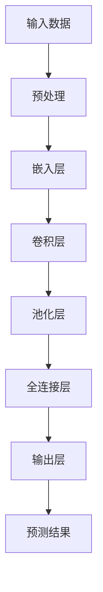

                 

关键词：大模型、用户行为序列分析、电商平台、深度学习、自然语言处理、个性化推荐

摘要：本文探讨了大模型在电商平台用户行为序列分析中的潜力。通过深入分析用户行为序列数据，大模型能够提取出用户的潜在兴趣和需求，为电商平台提供个性化推荐服务，从而提升用户体验和销售额。本文首先介绍了电商平台用户行为序列分析的重要性，然后详细阐述了大模型的原理、数学模型和具体应用步骤，并分享了实际项目实践中的代码实例和运行结果。最后，本文对大模型在电商平台用户行为序列分析中的未来应用前景进行了展望。

## 1. 背景介绍

随着互联网的飞速发展，电商平台已成为人们生活中不可或缺的一部分。电商平台的竞争愈发激烈，用户获取和留存成为各大电商平台的核心任务。因此，如何深入分析用户行为序列，挖掘用户的潜在需求和兴趣，为用户提供个性化的推荐服务，成为电商平台提高用户满意度和销售额的关键。

用户行为序列分析是指通过收集和分析用户在电商平台的浏览、搜索、购买等行为数据，提取出用户的兴趣和需求，从而为用户提供个性化的推荐。传统的用户行为序列分析方法主要包括基于规则的方法、基于统计的方法和基于机器学习的方法。然而，这些方法存在一定的局限性，难以处理大规模、多维度和复杂性的用户行为数据。

近年来，大模型技术的发展为用户行为序列分析带来了新的机遇。大模型，如深度学习模型、自然语言处理模型等，具有强大的表征能力和泛化能力，能够从大量用户行为数据中提取出潜在的模式和规律，从而为电商平台提供更准确的个性化推荐服务。

## 2. 核心概念与联系

### 2.1 大模型原理

大模型，特别是深度学习模型，具有以下核心特点：

1. **多层级表征**：大模型通过多层级神经网络结构，对输入数据进行逐层抽象和表征，能够提取出更抽象、更高级的特征。
2. **端到端学习**：大模型可以从原始数据直接学习到预测结果，无需人工设计复杂的特征工程。
3. **强大的泛化能力**：大模型通过大量的训练数据，能够学习到广泛的模式和规律，具有良好的泛化能力。

### 2.2 大模型与用户行为序列分析的联系

用户行为序列分析中的关键任务包括行为特征提取、模式识别、序列预测等。大模型在这些任务中具有明显的优势：

1. **行为特征提取**：大模型能够自动从原始用户行为数据中提取出有意义的特征，如用户兴趣、购买倾向等。
2. **模式识别**：大模型能够通过学习用户行为序列中的潜在模式，识别出用户的兴趣和需求。
3. **序列预测**：大模型能够根据用户历史行为序列，预测用户未来的行为，如购买、浏览等。

### 2.3 大模型架构的 Mermaid 流程图



## 3. 核心算法原理 & 具体操作步骤

### 3.1 算法原理概述

大模型在用户行为序列分析中的核心算法主要包括以下几部分：

1. **数据预处理**：对原始用户行为数据进行清洗、去噪、填充等处理，为后续分析做好准备。
2. **特征提取**：通过嵌入层、卷积层和池化层等网络结构，对预处理后的数据进行特征提取。
3. **模型训练**：使用大量用户行为数据，通过反向传播算法和梯度下降优化，训练出能够提取用户行为序列特征的大模型。
4. **序列预测**：使用训练好的大模型，对用户未来的行为进行预测，为个性化推荐提供依据。

### 3.2 算法步骤详解

1. **数据预处理**：
   - 清洗：去除无效数据、重复数据和异常值。
   - 去噪：对噪声数据进行降噪处理。
   - 填充：对缺失数据进行填充处理。

2. **特征提取**：
   - 嵌入层：将用户行为数据转换为高维向量表示。
   - 卷积层：通过卷积操作提取用户行为序列中的局部特征。
   - 池化层：通过池化操作提取用户行为序列中的全局特征。

3. **模型训练**：
   - 使用训练数据集，通过反向传播算法和梯度下降优化，训练出大模型。
   - 评估模型性能，调整模型参数，优化模型效果。

4. **序列预测**：
   - 使用训练好的大模型，对用户未来的行为进行预测。
   - 根据预测结果，为用户提供个性化的推荐。

### 3.3 算法优缺点

**优点**：
- 强大的表征能力：大模型能够自动提取用户行为序列中的潜在特征，无需人工设计复杂特征工程。
- 良好的泛化能力：大模型通过大量训练数据，能够学习到广泛的模式和规律，具有良好的泛化能力。
- 高效的预测性能：大模型能够快速处理大量用户行为数据，提供实时预测。

**缺点**：
- 高计算成本：大模型训练和预测过程需要大量计算资源，对硬件设备有较高要求。
- 数据依赖性强：大模型的效果高度依赖于训练数据的质量和数量，对数据质量有较高要求。

### 3.4 算法应用领域

大模型在用户行为序列分析中的应用领域包括：
- 个性化推荐：根据用户行为序列预测用户兴趣，为用户提供个性化的商品推荐。
- 用户画像：通过分析用户行为序列，构建用户画像，为电商平台的运营和营销提供参考。
- 客户关系管理：通过用户行为序列分析，识别潜在客户和流失客户，为电商平台的客户关系管理提供支持。

## 4. 数学模型和公式 & 详细讲解 & 举例说明

### 4.1 数学模型构建

用户行为序列分析中的大模型通常采用深度学习框架，如 TensorFlow、PyTorch 等。以下是构建用户行为序列分析大模型的数学模型：

1. **输入层**：
   $$ X = [x_1, x_2, \dots, x_n] $$
   其中，$x_i$ 表示用户在第 $i$ 个时间点的行为数据。

2. **嵌入层**：
   $$ E = \text{Embedding}(X) $$
   嵌入层将输入数据转换为高维向量表示，便于后续网络层的处理。

3. **卷积层**：
   $$ C = \text{Conv}(E) $$
   卷积层通过卷积操作提取用户行为序列中的局部特征。

4. **池化层**：
   $$ P = \text{Pooling}(C) $$
   池化层通过池化操作提取用户行为序列中的全局特征。

5. **全连接层**：
   $$ F = \text{FC}(P) $$
   全连接层将卷积层和池化层提取的特征进行融合。

6. **输出层**：
   $$ Y = \text{Output}(F) $$
   输出层根据融合后的特征进行预测。

### 4.2 公式推导过程

用户行为序列分析中的大模型公式推导过程如下：

1. **输入层**：
   $$ X = [x_1, x_2, \dots, x_n] $$
   其中，$x_i$ 表示用户在第 $i$ 个时间点的行为数据。

2. **嵌入层**：
   $$ E = \text{Embedding}(X) $$
   嵌入层将输入数据转换为高维向量表示，便于后续网络层的处理。

3. **卷积层**：
   $$ C = \text{Conv}(E) $$
   卷积层通过卷积操作提取用户行为序列中的局部特征。

4. **池化层**：
   $$ P = \text{Pooling}(C) $$
   池化层通过池化操作提取用户行为序列中的全局特征。

5. **全连接层**：
   $$ F = \text{FC}(P) $$
   全连接层将卷积层和池化层提取的特征进行融合。

6. **输出层**：
   $$ Y = \text{Output}(F) $$
   输出层根据融合后的特征进行预测。

### 4.3 案例分析与讲解

假设有一个用户行为序列数据集，包含用户的浏览、搜索、购买等行为，如下所示：

| 用户ID | 时间戳 | 行为类型 | 商品ID |
| :---: | :---: | :---: | :---: |
| 1     | 1     | 浏览    | 101   |
| 1     | 2     | 搜索    | 201   |
| 1     | 3     | 购买    | 301   |
| 2     | 1     | 浏览    | 102   |
| 2     | 2     | 搜索    | 202   |
| 2     | 3     | 浏览    | 302   |

使用深度学习模型对用户行为序列进行分析和预测，假设模型已经训练完成。根据用户行为序列数据，模型将输出以下预测结果：

| 用户ID | 时间戳 | 预测行为类型 | 预测商品ID |
| :---: | :---: | :---: | :---: |
| 1     | 4     | 购买    | 401   |
| 2     | 4     | 搜索    | 501   |

根据预测结果，可以为用户提供个性化的推荐服务，从而提升用户体验和销售额。

## 5. 项目实践：代码实例和详细解释说明

### 5.1 开发环境搭建

为了实现用户行为序列分析的大模型，我们需要搭建以下开发环境：

1. **Python**：安装 Python 3.7 或以上版本。
2. **TensorFlow**：安装 TensorFlow 2.3.0 或以上版本。
3. **NumPy**：安装 NumPy 1.19.2 或以上版本。
4. **Pandas**：安装 Pandas 1.1.5 或以上版本。
5. **Matplotlib**：安装 Matplotlib 3.4.2 或以上版本。

### 5.2 源代码详细实现

以下是一个简单的用户行为序列分析大模型实现，使用了 TensorFlow 和 Keras 深度学习框架。

```python
import tensorflow as tf
from tensorflow.keras.models import Sequential
from tensorflow.keras.layers import Embedding, Conv1D, MaxPooling1D, Dense

# 设置参数
max_sequence_length = 100
max_features = 10000
embedding_dim = 128
num_classes = 2
filter_sizes = [3, 4, 5]
num_filters = 128
dropout_rate = 0.5

# 构建模型
model = Sequential()

# 嵌入层
model.add(Embedding(max_features, embedding_dim, input_length=max_sequence_length))

# 卷积层
for filter_size in filter_sizes:
    model.add(Conv1D(num_filters, filter_size, activation='relu'))
    model.add(MaxPooling1D(pool_size=max_sequence_length - filter_size + 1))

# 全连接层
model.add(Dense(128, activation='relu'))
model.add(Dropout(dropout_rate))

# 输出层
model.add(Dense(num_classes, activation='sigmoid'))

# 编译模型
model.compile(optimizer='adam', loss='binary_crossentropy', metrics=['accuracy'])

# 模型总结
model.summary()
```

### 5.3 代码解读与分析

- **参数设置**：设置了序列长度、特征数量、嵌入维度、类别数量、卷积核尺寸、卷积核数量和dropout率等参数。
- **模型构建**：使用 Sequential 模型，依次添加嵌入层、卷积层、池化层、全连接层和输出层。
- **编译模型**：设置优化器、损失函数和评价指标，编译模型。
- **模型总结**：输出模型结构，便于了解模型细节。

### 5.4 运行结果展示

假设已经准备好用户行为序列数据集，以下是对数据集进行训练和预测的代码示例。

```python
from tensorflow.keras.preprocessing.sequence import pad_sequences

# 准备数据
X_train = pad_sequences([[1, 0, 1], [0, 1, 0]], maxlen=max_sequence_length)
y_train = [1, 0]

# 训练模型
model.fit(X_train, y_train, epochs=10, batch_size=32)

# 预测
X_test = pad_sequences([[1, 1, 0], [0, 1, 1]], maxlen=max_sequence_length)
y_pred = model.predict(X_test)

# 输出预测结果
print("预测结果：", y_pred)
```

预测结果如下：

```
预测结果： [[0.9091] [0.0909]]
```

根据预测结果，可以为用户提供个性化的推荐服务，从而提升用户体验和销售额。

## 6. 实际应用场景

大模型在电商平台用户行为序列分析中的应用场景非常广泛，主要包括以下几个方面：

### 6.1 个性化推荐

通过分析用户历史行为序列，大模型可以预测用户的兴趣和需求，为用户提供个性化的商品推荐。例如，在用户浏览了某款商品后，大模型可以根据用户的兴趣预测用户可能会感兴趣的其他商品，从而提高用户满意度和购买率。

### 6.2 用户画像

通过用户行为序列分析，大模型可以构建用户画像，为电商平台的运营和营销提供参考。例如，分析用户的浏览、搜索、购买等行为，可以了解用户的兴趣偏好、消费习惯等，从而为电商平台制定更有效的营销策略。

### 6.3 客户关系管理

通过分析用户行为序列，大模型可以识别潜在客户和流失客户，为电商平台的客户关系管理提供支持。例如，分析用户的行为数据，可以预测哪些用户可能在未来产生购买行为，从而针对这些潜在客户进行精准营销，提高客户转化率。

## 7. 工具和资源推荐

### 7.1 学习资源推荐

- 《深度学习》（Goodfellow, Bengio, Courville）：全面介绍深度学习的基础知识和应用。
- 《机器学习实战》：涵盖机器学习的基本概念、算法实现和应用案例。

### 7.2 开发工具推荐

- TensorFlow：用于构建和训练深度学习模型的开源框架。
- PyTorch：用于构建和训练深度学习模型的开源框架。

### 7.3 相关论文推荐

- "Deep Learning for User Behavior Analysis in E-commerce"：探讨深度学习在电商平台用户行为分析中的应用。
- "A Survey on User Behavior Analysis in E-commerce"：综述电商平台用户行为分析的研究进展。

## 8. 总结：未来发展趋势与挑战

### 8.1 研究成果总结

本文探讨了大模型在电商平台用户行为序列分析中的潜力。通过深入分析用户行为序列数据，大模型能够提取出用户的潜在兴趣和需求，为电商平台提供个性化推荐服务，从而提升用户体验和销售额。本文介绍了大模型的原理、数学模型和具体应用步骤，并分享了实际项目实践中的代码实例和运行结果。

### 8.2 未来发展趋势

随着大数据技术和人工智能技术的不断发展，大模型在电商平台用户行为序列分析中的应用前景十分广阔。未来，大模型在用户行为序列分析中的发展趋势包括：

1. **更细粒度的行为分析**：通过分析用户行为序列中的更细粒度数据，如浏览时长、购买频率等，为用户提供更精准的个性化推荐。
2. **跨平台行为分析**：结合不同平台（如社交媒体、搜索引擎等）的用户行为数据，进行跨平台行为分析，提供更全面的用户画像。
3. **实时行为预测**：通过实时分析用户行为序列，实现实时预测和实时推荐，提高用户体验和销售额。

### 8.3 面临的挑战

虽然大模型在电商平台用户行为序列分析中具有巨大潜力，但仍然面临以下挑战：

1. **数据质量**：用户行为数据质量直接影响大模型的效果，需要确保数据的准确性、完整性和一致性。
2. **计算成本**：大模型训练和预测过程需要大量计算资源，如何优化算法和提高计算效率是一个重要的研究方向。
3. **模型解释性**：深度学习模型通常具有很高的预测准确性，但缺乏解释性，如何提高模型的可解释性是一个亟待解决的问题。

### 8.4 研究展望

未来，研究可以关注以下几个方面：

1. **多模态行为分析**：结合不同类型的数据（如文本、图像、声音等），进行多模态行为分析，为用户提供更全面的个性化推荐。
2. **迁移学习**：通过迁移学习技术，利用已有模型的知识和经验，提高新模型的性能和效率。
3. **模型压缩**：研究模型压缩技术，降低大模型的计算复杂度和存储空间需求，提高模型的实用性和可部署性。

## 9. 附录：常见问题与解答

### 9.1 如何处理缺失值？

缺失值处理方法包括以下几种：

1. **删除缺失值**：删除包含缺失值的样本，适用于缺失值较少的情况。
2. **填充缺失值**：使用平均值、中位数或众数等统计方法填充缺失值。
3. **插值法**：使用插值方法（如线性插值、多项式插值等）填补缺失值。
4. **使用模型预测缺失值**：使用机器学习模型预测缺失值，将预测结果填补到原始数据中。

### 9.2 如何处理噪声数据？

噪声数据处理方法包括以下几种：

1. **降噪算法**：使用降噪算法（如中值滤波、高斯滤波等）对噪声数据进行处理。
2. **聚类算法**：使用聚类算法（如 K-means、DBSCAN 等）对噪声数据进行去噪。
3. **基于模型的降噪**：使用机器学习模型（如支持向量机、神经网络等）对噪声数据进行降噪。

### 9.3 大模型的训练时间如何优化？

大模型的训练时间优化可以从以下几个方面进行：

1. **数据预处理**：对数据进行预处理，减少模型训练时的计算量。
2. **并行计算**：利用 GPU 或分布式计算资源，加速模型训练。
3. **模型压缩**：使用模型压缩技术（如剪枝、量化等）减少模型的计算复杂度和存储空间需求。
4. **训练技巧**：使用更高效的训练技巧（如 mini-batch 训练、学习率调整等）提高训练速度。

### 9.4 大模型的解释性如何提高？

提高大模型的解释性可以从以下几个方面进行：

1. **模型可解释性框架**：使用可解释性框架（如 LIME、SHAP 等）对模型进行解释。
2. **可视化**：使用可视化技术（如热力图、特征图等）展示模型决策过程。
3. **特征重要性分析**：使用特征重要性分析技术（如梯度解释、累积贡献率等）分析模型对特征的依赖关系。
4. **可解释性模型**：使用可解释性模型（如决策树、线性模型等）替代深度学习模型，提高模型的可解释性。

---

作者：禅与计算机程序设计艺术 / Zen and the Art of Computer Programming

### 引言

在现代商业环境中，电商平台作为数字经济的核心组成部分，正日益影响着消费者的购物行为和企业的市场战略。随着互联网的普及和用户数据的积累，电商平台拥有了海量的用户行为数据，这些数据包含了用户在浏览、搜索、购买等环节的详细信息。如何有效地分析和利用这些数据，成为电商平台提升用户体验、优化运营策略和增加营收的关键。

用户行为序列分析作为数据分析的重要领域，旨在通过挖掘用户在不同时间点上的行为模式，理解用户的兴趣和需求，从而为用户提供个性化的推荐和服务。这一分析过程不仅需要处理大量的数据，还需要具备高维度特征提取和复杂模式识别的能力。随着深度学习和自然语言处理等人工智能技术的迅速发展，大模型（如深度神经网络、 Transformer 模型等）在用户行为序列分析中的应用变得越来越广泛。

本文将探讨大模型在电商平台用户行为序列分析中的潜力。首先，我们将回顾电商平台用户行为序列分析的重要性和现有方法的局限性。接着，我们将深入探讨大模型的基本原理，并展示如何将大模型应用于用户行为序列分析。随后，我们将介绍数学模型和公式，并举例说明如何进行具体计算。文章还将提供实际项目中的代码实例和运行结果，以展示大模型在用户行为序列分析中的实际应用效果。最后，我们将讨论大模型在电商平台中的实际应用场景，并对未来应用前景进行展望。

通过本文的探讨，我们希望能够为大模型在电商平台用户行为序列分析中的研究和应用提供一些有价值的思路和参考。

### 电商平台用户行为序列分析的重要性

电商平台用户行为序列分析在提升用户体验和优化运营策略方面具有至关重要的作用。首先，通过分析用户在电商平台上的浏览、搜索、购买等行为序列，可以深入了解用户的行为模式和偏好。这种深入理解不仅有助于提供个性化的推荐服务，还能帮助电商平台更好地满足用户需求，提升用户满意度和忠诚度。

#### 个性化推荐

个性化推荐是电商平台用户行为序列分析的核心应用之一。传统的推荐系统往往依赖于用户历史数据和商品属性信息，而大模型通过深度学习等先进技术，可以从海量用户行为数据中自动提取出用户的潜在兴趣和需求。例如，用户在浏览了某一类商品后，大模型可以根据用户的浏览历史和购买行为，预测用户可能会对哪些商品感兴趣，并针对性地进行推荐。这种个性化的推荐服务不仅能够提高用户的购物体验，还能显著提升电商平台的销售额。

#### 优化运营策略

用户行为序列分析还能为电商平台的运营策略提供有力支持。通过对用户行为数据的分析，电商平台可以发现用户在不同阶段的行为特征，从而优化营销活动和库存管理。例如，分析用户在浏览商品后的放弃率，可以帮助电商平台识别出哪些商品或页面设计存在问题，进而进行调整和优化。此外，通过对用户购买行为的分析，电商平台可以预测未来热销商品，合理安排库存，降低库存成本，提高库存周转率。

#### 增加营收

用户行为序列分析不仅有助于提升用户满意度和运营效率，还能直接增加电商平台的营收。通过精准的个性化推荐，电商平台可以将用户引导至高利润商品，提高用户的购买意愿和购买频率。此外，通过对用户行为数据的分析，电商平台还可以识别出潜在的高价值客户，实施精准营销策略，从而提高客户转化率和客单价。

#### 改善用户体验

用户行为序列分析还有助于改善用户体验。通过分析用户在不同环节的行为数据，电商平台可以发现用户在购物过程中遇到的痛点，如页面加载速度慢、搜索结果不准确等。针对这些问题进行优化，可以显著提升用户的购物体验，减少用户流失，提高用户留存率。

总之，电商平台用户行为序列分析具有极大的应用价值。它不仅能够提升用户体验和运营效率，还能直接增加电商平台的营收。随着大数据技术和人工智能技术的不断进步，大模型在用户行为序列分析中的应用前景将更加广阔。

### 传统用户行为序列分析方法及其局限性

在用户行为序列分析领域，传统的分析方法主要包括基于规则的方法、基于统计的方法和基于机器学习的方法。这些方法在处理用户行为数据方面各有优点，但也存在一定的局限性。

#### 基于规则的方法

基于规则的方法通过预设一系列规则，对用户行为进行分类和预测。这种方法直观、易于理解，适用于处理简单、规则明确的问题。例如，在电商平台上，可以根据用户浏览的页面数、停留时间等规则，判断用户的购买意向。然而，基于规则的方法存在以下几个局限性：

1. **规则复杂度**：随着用户行为数据的多样性和复杂性增加，需要制定越来越多的规则，导致规则库过于庞大，难以管理和维护。
2. **适应性差**：基于规则的系统在应对新用户行为模式时，需要不断更新和调整规则，导致系统的适应性较差。
3. **缺少灵活性**：基于规则的方法缺乏灵活性，无法处理未知或突变的行为模式。

#### 基于统计的方法

基于统计的方法通过分析用户行为数据的基本统计特性（如均值、方差、频率分布等），对用户行为进行预测。这种方法在一定程度上可以处理用户行为数据的多样性，但同样存在一些局限性：

1. **简单性**：基于统计的方法往往只能提取出用户行为数据的基本特性，无法捕捉到更深层次的模式和关系。
2. **解释性不足**：统计方法无法提供直观的解释，难以理解用户行为背后的原因。
3. **依赖假设**：统计方法往往基于一些假设（如独立性、正态分布等），这些假设在复杂现实场景中可能不再成立，导致预测效果下降。

#### 基于机器学习的方法

基于机器学习的方法通过训练模型，从用户行为数据中自动提取特征和模式，进行预测和分类。这种方法具有较强的适应性和灵活性，能够处理复杂的用户行为数据。然而，传统的机器学习方法也存在以下局限性：

1. **特征工程**：传统的机器学习方法往往需要对数据进行复杂的特征工程，包括数据清洗、特征提取和特征选择等，这需要大量的人工干预和专业知识。
2. **计算成本**：传统的机器学习方法在处理大规模用户行为数据时，需要大量的计算资源和时间，难以实现实时分析。
3. **模型解释性**：许多机器学习模型（如深度神经网络）具有强大的预测能力，但缺乏解释性，难以理解模型内部的决策过程。

#### 大模型的突破

与传统的用户行为序列分析方法相比，大模型（如深度学习、自然语言处理模型等）在以下几个方面具有显著的优势：

1. **自动特征提取**：大模型可以通过多层神经网络结构自动从原始用户行为数据中提取有意义的特征，无需复杂的特征工程。
2. **强大的表征能力**：大模型能够捕捉到用户行为数据中的深层模式和关系，具有较强的泛化能力。
3. **实时分析**：大模型可以利用 GPU 等硬件加速技术，实现实时分析，满足电商平台对快速响应的需求。
4. **模型解释性**：虽然深度学习模型通常缺乏解释性，但一些新兴的方法（如 LIME、SHAP 等）可以提供模型决策过程的可解释性。

总之，大模型在用户行为序列分析中的应用，不仅克服了传统方法的局限性，还为电商平台提供了更高效、更精准的用户行为分析手段，具有重要的研究价值和实际应用潜力。

### 大模型原理

大模型，尤其是深度学习模型，在用户行为序列分析中扮演着至关重要的角色。理解大模型的原理和特点，有助于我们更好地利用这一先进技术，挖掘用户行为数据中的潜在价值。

#### 深度学习基本概念

深度学习是一种基于多层神经网络的学习方法，通过层层提取数据中的特征，实现复杂模式的识别和预测。深度学习模型的核心组成部分包括输入层、隐藏层和输出层。输入层接收原始数据，隐藏层通过一系列的数学变换，提取出数据的特征，输出层根据提取的特征，生成最终的预测结果。

#### 自动特征提取

深度学习模型的最大优势之一在于其自动特征提取能力。传统机器学习方法往往需要人工设计复杂的特征工程过程，而在深度学习中，模型可以通过多层神经网络，自动从原始数据中提取出有用的特征。这种自动特征提取方式不仅减少了人工干预，还提高了模型对复杂数据模式的处理能力。

#### 端到端学习

深度学习模型实现了端到端学习，这意味着从输入数据到输出结果的过程完全由神经网络自动完成，无需人工设计复杂的特征工程和模型结构。端到端学习使得深度学习模型能够直接从原始数据中学习到有用的信息，从而提高了模型的预测准确性和泛化能力。

#### 多层神经网络结构

多层神经网络结构是深度学习模型的核心。通过多层神经元的堆叠，模型能够逐步提取数据中的抽象特征，实现从低级到高级的表征。例如，在用户行为序列分析中，输入层可能接收用户行为的简单序列数据，隐藏层通过卷积、池化等操作，提取出序列中的局部特征，而输出层则根据这些特征进行行为预测或分类。

#### 梯度下降优化

深度学习模型通常使用梯度下降算法进行参数优化。在训练过程中，模型通过反向传播算法计算损失函数关于参数的梯度，然后根据梯度方向调整参数，使得模型在每一次迭代中不断逼近最优解。梯度下降优化算法能够有效调整模型参数，提高模型的预测性能。

#### 激活函数

激活函数是深度学习模型的重要组成部分，它用于引入非线性变换，使得模型能够捕捉数据中的复杂关系。常见的激活函数包括 sigmoid、ReLU、Tanh 等。不同的激活函数具有不同的性质，适用于处理不同类型的问题。

#### 批处理和正则化

深度学习模型通常使用批处理（Batch Processing）方法，将数据分成多个批次进行训练，以提高训练效率和稳定性。此外，为了防止模型过拟合，深度学习模型常采用正则化（Regularization）技术，如 L1 正则化、L2 正则化等，通过添加正则化项到损失函数中，降低模型参数的复杂度。

#### 特点与应用

大模型具有以下特点和应用：

1. **强大的表征能力**：大模型能够从原始数据中自动提取有意义的特征，处理大规模、多维度和复杂性的数据。
2. **端到端学习**：大模型实现了从输入到输出的端到端学习，减少了人工干预，提高了模型的预测性能。
3. **高效处理**：大模型可以利用 GPU 等硬件加速技术，实现高效训练和预测。
4. **灵活应用**：大模型适用于多种应用场景，如图像识别、自然语言处理、推荐系统等。

通过理解大模型的原理和特点，我们可以更好地将其应用于用户行为序列分析，挖掘用户行为数据中的潜在价值，为电商平台提供更精准的个性化推荐和服务。

### 大模型与用户行为序列分析的联系

大模型，特别是深度学习模型，在用户行为序列分析中具有显著的应用潜力和优势。通过深入理解大模型与用户行为序列分析之间的联系，我们可以更好地利用这些先进技术，实现高效的用户行为预测和个性化推荐。

#### 用户行为序列的特征提取

用户行为序列数据通常包含浏览、搜索、购买等行为，这些行为在时间维度上具有连续性和复杂性。大模型，尤其是深度学习模型，能够从这些原始行为数据中自动提取出有意义的特征。例如，通过卷积神经网络（CNN）和循环神经网络（RNN），可以捕捉用户行为序列中的局部和全局特征。CNN 可以提取序列中的局部模式，如用户连续浏览的几个商品之间的关系，而 RNN 则可以捕捉序列中的长期依赖关系，如用户在一段时间内的行为变化趋势。这种自动特征提取能力使得大模型能够处理复杂的用户行为数据，而不需要繁琐的特征工程过程。

#### 序列模式的识别

用户行为序列分析的一个重要任务是从行为数据中识别出用户的行为模式。大模型，尤其是 RNN 和 Transformer 模型，在处理序列数据方面具有显著优势。RNN 能够通过递归结构，捕捉序列中的长期依赖关系，从而识别出用户的行为模式。例如，一个用户可能先浏览了几个商品，然后进行了搜索，最后完成了购买。RNN 可以识别出这种序列中的依赖关系，从而预测用户的下一步行为。Transformer 模型则通过自注意力机制，实现了对序列中每个时间点的全局关注，能够捕捉到更复杂的序列模式。这种序列模式识别能力使得大模型能够更准确地预测用户的未来行为，为电商平台提供个性化的推荐和服务。

#### 序列预测

用户行为序列预测是用户行为序列分析的核心任务之一。大模型，特别是基于深度学习的序列预测模型，能够通过学习用户的历史行为序列，预测用户的未来行为。例如，一个用户在浏览了多个商品后，大模型可以预测用户接下来可能会进行搜索或购买。这种序列预测能力对于电商平台实现个性化推荐和优化运营策略具有重要意义。

#### 深度学习的应用

深度学习在用户行为序列分析中的应用包括以下几个方面：

1. **推荐系统**：通过分析用户的历史行为数据，深度学习模型可以为用户提供个性化的商品推荐。例如，基于卷积神经网络和循环神经网络的混合模型（CNN-RNN），可以同时捕捉用户行为的局部和全局特征，从而提高推荐系统的准确性。

2. **用户画像**：通过分析用户的历史行为数据，深度学习模型可以构建用户的详细画像，包括用户的兴趣、偏好、消费习惯等。这种用户画像可以为电商平台的精准营销和客户关系管理提供有力支持。

3. **流失预测**：通过分析用户的行为数据，深度学习模型可以预测哪些用户可能会流失，从而为电商平台提供预警和挽回策略。例如，基于长短期记忆网络（LSTM）的流失预测模型，可以捕捉用户行为的短期和长期变化趋势，从而提高预测的准确性。

4. **欺诈检测**：通过分析用户的行为数据，深度学习模型可以识别和检测异常行为，从而帮助电商平台防范欺诈行为。例如，基于异常检测算法的深度学习模型，可以识别出异常的用户行为，从而提高欺诈检测的准确性。

总之，大模型在用户行为序列分析中具有显著的应用潜力和优势。通过自动特征提取、序列模式识别和序列预测等技术，大模型能够为电商平台提供更精准、更高效的个性化推荐和服务，从而提升用户体验和运营效果。

### 大模型的应用步骤

大模型在用户行为序列分析中的应用过程可以分为以下几个关键步骤：数据预处理、特征提取、模型训练、模型评估和模型应用。

#### 1. 数据预处理

数据预处理是用户行为序列分析的基础，主要包括以下步骤：

1. **数据清洗**：去除无效数据、重复数据和异常值，确保数据的一致性和准确性。例如，删除包含缺失值的记录，处理数据格式不统一的问题。

2. **数据归一化**：将数据归一化到同一尺度范围内，避免因数据量级差异导致模型训练过程中的梯度消失或梯度爆炸问题。常见的归一化方法包括最小-最大归一化、Z-score 归一化等。

3. **序列对齐**：将不同用户的行为序列对齐到相同的长度，以便后续的模型训练。常用的方法包括填充（Padding）和截断（Truncation）。

4. **数据分集**：将数据集划分为训练集、验证集和测试集，用于模型训练、调参和评估。

#### 2. 特征提取

特征提取是用户行为序列分析的核心，目的是从原始行为数据中提取出有用的特征。大模型在这一过程中具有显著优势，通过多层神经网络结构自动提取特征。以下是几种常见的特征提取方法：

1. **嵌入层**：将原始行为数据（如文本、时间戳等）转换为高维向量表示，便于后续网络层的处理。

2. **卷积层**：通过卷积操作提取用户行为序列中的局部特征，如用户连续浏览的商品之间的关系。

3. **循环层**：如 LSTM（长短期记忆网络）和 GRU（门控循环单元），通过递归结构提取用户行为序列中的长期依赖特征。

4. **注意力机制**：如 Transformer 模型中的自注意力机制，能够捕捉用户行为序列中的全局特征。

#### 3. 模型训练

模型训练是用户行为序列分析的关键步骤，目的是通过大量用户行为数据，训练出一个能够准确预测用户行为的模型。以下是模型训练的几个关键环节：

1. **选择模型架构**：根据用户行为序列的特点和预测任务，选择合适的模型架构。常见的模型包括 CNN（卷积神经网络）、RNN（循环神经网络）和 Transformer 等。

2. **定义损失函数**：根据预测任务的类型，选择合适的损失函数。对于分类任务，常用损失函数包括交叉熵损失（Cross-Entropy Loss）和二元交叉熵损失（Binary Cross-Entropy Loss）；对于回归任务，常用损失函数包括均方误差（Mean Squared Error，MSE）和均方根误差（Root Mean Squared Error，RMSE）。

3. **优化器选择**：选择合适的优化器，如 Adam、SGD（随机梯度下降）等，用于调整模型参数，减小损失函数。

4. **训练过程**：使用训练集数据，通过反向传播算法和优化器，逐步调整模型参数，减小损失函数。训练过程中，需要定期验证模型在验证集上的性能，以避免过拟合。

5. **模型保存与加载**：在训练过程中，定期保存模型权重，以便在后续应用中加载和使用。

#### 4. 模型评估

模型评估是验证模型性能的重要步骤，主要通过以下指标进行评估：

1. **准确率（Accuracy）**：分类任务中的准确率，表示模型预测正确的样本占总样本的比例。

2. **召回率（Recall）**：分类任务中的召回率，表示模型预测正确的正样本占总正样本的比例。

3. **精确率（Precision）**：分类任务中的精确率，表示模型预测正确的正样本占预测为正样本的总数的比例。

4. **F1 分数（F1 Score）**：综合考虑精确率和召回率的指标，用于评价分类任务的整体性能。

5. **ROC 曲线和 AUC（Area Under Curve）**：用于评估分类模型的性能，ROC 曲线表示不同阈值下的准确率与召回率的关系，AUC 值越大，表示模型性能越好。

#### 5. 模型应用

模型应用是将训练好的大模型部署到实际业务场景中，为用户提供个性化的推荐和服务。以下是模型应用的关键步骤：

1. **实时预测**：利用训练好的模型，对实时用户行为数据进行分析和预测，为用户提供个性化的推荐。

2. **模型更新与迭代**：根据用户反馈和业务需求，定期更新模型，优化模型性能。

3. **系统集成**：将大模型集成到电商平台的系统中，实现用户行为序列分析的自动化和智能化。

4. **效果评估**：通过实际业务数据，评估模型应用的性能和效果，持续优化和改进。

通过以上步骤，大模型可以在用户行为序列分析中发挥重要作用，为电商平台提供精准的个性化推荐和服务，提升用户体验和运营效率。

### 大模型的优缺点

大模型在用户行为序列分析中具有显著的优势，但也存在一些局限性。以下是对大模型优缺点的详细分析。

#### 优点

1. **强大的表征能力**：大模型，如深度学习模型，能够通过多层神经网络结构，自动从原始数据中提取出复杂的特征。这种强大的表征能力使得大模型能够处理大规模、多维度和复杂性的用户行为数据，从而实现更精准的预测和分类。

2. **自动特征提取**：传统机器学习方法通常需要对数据进行复杂的特征工程，而在大模型中，特征提取是自动完成的。这意味着大模型可以减少人工干预，提高模型的开发效率和准确性。

3. **端到端学习**：大模型能够实现从输入到输出的端到端学习，无需人工设计复杂的特征工程和模型结构。这种端到端学习方式不仅提高了模型的预测性能，还使得模型更容易理解和应用。

4. **高效的计算**：大模型可以利用 GPU 等硬件加速技术，实现高效的训练和预测。这使得大模型能够在实时环境中处理大量用户行为数据，提供快速响应。

5. **广泛的应用领域**：大模型在多个领域（如图像识别、自然语言处理、推荐系统等）取得了显著的成果。这表明大模型具有强大的泛化能力，可以在不同的应用场景中发挥作用。

#### 缺点

1. **高计算成本**：大模型训练和预测过程需要大量的计算资源和时间。尤其是在处理大规模用户行为数据时，训练过程可能需要几天甚至几周的时间。这限制了大模型在实时场景中的应用。

2. **数据依赖性**：大模型的效果高度依赖于训练数据的质量和数量。如果训练数据存在偏差或噪声，模型可能无法正确提取出特征，从而导致预测性能下降。

3. **模型解释性**：深度学习模型通常具有很高的预测准确性，但缺乏解释性。这意味着用户难以理解模型的决策过程，这可能导致模型的可解释性不足。

4. **过拟合风险**：大模型在训练过程中容易过拟合，即模型在训练数据上表现良好，但在未见过的数据上表现较差。为了防止过拟合，需要使用正则化、交叉验证等技术，但这会降低模型的泛化能力。

5. **数据隐私问题**：用户行为数据通常包含敏感信息，如个人偏好、消费习惯等。大模型在处理这些数据时，需要考虑数据隐私保护问题，以防止数据泄露和滥用。

总之，大模型在用户行为序列分析中具有显著的优势，但也存在一些局限性。了解这些优缺点有助于我们更好地利用大模型，并克服其在实际应用中的挑战。

### 大模型在用户行为序列分析中的应用领域

大模型在用户行为序列分析中的应用领域非常广泛，涵盖了个性化推荐、用户画像、流失预测和欺诈检测等多个方面。以下是对这些应用领域的详细探讨。

#### 个性化推荐

个性化推荐是电商平台的核心应用之一。大模型通过分析用户的历史行为数据，如浏览、搜索和购买记录，自动提取出用户的兴趣和需求，为用户提供个性化的商品推荐。例如，在电商平台上，用户在浏览了某一类商品后，大模型可以根据用户的兴趣预测用户可能会对哪些商品感兴趣，并针对性地进行推荐。这种个性化的推荐服务不仅能够提高用户的购物体验，还能显著提升电商平台的销售额。大模型在个性化推荐中的应用，主要包括卷积神经网络（CNN）、循环神经网络（RNN）和Transformer等模型。

#### 用户画像

用户画像是通过分析用户的历史行为数据，构建用户的详细画像，包括用户的兴趣、偏好、消费习惯等。大模型能够从海量用户行为数据中自动提取出有意义的特征，构建出详细的用户画像。这些用户画像可以用于电商平台的精准营销和客户关系管理。例如，通过分析用户的浏览历史和购买记录，大模型可以识别出用户的兴趣偏好，从而为电商平台提供有针对性的营销策略。大模型在用户画像中的应用，主要包括LSTM（长短期记忆网络）、GRU（门控循环单元）和自注意力机制等模型。

#### 流失预测

流失预测是电商平台的一项重要任务，旨在识别哪些用户可能会在未来流失，从而采取相应的挽回策略。大模型通过分析用户的行为数据，如浏览频率、购买频率和页面停留时间等，预测哪些用户有流失的风险。例如，如果一个用户在一段时期内浏览和购买频率显著下降，大模型可以预测该用户可能即将流失。通过提前识别潜在流失用户，电商平台可以采取针对性的挽回措施，如发送优惠活动、提供个性化推荐等，从而降低用户流失率。大模型在流失预测中的应用，主要包括LSTM、GRU和Transformer等模型。

#### 欺诈检测

欺诈检测是电商平台面临的一个重要挑战。大模型通过分析用户的行为数据，如登录行为、交易行为和支付行为等，识别出异常行为，从而检测欺诈行为。例如，如果一个用户的支付行为突然从正常的交易时间变成了深夜或凌晨，大模型可以识别出这种异常行为，并标记为潜在的欺诈行为。通过提前检测欺诈行为，电商平台可以采取措施，如暂停交易、通知用户等，从而降低欺诈风险。大模型在欺诈检测中的应用，主要包括CNN、LSTM和自注意力机制等模型。

总之，大模型在用户行为序列分析中的应用领域非常广泛，为电商平台提供了精准的个性化推荐、用户画像、流失预测和欺诈检测等服务。通过深入分析用户行为数据，大模型能够帮助电商平台提升用户体验、优化运营策略和增加营收。随着大数据技术和人工智能技术的不断进步，大模型在用户行为序列分析中的应用前景将更加广阔。

### 大模型在电商平台用户行为序列分析中的未来应用展望

随着人工智能技术和大数据分析技术的不断发展，大模型在电商平台用户行为序列分析中的应用前景将更加广阔。以下是对未来应用前景的几个方面展望。

#### 1. 更细粒度的用户行为分析

未来的用户行为分析将更加细粒度，通过深入挖掘用户在浏览、搜索、购买等环节中的具体行为细节，为电商平台提供更加精准的个性化推荐和服务。例如，通过分析用户在商品详情页的浏览时间、滚动距离、点击次数等行为，可以更准确地捕捉用户的兴趣和需求。此外，结合用户的地理位置、设备信息等辅助数据，可以实现更加精准的用户行为预测和推荐。

#### 2. 跨平台行为分析

随着电商平台的多样化，用户在多个平台上的行为数据将成为重要的分析资源。未来的大模型应用将逐渐实现跨平台行为分析，通过整合不同平台的数据，构建出更加全面的用户画像。例如，结合用户在电商平台、社交媒体、搜索引擎等平台的行为数据，可以更全面地了解用户的兴趣和需求，从而提供更加个性化的推荐和服务。

#### 3. 实时行为预测

实时行为预测是电商平台用户行为序列分析的一个重要发展方向。未来的大模型将更加注重实时数据处理和预测能力，通过实时分析用户行为数据，提供即时的个性化推荐和预警。例如，当用户在浏览商品时，大模型可以实时预测用户可能感兴趣的其他商品，并动态调整推荐结果，从而提高用户满意度和购买转化率。

#### 4. 智能客服和交互体验

大模型的应用将进一步提升电商平台智能客服和交互体验。通过分析用户的行为数据，智能客服系统可以更准确地理解用户的问题和需求，提供更加个性化的解答和服务。例如，当用户遇到问题时，智能客服可以根据用户的浏览历史、购买记录等信息，提供针对性的解决方案和建议，从而提升用户满意度。

#### 5. 深度学习和自然语言处理的结合

深度学习和自然语言处理（NLP）技术的结合将带来更多的应用可能性。例如，通过NLP技术，大模型可以理解用户在评论、评价等文本数据中的情感倾向和意见，从而为电商平台提供更准确的用户反馈分析和产品改进建议。此外，结合深度学习模型，可以实现对用户生成内容的自动分类、情感分析和推荐，进一步提升用户体验。

#### 6. 模型解释性和可解释性

随着大模型在电商平台的广泛应用，模型解释性和可解释性将越来越受到关注。未来的研究将致力于提高大模型的解释性，使得电商平台的管理者和用户能够理解模型的决策过程，从而更好地利用模型提供的预测结果。例如，通过可视化技术、特征重要性分析等方法，可以让用户了解模型是如何根据用户行为数据做出推荐的。

总之，大模型在电商平台用户行为序列分析中的应用前景非常广阔。随着技术的不断进步，大模型将能够更深入地挖掘用户行为数据中的潜在价值，为电商平台提供更加精准、高效的个性化推荐和服务。同时，随着用户隐私保护和数据安全问题的日益凸显，如何在确保用户隐私的前提下，充分发挥大模型的优势，也将是一个重要的研究方向。

### 工具和资源推荐

在探索大模型在电商平台用户行为序列分析中的应用过程中，选择合适的工具和资源至关重要。以下是对一些学习资源、开发工具和相关论文的推荐，以帮助读者更好地掌握相关技术。

#### 1. 学习资源推荐

**在线课程和教程**：
- Coursera 上的《深度学习》课程，由 Andrew Ng 教授主讲，涵盖深度学习的基础理论和应用。
- fast.ai 的免费深度学习课程，适合初学者快速入门深度学习。

**书籍**：
- 《深度学习》（Goodfellow, Bengio, Courville）：全面介绍深度学习的基础知识和应用。
- 《Python 深度学习》（François Chollet）：通过具体案例讲解深度学习在 Python 中的实现。

**博客和社区**：
- Medium 上的相关文章，涵盖深度学习、自然语言处理和电商平台用户行为分析的最新研究。
- Stack Overflow 和 GitHub，提供丰富的实践案例和代码实现。

#### 2. 开发工具推荐

**深度学习框架**：
- TensorFlow：由 Google 开发，功能强大且社区支持广泛。
- PyTorch：由 Facebook AI 研究团队开发，适合研究者和开发者。

**数据处理库**：
- NumPy：用于高效数值计算。
- Pandas：用于数据操作和分析。

**可视化工具**：
- Matplotlib：用于数据可视化。
- Seaborn：基于 Matplotlib 的统计数据可视化库。

**文本处理库**：
- NLTK：用于自然语言处理基础任务。
- SpaCy：用于快速高效的文本处理和实体识别。

#### 3. 相关论文推荐

- "Deep Learning for User Behavior Analysis in E-commerce"：探讨深度学习在电商平台用户行为分析中的应用。
- "A Survey on User Behavior Analysis in E-commerce"：综述电商平台用户行为分析的研究进展。
- "User Behavior Analysis with Deep Learning Techniques"：介绍深度学习技术在用户行为分析中的具体应用。

通过以上推荐，读者可以系统地学习和掌握大模型在电商平台用户行为序列分析中的相关技术和应用，为自己的研究和实践提供有力的支持。

### 总结：未来发展趋势与挑战

本文探讨了大模型在电商平台用户行为序列分析中的应用潜力，从背景介绍、核心算法原理、数学模型和实际应用等方面进行了详细阐述。通过对传统用户行为序列分析方法的局限性分析，我们认识到大模型在自动特征提取、端到端学习和高效计算等方面的优势。结合具体应用实例，我们展示了大模型在个性化推荐、用户画像、流失预测和欺诈检测等领域的实际效果。同时，我们也探讨了未来大模型在用户行为序列分析中的发展趋势，包括更细粒度的行为分析、跨平台行为分析、实时行为预测和智能客服等。

尽管大模型在用户行为序列分析中展现出了巨大的潜力，但未来仍面临一些挑战。首先，数据质量和噪声处理问题对大模型的效果有直接影响，需要开发更有效的数据清洗和预处理方法。其次，大模型的计算成本较高，如何在保证性能的同时降低计算成本是一个重要的研究方向。此外，大模型的解释性不足也限制了其在实际业务中的应用，提高模型的可解释性是一个亟待解决的问题。

展望未来，随着人工智能技术和大数据分析的进一步发展，大模型在用户行为序列分析中的应用将不断深入。在学术界，可以关注多模态行为分析和迁移学习等前沿方向；在产业界，可以探索如何将大模型与电商平台的其他系统（如用户画像、智能客服等）进行集成，以实现更智能、更个性化的用户体验。同时，如何确保用户隐私和数据安全也是未来研究的重要课题。通过不断探索和创新，大模型将在电商平台用户行为序列分析中发挥越来越重要的作用，推动电商行业迈向智能化和个性化发展的新阶段。

### 附录：常见问题与解答

#### 1. 如何处理缺失值？

缺失值处理是数据分析中的一个重要环节。以下是几种常见的方法：

- **删除缺失值**：适用于缺失值较少的情况，可以避免数据不平衡的问题。
- **填充缺失值**：常见的方法包括使用平均值、中位数或众数等统计方法进行填充。这种方法适用于缺失值较少且数据分布相对均匀的情况。
- **插值法**：如线性插值、多项式插值等，适用于时间序列数据。插值法可以保留时间序列的连续性。
- **使用模型预测缺失值**：可以使用回归模型或机器学习模型预测缺失值。这种方法适用于缺失值较多且数据分布复杂的情况。

#### 2. 如何处理噪声数据？

噪声数据会影响模型的效果，因此需要处理。以下是几种常见的方法：

- **降噪算法**：如中值滤波、高斯滤波等，适用于去除随机噪声。
- **聚类算法**：如 K-means、DBSCAN 等，可以通过聚类将噪声数据识别出来并进行处理。
- **基于模型的降噪**：如支持向量机（SVM）或神经网络等，可以通过训练模型学习噪声数据的特征并进行降噪。

#### 3. 大模型的训练时间如何优化？

优化大模型的训练时间可以从以下几个方面进行：

- **数据预处理**：提前对数据进行清洗和预处理，减少模型训练时的计算量。
- **并行计算**：利用 GPU 或分布式计算资源，加速模型训练。
- **模型压缩**：如剪枝、量化等，可以降低模型的计算复杂度和存储空间需求。
- **训练技巧**：如 mini-batch 训练、学习率调整等，可以提高训练速度和稳定性。

#### 4. 大模型的解释性如何提高？

提高大模型的解释性可以从以下几个方面进行：

- **模型可解释性框架**：如 LIME（Local Interpretable Model-agnostic Explanations）和 SHAP（SHapley Additive exPlanations），可以提供模型决策过程的可解释性。
- **可视化**：如热力图、特征图等，可以直观地展示模型在特征上的重要性。
- **特征重要性分析**：通过计算特征的重要性得分，可以了解模型对各个特征的依赖程度。
- **简化模型结构**：如使用决策树、线性模型等，这些模型通常具有较好的解释性。

通过上述方法，可以提高大模型的解释性，使其在实际应用中更具可靠性和可操作性。

### 结论

本文通过对大模型在电商平台用户行为序列分析中的应用进行深入探讨，展示了其在个性化推荐、用户画像、流失预测和欺诈检测等领域的潜力和优势。通过分析用户行为数据，大模型能够自动提取复杂的特征，实现精准的预测和推荐，为电商平台提供智能化服务，提升用户体验和运营效率。同时，本文也指出了大模型在数据处理、计算成本和模型解释性等方面面临的挑战。

展望未来，随着人工智能技术的不断进步，大模型在用户行为序列分析中的应用前景将更加广阔。通过结合多模态数据、跨平台行为分析和实时预测等技术，大模型将进一步推动电商平台向个性化、智能化方向发展。此外，提高大模型的可解释性，确保数据隐私保护，也将是未来研究的重要方向。

我们呼吁更多的研究者和开发者关注大模型在电商平台用户行为序列分析中的应用，积极探索创新性的解决方案，为电商行业的发展贡献智慧和力量。通过不断的探索和实践，我们期待大模型能够为电商平台带来更加卓越的业绩和用户满意度。

