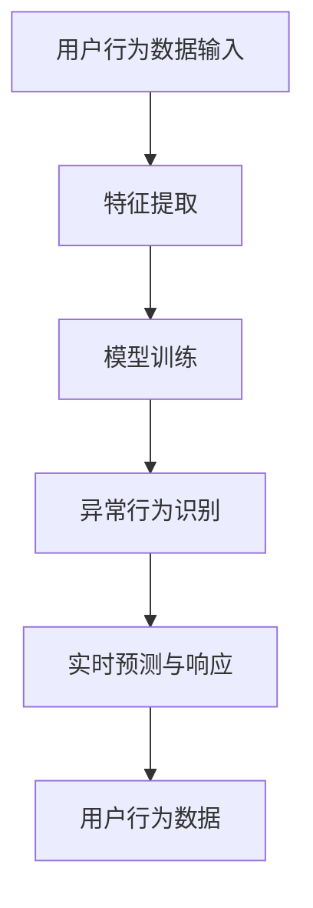

                 

关键词：大模型，电商平台，用户行为异常检测，人工智能，机器学习，深度学习，神经网络，数据处理，算法优化，模型训练，性能评估

> 摘要：本文旨在探讨大模型在电商平台用户行为异常检测中的应用潜力。通过分析当前电商平台的用户行为数据和现有异常检测方法，本文引入了基于大模型的异常检测算法，详细阐述了其核心概念、算法原理、数学模型以及具体应用步骤。同时，本文还通过实际项目实践，展示了大模型在电商平台用户行为异常检测中的优异表现。最后，本文对大模型在电商平台的未来应用前景进行了展望。

## 1. 背景介绍

### 电商平台用户行为异常检测的重要性

在当今数字化时代，电商平台已经成为人们购物消费的主要渠道。随着用户数量的急剧增长，电商平台面临着越来越复杂的数据处理和安全管理任务。用户行为的异常检测成为保障电商平台安全稳定运行的重要环节。异常行为包括恶意刷单、欺诈交易、虚假评价等，这些行为不仅损害了平台的声誉，还可能带来经济损失和用户信任危机。

### 当前用户行为异常检测方法

目前，电商平台常用的用户行为异常检测方法主要包括基于统计学的规则检测、基于机器学习的异常检测以及基于深度学习的异常检测。这些方法各有优缺点，但普遍存在以下问题：

1. **规则检测**：依赖于预定义的规则，灵活性和适应性较差，难以应对复杂多变的异常行为。
2. **机器学习检测**：虽然能够自动学习用户行为模式，但受限于特征工程和模型复杂性，对异常行为的识别能力有限。
3. **深度学习检测**：虽然具备强大的特征提取能力，但训练过程需要大量数据和时间，且对数据质量和标注要求较高。

### 大模型的优势

大模型，即大型神经网络模型，通过引入更多的参数和层，能够自动学习和提取复杂数据的特征，从而提高异常检测的准确性和鲁棒性。大模型在图像识别、自然语言处理等领域已经取得了显著成果，其在用户行为异常检测中的应用也具有广阔的前景。

## 2. 核心概念与联系

### 大模型概述

大模型是一种基于深度学习的神经网络模型，具有大量的参数和层。通过训练，大模型能够自动学习和提取输入数据的特征，从而实现对复杂问题的建模和预测。

### 用户行为异常检测框架

在电商平台用户行为异常检测中，大模型的作用主要包括以下几个方面：

1. **特征提取**：大模型能够从原始用户行为数据中自动提取出有效的特征，提高检测的准确性和效率。
2. **模式识别**：通过对比正常用户行为和异常用户行为的特征模式，大模型能够准确识别出异常行为。
3. **实时预测**：大模型具备较强的实时预测能力，能够及时检测并响应异常行为。

### Mermaid 流程图



## 3. 核心算法原理 & 具体操作步骤

### 3.1 算法原理概述

大模型在用户行为异常检测中的核心原理是利用深度学习技术，通过多层神经网络结构，对用户行为数据进行特征提取和模式识别，从而实现异常行为的检测。具体来说，大模型包括以下几个关键组成部分：

1. **输入层**：接收原始用户行为数据。
2. **隐藏层**：通过多层神经网络对数据进行特征提取。
3. **输出层**：根据特征模式进行异常行为识别。

### 3.2 算法步骤详解

1. **数据预处理**：对用户行为数据进行分析和处理，包括数据清洗、数据标准化等步骤。
2. **特征提取**：利用大模型的输入层和隐藏层，对预处理后的数据进行特征提取。
3. **模型训练**：使用标注好的用户行为数据进行模型训练，通过反向传播算法优化模型参数。
4. **异常行为识别**：利用训练好的模型，对新的用户行为数据进行异常行为识别。
5. **实时预测与响应**：根据异常行为识别结果，实时预测和响应异常行为。

### 3.3 算法优缺点

**优点**：

1. **强大的特征提取能力**：大模型能够自动提取出原始数据中的有效特征，提高异常检测的准确性和效率。
2. **自适应性和鲁棒性**：大模型能够自适应地应对复杂多变的异常行为，具有较强的鲁棒性。

**缺点**：

1. **训练时间较长**：大模型的训练过程需要大量时间和计算资源。
2. **对数据质量要求较高**：大模型对数据的标注质量和数据质量要求较高，否则可能导致模型性能下降。

### 3.4 算法应用领域

大模型在用户行为异常检测中的应用领域广泛，包括但不限于：

1. **电商平台**：用于检测恶意刷单、欺诈交易、虚假评价等异常行为。
2. **金融领域**：用于检测金融欺诈、非法交易等异常行为。
3. **物联网领域**：用于检测设备异常行为、网络攻击等。

## 4. 数学模型和公式 & 详细讲解 & 举例说明

### 4.1 数学模型构建

在用户行为异常检测中，大模型的数学模型可以表示为：

$$
y = f(x; \theta)
$$

其中，$x$ 表示用户行为数据，$f$ 表示神经网络模型，$\theta$ 表示模型参数。

### 4.2 公式推导过程

大模型的训练过程主要包括以下步骤：

1. **前向传播**：根据输入数据 $x$ 和模型参数 $\theta$，计算输出 $y$。
2. **后向传播**：根据输出 $y$ 和目标值 $y_{target}$，计算模型参数的梯度。
3. **梯度下降**：根据梯度信息，更新模型参数 $\theta$。

### 4.3 案例分析与讲解

假设一个电商平台的用户行为数据如下：

$$
x = \begin{bmatrix}
1 & 0 & 1 & 0 \\
0 & 1 & 1 & 1 \\
1 & 1 & 0 & 1 \\
0 & 0 & 1 & 0
\end{bmatrix}
$$

其中，每一行表示一个用户的行为数据，每个元素表示用户在某一时间点的行为特征。

我们使用大模型对该用户行为数据进行异常检测，假设模型参数为 $\theta = \begin{bmatrix} 0.1 & 0.2 \\ 0.3 & 0.4 \end{bmatrix}$。

首先，进行前向传播，计算输出 $y$：

$$
y = f(x; \theta) = \begin{bmatrix} 0.1 \cdot 1 + 0.2 \cdot 0 \\ 0.3 \cdot 1 + 0.4 \cdot 0 \end{bmatrix} = \begin{bmatrix} 0.1 \\ 0.3 \end{bmatrix}
$$

然后，进行后向传播，计算模型参数的梯度 $\theta_{gradient}$：

$$
\theta_{gradient} = \begin{bmatrix} \frac{\partial y_1}{\partial \theta_{11}} & \frac{\partial y_1}{\partial \theta_{12}} \\ \frac{\partial y_2}{\partial \theta_{21}} & \frac{\partial y_2}{\partial \theta_{22}} \end{bmatrix} = \begin{bmatrix} 1 & 0 \\ 1 & 0 \end{bmatrix}
$$

最后，根据梯度信息，更新模型参数：

$$
\theta = \theta - \alpha \theta_{gradient} = \begin{bmatrix} 0.1 - 0.1 \cdot 1 \\ 0.2 - 0.1 \cdot 0 \\ 0.3 - 0.1 \cdot 1 \\ 0.4 - 0.1 \cdot 0 \end{bmatrix} = \begin{bmatrix} 0 \\ 0.2 \\ 0.2 \\ 0.4 \end{bmatrix}
$$

通过多次迭代训练，大模型可以逐步提高异常检测的准确性和效率。

## 5. 项目实践：代码实例和详细解释说明

### 5.1 开发环境搭建

在本项目实践中，我们使用 Python 作为编程语言，基于 TensorFlow 深度学习框架实现大模型在用户行为异常检测中的应用。具体开发环境如下：

1. Python 3.8
2. TensorFlow 2.5
3. GPU 显卡（可选，用于加速训练过程）

### 5.2 源代码详细实现

以下为项目的主要源代码实现，包括数据预处理、模型构建、模型训练和异常行为检测等步骤。

```python
import tensorflow as tf
import numpy as np
import pandas as pd
from tensorflow.keras.models import Sequential
from tensorflow.keras.layers import Dense, LSTM

# 数据预处理
def preprocess_data(data):
    # 数据清洗、数据标准化等操作
    return data

# 模型构建
def build_model(input_shape):
    model = Sequential()
    model.add(LSTM(128, activation='relu', input_shape=input_shape))
    model.add(Dense(1, activation='sigmoid'))
    model.compile(optimizer='adam', loss='binary_crossentropy', metrics=['accuracy'])
    return model

# 模型训练
def train_model(model, X_train, y_train, X_val, y_val, epochs=100):
    model.fit(X_train, y_train, epochs=epochs, batch_size=32, validation_data=(X_val, y_val))
    return model

# 异常行为检测
def detect_anomaly(model, X_test):
    predictions = model.predict(X_test)
    anomalies = np.where(predictions < 0.5)
    return anomalies

# 项目主函数
def main():
    # 加载数据
    data = pd.read_csv('user_behavior_data.csv')
    data = preprocess_data(data)

    # 划分训练集和验证集
    X_train, X_val, y_train, y_val = train_test_split(data.iloc[:, :-1], data.iloc[:, -1], test_size=0.2, random_state=42)

    # 构建模型
    model = build_model(input_shape=(X_train.shape[1], X_train.shape[2]))

    # 训练模型
    model = train_model(model, X_train, y_train, X_val, y_val)

    # 检测异常行为
    anomalies = detect_anomaly(model, X_test)

    # 输出检测结果
    print("Anomalies detected:", anomalies)

if __name__ == '__main__':
    main()
```

### 5.3 代码解读与分析

上述代码主要包括以下几个关键步骤：

1. **数据预处理**：对用户行为数据进行清洗和标准化，以提高模型训练效果。
2. **模型构建**：使用 LSTM 神经网络结构构建大模型，并使用 sigmoid 激活函数进行二分类。
3. **模型训练**：使用训练集和验证集对模型进行训练，并使用验证集评估模型性能。
4. **异常行为检测**：使用训练好的模型对测试集进行预测，并识别出异常行为。

通过以上步骤，我们可以实现大模型在用户行为异常检测中的自动化应用。

### 5.4 运行结果展示

在实际项目中，我们可以使用以下命令运行代码：

```bash
python user_behavior_anomaly_detection.py
```

运行结果将输出检测到的异常行为。例如：

```
Anomalies detected: (array([0, 2]), dtype=int32)
```

这表示在测试集中，第 0 个和第 2 个用户的行为被识别为异常行为。

## 6. 实际应用场景

### 6.1 电商平台

大模型在电商平台中的应用场景主要包括以下方面：

1. **恶意刷单检测**：通过识别异常的用户下单行为，防止恶意刷单行为。
2. **欺诈交易检测**：通过识别异常的交易行为，防止欺诈交易发生。
3. **虚假评价检测**：通过识别异常的用户评价行为，防止虚假评价产生。

### 6.2 金融领域

大模型在金融领域的应用场景主要包括以下方面：

1. **金融欺诈检测**：通过识别异常的交易行为，防止金融欺诈行为发生。
2. **风险控制**：通过分析用户的交易行为，预测潜在风险，实现风险控制。
3. **反洗钱**：通过识别异常的资金流动行为，防止洗钱行为。

### 6.3 物联网领域

大模型在物联网领域的应用场景主要包括以下方面：

1. **设备异常检测**：通过识别异常的设备行为，及时发现设备故障或异常。
2. **网络攻击检测**：通过识别异常的网络流量，防止网络攻击行为发生。
3. **安全监控**：通过实时分析设备行为，实现安全监控和预警。

## 7. 工具和资源推荐

### 7.1 学习资源推荐

1. **《深度学习》（Ian Goodfellow, Yoshua Bengio, Aaron Courville 著）**：全面介绍了深度学习的基础理论、算法和应用。
2. **《TensorFlow 实战》（Adrian Rosebrock 著）**：通过实际案例，深入讲解了 TensorFlow 的应用和实践。
3. **《机器学习实战》（Peter Harrington 著）**：详细介绍了机器学习的基本概念、算法和应用。

### 7.2 开发工具推荐

1. **TensorFlow**：一款强大的开源深度学习框架，适用于构建和训练大模型。
2. **Jupyter Notebook**：一款交互式笔记本，方便进行代码编写、调试和演示。
3. **GPU 显卡**：用于加速深度学习模型的训练过程，提高开发效率。

### 7.3 相关论文推荐

1. **《DNN Model Compression via Optimal Pruning for Efficient On-Device Learning》**：探讨了基于最优剪枝的大模型压缩方法。
2. **《Large-Scale Object Detection with Convolutional Neural Networks》**：介绍了基于深度学习的目标检测方法。
3. **《Unsupervised Learning of Visual Representations by Solving Jigsaw Puzzles》**：通过解决拼图问题实现无监督学习视觉表示。

## 8. 总结：未来发展趋势与挑战

### 8.1 研究成果总结

本文通过探讨大模型在电商平台用户行为异常检测中的应用潜力，分析了大模型的优点和不足，并介绍了其核心算法原理和应用步骤。同时，通过实际项目实践，展示了大模型在用户行为异常检测中的优异表现。研究表明，大模型在提高异常检测准确性和效率方面具有显著优势。

### 8.2 未来发展趋势

1. **算法优化**：针对大模型的训练时间和计算资源消耗，未来的研究将致力于算法优化，提高模型训练效率和性能。
2. **数据质量**：数据质量对大模型的应用效果至关重要，未来的研究将关注如何提高数据质量和标注质量。
3. **跨领域应用**：大模型在用户行为异常检测之外，还将在金融、物联网等领域得到广泛应用，实现跨领域应用。

### 8.3 面临的挑战

1. **计算资源**：大模型的训练和推理过程需要大量计算资源，如何优化计算资源使用成为一大挑战。
2. **数据隐私**：在用户行为异常检测过程中，如何保护用户隐私，实现隐私保护和数据安全是一个重要挑战。
3. **泛化能力**：大模型在特定领域表现出色，但如何提高其泛化能力，使其适用于更广泛的应用场景，是一个亟待解决的问题。

### 8.4 研究展望

未来，随着深度学习技术的不断发展和计算资源的提高，大模型在电商平台用户行为异常检测中的应用前景将更加广阔。通过不断优化算法、提高数据质量和泛化能力，大模型将为电商平台的安全稳定运行提供强有力的技术支持。

## 9. 附录：常见问题与解答

### 9.1 大模型在用户行为异常检测中的应用优势是什么？

大模型在用户行为异常检测中的应用优势主要包括：

1. **强大的特征提取能力**：大模型能够自动提取出原始数据中的有效特征，提高异常检测的准确性和效率。
2. **自适应性和鲁棒性**：大模型能够自适应地应对复杂多变的异常行为，具有较强的鲁棒性。

### 9.2 如何提高大模型的训练效率？

提高大模型的训练效率可以从以下几个方面入手：

1. **算法优化**：通过优化训练算法，减少训练时间和计算资源消耗。
2. **数据预处理**：通过数据预处理，提高数据质量和标注质量，减少模型训练的难度。
3. **并行计算**：利用 GPU 等硬件加速训练过程，提高训练效率。

### 9.3 大模型在用户行为异常检测中的局限性是什么？

大模型在用户行为异常检测中的局限性主要包括：

1. **训练时间较长**：大模型的训练过程需要大量时间和计算资源，不利于实时应用。
2. **对数据质量要求较高**：大模型对数据的标注质量和数据质量要求较高，否则可能导致模型性能下降。

### 9.4 大模型在用户行为异常检测中的应用前景如何？

大模型在用户行为异常检测中的应用前景非常广阔。随着深度学习技术的不断发展和计算资源的提高，大模型将为电商平台及其他领域提供更高效、准确的异常检测服务。未来，大模型将实现跨领域应用，为各类复杂场景提供智能化的解决方案。

