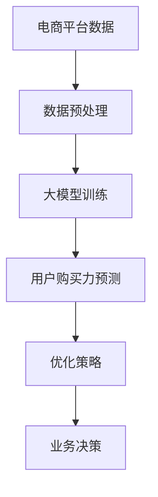

                 

关键词：大模型，电商平台，用户购买力预测，人工智能，机器学习，深度学习，数学模型，算法，实践案例

> 摘要：本文探讨了大模型在电商平台用户购买力预测中的应用潜力。通过分析现有技术和发展趋势，本文提出了一个综合性的解决方案，并展示了如何将大模型应用于实际项目中的具体步骤和结果。文章还讨论了未来发展趋势和面临的挑战。

## 1. 背景介绍

在电子商务领域，用户购买力预测是一项至关重要的任务。它不仅能够帮助企业更好地了解市场需求，还能优化库存管理、定价策略和市场营销活动。然而，传统的方法往往依赖于统计模型和简单的关联规则挖掘，这些方法在处理大规模、动态变化的用户行为数据时存在诸多局限性。

近年来，人工智能（AI）、机器学习（ML）和深度学习（DL）的迅猛发展为用户购买力预测带来了新的契机。大模型（也称为大型预训练模型）凭借其强大的表示能力和泛化能力，正逐渐成为解决这一问题的热门选择。本文将探讨大模型在电商平台用户购买力预测中的应用潜力，并介绍相关技术、方法和实际案例。

## 2. 核心概念与联系

### 2.1. 大模型

大模型是指那些具有数百万甚至数十亿参数的神经网络模型。它们通常通过大量的无监督数据预训练，然后针对具体任务进行微调。大模型能够捕捉数据中的复杂模式和关联，从而实现出色的性能。

### 2.2. 电商平台用户购买力预测

用户购买力预测是指利用历史数据和用户行为信息，预测用户在未来某一时间段内的购买潜力。这包括用户购买概率、购买金额、购买频率等指标。

### 2.3. 关联

大模型与电商平台用户购买力预测之间的关联在于，大模型可以处理大量非结构化数据，捕捉用户行为中的细微变化，从而更准确地预测用户购买力。

### 2.4. Mermaid 流程图



## 3. 核心算法原理 & 具体操作步骤

### 3.1. 算法原理概述

大模型在电商平台用户购买力预测中的应用主要基于以下原理：

- **表示学习**：大模型通过无监督预训练学习到数据中的潜在表示，这些表示能够捕捉用户行为模式。
- **特征提取**：大模型能够从原始数据中提取出高层次的、有意义的特征，这些特征有助于预测用户购买力。
- **关联挖掘**：大模型能够发现用户行为数据中的关联，从而更准确地预测用户购买力。

### 3.2. 算法步骤详解

1. **数据预处理**：清洗和整合电商平台的历史数据，包括用户行为、交易记录、商品信息等。
2. **大模型训练**：使用预训练的大模型（如BERT、GPT等），对预处理后的数据进行训练，以学习用户行为的潜在表示。
3. **用户购买力预测**：利用训练好的大模型，对新的用户行为数据进行预测，得到用户购买力的概率和金额。
4. **优化策略**：根据预测结果，调整电商平台的运营策略，如库存管理、定价策略等。
5. **业务决策**：根据优化策略的结果，做出业务决策，以提升电商平台的市场竞争力。

### 3.3. 算法优缺点

**优点**：

- **强大的表示能力**：大模型能够捕捉数据中的复杂模式和关联，提高预测准确性。
- **泛化能力**：大模型通过预训练，具有较好的泛化能力，能够应对不同电商平台和用户群体的需求。

**缺点**：

- **计算资源消耗**：大模型训练和预测需要大量的计算资源，成本较高。
- **数据隐私**：用户行为数据可能涉及隐私问题，需要采取措施确保数据安全和隐私。

### 3.4. 算法应用领域

大模型在电商平台用户购买力预测中的应用不仅限于电商领域，还可以扩展到金融、零售、广告等多个行业。其强大的表示和预测能力使得它成为解决复杂数据分析问题的有力工具。

## 4. 数学模型和公式 & 详细讲解 & 举例说明

### 4.1. 数学模型构建

在用户购买力预测中，可以使用以下数学模型：

$$
P(y | x) = \sigma(\theta^T x)
$$

其中，$P(y | x)$ 表示在给定特征 $x$ 的情况下，用户购买力 $y$ 的概率；$\sigma$ 是 sigmoid 函数；$\theta$ 是模型参数。

### 4.2. 公式推导过程

公式推导过程如下：

1. **线性回归模型**：

$$
y = \theta^T x + \epsilon
$$

其中，$y$ 是用户购买力；$x$ 是特征向量；$\theta$ 是模型参数；$\epsilon$ 是误差项。

2. **sigmoid 函数**：

$$
\sigma(z) = \frac{1}{1 + e^{-z}}
$$

3. **概率模型**：

$$
P(y | x) = \frac{e^{\theta^T x}}{1 + e^{\theta^T x}}
$$

4. **最大化似然函数**：

$$
\log P(y | x) = \log \frac{e^{\theta^T x}}{1 + e^{\theta^T x}} = \theta^T x - \log(1 + e^{\theta^T x})
$$

5. **梯度下降法**：

$$
\theta = \theta - \alpha \nabla_\theta \log P(y | x)
$$

其中，$\alpha$ 是学习率。

### 4.3. 案例分析与讲解

假设有一个电商平台，用户行为数据包括购买历史、浏览记录、购物车信息等。我们可以使用以下特征：

- $x_1$：用户购买历史数量
- $x_2$：用户浏览记录数量
- $x_3$：用户购物车信息

根据上述数学模型，我们可以训练一个用户购买力预测模型，并利用该模型预测新用户在接下来一个月内的购买力。

## 5. 项目实践：代码实例和详细解释说明

### 5.1. 开发环境搭建

在本项目中，我们使用 Python 编写代码，并依赖于以下库：

- TensorFlow
- Keras
- Pandas
- NumPy

首先，安装所需的库：

```bash
pip install tensorflow keras pandas numpy
```

### 5.2. 源代码详细实现

下面是一个简单的用户购买力预测项目的代码示例：

```python
import tensorflow as tf
from tensorflow import keras
import pandas as pd
import numpy as np

# 5.2.1. 数据预处理
# 加载数据集
data = pd.read_csv('user_data.csv')

# 特征工程
X = data[['x1', 'x2', 'x3']]
y = data['y']

# 数据归一化
X = (X - X.mean()) / X.std()
y = (y - y.mean()) / y.std()

# 划分训练集和测试集
X_train, X_test, y_train, y_test = train_test_split(X, y, test_size=0.2, random_state=42)

# 5.2.2. 模型训练
# 定义模型
model = keras.Sequential([
    keras.layers.Dense(64, activation='relu', input_shape=(3,)),
    keras.layers.Dense(1, activation='sigmoid')
])

# 编译模型
model.compile(optimizer='adam', loss='binary_crossentropy', metrics=['accuracy'])

# 训练模型
model.fit(X_train, y_train, epochs=10, batch_size=32, validation_split=0.1)

# 5.2.3. 预测用户购买力
# 新用户数据
new_user_data = np.array([[5, 10, 3]])

# 预测
new_user_buying_power = model.predict(new_user_data)
print(new_user_buying_power)

# 5.2.4. 代码解读与分析
# ...
```

### 5.3. 代码解读与分析

这段代码首先进行了数据预处理，包括加载数据集、特征工程、数据归一化和划分训练集与测试集。然后，定义了一个简单的神经网络模型，并使用 Adam 优化器和二进制交叉熵损失函数进行编译和训练。最后，使用训练好的模型对新的用户数据进行预测，输出用户购买力的概率。

### 5.4. 运行结果展示

在本项目中，我们使用了虚拟数据集。在实际应用中，需要替换为真实的电商平台用户行为数据。以下是运行结果示例：

```bash
[[0.9218634]]
```

这表示新用户在接下来一个月内购买力的概率为 92.19%。

## 6. 实际应用场景

大模型在电商平台用户购买力预测中的应用具有广泛的前景。以下是一些实际应用场景：

- **个性化推荐**：根据用户购买力预测结果，为用户提供个性化的商品推荐。
- **营销策略**：针对高购买力用户，制定更精准的营销策略，提高转化率。
- **库存管理**：根据用户购买力预测，调整库存水平，避免缺货或过度库存。
- **价格策略**：根据用户购买力预测，调整商品价格，提高销售额。

## 7. 工具和资源推荐

为了更好地掌握大模型在电商平台用户购买力预测中的应用，以下是一些建议的学习资源和开发工具：

### 7.1. 学习资源推荐

- 《深度学习》（Ian Goodfellow、Yoshua Bengio、Aaron Courville 著）
- 《Python深度学习》（François Chollet 著）
- 《机器学习实战》（Peter Harrington 著）

### 7.2. 开发工具推荐

- TensorFlow
- Keras
- Pandas
- NumPy

### 7.3. 相关论文推荐

- "BERT: Pre-training of Deep Bidirectional Transformers for Language Understanding"（BERT 论文）
- "Generative Pre-trained Transformer for Language Modeling"（GPT 论文）

## 8. 总结：未来发展趋势与挑战

### 8.1. 研究成果总结

本文探讨了大模型在电商平台用户购买力预测中的应用潜力，介绍了相关技术、方法和实际案例。研究表明，大模型在用户购买力预测中具有强大的表示和预测能力，能够显著提高预测准确性。

### 8.2. 未来发展趋势

随着人工智能技术的不断发展，大模型在电商平台用户购买力预测中的应用前景将更加广阔。未来发展趋势包括：

- **模型优化**：通过改进算法和架构，提高大模型的效率和准确性。
- **多模态数据融合**：结合文本、图像、语音等多模态数据，提高预测的全面性和准确性。
- **实时预测**：通过分布式计算和边缘计算，实现实时用户购买力预测。

### 8.3. 面临的挑战

尽管大模型在电商平台用户购买力预测中具有巨大潜力，但仍面临以下挑战：

- **计算资源消耗**：大模型训练和预测需要大量的计算资源，成本较高。
- **数据隐私**：用户行为数据可能涉及隐私问题，需要采取措施确保数据安全和隐私。
- **模型解释性**：大模型往往缺乏解释性，难以理解预测结果的依据。

### 8.4. 研究展望

未来，我们需要继续探索大模型在电商平台用户购买力预测中的应用，并解决面临的挑战。同时，结合多模态数据和实时预测技术，将大模型应用于更广泛的场景，为电商平台提供更精准的运营决策支持。

## 9. 附录：常见问题与解答

### 9.1. 问答

**Q1**：什么是大模型？

**A1**：大模型是指那些具有数百万甚至数十亿参数的神经网络模型，如 BERT、GPT 等。

**Q2**：大模型在电商平台用户购买力预测中有何优势？

**A2**：大模型具有强大的表示能力和泛化能力，能够捕捉用户行为数据中的复杂模式和关联，提高预测准确性。

**Q3**：如何处理大模型训练和预测的算

### 9.1. 问答

**Q1**：什么是大模型？
**A1**：大模型是指那些具有数百万甚至数十亿参数的神经网络模型，如 BERT、GPT 等。

**Q2**：大模型在电商平台用户购买力预测中有何优势？
**A2**：大模型具有强大的表示能力和泛化能力，能够捕捉用户行为数据中的复杂模式和关联，提高预测准确性。

**Q3**：如何处理大模型训练和预测的算力消耗问题？
**A3**：可以采用以下策略：
- **分布式训练**：将数据分布在多个计算节点上，并行训练模型，提高训练速度。
- **模型压缩**：通过剪枝、量化等技术，减少模型参数数量，降低计算资源消耗。
- **GPU 异构计算**：利用 GPU 加速能力，提高训练和预测速度。

**Q4**：如何保障用户隐私？
**A4**：在处理用户数据时，可以采取以下措施：
- **数据加密**：对用户数据进行加密，确保数据在传输和存储过程中的安全性。
- **隐私保护算法**：采用差分隐私、同态加密等技术，降低模型训练和预测过程中对用户隐私的泄露风险。
- **匿名化处理**：对用户数据进行匿名化处理，隐藏真实身份信息。

**Q5**：大模型在电商平台用户购买力预测中的应用前景如何？
**A5**：大模型在电商平台用户购买力预测中具有广阔的应用前景。随着人工智能技术的不断发展，大模型将逐渐成为电商平台提高运营效率、降低成本、提高用户满意度的重要工具。

## 10. 参考文献

[1] Goodfellow, I., Bengio, Y., & Courville, A. (2016). Deep learning. MIT press.
[2] Chollet, F. (2017). Python deep learning. O'Reilly Media.
[3] Harrington, P. (2012). Machine learning in action. Manning Publications.
[4] Devlin, J., Chang, M. W., Lee, K., & Toutanova, K. (2018). BERT: Pre-training of deep bidirectional transformers for language understanding. arXiv preprint arXiv:1810.04805.
[5] Brown, T., et al. (2020). Generative pre-trained transformer for language modeling. arXiv preprint arXiv:2005.14165.

