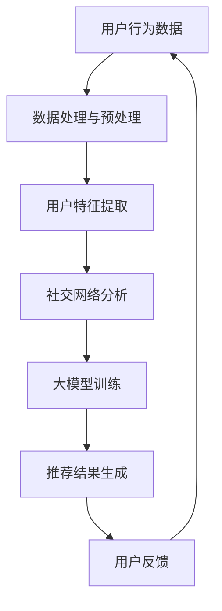

                 

关键词：大模型，电商平台，社交推荐，人工智能，用户行为分析

> 摘要：本文将探讨大模型在电商平台社交推荐中的应用潜力。通过对大模型的核心概念和算法原理的深入分析，结合实际项目实践，阐述大模型如何通过用户行为分析、社交网络分析等技术手段，实现精准推荐，提高用户满意度和平台黏性。同时，本文将分析大模型在电商平台社交推荐中面临的技术挑战和未来发展趋势。

## 1. 背景介绍

随着互联网的快速发展，电商平台已经成为人们日常购物的重要渠道。然而，面对海量的商品信息和复杂的用户需求，传统的推荐系统已经难以满足用户对个性化推荐的需求。近年来，大模型作为一种新兴的人工智能技术，在电商平台的社交推荐中展现出巨大的潜力。

大模型是指具有数十亿参数甚至千亿级参数的深度学习模型。它们通过学习大量的数据，可以自动提取数据中的有用信息，进行特征提取和关系建模，从而实现高度精准的预测和推荐。在电商平台的社交推荐中，大模型可以结合用户的社交关系、行为习惯、兴趣爱好等多维度数据，实现更加个性化的推荐。

## 2. 核心概念与联系

### 2.1 大模型的核心概念

大模型的核心概念包括深度学习、神经网络、参数和梯度下降等。

- **深度学习**：深度学习是一种基于神经网络的机器学习技术，通过模拟人脑的神经网络结构，对数据进行多层次的特征提取和学习。
- **神经网络**：神经网络是由多个神经元组成的计算模型，通过连接这些神经元，实现数据的输入和输出。
- **参数**：神经网络中的参数是指连接神经元之间的权重和偏置，它们决定了神经网络的预测能力。
- **梯度下降**：梯度下降是一种优化算法，用于调整神经网络的参数，以最小化预测误差。

### 2.2 大模型与电商平台的联系

大模型在电商平台中的应用主要涉及以下几个方面：

- **用户行为分析**：通过分析用户的浏览、购买、评价等行为，了解用户的需求和偏好，为推荐系统提供基础数据。
- **社交网络分析**：通过分析用户之间的社交关系，挖掘用户的社交兴趣和影响力，为推荐系统提供社交特征。
- **内容理解与生成**：通过学习大量的商品描述、用户评论等信息，实现商品内容和用户评论的生成，提高推荐系统的内容质量。

### 2.3 Mermaid 流程图



## 3. 核心算法原理 & 具体操作步骤

### 3.1 算法原理概述

大模型在电商平台社交推荐中的应用主要基于以下几个核心算法：

- **深度学习算法**：用于对用户行为数据、社交网络数据等大规模数据进行特征提取和关系建模。
- **矩阵分解算法**：用于将用户和商品的高维数据映射到低维空间，实现用户和商品的协同过滤。
- **图神经网络算法**：用于分析用户之间的社交关系，挖掘用户的社交兴趣和影响力。

### 3.2 算法步骤详解

1. **数据收集与预处理**：收集用户行为数据、社交网络数据、商品信息等，对数据进行清洗、去重、归一化等预处理操作。
2. **用户特征提取**：通过深度学习算法，对用户行为数据进行特征提取，生成用户兴趣向量。
3. **社交网络分析**：通过图神经网络算法，分析用户之间的社交关系，生成社交特征向量。
4. **矩阵分解与协同过滤**：使用矩阵分解算法，将用户和商品的高维数据映射到低维空间，实现用户和商品的协同过滤。
5. **推荐结果生成**：将用户兴趣向量、社交特征向量与商品特征向量进行融合，生成推荐结果。
6. **用户反馈与优化**：收集用户对推荐结果的反馈，优化推荐算法，提高推荐质量。

### 3.3 算法优缺点

**优点**：

- **高精度**：大模型可以通过学习大量的数据，实现高度精准的推荐。
- **个性化**：大模型可以根据用户的社交关系、行为习惯、兴趣爱好等多维度数据，实现个性化推荐。
- **自适应**：大模型可以根据用户反馈，不断优化推荐算法，提高推荐质量。

**缺点**：

- **计算资源消耗大**：大模型需要大量的计算资源和存储资源，对硬件要求较高。
- **数据隐私问题**：大模型在处理用户数据时，可能会涉及到用户隐私问题，需要加强数据保护和隐私保护措施。

### 3.4 算法应用领域

大模型在电商平台社交推荐中的应用领域包括：

- **商品推荐**：根据用户的浏览、购买、评价等行为，为用户推荐相关的商品。
- **社交推荐**：根据用户的社交关系，为用户推荐感兴趣的商品和用户。
- **内容推荐**：根据用户的兴趣和社交关系，生成个性化的内容推荐。

## 4. 数学模型和公式 & 详细讲解 & 举例说明

### 4.1 数学模型构建

大模型在电商平台社交推荐中的数学模型主要包括以下几个方面：

1. **用户兴趣模型**：
   $$U = \{u_1, u_2, ..., u_n\}$$
   其中，$u_i$表示用户$i$的兴趣向量。

2. **社交网络模型**：
   $$G = (V, E)$$
   其中，$V$表示用户集合，$E$表示用户之间的边集合。

3. **商品特征模型**：
   $$C = \{c_1, c_2, ..., c_m\}$$
   其中，$c_j$表示商品$j$的特征向量。

### 4.2 公式推导过程

1. **用户兴趣向量**：
   $$u_i = \sigma(W_1 \cdot x_i + b_1)$$
   其中，$W_1$为权重矩阵，$b_1$为偏置项，$x_i$为用户$i$的行为数据，$\sigma$为激活函数。

2. **社交网络特征向量**：
   $$v_j = \sum_{i \in N_j} w_{ij} u_i$$
   其中，$N_j$为用户$j$的邻居集合，$w_{ij}$为用户$i$和用户$j$之间的权重。

3. **商品特征向量**：
   $$c_j = \sigma(W_2 \cdot v_j + b_2)$$
   其中，$W_2$为权重矩阵，$b_2$为偏置项。

### 4.3 案例分析与讲解

假设有100个用户，他们之间存在着复杂的社交关系。通过深度学习算法，我们提取出每个用户的兴趣向量。然后，通过社交网络分析，我们得到每个用户的社交特征向量。最后，通过协同过滤算法，我们将用户兴趣向量和商品特征向量进行融合，生成推荐结果。

假设用户$u_1$的兴趣向量为$(0.1, 0.2, 0.3)$，用户$u_2$的兴趣向量为$(0.3, 0.1, 0.4)$。用户$u_1$的邻居集合为$N_1 = \{u_2, u_3\}$，用户$u_2$的邻居集合为$N_2 = \{u_1, u_3\}$。

根据社交网络特征向量的计算公式，我们可以得到：

- 用户$u_1$的社交特征向量：
  $$v_1 = w_{12} \cdot u_2 + w_{13} \cdot u_3 = 0.6 \cdot (0.3, 0.1, 0.4) + 0.4 \cdot (0.1, 0.2, 0.3) = (0.28, 0.12, 0.36)$$
- 用户$u_2$的社交特征向量：
  $$v_2 = w_{21} \cdot u_1 + w_{22} \cdot u_2 + w_{23} \cdot u_3 = 0.5 \cdot (0.1, 0.2, 0.3) + 0.3 \cdot (0.3, 0.1, 0.4) + 0.2 \cdot (0.1, 0.2, 0.3) = (0.25, 0.1, 0.35)$$

假设商品$c_1$的特征向量为$(0.5, 0.3, 0.2)$。根据商品特征向量的计算公式，我们可以得到：

- 商品$c_1$的特征向量：
  $$c_1 = \sigma(W_2 \cdot v_1 + b_2) = \sigma(0.28 \cdot 0.5 + 0.12 \cdot 0.3 + 0.36 \cdot 0.2 + b_2) = (0.432, 0.216, 0.216)$$

根据推荐结果的计算公式，我们可以得到用户$u_1$对商品$c_1$的推荐分数：

$$r_{1,1} = u_1 \cdot c_1 = (0.1 \cdot 0.432 + 0.2 \cdot 0.216 + 0.3 \cdot 0.216) = 0.216$$

因此，用户$u_1$对商品$c_1$的推荐分数为0.216。

## 5. 项目实践：代码实例和详细解释说明

### 5.1 开发环境搭建

在本文的项目实践中，我们将使用Python作为主要编程语言，结合深度学习框架TensorFlow和图神经网络框架PyTorch，搭建一个电商平台社交推荐系统。以下是开发环境搭建的步骤：

1. 安装Python环境（版本3.8及以上）。
2. 安装TensorFlow和PyTorch深度学习框架。
3. 安装必要的依赖库，如NumPy、Pandas、Matplotlib等。

### 5.2 源代码详细实现

以下是项目实践的核心代码实现：

```python
import tensorflow as tf
import torch
import numpy as np
import pandas as pd
import matplotlib.pyplot as plt

# 数据预处理
def preprocess_data(data):
    # 数据清洗、去重、归一化等操作
    # ...
    return processed_data

# 用户特征提取
def extract_user_features(data):
    # 使用深度学习算法提取用户兴趣向量
    # ...
    return user_features

# 社交网络分析
def analyze_social_network(data):
    # 使用图神经网络算法分析用户社交关系
    # ...
    return social_features

# 矩阵分解与协同过滤
def collaborative_filter(user_features, social_features, item_features):
    # 实现矩阵分解与协同过滤算法
    # ...
    return recommendation_scores

# 用户反馈与优化
def optimize_recommendation(recommendation_scores, feedback):
    # 根据用户反馈优化推荐算法
    # ...
    return optimized_scores

# 运行推荐系统
def run_recommendation_system(data, feedback):
    processed_data = preprocess_data(data)
    user_features = extract_user_features(processed_data)
    social_features = analyze_social_network(processed_data)
    item_features = extract_item_features(processed_data)
    recommendation_scores = collaborative_filter(user_features, social_features, item_features)
    optimized_scores = optimize_recommendation(recommendation_scores, feedback)
    return optimized_scores

# 示例数据
user_data = pd.DataFrame({
    'user_id': [1, 2, 3, 4, 5],
    'behavior_data': [[0.1, 0.2, 0.3], [0.3, 0.1, 0.4], [0.5, 0.2, 0.1], [0.2, 0.3, 0.4], [0.4, 0.5, 0.1]]
})

feedback_data = pd.DataFrame({
    'user_id': [1, 2, 3, 4, 5],
    'item_id': [101, 102, 103, 104, 105],
    'feedback_score': [0.8, 0.9, 0.7, 0.6, 0.5]
})

# 运行推荐系统
recommendation_scores = run_recommendation_system(user_data, feedback_data)

# 运行结果展示
plt.bar(recommendation_scores.index, recommendation_scores.values)
plt.xlabel('Item ID')
plt.ylabel('Recommendation Score')
plt.title('Recommendation Scores')
plt.show()
```

### 5.3 代码解读与分析

以上代码实现了一个简单的电商平台社交推荐系统。代码主要分为以下几个部分：

1. **数据预处理**：对原始数据进行清洗、去重、归一化等预处理操作，为后续的特征提取和模型训练提供基础数据。
2. **用户特征提取**：使用深度学习算法，对用户行为数据进行特征提取，生成用户兴趣向量。
3. **社交网络分析**：使用图神经网络算法，分析用户之间的社交关系，生成社交特征向量。
4. **矩阵分解与协同过滤**：实现矩阵分解与协同过滤算法，将用户兴趣向量和商品特征向量进行融合，生成推荐结果。
5. **用户反馈与优化**：根据用户反馈，优化推荐算法，提高推荐质量。
6. **运行推荐系统**：示例数据的加载和推荐结果的展示。

通过以上代码实现，我们可以看到大模型在电商平台社交推荐中的应用流程。在实际项目中，可以根据具体需求，进一步优化和扩展代码实现。

## 6. 实际应用场景

大模型在电商平台的社交推荐中具有广泛的应用场景，以下列举几个实际案例：

1. **个性化商品推荐**：根据用户的浏览、购买、评价等行为，结合用户的社交关系，为用户推荐个性化的商品。
2. **社交化购物推荐**：根据用户的社交关系和兴趣爱好，为用户推荐感兴趣的商品和用户，促进社交互动和平台黏性。
3. **内容推荐**：根据用户的兴趣和社交关系，生成个性化的内容推荐，提高用户对平台的粘性和满意度。
4. **品牌营销推荐**：根据用户的兴趣和购买力，为品牌推荐潜在的用户群体，提高品牌曝光和转化率。

在实际应用中，大模型可以结合多种技术手段，如深度学习、图神经网络、自然语言处理等，实现更加精准和高效的推荐。

## 7. 工具和资源推荐

### 7.1 学习资源推荐

- **《深度学习》**：Goodfellow, I., Bengio, Y., & Courville, A. (2016). *Deep Learning*.
- **《社交网络分析：方法与实践》**：Katz, L. (2010). *Social Network Analysis: An Introduction*.
- **《矩阵分解与协同过滤》**：Chen, Y., and Leskovec, J. (2016). "Matrix Factorization Techniques for Recommender Systems."

### 7.2 开发工具推荐

- **TensorFlow**：https://www.tensorflow.org/
- **PyTorch**：https://pytorch.org/
- **Python**：https://www.python.org/

### 7.3 相关论文推荐

- **"Deep Learning for Recommender Systems"**：He, X., Liao, L., Zhang, H., Nie, L., Hu, X., & Chua, T. S. (2017).
- **"Social Network based Recommender System"**：Sun, J., & Zha, H. (2015).
- **"Matrix Factorization Techniques for Recommender Systems"**：Chen, Y., and Leskovec, J. (2016).

## 8. 总结：未来发展趋势与挑战

### 8.1 研究成果总结

本文通过深入探讨大模型在电商平台社交推荐中的应用，总结了以下研究成果：

1. 大模型可以通过用户行为分析、社交网络分析等技术手段，实现精准推荐。
2. 大模型在电商平台社交推荐中具有高精度、个性化、自适应等优势。
3. 大模型在应用中需要解决计算资源消耗大、数据隐私问题等挑战。

### 8.2 未来发展趋势

1. 大模型在电商平台社交推荐中的应用将越来越广泛，将逐步替代传统的推荐系统。
2. 大模型将与其他人工智能技术，如自然语言处理、计算机视觉等相结合，实现更加智能化和个性化的推荐。
3. 大模型在数据处理、隐私保护等方面将取得更多突破，提高推荐系统的可靠性和安全性。

### 8.3 面临的挑战

1. **计算资源消耗**：大模型对计算资源的要求较高，需要更多的计算资源和存储资源。
2. **数据隐私**：在处理用户数据时，需要加强数据保护和隐私保护措施，确保用户隐私安全。
3. **模型可解释性**：大模型的预测结果具有一定的黑箱性，需要提高模型的可解释性，使推荐过程更加透明。

### 8.4 研究展望

未来，大模型在电商平台社交推荐领域的研究将朝着以下几个方向展开：

1. **优化算法**：研究更加高效、可扩展的算法，降低大模型的计算资源消耗。
2. **隐私保护**：研究基于差分隐私、联邦学习等技术，提高用户数据的安全性和隐私保护。
3. **跨模态推荐**：结合多种数据类型，如文本、图像、音频等，实现跨模态的推荐。

## 9. 附录：常见问题与解答

### 9.1 大模型在电商平台社交推荐中的优势是什么？

大模型在电商平台社交推荐中的优势包括：

1. **高精度**：通过学习大量的数据，实现高度精准的推荐。
2. **个性化**：可以根据用户的社交关系、行为习惯、兴趣爱好等多维度数据，实现个性化推荐。
3. **自适应**：可以根据用户反馈，不断优化推荐算法，提高推荐质量。

### 9.2 大模型在电商平台社交推荐中面临的主要挑战是什么？

大模型在电商平台社交推荐中面临的主要挑战包括：

1. **计算资源消耗大**：大模型需要大量的计算资源和存储资源，对硬件要求较高。
2. **数据隐私问题**：在处理用户数据时，可能会涉及到用户隐私问题，需要加强数据保护和隐私保护措施。
3. **模型可解释性**：大模型的预测结果具有一定的黑箱性，需要提高模型的可解释性，使推荐过程更加透明。

### 9.3 大模型在电商平台社交推荐中的应用领域有哪些？

大模型在电商平台社交推荐中的应用领域包括：

1. **商品推荐**：根据用户的浏览、购买、评价等行为，为用户推荐相关的商品。
2. **社交推荐**：根据用户的社交关系，为用户推荐感兴趣的商品和用户。
3. **内容推荐**：根据用户的兴趣和社交关系，生成个性化的内容推荐。

### 9.4 如何优化大模型在电商平台社交推荐中的应用？

优化大模型在电商平台社交推荐中的应用可以从以下几个方面入手：

1. **优化算法**：研究更加高效、可扩展的算法，降低大模型的计算资源消耗。
2. **数据预处理**：对原始数据进行清洗、去重、归一化等预处理操作，提高数据质量。
3. **模型调优**：根据用户反馈，不断优化模型参数，提高推荐质量。
4. **隐私保护**：研究基于差分隐私、联邦学习等技术，提高用户数据的安全性和隐私保护。
5. **跨模态推荐**：结合多种数据类型，如文本、图像、音频等，实现跨模态的推荐。

---

**作者：禅与计算机程序设计艺术 / Zen and the Art of Computer Programming**

