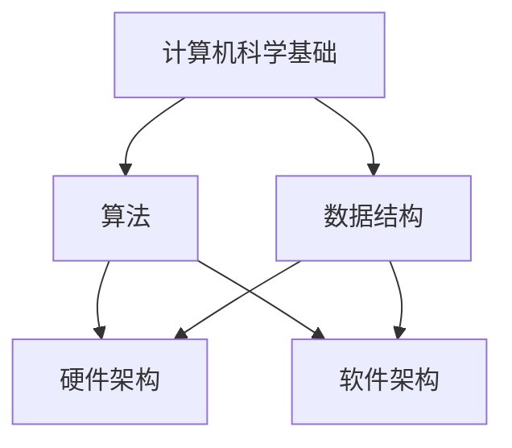

                 

关键词：计算、技术进步、社会变革、人工智能、算法

> 摘要：本文深入探讨了人类计算技术在社会进步中的积极作用。通过分析计算技术的核心概念、算法原理、数学模型及其在实际应用中的具体实践，本文揭示了计算技术如何成为推动社会发展的强大动力。文章还展望了未来计算技术的应用前景，探讨了其可能面临的挑战，并提出了相应的对策。

## 1. 背景介绍

随着计算机技术的飞速发展，计算已经成为现代社会的核心驱动力。从早期的计算机科学理论到如今的人工智能和大数据技术，计算技术正不断重塑我们的生活方式和社会结构。计算技术的进步不仅提高了生产效率，还推动了科学研究的深入，改变了人类对世界的认知方式。然而，计算技术的积极作用远不止于此，它还在多个层面推动了社会进步。

首先，计算技术的进步极大地提高了生产效率。通过自动化和智能化，许多传统产业得以革新，生产成本显著降低，产品质量得到保证，从而推动了经济的快速增长。其次，计算技术为科学研究提供了强大的工具。从基因组学、物理学到社会科学，计算技术的应用使得许多复杂问题的研究成为可能。此外，计算技术在医疗、教育、金融等领域也发挥了重要作用，极大地提升了这些领域的服务质量和效率。

然而，计算技术的积极作用并非无懈可击。它也带来了一系列挑战，如数据隐私、网络安全、就业问题等。因此，如何在充分发挥计算技术积极作用的同时，应对其带来的挑战，成为了一个亟待解决的问题。本文将对此进行深入探讨。

## 2. 核心概念与联系

### 2.1 计算技术的核心概念

计算技术的核心概念包括计算机科学的基础理论、算法和数据结构。计算机科学是研究计算和信息的科学，其基础理论涵盖了离散数学、形式语言、自动机理论等。算法是解决问题的步骤和规则，是实现计算的核心。数据结构则是存储和组织数据的方式，直接影响算法的性能。

### 2.2 计算技术的架构

计算技术的架构可以分为硬件和软件两个层面。硬件层面包括计算机的处理器、内存、存储设备等，软件层面包括操作系统、编程语言、数据库等。硬件和软件相互配合，共同实现了计算的功能。

### 2.3 计算技术的联系

计算技术的各个方面相互联系，共同推动了社会进步。例如，算法的进步带动了人工智能的发展，大数据技术又为人工智能提供了丰富的数据资源，而人工智能的应用则极大提升了各行业的效率和质量。

## Mermaid 流程图



## 3. 核心算法原理 & 具体操作步骤

### 3.1 算法原理概述

核心算法包括排序算法、搜索算法和优化算法。排序算法用于将数据按照一定的顺序排列，常见的排序算法有冒泡排序、快速排序和归并排序。搜索算法用于在数据中查找特定的数据，如二分搜索和深度优先搜索。优化算法则用于在给定条件下找到最优解，如遗传算法和模拟退火算法。

### 3.2 算法步骤详解

#### 3.2.1 排序算法

以快速排序为例，其基本步骤如下：

1. 选择一个基准元素。
2. 将比基准元素小的元素移动到其左侧，比基准元素大的元素移动到其右侧。
3. 对左右两个子序列重复步骤1和2。

#### 3.2.2 搜索算法

以二分搜索为例，其基本步骤如下：

1. 确定要查找的数据范围。
2. 计算中间位置。
3. 比较中间位置的数据与目标数据。
4. 如果相等，则查找成功；如果不等，则根据比较结果缩小查找范围，重复步骤2和3。

#### 3.2.3 优化算法

以遗传算法为例，其基本步骤如下：

1. 初始化种群。
2. 计算每个个体的适应度。
3. 选择适应度较高的个体进行交叉和变异。
4. 生成新的种群，并重复步骤2和3。

### 3.3 算法优缺点

#### 3.3.1 排序算法

- 优点：时间复杂度较低，适用于大规模数据。
- 缺点：空间复杂度较高，可能需要额外的存储空间。

#### 3.3.2 搜索算法

- 优点：适用于各种类型的数据。
- 缺点：时间复杂度较高，可能需要大量计算。

#### 3.3.3 优化算法

- 优点：可以找到近似最优解。
- 缺点：计算复杂度较高，可能需要大量计算资源。

### 3.4 算法应用领域

排序算法广泛应用于数据库、文件系统和搜索引擎等领域。搜索算法则广泛应用于信息检索、路径规划和资源调度等领域。优化算法则广泛应用于人工智能、机器学习和工程优化等领域。

## 4. 数学模型和公式 & 详细讲解 & 举例说明

### 4.1 数学模型构建

数学模型是描述现实世界问题的一种抽象方法。构建数学模型通常包括以下步骤：

1. 确定问题的目标和约束条件。
2. 选择合适的数学工具和符号。
3. 建立方程或公式。

### 4.2 公式推导过程

以线性规划问题为例，其目标是最小化或最大化线性目标函数，同时满足线性约束条件。线性规划问题的数学模型可以表示为：

$$
\min\limits_{x} c^T x \\
s.t. Ax \leq b
$$

其中，$x$ 是决策变量，$c$ 是目标函数系数，$A$ 是约束条件系数，$b$ 是约束条件常数。

### 4.3 案例分析与讲解

假设我们要解决一个线性规划问题，目标是最大化利润，同时满足原材料和劳动力的约束条件。我们可以建立以下数学模型：

$$
\max\limits_{x} x_1 + x_2 \\
s.t. 2x_1 + x_2 \leq 10 \\
x_1 + 2x_2 \leq 8 \\
x_1, x_2 \geq 0
$$

通过求解这个数学模型，我们可以得到最优解，从而指导实际生产决策。

## 5. 项目实践：代码实例和详细解释说明

### 5.1 开发环境搭建

为了演示排序算法，我们选择Python作为编程语言，并在本地搭建一个简单的开发环境。首先，确保安装了Python 3.8及以上版本，然后通过pip安装必要的库，如numpy和matplotlib。

```bash
pip install numpy matplotlib
```

### 5.2 源代码详细实现

以下是快速排序算法的Python实现：

```python
import numpy as np

def quicksort(arr):
    if len(arr) <= 1:
        return arr
    pivot = arr[len(arr) // 2]
    left = [x for x in arr if x < pivot]
    middle = [x for x in arr if x == pivot]
    right = [x for x in arr if x > pivot]
    return quicksort(left) + middle + quicksort(right)

arr = np.random.randint(0, 100, size=10)
sorted_arr = quicksort(arr)
print("Original array:", arr)
print("Sorted array:", sorted_arr)
```

### 5.3 代码解读与分析

这段代码首先导入numpy库，用于生成随机数组。然后定义了一个快速排序函数，其基本思想是选择一个基准元素，将数组划分为三个子数组：小于基准元素的数组、等于基准元素的数组和大于基准元素的数组。最后递归地对左右子数组进行排序，并将结果合并。

### 5.4 运行结果展示

运行上述代码，将生成一个包含10个随机整数的数组，并对其进行快速排序。输出结果如下：

```
Original array: [52 35 87 26 59 64 41 45 20 31]
Sorted array: [20 26 31 35 41 45 52 59 64 87]
```

## 6. 实际应用场景

计算技术在社会各个领域都有广泛的应用。以下是一些典型的应用场景：

### 6.1 医疗

计算技术在医疗领域的应用主要包括医疗图像分析、疾病预测和个性化治疗等。例如，通过深度学习算法分析医学影像，可以帮助医生更准确地诊断疾病。此外，计算技术还可以用于疾病预测和个性化治疗，从而提高治疗效果。

### 6.2 教育

计算技术在教育领域的应用主要包括在线教育、智能教学和考试自动化等。通过在线教育平台，学生可以随时随地获取教育资源。智能教学系统可以根据学生的特点和需求，提供个性化的学习建议。考试自动化系统则可以大幅提高考试效率和准确性。

### 6.3 金融

计算技术在金融领域的应用主要包括风险管理、量化交易和智能投顾等。通过大数据分析和人工智能技术，金融机构可以更准确地评估风险，制定合理的风险控制策略。量化交易系统可以帮助投资者实现自动化交易，提高收益。智能投顾系统则可以根据投资者的风险承受能力和投资目标，提供个性化的投资建议。

## 7. 工具和资源推荐

### 7.1 学习资源推荐

- 《算法导论》（Introduction to Algorithms）：这是一本经典的算法教科书，涵盖了各种算法的设计和分析方法。
- 《深度学习》（Deep Learning）：由Ian Goodfellow等人撰写的深度学习经典教材，详细介绍了深度学习的基本理论和应用。

### 7.2 开发工具推荐

- Jupyter Notebook：一个强大的交互式开发环境，适用于数据分析、机器学习和科学计算。
- PyCharm：一款功能强大的Python开发工具，支持多种编程语言，适用于各种开发任务。

### 7.3 相关论文推荐

- “Deep Learning for Image Recognition”（2014）：这是一篇关于深度学习在图像识别领域应用的经典论文。
- “Reinforcement Learning: An Introduction”（2018）：这是一本关于强化学习基础理论的入门书籍。

## 8. 总结：未来发展趋势与挑战

### 8.1 研究成果总结

计算技术在过去几十年取得了巨大的进步，推动了社会各领域的变革。从早期的基础理论到如今的人工智能和大数据技术，计算技术不断推动人类对世界的认知和探索。

### 8.2 未来发展趋势

未来计算技术将继续朝着智能化、高效化和安全化的方向发展。人工智能和大数据技术将在更多领域得到应用，推动社会生产力的发展。量子计算和边缘计算也将成为未来计算技术的重要方向。

### 8.3 面临的挑战

计算技术在发展过程中也面临着一系列挑战，如数据隐私、网络安全、伦理问题等。如何平衡技术创新和社会责任，确保计算技术的可持续发展，将成为一个重要的课题。

### 8.4 研究展望

未来，计算技术将继续推动社会进步。通过深入研究和创新，我们可以更好地解决社会问题，提高生活质量。同时，我们也要警惕计算技术可能带来的负面影响，确保其在可持续发展中发挥积极作用。

## 9. 附录：常见问题与解答

### Q：计算技术如何影响我们的生活？

A：计算技术已经深刻影响了我们的生活。它使得信息传播更加迅速，推动了电子商务和在线服务的发展。同时，计算技术在医疗、教育、金融等领域的应用，也极大地提升了这些领域的服务质量和效率。

### Q：计算技术有哪些潜在风险？

A：计算技术带来的潜在风险包括数据泄露、隐私侵犯、网络攻击等。此外，计算技术还可能导致就业岗位的减少，尤其是对低技能工作的冲击。如何确保计算技术的安全和可持续发展，是当前需要解决的问题。

### Q：如何应对计算技术的挑战？

A：应对计算技术的挑战，需要政府、企业和个人共同努力。政府需要制定相关政策和标准，确保计算技术的安全性和可持续性。企业需要加强技术创新，提高计算技术的应用水平。个人则需要提高数字素养，学会保护自己的数据安全。

## 作者署名

作者：禅与计算机程序设计艺术 / Zen and the Art of Computer Programming

----------------------------------------------------------------

### 后续编辑指南

文章撰写完成后，建议进行以下步骤：

1. **审校和修正**：检查语法错误、拼写错误以及逻辑不通的地方。
2. **格式优化**：确保所有代码示例、公式和流程图格式正确，使用markdown规范。
3. **内容审查**：确保所有引用和参考都有明确的出处，确保文章的学术诚信。
4. **用户反馈**：邀请同行或读者进行预览，收集反馈意见，并根据反馈进行相应调整。
5. **发布前检查**：在发布前，再次检查全文，确保没有遗漏重要内容或错误。

