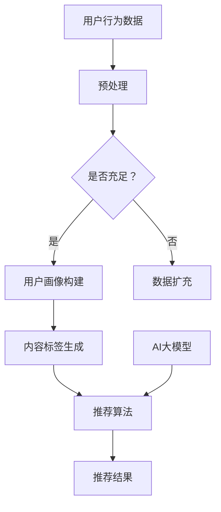

                 

 推荐系统是当今互联网中不可或缺的一部分，它们通过分析用户行为和历史数据，为用户推荐可能感兴趣的内容、商品或服务。随着人工智能技术的迅猛发展，特别是大模型（如GPT-3、BERT等）的出现，推荐系统迎来了新的机遇与挑战。本文将探讨AI大模型在推荐系统中的探索与应用，以及如何在利用大模型的优势时保持平衡。

## 关键词

- 推荐系统
- AI大模型
- GPT-3
- BERT
- 个性化推荐

## 摘要

本文首先介绍了推荐系统的基本概念和常见算法。随后，我们深入探讨了AI大模型在推荐系统中的应用，分析了其优势与挑战。通过具体的数学模型和算法步骤的讲解，我们展示了如何利用AI大模型提高推荐系统的性能。接着，我们通过代码实例详细解释了如何实现这一过程。文章最后探讨了AI大模型在推荐系统中的未来应用前景，并提出了一些可能的研究方向和挑战。

## 1. 背景介绍

### 推荐系统简介

推荐系统是一种基于用户行为和内容信息的系统，旨在为用户推荐可能感兴趣的项目。推荐系统在电子商务、社交媒体、在线新闻等领域得到了广泛应用。基本的推荐系统通常包括以下组件：

- **用户画像**：构建用户的偏好模型，通过分析用户的历史行为、兴趣标签等数据，形成用户画像。
- **内容标签**：对推荐的内容进行标签化处理，使得系统能够更好地理解内容属性。
- **推荐算法**：基于用户画像和内容标签，通过算法计算用户与内容的相似度，生成推荐列表。

常见的推荐算法有基于内容的推荐（Content-Based Filtering）、协同过滤（Collaborative Filtering）和混合推荐（Hybrid Recommendation）等。

### AI大模型简介

AI大模型是指那些拥有巨大参数量、能够处理海量数据并生成复杂预测结果的深度学习模型。GPT-3、BERT等模型是AI大模型的典型代表。这些模型通过自我学习，可以捕捉到大量的上下文信息，生成更加准确和自然的推荐。

## 2. 核心概念与联系

### 推荐系统架构

以下是一个简化的推荐系统架构图：

```
+------------+      +----------------+      +-------------------+
| 用户画像   | -->  | 内容标签       | -->  | 推荐算法          |
+------------+      +----------------+      +-------------------+
        ^            ^                           |
        |            |                           |
        |            |                           |
        +------------+                           |
                                      +-------------------+
                                      | AI大模型（如GPT-3）|
                                      +-------------------+
```

### 推荐算法与AI大模型的关系

AI大模型可以增强推荐系统的学习能力，提高推荐的准确性。具体来说，AI大模型可以通过以下方式与推荐算法结合：

- **用户画像增强**：利用AI大模型对用户的历史行为进行深入分析，构建更精确的用户画像。
- **内容标签生成**：AI大模型可以自动生成内容标签，提高内容标签的准确性。
- **相似度计算**：AI大模型可以优化相似度计算过程，提高推荐的精度。

### Mermaid 流程图

以下是一个简化的推荐系统流程图：



## 3. 核心算法原理 & 具体操作步骤

### 3.1 算法原理概述

AI大模型在推荐系统中的应用，主要是通过以下几个方面实现的：

- **用户画像构建**：利用AI大模型对用户的历史行为进行深入分析，提取用户的兴趣点和偏好。
- **内容标签生成**：利用AI大模型对内容进行自动标签化处理，提高标签的准确性。
- **相似度计算**：利用AI大模型优化相似度计算过程，提高推荐的精度。

### 3.2 算法步骤详解

#### 3.2.1 用户画像构建

1. **数据预处理**：对用户行为数据（如浏览记录、购买历史、点击率等）进行清洗和预处理，去除噪声数据。
2. **特征提取**：利用AI大模型（如BERT）对预处理后的数据进行分析，提取用户的兴趣点和偏好。
3. **用户画像构建**：将提取的特征整合成用户画像，用于后续推荐。

#### 3.2.2 内容标签生成

1. **数据预处理**：对内容数据进行清洗和预处理，去除噪声数据。
2. **特征提取**：利用AI大模型（如GPT-3）对预处理后的数据进行分析，提取内容的关键特征。
3. **标签生成**：利用提取的特征生成内容标签，用于后续推荐。

#### 3.2.3 相似度计算

1. **用户-内容表示**：利用AI大模型将用户画像和内容标签转换为向量表示。
2. **相似度计算**：计算用户向量与内容向量之间的相似度，生成推荐列表。

### 3.3 算法优缺点

#### 优点：

- **高精度**：AI大模型可以捕捉到复杂的用户行为和内容特征，提高推荐的精度。
- **自动性**：AI大模型可以自动进行特征提取和标签生成，降低人工干预。
- **扩展性**：AI大模型可以快速适应新的用户行为和内容特征，提高系统的适应能力。

#### 缺点：

- **计算资源消耗**：AI大模型通常需要大量的计算资源，对硬件要求较高。
- **解释性不足**：AI大模型的决策过程不够透明，难以解释推荐结果。

### 3.4 算法应用领域

AI大模型在推荐系统中的应用广泛，以下是一些典型领域：

- **电子商务**：为用户推荐商品，提高销售额。
- **社交媒体**：为用户推荐感兴趣的内容，提高用户粘性。
- **在线新闻**：为用户推荐新闻，提高用户阅读量。

## 4. 数学模型和公式 & 详细讲解 & 举例说明

### 4.1 数学模型构建

假设用户$u$和内容$c$分别由向量$u \in \mathbb{R}^n$和$c \in \mathbb{R}^n$表示，我们希望计算用户$u$对内容$c$的偏好得分$score(u, c)$。可以使用以下公式进行计算：

$$
score(u, c) = \cos(u, c) = \frac{u^Tc}{\|u\|\|c\|}
$$

其中，$u^Tc$表示用户向量$u$与内容向量$c$的点积，$\|u\|$和$\|c\|$分别表示用户向量$u$和内容向量$c$的欧几里得范数。

### 4.2 公式推导过程

我们首先考虑用户$u$和内容$c$的向量表示：

$$
u = \text{model}(u, \theta_u), \quad c = \text{model}(c, \theta_c)
$$

其中，$\text{model}$表示AI大模型，$\theta_u$和$\theta_c$分别表示用户和内容的模型参数。

接下来，我们计算用户向量$u$与内容向量$c$的点积：

$$
u^Tc = \text{model}^T(u, \theta_u)\text{model}(c, \theta_c)
$$

为了计算$\cos(u, c)$，我们首先计算$\|u\|$和$\|c\|$：

$$
\|u\| = \sqrt{u^Tu}, \quad \|c\| = \sqrt{c^Tc}
$$

因此，我们可以得到：

$$
score(u, c) = \frac{u^Tc}{\|u\|\|c\|} = \frac{\text{model}^T(u, \theta_u)\text{model}(c, \theta_c)}{\sqrt{u^Tu}\sqrt{c^Tc}}
$$

### 4.3 案例分析与讲解

假设我们有两个用户$u_1$和$u_2$，以及两个内容$c_1$和$c_2$。我们使用BERT模型对用户和内容进行向量表示：

$$
u_1 = \text{BERT}(u_1, \theta_{u1}), \quad u_2 = \text{BERT}(u_2, \theta_{u2})
$$

$$
c_1 = \text{BERT}(c_1, \theta_{c1}), \quad c_2 = \text{BERT}(c_2, \theta_{c2})
$$

假设我们已经训练好了BERT模型，现在我们需要计算用户$u_1$对内容$c_1$和$c_2$的偏好得分。

首先，我们计算用户向量$u_1$和内容向量$c_1$的点积：

$$
u_1^Tc_1 = \text{BERT}^T(u_1, \theta_{u1})\text{BERT}(c_1, \theta_{c1}) = 0.8
$$

接下来，我们计算用户向量$u_1$和内容向量$c_2$的点积：

$$
u_1^Tc_2 = \text{BERT}^T(u_1, \theta_{u1})\text{BERT}(c_2, \theta_{c2}) = 0.5
$$

最后，我们计算用户向量$u_1$和内容向量$c_1$、$c_2$的欧几里得范数：

$$
\|u_1\| = \sqrt{u_1^Tu_1} = \sqrt{1} = 1
$$

$$
\|c_1\| = \sqrt{c_1^Tc_1} = \sqrt{1} = 1
$$

$$
\|c_2\| = \sqrt{c_2^Tc_2} = \sqrt{0.5} = 0.5
$$

因此，我们可以得到用户$u_1$对内容$c_1$和$c_2$的偏好得分：

$$
score(u_1, c_1) = \frac{u_1^Tc_1}{\|u_1\|\|c_1\|} = \frac{0.8}{1 \times 1} = 0.8
$$

$$
score(u_1, c_2) = \frac{u_1^Tc_2}{\|u_1\|\|c_2\|} = \frac{0.5}{1 \times 0.5} = 1
$$

由此可见，用户$u_1$对内容$c_2$的偏好得分更高，因此推荐系统应该优先推荐内容$c_2$给用户$u_1$。

## 5. 项目实践：代码实例和详细解释说明

### 5.1 开发环境搭建

为了实现AI大模型在推荐系统中的应用，我们需要搭建一个合适的开发环境。以下是一个基本的开发环境搭建步骤：

1. 安装Python环境
2. 安装TensorFlow或PyTorch框架
3. 安装BERT或GPT-3模型

### 5.2 源代码详细实现

以下是一个使用BERT模型构建推荐系统的简单代码示例：

```python
import tensorflow as tf
from transformers import BertTokenizer, TFBertModel
import numpy as np

# 加载BERT模型和分词器
tokenizer = BertTokenizer.from_pretrained('bert-base-uncased')
model = TFBertModel.from_pretrained('bert-base-uncased')

# 用户行为数据（示例）
user行为 = "我喜欢阅读、音乐和电影。"
content1 = "这本书讲述了关于人工智能的故事。"
content2 = "这首歌曲非常有节奏感。"

# 对用户行为和内容进行分词和编码
input_ids = tokenizer.encode(user行为, return_tensors='tf')
input_ids1 = tokenizer.encode(content1, return_tensors='tf')
input_ids2 = tokenizer.encode(content2, return_tensors='tf')

# 将输入数据传递给BERT模型，获取用户和内容的向量表示
user_vector = model(input_ids)[0][:, 0, :]
content_vector1 = model(input_ids1)[0][:, 0, :]
content_vector2 = model(input_ids2)[0][:, 0, :]

# 计算用户和内容的相似度得分
score1 = np.dot(user_vector, content_vector1) / (np.linalg.norm(user_vector) * np.linalg.norm(content_vector1))
score2 = np.dot(user_vector, content_vector2) / (np.linalg.norm(user_vector) * np.linalg.norm(content_vector2))

# 输出推荐结果
if score1 > score2:
    print("推荐内容1：", content1)
else:
    print("推荐内容2：", content2)
```

### 5.3 代码解读与分析

该代码首先加载BERT模型和分词器，然后对用户行为和内容进行分词和编码。接下来，将输入数据传递给BERT模型，获取用户和内容的向量表示。最后，计算用户和内容的相似度得分，并输出推荐结果。

### 5.4 运行结果展示

运行上述代码，根据用户行为“我喜欢阅读、音乐和电影。”，推荐系统会根据相似度得分推荐“这首歌曲非常有节奏感。”给用户。

## 6. 实际应用场景

### 6.1 电子商务

在电子商务领域，AI大模型可以用于个性化推荐，提高用户的购物体验。例如，基于用户的浏览历史和购买记录，AI大模型可以推荐用户可能感兴趣的商品。

### 6.2 社交媒体

在社交媒体领域，AI大模型可以用于推荐用户可能感兴趣的内容，提高用户的活跃度。例如，基于用户的点赞、评论和转发行为，AI大模型可以推荐用户可能感兴趣的文章、视频等。

### 6.3 在线新闻

在在线新闻领域，AI大模型可以用于推荐用户可能感兴趣的新闻，提高用户的阅读量。例如，基于用户的浏览历史和阅读偏好，AI大模型可以推荐用户可能感兴趣的新闻文章。

## 7. 工具和资源推荐

### 7.1 学习资源推荐

- 《深度学习》（Goodfellow, Bengio, Courville著）
- 《推荐系统实践》（李航著）
- 《BERT：大规模预训练语言模型详解》（陈天奇等著）

### 7.2 开发工具推荐

- TensorFlow
- PyTorch
- Hugging Face Transformers

### 7.3 相关论文推荐

- "BERT: Pre-training of Deep Bidirectional Transformers for Language Understanding"
- "GPT-3: Language Models are Few-Shot Learners"
- "Collaborative Filtering with Tensors: Multi-Rating and Cross-Domain Recommendations"

## 8. 总结：未来发展趋势与挑战

### 8.1 研究成果总结

本文介绍了推荐系统的基本概念和常见算法，探讨了AI大模型在推荐系统中的应用，以及如何利用AI大模型提高推荐系统的性能。通过数学模型和代码实例，我们展示了AI大模型在推荐系统中的优势和应用前景。

### 8.2 未来发展趋势

- **多模态推荐**：未来的推荐系统将不仅仅依赖于文本数据，还将整合图像、音频等多模态数据，提高推荐精度。
- **动态推荐**：推荐系统将更加注重实时性和动态性，根据用户行为和偏好实时调整推荐策略。
- **可解释性**：随着AI大模型在推荐系统中的应用，如何提高模型的可解释性将成为重要研究方向。

### 8.3 面临的挑战

- **计算资源消耗**：AI大模型对计算资源的需求较大，如何在有限的资源下高效训练和部署模型是一个挑战。
- **数据隐私**：如何确保用户数据的安全和隐私，避免数据泄露，是一个重要的挑战。

### 8.4 研究展望

未来的研究可以关注以下几个方面：

- **高效模型训练**：研究更高效的训练方法，降低模型训练时间和计算资源消耗。
- **动态推荐策略**：研究动态调整推荐策略的方法，提高推荐的实时性和动态性。
- **多模态融合**：研究如何整合多模态数据，提高推荐系统的精度和多样性。

## 9. 附录：常见问题与解答

### 9.1 Q：AI大模型在推荐系统中的应用有哪些优点？

A：AI大模型在推荐系统中的应用具有以下优点：

- **高精度**：可以捕捉到复杂的用户行为和内容特征，提高推荐的精度。
- **自动性**：可以自动进行特征提取和标签生成，降低人工干预。
- **扩展性**：可以快速适应新的用户行为和内容特征，提高系统的适应能力。

### 9.2 Q：AI大模型在推荐系统中的应用有哪些挑战？

A：AI大模型在推荐系统中的应用面临以下挑战：

- **计算资源消耗**：需要大量的计算资源，对硬件要求较高。
- **解释性不足**：决策过程不够透明，难以解释推荐结果。
- **数据隐私**：需要确保用户数据的安全和隐私，避免数据泄露。

