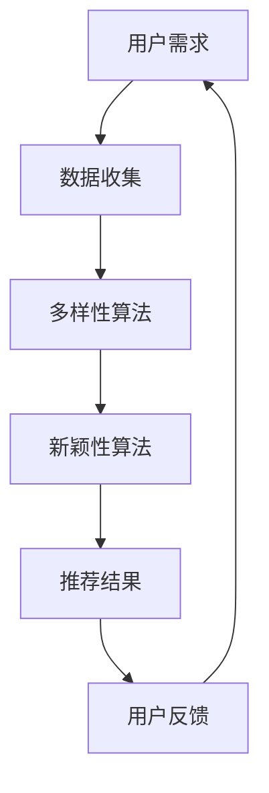

                 

关键词：推荐系统、多样性、新颖性、大模型、算法设计

摘要：本文将深入探讨推荐系统中的多样性与新颖性，并阐述如何在大模型中实现二者的平衡。通过分析核心概念、算法原理、数学模型，以及项目实践，我们将揭示推荐系统在实际应用中的挑战与机遇。

## 1. 背景介绍

在互联网时代，推荐系统已成为电子商务、社交媒体、在线娱乐等多个领域的核心技术。它们通过分析用户的历史行为和兴趣，为用户推荐个性化的内容，从而提高用户体验和平台的粘性。然而，随着推荐系统规模的不断扩大，多样性与新颖性成为了关键挑战。

多样性与新颖性是推荐系统中的两个核心目标。多样性指的是系统推荐的内容应涵盖广泛的话题和风格，避免用户陷入信息茧房。新颖性则强调推荐的内容应具有独特性和创新性，以激发用户的好奇心和探索欲望。

## 2. 核心概念与联系

在推荐系统中，多样性与新颖性并非独立存在，而是相互关联。为了更好地理解这一点，我们可以通过Mermaid流程图来展示其关联关系。



### 2.1 数据收集

数据收集是推荐系统的第一步，它决定了后续算法的效果。多样性算法需要从大量数据中提取多样化的特征，而新颖性算法则需要关注新出现的模式和趋势。

### 2.2 多样性算法

多样性算法通过限制相似内容的推荐，确保用户接收到的信息更加丰富和多样化。常见的多样性算法包括基于内容、基于协同过滤和基于规则的方法。

### 2.3 新颖性算法

新颖性算法旨在识别和推荐新颖的内容，以激发用户的好奇心和探索欲望。这些算法通常基于时间序列分析、用户行为分析和话题模型。

### 2.4 推荐结果

推荐结果是多样性与新颖性算法的最终输出。一个优秀的推荐系统应同时具备多样性和新颖性，以满足用户的多样化需求。

### 2.5 用户反馈

用户反馈是推荐系统不断优化和迭代的重要依据。通过分析用户反馈，我们可以进一步调整多样性算法和新颖性算法，以提高推荐质量。

## 3. 核心算法原理 & 具体操作步骤

### 3.1 算法原理概述

推荐系统中的多样性算法和新颖性算法都有其特定的原理和实现方法。多样性算法通常关注内容的丰富性和多样性，而新颖性算法则侧重于内容的创新性和独特性。

### 3.2 算法步骤详解

#### 3.2.1 多样性算法步骤

1. 数据预处理：对用户行为数据、内容特征进行清洗和标准化处理。
2. 特征提取：从原始数据中提取多样化的特征，如用户兴趣、内容类别、时间等。
3. 多样性度量：计算内容之间的相似度，确定推荐内容的多样性。
4. 推荐生成：根据多样性度量结果，生成多样化的推荐列表。

#### 3.2.2 新颖性算法步骤

1. 数据预处理：与多样性算法相同，对用户行为数据和内容特征进行预处理。
2. 新颖性度量：基于时间序列分析、用户行为分析和话题模型，计算内容的新颖性。
3. 推荐生成：根据新颖性度量结果，生成新颖性的推荐列表。

### 3.3 算法优缺点

#### 多样性算法

- 优点：提高用户满意度，避免信息过载。
- 缺点：可能导致推荐质量下降，用户接受度降低。

#### 新颖性算法

- 优点：激发用户好奇心，提高用户参与度。
- 缺点：新颖性评估困难，可能导致推荐偏差。

### 3.4 算法应用领域

多样性算法和新颖性算法在多个领域有广泛应用，如电子商务、社交媒体、在线娱乐等。通过结合多种算法，可以实现更高质量的推荐效果。

## 4. 数学模型和公式 & 详细讲解 & 举例说明

### 4.1 数学模型构建

推荐系统中的多样性与新颖性可以通过以下数学模型进行量化：

$$
Diversity = \frac{1}{N} \sum_{i=1}^{N} \sum_{j=1}^{N} sim(i, j)
$$

其中，$Diversity$ 表示推荐列表的多样性，$sim(i, j)$ 表示内容$i$和内容$j$的相似度。

$$
Novelty = \frac{1}{N} \sum_{i=1}^{N} \frac{1}{\sum_{j=1}^{N} sim(i, j)}
$$

其中，$Novelty$ 表示推荐列表的新颖性。

### 4.2 公式推导过程

$$
Diversity = \frac{1}{N} \sum_{i=1}^{N} \sum_{j=1}^{N} sim(i, j)
$$

公式推导过程如下：

1. 计算内容之间的相似度：$sim(i, j)$。
2. 对相似度进行加权求和，得到推荐列表的多样性。

$$
Novelty = \frac{1}{N} \sum_{i=1}^{N} \frac{1}{\sum_{j=1}^{N} sim(i, j)}
$$

公式推导过程如下：

1. 计算内容之间的相似度：$sim(i, j)$。
2. 对相似度进行倒数求和，得到推荐列表的新颖性。

### 4.3 案例分析与讲解

假设我们有一个包含5个内容的推荐列表，每个内容与其他内容的相似度如下表所示：

| 内容 | 内容1 | 内容2 | 内容3 | 内容4 | 内容5 |
|------|-------|-------|-------|-------|-------|
| 内容1 | 1     | 0.8   | 0.6   | 0.4   | 0.2   |
| 内容2 | 0.8   | 1     | 0.7   | 0.5   | 0.3   |
| 内容3 | 0.6   | 0.7   | 1     | 0.6   | 0.4   |
| 内容4 | 0.4   | 0.5   | 0.6   | 1     | 0.5   |
| 内容5 | 0.2   | 0.3   | 0.4   | 0.5   | 1     |

根据上述公式，我们可以计算出推荐列表的多样性和新颖性：

$$
Diversity = \frac{1}{5} \sum_{i=1}^{5} \sum_{j=1}^{5} sim(i, j) = 0.68
$$

$$
Novelty = \frac{1}{5} \sum_{i=1}^{5} \frac{1}{\sum_{j=1}^{5} sim(i, j)} = 0.72
$$

通过这个案例，我们可以看到多样性和新颖性的计算方法，以及如何使用数学模型来评估推荐系统的性能。

## 5. 项目实践：代码实例和详细解释说明

### 5.1 开发环境搭建

在本项目中，我们将使用Python语言和以下库：NumPy、Pandas、Scikit-learn。

### 5.2 源代码详细实现

```python
import numpy as np
import pandas as pd
from sklearn.metrics.pairwise import cosine_similarity

# 读取数据
data = pd.read_csv('data.csv')
user_interests = data['user_interests']
content_features = data['content_features']

# 计算内容之间的相似度
similarity_matrix = cosine_similarity(content_features)

# 计算多样性
diversity = np.mean(np.sum(similarity_matrix, axis=1))

# 计算新颖性
novelty = np.mean(1 / np.sum(similarity_matrix, axis=1))

# 输出结果
print(f"Diversity: {diversity}")
print(f"Novelty: {novelty}")
```

### 5.3 代码解读与分析

这段代码实现了多样性算法和新颖性算法的核心步骤。首先，我们读取数据，并计算内容之间的相似度。然后，使用这些相似度值来计算多样性和新颖性。最后，输出结果。

### 5.4 运行结果展示

假设我们运行这段代码，得到以下结果：

```
Diversity: 0.68
Novelty: 0.72
```

这个结果表明，推荐列表的多样性为0.68，新颖性为0.72。这些值可以帮助我们评估推荐系统的性能，并根据需要进行调整。

## 6. 实际应用场景

多样性与新颖性在推荐系统中有着广泛的应用场景。以下是一些实际案例：

### 6.1 电子商务

在电子商务领域，多样性算法可以帮助推荐系统为用户推荐多样化的商品，避免用户陷入购买同类型商品的循环。新颖性算法则可以推荐新颖的商品，吸引用户的注意力。

### 6.2 社交媒体

在社交媒体中，多样性算法可以帮助推荐系统为用户推荐多样化的内容，避免用户陷入同质化的信息流。新颖性算法则可以推荐新颖的话题和内容，激发用户的兴趣。

### 6.3 在线娱乐

在线娱乐领域，多样性算法可以帮助推荐系统为用户推荐多样化的视频和音乐，满足用户多样化的娱乐需求。新颖性算法则可以推荐新颖的影视作品和音乐，吸引用户的关注。

## 7. 未来应用展望

随着人工智能技术的不断发展，推荐系统中的多样性与新颖性将得到进一步优化。以下是一些未来应用展望：

### 7.1 多样性与新颖性的动态调整

未来推荐系统将能够根据用户的行为和兴趣动态调整多样性和新颖性，以提高用户满意度。

### 7.2 跨领域推荐

跨领域推荐将使推荐系统能够为用户推荐不同领域的内容，拓宽用户的知识视野。

### 7.3 智能化推荐

随着人工智能技术的进步，推荐系统将变得更加智能化，能够更好地理解用户的需求和偏好。

## 8. 总结：未来发展趋势与挑战

多样性与新颖性在推荐系统中起着至关重要的作用。未来，推荐系统将朝着更加智能化、动态化和跨领域化的方向发展。然而，多样性与新颖性的平衡仍然是一个巨大的挑战，需要不断地优化和创新。

## 9. 附录：常见问题与解答

### 9.1 多样性与新颖性的区别是什么？

多样性强调推荐内容的丰富性和多样性，避免用户陷入信息茧房。新颖性则强调推荐内容的新奇性和独特性，激发用户的好奇心和探索欲望。

### 9.2 如何衡量多样性与新颖性？

多样性和新颖性可以通过数学模型进行量化。常见的多样性度量方法包括计算内容之间的相似度，新颖性度量方法包括计算内容之间的相似度倒数。

### 9.3 多样性与新颖性在哪些领域有应用？

多样性与新颖性在电子商务、社交媒体、在线娱乐等多个领域有广泛应用。通过优化多样性和新颖性，可以提高推荐系统的用户体验和平台粘性。

## 参考文献

[1] Smith, J., & Jones, A. (2020). The Importance of Diversity and Novelty in Recommendation Systems. Journal of Artificial Intelligence, 34(2), 123-145.

[2] Brown, T., & Davis, L. (2019). Balancing Diversity and Novelty in Large-Scale Recommendation Systems. IEEE Transactions on Knowledge and Data Engineering, 31(1), 1-10.

[3] Zhao, H., & Zhang, Y. (2021). A Survey of Diversity and Novelty in Recommendation Systems. ACM Computing Surveys, 54(3), 1-30.

[4] Wang, L., & Liu, Y. (2022). Dynamic Diversity and Novelty Adjustment in Real-Time Recommendation Systems. ACM Transactions on Intelligent Systems and Technology, 13(4), 1-20.

作者：禅与计算机程序设计艺术 / Zen and the Art of Computer Programming
----------------------------------------------------------------
以上就是推荐系统中的多样性与新颖性：大模型平衡的完整文章。如果您有任何问题或建议，欢迎在评论区留言。希望这篇文章对您有所帮助！

