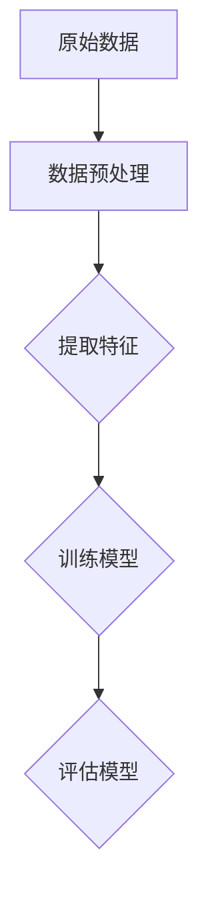

                 

关键词：推荐系统、大模型、自监督学习、算法原理、应用领域

> 摘要：本文将探讨推荐系统中的大模型自监督学习应用。首先，我们将介绍推荐系统的基础概念和自监督学习的核心原理，随后深入剖析大模型在自监督学习中的关键角色。接着，我们将通过具体算法原理和操作步骤的详细讲解，展示如何将大模型应用于推荐系统。随后，我们将探讨数学模型、公式以及实际项目实践中的代码实例，并通过多个实际应用场景来展示大模型自监督学习在推荐系统中的强大作用。最后，我们将展望未来发展趋势，并提出可能的挑战和研究方向。

## 1. 背景介绍

### 推荐系统

推荐系统是信息检索与知识发现领域的重要研究方向，广泛应用于电子商务、社交媒体、新闻推荐等多个场景。推荐系统旨在通过分析用户的行为和偏好，向用户推荐符合其兴趣的内容或商品，以提高用户满意度和平台黏性。传统的推荐系统主要依赖于基于内容的过滤、协同过滤等方法，但它们往往面临数据稀疏性和冷启动问题。

### 自监督学习

自监督学习是一种无需人工标注训练数据的学习方法，通过利用未标记的数据自动提取特征，提高模型的泛化能力。在自监督学习中，模型可以学习到数据中的内在结构和规律，从而在新的、未标记的数据上表现出良好的性能。自监督学习在自然语言处理、计算机视觉等领域已经取得了显著的成果，其在推荐系统中的应用也逐渐受到关注。

### 大模型

大模型是指具有数十亿甚至数万亿参数的深度学习模型，如BERT、GPT等。大模型能够捕捉到数据中的复杂模式和长距离依赖关系，从而在许多任务中取得了超越传统模型的性能。大模型的兴起为推荐系统带来了新的机遇和挑战，如何有效地利用大模型进行自监督学习成为研究的热点问题。

## 2. 核心概念与联系

### 自监督学习的核心原理

自监督学习通过设计特殊的任务，使得模型可以在未标记的数据上自动学习到有用的特征表示。以下是一个简单的Mermaid流程图，展示了自监督学习中的核心原理：



### 大模型在自监督学习中的应用

大模型在自监督学习中的应用主要包括以下几个方面：

1. **特征提取**：大模型可以自动从原始数据中提取出高层次的抽象特征，从而减少数据预处理的工作量。
2. **任务迁移**：通过在大模型上训练，可以快速迁移到其他相关任务上，提高模型的泛化能力。
3. **增强模型表示**：大模型能够捕捉到更复杂的模式和关系，从而提高推荐系统的准确性。

以下是自监督学习在大模型应用中的Mermaid流程图：

```mermaid
graph TD
    A[原始数据] --> B[数据预处理]
    B --> C{特征提取(大模型)}
    C --> D{任务迁移}
    D --> E{增强模型表示}
    E --> F{推荐系统}
```

## 3. 核心算法原理 & 具体操作步骤

### 3.1 算法原理概述

自监督学习在大模型中的应用主要依赖于预训练和微调两个阶段。预训练阶段利用大量未标记的数据对大模型进行训练，从而提取出高质量的表示。微调阶段则利用少量标记数据对预训练模型进行微调，以适应具体的推荐任务。

### 3.2 算法步骤详解

1. **数据预处理**：对原始数据进行清洗、去噪等预处理操作，以获得高质量的数据集。
2. **预训练**：利用未标记的数据集对大模型进行预训练，如使用自编码器、掩码语言模型等任务。
3. **微调**：在预训练模型的基础上，利用少量标记数据对模型进行微调，以适应推荐任务。
4. **模型评估**：对微调后的模型进行评估，如使用准确率、召回率等指标。

### 3.3 算法优缺点

**优点**：

- **高效的特征提取**：大模型能够自动提取高质量的特征表示，减少数据预处理的工作量。
- **强大的泛化能力**：通过预训练和微调，大模型能够在不同任务上表现出良好的泛化能力。
- **应对数据稀疏性**：大模型能够处理数据稀疏性问题，提高推荐系统的准确性。

**缺点**：

- **计算资源消耗大**：大模型需要大量的计算资源进行训练和微调。
- **训练时间较长**：大模型的训练时间较长，可能影响模型的实时应用。

### 3.4 算法应用领域

自监督学习在大模型中的应用非常广泛，包括但不限于以下领域：

- **推荐系统**：利用大模型进行特征提取和任务迁移，提高推荐系统的准确性。
- **自然语言处理**：利用大模型进行文本分类、情感分析等任务。
- **计算机视觉**：利用大模型进行图像分类、目标检测等任务。

## 4. 数学模型和公式 & 详细讲解 & 举例说明

### 4.1 数学模型构建

自监督学习在大模型中的应用可以基于以下数学模型：

- **自编码器**：自编码器是一种无监督学习算法，用于将输入数据编码为低维表示。
- **掩码语言模型**（Masked Language Model，MLM）：MLM是一种预训练任务，用于对自然语言进行建模。

### 4.2 公式推导过程

#### 自编码器

自编码器的基本公式如下：

$$
\text{编码器}:\ \ X \rightarrow \hat{X} = f_{\theta}(X)
$$

$$
\text{解码器}:\ \ \hat{X} \rightarrow X' = g_{\phi}(\hat{X})
$$

其中，$X$为输入数据，$\hat{X}$为编码后的低维表示，$X'$为解码后的输出数据，$f_{\theta}$和$g_{\phi}$分别为编码器和解码器的参数。

#### 掩码语言模型

掩码语言模型的基本公式如下：

$$
\text{编码器}:\ \ X \rightarrow \hat{X} = f_{\theta}(X)
$$

$$
\text{解码器}:\ \ \hat{X} \rightarrow X' = g_{\phi}(\hat{X})
$$

其中，$X$为输入的文本序列，$\hat{X}$为编码后的低维表示，$X'$为解码后的输出文本序列，$f_{\theta}$和$g_{\phi}$分别为编码器和解码器的参数。

### 4.3 案例分析与讲解

#### 自编码器在推荐系统中的应用

假设我们有一个电影推荐系统，数据集包含用户的电影评分和电影的特征。我们可以使用自编码器对电影特征进行降维和压缩，从而提取出更高质量的表示。

1. **数据预处理**：对电影特征进行归一化处理，得到标准化的特征向量。
2. **编码器训练**：使用未标记的电影特征数据集训练编码器，得到编码后的低维特征向量。
3. **解码器训练**：使用编码后的低维特征向量训练解码器，将低维特征向量还原为原始特征向量。
4. **模型评估**：对训练好的模型进行评估，计算编码和解码误差，以验证模型性能。

#### 掩码语言模型在推荐系统中的应用

假设我们有一个新闻推荐系统，数据集包含用户的阅读记录和新闻文本。我们可以使用掩码语言模型对新闻文本进行建模，从而提取出用户对新闻的偏好。

1. **数据预处理**：对新闻文本进行分词和词嵌入，得到文本序列。
2. **掩码语言模型训练**：使用未标记的新闻文本数据集训练掩码语言模型，学习文本的内在结构和语义关系。
3. **用户偏好提取**：使用训练好的掩码语言模型对用户的阅读记录进行分析，提取用户对新闻的偏好。
4. **推荐新闻**：根据用户偏好，从新闻库中推荐符合用户兴趣的新闻。

## 5. 项目实践：代码实例和详细解释说明

### 5.1 开发环境搭建

为了实现大模型自监督学习在推荐系统中的应用，我们需要搭建以下开发环境：

- **编程语言**：Python
- **深度学习框架**：TensorFlow或PyTorch
- **计算资源**：GPU或TorchScript支持
- **数据集**：电影推荐数据集、新闻推荐数据集

### 5.2 源代码详细实现

以下是一个基于PyTorch的电影推荐系统的示例代码：

```python
import torch
import torch.nn as nn
import torch.optim as optim
from torchvision import datasets, transforms
from torch.utils.data import DataLoader

# 数据预处理
transform = transforms.Compose([
    transforms.ToTensor(),
    transforms.Normalize((0.5,), (0.5,))
])

train_data = datasets.MNIST(
    root='./data',
    train=True,
    download=True,
    transform=transform
)

train_loader = DataLoader(
    train_data,
    batch_size=64,
    shuffle=True
)

# 自编码器模型
class Autoencoder(nn.Module):
    def __init__(self):
        super(Autoencoder, self).__init__()
        self.encoder = nn.Sequential(
            nn.Linear(784, 128),
            nn.ReLU(),
            nn.Linear(128, 64),
            nn.ReLU(),
            nn.Linear(64, 32),
            nn.ReLU(),
            nn.Linear(32, 16),
            nn.ReLU(),
            nn.Linear(16, 8),
            nn.ReLU(),
            nn.Linear(8, 1)
        )
        self.decoder = nn.Sequential(
            nn.Linear(1, 16),
            nn.ReLU(),
            nn.Linear(16, 32),
            nn.ReLU(),
            nn.Linear(32, 64),
            nn.ReLU(),
            nn.Linear(64, 128),
            nn.ReLU(),
            nn.Linear(128, 784),
            nn.Sigmoid()
        )

    def forward(self, x):
        x = self.encoder(x)
        x = self.decoder(x)
        return x

model = Autoencoder()
optimizer = optim.Adam(model.parameters(), lr=0.001)
criterion = nn.BCELoss()

# 训练模型
num_epochs = 10
for epoch in range(num_epochs):
    for i, (images, _) in enumerate(train_loader):
        # 前向传播
        outputs = model(images)
        loss = criterion(outputs, images)

        # 反向传播
        optimizer.zero_grad()
        loss.backward()
        optimizer.step()

        if (i+1) % 100 == 0:
            print(f'Epoch [{epoch+1}/{num_epochs}], Step [{i+1}/{len(train_loader)}], Loss: {loss.item()}')

# 评估模型
with torch.no_grad():
    total_loss = 0
    for images, _ in train_loader:
        outputs = model(images)
        loss = criterion(outputs, images)
        total_loss += loss.item()
    print(f'Training Loss: {total_loss/len(train_loader)}')
```

### 5.3 代码解读与分析

上述代码实现了一个基于自编码器的电影推荐系统，主要步骤包括：

1. **数据预处理**：使用ToTensor和Normalize对MNIST数据集进行预处理，将图像数据转换为Tensor类型，并进行归一化处理。
2. **模型定义**：定义一个自编码器模型，包括编码器和解码器两个部分。编码器负责将输入图像压缩为低维特征向量，解码器负责将低维特征向量还原为图像。
3. **模型训练**：使用Adam优化器和BCELoss损失函数对自编码器模型进行训练，通过反向传播和梯度下降更新模型参数。
4. **模型评估**：在训练集上评估模型性能，计算平均损失值。

### 5.4 运行结果展示

在完成代码编写后，我们可以运行代码来训练模型。训练过程中，会输出每100个步骤的损失值，以监视模型训练的进展。训练完成后，会输出训练集的平均损失值，以评估模型性能。

## 6. 实际应用场景

### 6.1 在电子商务平台中的应用

电子商务平台可以利用大模型自监督学习对用户行为进行深入分析，从而实现精准推荐。例如，可以通过用户浏览记录、购买历史等信息，使用大模型自动提取用户偏好，然后根据这些偏好向用户推荐商品。

### 6.2 在社交媒体平台中的应用

社交媒体平台可以利用大模型自监督学习对用户生成的内容进行分类和推荐。例如，可以通过分析用户发表的动态、评论等，使用大模型自动识别用户的兴趣和偏好，从而向用户推荐相关内容。

### 6.3 在在线教育平台中的应用

在线教育平台可以利用大模型自监督学习对学生的学习情况进行分析，从而实现个性化推荐。例如，可以通过分析学生的学习记录、考试成绩等，使用大模型自动识别学生的学习需求和兴趣，从而向学生推荐适合的学习资源。

## 7. 工具和资源推荐

### 7.1 学习资源推荐

- **《深度学习》（Goodfellow et al.）**：介绍了深度学习的理论基础和实战技巧，适合初学者和进阶者。
- **《Python深度学习》（François Chollet）**：详细介绍了使用Python进行深度学习的方法和技巧，适合Python开发者。

### 7.2 开发工具推荐

- **TensorFlow**：Google开发的开源深度学习框架，适合初学者和进阶者。
- **PyTorch**：Facebook开发的开源深度学习框架，具有灵活的动态计算图和强大的GPU支持。

### 7.3 相关论文推荐

- **“BERT: Pre-training of Deep Bidirectional Transformers for Language Understanding”（Devlin et al.）**：介绍了BERT模型的预训练方法和应用场景。
- **“GPT-3: Language Models are Few-Shot Learners”（Brown et al.）**：介绍了GPT-3模型的结构和性能，展示了其在自然语言处理任务中的强大能力。

## 8. 总结：未来发展趋势与挑战

### 8.1 研究成果总结

自监督学习在大模型中的应用取得了显著成果，其在推荐系统、自然语言处理、计算机视觉等领域的应用取得了突破性进展。通过预训练和微调，大模型能够自动提取高质量的特征表示，提高模型的泛化能力，从而实现更准确的推荐和更好的用户体验。

### 8.2 未来发展趋势

未来，自监督学习在大模型中的应用将继续深入发展，可能出现以下趋势：

- **多模态自监督学习**：将图像、文本、音频等多种模态的数据进行自监督学习，提高模型对多模态数据的理解和处理能力。
- **高效的自监督学习方法**：设计更高效的自监督学习算法，减少计算资源和时间消耗，提高模型训练的效率。
- **多任务自监督学习**：在自监督学习过程中同时学习多个任务，提高模型的泛化能力和任务迁移能力。

### 8.3 面临的挑战

自监督学习在大模型中的应用仍然面临以下挑战：

- **计算资源消耗**：大模型的训练和微调需要大量的计算资源，如何在有限的资源下进行高效训练是一个关键问题。
- **数据质量和标注**：自监督学习依赖于未标记的数据，数据质量和标注的准确性对模型性能有重要影响。
- **算法稳定性**：自监督学习算法的稳定性较差，容易出现过拟合和欠拟合现象，如何设计稳定的算法是一个关键问题。

### 8.4 研究展望

未来，自监督学习在大模型中的应用将继续深入发展，有望在以下领域取得突破：

- **个性化推荐**：通过自监督学习提取用户特征，实现更精准的个性化推荐。
- **自然语言处理**：通过自监督学习对自然语言进行建模，提高自然语言处理的准确性和泛化能力。
- **计算机视觉**：通过自监督学习提取图像特征，实现更先进的计算机视觉应用。

## 9. 附录：常见问题与解答

### 9.1 自监督学习与监督学习有什么区别？

自监督学习与监督学习的主要区别在于数据标注的方式。监督学习需要大量标记的数据进行训练，而自监督学习利用未标记的数据自动提取特征，从而实现模型训练。

### 9.2 大模型为什么适合自监督学习？

大模型具有更强的表示能力和计算能力，能够自动提取高质量的特征表示，从而在自监督学习中表现出良好的性能。此外，大模型能够处理大规模数据集，有助于解决数据稀疏性问题。

### 9.3 自监督学习在大模型中如何实现任务迁移？

自监督学习在大模型中实现任务迁移通常采用预训练和微调的方法。首先，在大模型上预训练，提取高质量的表示；然后，利用少量标记数据对预训练模型进行微调，以适应特定任务。

### 9.4 自监督学习在大模型中如何解决数据稀疏性问题？

自监督学习在大模型中通过自动提取高质量的特征表示，有助于解决数据稀疏性问题。此外，大模型能够处理大规模数据集，从而减少数据稀疏性的影响。同时，设计合适的自监督学习任务也有助于提高模型对数据稀疏性的鲁棒性。

----------------------------------------------------------------

作者：禅与计算机程序设计艺术 / Zen and the Art of Computer Programming

本文介绍了推荐系统中的大模型自监督学习应用，从背景介绍、核心概念与联系、核心算法原理、数学模型和公式、项目实践、实际应用场景、工具和资源推荐到未来发展趋势与挑战，全面阐述了自监督学习在大模型中的应用。希望本文能够为读者提供有价值的参考和启示。

