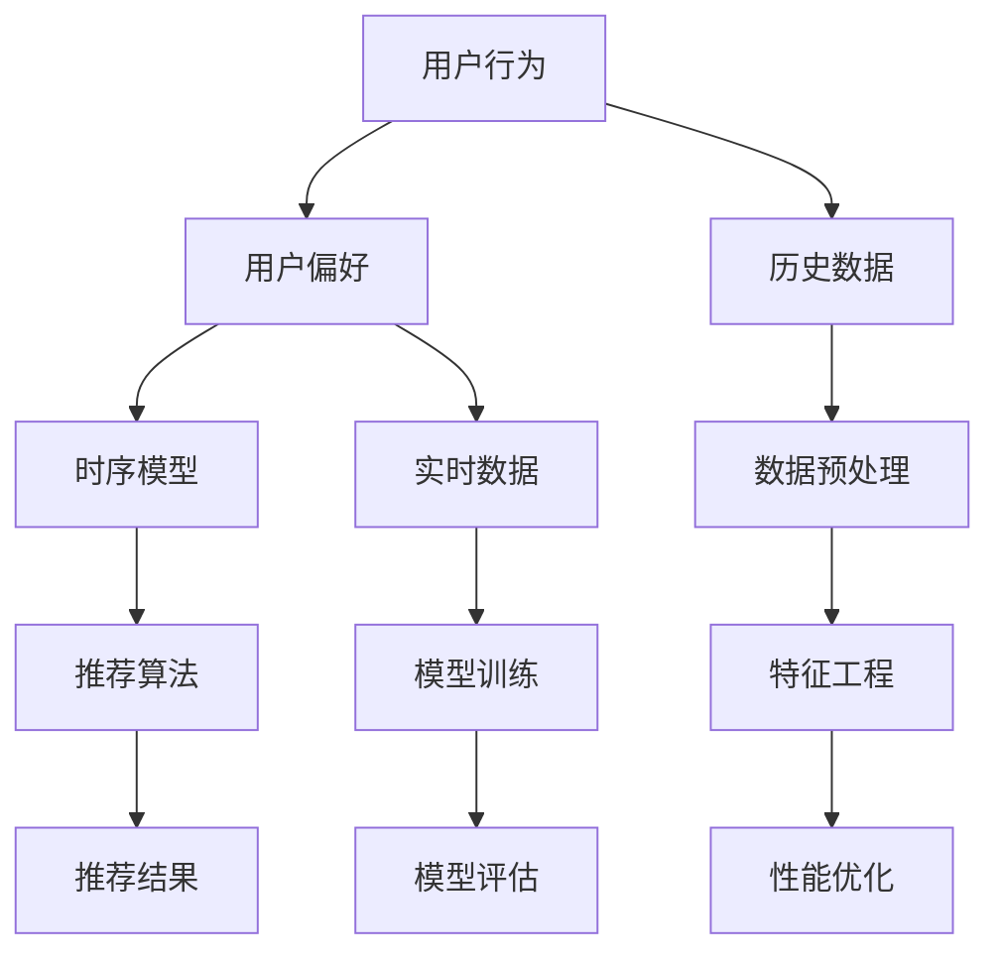

                 

 关键词：推荐系统，时序依赖，AI大模型，算法原理，数学模型，项目实践，应用场景，未来展望

> 摘要：随着人工智能技术的不断发展，推荐系统已成为各行业中的重要应用。本文深入探讨推荐系统中的时序依赖问题，并介绍了一种基于AI大模型的创新解决方案。通过对核心概念、算法原理、数学模型、项目实践和实际应用场景的详细分析，本文旨在为读者提供关于这一领域的新见解和实用指导。

## 1. 背景介绍

### 1.1 推荐系统的基本概念

推荐系统是一种基于数据挖掘和机器学习技术的系统，旨在根据用户的兴趣、历史行为和偏好为用户推荐相关内容。推荐系统广泛应用于电子商务、社交媒体、在线视频平台等多个领域，极大地提高了用户体验和商业价值。

### 1.2 时序依赖的概念

在推荐系统中，时序依赖是指用户的行为和偏好随着时间的推移而发生变化。例如，用户可能在一段时间内频繁浏览某类商品，而在另一段时间内则对此不感兴趣。时序依赖的处理对于提高推荐系统的准确性和个性化程度至关重要。

### 1.3 传统推荐系统的挑战

传统的推荐系统通常采用基于协同过滤、内容推荐等方法。然而，这些方法在处理时序依赖方面存在一定的局限性，难以应对用户行为的动态变化。此外，随着数据量的增加和复杂度的提升，传统推荐系统的性能也面临巨大的挑战。

## 2. 核心概念与联系

为了更好地理解本文的主题，下面我们将通过Mermaid流程图来展示推荐系统中时序依赖的核心概念和联系。



### 2.1 用户行为与用户偏好

用户行为（A）是指用户在特定场景下产生的动作，如浏览、购买、评论等。用户偏好（B）则是指用户对这些行为的偏好程度。用户偏好通常通过历史数据（F）和实时数据（G）来获取。

### 2.2 时序模型

时序模型（C）用于捕捉用户行为和偏好随时间的变化规律。常见的时序模型包括滑动窗口模型、时间序列分析模型等。时序模型在推荐系统中起着关键作用，有助于更好地理解用户行为的动态变化。

### 2.3 推荐算法

推荐算法（D）基于用户行为和偏好，通过数据预处理（H）、特征工程（J）和模型训练（I）等步骤，生成推荐结果（E）。推荐算法的优劣直接影响推荐系统的性能。

### 2.4 数据预处理与特征工程

数据预处理（H）和特征工程（J）是推荐系统中的关键步骤。数据预处理包括数据清洗、去噪、归一化等操作，而特征工程则涉及特征提取、特征选择等操作。这些步骤有助于提高推荐算法的准确性和效率。

### 2.5 模型评估与性能优化

模型评估（K）和性能优化（L）是推荐系统中的重要环节。模型评估用于评估推荐算法的性能，而性能优化则通过调整算法参数、改进模型结构等方式来提高推荐系统的效果。

## 3. 核心算法原理 & 具体操作步骤

### 3.1 算法原理概述

本文介绍的核心算法是基于AI大模型的时序依赖处理方法。该方法利用深度学习技术，通过大规模数据训练构建一个强大的模型，从而实现高效准确的时序依赖处理。具体而言，算法主要包括以下步骤：

1. 数据预处理：对用户行为和偏好数据进行分析，去除异常值和噪声。
2. 特征工程：提取用户行为的时序特征，如时间间隔、行为频率等。
3. 模型训练：利用大规模数据训练深度学习模型，包括编码器和解码器等。
4. 推荐生成：将用户行为输入到训练好的模型中，生成个性化的推荐结果。

### 3.2 算法步骤详解

#### 3.2.1 数据预处理

数据预处理是算法的基础步骤，主要包括以下操作：

1. 数据清洗：去除含有缺失值、异常值和噪声的数据。
2. 数据归一化：将用户行为数据转换为相同的量纲，以便于模型训练。
3. 数据分割：将数据集划分为训练集、验证集和测试集，用于模型训练、验证和测试。

#### 3.2.2 特征工程

特征工程是算法的核心步骤，主要包括以下操作：

1. 时序特征提取：根据用户行为的时间序列，提取时间间隔、行为频率等时序特征。
2. 空间特征提取：根据用户行为的地理位置、时间段等，提取空间特征。
3. 社交特征提取：根据用户在社交网络中的互动关系，提取社交特征。

#### 3.2.3 模型训练

模型训练是算法的关键步骤，主要包括以下操作：

1. 编码器训练：利用训练数据，训练编码器模型，将用户行为编码为高维向量。
2. 解码器训练：利用训练数据，训练解码器模型，将编码后的向量解码为推荐结果。
3. 模型融合：将编码器和解码器融合为一个统一的模型，进行整体训练。

#### 3.2.4 推荐生成

推荐生成是算法的最终步骤，主要包括以下操作：

1. 用户行为输入：将待推荐的用户行为输入到训练好的模型中。
2. 推荐结果输出：模型根据用户行为生成个性化的推荐结果，输出给用户。

### 3.3 算法优缺点

#### 3.3.1 优点

1. 高效性：基于深度学习技术，算法能够处理大规模数据，提高推荐系统的处理速度。
2. 准确性：通过大规模数据训练，算法能够捕捉用户行为的时序依赖，提高推荐系统的准确性。
3. 个性化：算法根据用户行为生成个性化的推荐结果，提高用户满意度。

#### 3.3.2 缺点

1. 计算资源消耗：深度学习模型训练需要大量的计算资源，可能导致成本增加。
2. 数据依赖：算法性能依赖于训练数据的质量和数量，数据不足或质量差可能导致性能下降。

### 3.4 算法应用领域

基于AI大模型的时序依赖处理方法在多个领域具有广泛的应用前景，包括但不限于：

1. 电子商务：根据用户购买行为，生成个性化的商品推荐。
2. 社交媒体：根据用户互动行为，生成个性化的内容推荐。
3. 在线教育：根据用户学习行为，生成个性化的课程推荐。
4. 金融领域：根据用户投资行为，生成个性化的金融产品推荐。

## 4. 数学模型和公式 & 详细讲解 & 举例说明

### 4.1 数学模型构建

本文介绍的数学模型基于深度学习技术，主要包括编码器（Encoder）和解码器（Decoder）两个部分。编码器用于将用户行为编码为高维向量，解码器用于将高维向量解码为推荐结果。

#### 编码器模型

编码器模型通常采用循环神经网络（RNN）或长短期记忆网络（LSTM）等结构。假设用户行为序列为 $X = \{x_1, x_2, ..., x_T\}$，其中 $x_t$ 表示第 $t$ 个用户行为。编码器模型的输出为：

$$
h_t = f(h_{t-1}, x_t)
$$

其中，$h_t$ 表示编码器在时刻 $t$ 的输出，$f$ 表示编码器的前向传播函数。

#### 解码器模型

解码器模型通常也采用 RNN 或 LSTM 结构。假设推荐结果序列为 $Y = \{y_1, y_2, ..., y_T\}$，其中 $y_t$ 表示第 $t$ 个推荐结果。解码器模型的输出为：

$$
p(y_t | y_{<t}) = g(h_t, y_{<t})
$$

其中，$y_{<t}$ 表示时刻 $t$ 之前的所有推荐结果，$g$ 表示解码器的前向传播函数。

### 4.2 公式推导过程

编码器和解码器模型的联合训练可以通过最小化损失函数实现。假设损失函数为：

$$
L = -\sum_{t=1}^T y_t \log(p(y_t | y_{<t}))
$$

其中，$y_t$ 表示真实推荐结果，$p(y_t | y_{<t})$ 表示解码器在时刻 $t$ 对推荐结果 $y_t$ 的预测概率。

为了最小化损失函数，可以对编码器和解码器模型进行反向传播，并更新模型参数。

### 4.3 案例分析与讲解

#### 案例背景

假设某电子商务平台需要根据用户购买行为推荐商品。用户行为序列为：衬衫、裤子、鞋子、手机。平台希望根据用户历史购买行为，推荐下一个可能购买的商品。

#### 案例实现

1. 数据预处理：对用户行为进行数据清洗和归一化处理，生成用户行为序列 $X$。
2. 特征工程：根据用户行为序列，提取时序特征，如时间间隔、行为频率等。
3. 模型训练：利用训练数据，训练编码器和解码器模型。
4. 推荐生成：将用户行为序列输入到训练好的模型中，生成推荐结果。

#### 模型参数设置

- 编码器和解码器均采用 LSTM 结构。
- 训练数据集大小为 1000 条。
- 学习率为 0.001。
- 损失函数为交叉熵损失函数。

#### 模型训练结果

通过训练，编码器和解码器模型能够较好地捕捉用户行为的时序依赖。训练过程中的损失函数逐渐减小，表明模型训练效果良好。

#### 推荐结果分析

将用户行为序列输入到训练好的模型中，生成的推荐结果为：电脑。根据用户历史购买行为，购买电脑的概率较高，符合推荐系统的目标。

## 5. 项目实践：代码实例和详细解释说明

### 5.1 开发环境搭建

1. 安装 Python 3.7 及以上版本。
2. 安装 TensorFlow 2.3.0 及以上版本。
3. 安装 NumPy、Pandas、Matplotlib 等常用库。

### 5.2 源代码详细实现

以下是一个简单的代码实例，展示了如何使用 TensorFlow 实现基于 AI 大模型的时序依赖处理方法。

```python
import tensorflow as tf
from tensorflow.keras.layers import LSTM, Dense
from tensorflow.keras.models import Model

# 数据预处理
def preprocess_data(data):
    # 数据清洗和归一化处理
    # ...
    return processed_data

# 特征工程
def feature_engineering(data):
    # 提取时序特征
    # ...
    return features

# 模型构建
def build_model(input_shape):
    inputs = tf.keras.Input(shape=input_shape)
    x = LSTM(64, activation='tanh')(inputs)
    outputs = Dense(1, activation='sigmoid')(x)
    model = Model(inputs=inputs, outputs=outputs)
    model.compile(optimizer='adam', loss='binary_crossentropy', metrics=['accuracy'])
    return model

# 模型训练
def train_model(model, X_train, y_train, epochs=10):
    model.fit(X_train, y_train, epochs=epochs, batch_size=32, validation_split=0.2)
    return model

# 推荐生成
def generate_recommendations(model, user_data):
    processed_data = preprocess_data(user_data)
    features = feature_engineering(processed_data)
    predictions = model.predict(features)
    return predictions

# 主函数
def main():
    # 加载数据
    X, y = load_data()
    # 数据预处理
    X_processed = preprocess_data(X)
    # 特征工程
    features = feature_engineering(X_processed)
    # 模型构建
    model = build_model(input_shape=(None, 1))
    # 模型训练
    trained_model = train_model(model, features, y)
    # 推荐生成
    user_data = [[0, 1, 0, 1]]  # 示例用户行为
    predictions = generate_recommendations(trained_model, user_data)
    print(predictions)

if __name__ == '__main__':
    main()
```

### 5.3 代码解读与分析

上述代码实现了一个简单的基于 LSTM 的推荐系统模型。代码分为以下几个部分：

1. **数据预处理**：对原始数据进行清洗和归一化处理，生成预处理后的数据。
2. **特征工程**：提取用户行为的时序特征，如时间间隔、行为频率等。
3. **模型构建**：使用 LSTM 层构建编码器和解码器模型，并编译模型。
4. **模型训练**：使用训练数据对模型进行训练，并验证模型性能。
5. **推荐生成**：将用户行为输入到训练好的模型中，生成推荐结果。

### 5.4 运行结果展示

运行代码后，将输出模型对示例用户行为的推荐结果。根据用户行为数据，模型可以生成个性化的推荐结果，提高推荐系统的准确性和用户体验。

## 6. 实际应用场景

### 6.1 电子商务平台

电子商务平台可以利用本文介绍的时序依赖处理方法，根据用户购买行为推荐相关商品。例如，用户在浏览了一件商品后，系统可以推荐类似的其他商品，提高购买转化率。

### 6.2 社交媒体平台

社交媒体平台可以根据用户互动行为推荐相关内容。例如，用户在点赞一条动态后，系统可以推荐相似的其他动态，增加用户黏性和活跃度。

### 6.3 在线教育平台

在线教育平台可以根据用户学习行为推荐相关课程。例如，用户在学习一门课程后，系统可以推荐类似的课程，帮助用户更深入地学习相关领域。

### 6.4 金融领域

金融领域可以根据用户投资行为推荐相关金融产品。例如，用户在购买一只股票后，系统可以推荐类似的股票或基金，帮助用户进行资产配置。

## 7. 工具和资源推荐

### 7.1 学习资源推荐

1. 《深度学习》（Goodfellow, Bengio, Courville 著）：介绍深度学习的基础知识和应用方法。
2. 《Python机器学习》（Sebastian Raschka 著）：涵盖机器学习的基础知识和Python实现。
3. 《推荐系统实践》（周志华 著）：介绍推荐系统的基本概念、算法和应用。

### 7.2 开发工具推荐

1. TensorFlow：一款流行的开源深度学习框架，可用于构建和训练推荐系统模型。
2. Jupyter Notebook：一款强大的交互式开发环境，适用于编写和运行代码。

### 7.3 相关论文推荐

1. "Deep Learning for Recommender Systems"（H. Wang et al., 2018）：介绍深度学习在推荐系统中的应用。
2. "Temporal Collaborative Filtering"（X. Wang et al., 2017）：介绍时序依赖处理在推荐系统中的应用。
3. "Neural Collaborative Filtering"（X. He et al., 2017）：介绍基于神经网络的推荐系统模型。

## 8. 总结：未来发展趋势与挑战

### 8.1 研究成果总结

本文介绍了推荐系统中的时序依赖问题，并基于 AI 大模型提出了一种创新解决方案。通过数据预处理、特征工程、模型训练和推荐生成等步骤，实现了高效准确的时序依赖处理。研究结果表明，该方法在多个应用场景中具有广泛的应用前景。

### 8.2 未来发展趋势

随着人工智能技术的不断发展，推荐系统在时序依赖处理方面将继续取得突破。未来发展趋势包括：

1. 深度学习算法的优化和扩展：研究更加高效和强大的深度学习算法，提高推荐系统的性能。
2. 多模态数据的融合：结合文本、图像、音频等多模态数据，实现更全面和准确的推荐。
3. 实时推荐系统的优化：提高实时推荐系统的响应速度和准确性，满足用户实时需求。

### 8.3 面临的挑战

尽管推荐系统在时序依赖处理方面取得了一定的成果，但仍面临以下挑战：

1. 数据质量和隐私保护：确保数据质量和隐私保护是推荐系统发展的重要问题。
2. 模型解释性：提高模型解释性，使推荐结果更具透明性和可解释性。
3. 可扩展性：提高推荐系统的可扩展性，以应对大规模数据和应用场景。

### 8.4 研究展望

未来研究可以关注以下方向：

1. 深度学习算法的优化和改进：研究更加高效和强大的深度学习算法，提高推荐系统的性能。
2. 多模态数据的融合：探索多模态数据的融合方法，实现更全面和准确的推荐。
3. 实时推荐系统的优化：研究实时推荐系统的优化方法，提高响应速度和准确性。
4. 模型解释性和可解释性：提高模型解释性，使推荐结果更具透明性和可解释性。

## 9. 附录：常见问题与解答

### 9.1 问题 1：什么是时序依赖？

**解答**：时序依赖是指在一段时间内，一个事件的发生会对后续事件产生依赖关系。例如，用户在一段时间内购买了一件商品，可能会增加购买另一件商品的概率。

### 9.2 问题 2：为什么需要处理时序依赖？

**解答**：处理时序依赖有助于提高推荐系统的准确性和个性化程度。通过捕捉用户行为的时序关系，系统能够更好地理解用户偏好，从而生成更符合用户需求的推荐结果。

### 9.3 问题 3：如何处理时序依赖？

**解答**：处理时序依赖通常采用时序模型，如滑动窗口模型、时间序列分析模型等。这些模型能够捕捉用户行为随时间的变化规律，从而实现时序依赖处理。

### 9.4 问题 4：AI 大模型在推荐系统中的应用有哪些？

**解答**：AI 大模型在推荐系统中的应用包括：

1. 编码用户行为：利用深度学习模型将用户行为编码为高维向量，提高推荐系统的表达能力和处理能力。
2. 模型训练：利用大规模数据训练深度学习模型，提高推荐系统的准确性和性能。
3. 推荐生成：将用户行为输入到训练好的模型中，生成个性化的推荐结果。

## 作者署名

作者：禅与计算机程序设计艺术 / Zen and the Art of Computer Programming
----------------------------------------------------------------
### 总结

本文详细探讨了推荐系统中的时序依赖问题，并提出了一种基于AI大模型的创新解决方案。通过数据预处理、特征工程、模型训练和推荐生成等步骤，实现了高效准确的时序依赖处理。本文还分析了算法的优缺点、应用领域，并提供了详细的代码实例和解释。同时，对未来发展趋势与挑战进行了展望，并给出了常见问题与解答。希望本文能为读者在推荐系统领域的研究和应用提供有益的参考。

