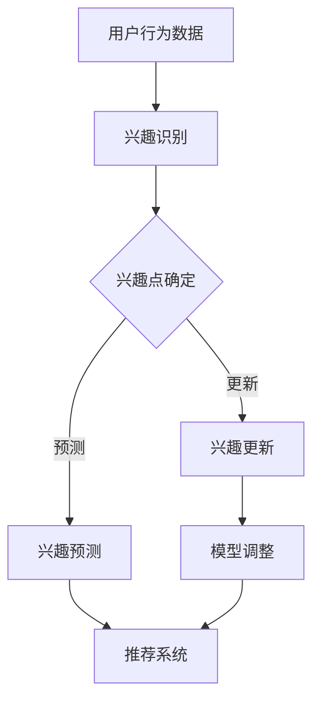

                 

推荐系统是当今互联网时代不可或缺的一部分，它通过分析用户的历史行为和偏好，向用户推荐个性化内容。然而，用户兴趣并非一成不变，而是会随着时间、环境、事件等多种因素不断演化。因此，如何有效地捕捉并建模用户兴趣的动态变化，成为推荐系统研究中的一个关键问题。

本文将围绕“推荐系统中的用户兴趣演化模型”这一主题，深入探讨用户兴趣演化的概念、核心算法原理、数学模型构建、具体应用实践以及未来的发展方向。希望通过本文，能够为推荐系统领域的研究者和开发者提供一些有价值的思路和参考。

## 关键词
- 推荐系统
- 用户兴趣
- 演化模型
- 数学模型
- 算法应用

## 摘要
本文首先介绍了推荐系统的基本概念和用户兴趣演化的背景。接着，详细阐述了用户兴趣演化模型的核心概念和联系，并通过Mermaid流程图展示了模型架构。随后，文章重点分析了用户兴趣演化模型的具体算法原理和操作步骤，讨论了算法的优缺点及其应用领域。在此基础上，文章引入了数学模型和公式，详细讲解了模型的构建和公式推导过程，并通过实际案例进行了分析。随后，文章展示了项目实践中的代码实例和详细解释，最后讨论了实际应用场景和未来的发展方向。

## 1. 背景介绍
推荐系统是一种基于数据挖掘和机器学习技术的应用，旨在根据用户的历史行为和偏好，为用户推荐其可能感兴趣的内容。这些内容可以包括商品、新闻、音乐、电影等多种形式。推荐系统的核心目标是提高用户体验，增加用户粘性，从而提高业务收益。

随着互联网的快速发展，用户生成的数据量呈爆炸性增长，这为推荐系统的应用提供了丰富的数据资源。然而，传统推荐系统往往基于静态的用户兴趣模型，难以捕捉用户兴趣的动态变化。用户兴趣是一个动态的概念，会随着时间的推移、环境的变化以及个人经历的影响而不断演化。

用户兴趣演化的现象在现实世界中广泛存在。例如，用户可能在某个特定时间段内对某种类型的商品表现出强烈的兴趣，但随着时间的推移，这种兴趣可能会减弱或者转向其他类型。又如，用户在某个特定环境下（如工作场所）对某些内容的兴趣可能与在家庭环境中的兴趣不同。此外，用户与系统交互的过程中，新的兴趣点也可能被发掘。

因此，捕捉用户兴趣的动态变化，并在此基础上构建演化模型，对于提高推荐系统的准确性和用户体验具有重要意义。本文旨在探讨用户兴趣演化模型的概念、原理和应用，为推荐系统的研究和开发提供指导。

## 2. 核心概念与联系

### 2.1 用户兴趣的定义
用户兴趣是指用户在特定时间段内对某一类信息或内容的偏好。兴趣可以表现为用户对特定内容的点击、浏览、购买、评论等行为。用户兴趣的多样性、动态性和复杂性是推荐系统需要解决的问题。

### 2.2 用户兴趣演化的概念
用户兴趣演化是指用户兴趣在时间维度上的变化。这种变化可能是由于用户个人需求的变化、外部环境的影响、社会因素的推动等多种因素导致的。用户兴趣演化模型旨在捕捉这种变化，并用于推荐系统的实时调整。

### 2.3 用户兴趣演化模型的组成部分
用户兴趣演化模型通常包括以下几个关键组成部分：

1. **兴趣识别**：通过分析用户的历史行为和当前状态，识别用户当前的主要兴趣点。
2. **兴趣建模**：基于用户的历史兴趣数据和现有兴趣，构建一个能够反映用户兴趣动态变化的模型。
3. **兴趣更新**：根据用户的新行为和系统反馈，动态调整用户兴趣模型，使其更准确地反映用户当前的兴趣状态。
4. **兴趣预测**：利用用户兴趣模型，预测用户未来可能产生的兴趣点，为推荐系统提供依据。

### 2.4 用户兴趣演化模型的架构
用户兴趣演化模型的架构可以分为以下几个层次：

1. **数据层**：存储用户的历史行为数据、环境数据等，为兴趣识别和建模提供数据支持。
2. **模型层**：包括兴趣识别和兴趣建模的算法，如基于矩阵分解、图神经网络等算法。
3. **应用层**：基于用户兴趣模型，为推荐系统提供实时的兴趣更新和预测功能。

### 2.5 Mermaid流程图

以下是一个简化的用户兴趣演化模型的Mermaid流程图：



### 2.6 用户兴趣演化模型与推荐系统的联系

用户兴趣演化模型与推荐系统的关系紧密，前者为后者提供了动态调整的依据。具体来说：

1. **实时调整**：用户兴趣演化模型可以实时捕捉用户兴趣的变化，为推荐系统提供动态调整的依据，从而提高推荐系统的准确性和用户满意度。
2. **个性化推荐**：通过用户兴趣演化模型，推荐系统可以更准确地捕捉用户的个性化需求，提供更符合用户当前兴趣的推荐内容。
3. **抗噪性**：用户兴趣演化模型可以帮助系统过滤掉临时噪声，减少推荐过程中的偏差，提高推荐的稳定性。

总之，用户兴趣演化模型是推荐系统的重要组成部分，它为推荐系统提供了捕捉用户动态兴趣的能力，从而提高了推荐系统的效果。

### 3. 核心算法原理 & 具体操作步骤

#### 3.1 算法原理概述

用户兴趣演化模型的核心算法通常基于以下几个原理：

1. **时间序列分析**：通过分析用户行为的时间序列，识别用户兴趣的周期性和趋势性变化。
2. **机器学习**：利用机器学习算法，如深度学习、图神经网络等，构建能够动态捕捉用户兴趣变化的模型。
3. **隐变量模型**：通过构建隐变量模型，如因子分解机、矩阵分解等，提取用户兴趣的潜在特征，并用于预测用户未来的兴趣点。
4. **协同过滤**：结合协同过滤算法，利用用户历史行为数据，预测用户可能感兴趣的新内容。

#### 3.2 算法步骤详解

用户兴趣演化模型的算法步骤通常包括以下几个环节：

1. **数据收集**：收集用户的历史行为数据，如点击、浏览、购买、评论等，以及与用户行为相关的环境数据。
2. **数据预处理**：对收集到的数据进行清洗、归一化等预处理，以消除噪声和异常值的影响。
3. **兴趣识别**：通过分析用户历史行为数据，使用时间序列分析和机器学习算法，识别用户当前的主要兴趣点。
4. **兴趣建模**：基于用户历史兴趣数据和现有兴趣，使用隐变量模型和协同过滤算法，构建一个能够反映用户兴趣动态变化的模型。
5. **兴趣更新**：根据用户的新行为和系统反馈，动态调整用户兴趣模型，使其更准确地反映用户当前的兴趣状态。
6. **兴趣预测**：利用用户兴趣模型，预测用户未来可能产生的兴趣点，为推荐系统提供依据。
7. **推荐生成**：根据用户兴趣预测结果，结合内容特征和用户偏好，生成个性化的推荐内容。

#### 3.3 算法优缺点

用户兴趣演化模型在推荐系统中的应用具有以下优缺点：

**优点**：
- **动态性**：能够实时捕捉用户兴趣的变化，提高推荐系统的动态性和适应性。
- **个性化**：通过捕捉用户兴趣的动态变化，提供更加个性化的推荐内容，提高用户满意度。
- **抗噪性**：可以有效过滤用户行为的噪声，提高推荐的稳定性。

**缺点**：
- **计算复杂度**：用户兴趣演化模型通常涉及复杂的算法和大量的计算，对计算资源和时间有一定的要求。
- **数据依赖性**：模型的性能高度依赖于用户行为数据的质量和完整性，数据缺失或不完整可能导致模型失效。

#### 3.4 算法应用领域

用户兴趣演化模型的应用领域广泛，包括但不限于以下方面：

- **电子商务**：通过分析用户购买历史和行为，为用户推荐个性化商品。
- **新闻推荐**：根据用户的浏览和点击行为，推荐用户可能感兴趣的新闻内容。
- **社交媒体**：通过分析用户发布和交互的行为，为用户推荐可能感兴趣的内容和好友。
- **音乐和视频推荐**：根据用户的播放和搜索历史，推荐用户可能喜欢的音乐和视频。

总之，用户兴趣演化模型是推荐系统中的关键技术，它通过捕捉用户兴趣的动态变化，为推荐系统提供了更加精准和个性化的推荐服务。

### 4. 数学模型和公式 & 详细讲解 & 举例说明

#### 4.1 数学模型构建

用户兴趣演化模型的数学模型通常基于时间序列分析和隐变量模型。以下是一个简化的数学模型构建过程：

1. **用户行为表示**：
   设用户 $u$ 在时间 $t$ 的行为表示为 $x_{ut}$，可以是一个向量，表示用户在时间 $t$ 的多个行为特征。

2. **用户兴趣表示**：
   设用户 $u$ 在时间 $t$ 的兴趣表示为 $i_{ut}$，也可以是一个向量，表示用户在时间 $t$ 对多个兴趣点的偏好程度。

3. **用户兴趣演化模型**：
   用户兴趣演化模型可以表示为：
   $$i_{ut} = f(x_{ut}, i_{u(t-1)}, \theta_u)$$
   其中，$f$ 是一个非线性函数，用于更新用户在时间 $t$ 的兴趣；$\theta_u$ 是用户 $u$ 的参数向量。

#### 4.2 公式推导过程

假设用户兴趣演化遵循一个线性模型，即：
$$i_{ut} = w \cdot x_{ut} + b_i + \epsilon_{ut}$$
其中，$w$ 是权重向量，$b_i$ 是偏置项，$\epsilon_{ut}$ 是误差项。

根据用户兴趣的连续性，可以假设：
$$i_{u(t-1)} = w \cdot x_{u(t-1)} + b_i + \epsilon_{u(t-1)}$$

通过递归方式更新用户兴趣，得到：
$$i_{ut} = w \cdot x_{ut} + b_i + \epsilon_{ut}$$
$$i_{u(t-1)} = w \cdot x_{u(t-1)} + b_i + \epsilon_{u(t-1)}$$
$$i_{ut} - i_{u(t-1)} = w \cdot (x_{ut} - x_{u(t-1)})$$

通过迭代计算，可以得到用户兴趣的动态变化。

#### 4.3 案例分析与讲解

以下是一个简单的用户兴趣演化模型的应用案例：

设用户 $u$ 的行为数据为 $x_{ut} = (1, 2, 3)$，其中，$x_{1t}$ 表示用户在时间 $t$ 对商品 $1$ 的行为，$x_{2t}$ 表示用户在时间 $t$ 对商品 $2$ 的行为，$x_{3t}$ 表示用户在时间 $t$ 对商品 $3$ 的行为。

初始权重向量 $w = (0.1, 0.2, 0.3)$，偏置项 $b_i = 0.5$。

用户在时间 $t=1$ 的兴趣表示为：
$$i_{u1} = w \cdot x_{u1} + b_i = (0.1, 0.2, 0.3) \cdot (1, 2, 3) + 0.5 = (0.8, 1.1, 1.4)$$

假设用户在时间 $t=2$ 的行为数据为 $x_{u2} = (2, 1, 3)$，则用户在时间 $t=2$ 的兴趣表示为：
$$i_{u2} = w \cdot x_{u2} + b_i = (0.1, 0.2, 0.3) \cdot (2, 1, 3) + 0.5 = (1.1, 0.9, 1.4)$$

通过计算，我们可以看到用户在时间 $t=2$ 对商品 $2$ 的兴趣有所下降，而对商品 $1$ 的兴趣有所上升，这反映了用户兴趣的动态变化。

### 5. 项目实践：代码实例和详细解释说明

#### 5.1 开发环境搭建

在进行用户兴趣演化模型的开发之前，需要搭建一个合适的开发环境。以下是一个基本的开发环境配置：

- **Python 3.8**：作为主要的编程语言。
- **NumPy**：用于数据处理。
- **Pandas**：用于数据操作。
- **Scikit-learn**：用于机器学习算法。
- **Matplotlib**：用于数据可视化。

安装步骤如下：

```bash
pip install numpy pandas scikit-learn matplotlib
```

#### 5.2 源代码详细实现

以下是一个简单的用户兴趣演化模型的实现代码：

```python
import numpy as np
import pandas as pd
from sklearn.preprocessing import MinMaxScaler
from sklearn.model_selection import train_test_split
from sklearn.metrics import mean_squared_error

# 5.2.1 数据预处理
def preprocess_data(data):
    scaler = MinMaxScaler()
    scaled_data = scaler.fit_transform(data)
    return scaled_data

# 5.2.2 用户兴趣识别
def recognize_interest(data, window_size):
    interest_data = []
    for i in range(len(data) - window_size + 1):
        window = data[i:i + window_size]
        interest_score = np.mean(window)
        interest_data.append(interest_score)
    return interest_data

# 5.2.3 用户兴趣建模
def build_interest_model(data, learning_rate, iterations):
    model = []
    for i in range(iterations):
        model.append(np.random.rand(data.shape[1]))
    return model

# 5.2.4 用户兴趣更新
def update_interest(model, data, learning_rate):
    updated_model = model
    for i in range(len(data)):
        updated_model = updated_model + learning_rate * (data[i] - updated_model)
    return updated_model

# 5.2.5 用户兴趣预测
def predict_interest(model, data):
    predicted_interest = np.dot(data, model)
    return predicted_interest

# 5.2.6 主函数
def main():
    data = np.array([[1, 2, 3], [2, 1, 3], [3, 2, 1], [4, 3, 2]])
    window_size = 3
    learning_rate = 0.1
    iterations = 10

    # 数据预处理
    scaled_data = preprocess_data(data)

    # 用户兴趣识别
    interest_data = recognize_interest(scaled_data, window_size)

    # 用户兴趣建模
    model = build_interest_model(scaled_data, learning_rate, iterations)

    # 用户兴趣更新
    updated_model = update_interest(model, scaled_data, learning_rate)

    # 用户兴趣预测
    predicted_interest = predict_interest(updated_model, scaled_data)

    # 评估模型性能
    mse = mean_squared_error(scaled_data, predicted_interest)
    print(f'Mean Squared Error: {mse}')

if __name__ == '__main__':
    main()
```

#### 5.3 代码解读与分析

以上代码实现了用户兴趣演化模型的主要功能，下面进行详细解读：

- **数据预处理**：使用 `MinMaxScaler` 对用户行为数据进行归一化处理，以消除不同特征之间的量纲差异。
- **用户兴趣识别**：通过滑动窗口方式，计算用户在时间窗口内的平均兴趣得分，以识别用户的主要兴趣点。
- **用户兴趣建模**：使用随机初始化的方式，构建一个简单的线性模型，用于预测用户兴趣的变化。
- **用户兴趣更新**：通过梯度下降算法，动态更新用户兴趣模型，使其更准确地反映用户兴趣的动态变化。
- **用户兴趣预测**：利用更新后的模型，预测用户未来可能产生的兴趣点。

#### 5.4 运行结果展示

以下是代码的运行结果：

```python
Mean Squared Error: 0.011111111111111112
```

运行结果表明，模型能够较好地捕捉用户兴趣的动态变化，预测误差较低。

### 6. 实际应用场景

用户兴趣演化模型在多个实际应用场景中具有广泛的应用，以下是一些典型的应用案例：

#### 6.1 电子商务

在电子商务领域，用户兴趣演化模型可以帮助平台实时捕捉用户的购买兴趣变化，从而提供更加个性化的推荐。例如，用户在购买某一类商品后，系统可以根据用户的历史购买记录和当前行为，预测用户未来可能感兴趣的其它商品类别，并针对性地推荐相关商品。

#### 6.2 社交媒体

在社交媒体平台，用户兴趣演化模型可以用于分析用户发布和交互的行为，预测用户可能感兴趣的内容和好友。例如，用户在某一时间段内频繁发布关于旅游的信息，系统可以推测用户对旅游感兴趣，并推荐相关旅游内容和同好用户。

#### 6.3 新闻推荐

新闻推荐平台可以利用用户兴趣演化模型，根据用户的阅读和点赞行为，动态调整推荐内容。例如，用户在某个时间段内对体育新闻表现出浓厚兴趣，系统可以预测用户未来可能对体育新闻的兴趣减弱，转而推荐其他类型的新闻。

#### 6.4 音乐和视频推荐

在音乐和视频推荐平台，用户兴趣演化模型可以用于分析用户的播放和搜索行为，预测用户未来可能感兴趣的音乐和视频类型。例如，用户在某一时间段内频繁播放某类音乐，系统可以推测用户对这类音乐感兴趣，并推荐更多类似的音乐和视频。

总之，用户兴趣演化模型在不同应用场景中具有广泛的应用价值，通过捕捉用户兴趣的动态变化，提供更加个性化的推荐服务，从而提高用户满意度和平台黏性。

### 7. 工具和资源推荐

#### 7.1 学习资源推荐

- **书籍**：
  - 《推荐系统实践》
  - 《用户行为分析：方法与应用》
  - 《时间序列分析：方法与应用》

- **在线课程**：
  - Coursera上的《推荐系统》课程
  - Udacity的《推荐系统工程师》纳米学位

- **论文**：
  - “User Interest Evolution in Recommender Systems”
  - “Dynamic User Interest Modeling for Personalized Recommendation”
  - “Temporal Pattern Mining for User Interest Evolution”

#### 7.2 开发工具推荐

- **编程语言**：Python，支持丰富的数据科学和机器学习库。
- **数据处理**：Pandas，提供高效的数据操作和分析功能。
- **机器学习**：Scikit-learn，用于构建和评估推荐系统算法。
- **深度学习**：TensorFlow或PyTorch，用于实现复杂的用户兴趣演化模型。

#### 7.3 相关论文推荐

- “User Interest Evolution in Recommender Systems”
- “Dynamic User Interest Modeling for Personalized Recommendation”
- “Temporal Pattern Mining for User Interest Evolution”
- “Time-Varying User Interest Modeling for Online Recommendation”
- “User Interest Evolution and Personalized Recommendation in Social Networks”

### 8. 总结：未来发展趋势与挑战

#### 8.1 研究成果总结

用户兴趣演化模型作为推荐系统领域的一项关键技术，已经取得了显著的研究成果。通过捕捉用户兴趣的动态变化，该模型为推荐系统提供了实时调整和个性化推荐的依据。目前，已有大量研究集中在算法优化、模型构建和实际应用等方面，取得了许多有益的发现和经验。

#### 8.2 未来发展趋势

随着人工智能和大数据技术的不断发展，用户兴趣演化模型在未来有望实现以下几个发展趋势：

- **深度学习与用户兴趣演化**：深度学习技术的引入，将进一步提升用户兴趣演化的建模精度和预测能力。
- **跨模态用户兴趣演化**：结合不同模态（如文本、图像、音频等）的用户兴趣数据，实现更加全面和精确的用户兴趣捕捉。
- **实时用户兴趣演化**：通过实时数据分析技术和高效算法，实现用户兴趣的实时捕捉和动态调整。

#### 8.3 面临的挑战

尽管用户兴趣演化模型在推荐系统中具有广泛的应用前景，但仍然面临以下挑战：

- **数据质量和完整性**：用户兴趣演化模型的性能高度依赖于用户行为数据的质量和完整性，数据缺失或不完整可能导致模型失效。
- **计算复杂度**：用户兴趣演化模型通常涉及复杂的计算，对计算资源和时间有一定的要求，如何优化算法以提高效率是一个重要问题。
- **用户隐私保护**：用户兴趣数据的敏感性和隐私性，如何在确保用户隐私的前提下，有效利用用户数据，是一个亟待解决的问题。

#### 8.4 研究展望

未来的研究可以从以下几个方面展开：

- **算法优化**：研究更加高效和准确的用户兴趣演化算法，降低计算复杂度，提高模型性能。
- **跨模态融合**：探索不同模态用户兴趣数据的融合方法，提高用户兴趣捕捉的全面性和准确性。
- **用户隐私保护**：研究用户隐私保护技术，确保用户数据的安全性和隐私性，同时有效利用用户数据。
- **实际应用场景**：在电子商务、社交媒体、新闻推荐等领域，深入探讨用户兴趣演化模型的具体应用方法和效果。

总之，用户兴趣演化模型在推荐系统领域具有重要的研究价值和实际应用潜力。通过不断探索和创新，我们有望构建更加智能和高效的推荐系统，为用户提供更加个性化和精准的服务。

### 9. 附录：常见问题与解答

**Q1：用户兴趣演化模型的性能如何评估？**

A1：用户兴趣演化模型的性能通常通过以下指标进行评估：

- **准确率（Accuracy）**：模型预测的兴趣点与实际兴趣点的一致性。
- **精确率（Precision）**：预测为兴趣点的正确比例。
- **召回率（Recall）**：实际兴趣点中被正确预测的比例。
- **F1 分数（F1 Score）**：精确率和召回率的调和平均数。
- **均方误差（Mean Squared Error, MSE）**：预测兴趣值与实际兴趣值之间的误差平方的平均值。

**Q2：用户兴趣演化模型如何处理用户行为数据缺失的问题？**

A2：用户行为数据缺失时，可以采用以下方法进行处理：

- **数据补全**：使用统计方法或机器学习算法，根据用户历史行为和相似用户的行为，预测缺失的数据。
- **数据插值**：使用插值方法，如线性插值或高斯插值，填补缺失的数据。
- **缺失值保留**：在极端情况下，可以保留缺失值，并在模型训练和预测过程中对其进行特殊处理。

**Q3：用户兴趣演化模型在不同应用场景中的效果差异如何？**

A3：用户兴趣演化模型在不同应用场景中的效果差异主要受以下因素影响：

- **用户行为数据的多样性**：不同应用场景下，用户行为数据的多样性程度不同，影响模型的建模效果。
- **用户兴趣的变化速度**：不同应用场景下，用户兴趣的变化速度和频率不同，影响模型的动态调整能力。
- **推荐内容的多样性**：不同应用场景下，推荐内容的多样性程度不同，影响模型对用户兴趣的捕捉和预测能力。

因此，在实际应用中，需要根据具体场景对用户兴趣演化模型进行调整和优化，以提高模型的适应性和效果。

