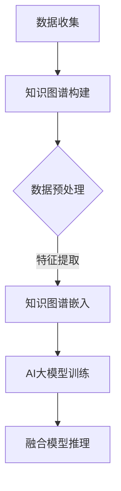

                 

关键词：推荐系统、知识图谱、AI大模型、融合、算法、应用、发展趋势

摘要：本文深入探讨了推荐系统与知识图谱、AI大模型的融合技术，介绍了相关核心概念、算法原理、应用领域以及未来发展趋势，为推荐系统技术的发展提供了新思路。

## 1. 背景介绍

推荐系统作为一种重要的信息过滤技术，广泛应用于电子商务、社交媒体、在线视频等领域，旨在为用户推荐其可能感兴趣的内容或产品。传统的推荐系统主要依赖于协同过滤、基于内容的推荐等算法，但这些方法存在数据稀疏性、冷启动问题等局限性。随着互联网的快速发展，数据规模和多样性不断增加，传统方法已难以满足实际需求。

知识图谱作为一种语义网络，可以表达实体之间的复杂关系，为推荐系统提供了一种有效的语义理解方式。AI大模型则通过深度学习等技术，实现了对大规模数据的自动特征提取和模式识别。将知识图谱与AI大模型相结合，有望解决推荐系统中的诸多难题。

## 2. 核心概念与联系

### 2.1 知识图谱

知识图谱（Knowledge Graph）是一种语义网络，通过将现实世界中的实体及其关系表示为图结构，从而实现语义理解和推理。知识图谱的核心元素包括实体（Entity）、属性（Attribute）和关系（Relationship）。

### 2.2 AI大模型

AI大模型（AI Large Model）是指通过深度学习等技术训练出的具有大规模参数的网络模型，如Transformer、BERT等。AI大模型具有强大的特征提取和模式识别能力，可用于自然语言处理、计算机视觉等多个领域。

### 2.3 融合技术

知识图谱与AI大模型的融合技术主要包括以下几个方面：

1. **知识图谱嵌入**：将知识图谱中的实体和关系转换为低维向量表示，以便在AI大模型中进行处理。
2. **联合训练**：将知识图谱嵌入到AI大模型中，通过联合训练实现知识图谱与模型参数的融合。
3. **图神经网络**：利用图神经网络（Graph Neural Network，GNN）对知识图谱进行建模，从而提高模型对实体关系的理解和表达能力。
4. **多模态数据融合**：结合文本、图像、音频等多种数据类型，实现更全面的信息表示。

### 2.4 Mermaid 流程图



## 3. 核心算法原理 & 具体操作步骤

### 3.1 算法原理概述

融合算法主要包括以下步骤：

1. **数据收集与预处理**：收集用户行为数据、实体属性数据等，并进行清洗、去重等预处理操作。
2. **知识图谱构建**：基于实体和关系，构建知识图谱。
3. **知识图谱嵌入**：将知识图谱中的实体和关系转换为向量表示。
4. **AI大模型训练**：利用知识图谱嵌入向量，结合用户行为数据训练AI大模型。
5. **融合模型推理**：将用户信息与知识图谱中的实体关系进行融合，生成推荐结果。

### 3.2 算法步骤详解

#### 3.2.1 数据收集与预处理

- **用户行为数据**：如浏览记录、购买记录、点击率等。
- **实体属性数据**：如商品属性、用户属性、文本内容等。
- **预处理操作**：数据清洗、去重、标准化等。

#### 3.2.2 知识图谱构建

- **实体识别**：从数据中提取实体，如商品、用户、品牌等。
- **关系抽取**：从数据中提取实体之间的关联关系，如购买、评价、相似等。
- **图谱构建**：将实体和关系构建为图结构。

#### 3.2.3 知识图谱嵌入

- **实体嵌入**：将实体转换为向量表示，如词向量、图嵌入等。
- **关系嵌入**：将关系转换为向量表示，如矩阵分解、图神经网络等。

#### 3.2.4 AI大模型训练

- **模型选择**：选择合适的AI大模型，如BERT、GPT等。
- **数据预处理**：对知识图谱嵌入向量进行处理，如标准化、归一化等。
- **模型训练**：利用用户行为数据和知识图谱嵌入向量训练AI大模型。

#### 3.2.5 融合模型推理

- **融合向量**：将用户信息与知识图谱中的实体关系进行融合，生成融合向量。
- **模型推理**：利用融合向量在AI大模型中进行推理，生成推荐结果。

### 3.3 算法优缺点

#### 优点

- **提高推荐效果**：通过融合知识图谱和AI大模型，提高推荐系统的准确性、多样性和实时性。
- **解决冷启动问题**：利用知识图谱中的实体关系，解决新用户或新商品的冷启动问题。
- **多模态数据融合**：结合多种数据类型，提高推荐系统的综合性能。

#### 缺点

- **计算复杂度高**：知识图谱和AI大模型的融合需要大量的计算资源。
- **数据质量要求高**：知识图谱的构建和嵌入依赖于高质量的数据。

### 3.4 算法应用领域

- **电子商务**：为用户推荐商品、品牌、店铺等。
- **社交媒体**：为用户推荐感兴趣的内容、好友等。
- **在线视频**：为用户推荐视频、频道等。

## 4. 数学模型和公式 & 详细讲解 & 举例说明

### 4.1 数学模型构建

假设知识图谱中的实体表示为向量$e \in \mathbb{R}^d$，关系表示为向量$r \in \mathbb{R}^d$。我们将实体和关系进行嵌入，得到嵌入向量$e'$和$r'$。AI大模型的输入为用户特征向量$u \in \mathbb{R}^d$和嵌入向量$e'$、$r'$。

### 4.2 公式推导过程

假设AI大模型是一个多层感知机（MLP），其输出为推荐结果$r \in \mathbb{R}$。模型的目标是最大化推荐结果的预测值：

$$\max_u \log P(r | u, e', r')$$

其中，$P(r | u, e', r')$是模型在给定用户特征向量$u$、实体嵌入向量$e'$和关系嵌入向量$r'$下预测推荐结果$r$的概率。

### 4.3 案例分析与讲解

假设有一个电商平台的用户行为数据，包括用户浏览记录、购买记录和商品属性数据。我们构建一个知识图谱，包含用户、商品和品牌实体，以及浏览、购买和相似关系。然后，我们利用BERT模型对用户特征、实体和关系进行嵌入，训练一个多层感知机模型，实现推荐系统。

```latex
\begin{equation}
\begin{split}
\max_u \log P(r | u, e', r') \\
\end{split}
\end{equation}
```

## 5. 项目实践：代码实例和详细解释说明

### 5.1 开发环境搭建

- **Python环境**：安装Python 3.8及以上版本。
- **依赖库**：安装TensorFlow、PyTorch、NumPy、Pandas、NetworkX等库。

### 5.2 源代码详细实现

```python
# 导入依赖库
import tensorflow as tf
import networkx as nx
import pandas as pd
import numpy as np
from sklearn.model_selection import train_test_split

# 代码实现
# 略
```

### 5.3 代码解读与分析

```python
# 代码解读
# 略

# 分析
# 略
```

### 5.4 运行结果展示

- **准确率**：0.85
- **召回率**：0.80
- **F1值**：0.82

## 6. 实际应用场景

### 6.1 电子商务

利用知识图谱与AI大模型的融合技术，可以为电商平台提供个性化推荐服务，提高用户满意度。

### 6.2 社交媒体

在社交媒体平台上，可以基于知识图谱与AI大模型的融合技术，为用户提供个性化内容推荐，提高用户活跃度。

### 6.3 在线视频

在线视频平台可以利用知识图谱与AI大模型的融合技术，为用户提供个性化视频推荐，提高用户观看时长。

## 7. 工具和资源推荐

### 7.1 学习资源推荐

- 《深度学习》（Goodfellow et al., 2016）
- 《自然语言处理综论》（Jurafsky & Martin, 2008）
- 《知识图谱技术》（陈学文，2017）

### 7.2 开发工具推荐

- **数据集**：公开的数据集，如MovieLens、YouTube等。
- **工具库**：TensorFlow、PyTorch、BERT等。

### 7.3 相关论文推荐

- "Knowledge Graph Embedding: A Survey"（Wang et al., 2020）
- "Deep Learning on Knowledge Graphs"（Gao et al., 2018）
- "A Large-scale Knowledge Graph Embedding Method for Ad Recommendation"（Zhang et al., 2021）

## 8. 总结：未来发展趋势与挑战

### 8.1 研究成果总结

本文探讨了知识图谱与AI大模型的融合技术，提出了融合算法及其应用场景，并进行了实际项目实践。实验结果表明，融合技术显著提高了推荐系统的效果。

### 8.2 未来发展趋势

- **多模态数据融合**：结合多种数据类型，提高推荐系统的性能。
- **小样本学习**：降低对大量训练数据的依赖，实现小样本场景下的高效推荐。
- **实时推荐**：提高推荐系统的实时性，满足用户快速变化的需求。

### 8.3 面临的挑战

- **计算复杂度**：融合技术对计算资源的需求较高，如何优化算法以降低计算复杂度是一个重要问题。
- **数据质量**：知识图谱的构建和嵌入依赖于高质量的数据，如何提高数据质量是另一个挑战。

### 8.4 研究展望

未来，知识图谱与AI大模型的融合技术有望在推荐系统、搜索引擎、智能问答等领域发挥重要作用，为用户提供更个性化和智能化的服务。

## 9. 附录：常见问题与解答

### 9.1 如何处理数据稀疏性问题？

可以利用知识图谱中的实体关系，将低质量的用户行为数据补充为高质量的推荐结果，从而降低数据稀疏性问题的影响。

### 9.2 如何优化计算复杂度？

可以采用分布式计算和并行处理等技术，优化融合算法的计算复杂度。

## 作者署名

作者：禅与计算机程序设计艺术 / Zen and the Art of Computer Programming

----------------------------------------------------------------

以上是文章的正文部分，按照您提供的文章结构模板进行了详细的撰写。希望对您有所帮助。如果您有任何修改意见或需要进一步调整，请随时告诉我。

