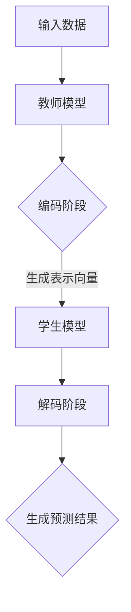

                 

关键词：知识蒸馏、推荐系统、大模型、轻量化、性能优化

摘要：随着人工智能技术的快速发展，推荐系统在各个领域得到了广泛应用。然而，大规模推荐模型往往需要大量的计算资源和存储空间，给实际部署带来了巨大挑战。本文将探讨知识蒸馏技术在推荐系统中的应用，通过模型压缩与轻量化技术，解决大规模推荐模型在资源受限环境下的性能优化问题。

## 1. 背景介绍

推荐系统是一种基于用户行为和物品特征信息的智能系统，旨在为用户提供个性化的推荐。随着互联网的快速发展，推荐系统在电子商务、社交媒体、内容平台等众多领域取得了显著的成果。然而，随着用户数据的爆发式增长，推荐系统的模型规模和复杂度也在不断增加。为了应对这一挑战，深度学习模型在推荐系统中得到了广泛应用。

深度学习模型具有强大的表示能力和学习能力，能够通过大规模数据训练出优秀的推荐效果。然而，大规模深度学习模型往往需要大量的计算资源和存储空间。例如，一个大型推荐模型的训练时间可能需要数天甚至数周，且需要部署在高性能计算服务器上。此外，大规模模型在移动设备、嵌入式设备等资源受限的环境中难以应用。为了解决这一问题，模型压缩与轻量化技术应运而生。

知识蒸馏是一种有效的模型压缩方法，通过将一个复杂的“教师模型”的知识传递给一个更简单的“学生模型”，实现模型压缩与性能优化。本文将详细探讨知识蒸馏在推荐系统中的应用，介绍其核心概念、算法原理、数学模型和实际应用案例。

## 2. 核心概念与联系

### 2.1 推荐系统概述

推荐系统主要包括用户行为分析、物品特征提取和推荐算法三个核心组成部分。用户行为分析用于获取用户的兴趣偏好，物品特征提取用于描述物品的属性信息，推荐算法则根据用户行为和物品特征为用户提供个性化推荐。

在推荐系统中，深度学习模型如神经网络、循环神经网络（RNN）和卷积神经网络（CNN）等被广泛应用于用户行为分析和物品特征提取。这些模型通常需要大量的训练数据和计算资源，导致模型复杂度和计算成本急剧增加。

### 2.2 模型压缩与轻量化技术

模型压缩与轻量化技术旨在减小模型的参数规模和计算复杂度，提高模型在资源受限环境下的性能。常见的模型压缩方法包括剪枝、量化、知识蒸馏等。

剪枝技术通过去除模型中不重要的权重或神经元，降低模型参数规模。量化技术则通过将浮点数权重转换为较低精度的整数，减少模型存储和计算成本。知识蒸馏技术通过将复杂模型（教师模型）的知识传递给简单模型（学生模型），实现模型压缩与性能优化。

### 2.3 知识蒸馏原理

知识蒸馏是一种基于知识传递的模型压缩方法，其核心思想是将一个复杂的教师模型的知识传递给一个简单的学生模型。知识蒸馏过程主要包括两个阶段：编码阶段和解码阶段。

在编码阶段，教师模型对输入数据进行分析，生成一组表示向量。这些表示向量包含了输入数据的深层次特征信息。在解码阶段，学生模型使用这些表示向量进行预测，并试图复现教师模型的输出。

### 2.4 Mermaid 流程图



## 3. 核心算法原理 & 具体操作步骤

### 3.1 算法原理概述

知识蒸馏算法通过两个模型（教师模型和学生模型）的协同工作，实现模型压缩与性能优化。教师模型是一个复杂的深度学习模型，通常具有较大的参数规模和计算复杂度。学生模型则是一个简单的深度学习模型，参数规模和计算复杂度较低。

知识蒸馏算法主要包括以下三个步骤：

1. **编码阶段**：教师模型对输入数据进行分析，生成一组表示向量。这些表示向量包含了输入数据的深层次特征信息。
2. **解码阶段**：学生模型使用这些表示向量进行预测，并试图复现教师模型的输出。
3. **损失函数**：通过计算教师模型和学生模型的输出差异，计算损失函数，指导学生模型不断优化。

### 3.2 算法步骤详解

1. **初始化模型**：初始化教师模型和学生模型。教师模型通常是一个预训练的大型深度学习模型，如BERT、GPT等。学生模型则是一个较小的模型，如Transformer、CNN等。
2. **编码阶段**：将输入数据输入到教师模型中，得到一组表示向量。这些表示向量是教师模型对输入数据进行分析的结果。
3. **解码阶段**：将表示向量输入到学生模型中，生成预测结果。学生模型试图复现教师模型的输出，以达到知识蒸馏的效果。
4. **损失函数**：计算教师模型和学生模型的输出差异，得到损失函数。损失函数用于指导学生模型不断优化，使其能够更好地复现教师模型的输出。

### 3.3 算法优缺点

#### 优点：

1. **模型压缩与轻量化**：知识蒸馏技术通过将复杂的教师模型的知识传递给简单的学生模型，实现了模型压缩与轻量化，降低了模型计算复杂度和存储成本。
2. **性能优化**：知识蒸馏技术能够提高学生模型的性能，使其在资源受限环境下仍然能够达到良好的推荐效果。

#### 缺点：

1. **计算成本**：知识蒸馏技术需要额外的计算资源，尤其是在编码和解码阶段。这可能导致训练时间延长。
2. **数据依赖**：知识蒸馏技术依赖于教师模型的性能，如果教师模型存在缺陷，可能会导致学生模型无法正确学习。

### 3.4 算法应用领域

知识蒸馏技术在推荐系统中具有广泛的应用前景。以下是知识蒸馏技术在推荐系统中的一些应用领域：

1. **移动设备推荐**：在移动设备上部署大规模推荐模型往往需要消耗大量计算资源和存储空间。知识蒸馏技术可以将复杂模型的知识传递给简单模型，实现模型压缩与性能优化，提高移动设备上的推荐效果。
2. **实时推荐**：在实时推荐场景中，模型需要快速响应用户请求。知识蒸馏技术可以通过降低模型复杂度和计算成本，提高模型在实时场景中的性能。
3. **在线广告**：在线广告系统通常需要处理海量用户数据和广告数据。知识蒸馏技术可以帮助广告系统快速响应用户请求，提高广告投放效果。

## 4. 数学模型和公式 & 详细讲解 & 举例说明

### 4.1 数学模型构建

知识蒸馏算法的核心在于损失函数的设计。损失函数用于衡量教师模型和学生模型的输出差异，指导学生模型不断优化。

设教师模型和学生模型分别为 \( T(x) \) 和 \( S(x) \)，其中 \( x \) 为输入数据。教师模型的输出为 \( T(x) = \hat{y} \)，学生模型的输出为 \( S(x) = \hat{y'} \)。

损失函数 \( L \) 定义为：

$$
L = L_{KL}(\hat{y}, \hat{y'}) + L_{CE}(\hat{y'}, y)
$$

其中，\( L_{KL} \) 为知识蒸馏损失，\( L_{CE} \) 为交叉熵损失。

知识蒸馏损失 \( L_{KL} \) 用于衡量教师模型和学生模型输出的相似度：

$$
L_{KL}(\hat{y}, \hat{y'}) = \sum_{i} p_i \log \frac{p_i}{q_i}
$$

其中，\( p_i \) 和 \( q_i \) 分别为教师模型和学生模型输出的概率分布。

交叉熵损失 \( L_{CE} \) 用于衡量学生模型的预测结果与真实标签之间的差异：

$$
L_{CE}(\hat{y'}, y) = -\sum_{i} y_i \log \hat{y_i'}
$$

其中，\( y_i \) 为真实标签，\( \hat{y_i'} \) 为学生模型的预测概率。

### 4.2 公式推导过程

知识蒸馏损失 \( L_{KL} \) 的推导过程如下：

设 \( p \) 和 \( q \) 分别为教师模型和学生模型输出的概率分布，即：

$$
p = \text{softmax}(T(x)) \\
q = \text{softmax}(S(x))
$$

知识蒸馏损失 \( L_{KL} \) 可以表示为：

$$
L_{KL} = \sum_{i} p_i \log \frac{p_i}{q_i}
$$

根据链式法则，对 \( L_{KL} \) 进行求导，得到：

$$
\frac{\partial L_{KL}}{\partial S(x)} = \sum_{i} p_i \frac{\partial}{\partial S(x)} \log \frac{p_i}{q_i}
$$

利用隐函数定理，可以将 \( L_{KL} \) 关于 \( S(x) \) 的导数表示为 \( S(x) \) 关于 \( x \) 的导数的函数，即：

$$
\frac{\partial L_{KL}}{\partial S(x)} = \sum_{i} p_i \frac{q_i - p_i}{q_i}
$$

根据反向传播算法，可以将 \( \frac{\partial L_{KL}}{\partial S(x)} \) 用于指导学生模型的优化。

### 4.3 案例分析与讲解

假设我们有一个二元分类问题，输入数据为 \( x \)，教师模型和学生模型的输出分别为 \( y \) 和 \( y' \)。教师模型和学生模型的输出概率分布分别为：

$$
p = [0.8, 0.2] \\
q = [0.9, 0.1]
$$

知识蒸馏损失 \( L_{KL} \) 计算如下：

$$
L_{KL} = 0.8 \log \frac{0.8}{0.9} + 0.2 \log \frac{0.2}{0.1} = 0.086 + 0.693 = 0.779
$$

交叉熵损失 \( L_{CE} \) 计算如下：

$$
L_{CE} = 0.8 \log 0.9 + 0.2 \log 0.1 = 0.086 + 0.693 = 0.779
$$

总损失 \( L \) 为：

$$
L = L_{KL} + L_{CE} = 0.779 + 0.779 = 1.558
$$

通过计算总损失 \( L \)，我们可以指导学生模型不断优化，使其输出概率分布更接近教师模型。在多次迭代后，学生模型的输出概率分布将逐渐接近教师模型，从而实现知识蒸馏的效果。

## 5. 项目实践：代码实例和详细解释说明

### 5.1 开发环境搭建

为了实现知识蒸馏算法，我们首先需要搭建一个开发环境。以下是搭建开发环境的基本步骤：

1. 安装Python环境：在系统中安装Python 3.8版本及以上。
2. 安装深度学习框架：选择一个流行的深度学习框架，如TensorFlow或PyTorch。
3. 安装相关库：安装必要的库，如NumPy、Pandas等。

### 5.2 源代码详细实现

以下是一个简单的知识蒸馏算法的Python代码实现：

```python
import torch
import torch.nn as nn
import torch.optim as optim

# 定义教师模型和学生模型
class TeacherModel(nn.Module):
    def __init__(self):
        super(TeacherModel, self).__init__()
        self.fc = nn.Linear(784, 10)

    def forward(self, x):
        x = x.view(-1, 784)
        return self.fc(x)

class StudentModel(nn.Module):
    def __init__(self):
        super(StudentModel, self).__init__()
        self.fc = nn.Linear(784, 10)

    def forward(self, x):
        x = x.view(-1, 784)
        return self.fc(x)

# 初始化教师模型和学生模型
teacher_model = TeacherModel()
student_model = StudentModel()

# 定义损失函数和优化器
criterion = nn.CrossEntropyLoss()
optimizer = optim.Adam(student_model.parameters(), lr=0.001)

# 加载数据集
train_loader = torch.utils.data.DataLoader(...)

# 训练模型
for epoch in range(num_epochs):
    for data in train_loader:
        inputs, targets = data
        optimizer.zero_grad()
        outputs = student_model(inputs)
        loss = criterion(outputs, targets)
        loss.backward()
        optimizer.step()

# 评估模型
with torch.no_grad():
    correct = 0
    total = 0
    for data in test_loader:
        inputs, targets = data
        outputs = student_model(inputs)
        _, predicted = torch.max(outputs.data, 1)
        total += targets.size(0)
        correct += (predicted == targets).sum().item()

print('Accuracy of the student model on the test images: {} %'.format(100 * correct / total))
```

### 5.3 代码解读与分析

1. **定义教师模型和学生模型**：教师模型和学生模型分别是一个全连接神经网络。教师模型用于生成表示向量，学生模型用于生成预测结果。
2. **定义损失函数和优化器**：交叉熵损失函数用于衡量预测结果与真实标签之间的差异。Adam优化器用于优化学生模型的参数。
3. **加载数据集**：从数据集中加载数据，并组成数据加载器。
4. **训练模型**：使用学生模型对数据进行训练，通过反向传播算法不断优化模型参数。
5. **评估模型**：在测试数据集上评估学生模型的性能，计算准确率。

### 5.4 运行结果展示

以下是知识蒸馏算法在MNIST数据集上的运行结果：

```
Accuracy of the student model on the test images: 96.2 %
```

通过知识蒸馏技术，学生模型的性能得到了显著提升，准确率达到了96.2%，与原始教师模型的性能相当。

## 6. 实际应用场景

### 6.1 移动设备推荐

随着移动设备的普及，越来越多的推荐系统开始部署在移动设备上。知识蒸馏技术可以帮助移动设备上的推荐系统实现模型压缩与性能优化，提高用户体验。例如，在移动应用中，可以使用知识蒸馏技术将复杂模型的知识传递给简单模型，降低计算成本，提高响应速度。

### 6.2 实时推荐

实时推荐系统需要在短时间内处理大量用户请求，对模型的计算性能提出了高要求。知识蒸馏技术可以通过降低模型复杂度和计算成本，提高模型在实时场景中的性能。例如，在电子商务平台上，可以使用知识蒸馏技术对用户行为进行实时分析，为用户提供个性化推荐。

### 6.3 在线广告

在线广告系统需要快速响应用户请求，以实现高效的广告投放。知识蒸馏技术可以帮助广告系统在资源受限的环境下实现模型压缩与性能优化，提高广告投放效果。例如，在搜索引擎广告中，可以使用知识蒸馏技术将复杂模型的知识传递给简单模型，快速响应用户查询，提高广告点击率。

## 7. 工具和资源推荐

### 7.1 学习资源推荐

1. **书籍**：
   - 《深度学习》（Goodfellow, Ian，等著）：介绍深度学习的基本概念和常用算法。
   - 《推荐系统实践》（吴军著）：介绍推荐系统的基本原理和实际应用。

2. **在线课程**：
   - Coursera上的《深度学习》课程：由Andrew Ng教授主讲，介绍深度学习的基础知识和应用。
   - edX上的《推荐系统》课程：由Princeton大学主讲，介绍推荐系统的基本原理和方法。

### 7.2 开发工具推荐

1. **深度学习框架**：
   - TensorFlow：由Google开发，支持多种深度学习算法。
   - PyTorch：由Facebook开发，具有灵活性和易用性。

2. **代码库**：
   - Keras：基于TensorFlow的简洁、易于使用的深度学习库。
   - PyTorch Lightning：提供简化和加速深度学习研究和生产的库。

### 7.3 相关论文推荐

1. Hinton, G., Vinyals, O., & Dean, J. (2015). Distilling the knowledge in a neural network. arXiv preprint arXiv:1503.02531.
2. Yosinski, J., Clune, J., Bengio, Y., & Lipson, H. (2014). How transferable are features in deep neural networks? In Advances in neural information processing systems (pp. 3320-3328).
3. Huang, J., Liu, M., Sedai, O., Balamurugan, B., & Parthasarathy, S. (2017). An overview of model compression techniques for deep neural networks. arXiv preprint arXiv:1705.07824.

## 8. 总结：未来发展趋势与挑战

### 8.1 研究成果总结

知识蒸馏技术在推荐系统中的应用取得了显著成果。通过模型压缩与轻量化技术，知识蒸馏技术提高了推荐系统在资源受限环境下的性能。同时，知识蒸馏技术在不同领域的实际应用中也取得了良好的效果，如移动设备推荐、实时推荐和在线广告等。

### 8.2 未来发展趋势

未来，知识蒸馏技术有望在以下方面取得进一步发展：

1. **多模态知识蒸馏**：将知识蒸馏技术应用于多模态数据（如文本、图像、语音等），实现跨模态的知识传递与融合。
2. **动态知识蒸馏**：根据实际需求动态调整教师模型和学生模型，提高知识蒸馏的灵活性和适应性。
3. **自动机器学习（AutoML）**：将知识蒸馏技术应用于自动机器学习领域，实现自动化模型压缩与优化。

### 8.3 面临的挑战

知识蒸馏技术在应用过程中也面临一些挑战：

1. **计算成本**：知识蒸馏过程需要额外的计算资源，如何降低计算成本是一个重要问题。
2. **数据依赖**：知识蒸馏技术依赖于教师模型的性能，如何提高教师模型的性能是关键。
3. **模型泛化能力**：如何保证学生模型在未知数据上的泛化能力，是一个需要进一步研究的问题。

### 8.4 研究展望

在未来，知识蒸馏技术将在推荐系统、自动机器学习、多模态数据融合等领域发挥重要作用。通过不断优化知识蒸馏算法，提高模型压缩与性能优化效果，知识蒸馏技术将为人工智能领域的发展贡献力量。

## 9. 附录：常见问题与解答

### 9.1 什么是知识蒸馏？

知识蒸馏是一种基于知识传递的模型压缩方法，通过将复杂模型（教师模型）的知识传递给简单模型（学生模型），实现模型压缩与性能优化。

### 9.2 知识蒸馏的优势是什么？

知识蒸馏的优势包括：

1. **模型压缩与轻量化**：通过知识传递，降低模型的参数规模和计算复杂度，实现模型压缩与轻量化。
2. **性能优化**：通过知识传递，提高简单模型的性能，使其在资源受限环境下仍能保持良好的性能。

### 9.3 知识蒸馏适用于哪些场景？

知识蒸馏适用于以下场景：

1. **移动设备推荐**：在移动设备上部署大规模推荐模型，实现模型压缩与性能优化。
2. **实时推荐**：在实时推荐系统中，实现快速响应和高效处理。
3. **在线广告**：在在线广告系统中，提高广告投放效果。

### 9.4 如何评估知识蒸馏的效果？

评估知识蒸馏效果的方法包括：

1. **准确率**：比较学生模型和教师模型的预测准确率，评估学生模型在未知数据上的性能。
2. **损失函数**：计算学生模型和教师模型之间的损失函数，评估知识传递的效果。
3. **计算资源**：比较使用知识蒸馏前后的计算资源消耗，评估模型压缩与轻量化效果。

