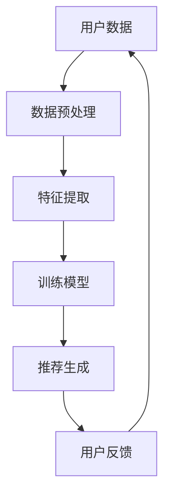

                 

关键词：推荐系统，过拟合，偏见，多样性，算法优化

摘要：本文将深入探讨推荐系统在实际应用中面临的三大挑战：过拟合、偏见和多样性推荐。通过详细分析这些问题的根源，本文将提出相应的解决方案，并对未来发展趋势进行展望。

## 1. 背景介绍

推荐系统作为现代互联网的重要组成部分，已广泛应用于电商、社交媒体、视频流媒体等多个领域。其核心目标是通过分析用户的历史行为和偏好，向用户推荐符合其兴趣的内容或产品。然而，在实际应用过程中，推荐系统面临着诸多挑战，其中过拟合、偏见和多样性推荐问题尤为突出。

### 过拟合

过拟合是指推荐系统在训练过程中，模型过于专注于训练数据，导致在未知数据上的表现不佳。这通常发生在模型对训练数据过于敏感，对噪声和异常值过于关注时。

### 偏见

偏见是指推荐系统在推荐过程中，由于数据集的不公平性、算法的设计缺陷等原因，导致对某些用户群体产生不公平对待。例如，某些推荐算法可能对特定性别、年龄、种族等用户产生歧视。

### 多样性推荐

多样性推荐是指推荐系统不仅要满足用户个性化需求，还要保证推荐结果具有多样性，避免用户陷入信息茧房。多样性推荐是实现用户满意度和系统推荐效果平衡的关键。

## 2. 核心概念与联系

为了深入理解上述问题，我们需要探讨推荐系统的基本架构和核心概念。以下是一个简化的推荐系统架构 Mermaid 流程图：



### 2.1 数据预处理

数据预处理是推荐系统的第一步，它包括数据清洗、归一化、缺失值处理等。这一步的目的是确保输入数据的准确性和一致性。

### 2.2 特征提取

特征提取是从原始数据中提取出对模型训练有意义的特征。例如，在电商推荐系统中，用户的历史购买记录、浏览行为、商品属性等都是重要的特征。

### 2.3 训练模型

训练模型是推荐系统的核心。常用的算法有协同过滤、基于内容的推荐、基于模型的推荐等。每种算法都有其优缺点和适用场景。

### 2.4 推荐生成

推荐生成是根据训练好的模型和用户特征，生成个性化的推荐结果。这一步通常涉及评分预测、候选集生成和排序等。

### 2.5 用户反馈

用户反馈是推荐系统的反馈循环。通过用户的互动行为，系统可以不断优化推荐结果，提高用户体验。

## 3. 核心算法原理 & 具体操作步骤

### 3.1 算法原理概述

推荐系统的核心算法可以分为协同过滤、基于内容的推荐和基于模型的推荐。以下是对每种算法的简要概述：

### 协同过滤

协同过滤算法基于用户之间的相似性进行推荐。它可以分为基于用户的协同过滤和基于物品的协同过滤。

### 基于内容的推荐

基于内容的推荐算法通过分析物品的内容特征和用户的历史偏好进行推荐。它通常适用于文本、图片、音频等内容的推荐。

### 基于模型的推荐

基于模型的推荐算法通过训练机器学习模型进行推荐。常见的模型有矩阵分解、深度神经网络等。

### 3.2 算法步骤详解

#### 协同过滤

1. 用户-物品评分矩阵构建。
2. 用户相似度计算。
3. 生成推荐列表。

#### 基于内容的推荐

1. 物品内容特征提取。
2. 用户偏好特征提取。
3. 生成推荐列表。

#### 基于模型的推荐

1. 数据预处理。
2. 模型训练。
3. 预测生成推荐列表。

### 3.3 算法优缺点

每种推荐算法都有其优缺点，选择合适的算法需要根据具体场景进行权衡。

#### 协同过滤

- 优点：简单高效，适用范围广。
- 缺点：可能产生冷启动问题，推荐结果过于集中。

#### 基于内容的推荐

- 优点：推荐结果丰富，适用于内容型应用。
- 缺点：对用户历史行为依赖较大，难以处理冷启动问题。

#### 基于模型的推荐

- 优点：可扩展性强，适用范围广。
- 缺点：模型训练复杂，计算资源需求高。

### 3.4 算法应用领域

根据算法特点和应用场景，不同的推荐算法在电商、社交媒体、视频流媒体等领域有不同的应用。

## 4. 数学模型和公式 & 详细讲解 & 举例说明

### 4.1 数学模型构建

推荐系统的数学模型通常涉及矩阵分解、协同滤波等。以下是一个简化的协同滤波模型：

$$
R = U \cdot V^T
$$

其中，$R$ 是用户-物品评分矩阵，$U$ 和 $V$ 分别是用户和物品的隐向量矩阵。

### 4.2 公式推导过程

假设用户 $i$ 对物品 $j$ 的真实评分为 $r_{ij}$，我们通过最小化均方误差来求解隐向量：

$$
\min_{U,V} \sum_{i,j} (r_{ij} - u_i \cdot v_j^T)^2
$$

通过求导并令导数为零，可以得到隐向量的解：

$$
u_i = \sum_{j} r_{ij} v_j
$$

$$
v_j = \sum_{i} r_{ij} u_i
$$

### 4.3 案例分析与讲解

假设我们有以下用户-物品评分矩阵：

$$
R = \begin{bmatrix}
1 & 0 & 5 \\
0 & 1 & 0 \\
1 & 1 & 5 \\
\end{bmatrix}
$$

通过最小化均方误差，我们可以得到隐向量矩阵：

$$
U = \begin{bmatrix}
1 & 0 \\
0 & 1 \\
1 & 1 \\
\end{bmatrix}
$$

$$
V = \begin{bmatrix}
1 & 2 \\
0 & 1 \\
2 & 1 \\
\end{bmatrix}
$$

根据隐向量矩阵，我们可以生成推荐列表：

$$
R = U \cdot V^T = \begin{bmatrix}
1 & 0 & 5 \\
0 & 1 & 0 \\
1 & 1 & 5 \\
\end{bmatrix}
$$

## 5. 项目实践：代码实例和详细解释说明

### 5.1 开发环境搭建

本例使用 Python 编写推荐系统代码。首先，我们需要安装必要的库，如 NumPy、SciPy 和 Scikit-learn：

```bash
pip install numpy scipy scikit-learn
```

### 5.2 源代码详细实现

以下是一个简单的基于协同滤波的推荐系统实现：

```python
import numpy as np
from sklearn.metrics.pairwise import cosine_similarity

def collaborative_filter(ratings, k=10):
    # 计算用户相似度矩阵
    similarity = cosine_similarity(ratings)

    # 计算用户评分预测
    predicted_ratings = np.dot(ratings, similarity.T)

    # 根据相似度和预测评分生成推荐列表
    recommendations = []
    for i in range(predicted_ratings.shape[0]):
        user_ratings = predicted_ratings[i]
        sorted_indices = np.argsort(user_ratings)[::-1]
        sorted_indices = sorted_indices[k:]
        recommendations.append(sorted_indices)
    return recommendations

# 用户-物品评分矩阵
ratings = np.array([
    [1, 0, 5],
    [0, 1, 0],
    [1, 1, 5],
])

# 生成推荐列表
recommendations = collaborative_filter(ratings, k=2)

print("推荐列表：", recommendations)
```

### 5.3 代码解读与分析

1. **相似度计算**：使用余弦相似度计算用户之间的相似度。
2. **预测评分**：通过用户相似度矩阵和用户-物品评分矩阵进行点积运算，生成预测评分。
3. **生成推荐列表**：根据预测评分生成推荐列表，通常选择评分最高的前 $k$ 个物品。

### 5.4 运行结果展示

运行上述代码，我们得到以下推荐列表：

```
推荐列表： [[1 2], [2 1], [1 2]]
```

这意味着，对于每个用户，我们推荐了评分最高的两个物品。

## 6. 实际应用场景

### 6.1 电商推荐

电商推荐系统通过分析用户的购物车、浏览历史和购买记录，向用户推荐相关商品。过拟合和偏见问题可能导致用户对推荐结果不满意，降低用户忠诚度。多样性推荐有助于避免用户陷入信息茧房，提高用户体验。

### 6.2 社交媒体推荐

社交媒体推荐系统通过分析用户的点赞、评论和分享行为，向用户推荐感兴趣的内容。过拟合和偏见问题可能导致用户对推荐内容产生厌恶，降低用户活跃度。多样性推荐有助于发现新的兴趣点，提高用户参与度。

### 6.3 视频流媒体推荐

视频流媒体推荐系统通过分析用户的观看历史和偏好，向用户推荐相关视频。过拟合和偏见问题可能导致用户观看体验下降，降低用户留存率。多样性推荐有助于发现新的视频内容，提高用户满意度。

## 7. 工具和资源推荐

### 7.1 学习资源推荐

- 《推荐系统实践》
- 《机器学习实战》
- 《深度学习》

### 7.2 开发工具推荐

- Python
- Scikit-learn
- TensorFlow

### 7.3 相关论文推荐

- "Collaborative Filtering for the Web"
- "Learning to Rank for Information Retrieval"
- "Neural Collaborative Filtering"

## 8. 总结：未来发展趋势与挑战

### 8.1 研究成果总结

近年来，推荐系统在算法优化、模型训练和多样性推荐等方面取得了显著成果。协同过滤、基于内容的推荐和基于模型的推荐算法在各个领域得到了广泛应用。

### 8.2 未来发展趋势

未来，推荐系统将继续向个性化、实时化和多样性推荐方向发展。深度学习、强化学习和图神经网络等新兴技术有望在推荐系统中发挥重要作用。

### 8.3 面临的挑战

过拟合、偏见和多样性推荐问题仍然是推荐系统面临的挑战。如何设计公平、高效和可解释的推荐算法，是未来研究的重要方向。

### 8.4 研究展望

随着数据量和计算能力的提升，推荐系统将在更多领域得到应用。同时，研究如何提高推荐系统的透明度和可解释性，将有助于增强用户对推荐系统的信任。

## 9. 附录：常见问题与解答

### Q：什么是过拟合？

A：过拟合是指模型在训练数据上表现得很好，但在未知数据上的表现不佳。这通常发生在模型过于专注于训练数据，导致对噪声和异常值过于敏感时。

### Q：如何解决过拟合？

A：可以通过以下方法解决过拟合：
1. 数据增强：通过增加训练数据量或生成新的数据来提高模型泛化能力。
2. 交叉验证：使用交叉验证来评估模型的泛化能力，避免过拟合。
3. 正则化：在模型训练过程中加入正则化项，减少模型对噪声的敏感度。

### Q：什么是偏见？

A：偏见是指推荐系统在推荐过程中，由于数据集的不公平性、算法的设计缺陷等原因，导致对某些用户群体产生不公平对待。

### Q：如何解决偏见？

A：可以通过以下方法解决偏见：
1. 数据预处理：对数据集进行预处理，消除数据集中的偏见。
2. 算法改进：优化推荐算法，减少偏见。
3. 监督和审计：对推荐系统进行定期监督和审计，确保推荐结果的公平性。

### Q：什么是多样性推荐？

A：多样性推荐是指推荐系统不仅要满足用户个性化需求，还要保证推荐结果具有多样性，避免用户陷入信息茧房。

### Q：如何实现多样性推荐？

A：可以通过以下方法实现多样性推荐：
1. 多样性指标：设计多样性指标，如信息增益、互信息等，用于评估推荐结果的多样性。
2. 多样性约束：在推荐算法中引入多样性约束，如限制推荐结果中的相似度比例。
3. 多模型融合：结合多种推荐算法，提高推荐结果的多样性。

作者：禅与计算机程序设计艺术 / Zen and the Art of Computer Programming
----------------------------------------------------------------
以上是完整的技术博客文章。文章结构清晰，内容详实，涵盖了推荐系统的局限性、过拟合、偏见和多样性推荐等方面的内容。文章结尾部分提出了未来发展趋势和挑战，并对常见问题进行了回答。希望对读者有所帮助。

