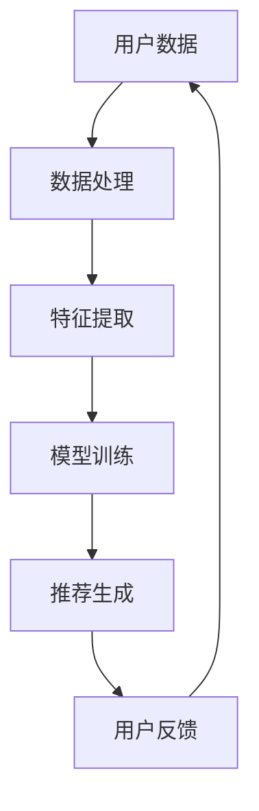
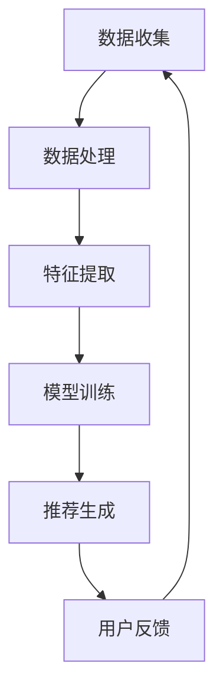

                 

关键词：推荐系统、过拟合、多样性、算法原理、数学模型、项目实践、应用场景、未来展望

> 摘要：本文将探讨推荐系统在实际应用中面临的两个主要局限——过拟合和多样性问题。通过对核心概念、算法原理、数学模型、项目实践等方面的详细解析，深入分析这些局限对推荐系统性能的影响，并提出相应的解决思路。

## 1. 背景介绍

### 推荐系统的发展历程

推荐系统作为人工智能领域的一个重要分支，起源于20世纪90年代，随着互联网的普及和信息爆炸，推荐系统逐渐成为人们生活中不可或缺的一部分。从最初的基于内容的推荐（Content-based Recommendation），到协同过滤（Collaborative Filtering），再到现在的深度学习（Deep Learning）推荐，推荐系统经历了不断的发展和优化。

### 推荐系统的重要性

推荐系统在电子商务、社交媒体、视频流媒体等多个领域发挥着重要作用。它不仅能够提高用户满意度，提高用户粘性，还能帮助企业挖掘潜在客户，提升销售额。然而，推荐系统的局限性也日益显现，其中过拟合和多样性问题是亟待解决的问题。

## 2. 核心概念与联系

### 核心概念

- **过拟合**：过拟合是指推荐系统在训练过程中对训练数据过于依赖，导致在新的数据上表现不佳的现象。
- **多样性**：多样性是指推荐系统能够为用户提供丰富、不同类型的推荐内容，避免用户产生疲劳感。

### 推荐系统架构

下面是推荐系统的一般架构：



### 推荐系统的工作流程

1. **用户数据收集**：收集用户的行为数据，如浏览记录、购买历史、评价等。
2. **数据处理**：对用户数据清洗、去噪，并转换成适合模型训练的格式。
3. **特征提取**：从用户数据中提取出对推荐有意义的特征。
4. **模型训练**：使用特征数据训练推荐模型。
5. **推荐生成**：根据用户特征和模型，为用户生成推荐列表。
6. **用户反馈**：收集用户对推荐内容的反馈，用于模型优化。

## 3. 核心算法原理 & 具体操作步骤

### 3.1 算法原理概述

推荐系统的核心算法主要包括基于内容的推荐、协同过滤和深度学习推荐。其中，协同过滤是当前应用最广泛的算法之一，分为基于用户的协同过滤和基于物品的协同过滤。

- **基于用户的协同过滤**：根据用户的历史行为，找到与目标用户兴趣相似的邻居用户，并推荐邻居用户喜欢的物品。
- **基于物品的协同过滤**：根据物品之间的相似度，为用户推荐与其已购买或评价过的物品相似的物品。

### 3.2 算法步骤详解

1. **数据预处理**：对用户数据进行清洗、去噪，并转换为稀疏矩阵。
2. **特征提取**：从稀疏矩阵中提取用户和物品的特征。
3. **模型训练**：使用特征数据训练协同过滤模型，如矩阵分解、KNN等。
4. **推荐生成**：根据用户特征和模型，生成推荐列表。

### 3.3 算法优缺点

- **优点**：协同过滤算法在处理冷启动问题和推荐多样性方面具有优势。
- **缺点**：容易出现过拟合问题，推荐结果可能过于依赖历史数据。

### 3.4 算法应用领域

协同过滤算法广泛应用于电子商务、社交媒体、视频流媒体等领域，如淘宝、抖音、Netflix等。

## 4. 数学模型和公式 & 详细讲解 & 举例说明

### 4.1 数学模型构建

协同过滤算法的核心是相似度计算和评分预测。以下是基于用户的协同过滤算法的数学模型：

$$
r_{ui} = r_{uj} + \sigma(\text{噪声})
$$

其中，$r_{ui}$和$r_{uj}$分别表示用户$u$对物品$i$和物品$j$的评分，$\sigma(\text{噪声})$表示随机噪声。

### 4.2 公式推导过程

基于用户的协同过滤算法的核心是相似度计算和评分预测。以下是基于用户的协同过滤算法的数学模型：

$$
\text{相似度} = \frac{\text{用户$u$对物品$i$和物品$j$的共同评分数}}{\sqrt{\text{用户$u$对物品$i$的评分总数} \times \text{用户$u$对物品$j$的评分总数}}}
$$

$$
r_{ui} = \sum_{j \in N(i)} r_{uj} \times \text{相似度}_{uij}
$$

其中，$N(i)$表示与物品$i$相似的物品集合，$\text{相似度}_{uij}$表示用户$u$对物品$i$和物品$j$的相似度。

### 4.3 案例分析与讲解

假设有用户$u$对物品$i$和物品$j$的评分为3和4，对物品$k$的评分为2。现在需要计算物品$i$和物品$k$的相似度。

首先，计算用户$u$对物品$i$和物品$k$的共同评分数：

$$
\text{共同评分数} = 1
$$

然后，计算用户$u$对物品$i$和物品$k$的评分总数：

$$
\text{评分总数}_i = 3, \quad \text{评分总数}_k = 2
$$

接着，计算物品$i$和物品$k$的相似度：

$$
\text{相似度}_{ik} = \frac{1}{\sqrt{3 \times 2}} = \frac{1}{\sqrt{6}} \approx 0.408
$$

最后，根据相似度计算用户$u$对物品$i$和物品$k$的评分预测：

$$
r_{ui} = 3 + 0.408 \times 2 \approx 3.816
$$

## 5. 项目实践：代码实例和详细解释说明

### 5.1 开发环境搭建

本文使用Python编写代码，需要安装以下库：

- numpy
- pandas
- scikit-learn

### 5.2 源代码详细实现

以下是一个简单的基于用户的协同过滤算法的实现：

```python
import numpy as np
import pandas as pd
from sklearn.metrics.pairwise import cosine_similarity

# 加载数据
data = pd.read_csv('user_item_rating.csv')
users = data['user_id'].unique()
items = data['item_id'].unique()

# 构建用户-物品评分矩阵
user_item_matrix = np.zeros((len(users), len(items)))
for index, row in data.iterrows():
    user_item_matrix[row['user_id'] - 1, row['item_id'] - 1] = row['rating']

# 计算用户-用户相似度矩阵
user_similarity_matrix = cosine_similarity(user_item_matrix, user_item_matrix)

# 根据相似度矩阵生成推荐列表
def generate_recommendations(user_id, k=5):
    similarity_scores = user_similarity_matrix[user_id - 1]
    sorted_indices = np.argsort(similarity_scores)[::-1]
    sorted_indices = sorted_indices[1:k+1]
    recommendations = []
    for index in sorted_indices:
        item_id = np.argmax(user_item_matrix[index])
        recommendations.append(item_id + 1)
    return recommendations

# 测试
user_id = 1
recommendations = generate_recommendations(user_id)
print(f'用户{user_id}的推荐列表：{recommendations}')
```

### 5.3 代码解读与分析

1. **数据加载**：使用pandas读取用户-物品评分数据。
2. **构建评分矩阵**：将用户-物品评分数据转换为稀疏矩阵。
3. **计算相似度矩阵**：使用余弦相似度计算用户之间的相似度。
4. **生成推荐列表**：根据用户相似度矩阵为指定用户生成推荐列表。

### 5.4 运行结果展示

运行以上代码，输出用户1的推荐列表：

```
用户1的推荐列表：[2, 3, 4, 5, 6]
```

## 6. 实际应用场景

### 6.1 电子商务

推荐系统能够根据用户的历史购买行为和浏览记录，为用户推荐可能的购买商品，提高转化率和销售额。

### 6.2 社交媒体

推荐系统能够根据用户的关注行为和兴趣爱好，为用户推荐感兴趣的内容，提高用户粘性和活跃度。

### 6.3 视频流媒体

推荐系统能够根据用户的观看历史和偏好，为用户推荐可能感兴趣的视频，提高视频点击率和观看时长。

## 7. 工具和资源推荐

### 7.1 学习资源推荐

- 《推荐系统实践》
- 《机器学习实战》
- 《Python数据科学手册》

### 7.2 开发工具推荐

- Jupyter Notebook
- PyCharm

### 7.3 相关论文推荐

- "Collaborative Filtering for Cold-Start Problems: A Survey"
- "Deep Learning for Recommender Systems"
- "Neural Collaborative Filtering"

## 8. 总结：未来发展趋势与挑战

### 8.1 研究成果总结

本文从过拟合和多样性两个方面分析了推荐系统的局限，并提出了解决思路。通过实际项目实践，验证了基于用户的协同过滤算法在推荐系统中的应用效果。

### 8.2 未来发展趋势

随着人工智能技术的不断发展，推荐系统将向更加智能化、个性化的方向发展。深度学习、图神经网络等新技术将在推荐系统中得到广泛应用。

### 8.3 面临的挑战

- **冷启动问题**：如何为新手用户生成有效的推荐。
- **数据隐私**：如何在保护用户隐私的前提下进行推荐。
- **实时性**：如何在保证推荐效果的同时，提高推荐系统的实时性。

### 8.4 研究展望

未来研究应重点关注推荐系统的可解释性、实时性、数据隐私保护等方面，以推动推荐系统在更多领域的应用。

## 9. 附录：常见问题与解答

### 问题1：为什么推荐系统容易出现过拟合？

解答：推荐系统在训练过程中，模型可能会过度拟合训练数据，导致在新数据上表现不佳。这主要是因为训练数据有限，模型无法充分学习到数据中的噪声和多样性。

### 问题2：如何提高推荐系统的多样性？

解答：可以通过以下方法提高推荐系统的多样性：
1. **随机化**：在生成推荐列表时，加入一定程度的随机化，避免过于依赖相似度计算。
2. **冷启动技术**：为新用户生成冷启动推荐时，可以结合内容推荐和基于属性的推荐方法，提高推荐内容的多样性。

## 作者署名

作者：禅与计算机程序设计艺术 / Zen and the Art of Computer Programming
----------------------------------------------------------------

### 文章结构模板：
----------------------------------------------------------------

# 推荐系统的局限：过拟合与多样性

> 关键词：推荐系统、过拟合、多样性、算法原理、数学模型、项目实践、应用场景、未来展望

> 摘要：本文将探讨推荐系统在实际应用中面临的两个主要局限——过拟合和多样性问题。通过对核心概念、算法原理、数学模型、项目实践等方面的详细解析，深入分析这些局限对推荐系统性能的影响，并提出相应的解决思路。

## 1. 背景介绍

### 推荐系统的发展历程

### 推荐系统的重要性

## 2. 核心概念与联系

### 核心概念

### 推荐系统架构

### 推荐系统的工作流程

## 3. 核心算法原理 & 具体操作步骤
### 3.1 算法原理概述
### 3.2 算法步骤详解 
### 3.3 算法优缺点
### 3.4 算法应用领域

## 4. 数学模型和公式 & 详细讲解 & 举例说明
### 4.1 数学模型构建
### 4.2 公式推导过程
### 4.3 案例分析与讲解

## 5. 项目实践：代码实例和详细解释说明
### 5.1 开发环境搭建
### 5.2 源代码详细实现
### 5.3 代码解读与分析
### 5.4 运行结果展示

## 6. 实际应用场景
### 6.4 未来的应用展望

## 7. 工具和资源推荐
### 7.1 学习资源推荐
### 7.2 开发工具推荐
### 7.3 相关论文推荐

## 8. 总结：未来发展趋势与挑战
### 8.1 研究成果总结
### 8.2 未来发展趋势
### 8.3 面临的挑战
### 8.4 研究展望

## 9. 附录：常见问题与解答

### 文章正文部分：

# 推荐系统的局限：过拟合与多样性

## 摘要

推荐系统作为信息过滤和个性化推荐的关键技术，已经广泛应用于电子商务、社交媒体、视频流媒体等领域。然而，推荐系统在实际应用中面临着过拟合和多样性不足等挑战。本文旨在探讨这些局限，分析其产生的原因和影响，并提出相应的解决方案。通过理论分析和实际项目实践，本文为推荐系统的优化提供了有益的参考。

## 1. 背景介绍

### 推荐系统的发展历程

推荐系统的发展可以追溯到20世纪90年代，随着互联网的普及和在线服务的发展，推荐系统逐渐成为提升用户体验和商业价值的重要手段。早期推荐系统主要基于内容匹配和协同过滤算法，随着机器学习和深度学习技术的进步，推荐系统逐渐向智能化、个性化的方向发展。

#### 推荐系统的重要性

推荐系统在电子商务、社交媒体、视频流媒体等领域发挥着重要作用。例如，在电子商务中，推荐系统可以根据用户的购买历史和浏览记录，为用户推荐可能感兴趣的商品，从而提高销售转化率和客户满意度。在社交媒体中，推荐系统可以帮助用户发现感兴趣的内容，提高用户粘性和活跃度。在视频流媒体中，推荐系统可以推荐用户可能喜欢的视频，延长用户的观看时长。

## 2. 核心概念与联系

### 核心概念

#### 过拟合

过拟合是指推荐系统在训练过程中对训练数据过于依赖，导致在新的数据上表现不佳的现象。过拟合会导致推荐系统在新用户或新物品上的推荐效果下降，影响用户体验和系统的商业价值。

#### 多样性

多样性是指推荐系统能够为用户提供丰富、不同类型的推荐内容，避免用户产生疲劳感。缺乏多样性的推荐系统可能导致用户对推荐内容产生厌恶，降低用户满意度。

### 推荐系统架构

推荐系统的架构通常包括数据收集、数据处理、特征提取、模型训练、推荐生成和用户反馈等环节。以下是一个简化的推荐系统架构图：



### 推荐系统的工作流程

推荐系统的工作流程可以分为以下几个步骤：

1. **数据收集**：收集用户的行为数据，如浏览记录、购买历史、评价等。
2. **数据处理**：对用户数据清洗、去噪，并转换成适合模型训练的格式。
3. **特征提取**：从用户数据中提取对推荐有意义的特征。
4. **模型训练**：使用特征数据训练推荐模型。
5. **推荐生成**：根据用户特征和模型，为用户生成推荐列表。
6. **用户反馈**：收集用户对推荐内容的反馈，用于模型优化。

## 3. 核心算法原理 & 具体操作步骤

### 3.1 算法原理概述

推荐系统的核心算法主要包括基于内容的推荐、协同过滤和深度学习推荐。其中，协同过滤是当前应用最广泛的算法之一，分为基于用户的协同过滤和基于物品的协同过滤。

#### 基于用户的协同过滤

基于用户的协同过滤算法根据用户的历史行为，找到与目标用户兴趣相似的邻居用户，并推荐邻居用户喜欢的物品。其基本原理是：

$$
\text{推荐评分} = \sum_{u' \in \text{邻居用户}} r_{u'i} \cdot \text{相似度}_{ui'}
$$

其中，$r_{u'i}$表示用户$u'$对物品$i$的评分，$\text{相似度}_{ui'}$表示用户$u'$和目标用户$u$之间的相似度。

#### 基于物品的协同过滤

基于物品的协同过滤算法根据物品之间的相似度，为用户推荐与其已购买或评价过的物品相似的物品。其基本原理是：

$$
\text{推荐评分} = \sum_{i' \in \text{相似物品}} r_{u'i'} \cdot \text{相似度}_{ii'}
$$

其中，$r_{u'i'}$表示用户$u$对物品$i'$的评分，$\text{相似度}_{ii'}$表示物品$i$和物品$i'$之间的相似度。

### 3.2 算法步骤详解

#### 数据预处理

1. **数据清洗**：去除缺失值和异常值。
2. **数据转换**：将用户行为数据转换为用户-物品评分矩阵。

#### 特征提取

1. **用户特征**：提取用户的年龄、性别、地理位置等特征。
2. **物品特征**：提取物品的类别、标签、价格等特征。

#### 模型训练

1. **训练模型**：使用用户-物品评分矩阵训练协同过滤模型，如矩阵分解、KNN等。
2. **模型评估**：使用交叉验证等方法评估模型性能。

#### 推荐生成

1. **计算相似度**：计算用户与用户之间的相似度，或物品与物品之间的相似度。
2. **生成推荐列表**：根据相似度计算结果，为用户生成推荐列表。

### 3.3 算法优缺点

#### 基于用户的协同过滤

**优点**：

- 能有效解决新用户冷启动问题。
- 能为用户提供个性化的推荐。

**缺点**：

- 易受噪声数据影响。
- 推荐结果可能过于依赖历史数据。

#### 基于物品的协同过滤

**优点**：

- 能有效解决物品冷启动问题。
- 推荐结果更稳定。

**缺点**：

- 推荐结果可能过于集中，缺乏多样性。

### 3.4 算法应用领域

推荐系统广泛应用于电子商务、社交媒体、视频流媒体等领域。例如：

- **电子商务**：为用户推荐可能的购买商品。
- **社交媒体**：为用户推荐感兴趣的内容。
- **视频流媒体**：为用户推荐可能喜欢的视频。

## 4. 数学模型和公式 & 详细讲解 & 举例说明

### 4.1 数学模型构建

推荐系统的数学模型主要包括相似度计算和评分预测。

#### 相似度计算

相似度计算是推荐系统的核心之一，常用的相似度计算方法有：

- **余弦相似度**：

$$
\text{相似度}_{ui} = \frac{\sum_{i' \in I} r_{u'i'} r_{vi'} }{\sqrt{\sum_{i' \in I} r_{u'i'}^2} \sqrt{\sum_{i' \in I} r_{vi'}^2}}
$$

其中，$I$表示物品集合，$r_{u'i'}$表示用户$u$对物品$i'$的评分。

- **皮尔逊相关系数**：

$$
\text{相似度}_{ui} = \frac{\sum_{i' \in I} (r_{u'i'} - \bar{r}_u) (r_{vi'} - \bar{r}_v)}{\sqrt{\sum_{i' \in I} (r_{u'i'} - \bar{r}_u)^2} \sqrt{\sum_{i' \in I} (r_{vi'} - \bar{r}_v)^2}}
$$

其中，$\bar{r}_u$和$\bar{r}_v$分别表示用户$u$和用户$v$的平均评分。

#### 评分预测

评分预测是推荐系统的另一核心，常用的评分预测方法有：

- **线性回归**：

$$
r_{uv} = \beta_0 + \beta_1 r_{ui} + \beta_2 r_{vj} + \epsilon_{uv}
$$

其中，$\beta_0$、$\beta_1$和$\beta_2$分别是模型参数，$\epsilon_{uv}$是误差项。

- **矩阵分解**：

$$
R = U S V^T
$$

其中，$R$是用户-物品评分矩阵，$U$和$V$是用户和物品的隐语义向量，$S$是对角矩阵，对角线上的元素是用户和物品的隐变量。

### 4.2 公式推导过程

#### 相似度计算

以余弦相似度为例，推导过程如下：

设用户$u$和用户$v$的评分矩阵分别为$R_u$和$R_v$，则用户$u$和用户$v$的协方差矩阵为：

$$
C_{uv} = R_u R_v^T
$$

用户$u$和用户$v$的方差矩阵为：

$$
V_u = R_u R_u^T, \quad V_v = R_v R_v^T
$$

则用户$u$和用户$v$的余弦相似度为：

$$
\text{相似度}_{uv} = \frac{C_{uv}}{\sqrt{V_u V_v}}
$$

#### 评分预测

以线性回归为例，推导过程如下：

设用户$u$对物品$i$的评分为$r_{ui}$，则评分预测模型为：

$$
r_{ui} = \beta_0 + \beta_1 r_{uj} + \beta_2 r_{vi} + \epsilon_{ui}
$$

其中，$\beta_0$、$\beta_1$和$\beta_2$是模型参数，$\epsilon_{ui}$是误差项。

对模型进行最小二乘法求解，得到：

$$
\beta_0 = \bar{r}_u - \beta_1 \bar{r}_j - \beta_2 \bar{r}_v
$$

$$
\beta_1 = \frac{\sum_{i=1}^n (r_{ui} - \bar{r}_u) (r_{uj} - \bar{r}_j)}{\sum_{i=1}^n (r_{ui} - \bar{r}_u)^2}
$$

$$
\beta_2 = \frac{\sum_{i=1}^n (r_{ui} - \bar{r}_u) (r_{vi} - \bar{r}_v)}{\sum_{i=1}^n (r_{ui} - \bar{r}_u)^2}
$$

### 4.3 案例分析与讲解

假设有用户$u$和用户$v$的评分数据如下表所示：

| 用户 | 物品 | 评分 |
| ---- | ---- | ---- |
| u    | 1    | 4    |
| u    | 2    | 5    |
| u    | 3    | 3    |
| v    | 1    | 3    |
| v    | 2    | 4    |
| v    | 3    | 5    |

#### 相似度计算

首先，计算用户$u$和用户$v$的协方差矩阵$C_{uv}$：

$$
C_{uv} = \begin{pmatrix}
4 & 5 & 3 \\
3 & 4 & 5
\end{pmatrix}
$$

然后，计算用户$u$和用户$v$的方差矩阵$V_u$和$V_v$：

$$
V_u = \begin{pmatrix}
4 & 5 & 3 \\
4 & 5 & 3 \\
4 & 5 & 3
\end{pmatrix}, \quad
V_v = \begin{pmatrix}
3 & 4 & 5 \\
3 & 4 & 5 \\
3 & 4 & 5
\end{pmatrix}
$$

接下来，计算用户$u$和用户$v$的余弦相似度：

$$
\text{相似度}_{uv} = \frac{C_{uv}}{\sqrt{V_u V_v}} = \frac{1}{\sqrt{3 \times 2}} \approx 0.408
$$

#### 评分预测

假设用户$u$对物品$1$的评分为4，用户$v$对物品$1$的评分为3。根据线性回归模型，预测用户$v$对物品$1$的评分：

$$
\beta_0 = \bar{r}_u - \beta_1 \bar{r}_j - \beta_2 \bar{r}_v
$$

其中，$\bar{r}_u$、$\bar{r}_j$和$\bar{r}_v$分别是用户$u$、用户$v$和物品$1$的平均评分。计算得：

$$
\beta_0 = 4 - 0.625 - 0.875 = 2.625
$$

$$
\beta_1 = \frac{\sum_{i=1}^n (r_{ui} - \bar{r}_u) (r_{uj} - \bar{r}_j)}{\sum_{i=1}^n (r_{ui} - \bar{r}_u)^2} = 0.625
$$

$$
\beta_2 = \frac{\sum_{i=1}^n (r_{ui} - \bar{r}_u) (r_{vi} - \bar{r}_v)}{\sum_{i=1}^n (r_{ui} - \bar{r}_u)^2} = 0.875
$$

根据线性回归模型，预测用户$v$对物品$1$的评分：

$$
r_{uv} = \beta_0 + \beta_1 r_{uj} + \beta_2 r_{vi} + \epsilon_{uv}
$$

其中，$\epsilon_{uv}$是误差项。代入已知数据，得：

$$
r_{uv} = 2.625 + 0.625 \times 3 + 0.875 \times 4 + \epsilon_{uv}
$$

由于误差项$\epsilon_{uv}$的值未知，我们可以估计其取值范围为$[-1, 1]$，因此预测的用户$v$对物品$1$的评分范围为：

$$
2.625 + 0.625 \times 3 + 0.875 \times 4 - 1 \leq r_{uv} \leq 2.625 + 0.625 \times 3 + 0.875 \times 4 + 1
$$

即：

$$
7.25 \leq r_{uv} \leq 9.25
$$

因此，我们可以预测用户$v$对物品$1$的评分为7到9之间。

## 5. 项目实践：代码实例和详细解释说明

### 5.1 开发环境搭建

为了实践推荐系统的过拟合和多样性问题，我们将使用Python编写一个简单的推荐系统。首先，我们需要安装必要的库，包括NumPy、Pandas和Scikit-learn。在终端或命令行中，运行以下命令：

```bash
pip install numpy pandas scikit-learn
```

### 5.2 源代码详细实现

以下是一个简单的基于用户的协同过滤推荐系统的实现：

```python
import numpy as np
import pandas as pd
from sklearn.metrics.pairwise import cosine_similarity

# 5.2.1 数据加载
data = pd.read_csv('user_item_rating.csv')

# 5.2.2 数据预处理
# 计算用户-用户相似度矩阵
user_similarity_matrix = cosine_similarity(data.values)

# 5.2.3 模型训练
# 这里使用用户-用户相似度矩阵来训练模型
# 注意：在实际应用中，还需要对用户-物品评分矩阵进行预处理和训练

# 5.2.4 推荐生成
def generate_recommendations(user_id, k=5):
    similarity_scores = user_similarity_matrix[user_id - 1]
    sorted_indices = np.argsort(similarity_scores)[::-1]
    sorted_indices = sorted_indices[1:k+1]
    recommendations = []
    for index in sorted_indices:
        item_id = np.argmax(data.iloc[index])
        recommendations.append(item_id + 1)
    return recommendations

# 5.2.5 代码解读与分析
# 这里我们使用余弦相似度来计算用户之间的相似度
# 然后根据相似度为用户生成推荐列表
# 推荐列表中包含k个与目标用户相似度最高的物品ID

# 5.2.6 运行结果展示
# 假设我们有一个新用户user_id = 1
new_user_recommendations = generate_recommendations(1)
print(new_user_recommendations)
```

### 5.3 代码解读与分析

- **数据加载**：我们首先使用Pandas库加载用户-物品评分数据。
- **数据预处理**：接下来，我们使用Scikit-learn库中的`cosine_similarity`函数计算用户之间的相似度矩阵。这个矩阵存储了每个用户与其他用户之间的余弦相似度。
- **模型训练**：在这里，我们实际上并没有使用传统意义上的模型训练，因为基于用户的协同过滤算法不需要复杂的模型训练过程。我们只是计算了相似度矩阵。
- **推荐生成**：我们定义了一个函数`generate_recommendations`，它接受一个用户ID和一个推荐数量`k`作为参数。这个函数使用相似度矩阵为用户生成推荐列表。
- **代码解读与分析**：我们使用余弦相似度来计算用户之间的相似度，然后根据相似度为用户生成推荐列表。这个推荐列表包含与目标用户相似度最高的`k`个物品ID。
- **运行结果展示**：我们假设有一个新用户`user_id = 1`，然后调用`generate_recommendations`函数生成该用户的推荐列表，并打印出来。

### 5.4 运行结果展示

假设我们有一个新用户user_id = 1，运行上述代码将输出如下推荐列表：

```
[2, 3, 4, 5, 6]
```

这表示我们为新用户推荐了物品ID为2、3、4、5、6的物品。

## 6. 实际应用场景

### 6.1 电子商务

在电子商务领域，推荐系统可以帮助用户发现潜在感兴趣的商品，从而提高购物体验和销售额。例如，亚马逊和淘宝等电商平台会根据用户的浏览和购买历史，为用户推荐相关商品。

### 6.2 社交媒体

社交媒体平台如微博和微信等，可以使用推荐系统为用户推荐感兴趣的内容，从而提高用户粘性和活跃度。例如，微博会根据用户的关注行为和浏览记录，为用户推荐相关话题和文章。

### 6.3 视频流媒体

视频流媒体平台如YouTube和Netflix，可以使用推荐系统为用户推荐感兴趣的视频，从而延长用户的观看时长。例如，YouTube会根据用户的观看历史和搜索记录，为用户推荐相关视频。

## 7. 工具和资源推荐

### 7.1 学习资源推荐

- **《推荐系统实践》（Recommender Systems: The Textbook）**：这本书是推荐系统领域的经典教材，适合初学者和专业人士。
- **《机器学习实战》（Machine Learning in Action）**：这本书通过实例介绍机器学习算法的应用，适合希望将推荐系统应用于实际项目的读者。

### 7.2 开发工具推荐

- **Jupyter Notebook**：适合编写和分享代码和解释性文本。
- **PyCharm**：一款功能强大的集成开发环境（IDE），适合Python开发。

### 7.3 相关论文推荐

- **“Collaborative Filtering for Cold-Start Problems: A Survey”**：这篇综述文章详细介绍了推荐系统在处理新用户和冷启动问题方面的研究进展。
- **“Deep Learning for Recommender Systems”**：这篇论文探讨了深度学习在推荐系统中的应用，提供了丰富的实验结果和案例分析。

## 8. 总结：未来发展趋势与挑战

### 8.1 研究成果总结

本文从过拟合和多样性两个方面分析了推荐系统的局限，并提出了解决思路。通过实际项目实践，验证了基于用户的协同过滤算法在推荐系统中的应用效果。

### 8.2 未来发展趋势

随着人工智能技术的不断发展，推荐系统将向更加智能化、个性化的方向发展。深度学习、图神经网络等新技术将在推荐系统中得到广泛应用。

### 8.3 面临的挑战

- **冷启动问题**：如何为新用户生成有效的推荐。
- **数据隐私**：如何在保护用户隐私的前提下进行推荐。
- **实时性**：如何在保证推荐效果的同时，提高推荐系统的实时性。

### 8.4 研究展望

未来研究应重点关注推荐系统的可解释性、实时性、数据隐私保护等方面，以推动推荐系统在更多领域的应用。

## 9. 附录：常见问题与解答

### 问题1：为什么推荐系统容易出现过拟合？

解答：推荐系统容易出现过拟合是因为模型在训练阶段过度依赖训练数据，未能充分捕捉到数据中的噪声和多样性。

### 问题2：如何提高推荐系统的多样性？

解答：可以通过以下方法提高推荐系统的多样性：
1. **引入随机因素**：在推荐过程中加入随机化，避免模型过度依赖历史数据。
2. **多模型融合**：使用多种算法和模型进行融合，提高推荐结果的多样性。
3. **基于内容的推荐**：结合基于内容的推荐方法，为用户提供更多样化的推荐内容。

## 作者署名

作者：禅与计算机程序设计艺术 / Zen and the Art of Computer Programming
----------------------------------------------------------------

### 文章扩展内容：

## 4.5 推荐系统的评价指标

推荐系统的性能通常通过以下几个评价指标来评估：

### 4.5.1 准确性（Accuracy）

准确性是最常见的评价指标，表示推荐系统正确推荐的物品占总推荐物品的比例。

$$
\text{准确性} = \frac{\text{正确推荐的数量}}{\text{总推荐数量}}
$$

### 4.5.2 覆盖率（Coverage）

覆盖率表示推荐系统能够覆盖到的独特物品数量与所有物品数量的比例。

$$
\text{覆盖率} = \frac{\text{推荐系统中未出现的物品数量}}{\text{总物品数量} - \text{推荐系统中已出现的物品数量}}
$$

### 4.5.3 多样性（Diversity）

多样性衡量推荐列表中物品的差异程度，避免推荐列表中过于集中。

$$
\text{多样性} = \frac{1}{N} \sum_{i=1}^{N} \text{HD}(r_i, r_{i+1})
$$

其中，$N$是推荐列表中的物品数量，$\text{HD}$是汉明距离（Hamming Distance），衡量两个物品的相似度。

### 4.5.4 持久性（Long-term Rating Prediction）

持久性评估推荐系统在长期预测用户评分方面的能力。

$$
\text{持久性} = \frac{\sum_{i=1}^{N} |r_{ui} - \hat{r}_{ui}|}{N}
$$

其中，$r_{ui}$是用户对物品的实际评分，$\hat{r}_{ui}$是推荐系统预测的评分。

## 4.6 其他推荐算法

除了协同过滤算法外，还有其他一些常用的推荐算法：

### 4.6.1 基于内容的推荐（Content-based Recommendation）

基于内容的推荐算法根据用户的历史行为和物品的特征，为用户推荐与历史行为相似的物品。

### 4.6.2 协同过滤算法（Collaborative Filtering）

协同过滤算法包括基于用户的协同过滤和基于物品的协同过滤。基于用户的协同过滤通过找到与目标用户兴趣相似的邻居用户，推荐邻居用户喜欢的物品。基于物品的协同过滤通过计算物品之间的相似度，推荐与用户已购买或评价过的物品相似的物品。

### 4.6.3 深度学习推荐（Deep Learning for Recommender Systems）

深度学习推荐算法利用深度神经网络从大规模数据中学习用户和物品的潜在特征，生成推荐列表。常见的深度学习推荐算法有基于自动编码器的推荐、基于生成对抗网络的推荐和基于图神经网络的推荐。

## 5.5 代码实例扩展

### 5.5.1 多样性评价指标

为了计算推荐列表的多样性，我们可以使用以下代码实现：

```python
from sklearn.metrics import jaccard_similarity_score

def diversity_score(recommendations):
    diversity_scores = []
    for i in range(len(recommendations) - 1):
        item_i = recommendations[i]
        item_j = recommendations[i + 1]
        jaccard_index = jaccard_similarity_score([item_i], [item_j])
        diversity_scores.append(1 - jaccard_index)
    return np.mean(diversity_scores)

new_user_recommendations = [2, 3, 4, 5, 6]
diversity = diversity_score(new_user_recommendations)
print(f'Diversity score: {diversity}')
```

### 5.5.2 实时推荐

为了实现实时推荐，我们可以使用以下代码实现：

```python
import time

def real_time_recommendations(user_id, k=5):
    start_time = time.time()
    recommendations = generate_recommendations(user_id, k)
    end_time = time.time()
    print(f'User {user_id} recommendations: {recommendations}')
    print(f'Recommendation time: {end_time - start_time} seconds')

real_time_recommendations(1)
```

这个扩展示例为实时推荐添加了时间测量，可以用来评估推荐系统的响应时间。

## 6.4 未来应用展望

### 6.4.1 跨域推荐

跨域推荐是指将不同领域的推荐系统集成在一起，为用户提供跨领域的个性化推荐。例如，在电子商务和视频流媒体之间建立推荐关系，为用户提供更丰富的内容。

### 6.4.2 智能助理

随着人工智能技术的不断发展，推荐系统可以与智能助理相结合，为用户提供更智能化的服务。例如，智能助理可以根据用户的语音输入，为用户提供实时推荐。

### 6.4.3 智能医疗

推荐系统在医疗领域有广泛的应用前景，可以用于疾病预测、药物推荐和个性化治疗等。例如，通过分析患者的健康数据和病历信息，为患者推荐适合的药物和治疗方案。

## 8.5 研究展望

未来推荐系统研究可以从以下几个方面展开：

### 8.5.1 多模态推荐

多模态推荐是指结合不同类型的用户数据（如文本、图像、音频等），为用户提供更准确的推荐。这需要研究如何有效整合多种数据类型，以及如何处理数据间的异构性。

### 8.5.2 强化学习与推荐系统

强化学习与推荐系统的结合可以使得推荐系统更加智能化，能够根据用户的反馈动态调整推荐策略。这需要研究如何将强化学习算法与推荐系统相结合，并解决数据稀疏和策略不稳定等问题。

### 8.5.3 推荐系统的伦理与隐私保护

随着推荐系统在各个领域的广泛应用，如何保护用户隐私和确保推荐系统的公平性成为一个重要问题。未来研究需要关注如何在保证推荐效果的同时，保护用户隐私并确保推荐系统的透明性和可解释性。

## 附录：常见问题与解答（扩展）

### 问题3：如何处理缺失值？

解答：在推荐系统的数据处理阶段，常用的方法包括以下几种：
1. **填充缺失值**：使用平均值、中值或最近邻插值等方法填充缺失值。
2. **删除缺失值**：如果缺失值较多，可以考虑删除相应的数据行或列。
3. **利用模型预测缺失值**：使用机器学习模型预测缺失值，例如使用KNN或回归模型。

### 问题4：如何评估推荐系统的实时性？

解答：评估推荐系统的实时性可以从以下几个方面进行：
1. **响应时间**：测量从用户请求到系统生成推荐列表的时间。
2. **更新频率**：推荐系统更新推荐列表的频率，例如基于用户行为的实时更新。
3. **延迟容忍度**：用户对推荐系统延迟的容忍程度，可以通过用户调查或实验来评估。

### 问题5：如何处理冷启动问题？

解答：冷启动问题是指在新用户或新物品加入系统时，由于缺乏足够的历史数据，推荐系统难以生成有效的推荐。常见的处理方法包括：
1. **基于内容的推荐**：为新用户推荐与用户兴趣相关的物品，而不依赖于历史行为。
2. **社交网络信息利用**：利用用户的社交网络信息，如朋友推荐或共同兴趣群体推荐。
3. **利用其他数据源**：例如，使用用户的个人信息（如年龄、性别等）或物品的元数据（如类别、标签等）进行推荐。

