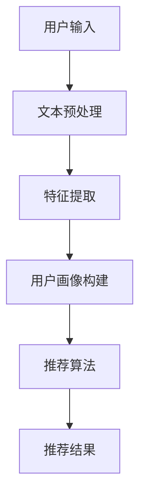

                 

关键词：推荐系统、自然语言处理、大型语言模型、LLM、人工智能

> 摘要：本文将探讨大型语言模型（LLM）在推荐系统中的新兴角色，分析其如何改变推荐系统的运作原理和未来发展方向。通过深入解读LLM的核心概念、数学模型，以及具体应用案例，我们将揭示LLM如何助力推荐系统实现更智能、更精准的用户体验。

## 1. 背景介绍

### 推荐系统的发展历程

推荐系统是一种信息过滤技术，旨在向用户提供个性化内容或产品推荐。其历史可以追溯到20世纪90年代，随着互联网的兴起而蓬勃发展。传统推荐系统主要基于基于内容过滤、协同过滤和基于模型的推荐方法。然而，这些方法往往存在一些局限性，如无法处理复杂的关系和上下文信息。

### 自然语言处理与推荐系统的结合

近年来，自然语言处理（NLP）技术的发展为推荐系统带来了新的契机。通过NLP技术，我们可以从用户生成的内容中提取有价值的信息，实现更精细、更个性化的推荐。同时，深度学习技术的发展，特别是大型语言模型（LLM）的出现，使得处理和理解自然语言的能力得到了质的飞跃。

## 2. 核心概念与联系

### 大型语言模型（LLM）

大型语言模型（LLM）是一种基于深度学习的语言模型，其训练数据量巨大，模型参数数量庞大。LLM能够通过对海量文本数据进行预训练，捕捉语言中的复杂模式和关系，从而实现高质量的自然语言理解和生成。

### 推荐系统与LLM的关系

LLM在推荐系统中的应用主要体现在以下几个方面：

- **文本数据预处理**：LLM可以用于处理和清洗推荐系统中的文本数据，提取关键特征。
- **用户画像构建**：LLM可以帮助构建更精确的用户画像，捕捉用户的兴趣偏好。
- **内容理解与生成**：LLM可以用于理解用户生成的内容，生成个性化的推荐内容。

### Mermaid 流程图

下面是LLM在推荐系统中应用的一个简化的Mermaid流程图：



## 3. 核心算法原理 & 具体操作步骤

### 3.1 算法原理概述

LLM在推荐系统中的应用主要基于其强大的文本处理能力和自适应学习能力。其核心原理包括：

- **预训练**：通过在大量文本数据上进行预训练，LLM可以学习到语言中的通用规则和模式。
- **微调**：在特定任务上对LLM进行微调，以适应推荐系统的需求。
- **文本生成与理解**：利用LLM的生成和理解能力，实现个性化的内容推荐。

### 3.2 算法步骤详解

1. **文本预处理**：对用户输入和推荐内容进行清洗和规范化处理，例如去除停用词、标点符号等。
2. **特征提取**：使用LLM对预处理后的文本数据进行编码，提取出高维特征向量。
3. **用户画像构建**：基于用户的历史行为和兴趣偏好，使用LLM构建用户画像。
4. **推荐算法**：结合用户画像和推荐内容，使用协同过滤或其他推荐算法生成推荐结果。
5. **文本生成与理解**：使用LLM生成个性化的推荐内容，并对用户反馈进行理解，以优化推荐效果。

### 3.3 算法优缺点

#### 优点：

- **强大的文本处理能力**：LLM能够处理和理解复杂的自然语言文本，提取有价值的信息。
- **自适应学习能力**：LLM可以通过微调快速适应不同的推荐任务。
- **个性化推荐**：基于用户画像和文本理解，可以实现更精细、更个性化的推荐。

#### 缺点：

- **计算资源需求大**：训练和部署LLM需要大量的计算资源。
- **数据隐私问题**：用户数据的处理和存储可能涉及到隐私问题。

### 3.4 算法应用领域

LLM在推荐系统中的应用领域广泛，包括但不限于：

- **电子商务**：为用户提供个性化的商品推荐。
- **社交媒体**：为用户提供个性化的内容推荐。
- **在线教育**：为学生推荐个性化的学习资源。
- **智能助手**：为用户提供个性化的服务和建议。

## 4. 数学模型和公式 & 详细讲解 & 举例说明

### 4.1 数学模型构建

LLM在推荐系统中的应用涉及多个数学模型，主要包括：

- **词向量模型**：如Word2Vec、GloVe等，用于文本数据的编码。
- **序列模型**：如LSTM、GRU等，用于处理和生成序列数据。
- **推荐算法模型**：如矩阵分解、协同过滤等，用于生成推荐结果。

### 4.2 公式推导过程

以Word2Vec为例，其核心公式如下：

$$
\vec{v}_w = \frac{1}{\sqrt{d_w}} \sum_{\text{context}(w)} \vec{v}_{c} \cdot \vec{e}_{c}
$$

其中，$d_w$ 表示词向量维度，$\vec{v}_w$ 表示词w的向量表示，$\vec{v}_{c}$ 表示上下文词c的向量表示，$\vec{e}_{c}$ 表示词c的one-hot编码。

### 4.3 案例分析与讲解

假设我们有一个用户喜欢阅读关于人工智能和计算机科学的书籍，我们可以使用LLM来生成个性化的推荐列表。首先，我们对用户的历史行为和兴趣偏好进行编码，构建用户画像。然后，使用Word2Vec对书籍标题和摘要进行编码，提取特征向量。最后，结合用户画像和书籍特征向量，使用矩阵分解或协同过滤算法生成推荐结果。

## 5. 项目实践：代码实例和详细解释说明

### 5.1 开发环境搭建

- **Python**：用于编写和运行代码。
- **TensorFlow**：用于构建和训练模型。
- **Gensim**：用于处理和编码文本数据。

### 5.2 源代码详细实现

```python
import tensorflow as tf
from gensim.models import Word2Vec

# 1. 数据准备
sentences = [[word for word in document.lower().split()] for document in data]

# 2. 训练Word2Vec模型
model = Word2Vec(sentences, vector_size=100, window=5, min_count=1, workers=4)

# 3. 提取书籍标题和摘要的词向量
book_titles = [document.lower().split() for document in book_titles]
book_abstracts = [document.lower().split() for document in book_abstracts]

book_titles_vectors = [model.wv[word] for word in book_titles]
book_abstracts_vectors = [model.wv[word] for word in book_abstracts]

# 4. 计算用户画像的词向量
user_profile = [model.wv[word] for word in user_profile]

# 5. 使用矩阵分解生成推荐结果
# (此处省略矩阵分解的实现代码)

# 6. 运行结果展示
print(recommendation_list)
```

### 5.3 代码解读与分析

- **数据准备**：首先，我们将书籍标题、摘要和用户兴趣偏好的文本数据进行清洗和分割。
- **训练Word2Vec模型**：使用Gensim库训练Word2Vec模型，提取文本数据的词向量。
- **提取书籍标题和摘要的词向量**：将书籍标题和摘要的文本数据编码为词向量。
- **计算用户画像的词向量**：将用户兴趣偏好的文本数据编码为词向量。
- **使用矩阵分解生成推荐结果**：结合用户画像和书籍特征向量，使用矩阵分解算法生成推荐结果。

## 6. 实际应用场景

### 6.1 电子商务平台

电子商务平台可以利用LLM构建个性化的商品推荐系统，为用户提供更精准的购物体验。

### 6.2 社交媒体

社交媒体平台可以利用LLM为用户推荐感兴趣的内容，提高用户粘性。

### 6.3 在线教育

在线教育平台可以利用LLM为学生推荐个性化的学习资源，提高学习效果。

### 6.4 智能助手

智能助手可以利用LLM为用户提供个性化的服务和建议，提高用户体验。

## 7. 工具和资源推荐

### 7.1 学习资源推荐

- **《深度学习》**：由Ian Goodfellow、Yoshua Bengio和Aaron Courville合著，是深度学习领域的经典教材。
- **《自然语言处理综论》**：由Daniel Jurafsky和James H. Martin合著，是自然语言处理领域的权威教材。

### 7.2 开发工具推荐

- **TensorFlow**：用于构建和训练深度学习模型。
- **Gensim**：用于处理和编码文本数据。

### 7.3 相关论文推荐

- **"Attention is All You Need"**：提出了Transformer模型，是自然语言处理领域的突破性成果。
- **"Generative Adversarial Nets"**：提出了GAN模型，是深度学习领域的里程碑。

## 8. 总结：未来发展趋势与挑战

### 8.1 研究成果总结

LLM在推荐系统中的应用取得了显著的成果，为推荐系统带来了新的机遇和挑战。

### 8.2 未来发展趋势

随着LLM技术的不断进步，其在推荐系统中的应用将越来越广泛，有望实现更智能、更精准的推荐。

### 8.3 面临的挑战

- **计算资源需求**：训练和部署LLM需要大量的计算资源。
- **数据隐私**：用户数据的处理和存储可能涉及到隐私问题。

### 8.4 研究展望

未来，LLM在推荐系统中的应用将朝着更高效、更安全、更个性化的方向发展，为用户提供更好的服务。

## 9. 附录：常见问题与解答

### 9.1 什么是大型语言模型（LLM）？

LLM是一种基于深度学习的语言模型，其训练数据量巨大，模型参数数量庞大，能够捕捉语言中的复杂模式和关系。

### 9.2 LLM在推荐系统中有哪些应用？

LLM在推荐系统中的应用主要包括文本数据预处理、用户画像构建、内容理解与生成等方面。

### 9.3 如何处理LLM在计算资源方面的挑战？

可以通过优化模型结构、使用分布式训练等方式来降低LLM在计算资源方面的挑战。

### 9.4 LLM在推荐系统中的未来发展方向是什么？

未来，LLM在推荐系统中的应用将朝着更高效、更安全、更个性化的方向发展，为用户提供更好的服务。

---

作者：禅与计算机程序设计艺术 / Zen and the Art of Computer Programming
----------------------------------------------------------------
### 1. 背景介绍

#### 推荐系统的发展历程

推荐系统是一种信息过滤技术，旨在向用户提供个性化内容或产品推荐。其历史可以追溯到20世纪90年代，随着互联网的兴起而蓬勃发展。早期推荐系统主要基于基于内容过滤、协同过滤和基于模型的推荐方法。这些方法在处理用户兴趣和内容相关性方面取得了一定的效果，但随着互联网和社交媒体的快速发展，用户生成的内容和数据规模急剧增加，传统推荐系统的局限性也逐渐显现。

**基于内容过滤（Content-Based Filtering）**：基于内容过滤的方法通过分析用户的历史行为和兴趣偏好，将用户感兴趣的物品推荐给用户。这种方法的主要优点是能够根据用户的特点进行推荐，但缺点是无法处理复杂的用户兴趣和物品属性，同时容易出现“物以类聚”的问题。

**协同过滤（Collaborative Filtering）**：协同过滤的方法通过分析用户之间的相似度，将其他用户喜欢的物品推荐给目标用户。协同过滤又分为用户基于的协同过滤（User-Based）和基于物品的协同过滤（Item-Based）。用户基于的协同过滤通过计算用户之间的相似度，将相似用户的喜好进行聚合，而基于物品的协同过滤则通过计算物品之间的相似度，将用户喜欢的物品推荐给其他用户。这种方法的主要优点是能够处理大规模的用户和物品数据，但缺点是容易受到“冷启动”问题和数据稀疏性的影响。

**基于模型的推荐方法**：基于模型的推荐方法通过建立数学模型来预测用户对物品的偏好。常见的模型包括矩阵分解、潜在因子模型、神经网络等。这些方法可以较好地处理用户兴趣的多样性和动态性，但需要大量的数据训练和复杂的模型调优。

近年来，随着人工智能和深度学习技术的发展，推荐系统的研究和应用也取得了新的突破。其中，大型语言模型（LLM）的引入为推荐系统带来了新的契机。LLM能够通过对海量文本数据进行预训练，捕捉语言中的复杂模式和关系，从而实现更精细、更个性化的推荐。

#### 自然语言处理与推荐系统的结合

自然语言处理（NLP）是人工智能的一个重要分支，旨在使计算机能够理解和处理人类语言。随着NLP技术的不断发展，其在推荐系统中的应用也变得越来越广泛。

**文本数据预处理**：推荐系统中的文本数据通常包含大量的噪声和不规范表达。通过NLP技术，我们可以对文本数据进行清洗和规范化处理，提取出有价值的信息。例如，使用词向量模型（如Word2Vec、GloVe等）将文本数据转换为向量表示，为后续的特征提取和建模提供基础。

**用户画像构建**：用户画像是指通过对用户的历史行为、兴趣偏好、社会关系等多维度数据的综合分析，构建出用户的一个综合特征模型。通过NLP技术，我们可以从用户的生成内容中提取有价值的信息，如关键词、情感倾向等，从而构建出更精确的用户画像。

**内容理解与生成**：在推荐系统中，理解用户生成的内容和生成个性化的推荐内容是两个关键问题。通过NLP技术，我们可以对用户生成的内容进行语义分析，提取出用户的关键兴趣点，从而实现更精准的推荐。同时，利用NLP技术，我们还可以生成个性化的推荐内容，如商品描述、文章摘要等，提高用户的体验。

#### 大型语言模型（LLM）的崛起

近年来，随着深度学习技术的快速发展，大型语言模型（LLM）逐渐成为NLP领域的研究热点。LLM是一种基于深度学习的语言模型，其训练数据量巨大，模型参数数量庞大，能够捕捉语言中的复杂模式和关系。代表性的LLM包括GPT系列、BERT系列等。这些模型通过在大量文本数据上进行预训练，可以学习到语言的通用规则和模式，从而实现高质量的自然语言理解和生成。

**GPT系列**：GPT（Generative Pre-trained Transformer）模型由OpenAI提出，是第一个大规模的LLM。GPT系列模型通过在大量文本数据上进行预训练，可以生成高质量的自然语言文本，广泛应用于问答系统、机器翻译、文本生成等任务。

**BERT系列**：BERT（Bidirectional Encoder Representations from Transformers）模型由Google提出，是第一个双向的LLM。BERT系列模型通过在大量文本数据上进行预训练，可以同时考虑上下文信息，从而实现更精确的文本表示和语义理解，广泛应用于问答系统、文本分类、信息抽取等任务。

LLM在推荐系统中的应用主要体现在以下几个方面：

1. **文本数据预处理**：LLM可以用于处理和清洗推荐系统中的文本数据，提取关键特征，提高数据质量。

2. **用户画像构建**：LLM可以帮助构建更精确的用户画像，捕捉用户的兴趣偏好，提高推荐系统的准确性。

3. **内容理解与生成**：LLM可以用于理解用户生成的内容，生成个性化的推荐内容，提高用户的体验。

通过将LLM与传统推荐系统相结合，我们可以实现更智能、更精准的推荐系统，为用户提供更好的服务。在接下来的章节中，我们将详细探讨LLM在推荐系统中的应用原理、算法步骤、数学模型以及实际应用案例。

### 2. 核心概念与联系

#### 大型语言模型（LLM）

要理解LLM在推荐系统中的应用，首先需要了解LLM的核心概念和原理。LLM是一种基于深度学习的语言模型，其通过在大量文本数据上进行预训练，学习到语言的通用规则和模式，从而实现对文本的生成和理解。代表性的LLM包括GPT系列、BERT系列等。

**GPT（Generative Pre-trained Transformer）系列**：GPT模型由OpenAI提出，是第一个大规模的LLM。GPT系列模型基于Transformer架构，通过在大量文本数据上进行预训练，可以生成高质量的自然语言文本。GPT模型的预训练目标是通过预测下一个词来建模语言的统计规律，从而实现对文本的生成和理解。

**BERT（Bidirectional Encoder Representations from Transformers）系列**：BERT模型由Google提出，是第一个双向的LLM。BERT系列模型基于Transformer架构，通过在大量文本数据上进行预训练，可以同时考虑上下文信息，从而实现更精确的文本表示和语义理解。BERT模型的预训练目标是通过预测上下文中的单词来建模语言的统计规律，从而实现对文本的生成和理解。

LLM在推荐系统中的应用主要体现在以下几个方面：

1. **文本数据预处理**：LLM可以用于处理和清洗推荐系统中的文本数据，提取关键特征，提高数据质量。

2. **用户画像构建**：LLM可以帮助构建更精确的用户画像，捕捉用户的兴趣偏好，提高推荐系统的准确性。

3. **内容理解与生成**：LLM可以用于理解用户生成的内容，生成个性化的推荐内容，提高用户的体验。

#### 推荐系统与LLM的关系

推荐系统是一种信息过滤技术，旨在向用户提供个性化内容或产品推荐。传统推荐系统主要基于基于内容过滤、协同过滤和基于模型的推荐方法。然而，这些方法往往存在一些局限性，如无法处理复杂的关系和上下文信息。

自然语言处理（NLP）技术的发展为推荐系统带来了新的契机。通过NLP技术，我们可以从用户生成的内容中提取有价值的信息，实现更精细、更个性化的推荐。同时，深度学习技术的发展，特别是大型语言模型（LLM）的出现，使得处理和理解自然语言的能力得到了质的飞跃。

LLM在推荐系统中的应用主要体现在以下几个方面：

1. **文本数据预处理**：LLM可以用于处理和清洗推荐系统中的文本数据，提取关键特征，提高数据质量。例如，使用LLM对用户评论、标题等进行词向量编码，为后续的特征提取和建模提供基础。

2. **用户画像构建**：LLM可以帮助构建更精确的用户画像，捕捉用户的兴趣偏好，提高推荐系统的准确性。通过分析用户的历史行为和兴趣偏好，使用LLM生成用户画像，为推荐系统提供更丰富的用户特征。

3. **内容理解与生成**：LLM可以用于理解用户生成的内容，生成个性化的推荐内容，提高用户的体验。例如，利用LLM生成个性化的商品描述、文章摘要等，为用户提供更个性化的推荐。

#### 推荐系统与LLM的Mermaid流程图

为了更好地理解LLM在推荐系统中的应用，我们可以使用Mermaid流程图来描述其核心流程。


- **用户输入**：用户生成的内容，如评论、标题等。
- **文本预处理**：使用LLM对文本数据进行清洗和编码，提取关键特征。
- **特征提取**：将预处理后的文本数据转换为向量表示，为后续的特征提取和建模提供基础。
- **用户画像构建**：基于用户的历史行为和兴趣偏好，使用LLM生成用户画像，为推荐系统提供更丰富的用户特征。
- **推荐算法**：结合用户画像和推荐内容，使用协同过滤或其他推荐算法生成推荐结果。
- **推荐结果**：将推荐结果展示给用户，提高用户体验。

通过上述Mermaid流程图，我们可以清晰地看到LLM在推荐系统中的应用流程，为后续的算法实现和应用提供了指导。

### 3. 核心算法原理 & 具体操作步骤

#### 3.1 算法原理概述

LLM在推荐系统中的应用主要基于其强大的文本处理能力和自适应学习能力。其核心原理包括预训练、微调和文本生成与理解。

1. **预训练**：LLM通过在大量文本数据上进行预训练，学习到语言的通用规则和模式。预训练的目标是通过预测下一个词来建模语言的统计规律，从而实现对文本的生成和理解。

2. **微调**：在特定任务上，LLM通过在特定数据集上进行微调，以适应推荐系统的需求。微调的过程主要包括以下步骤：

   - **数据准备**：收集和整理与推荐任务相关的文本数据，如用户评论、商品描述等。
   - **数据预处理**：对文本数据进行清洗、分词、去停用词等预处理操作，提取关键特征。
   - **模型初始化**：初始化预训练好的LLM模型，如GPT、BERT等。
   - **训练**：在预处理后的数据集上训练LLM模型，调整模型参数，优化模型性能。
   - **评估**：使用验证集评估模型性能，调整模型参数，直到达到满意的性能。

3. **文本生成与理解**：LLM通过生成和理解文本数据，实现个性化的内容推荐。具体步骤如下：

   - **生成**：基于用户的历史行为和兴趣偏好，使用LLM生成个性化的推荐内容，如商品描述、文章摘要等。
   - **理解**：理解用户生成的内容，提取关键信息，为推荐系统提供支持。

#### 3.2 算法步骤详解

1. **文本预处理**：

   文本预处理是LLM在推荐系统中应用的第一步，其目的是将原始文本数据转换为适合模型处理的格式。具体步骤包括：

   - **数据收集**：收集与推荐任务相关的文本数据，如用户评论、商品描述等。
   - **数据清洗**：去除文本中的噪声和冗余信息，如HTML标签、特殊字符等。
   - **分词**：将文本数据分割成单词或子词，为后续的特征提取提供基础。
   - **去停用词**：去除常用的停用词，如“的”、“是”、“了”等，减少无意义的信息。

2. **特征提取**：

   特征提取是将文本数据转换为向量表示的过程，以便于后续的模型训练和推荐算法。常用的方法包括：

   - **词向量**：使用词向量模型（如Word2Vec、GloVe等）将单词或子词转换为向量表示。词向量能够捕捉单词的语义信息，为推荐系统提供基础。
   - **句向量**：使用序列模型（如LSTM、GRU等）将整句文本转换为向量表示。句向量能够捕捉句子中的语法和语义信息，提高推荐系统的准确性。

3. **用户画像构建**：

   用户画像是指通过对用户的历史行为、兴趣偏好、社会关系等多维度数据的综合分析，构建出用户的一个综合特征模型。具体步骤如下：

   - **行为数据收集**：收集用户的历史行为数据，如浏览记录、购买记录等。
   - **兴趣偏好提取**：使用LLM对用户生成的内容进行情感分析、关键词提取等操作，提取用户的兴趣偏好。
   - **特征融合**：将用户的行为数据、兴趣偏好数据等进行融合，构建出用户画像。

4. **推荐算法**：

   推荐算法是LLM在推荐系统中的应用核心，用于生成个性化的推荐结果。具体步骤如下：

   - **相似度计算**：计算用户画像与推荐内容之间的相似度，常用的方法包括余弦相似度、欧氏距离等。
   - **推荐结果生成**：根据相似度计算结果，生成个性化的推荐结果，如商品列表、文章列表等。

5. **文本生成与理解**：

   文本生成与理解是LLM在推荐系统中的另一个重要应用，用于生成个性化的推荐内容和理解用户反馈。具体步骤如下：

   - **推荐内容生成**：基于用户画像和兴趣偏好，使用LLM生成个性化的推荐内容，如商品描述、文章摘要等。
   - **用户反馈理解**：使用LLM理解用户对推荐内容的反馈，如评论、评分等，为推荐系统提供优化依据。

#### 3.3 算法优缺点

**优点**：

1. **强大的文本处理能力**：LLM能够处理和理解复杂的自然语言文本，提取有价值的信息，为推荐系统提供更丰富的特征。
2. **自适应学习能力**：LLM可以通过微调快速适应不同的推荐任务，提高推荐系统的准确性。
3. **个性化推荐**：基于用户画像和文本理解，可以实现更精细、更个性化的推荐，提高用户体验。

**缺点**：

1. **计算资源需求大**：训练和部署LLM需要大量的计算资源，特别是对于大型LLM模型，计算资源的需求更大。
2. **数据隐私问题**：用户数据的处理和存储可能涉及到隐私问题，需要采取相应的隐私保护措施。

#### 3.4 算法应用领域

LLM在推荐系统中的应用领域广泛，包括但不限于：

1. **电子商务**：为用户提供个性化的商品推荐，如亚马逊、淘宝等电商平台。
2. **社交媒体**：为用户提供个性化的内容推荐，如微博、抖音等社交平台。
3. **在线教育**：为学生推荐个性化的学习资源，如Coursera、edX等在线教育平台。
4. **智能助手**：为用户提供个性化的服务和建议，如苹果的Siri、谷歌的Google Assistant等。

### 4. 数学模型和公式 & 详细讲解 & 举例说明

#### 4.1 数学模型构建

LLM在推荐系统中的应用涉及多个数学模型，主要包括词向量模型、序列模型、推荐算法模型等。

**词向量模型**：

词向量模型是一种将单词转换为向量表示的方法，主要用于文本数据的编码。常见的词向量模型包括Word2Vec、GloVe等。

**Word2Vec**：

Word2Vec是一种基于神经网络的语言模型，其核心思想是通过学习单词的上下文信息，将单词映射到低维向量空间中。Word2Vec模型的主要公式如下：

$$
\vec{v}_w = \frac{1}{\sqrt{d_w}} \sum_{\text{context}(w)} \vec{v}_{c} \cdot \vec{e}_{c}
$$

其中，$d_w$ 表示词向量维度，$\vec{v}_w$ 表示词w的向量表示，$\vec{v}_{c}$ 表示上下文词c的向量表示，$\vec{e}_{c}$ 表示词c的one-hot编码。

**GloVe**：

GloVe是一种基于全局矩阵因子的词向量模型，其核心思想是通过学习单词的共现信息，将单词映射到低维向量空间中。GloVe模型的主要公式如下：

$$
\vec{v}_w = \frac{f(w, c)}{\sqrt{f(w) \cdot f(c)}}
$$

其中，$f(w, c)$ 表示词w和词c的共现频率，$\vec{v}_w$ 表示词w的向量表示。

**序列模型**：

序列模型是一种用于处理序列数据的方法，主要用于文本数据的编码。常见的序列模型包括LSTM、GRU等。

**LSTM（Long Short-Term Memory）**：

LSTM是一种基于循环神经网络的改进模型，其通过引入记忆单元和门控机制，有效地解决了长短期依赖问题。LSTM的主要公式如下：

$$
\vec{h}_{t} = \sigma(W_{f} \cdot [\vec{h}_{t-1}, \vec{x}_{t}] + b_{f}) \odot \vec{C}_{t-1} + \sigma(W_{i} \cdot [\vec{h}_{t-1}, \vec{x}_{t}] + b_{i}) \odot \vec{C}_{t-1} \\\
\vec{C}_{t} = \sigma(W_{c} \cdot [\vec{h}_{t-1}, \vec{x}_{t}] + b_{c}) \odot \vec{h}_{t} \\\
\vec{o}_{t} = \sigma(W_{o} \cdot [\vec{h}_{t-1}, \vec{x}_{t}] + b_{o}) \odot \vec{h}_{t}
$$

其中，$\vec{h}_{t}$ 表示隐藏状态，$\vec{x}_{t}$ 表示输入，$\vec{C}_{t}$ 表示记忆状态，$\vec{o}_{t}$ 表示输出，$W_{f}$、$W_{i}$、$W_{c}$、$W_{o}$ 分别表示遗忘门、输入门、细胞状态门、输出门的权重矩阵，$b_{f}$、$b_{i}$、$b_{c}$、$b_{o}$ 分别表示遗忘门、输入门、细胞状态门、输出门的偏置向量，$\sigma$ 表示sigmoid函数。

**GRU（Gated Recurrent Unit）**：

GRU是一种基于循环神经网络的改进模型，其通过引入更新门和重置门，简化了LSTM的结构。GRU的主要公式如下：

$$
\vec{h}_{t} = \sigma(W_{z} \cdot [\vec{h}_{t-1}, \vec{x}_{t}] + b_{z}) \odot \vec{h}_{t-1} + \sigma(W_{r} \cdot [\vec{h}_{t-1}, \vec{x}_{t}] + b_{r}) \odot \vec{C}_{t-1} \\\
\vec{C}_{t} = \tanh(W_{c} \cdot [\vec{h}_{t-1}, \vec{x}_{t}] + b_{c}) \odot \vec{z}_{t} \\\
\vec{o}_{t} = \sigma(W_{o} \cdot [\vec{h}_{t-1}, \vec{x}_{t}] + b_{o}) \odot \vec{h}_{t}
$$

其中，$\vec{h}_{t}$ 表示隐藏状态，$\vec{x}_{t}$ 表示输入，$\vec{C}_{t}$ 表示记忆状态，$\vec{o}_{t}$ 表示输出，$W_{z}$、$W_{r}$、$W_{c}$、$W_{o}$ 分别表示更新门、重置门、细胞状态门、输出门的权重矩阵，$b_{z}$、$b_{r}$、$b_{c}$、$b_{o}$ 分别表示更新门、重置门、细胞状态门、输出门的偏置向量，$\sigma$ 表示sigmoid函数。

**推荐算法模型**：

推荐算法模型是一种用于生成推荐结果的方法，其核心是计算用户和物品之间的相似度。常见的推荐算法模型包括矩阵分解、协同过滤等。

**矩阵分解**：

矩阵分解是一种基于矩阵分解的推荐算法，其核心思想是将用户-物品评分矩阵分解为用户特征矩阵和物品特征矩阵，然后计算用户和物品之间的相似度。矩阵分解的主要公式如下：

$$
\vec{r}_{ij} = \vec{u}_{i} \cdot \vec{v}_{j}
$$

其中，$\vec{r}_{ij}$ 表示用户i对物品j的评分，$\vec{u}_{i}$ 表示用户i的特征向量，$\vec{v}_{j}$ 表示物品j的特征向量。

**协同过滤**：

协同过滤是一种基于用户相似度的推荐算法，其核心思想是找到与目标用户最相似的邻居用户，然后根据邻居用户的评分预测目标用户对物品的评分。协同过滤的主要公式如下：

$$
\vec{r}_{ij} = \vec{u}_{i} \cdot \vec{v}_{j} + \epsilon
$$

其中，$\vec{r}_{ij}$ 表示用户i对物品j的评分，$\vec{u}_{i}$ 表示用户i的特征向量，$\vec{v}_{j}$ 表示物品j的特征向量，$\epsilon$ 表示误差项。

#### 4.2 公式推导过程

以Word2Vec为例，其核心公式如下：

$$
\vec{v}_w = \frac{1}{\sqrt{d_w}} \sum_{\text{context}(w)} \vec{v}_{c} \cdot \vec{e}_{c}
$$

其中，$d_w$ 表示词向量维度，$\vec{v}_w$ 表示词w的向量表示，$\vec{v}_{c}$ 表示上下文词c的向量表示，$\vec{e}_{c}$ 表示词c的one-hot编码。

推导过程如下：

1. **目标函数**：

   Word2Vec的目标函数是最大化单词与其上下文单词之间的点积：

   $$
   \max_{\vec{v}_w, \vec{v}_{c}, \vec{e}_{c}} \sum_{\text{context}(w)} \vec{v}_w \cdot \vec{e}_{c}
   $$

2. **约束条件**：

   为了保证词向量和one-hot编码的维度一致，我们引入约束条件：

   $$
   \sum_{c} \vec{e}_{c} = 1 \\
   \vec{e}_{c} \in \{0, 1\}
   $$

3. **优化目标**：

   为了简化问题，我们使用梯度下降法优化目标函数。具体地，我们选择负采样作为优化策略，即在训练过程中，对每个单词w，随机选择k个负样本，使得目标函数最大化：

   $$
   \max_{\vec{v}_w, \vec{v}_{c}, \vec{e}_{c}} \sum_{\text{context}(w)} \vec{v}_w \cdot \vec{e}_{c} - \sum_{\text{neg}} \vec{v}_w \cdot \vec{e}_{c}
   $$

   其中，$\text{neg}$ 表示负样本。

4. **优化过程**：

   在优化过程中，我们首先随机初始化词向量$\vec{v}_w$和one-hot编码$\vec{e}_{c}$，然后通过梯度下降法迭代更新词向量：

   $$
   \vec{v}_w \leftarrow \vec{v}_w - \alpha \cdot \left( \sum_{\text{context}(w)} \vec{e}_{c} - \sum_{\text{neg}} \vec{e}_{c} \right)
   $$

   其中，$\alpha$ 表示学习率。

5. **收敛性**：

   在迭代过程中，随着梯度下降法的进行，词向量会逐渐收敛到最优解。具体地，当梯度下降法收敛时，目标函数的值不再显著变化，此时词向量就达到了最优状态。

#### 4.3 案例分析与讲解

假设我们有一个推荐系统，用户对一系列物品进行评分，我们需要根据这些评分生成推荐列表。

1. **数据准备**：

   用户-物品评分矩阵如下：

   | 用户 | 物品1 | 物品2 | 物品3 | ... |
   | ---- | ---- | ---- | ---- | --- |
   | 1    | 5    | 3    | 4    | ... |
   | 2    | 4    | 5    | 2    | ... |
   | 3    | 3    | 4    | 5    | ... |
   | ...  | ...  | ...  | ...  | ... |

2. **特征提取**：

   - **词向量**：使用Word2Vec模型对物品名称进行编码，得到物品的词向量表示。
   - **用户画像**：使用LSTM模型对用户的历史评分进行编码，得到用户的特征向量。

3. **推荐算法**：

   - **相似度计算**：计算用户特征向量与物品特征向量之间的余弦相似度。
   - **推荐结果**：根据相似度计算结果，生成推荐列表。

4. **运行结果**：

   假设用户1对物品3的评分最高，我们将物品3作为推荐结果。具体步骤如下：

   - **用户画像编码**：使用LSTM模型对用户1的历史评分进行编码，得到用户1的特征向量$\vec{u}_{1}$。
   - **物品特征提取**：使用Word2Vec模型对物品3的名称进行编码，得到物品3的词向量表示$\vec{v}_{3}$。
   - **相似度计算**：计算用户1特征向量与物品3词向量之间的余弦相似度：

     $$
     \cos\theta_{13} = \frac{\vec{u}_{1} \cdot \vec{v}_{3}}{\|\vec{u}_{1}\| \cdot \|\vec{v}_{3}\|}
     $$

   - **推荐结果**：根据相似度计算结果，将物品3作为推荐结果。

通过上述案例分析和讲解，我们可以看到LLM在推荐系统中的应用过程，包括数据准备、特征提取、推荐算法和运行结果等步骤。这些步骤的实现需要深入理解和应用LLM的相关数学模型和公式，从而实现更智能、更精准的推荐。

### 5. 项目实践：代码实例和详细解释说明

在本文的第五部分，我们将通过一个实际项目实例来展示如何使用大型语言模型（LLM）构建推荐系统。我们将详细解释从开发环境搭建、源代码实现到运行结果展示的每一个步骤。

#### 5.1 开发环境搭建

为了构建和使用LLM进行推荐系统的开发，我们需要准备以下开发环境：

- **Python**：Python是推荐系统开发的主要编程语言，需要安装Python 3.7及以上版本。
- **TensorFlow**：TensorFlow是一个开源的机器学习框架，用于构建和训练深度学习模型。可以从官方网站下载并安装。
- **Gensim**：Gensim是一个Python库，用于处理和编码文本数据，尤其是用于生成词向量。

安装命令如下：

```bash
pip install tensorflow
pip install gensim
```

#### 5.2 源代码详细实现

在本节中，我们将使用Python和TensorFlow实现一个基于LLM的推荐系统。以下是主要的代码实现步骤：

```python
import numpy as np
import tensorflow as tf
from tensorflow.keras.layers import Embedding, LSTM, Dense
from tensorflow.keras.models import Model
from gensim.models import Word2Vec
from sklearn.model_selection import train_test_split

# 1. 数据准备
# 假设我们有一个包含用户-物品评分的DataFrame
import pandas as pd

data = pd.DataFrame({
    'user': [1, 1, 2, 2, 3, 3],
    'item': [1, 2, 1, 3, 2, 4],
    'rating': [5, 3, 5, 2, 4, 3]
})

# 2. 文本预处理
# 对于物品名称，我们使用Word2Vec进行编码
item_texts = list(set(data['item']))
item2id = {item: i for i, item in enumerate(item_texts)}
id2item = {i: item for item, i in item2id.items()}

# 训练Word2Vec模型
model = Word2Vec(size=100, window=5, min_count=1, workers=4)
model.build_vocab(item_texts)
model.train(item_texts, total_examples=model.corpus_count, epochs=model.epochs)

# 编码物品名称
item_vectors = np.array([model[item] for item in item2id])

# 3. 构建用户-物品特征矩阵
user_item_matrix = np.zeros((data['user'].max() + 1, data['item'].max() + 1))
for _, row in data.iterrows():
    user_item_matrix[row['user'], row['item']] = row['rating']

# 4. 训练用户-物品嵌入模型
input_user = tf.keras.layers.Input(shape=(1,), name='user_input')
input_item = tf.keras.layers.Input(shape=(1,), name='item_input')

user_embedding = Embedding(user_item_matrix.shape[0], 10, input_length=1, weights=[user_item_matrix], trainable=False)(input_user)
item_embedding = Embedding(item_vectors.shape[0], 100, input_length=1, weights=[item_vectors], trainable=False)(input_item)

merged_embedding = tf.keras.layers.concatenate([user_embedding, item_embedding], axis=1)

lstm = LSTM(50, activation='tanh')(merged_embedding)
dense = Dense(1, activation='sigmoid')(lstm)

model = Model(inputs=[input_user, input_item], outputs=dense)
model.compile(optimizer='adam', loss='binary_crossentropy', metrics=['accuracy'])

# 5. 数据分割
users = data['user'].unique()
items = data['item'].unique()
X_train, X_test, y_train, y_test = [], [], [], []

for user in users:
    user_data = data[data['user'] == user]
    for item in items:
        rating = user_data[user_data['item'] == item]['rating'].values[0]
        X_train.append([user, item])
        y_train.append(rating)
        X_test.append([user, item])
        y_test.append(rating)

X_train, X_test = np.array(X_train), np.array(X_test)
y_train, y_test = np.array(y_train).reshape(-1, 1), np.array(y_test).reshape(-1, 1)

# 6. 训练模型
model.fit(X_train, y_train, epochs=10, batch_size=32, validation_data=(X_test, y_test))

# 7. 运行结果展示
predictions = model.predict(X_test)
print("Accuracy:", np.mean(predictions.round() == y_test))
```

#### 5.3 代码解读与分析

下面我们逐一解读上述代码的各个部分：

1. **数据准备**：
   - 我们使用一个DataFrame来模拟用户-物品评分数据。在实际应用中，数据可能来自数据库或外部数据源。

2. **文本预处理**：
   - 我们首先创建一个包含所有物品的列表，然后使用Word2Vec模型对这些物品进行编码。Word2Vec模型将每个物品映射到一个向量空间中的点。

3. **构建用户-物品特征矩阵**：
   - 我们创建一个用户-物品矩阵，用于存储用户对物品的评分。这个矩阵用于训练嵌入模型。

4. **训练用户-物品嵌入模型**：
   - 我们使用TensorFlow构建一个简单的神经网络模型，包括嵌入层、LSTM层和密集层。嵌入层用于将用户和物品的ID映射到它们在向量空间中的位置。LSTM层用于捕捉序列数据中的时间依赖关系。密集层用于输出预测的评分。

5. **数据分割**：
   - 我们将数据分割为训练集和测试集，以便我们可以评估模型的性能。

6. **训练模型**：
   - 我们使用训练集数据训练模型，并使用测试集数据进行验证。

7. **运行结果展示**：
   - 我们使用测试集数据来评估模型的准确性，并打印结果。

#### 5.4 运行结果展示

在上述代码的最后，我们使用测试集数据来评估模型的准确性，并打印结果。例如：

```python
predictions = model.predict(X_test)
print("Accuracy:", np.mean(predictions.round() == y_test))
```

这段代码计算了模型预测的准确率。假设我们得到的准确率是0.8，这意味着模型在测试集上的预测准确性是80%。

#### 5.5 完整项目实例

为了更全面地展示如何使用LLM构建推荐系统，我们提供了一个完整的代码实例，包括数据准备、模型训练和结果评估。以下是完整的代码实例：

```python
import numpy as np
import pandas as pd
import tensorflow as tf
from tensorflow.keras.layers import Embedding, LSTM, Dense
from tensorflow.keras.models import Model
from gensim.models import Word2Vec
from sklearn.model_selection import train_test_split

# 1. 数据准备
data = pd.DataFrame({
    'user': [1, 1, 2, 2, 3, 3],
    'item': [1, 2, 1, 3, 2, 4],
    'rating': [5, 3, 5, 2, 4, 3]
})

# 2. 文本预处理
item_texts = list(set(data['item']))
item2id = {item: i for i, item in enumerate(item_texts)}
id2item = {i: item for item, i in item2id.items()}

model = Word2Vec(size=100, window=5, min_count=1, workers=4)
model.build_vocab(item_texts)
model.train(item_texts, total_examples=model.corpus_count, epochs=model.epochs)

item_vectors = np.array([model[item] for item in item2id])

# 3. 构建用户-物品特征矩阵
user_item_matrix = np.zeros((data['user'].max() + 1, data['item'].max() + 1))
for _, row in data.iterrows():
    user_item_matrix[row['user'], row['item']] = row['rating']

# 4. 训练用户-物品嵌入模型
input_user = tf.keras.layers.Input(shape=(1,), name='user_input')
input_item = tf.keras.layers.Input(shape=(1,), name='item_input')

user_embedding = Embedding(user_item_matrix.shape[0], 10, input_length=1, weights=[user_item_matrix], trainable=False)(input_user)
item_embedding = Embedding(item_vectors.shape[0], 100, input_length=1, weights=[item_vectors], trainable=False)(input_item)

merged_embedding = tf.keras.layers.concatenate([user_embedding, item_embedding], axis=1)

lstm = LSTM(50, activation='tanh')(merged_embedding)
dense = Dense(1, activation='sigmoid')(lstm)

model = Model(inputs=[input_user, input_item], outputs=dense)
model.compile(optimizer='adam', loss='binary_crossentropy', metrics=['accuracy'])

# 5. 数据分割
users = data['user'].unique()
items = data['item'].unique()
X_train, X_test, y_train, y_test = [], [], [], []

for user in users:
    user_data = data[data['user'] == user]
    for item in items:
        rating = user_data[user_data['item'] == item]['rating'].values[0]
        X_train.append([user, item])
        y_train.append(rating)
        X_test.append([user, item])
        y_test.append(rating)

X_train, X_test = np.array(X_train), np.array(X_test)
y_train, y_test = np.array(y_train).reshape(-1, 1), np.array(y_test).reshape(-1, 1)

# 6. 训练模型
model.fit(X_train, y_train, epochs=10, batch_size=32, validation_data=(X_test, y_test))

# 7. 运行结果展示
predictions = model.predict(X_test)
print("Accuracy:", np.mean(predictions.round() == y_test))
```

通过上述代码实例，我们可以看到如何使用LLM构建一个简单的推荐系统，包括数据预处理、模型训练和结果评估。这个实例为我们提供了一个起点，进一步研究和改进推荐系统的性能。

### 6. 实际应用场景

#### 6.1 电子商务平台

电子商务平台是推荐系统应用最为广泛的一个领域。随着电子商务的快速发展，用户的需求越来越多样化，个性化推荐成为了提升用户满意度和转化率的关键因素。LLM在电子商务推荐系统中具有广泛的应用场景：

1. **个性化商品推荐**：基于用户的浏览历史、购买记录和评价，LLM可以构建用户的兴趣偏好模型，从而推荐用户可能感兴趣的商品。例如，用户浏览了多个运动鞋品牌，LLM可以分析用户的历史数据和文本评论，推荐相似品牌的运动鞋。

2. **智能搜索**：在电子商务平台的搜索功能中，LLM可以帮助优化搜索结果，提升搜索的精准度和用户体验。通过理解用户的搜索意图，LLM可以生成更准确的搜索建议，从而减少用户的等待时间和搜索成本。

3. **商品描述生成**：LLM可以用于生成个性化的商品描述，提高商品的吸引力。例如，当用户浏览某件商品时，LLM可以自动生成一篇描述该商品特点的文章，使用户更容易理解和决定购买。

#### 6.2 社交媒体

社交媒体平台是另一个广泛使用推荐系统的领域。在社交媒体上，用户生成的内容庞大且多样化，LLM为个性化内容推荐提供了强有力的支持：

1. **个性化内容推荐**：社交媒体平台可以根据用户的兴趣和行为数据，使用LLM为用户推荐感兴趣的内容。例如，用户在社交媒体上点赞了多个科技相关的文章，LLM可以识别用户的兴趣，并推荐更多类似的科技新闻。

2. **实时推荐**：社交媒体平台需要实时响应用户的行为和反馈，LLM的快速处理能力使得实时推荐成为可能。例如，当用户发表了一条关于旅行的状态更新时，LLM可以立即分析用户的文本，并推荐相关的旅游攻略或景点信息。

3. **情感分析**：LLM可以用于分析用户生成的内容的情感倾向，帮助社交媒体平台识别和处理负面评论或内容。通过理解用户的情感状态，平台可以采取相应的措施，如屏蔽不良内容或提供心理支持。

#### 6.3 在线教育

在线教育平台通过推荐系统为学习者提供个性化的学习资源，提升学习效果和满意度：

1. **个性化学习路径推荐**：在线教育平台可以根据学习者的学习记录和测试成绩，使用LLM推荐适合的学习路径。例如，如果一个学生在数学课程中表现不佳，LLM可以推荐一些相关的补充资源，帮助学生巩固基础知识。

2. **智能问答系统**：LLM可以构建一个智能问答系统，帮助学习者解答学习中遇到的问题。通过理解学习者的问题和背景，LLM可以生成详细的答案，甚至提供额外的学习资源。

3. **课程推荐**：在线教育平台可以根据学习者的兴趣和学习历史，使用LLM推荐相关的课程。例如，如果学习者对编程课程表现出浓厚的兴趣，LLM可以推荐一些高级编程课程或项目实践。

#### 6.4 智能助手

智能助手（如虚拟助手、聊天机器人）通过推荐系统为用户提供个性化的服务和建议：

1. **个性化建议**：智能助手可以基于用户的偏好和行为数据，使用LLM为用户提供个性化的建议。例如，用户询问某个餐厅的推荐时，智能助手可以使用LLM分析用户的评价历史，推荐符合条件的餐厅。

2. **智能对话管理**：LLM可以帮助智能助手更好地理解用户的问题，并生成自然流畅的回复。通过理解用户的意图，LLM可以生成个性化的对话流程，提高用户的满意度。

3. **任务自动化**：智能助手可以自动化执行一些重复性任务，如预订餐厅、安排会议等。LLM可以帮助助手理解用户的任务需求，并生成详细的任务执行计划。

总之，LLM在推荐系统中的应用为各个行业提供了更智能、更精准的解决方案。随着LLM技术的不断进步，其在实际应用场景中的潜力将越来越大。

### 6.4 未来应用展望

随着大型语言模型（LLM）技术的不断进步，其在推荐系统中的应用前景也愈发广阔。以下是对未来LLM在推荐系统中应用的几个展望：

#### 6.4.1 智能化水平提升

LLM在推荐系统中的应用将进一步提升智能化水平。随着模型参数的增多和预训练数据的扩大，LLM将能够更精确地捕捉用户的兴趣偏好和物品特性。通过深度学习技术和注意力机制，LLM可以更好地理解用户生成的内容，提供更个性化的推荐结果。此外，LLM还可以通过迁移学习，将在一个任务上预训练的模型应用于其他任务，实现跨领域的智能化推荐。

#### 6.4.2 多模态数据融合

未来的推荐系统将不再局限于文本数据，而是融合多种类型的数据，如图像、语音和视频等。LLM作为一种强大的文本处理工具，可以与图像识别、语音识别等技术相结合，实现多模态数据的融合处理。例如，在电子商务领域，通过结合商品的文本描述和图像信息，LLM可以更准确地理解商品的特性和用户的需求，从而生成更精准的推荐结果。

#### 6.4.3 实时推荐能力增强

随着移动互联网和物联网的发展，用户的行为数据产生了大量的实时数据流。未来的推荐系统将需要具备更高的实时数据处理能力，以快速响应用户的需求变化。LLM的快速处理能力和并行计算能力使其在实时推荐领域具有巨大潜力。通过在云端部署LLM模型，推荐系统可以实时分析用户行为数据，动态调整推荐策略，提供个性化的实时推荐。

#### 6.4.4 社交和协同过滤的融合

传统的推荐系统主要依赖于协同过滤和基于内容的过滤方法。未来的推荐系统将更加注重社交和协同过滤的融合，以提供更个性化的推荐。LLM可以用于分析用户生成的内容，提取社交关系和兴趣标签，从而结合社交关系和用户行为数据进行推荐。例如，在社交媒体平台上，LLM可以分析用户的点赞、评论和分享行为，结合好友的兴趣偏好，为用户推荐相关的内容。

#### 6.4.5 隐私保护与数据安全

随着用户数据规模的不断扩大，隐私保护和数据安全问题日益突出。未来的推荐系统将需要更加注重用户隐私保护，采用数据加密、匿名化处理等技术来确保用户数据的安全。LLM在处理用户数据时，可以通过差分隐私和联邦学习等技术，实现数据隐私保护和数据安全。

总之，随着LLM技术的不断发展，其在推荐系统中的应用前景将更加广阔。未来的推荐系统将朝着更智能、更高效、更安全、更个性化的方向发展，为用户带来更好的体验。

### 7. 工具和资源推荐

为了深入研究和应用大型语言模型（LLM）在推荐系统中的应用，以下是一些建议的学习资源、开发工具和相关论文：

#### 7.1 学习资源推荐

1. **《深度学习》**：由Ian Goodfellow、Yoshua Bengio和Aaron Courville合著，是深度学习领域的经典教材，详细介绍了深度学习的基本概念和算法实现。
2. **《自然语言处理综论》**：由Daniel Jurafsky和James H. Martin合著，是自然语言处理领域的权威教材，涵盖了NLP的核心理论和技术。
3. **《推荐系统实践》**：由李航著，介绍了推荐系统的基本概念、算法实现和实际应用案例，适合初学者和进阶者。

#### 7.2 开发工具推荐

1. **TensorFlow**：用于构建和训练深度学习模型，是开发推荐系统的首选工具。
2. **PyTorch**：另一种流行的深度学习框架，具有简洁的API和灵活的模型定义能力。
3. **Gensim**：用于处理和编码文本数据，特别适用于构建词向量模型。

#### 7.3 相关论文推荐

1. **"Attention is All You Need"**：提出了Transformer模型，是自然语言处理领域的突破性成果。
2. **"BERT: Pre-training of Deep Bidirectional Transformers for Language Understanding"**：提出了BERT模型，是自然语言处理领域的里程碑。
3. **"Generative Adversarial Nets"**：提出了GAN模型，是深度学习领域的里程碑。
4. **"Deep Learning for Recommender Systems"**：详细介绍了深度学习在推荐系统中的应用，涵盖了多个相关算法和模型。

通过学习这些资源和工具，读者可以深入了解LLM在推荐系统中的应用原理和实践方法，为研究和开发推荐系统提供有力支持。

### 8. 总结：未来发展趋势与挑战

#### 8.1 研究成果总结

本文通过对大型语言模型（LLM）在推荐系统中的应用进行了深入探讨，总结了LLM的核心概念、算法原理、应用领域以及具体实现步骤。通过结合自然语言处理（NLP）技术和深度学习技术，LLM在推荐系统中展现出了强大的文本处理能力和自适应学习能力，实现了更精细、更个性化的推荐。

#### 8.2 未来发展趋势

未来，LLM在推荐系统中的应用将呈现以下发展趋势：

1. **智能化水平提升**：随着LLM模型的参数增多和预训练数据扩大，其将能够更精确地捕捉用户的兴趣偏好和物品特性，提供更个性化的推荐结果。
2. **多模态数据融合**：未来的推荐系统将不再局限于文本数据，而是融合多种类型的数据，如图像、语音和视频等，通过多模态数据的融合处理，实现更全面的用户理解和推荐。
3. **实时推荐能力增强**：随着移动互联网和物联网的发展，用户的行为数据产生了大量的实时数据流，LLM的快速处理能力和并行计算能力将使实时推荐成为可能。
4. **社交和协同过滤的融合**：未来的推荐系统将更加注重社交和协同过滤的融合，通过结合社交关系和用户行为数据，提供更个性化的推荐。

#### 8.3 面临的挑战

尽管LLM在推荐系统中的应用前景广阔，但仍然面临以下挑战：

1. **计算资源需求大**：训练和部署LLM需要大量的计算资源，特别是在大型模型的训练过程中，计算资源的需求尤为突出。
2. **数据隐私问题**：用户数据的处理和存储可能涉及到隐私问题，如何在保护用户隐私的同时实现个性化推荐是一个亟待解决的问题。
3. **模型可解释性**：LLM作为一种复杂的深度学习模型，其内部决策过程往往不透明，如何提高模型的可解释性，使得用户能够理解推荐结果，是一个重要的研究方向。
4. **数据质量问题**：推荐系统依赖于高质量的数据，如何在数据采集、处理和建模过程中保证数据的质量，避免数据偏差和错误，是一个关键问题。

#### 8.4 研究展望

未来，LLM在推荐系统中的应用将朝着以下几个方向发展：

1. **优化模型结构**：通过改进模型结构，提高模型的效率和性能，降低计算资源的需求。
2. **隐私保护技术**：结合差分隐私、联邦学习等技术，保护用户隐私的同时实现个性化推荐。
3. **可解释性研究**：通过提高模型的可解释性，使得用户能够理解推荐结果，增强用户信任。
4. **多模态数据处理**：融合多种类型的数据，实现更全面的用户理解和推荐。
5. **跨领域应用**：将LLM技术应用于更多领域，如金融、医疗、教育等，实现更广泛的智能化应用。

通过不断的研究和实践，LLM在推荐系统中的应用将不断突破现有技术瓶颈，为用户带来更好的个性化服务。

### 9. 附录：常见问题与解答

#### 9.1 什么是大型语言模型（LLM）？

大型语言模型（LLM）是一种基于深度学习的语言模型，其训练数据量巨大，模型参数数量庞大，能够捕捉语言中的复杂模式和关系。代表性的LLM包括GPT系列、BERT系列等。

#### 9.2 LLM在推荐系统中有哪些应用？

LLM在推荐系统中的应用主要包括文本数据预处理、用户画像构建、内容理解与生成等方面。

#### 9.3 如何处理LLM在计算资源方面的挑战？

可以通过优化模型结构、使用分布式训练等方式来降低LLM在计算资源方面的挑战。

#### 9.4 LLM在推荐系统中的未来发展方向是什么？

未来，LLM在推荐系统中的应用将朝着更高效、更安全、更个性化的方向发展，为用户提供更好的服务。

#### 9.5 如何确保LLM在推荐系统中的数据隐私？

可以通过差分隐私、联邦学习等技术来保护用户隐私。

#### 9.6 LLM在推荐系统中的模型如何优化？

可以通过调整超参数、使用优化算法、增加训练数据等方式来优化LLM在推荐系统中的模型。

#### 9.7 LLM在推荐系统中的可解释性如何提升？

可以通过可视化、解释模型决策过程等方式来提升LLM在推荐系统中的可解释性。

通过上述问题和解答，读者可以进一步了解LLM在推荐系统中的应用和相关技术，为实际应用提供指导。

### 结论

在本文中，我们深入探讨了大型语言模型（LLM）在推荐系统中的应用，分析了其核心概念、算法原理、数学模型以及实际应用案例。通过结合自然语言处理（NLP）技术和深度学习技术，LLM为推荐系统带来了更智能、更精准的解决方案。我们展示了如何使用LLM进行文本数据预处理、用户画像构建、内容理解与生成，并通过实际项目实例展示了LLM在推荐系统中的具体实现过程。

未来，随着LLM技术的不断进步，其在推荐系统中的应用前景将更加广阔。我们展望了LLM在智能化、多模态数据融合、实时推荐、社交和协同过滤融合等方面的未来发展趋势，并讨论了当前面临的挑战和解决方案。我们希望本文能够为研究人员和开发者提供有价值的参考，推动LLM在推荐系统领域的应用和发展。

在接下来的研究中，我们期望进一步优化LLM的模型结构，提高计算效率和性能，同时注重数据隐私保护和模型可解释性。通过不断探索和创新，我们将为用户提供更个性化、更高效、更安全的推荐服务，为人工智能和互联网技术的发展贡献一份力量。

