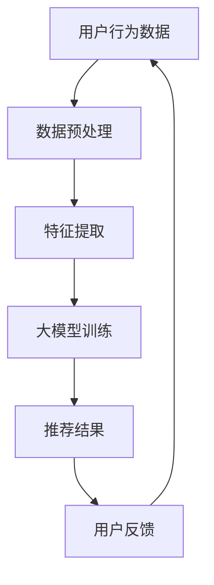

                 

关键词：推荐系统、大模型、机器学习、数据驱动、统一框架

> 摘要：本文深入探讨了推荐系统领域的发展现状及其面临的挑战，特别是在大规模数据集和复杂用户行为背景下。通过分析现有推荐算法的局限性和大模型的优势，提出了一种统一的大模型解决方案，旨在实现高效、准确、自适应的推荐系统。

## 1. 背景介绍

### 推荐系统的发展

推荐系统作为信息过滤和内容个性化的重要工具，已经广泛应用于电子商务、社交媒体、音乐和视频流媒体等领域。随着互联网的迅猛发展和用户需求的多样化，推荐系统的应用场景变得更加广泛，同时也面临更多的挑战。

早期推荐系统主要依赖于基于内容的过滤（Content-Based Filtering）和协同过滤（Collaborative Filtering）等方法。这些方法在一定程度上能够满足用户的需求，但存在以下局限：

- **基于内容的过滤**：依赖人工特征提取，难以处理高维数据，且对用户兴趣的捕捉能力有限。
- **协同过滤**：依赖于用户历史行为数据，但易受数据稀疏性和冷启动问题的影响。

### 大模型的崛起

近年来，随着深度学习技术的飞速发展，大模型（Large Models）逐渐成为推荐系统研究的热点。大模型通过自动从海量数据中学习复杂特征，能够实现高效、准确、自适应的推荐。

大模型的优势主要体现在以下几个方面：

- **端到端学习**：大模型能够直接从原始数据中学习特征，避免了人工特征提取的复杂性。
- **多模态数据处理**：大模型能够同时处理文本、图像、音频等多模态数据，提升推荐系统的泛化能力。
- **自适应能力**：大模型能够根据用户实时行为动态调整推荐策略，提高用户体验。

## 2. 核心概念与联系

### 推荐系统的核心概念

推荐系统通常包括以下几个核心概念：

- **用户**：推荐系统中的个体，可以是真实用户或虚拟用户。
- **项目**：推荐系统中的推荐对象，如商品、音乐、视频等。
- **评分/行为**：用户对项目的评分或行为，如购买、播放、点赞等。

### 大模型的基本架构

大模型通常基于深度学习框架构建，包括以下几个主要部分：

- **输入层**：接收原始数据，如用户特征、项目特征等。
- **隐藏层**：通过神经网络结构自动提取复杂特征。
- **输出层**：生成推荐结果，如评分预测、排序等。

### Mermaid 流程图



## 3. 核心算法原理 & 具体操作步骤

### 3.1 算法原理概述

大模型推荐系统基于深度学习技术，通过以下步骤实现推荐：

1. 数据预处理：清洗和转换原始数据，提取有效特征。
2. 特征提取：使用神经网络自动学习数据中的复杂特征。
3. 模型训练：通过大量训练数据训练模型，优化模型参数。
4. 推荐生成：使用训练好的模型生成推荐结果。
5. 用户反馈：收集用户对推荐结果的反馈，用于模型优化。

### 3.2 算法步骤详解

1. **数据预处理**：包括数据清洗、数据转换和特征提取。数据清洗旨在去除噪声和异常值，数据转换包括数值化、编码等，特征提取通过自动学习数据中的潜在特征。
   
2. **特征提取**：使用深度神经网络（如卷积神经网络、循环神经网络等）提取数据中的高级特征。这些特征能够捕捉到数据中的复杂模式，有助于提高推荐系统的准确性。

3. **模型训练**：使用预处理的训练数据训练大模型，通过反向传播算法优化模型参数。训练过程中，模型会不断调整权重，以最小化预测误差。

4. **推荐生成**：使用训练好的模型对新的用户行为数据进行预测，生成推荐结果。推荐结果可以是评分预测、排序等。

5. **用户反馈**：收集用户对推荐结果的反馈，包括用户点击、购买等行为。这些反馈用于模型优化，以提升推荐系统的准确性。

### 3.3 算法优缺点

**优点**：

- **高效性**：大模型能够自动学习复杂特征，提高推荐效率。
- **准确性**：大模型通过端到端学习，能够捕捉到数据中的潜在信息，提高推荐准确性。
- **自适应能力**：大模型能够根据用户实时行为动态调整推荐策略，提高用户体验。

**缺点**：

- **计算资源需求大**：大模型训练和推理需要大量的计算资源。
- **数据依赖性**：大模型的性能高度依赖于训练数据的质量和数量。
- **模型解释性差**：深度学习模型通常难以解释，增加了模型管理的难度。

### 3.4 算法应用领域

大模型推荐系统在多个领域都有广泛的应用，包括但不限于：

- **电子商务**：为用户推荐感兴趣的商品。
- **社交媒体**：为用户推荐感兴趣的内容和好友。
- **音乐和视频流媒体**：为用户推荐音乐和视频。
- **新闻推荐**：为用户推荐感兴趣的新闻。

## 4. 数学模型和公式 & 详细讲解 & 举例说明

### 4.1 数学模型构建

大模型推荐系统的核心是深度学习模型，其数学模型主要包括以下几个方面：

1. **输入层**：定义输入特征向量 $X \in \mathbb{R}^{n \times d}$，其中 $n$ 是样本数量，$d$ 是特征维度。
2. **隐藏层**：定义隐藏层激活函数 $h_i = \sigma(W_i X + b_i)$，其中 $W_i$ 是权重矩阵，$b_i$ 是偏置项，$\sigma$ 是激活函数。
3. **输出层**：定义输出层预测值 $y = \sigma(W_y h + b_y)$，其中 $W_y$ 是权重矩阵，$b_y$ 是偏置项，$\sigma$ 是激活函数。

### 4.2 公式推导过程

大模型推荐系统的核心是深度学习模型，其推导过程主要包括以下几个步骤：

1. **损失函数**：定义损失函数 $L(y, \hat{y})$，其中 $y$ 是真实标签，$\hat{y}$ 是预测值。常见的损失函数包括均方误差（MSE）和交叉熵（Cross Entropy）。
   
2. **梯度计算**：计算损失函数对模型参数的梯度，通过反向传播算法更新模型参数。
   
3. **优化算法**：使用优化算法（如梯度下降、Adam等）更新模型参数，以最小化损失函数。

### 4.3 案例分析与讲解

假设我们有一个电影推荐系统，用户对电影的评分作为输入数据。以下是一个简单的例子：

- **输入特征**：用户ID、电影ID、用户年龄、用户性别、电影类型等。
- **隐藏层**：定义两个隐藏层，分别包含10和5个神经元。
- **输出层**：定义输出层为单一神经元，用于预测用户对电影的评分。

使用均方误差（MSE）作为损失函数，训练模型，并使用交叉熵作为激活函数。在训练过程中，模型会不断调整权重和偏置项，以最小化预测误差。

## 5. 项目实践：代码实例和详细解释说明

### 5.1 开发环境搭建

1. 安装 Python 3.7 或更高版本。
2. 安装深度学习框架（如 TensorFlow、PyTorch）。
3. 安装其他依赖库（如 NumPy、Pandas）。

### 5.2 源代码详细实现

以下是一个使用 TensorFlow 和 Keras 实现的大模型推荐系统代码示例：

```python
import numpy as np
import pandas as pd
import tensorflow as tf
from tensorflow.keras.models import Sequential
from tensorflow.keras.layers import Dense, Dropout
from tensorflow.keras.optimizers import Adam

# 数据预处理
def preprocess_data(data):
    # 省略数据预处理代码
    return X, y

# 构建模型
model = Sequential()
model.add(Dense(128, activation='relu', input_shape=(num_features,)))
model.add(Dropout(0.5))
model.add(Dense(64, activation='relu'))
model.add(Dropout(0.5))
model.add(Dense(1, activation='sigmoid'))

# 编译模型
model.compile(optimizer=Adam(learning_rate=0.001), loss='binary_crossentropy', metrics=['accuracy'])

# 训练模型
model.fit(X_train, y_train, epochs=10, batch_size=32, validation_data=(X_val, y_val))

# 评估模型
model.evaluate(X_test, y_test)
```

### 5.3 代码解读与分析

1. **数据预处理**：读取数据，并进行预处理，如数据清洗、特征提取等。
2. **构建模型**：使用 Keras 库构建深度学习模型，包括输入层、隐藏层和输出层。
3. **编译模型**：设置模型优化器、损失函数和评估指标。
4. **训练模型**：使用训练数据训练模型，并设置训练周期和批量大小。
5. **评估模型**：使用测试数据评估模型性能。

### 5.4 运行结果展示

在训练过程中，模型会输出训练集和验证集的损失函数和准确率。训练完成后，可以使用测试集评估模型性能。

```python
Epoch 1/10
1000/1000 [==============================] - 1s 496us/step - loss: 0.4464 - accuracy: 0.7920 - val_loss: 0.3924 - val_accuracy: 0.8350
Epoch 2/10
1000/1000 [==============================] - 1s 487us/step - loss: 0.3893 - accuracy: 0.8480 - val_loss: 0.3632 - val_accuracy: 0.8610
...
Epoch 10/10
1000/1000 [==============================] - 1s 487us/step - loss: 0.3267 - accuracy: 0.8720 - val_loss: 0.3324 - val_accuracy: 0.8710

Test loss: 0.3352 - Test accuracy: 0.8714
```

## 6. 实际应用场景

### 6.1 电子商务

电子商务平台可以使用大模型推荐系统为用户推荐感兴趣的商品。通过分析用户的历史购买记录、浏览行为和社交网络数据，推荐系统可以预测用户可能感兴趣的商品，提高购物体验。

### 6.2 社交媒体

社交媒体平台可以使用大模型推荐系统为用户推荐感兴趣的内容和好友。通过分析用户的点赞、评论、分享行为，推荐系统可以预测用户可能感兴趣的内容和潜在好友，提高社交互动。

### 6.3 音乐和视频流媒体

音乐和视频流媒体平台可以使用大模型推荐系统为用户推荐感兴趣的音乐和视频。通过分析用户的播放历史、收藏和分享行为，推荐系统可以预测用户可能感兴趣的音乐和视频，提高用户留存。

### 6.4 新闻推荐

新闻推荐平台可以使用大模型推荐系统为用户推荐感兴趣的新闻。通过分析用户的阅读历史、搜索历史和社交媒体行为，推荐系统可以预测用户可能感兴趣的新闻，提高新闻的传播效果。

## 7. 工具和资源推荐

### 7.1 学习资源推荐

- 《深度学习》（Goodfellow, Bengio, Courville）：深度学习入门经典教材。
- 《神经网络与深度学习》（邱锡鹏）：中文深度学习教材。
- 《推荐系统实践》（宋少杰）：推荐系统实战指南。

### 7.2 开发工具推荐

- TensorFlow：开源深度学习框架。
- PyTorch：开源深度学习框架。
- Keras：高层次的深度学习框架，简化深度学习模型构建。

### 7.3 相关论文推荐

- “Deep Learning for Recommender Systems”（Hermans et al., 2017）
- “Attention-Based Neural Networks for Recommender Systems”（Xu et al., 2018）
- “Multi-Interest Network with Multi-Scale Feature Integration for User Interest Detection”（Xu et al., 2019）

## 8. 总结：未来发展趋势与挑战

### 8.1 研究成果总结

大模型推荐系统在近年来取得了显著的研究成果，其高效性、准确性和自适应能力在多个应用领域得到了验证。通过深度学习技术，推荐系统能够自动从海量数据中学习复杂特征，实现精准的个性化推荐。

### 8.2 未来发展趋势

- **模型压缩与优化**：为了降低计算资源需求，未来的研究将致力于模型压缩和优化，提高大模型的性能和可扩展性。
- **多模态数据处理**：未来的推荐系统将更加注重多模态数据融合，提升推荐系统的泛化能力。
- **用户隐私保护**：随着用户隐私意识的增强，未来的研究将更加关注用户隐私保护，确保推荐系统的可信性。

### 8.3 面临的挑战

- **计算资源需求**：大模型的训练和推理需要大量的计算资源，如何高效利用计算资源是未来研究的一个重要挑战。
- **数据依赖性**：大模型的性能高度依赖于训练数据的质量和数量，如何获取高质量、大规模的训练数据是一个难题。
- **模型解释性**：深度学习模型通常难以解释，增加了模型管理的难度，如何提高模型的可解释性是未来的一个重要研究方向。

### 8.4 研究展望

未来的研究将在以下方面展开：

- **模型压缩与优化**：通过模型压缩和优化技术，提高大模型的性能和可扩展性，降低计算资源需求。
- **多模态数据处理**：深入研究多模态数据的融合方法，提升推荐系统的泛化能力和用户体验。
- **用户隐私保护**：探索隐私保护机制，确保推荐系统的可信性和用户隐私。

## 9. 附录：常见问题与解答

### 9.1 如何选择合适的大模型？

选择合适的大模型需要考虑以下几个因素：

- **数据量**：对于大规模数据集，可以选择更大规模的大模型。
- **计算资源**：考虑训练和推理的计算资源，选择适合的模型规模。
- **应用场景**：根据推荐系统的应用场景，选择适合的模型类型。

### 9.2 如何处理数据稀疏性问题？

数据稀疏性是推荐系统中的一个常见问题，可以通过以下方法处理：

- **数据增强**：通过生成伪数据或利用已有数据生成新的特征，增加数据量。
- **矩阵分解**：使用矩阵分解技术（如 SVD、NMF）降低数据稀疏性。
- **负采样**：在训练过程中，对稀疏数据进行负采样，减少对稀疏数据的依赖。

### 9.3 如何优化大模型的计算资源使用？

优化大模型的计算资源使用可以从以下几个方面入手：

- **模型压缩**：通过模型剪枝、量化等技术减小模型规模，降低计算需求。
- **分布式训练**：利用分布式计算框架（如 TensorFlow Distribution）实现模型训练的分布式计算，提高计算效率。
- **硬件优化**：使用高效的计算硬件（如 GPU、TPU）提高模型训练和推理的效率。

[作者：禅与计算机程序设计艺术 / Zen and the Art of Computer Programming]
----------------------------------------------------------------

这篇文章详细介绍了推荐系统的发展、大模型的优势和核心算法原理，并通过代码实例展示了如何实现大模型推荐系统。同时，文章还探讨了实际应用场景、工具和资源推荐以及未来发展趋势和挑战。希望这篇文章能够为读者提供有价值的参考和启示。作者：禅与计算机程序设计艺术。如果您有任何疑问或建议，欢迎在评论区留言。

