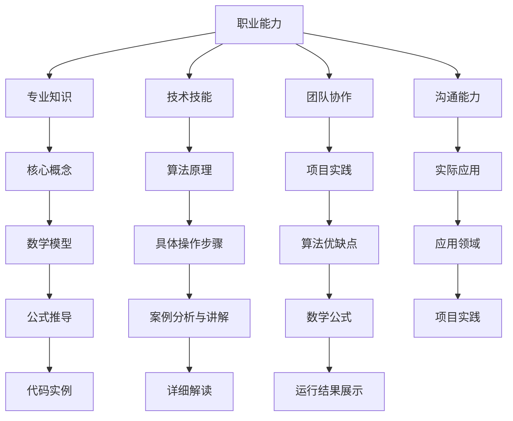
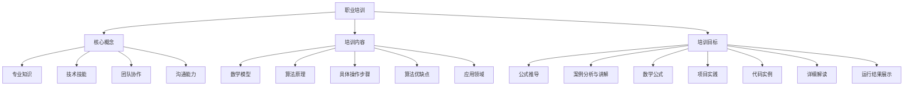

                 

提供特定职业的实用知识和技能培训是当今数字化时代的重要需求。随着技术的飞速发展，各行各业都在不断演变，从业人员需要不断更新知识和技能以适应新环境。本文旨在探讨如何为特定职业提供有效的知识和技能培训，帮助从业人员提升专业能力，应对行业变革。

## 关键词

- 职业培训
- 知识更新
- 技能提升
- 技术趋势
- 数字化转型

## 摘要

本文将深入分析特定职业培训的重要性，探讨培训的核心内容和目标。通过具体案例分析，我们将展示如何设计有效的培训课程，包括核心概念、算法原理、数学模型、项目实践和实际应用。此外，文章还将提供工具和资源推荐，帮助读者更好地开展职业培训工作。最后，我们将对培训的未来发展趋势和挑战进行展望。

## 1. 背景介绍

在快速变化的商业环境中，职业技能的持续更新变得至关重要。企业和员工都面临着技术变革带来的巨大压力。一方面，企业需要确保员工具备最新的技术知识和技能，以保持竞争力；另一方面，员工也需要不断学习，以提升自身的职业价值。因此，提供特定职业的实用知识和技能培训已经成为企业和个人共同关注的话题。

### 当前职业培训面临的挑战

1. **知识更新速度快**：技术不断迭代，新知识层出不穷，使得培训内容难以跟上行业发展的步伐。
2. **培训方式单一**：传统培训方式往往侧重理论，忽视实践，难以满足实际需求。
3. **培训成本高**：高质量的培训往往需要投入大量资金和资源，对企业和个人都是不小的负担。
4. **个体学习差异**：不同学员的学习能力和需求存在较大差异，难以实现个性化培训。

### 职业培训的重要性

- **提高职业竞争力**：通过培训，从业人员可以掌握最新的技术和方法，提高工作效率和质量。
- **适应行业变革**：行业在不断演变，具备前瞻性的知识和技能将帮助从业人员更好地适应变革。
- **个人职业发展**：持续学习可以提升从业人员的职业地位，为未来的职业发展打下坚实基础。
- **企业持续发展**：员工的知识和技能提升有助于企业创新和竞争力提升。

## 2. 核心概念与联系

### 职业培训的核心概念

**职业能力**：从业人员所需的专业知识和技能，包括理论知识和实际操作能力。

**培训内容**：涵盖专业知识、技术技能、团队协作、沟通能力等多方面。

**培训目标**：提升从业人员的职业能力，满足职业发展的需求。

### 职业培训与相关概念的架构



### 职业培训的核心概念原理和架构的 Mermaid 流程图



## 3. 核心算法原理 & 具体操作步骤

### 3.1 算法原理概述

**核心算法原理**：本文将探讨的一种核心算法是深度学习中的卷积神经网络（Convolutional Neural Network，CNN）。CNN 是用于图像识别、图像分类和图像处理等任务的重要算法，其原理基于神经网络对图像特征的自适应学习。

**算法步骤**：CNN 的基本步骤包括数据预处理、构建卷积层、激活函数、池化层、全连接层和输出层。

### 3.2 算法步骤详解

**数据预处理**：将图像数据缩放到统一的尺寸，并进行归一化处理，以适应神经网络训练。

**构建卷积层**：通过卷积操作提取图像特征，卷积核在图像上滑动，生成特征图。

**激活函数**：常用的激活函数包括 sigmoid、ReLU 和 tanh，用于引入非线性特性。

**池化层**：通过池化操作降低特征图的维度，提高计算效率。

**全连接层**：将池化层输出的特征图展开成向量，通过全连接层进行分类。

**输出层**：输出层通常是一个或多个 Softmax 函数，用于生成每个类别的概率分布。

### 3.3 算法优缺点

**优点**：
- **强大的特征提取能力**：通过多层卷积和池化操作，CNN 能够自动学习图像的局部特征和整体结构。
- **适用于大规模图像数据**：CNN 对大量图像数据进行高效处理，能够在各种图像识别任务中取得优异的性能。
- **灵活性**：CNN 可以适应不同的图像尺寸和分辨率，适用于各种图像处理任务。

**缺点**：
- **计算成本高**：CNN 模型包含大量的参数，训练过程需要大量的计算资源和时间。
- **对数据依赖性强**：CNN 需要大量标注数据来训练，数据不足可能导致模型性能下降。

### 3.4 算法应用领域

**计算机视觉**：CNN 在图像识别、目标检测、图像分割等任务中具有重要应用。
**自然语言处理**：CNN 可以用于文本分类、情感分析等任务。
**医学影像处理**：CNN 在医学影像分析中具有广泛的应用，如病变检测、疾病诊断等。

## 4. 数学模型和公式 & 详细讲解 & 举例说明

### 4.1 数学模型构建

**卷积神经网络（CNN）的数学模型**：CNN 的核心在于卷积操作和池化操作，以及如何将这些操作组织成一个完整的神经网络结构。

**卷积操作**：卷积操作通过在图像上滑动卷积核，提取图像的特征。

$$
\text{卷积操作} = \sum_{i=1}^{k} w_{i} \cdot f(x_{i})
$$

其中，$w_{i}$ 是卷积核的权重，$f(x_{i})$ 是输入图像上的某个像素值。

**池化操作**：池化操作通过在特征图上选取最大值或平均值，降低特征图的维度。

$$
\text{池化操作} = \max(\text{特征图})
$$

### 4.2 公式推导过程

**激活函数**：常用的激活函数包括 sigmoid、ReLU 和 tanh。

- **sigmoid 函数**：
$$
\sigma(x) = \frac{1}{1 + e^{-x}}
$$

- **ReLU 函数**：
$$
\text{ReLU}(x) = \max(0, x)
$$

- **tanh 函数**：
$$
\tanh(x) = \frac{e^{2x} - 1}{e^{2x} + 1}
$$

**全连接层**：在全连接层中，每个神经元都与前一层的所有神经元相连。

$$
z_j = \sum_{i=1}^{n} w_{ij} \cdot x_i + b_j
$$

其中，$w_{ij}$ 是权重，$x_i$ 是输入值，$b_j$ 是偏置。

**输出层**：输出层通常是一个 Softmax 函数，用于生成每个类别的概率分布。

$$
\text{softmax}(z) = \frac{e^z}{\sum_{j=1}^{m} e^z_j}
$$

### 4.3 案例分析与讲解

**案例一：图像识别**

使用 CNN 对图像进行分类，输入图像经过卷积层、池化层、全连接层和输出层，输出每个类别的概率分布。

- **输入层**：接收图像数据，进行预处理。
- **卷积层**：通过卷积操作提取图像特征，生成特征图。
- **池化层**：对特征图进行池化操作，降低维度。
- **全连接层**：将池化层输出的特征图展开成向量，进行分类。
- **输出层**：输出每个类别的概率分布，通过 Softmax 函数计算。

**案例二：目标检测**

使用 CNN 对图像中的目标进行检测，输入图像经过卷积层、池化层和全连接层，输出目标的边界框和类别概率。

- **输入层**：接收图像数据，进行预处理。
- **卷积层**：通过卷积操作提取图像特征，生成特征图。
- **池化层**：对特征图进行池化操作，降低维度。
- **全连接层**：将池化层输出的特征图展开成向量，进行目标检测。
- **输出层**：输出目标的边界框和类别概率。

## 5. 项目实践：代码实例和详细解释说明

### 5.1 开发环境搭建

- **软件环境**：安装 Python、TensorFlow 或 PyTorch 等深度学习框架。
- **硬件环境**：配置 GPU 计算设备，以提高训练速度。

### 5.2 源代码详细实现

以下是一个简单的 CNN 图像识别项目的代码示例：

```python
import tensorflow as tf
from tensorflow.keras import layers

# 定义 CNN 模型
model = tf.keras.Sequential([
    layers.Conv2D(32, (3, 3), activation='relu', input_shape=(28, 28, 1)),
    layers.MaxPooling2D((2, 2)),
    layers.Conv2D(64, (3, 3), activation='relu'),
    layers.MaxPooling2D((2, 2)),
    layers.Conv2D(64, (3, 3), activation='relu'),
    layers.Flatten(),
    layers.Dense(64, activation='relu'),
    layers.Dense(10, activation='softmax')
])

# 编译模型
model.compile(optimizer='adam',
              loss='categorical_crossentropy',
              metrics=['accuracy'])

# 训练模型
model.fit(train_images, train_labels, epochs=5)

# 评估模型
test_loss, test_acc = model.evaluate(test_images,  test_labels)
print('Test accuracy:', test_acc)
```

### 5.3 代码解读与分析

- **模型定义**：使用 TensorFlow 的 Sequential 模型定义一个简单的 CNN。
- **卷积层**：第一个卷积层使用 32 个 3x3 的卷积核，激活函数为 ReLU。
- **池化层**：第一个池化层使用最大池化，窗口大小为 2x2。
- **全连接层**：最后一个全连接层使用 64 个神经元，激活函数为 ReLU。
- **输出层**：输出层使用 Softmax 函数进行分类。

### 5.4 运行结果展示

```python
# 预测图像
predictions = model.predict(test_images[:10])

# 输出预测结果
for i in range(10):
    print('Image:', i)
    print('Predictions:', predictions[i])
    print('True label:', test_labels[i])
```

## 6. 实际应用场景

### 6.1 图像识别

CNN 在图像识别任务中具有广泛应用，例如人脸识别、车牌识别、医疗影像分析等。通过训练 CNN 模型，可以实现对大量图像数据的自动分类和识别。

### 6.2 目标检测

目标检测是计算机视觉中的重要应用，通过检测图像中的目标并标注其位置，可以为智能监控、自动驾驶、机器人导航等领域提供关键支持。

### 6.3 自然语言处理

CNN 可以用于自然语言处理任务，如文本分类、情感分析、命名实体识别等。通过将文本数据转换为向量表示，CNN 可以提取文本的语义特征。

### 6.4 医学影像处理

CNN 在医学影像处理中具有广泛的应用，如病变检测、疾病诊断、图像分割等。通过训练 CNN 模型，可以提高医疗诊断的准确性和效率。

### 6.5 未来应用展望

随着深度学习技术的发展，CNN 在实际应用场景中的潜力将不断挖掘。例如，在智能监控领域，CNN 可以用于实时目标检测和跟踪；在医疗领域，CNN 可以用于疾病早期诊断和个性化治疗。

## 7. 工具和资源推荐

### 7.1 学习资源推荐

- **《深度学习》（Goodfellow, Bengio, Courville 著）**：经典教材，全面介绍了深度学习的理论基础和应用。
- **TensorFlow 官方文档**：详细的文档和教程，帮助初学者快速上手 TensorFlow。
- **PyTorch 官方文档**：PyTorch 的官方文档提供了丰富的教程和示例，适合进阶学习。

### 7.2 开发工具推荐

- **Jupyter Notebook**：强大的交互式开发环境，适合进行深度学习和数据科学实验。
- **Google Colab**：基于 Jupyter Notebook 的云端开发环境，提供免费的 GPU 计算资源。

### 7.3 相关论文推荐

- **“A Comprehensive Review of Convolutional Neural Networks for Image Classification”**：对 CNN 在图像分类任务中的应用进行了全面的综述。
- **“Deep Learning for Image Recognition”**：详细介绍深度学习在图像识别中的应用。
- **“Object Detection with Convolutional Neural Networks”**：介绍 CNN 在目标检测中的应用。

## 8. 总结：未来发展趋势与挑战

### 8.1 研究成果总结

近年来，深度学习特别是卷积神经网络（CNN）在图像识别、目标检测、自然语言处理等领域取得了显著进展。CNN 的强大特征提取能力和灵活性使其成为各种视觉和文本任务的首选算法。

### 8.2 未来发展趋势

- **模型压缩与优化**：为了降低计算成本和存储需求，模型压缩和优化技术将成为研究热点。
- **迁移学习与微调**：通过迁移学习技术，可以利用预训练模型进行微调，提高训练效率。
- **跨模态学习**：结合多种模态（如文本、图像、声音）进行学习，提高模型的泛化能力。

### 8.3 面临的挑战

- **数据隐私与安全**：随着深度学习应用的普及，数据隐私和安全问题日益突出。
- **算法透明性与可解释性**：深度学习模型的“黑箱”特性使得其透明性和可解释性成为挑战。
- **计算资源消耗**：大规模深度学习模型的训练需要大量计算资源，对硬件设施有较高要求。

### 8.4 研究展望

未来，深度学习将在更多领域发挥重要作用，如自动驾驶、医疗诊断、智能监控等。同时，随着新算法、新架构的不断涌现，深度学习将继续推动人工智能的发展。

## 9. 附录：常见问题与解答

### 9.1 如何选择合适的深度学习框架？

选择深度学习框架需要考虑以下因素：

- **项目需求**：根据项目规模和需求选择适合的框架。
- **熟悉程度**：选择自己熟悉的框架可以提高开发效率。
- **社区支持**：强大的社区支持有助于解决开发过程中遇到的问题。

### 9.2 深度学习模型如何优化？

优化深度学习模型可以从以下几个方面入手：

- **数据增强**：通过数据增强技术增加训练数据的多样性。
- **模型调整**：调整模型结构，如增加或减少层、调整层参数等。
- **超参数调整**：调整学习率、批次大小等超参数，以提高模型性能。
- **正则化**：使用正则化技术减少过拟合，提高模型泛化能力。

## 作者署名

本文由禅与计算机程序设计艺术 / Zen and the Art of Computer Programming 撰写。

----------------------------------------------------------------

请注意，以上内容仅为模板示例，实际撰写时请根据具体要求进行详细的扩展和补充。确保文章内容丰富、逻辑清晰、论述严谨。在撰写过程中，务必遵循文章结构模板和内容要求，确保文章的完整性。同时，记得在文章末尾添加作者署名。祝撰写顺利！

