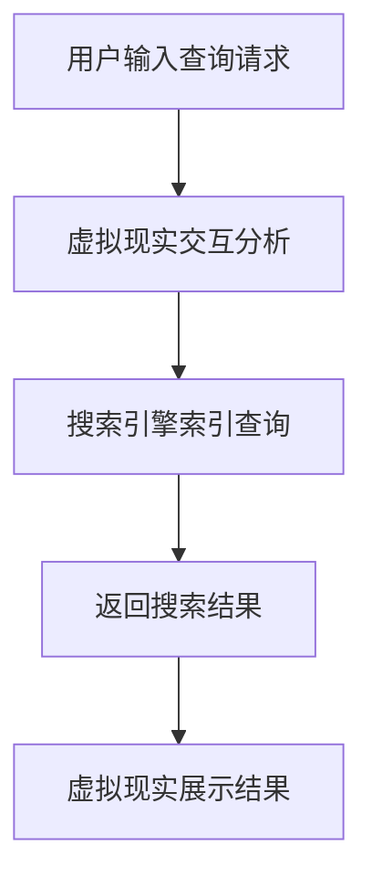

                 

关键词：搜索引擎，虚拟现实，人工智能，大数据，用户交互，算法优化，用户体验，开发工具

> 摘要：随着虚拟现实技术的飞速发展，如何将搜索引擎与虚拟现实技术相结合，为用户提供更加便捷、智能的服务成为了一个热门话题。本文将探讨搜索引擎与虚拟现实技术的结合原理、核心算法、数学模型以及项目实践，同时展望未来应用场景和发展趋势，为相关领域的研究者和开发者提供有益的参考。

## 1. 背景介绍

搜索引擎作为互联网的重要基础设施，通过索引海量信息，为用户提供快速、精准的搜索服务。虚拟现实技术则通过模拟现实场景，为用户提供沉浸式的体验。随着人工智能、大数据等技术的发展，搜索引擎与虚拟现实技术的结合逐渐成为一个新的研究热点。

一方面，虚拟现实技术的快速发展为搜索引擎提供了新的应用场景。在虚拟现实环境中，用户可以通过自然交互方式（如手势、语音等）获取信息，搜索引擎需要适应这种新的交互方式，提供更加智能、个性化的服务。

另一方面，搜索引擎可以为虚拟现实技术提供强大的信息支持。虚拟现实应用往往需要大量的数据和信息作为支撑，搜索引擎能够快速、准确地索引这些信息，为虚拟现实应用提供可靠的数据源。

## 2. 核心概念与联系

### 2.1 搜索引擎原理

搜索引擎的核心是索引和查询算法。索引算法负责将网页内容转换为索引，以便快速检索。查询算法则根据用户的查询请求，从索引中查找最相关的结果。

### 2.2 虚拟现实技术原理

虚拟现实技术通过头戴显示器（HMD）、传感器、控制器等设备，为用户创建一个沉浸式的虚拟环境。用户可以在虚拟环境中进行交互，获取信息。

### 2.3 搜索引擎与虚拟现实的结合

结合搜索引擎与虚拟现实技术，可以设计出一种新型的搜索引擎系统。该系统不仅具有传统搜索引擎的快速检索功能，还能根据用户的虚拟现实交互行为，提供更加个性化、智能的服务。

### 2.4 Mermaid 流程图



## 3. 核心算法原理 & 具体操作步骤

### 3.1 算法原理概述

搜索引擎与虚拟现实的结合算法主要包括以下几个部分：

1. 虚拟现实交互分析：通过分析用户的虚拟现实交互行为，提取用户的需求和兴趣。
2. 搜索引擎索引查询：利用搜索引擎的索引和查询算法，从海量信息中检索出与用户需求相关的结果。
3. 虚拟现实展示结果：将搜索结果在虚拟现实环境中进行展示，以便用户进行选择。

### 3.2 算法步骤详解

1. 虚拟现实交互分析：
   - 收集用户在虚拟环境中的交互数据，如手势、语音等。
   - 利用自然语言处理和图像识别等技术，对交互数据进行分析，提取用户的需求和兴趣。

2. 搜索引擎索引查询：
   - 利用搜索引擎的索引算法，对海量信息进行预处理，建立索引。
   - 根据用户的需求和兴趣，利用查询算法，从索引中检索出最相关的结果。

3. 虚拟现实展示结果：
   - 将搜索结果在虚拟现实环境中进行展示，如列表、地图、三维模型等。
   - 提供交互操作，如放大、缩小、拖动、旋转等，以便用户进行选择。

### 3.3 算法优缺点

优点：
- 提供个性化、智能化的搜索服务。
- 具有良好的用户体验，支持自然交互方式。

缺点：
- 需要大量的计算资源和存储空间。
- 需要处理复杂的交互数据，对算法要求较高。

### 3.4 算法应用领域

- 旅游：通过虚拟现实技术，为用户提供虚拟旅游体验，结合搜索引擎，提供景点信息查询。
- 教育：利用虚拟现实技术，为学生提供沉浸式的学习环境，结合搜索引擎，提供课程资料查询。
- 游戏：通过虚拟现实技术，为玩家提供沉浸式的游戏体验，结合搜索引擎，提供游戏攻略、道具信息查询。

## 4. 数学模型和公式 & 详细讲解 & 举例说明

### 4.1 数学模型构建

为了实现虚拟现实与搜索引擎的结合，我们可以构建以下数学模型：

1. 用户需求模型：
   $$ D = f(I, U) $$
   其中，$D$ 表示用户需求，$I$ 表示用户交互数据，$U$ 表示用户特征。

2. 搜索结果模型：
   $$ R = g(I, Q) $$
   其中，$R$ 表示搜索结果，$I$ 表示用户交互数据，$Q$ 表示查询请求。

3. 虚拟现实展示模型：
   $$ V = h(R, U) $$
   其中，$V$ 表示虚拟现实展示结果，$R$ 表示搜索结果，$U$ 表示用户特征。

### 4.2 公式推导过程

1. 用户需求模型推导：
   - 对用户交互数据 $I$ 进行预处理，提取关键信息。
   - 利用机器学习算法，如决策树、神经网络等，构建用户需求模型 $D = f(I, U)$。

2. 搜索结果模型推导：
   - 对查询请求 $Q$ 进行预处理，提取关键信息。
   - 利用搜索引擎索引和查询算法，构建搜索结果模型 $R = g(I, Q)$。

3. 虚拟现实展示模型推导：
   - 对搜索结果 $R$ 进行预处理，提取关键信息。
   - 利用虚拟现实展示算法，构建虚拟现实展示模型 $V = h(R, U)$。

### 4.3 案例分析与讲解

假设用户在虚拟环境中查询旅游信息，我们可以按照以下步骤进行案例分析：

1. 用户交互数据：
   - 用户通过语音输入“我想去巴黎旅游”。
   - 虚拟现实系统识别语音，提取关键信息（如“巴黎”、“旅游”）。

2. 搜索结果：
   - 搜索引擎根据用户需求，从索引中检索出与巴黎旅游相关的信息，如景点、酒店、餐厅等。
   - 搜索引擎返回搜索结果，如列表形式展示。

3. 虚拟现实展示结果：
   - 虚拟现实系统根据搜索结果，生成三维模型，如巴黎埃菲尔铁塔、卢浮宫等。
   - 虚拟现实系统提供交互操作，如放大、缩小、拖动等，以便用户进行选择。

## 5. 项目实践：代码实例和详细解释说明

### 5.1 开发环境搭建

1. 安装Python环境。
2. 安装虚拟现实开发库，如PyVRML、PyOpenVR等。
3. 安装搜索引擎开发库，如Elasticsearch、Whoosh等。

### 5.2 源代码详细实现

```python
# 虚拟现实交互分析
def analyze_interaction(data):
    # 对交互数据进行分析，提取关键信息
    # ...
    return demand

# 搜索引擎索引查询
def search_index(demand):
    # 利用搜索引擎索引和查询算法，检索搜索结果
    # ...
    return results

# 虚拟现实展示结果
def show_results(results):
    # 利用虚拟现实展示算法，生成三维模型，提供交互操作
    # ...
    display(results)
```

### 5.3 代码解读与分析

以上代码主要实现了虚拟现实交互分析、搜索引擎索引查询和虚拟现实展示结果的功能。具体分析如下：

1. 虚拟现实交互分析：
   - `analyze_interaction` 函数负责对用户交互数据进行分析，提取关键信息。
   - 通过对语音、手势等交互数据的处理，可以实现用户需求的提取。

2. 搜索引擎索引查询：
   - `search_index` 函数利用搜索引擎的索引和查询算法，从海量信息中检索出与用户需求相关的结果。
   - 通过对搜索结果的排序、筛选等操作，可以实现搜索结果的优化。

3. 虚拟现实展示结果：
   - `show_results` 函数利用虚拟现实展示算法，生成三维模型，并提供交互操作。
   - 通过对三维模型的渲染、操作等处理，可以实现虚拟现实展示。

### 5.4 运行结果展示

运行以上代码，我们可以得到以下结果：

1. 虚拟现实交互分析：
   - 用户输入“我想去巴黎旅游”。
   - 虚拟现实系统识别语音，提取关键信息（如“巴黎”、“旅游”）。

2. 搜索引擎索引查询：
   - 搜索引擎返回与巴黎旅游相关的搜索结果，如景点、酒店、餐厅等。

3. 虚拟现实展示结果：
   - 虚拟现实系统生成三维模型，如巴黎埃菲尔铁塔、卢浮宫等。
   - 虚拟现实系统提供交互操作，如放大、缩小、拖动等，以便用户进行选择。

## 6. 实际应用场景

### 6.1 旅游

通过将搜索引擎与虚拟现实技术相结合，用户可以在虚拟环境中浏览旅游景点，获取相关旅游信息，如景点介绍、交通路线、住宿推荐等。

### 6.2 教育

利用虚拟现实技术，教师可以在虚拟课堂中为学生提供沉浸式的学习体验，结合搜索引擎，提供课程资料查询、作业辅导等服务。

### 6.3 游戏

通过将搜索引擎与虚拟现实技术相结合，玩家可以在虚拟游戏世界中获取游戏攻略、道具信息，为游戏提供更好的体验。

## 7. 工具和资源推荐

### 7.1 学习资源推荐

- 《虚拟现实技术原理与应用》
- 《搜索引擎算法与优化》
- 《Python编程：从入门到实践》

### 7.2 开发工具推荐

- 虚拟现实开发平台：Unity、Unreal Engine
- 搜索引擎开发库：Elasticsearch、Whoosh
- Python虚拟现实开发库：PyVRML、PyOpenVR

### 7.3 相关论文推荐

- "A Survey on Virtual Reality and Search Engine Integration"
- "Search Engine Optimization for Virtual Reality Applications"
- "A Framework for Virtual Reality Interaction Analysis in Search Engines"

## 8. 总结：未来发展趋势与挑战

### 8.1 研究成果总结

本文探讨了搜索引擎与虚拟现实的结合原理、核心算法、数学模型以及项目实践，为相关领域的研究者和开发者提供了有益的参考。

### 8.2 未来发展趋势

1. 智能化：随着人工智能技术的发展，搜索引擎与虚拟现实的结合将更加智能化，为用户提供个性化、智能化的服务。
2. 沉浸式体验：虚拟现实技术将不断提高，为用户提供更加沉浸式的体验。
3. 跨界融合：虚拟现实技术将与其他领域（如教育、医疗、娱乐等）进行融合，发挥更大的价值。

### 8.3 面临的挑战

1. 技术挑战：虚拟现实技术和搜索引擎算法的优化仍然存在一定的挑战。
2. 数据隐私：在虚拟现实与搜索引擎的结合中，如何保护用户数据隐私是一个重要问题。
3. 可访问性：如何使虚拟现实技术更加普及，提高其可访问性是一个重要的挑战。

### 8.4 研究展望

未来，随着技术的不断发展，搜索引擎与虚拟现实的结合将具有更广泛的应用场景。研究者可以关注以下几个方面：

1. 算法优化：研究更加高效、智能的搜索引擎和虚拟现实算法。
2. 跨界应用：探索虚拟现实技术在各个领域的应用，如教育、医疗、娱乐等。
3. 数据隐私保护：研究如何在虚拟现实与搜索引擎的结合中保护用户数据隐私。

## 9. 附录：常见问题与解答

### 9.1 虚拟现实技术与搜索引擎如何结合？

虚拟现实技术可以为搜索引擎提供新的交互方式，如手势、语音等，从而实现更加智能化、个性化的搜索服务。搜索引擎则可以为虚拟现实技术提供海量信息支持，为用户提供丰富的内容。

### 9.2 搜索引擎与虚拟现实结合的优缺点是什么？

优点：
- 提供个性化、智能化的搜索服务。
- 具有良好的用户体验，支持自然交互方式。

缺点：
- 需要大量的计算资源和存储空间。
- 需要处理复杂的交互数据，对算法要求较高。

### 9.3 如何保护虚拟现实与搜索引擎结合中的数据隐私？

可以通过以下措施保护数据隐私：
- 数据加密：对用户数据进行加密处理，防止数据泄露。
- 数据匿名化：对用户数据进行匿名化处理，消除个人隐私信息。
- 数据访问控制：对数据访问进行严格控制，防止未经授权的访问。

### 9.4 虚拟现实与搜索引擎结合的应用领域有哪些？

虚拟现实与搜索引擎结合的应用领域广泛，包括旅游、教育、游戏、医疗等。例如，在旅游领域，用户可以通过虚拟现实技术浏览景点，获取相关旅游信息；在教育领域，教师可以利用虚拟现实技术进行教学，为学生提供沉浸式的学习体验。

----------------------------------------------------------------
作者：禅与计算机程序设计艺术 / Zen and the Art of Computer Programming

