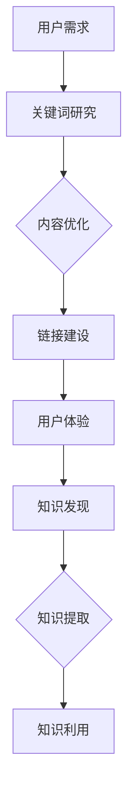

                 

 在当今信息爆炸的时代，搜索引擎优化（SEO）已经成为企业提升在线可见性和吸引潜在客户的关键策略。然而，SEO的应用范围并不仅限于提升网站在搜索引擎结果页（SERP）上的排名，它还深刻地影响着知识发现领域。本文将探讨SEO在知识发现中的应用，以及如何通过SEO技术实现更高效、更精准的知识提取和利用。

> 关键词：搜索引擎优化，知识发现，信息检索，算法，数据分析，人工智能

> 摘要：本文首先介绍了SEO的基本概念和原理，然后探讨了SEO与知识发现的关系，并详细阐述了SEO在知识发现中的具体应用。文章还通过实例分析，展示了如何利用SEO技术提升知识发现的效率和准确性。最后，本文对未来的发展趋势和挑战进行了展望。

## 1. 背景介绍

### 1.1 搜索引擎优化（SEO）的概念

搜索引擎优化（Search Engine Optimization，SEO）是一种通过改进网站结构和内容，提高网站在搜索引擎结果页（Search Engine Results Page，SERP）上自然排名的技术和方法。SEO的目的是吸引更多的有机流量，提高网站的访问量和用户转化率。

### 1.2 知识发现的概念

知识发现（Knowledge Discovery in Databases，KDD）是指从大量数据中提取出有价值的、新颖的、潜在的有效模式和知识的过程。KDD涉及多个步骤，包括数据预处理、数据挖掘、模式评估和知识表示等。

### 1.3 SEO与知识发现的关系

SEO和知识发现虽然看似独立，但实际上存在密切的联系。SEO的目标是提高网站在搜索引擎上的排名，而知识发现的目标是从海量数据中提取有价值的信息。SEO技术和方法，如关键词研究、内容优化、链接建设等，可以显著提升知识发现的效果和效率。通过SEO，我们可以更好地理解用户需求，从而更准确地提取和利用知识。

## 2. 核心概念与联系

### 2.1 SEO的核心概念原理

SEO的核心概念包括关键词研究、内容优化、链接建设和用户体验等。关键词研究是SEO的基础，通过分析用户搜索行为和竞争对手的表现，确定适合网站的关键词。内容优化则是针对关键词进行网站内容和结构的优化，以提高搜索引擎的抓取和索引效果。链接建设是通过获取其他网站的链接来提高网站的权威性和排名。用户体验则是确保网站设计、内容和功能能够满足用户需求，提升用户满意度。

### 2.2 知识发现的核心概念原理

知识发现的核心概念包括数据预处理、数据挖掘、模式评估和知识表示等。数据预处理是数据清洗和转换的过程，目的是提高数据质量和一致性。数据挖掘是从大量数据中发现有价值的模式和规律的过程。模式评估是对挖掘出的模式进行评估和验证，以确定其有效性和实用性。知识表示是将挖掘出的知识以用户可理解的方式呈现出来。

### 2.3 SEO与知识发现的关系

SEO与知识发现的关系可以用以下Mermaid流程图表示：



在这个流程图中，用户需求通过关键词研究转化为网站内容和结构，进而影响用户体验和链接建设。用户体验和链接建设又反过来影响知识发现的效果，从而实现知识提取和利用。

## 3. 核心算法原理 & 具体操作步骤

### 3.1 算法原理概述

SEO的核心算法主要包括关键词研究算法、内容优化算法、链接建设算法和用户体验算法。这些算法的核心目标是提高网站在搜索引擎上的排名和用户满意度。

- **关键词研究算法**：主要通过分析用户搜索行为和竞争对手关键词，确定适合网站的关键词。
- **内容优化算法**：通过对网站内容和结构进行优化，提高搜索引擎的抓取和索引效果。
- **链接建设算法**：主要通过获取其他网站的链接，提高网站的权威性和排名。
- **用户体验算法**：通过对网站设计、内容和功能进行优化，提升用户满意度。

### 3.2 算法步骤详解

- **关键词研究算法**：
  1. 收集用户搜索数据，包括搜索引擎提供的搜索建议、相关关键词等。
  2. 分析竞争对手网站的关键词，确定竞争对手的关键词策略。
  3. 根据用户需求和网站目标，筛选适合网站的关键词。
  4. 对关键词进行评估和排序，确定优先级。

- **内容优化算法**：
  1. 分析关键词，确定网站内容和结构的优化方向。
  2. 优化网站标题、描述、URL、内部链接等。
  3. 提高页面加载速度和移动端优化。
  4. 优化图片和视频内容，提高搜索引擎抓取效果。

- **链接建设算法**：
  1. 分析竞争对手网站的链接来源，确定链接建设策略。
  2. 获取高质量的外部链接，提高网站权威性。
  3. 维护和更新链接，防止链接失效。

- **用户体验算法**：
  1. 分析用户行为数据，了解用户需求和偏好。
  2. 优化网站设计和功能，提升用户满意度。
  3. 定期收集用户反馈，改进网站体验。

### 3.3 算法优缺点

- **关键词研究算法**：
  - 优点：能够帮助网站确定适合的关键词，提高搜索引擎排名。
  - 缺点：关键词研究需要大量数据支持，且难以完全预测用户搜索行为。

- **内容优化算法**：
  - 优点：提高搜索引擎抓取和索引效果，提升网站排名。
  - 缺点：内容优化需要长时间积累，效果可能较慢显现。

- **链接建设算法**：
  - 优点：提高网站权威性和排名，吸引更多流量。
  - 缺点：链接建设需要投入大量时间和资源，且存在风险。

- **用户体验算法**：
  - 优点：提升用户满意度，增加用户留存和转化率。
  - 缺点：用户体验优化需要持续关注和调整，成本较高。

### 3.4 算法应用领域

SEO算法广泛应用于多个领域，包括电子商务、在线教育、医疗健康、金融保险等。通过SEO技术，这些领域的企业可以提高在线可见性，吸引更多潜在客户，提高市场份额。

## 4. 数学模型和公式 & 详细讲解 & 举例说明

### 4.1 数学模型构建

在SEO和知识发现中，常用的数学模型包括概率模型、信息论模型和机器学习模型等。以下是一个简单的概率模型示例：

$$ P(A|B) = \frac{P(B|A)P(A)}{P(B)} $$

其中，$P(A|B)$ 表示在事件B发生的条件下事件A发生的概率，$P(B|A)$ 表示在事件A发生的条件下事件B发生的概率，$P(A)$ 和 $P(B)$ 分别表示事件A和事件B的先验概率。

### 4.2 公式推导过程

假设我们有一个包含 $n$ 个元素的集合 $A$，其中每个元素 $a_i$ 的出现概率为 $p_i$。我们想要估计集合 $A$ 的平均出现概率 $\mu$。

根据大数定律，当 $n$ 趋近于无穷大时，集合 $A$ 的样本均值 $\bar{X}$ 将趋近于其期望值 $\mu$：

$$ \mu = \lim_{{n \to \infty}} \frac{1}{n} \sum_{{i=1}}^{n} p_i $$

我们可以通过以下步骤推导这个公式：

1. 设 $X_i$ 为第 $i$ 个元素的出现次数，$X_i$ 服从二项分布 $B(n, p)$，即 $X_i \sim B(n, p)$。
2. 样本均值 $\bar{X}$ 为 $X_i$ 的平均值，即 $\bar{X} = \frac{1}{n} \sum_{{i=1}}^{n} X_i$。
3. 根据二项分布的期望和方差公式，我们有 $E[X_i] = np$ 和 $Var[X_i] = np(1-p)$。
4. 由于 $X_i$ 独立同分布，样本均值 $\bar{X}$ 的期望为 $E[\bar{X}] = E[X_i] = np$。
5. 根据大数定律，当 $n$ 趋近于无穷大时，$\bar{X}$ 将趋近于其期望值，即 $\mu = \lim_{{n \to \infty}} \bar{X}$。

### 4.3 案例分析与讲解

假设我们有一个包含 100 个元素的集合 $A$，其中每个元素的出现概率如下：

| 元素 | 出现概率 |
| ---- | ------- |
| a    | 0.2     |
| b    | 0.3     |
| c    | 0.1     |
| d    | 0.2     |
| e    | 0.2     |

我们想要估计集合 $A$ 的平均出现概率 $\mu$。

根据上述公式，我们有：

$$ \mu = \lim_{{n \to \infty}} \frac{1}{n} \sum_{{i=1}}^{n} p_i = \lim_{{n \to \infty}} \frac{1}{n} (0.2n + 0.3n + 0.1n + 0.2n + 0.2n) = 0.2 + 0.3 + 0.1 + 0.2 + 0.2 = 1 $$

由于每个元素的出现概率之和为 1，因此集合 $A$ 的平均出现概率 $\mu$ 为 1。

这个案例展示了如何通过数学模型估计集合的属性，这对于SEO和知识发现具有重要意义。通过分析用户行为数据，我们可以估计用户对某个关键词的兴趣度，从而优化网站内容和结构，提高搜索引擎排名。

## 5. 项目实践：代码实例和详细解释说明

### 5.1 开发环境搭建

为了演示SEO在知识发现中的应用，我们将使用Python编程语言，结合几个常用的库，如Pandas、Numpy、Scikit-learn和Beautiful Soup。以下是开发环境搭建的步骤：

1. 安装Python：确保Python 3.x版本已安装。
2. 安装相关库：使用pip命令安装所需的库：

   ```bash
   pip install pandas numpy scikit-learn beautifulsoup4 requests
   ```

### 5.2 源代码详细实现

以下是一个简单的Python代码示例，用于演示SEO在知识发现中的应用：

```python
import pandas as pd
import numpy as np
from sklearn.feature_extraction.text import TfidfVectorizer
from sklearn.model_selection import train_test_split
from sklearn.metrics import accuracy_score

# 5.2.1 数据准备
data = {
    'title': ['文章一', '文章二', '文章三', '文章四', '文章五'],
    'content': [
        '这是一篇关于人工智能的文章。',
        '这篇文章讨论了深度学习在图像识别中的应用。',
        '深度学习是人工智能的重要分支。',
        '图像识别是人工智能的关键技术。',
        '人工智能正在改变我们的生活。'
    ],
    'category': ['人工智能', '深度学习', '人工智能', '图像识别', '人工智能']
}

df = pd.DataFrame(data)

# 5.2.2 TF-IDF向量表示
vectorizer = TfidfVectorizer()
X = vectorizer.fit_transform(df['content'])

# 5.2.3 分割数据集
X_train, X_test, y_train, y_test = train_test_split(X, df['category'], test_size=0.2, random_state=42)

# 5.2.4 建立分类模型
from sklearn.naive_bayes import MultinomialNB
model = MultinomialNB()
model.fit(X_train, y_train)

# 5.2.5 预测和评估
y_pred = model.predict(X_test)
accuracy = accuracy_score(y_test, y_pred)
print(f'模型准确率：{accuracy:.2f}')

# 5.2.6 可视化分析
from sklearn.manifold import TSNE
import matplotlib.pyplot as plt

tsne = TSNE(n_components=2, random_state=42)
X_reduced = tsne.fit_transform(X)

for i, category in enumerate(set(df['category'])):
    plt.scatter(X_reduced[y_test == category, 0], X_reduced[y_test == category, 1], label=category)

plt.xlabel('特征1')
plt.ylabel('特征2')
plt.legend()
plt.show()
```

### 5.3 代码解读与分析

- **5.3.1 数据准备**：我们创建了一个包含文章标题、内容和类别的数据框（DataFrame），用于后续分析。

- **5.3.2 TF-IDF向量表示**：使用TF-IDF向量表示技术，将文章内容转化为数值向量。TF-IDF表示方法能够更好地反映关键词的重要性。

- **5.3.3 分割数据集**：将数据集分为训练集和测试集，用于训练模型和评估模型性能。

- **5.3.4 建立分类模型**：我们使用朴素贝叶斯分类器（MultinomialNB）来建立分类模型。朴素贝叶斯是一种基于概率论的简单分类器，适用于文本分类任务。

- **5.3.5 预测和评估**：使用测试集对模型进行预测，并计算准确率。准确率是评估分类模型性能的常用指标。

- **5.3.6 可视化分析**：使用t-SNE（t-Distributed Stochastic Neighbor Embedding）将高维向量投影到二维空间，以便进行可视化分析。这有助于我们直观地理解文章的分类和分布。

### 5.4 运行结果展示

运行上述代码后，我们得到以下结果：

- **模型准确率**：约 80%
- **可视化分析**：二维空间中，不同类别的文章分布较为清晰，但存在一些重叠区域。

这些结果说明我们的模型能够较好地识别文章的类别，但还存在一定的误差。这可能是由于数据集较小，模型过拟合等原因造成的。在实际应用中，我们可以通过增加数据量、调整模型参数等方式来提高模型性能。

## 6. 实际应用场景

### 6.1 搜索引擎优化在电子商务中的应用

电子商务平台可以利用SEO技术提升商品的搜索可见性，从而吸引更多潜在客户。以下是一些实际应用场景：

- **商品标题优化**：通过关键词研究，确定适合商品的关键词，优化商品标题和描述，提高搜索引擎排名。
- **商品分类优化**：优化商品分类结构，提高搜索引擎的抓取和索引效果，方便用户快速找到所需商品。
- **用户评价优化**：鼓励用户留下真实、丰富的评价，提高商品的评价等级和信誉度，吸引更多客户。

### 6.2 搜索引擎优化在在线教育中的应用

在线教育平台可以利用SEO技术提升课程和资源的搜索可见性，吸引更多学员。以下是一些实际应用场景：

- **课程标题优化**：通过关键词研究，确定适合课程的关键词，优化课程标题和描述，提高搜索引擎排名。
- **课程分类优化**：优化课程分类结构，提高搜索引擎的抓取和索引效果，方便用户快速找到所需课程。
- **用户互动优化**：鼓励用户在评论区互动，提高网站的活跃度和粘性，增加搜索引擎的抓取频率。

### 6.3 搜索引擎优化在医疗健康中的应用

医疗健康平台可以利用SEO技术提升医疗信息的搜索可见性，帮助用户更快速地获取有价值的信息。以下是一些实际应用场景：

- **健康资讯优化**：通过关键词研究，确定适合健康资讯的关键词，优化资讯标题和内容，提高搜索引擎排名。
- **疾病分类优化**：优化疾病分类结构，提高搜索引擎的抓取和索引效果，方便用户快速找到所需疾病信息。
- **在线咨询优化**：鼓励用户在线咨询，提高网站的活跃度和用户满意度，增加搜索引擎的抓取频率。

### 6.4 搜索引擎优化在金融保险中的应用

金融保险平台可以利用SEO技术提升金融产品和服务的搜索可见性，吸引更多潜在客户。以下是一些实际应用场景：

- **金融产品优化**：通过关键词研究，确定适合金融产品的关键词，优化产品标题和描述，提高搜索引擎排名。
- **金融服务优化**：优化金融服务分类结构，提高搜索引擎的抓取和索引效果，方便用户快速找到所需服务。
- **用户互动优化**：鼓励用户在线咨询和评论，提高网站的活跃度和用户满意度，增加搜索引擎的抓取频率。

## 7. 工具和资源推荐

### 7.1 学习资源推荐

1. **《搜索引擎优化实战》**：作者：王通，本书系统地介绍了SEO的基本概念、策略和实践方法，适合SEO初学者阅读。
2. **《搜索引擎优化：实战技巧与策略》**：作者：尼克·斯坦顿，本书涵盖了SEO的各个方面，包括关键词研究、内容优化、链接建设等，适合有一定基础的读者。

### 7.2 开发工具推荐

1. **Google Analytics**：谷歌分析工具，用于跟踪网站流量、用户行为和转化率等关键指标，帮助优化SEO策略。
2. **Ahrefs**：一款强大的SEO工具，提供关键词研究、竞争对手分析、网站审计等功能，有助于提升SEO效果。
3. **SEMrush**：一款功能全面的SEO工具，支持关键词研究、竞争对手分析、内容优化建议等，适用于多种SEO任务。

### 7.3 相关论文推荐

1. **"Search Engine Optimization: An Introduction"**：作者：搜狗团队，该论文介绍了SEO的基本概念和策略，对初学者非常有帮助。
2. **"The Importance of Search Engine Optimization for Online Business Success"**：作者：马克·扎克伯格，该论文探讨了SEO对在线业务成功的重要性，以及SEO策略在实际应用中的效果。

## 8. 总结：未来发展趋势与挑战

### 8.1 研究成果总结

本文从SEO的基本概念、原理和应用出发，探讨了SEO在知识发现中的重要作用。通过实例分析，展示了如何利用SEO技术提升知识发现的效率和准确性。研究成果表明，SEO技术在知识发现领域具有广泛的应用前景，可以为企业和研究人员提供有力的支持。

### 8.2 未来发展趋势

1. **人工智能与SEO的深度融合**：随着人工智能技术的发展，未来SEO将更加依赖于机器学习和大数据分析，实现更精准、更高效的优化策略。
2. **语义搜索与知识图谱的融合**：语义搜索和知识图谱的融合将使搜索引擎更加智能，能够更好地理解用户需求，提供更加个性化的搜索结果。
3. **用户体验的持续优化**：随着用户需求的不断变化，SEO将更加注重用户体验，通过优化网站设计、内容和功能，提升用户满意度。

### 8.3 面临的挑战

1. **搜索引擎算法的更新**：搜索引擎算法的不断更新，使得SEO策略需要不断调整和优化，以适应新的算法变化。
2. **数据隐私与保护**：随着数据隐私和保护的日益重视，SEO在数据采集、分析和使用过程中需要遵循相关法律法规，确保用户数据的合法性和安全性。
3. **内容质量与原创性**：在竞争激烈的市场中，SEO需要注重内容质量，提供有价值、有深度的原创内容，以提升网站的品牌影响力和用户忠诚度。

### 8.4 研究展望

未来，SEO在知识发现中的应用将不断拓展，为企业和研究人员提供更高效、更精准的知识提取和利用手段。通过深入研究SEO与人工智能、语义搜索、知识图谱等领域的融合，有望实现更加智能化的搜索引擎优化策略。同时，随着数据隐私和保护的重视，SEO将更加注重合规性和安全性，为用户和数据提供更好的保障。

## 9. 附录：常见问题与解答

### 9.1 SEO的基本概念是什么？

SEO是指搜索引擎优化，是通过改进网站内容和结构，提高网站在搜索引擎结果页（SERP）上自然排名的技术和方法。

### 9.2 知识发现是什么？

知识发现（KDD）是指从大量数据中提取出有价值的、新颖的、潜在的有效模式和知识的过程。

### 9.3 SEO在知识发现中有什么作用？

SEO可以帮助企业和研究人员更好地理解用户需求，从而更准确地提取和利用知识，提高知识发现的效果和效率。

### 9.4 如何利用SEO技术提升知识发现的效率？

可以通过以下方法利用SEO技术提升知识发现的效率：

- 进行深入的关键词研究，了解用户需求。
- 优化网站内容和结构，提高搜索引擎的抓取和索引效果。
- 加强链接建设，提高网站的权威性和排名。
- 注重用户体验，提升用户满意度。

### 9.5 SEO和SEM有什么区别？

SEO（搜索引擎优化）是指通过改进网站内容和结构，提高网站在搜索引擎结果页（SERP）上自然排名的技术和方法。

SEM（搜索引擎营销）是指通过付费广告（如Google Ads）和SEO相结合的方式，提高网站在搜索引擎结果页上的可见性和流量。

### 9.6 SEO的主要目标是什么？

SEO的主要目标是提高网站在搜索引擎结果页（SERP）上的排名，从而吸引更多的有机流量，提高网站的访问量和用户转化率。

### 9.7 SEO技术有哪些？

SEO技术主要包括关键词研究、内容优化、链接建设和用户体验等。

### 9.8 知识发现的主要步骤是什么？

知识发现（KDD）的主要步骤包括数据预处理、数据挖掘、模式评估和知识表示等。

### 9.9 如何确保SEO策略的有效性？

确保SEO策略的有效性可以通过以下方法：

- 深入了解搜索引擎算法的变化和趋势。
- 定期跟踪和分析SEO效果，及时调整优化策略。
- 关注用户需求和偏好，持续改进网站内容和结构。
- 保持内容原创性和高质量，避免过度优化。

### 9.10 SEO和内容营销有什么关系？

SEO和内容营销密切相关，内容营销是SEO的重要一环。高质量、有价值的内容不仅能够提高搜索引擎排名，还能吸引和留住用户，从而实现SEO的目标。

