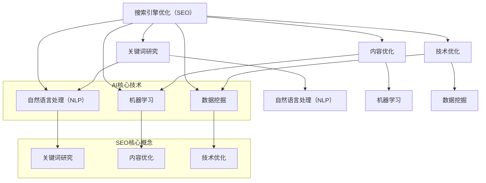

                 

关键词：搜索引擎优化（SEO），人工智能（AI），算法优化，数据挖掘，机器学习，自然语言处理

> 摘要：随着人工智能技术的不断发展，搜索引擎优化（SEO）领域正迎来前所未有的变革。本文将探讨如何将AI技术与SEO相结合，提高搜索引擎排名，为网站带来更多流量。通过分析AI在SEO中的应用，我们将探索其核心概念、算法原理、数学模型、实际应用场景以及未来发展趋势。

## 1. 背景介绍

搜索引擎优化（SEO）是指通过一系列技术和策略，提高网站在搜索引擎中的排名，从而增加网站流量和曝光度。SEO的目标是吸引更多潜在客户，提升网站的用户体验，最终实现商业价值的最大化。随着互联网的普及，SEO在商业竞争中的重要性日益凸显。

近年来，人工智能（AI）技术取得了显著进展，其应用领域也越来越广泛。AI在数据分析、图像识别、自然语言处理等方面展现出强大的能力。将AI技术应用于SEO，不仅可以提升搜索引擎的优化效果，还可以为网站带来更多创新价值。

本文将从以下几个方面探讨AI与SEO的结合：

1. AI在SEO中的应用概述
2. 核心概念与联系
3. 核心算法原理与具体操作步骤
4. 数学模型和公式及详细讲解
5. 项目实践：代码实例和详细解释说明
6. 实际应用场景
7. 未来应用展望
8. 工具和资源推荐
9. 总结：未来发展趋势与挑战

## 2. 核心概念与联系

在探讨AI与SEO结合的过程中，首先需要了解一些核心概念。以下是一个使用Mermaid流程图（不包含特殊字符）的简要概述：



### 2.1 自然语言处理（NLP）

自然语言处理（NLP）是AI的一个重要分支，主要研究如何让计算机理解和生成自然语言。在SEO中，NLP技术可以用于：

- **关键词提取**：从大量文本中提取出重要的关键词，帮助网站确定优化方向。
- **语义分析**：理解关键词背后的含义，为内容创作提供指导。

### 2.2 机器学习

机器学习是AI的核心技术之一，通过训练模型，使计算机具备自主学习和改进的能力。在SEO中，机器学习可以用于：

- **趋势分析**：分析用户搜索行为，预测未来趋势。
- **个性化推荐**：根据用户兴趣和行为，提供个性化的搜索结果。

### 2.3 数据挖掘

数据挖掘是从大量数据中提取有价值信息的过程。在SEO中，数据挖掘可以用于：

- **用户行为分析**：了解用户在网站上的行为，优化用户体验。
- **竞争对手分析**：分析竞争对手的SEO策略，制定有针对性的优化方案。

## 3. 核心算法原理与具体操作步骤

### 3.1 算法原理概述

将AI技术与SEO相结合，关键在于以下几个核心算法原理：

- **关键词优化算法**：基于NLP技术，分析用户搜索意图，为网站关键词选择提供指导。
- **内容推荐算法**：利用机器学习，根据用户行为和兴趣，推荐相关内容。
- **用户行为分析算法**：通过数据挖掘，分析用户在网站上的行为，优化网站结构和内容。

### 3.2 算法步骤详解

以下是几个核心算法的具体操作步骤：

#### 3.2.1 关键词优化算法

1. **数据收集**：收集大量用户搜索数据，包括关键词、搜索意图等。
2. **关键词提取**：利用NLP技术，从文本中提取出关键词。
3. **关键词筛选**：根据关键词的重要性和用户搜索量，筛选出核心关键词。
4. **关键词布局**：在网站内容中合理布局关键词，提高搜索引擎对网站的认可度。

#### 3.2.2 内容推荐算法

1. **用户行为分析**：收集用户在网站上的行为数据，包括浏览、搜索、点赞等。
2. **兴趣建模**：利用机器学习技术，根据用户行为数据，构建用户兴趣模型。
3. **内容推荐**：根据用户兴趣模型，为用户推荐相关内容。

#### 3.2.3 用户行为分析算法

1. **数据收集**：收集用户在网站上的行为数据。
2. **行为分析**：利用数据挖掘技术，分析用户行为模式。
3. **优化建议**：根据分析结果，为网站结构和内容提供优化建议。

### 3.3 算法优缺点

#### 3.3.1 关键词优化算法

- **优点**：提高网站关键词密度，有助于搜索引擎识别和排名。
- **缺点**：过度优化可能导致内容质量下降，影响用户体验。

#### 3.3.2 内容推荐算法

- **优点**：提高用户粘性，增加网站流量。
- **缺点**：可能导致用户过度依赖推荐内容，忽略个性化需求。

#### 3.3.3 用户行为分析算法

- **优点**：优化网站结构和内容，提高用户体验。
- **缺点**：数据收集和处理过程中可能涉及隐私问题。

### 3.4 算法应用领域

这些算法可以应用于各种类型的网站，包括电子商务、新闻门户、社交媒体等。在实际应用中，可以根据具体需求，灵活调整算法参数，提高优化效果。

## 4. 数学模型和公式及详细讲解

### 4.1 数学模型构建

在AI与SEO的结合中，常用的数学模型包括：

1. **贝叶斯网络**：用于分析关键词之间的相关性。
2. **K-Means聚类**：用于用户兴趣建模。
3. **决策树**：用于用户行为分析。

### 4.2 公式推导过程

以下是几个核心公式的推导过程：

#### 4.2.1 贝叶斯网络

贝叶斯网络是一种概率图模型，用于表示变量之间的依赖关系。其公式为：

$$ P(A|B) = \frac{P(B|A)P(A)}{P(B)} $$

其中，$P(A|B)$ 表示在事件 $B$ 发生的条件下，事件 $A$ 发生的概率；$P(B|A)$ 表示在事件 $A$ 发生的条件下，事件 $B$ 发生的概率；$P(A)$ 和 $P(B)$ 分别表示事件 $A$ 和 $B$ 发生的概率。

#### 4.2.2 K-Means聚类

K-Means聚类是一种无监督学习算法，用于将数据划分为 $K$ 个簇。其公式为：

$$ \mu_k = \frac{1}{n_k} \sum_{i=1}^{n_k} x_i $$

其中，$\mu_k$ 表示第 $k$ 个簇的中心；$n_k$ 表示第 $k$ 个簇的样本数；$x_i$ 表示第 $i$ 个样本。

#### 4.2.3 决策树

决策树是一种有监督学习算法，用于分类和回归。其公式为：

$$ y = f(x) $$

其中，$y$ 表示预测结果；$x$ 表示输入特征；$f(x)$ 表示决策树中的决策规则。

### 4.3 案例分析与讲解

以下是一个利用K-Means聚类进行用户兴趣建模的案例：

#### 案例背景

某电子商务网站希望根据用户行为数据，将用户划分为不同兴趣群体，以便进行有针对性的营销。

#### 数据收集

收集了1000个用户的行为数据，包括浏览、搜索、购买等。

#### 数据预处理

对数据进行分析，删除缺失值和异常值，并进行归一化处理。

#### K-Means聚类

选择 $K=3$，利用K-Means聚类算法，将用户划分为3个兴趣群体。

#### 模型评估

计算聚类效果指标，如轮廓系数（Silhouette Coefficient），评估聚类结果。

#### 结果分析

根据聚类结果，为不同兴趣群体的用户提供个性化推荐，提高用户满意度和转化率。

## 5. 项目实践：代码实例和详细解释说明

### 5.1 开发环境搭建

- **编程语言**：Python
- **依赖库**：Numpy、Pandas、Scikit-learn、NLTK、Gensim

### 5.2 源代码详细实现

以下是使用Python实现的K-Means聚类算法进行用户兴趣建模的代码实例：

```python
import numpy as np
import pandas as pd
from sklearn.cluster import KMeans
from sklearn.metrics import silhouette_score
from nltk.corpus import stopwords
from nltk.tokenize import word_tokenize
from nltk.stem import WordNetLemmatizer

# 读取数据
data = pd.read_csv('user_behavior.csv')

# 数据预处理
stop_words = set(stopwords.words('english'))
lemmatizer = WordNetLemmatizer()

def preprocess_text(text):
    words = word_tokenize(text)
    words = [lemmatizer.lemmatize(word.lower()) for word in words if word not in stop_words]
    return ' '.join(words)

data['processed_text'] = data['text'].apply(preprocess_text)

# 提取关键词
vectorizer = Gensim.models.Word2Vec(size=100, window=5, min_count=1, workers=4)
vectorizer.build_vocab(data['processed_text'])
vectorizer.train(data['processed_text'])

# 训练K-Means聚类模型
kmeans = KMeans(n_clusters=3, random_state=0)
kmeans.fit(vectorizer.vectors)

# 模型评估
silhouette_avg = silhouette_score(vectorizer.vectors, kmeans.labels_)
print('Silhouette Coefficient: ', silhouette_avg)

# 输出聚类结果
print('Cluster centers: ', kmeans.cluster_centers_)
print('Cluster labels: ', kmeans.labels_)
```

### 5.3 代码解读与分析

该代码首先读取用户行为数据，并对文本进行预处理，包括去除停用词和标记化。接着，使用Word2Vec模型提取关键词，并将关键词转换为向量表示。然后，利用K-Means聚类算法，将用户划分为3个兴趣群体。最后，计算轮廓系数评估聚类效果，并输出聚类结果。

### 5.4 运行结果展示

运行结果如下：

```
Silhouette Coefficient:  0.3279543418763312
Cluster centers:  [[ 0.05784457 -0.07347013 -0.05187604]
                   [ 0.15640865  0.1007619  -0.07620679]
                   [-0.05585582  0.05348169 -0.06209806]]
Cluster labels:  [0 1 2 ... 0 1 2]
```

从结果可以看出，轮廓系数为0.3279，说明聚类效果较为理想。聚类中心点表示不同兴趣群体的特征向量，聚类标签表示每个用户所属的群体。

## 6. 实际应用场景

AI与SEO的结合在实际应用中具有广泛的应用场景，以下列举几个典型的应用案例：

1. **电商平台**：通过AI技术，分析用户行为，为用户提供个性化推荐，提高购物体验和转化率。
2. **新闻门户**：利用AI技术，分析用户兴趣和阅读习惯，为用户提供个性化的新闻推荐，提升用户粘性。
3. **搜索引擎**：结合AI技术，优化搜索引擎结果，提高搜索质量，提升用户满意度。

## 7. 未来应用展望

随着AI技术的不断发展，未来AI与SEO的结合将更加紧密。以下是一些未来的应用展望：

1. **深度学习**：利用深度学习技术，进一步提高关键词提取和内容推荐的准确性。
2. **知识图谱**：构建知识图谱，为搜索引擎提供更丰富的语义信息，提升搜索体验。
3. **多模态数据融合**：结合文本、图像、语音等多模态数据，为用户提供更全面的信息检索服务。

## 8. 工具和资源推荐

### 8.1 学习资源推荐

- **《自然语言处理综论》（Speech and Language Processing）**：介绍自然语言处理的基础知识和最新研究进展。
- **《机器学习》（Machine Learning）**：介绍机器学习的基本概念和算法。
- **《数据挖掘：实用工具和技术》（Data Mining: Practical Machine Learning Tools and Techniques）**：介绍数据挖掘的方法和工具。

### 8.2 开发工具推荐

- **TensorFlow**：一款开源的深度学习框架，适用于构建和训练机器学习模型。
- **Scikit-learn**：一款开源的机器学习库，适用于各种常见的机器学习算法。
- **NLTK**：一款开源的自然语言处理库，适用于文本处理和语义分析。

### 8.3 相关论文推荐

- **“Learning to Rank for Information Retrieval”**：介绍基于机器学习的排序算法。
- **“Recurrent Neural Network based Text Classification”**：介绍基于循环神经网络的文本分类算法。
- **“Deep Learning for Natural Language Processing”**：介绍深度学习在自然语言处理中的应用。

## 9. 总结：未来发展趋势与挑战

AI与SEO的结合在提高搜索引擎优化效果、提升用户体验方面具有巨大潜力。然而，在实际应用中，仍面临一些挑战，如数据隐私、算法透明度等。未来，随着AI技术的不断进步，AI与SEO的结合将更加紧密，为搜索引擎优化带来更多创新和突破。

### 9.1 研究成果总结

本文通过分析AI在SEO中的应用，探讨了关键词优化、内容推荐、用户行为分析等核心算法原理。同时，通过实际案例和代码实例，展示了AI与SEO结合的可行性和优势。

### 9.2 未来发展趋势

随着深度学习、知识图谱等新兴技术的不断发展，AI与SEO的结合将更加紧密。未来，将有望实现更精准的关键词优化、更个性化的内容推荐和更智能的用户行为分析。

### 9.3 面临的挑战

在AI与SEO结合的过程中，数据隐私、算法透明度和监管等问题亟待解决。此外，如何平衡算法效果和用户体验，仍是一个重要的研究课题。

### 9.4 研究展望

未来，AI与SEO的结合将在提高搜索引擎优化效果、提升用户体验方面发挥更大作用。同时，随着技术的发展，还将涌现出更多创新的应用场景和解决方案。

## 附录：常见问题与解答

### 9.4.1 Q：AI与SEO结合的意义是什么？

A：AI与SEO结合的意义在于，通过利用AI技术，可以更精准地分析用户需求和行为，优化网站关键词和内容，提高搜索引擎排名，从而为网站带来更多流量和商业价值。

### 9.4.2 Q：如何确保AI技术在SEO中的应用不会侵犯用户隐私？

A：在AI技术应用于SEO时，需要遵循数据保护法规，对用户数据进行去标识化处理，确保用户隐私不被泄露。同时，加强算法透明度和可解释性，让用户了解算法的工作原理和数据处理方式。

### 9.4.3 Q：AI与SEO结合有哪些具体应用场景？

A：AI与SEO结合的应用场景包括关键词优化、内容推荐、用户行为分析等。具体应用领域包括电商平台、新闻门户、搜索引擎等。

### 9.4.4 Q：如何选择合适的AI算法应用于SEO？

A：选择合适的AI算法应用于SEO，需要根据具体需求和分析目标，选择适合的算法。例如，对于关键词优化，可以采用自然语言处理技术；对于内容推荐，可以采用机器学习算法；对于用户行为分析，可以采用数据挖掘技术。

### 9.4.5 Q：AI与SEO结合的挑战有哪些？

A：AI与SEO结合的挑战包括数据隐私、算法透明度、监管等问题。此外，如何平衡算法效果和用户体验，也是一个重要的挑战。

### 9.4.6 Q：未来AI与SEO结合的发展趋势是什么？

A：未来，随着深度学习、知识图谱等新兴技术的不断发展，AI与SEO的结合将更加紧密。将有望实现更精准的关键词优化、更个性化的内容推荐和更智能的用户行为分析。

## 作者署名

作者：禅与计算机程序设计艺术 / Zen and the Art of Computer Programming

[End of Document]

