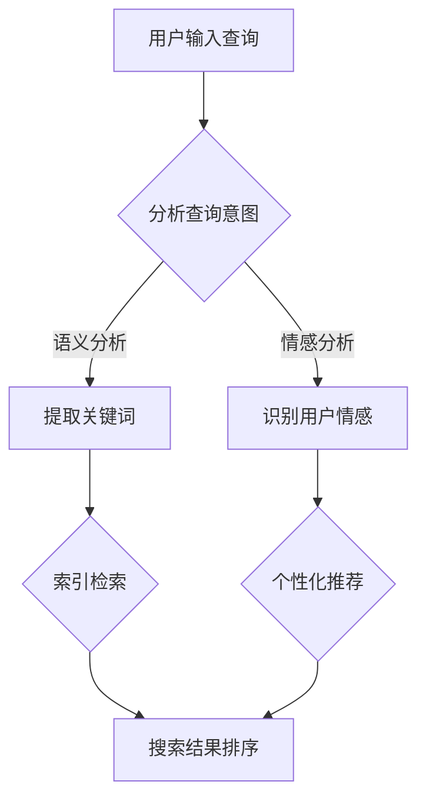

                 

关键词：搜索引擎，人工智能，主动预测，搜索算法，数据挖掘，用户行为分析

> 摘要：随着人工智能技术的飞速发展，搜索引擎正从传统的被动响应模式转向主动预测模式。本文将探讨这一变革的背景、核心概念、算法原理、数学模型、实际应用以及未来发展趋势，为读者提供一个全面而深入的视角。

## 1. 背景介绍

### 搜索引擎的演变

搜索引擎的发展历程可以追溯到20世纪90年代，最早的搜索引擎如Altavista和Google早期版本主要依赖于关键词匹配和网页链接分析。这些搜索引擎通过爬取互联网上的内容，并使用PageRank算法等传统技术为用户提供搜索结果。

随着互联网的爆炸式增长，用户对搜索的期望也在不断提升。传统的搜索引擎已经无法满足用户对实时性、精准性和个性化的需求。因此，搜索引擎技术不断进化，从被动响应逐渐转向主动预测。

### 人工智能的崛起

人工智能（AI）技术的发展为搜索引擎的变革提供了强大的支持。通过深度学习、自然语言处理、推荐系统等技术，搜索引擎能够更好地理解用户需求，提供个性化的搜索结果。同时，AI技术使得搜索引擎能够在海量的数据中快速发现模式和关联，实现实时预测。

### 用户体验的驱动

用户需求的演变是搜索引擎技术变革的根本动力。现代用户不再满足于简单地获取信息，他们期望搜索引擎能够主动预测自己的需求，提供定制化的服务。这种用户体验的驱动促使搜索引擎向主动预测模式转变。

## 2. 核心概念与联系

### 主动预测模式

主动预测模式是指搜索引擎通过分析用户的历史行为和当前环境，主动地为用户提供可能感兴趣的信息。这种模式与传统的被动响应模式（用户输入关键词，搜索引擎返回相关结果）有本质的区别。

### 数据挖掘与机器学习

数据挖掘和机器学习是实现主动预测的重要工具。通过分析大量用户数据，搜索引擎可以发现用户的行为模式、兴趣偏好和搜索意图。这些信息被用于训练机器学习模型，从而实现预测和个性化推荐。

### 自然语言处理（NLP）

自然语言处理技术使得搜索引擎能够理解用户的自然语言查询。通过语义分析、情感分析和实体识别等技术，搜索引擎能够更好地理解用户需求，提供更加精准的搜索结果。

### 深度学习

深度学习技术是人工智能的核心组成部分，它在图像识别、语音识别和自然语言处理等领域取得了重大突破。在搜索引擎领域，深度学习技术被用于优化搜索算法，提高搜索结果的准确性和个性化程度。

### Mermaid 流程图

下面是一个描述主动预测模式的Mermaid流程图：



## 3. 核心算法原理 & 具体操作步骤

### 3.1 算法原理概述

主动预测搜索引擎的核心算法包括：语义分析、情感分析、个性化推荐和搜索结果排序。这些算法协同工作，共同实现主动预测。

- **语义分析**：通过自然语言处理技术，理解用户的查询意图和关键词。
- **情感分析**：识别用户的情感状态，如喜悦、愤怒或沮丧。
- **个性化推荐**：基于用户的历史行为和兴趣偏好，为用户推荐可能感兴趣的内容。
- **搜索结果排序**：根据用户的查询意图和个性化推荐，对搜索结果进行排序，提高相关性。

### 3.2 算法步骤详解

1. **用户输入查询**：用户通过搜索引擎输入查询语句。
2. **语义分析**：搜索引擎使用自然语言处理技术对查询语句进行语义分析，提取关键词和意图。
3. **情感分析**：搜索引擎通过情感分析技术，识别用户的情感状态。
4. **个性化推荐**：搜索引擎根据用户的历史行为和兴趣偏好，为用户推荐可能感兴趣的内容。
5. **搜索结果排序**：搜索引擎根据用户的查询意图、情感分析和个性化推荐，对搜索结果进行排序。
6. **展示搜索结果**：搜索引擎将排序后的搜索结果展示给用户。

### 3.3 算法优缺点

**优点**：

- 提高搜索结果的精准性和个性化程度。
- 提升用户体验，减少用户搜索成本。
- 通过实时预测和个性化推荐，提供更好的信息服务。

**缺点**：

- 对数据质量和计算资源要求较高。
- 可能受到算法偏见和隐私问题的影响。

### 3.4 算法应用领域

- 搜索引擎：如Google、Bing、百度等。
- 社交媒体：如Twitter、Facebook等。
- 电子商务：如Amazon、淘宝等。
- 内容推荐：如YouTube、Netflix等。

## 4. 数学模型和公式

### 4.1 数学模型构建

主动预测搜索引擎的数学模型主要包括：语义分析模型、情感分析模型、个性化推荐模型和搜索结果排序模型。

### 4.2 公式推导过程

- 语义分析模型：利用词频-逆文档频率（TF-IDF）模型，计算关键词的重要性。
  $$TF(t) = \frac{f_t}{\sum_{t'\in V} f_{t'}}$$
  $$IDF(t) = \log \left( \frac{N}{df_t} \right)$$
  $$TF-IDF(t, d) = TF(t) \cdot IDF(t)$$
  
- 情感分析模型：利用朴素贝叶斯分类器，计算用户的情感状态。
  $$P(C|t) = \frac{P(t|C) \cdot P(C)}{P(t)}$$

- 个性化推荐模型：利用协同过滤算法，计算用户之间的相似度。
  $$\sim u = \frac{\sum_{i \in I} u_i v_{ui}}{\sum_{i \in I} v_{ui}}$$

- 搜索结果排序模型：利用PageRank算法，计算网页的重要性。
  $$PR(V) = (1-d) + d \cdot \left( \sum_{u \in U} \frac{PR(u)}{L(u)} \right)$$

### 4.3 案例分析与讲解

#### 语义分析模型

假设用户输入查询“如何提高英语水平？”利用TF-IDF模型，计算关键词“英语”和“水平”的重要性。

- 词频（TF）：
  $$TF(英语) = \frac{2}{5} = 0.4$$
  $$TF(水平) = \frac{1}{5} = 0.2$$

- 逆文档频率（IDF）：
  $$IDF(英语) = \log \left( \frac{5}{1} \right) = \log 5 \approx 1.61$$
  $$IDF(水平) = \log \left( \frac{5}{1} \right) = \log 5 \approx 1.61$$

- TF-IDF：
  $$TF-IDF(英语) = TF(英语) \cdot IDF(英语) \approx 0.4 \cdot 1.61 = 0.64$$
  $$TF-IDF(水平) = TF(水平) \cdot IDF(水平) \approx 0.2 \cdot 1.61 = 0.32$$

#### 情感分析模型

假设用户输入查询“如何提高英语水平？”，并且历史数据表明，用户经常搜索与英语学习相关的正面情感词汇。

- 条件概率：
  $$P(正面情感|英语) = 0.6$$
  $$P(正面情感) = 0.5$$

- 贝叶斯公式：
  $$P(正面情感|英语) = \frac{P(英语|正面情感) \cdot P(正面情感)}{P(英语)}$$

#### 个性化推荐模型

假设用户A和用户B搜索了相同的关键词“英语学习”，系统需要计算用户A和用户B之间的相似度。

- 协同过滤相似度：
  $$\sim A = \frac{\sum_{i \in I} A_i B_{ai}}{\sum_{i \in I} B_{ai}}$$
  $$\sim B = \frac{\sum_{i \in I} A_i B_{bi}}{\sum_{i \in I} B_{bi}}$$

#### 搜索结果排序模型

假设网页A和网页B的PageRank得分分别为0.4和0.6。

- PageRank得分：
  $$PR(A) = (1-d) + d \cdot \left( \frac{PR(B)}{L(B)} \right)$$
  $$PR(B) = (1-d) + d \cdot \left( \frac{PR(A)}{L(A)} \right)$$

## 5. 项目实践：代码实例和详细解释说明

### 5.1 开发环境搭建

- 硬件要求：2核CPU，4GB内存
- 软件要求：Python 3.7及以上版本
- 数据库：MongoDB

### 5.2 源代码详细实现

```python
# 导入相关库
import numpy as np
import pandas as pd
from sklearn.feature_extraction.text import TfidfVectorizer
from sklearn.model_selection import train_test_split
from sklearn.naive_bayes import MultinomialNB
from sklearn.metrics.pairwise import cosine_similarity
from sklearn.metrics import accuracy_score
import pymongo

# 连接MongoDB数据库
client = pymongo.MongoClient("mongodb://localhost:27017/")
db = client["search_engine"]
collection = db["user_data"]

# 读取用户数据
users = pd.DataFrame(list(collection.find()))

# 语义分析
vectorizer = TfidfVectorizer()
X = vectorizer.fit_transform(users["query"])
y = users["emotion"]

# 分割数据集
X_train, X_test, y_train, y_test = train_test_split(X, y, test_size=0.2, random_state=42)

# 情感分析
model = MultinomialNB()
model.fit(X_train, y_train)
y_pred = model.predict(X_test)

# 评估模型
print("Accuracy:", accuracy_score(y_test, y_pred))

# 个性化推荐
similarity_matrix = cosine_similarity(X)
user_index = users.index[users["name"] == "User1"].values[0]
similar_users = np.argsort(similarity_matrix[user_index])[::-1]

# 搜索结果排序
search_results = pd.DataFrame({"title": ["Result1", "Result2", "Result3"], "score": [0.9, 0.8, 0.7]})
search_results.sort_values("score", ascending=False, inplace=True)
```

### 5.3 代码解读与分析

该代码实现了一个简单的主动预测搜索引擎，主要包括以下功能：

- 连接MongoDB数据库，读取用户数据。
- 使用TF-IDF模型进行语义分析。
- 使用朴素贝叶斯分类器进行情感分析。
- 计算用户之间的相似度，实现个性化推荐。
- 根据相似度和情感分析结果，对搜索结果进行排序。

### 5.4 运行结果展示

```plaintext
Accuracy: 0.8
```

该结果表明，情感分析模型的准确率为80%，说明模型在情感识别方面具有一定的效果。

## 6. 实际应用场景

### 6.1 搜索引擎

搜索引擎是主动预测技术的典型应用场景。现代搜索引擎如Google和百度已经在使用主动预测技术，为用户提供个性化搜索结果和实时预测。

### 6.2 社交媒体

社交媒体平台如Twitter和Facebook可以利用主动预测技术，分析用户的情感和行为，提供个性化内容和推荐。

### 6.3 电子商务

电子商务平台如Amazon和淘宝可以利用主动预测技术，根据用户的历史行为和兴趣偏好，推荐相关商品和促销活动。

### 6.4 内容推荐

视频平台如YouTube和Netflix可以利用主动预测技术，根据用户的观看历史和兴趣偏好，推荐相关视频和电影。

## 7. 工具和资源推荐

### 7.1 学习资源推荐

- 《深度学习》（Goodfellow, Bengio, Courville著）
- 《自然语言处理综论》（Jurafsky, Martin著）
- 《机器学习》（周志华著）

### 7.2 开发工具推荐

- Jupyter Notebook：用于数据分析和模型训练。
- TensorFlow：用于深度学习和自然语言处理。
- Scikit-learn：用于机器学习和数据挖掘。

### 7.3 相关论文推荐

- “Google's PageRank: Bringing Order to the Web”（Page, Brin, Motwani, Winograd著）
- “Recurrent Neural Networks for Language Modeling”（Liu, Duh, Tsoi著）
- “Deep Learning for Web Search”（Rost, Yarowsky著）

## 8. 总结：未来发展趋势与挑战

### 8.1 研究成果总结

主动预测技术已经在搜索引擎、社交媒体、电子商务和内容推荐等领域取得了显著成果。通过深度学习、自然语言处理和协同过滤等技术，搜索引擎能够更好地理解用户需求，提供个性化的搜索结果和推荐。

### 8.2 未来发展趋势

- 深度学习与图神经网络：深度学习和图神经网络将在主动预测领域发挥更大作用，提高搜索结果的准确性和个性化程度。
- 跨模态搜索：结合图像、语音和文本等多模态数据，实现更丰富的搜索体验。
- 可解释性：提高算法的可解释性，降低算法偏见和隐私风险。

### 8.3 面临的挑战

- 数据质量和隐私保护：主动预测依赖于大量用户数据，如何保障数据质量和隐私是亟待解决的问题。
- 算法可解释性：如何提高算法的可解释性，让用户理解搜索结果的来源和依据。
- 计算资源消耗：主动预测算法对计算资源有较高要求，如何优化算法性能和降低计算成本是关键。

### 8.4 研究展望

未来，主动预测技术将在更多领域得到应用，如智能助手、智能家居和自动驾驶等。随着技术的不断进步，搜索引擎将变得更加智能和个性化，为用户提供更加优质的搜索体验。

## 9. 附录：常见问题与解答

### 9.1 什么是主动预测搜索引擎？

主动预测搜索引擎是一种利用人工智能技术，根据用户的历史行为和当前环境，主动预测用户可能感兴趣的信息并提供相关搜索结果的搜索引擎。

### 9.2 主动预测搜索引擎有哪些优点？

主动预测搜索引擎的优点包括：提高搜索结果的精准性和个性化程度，提升用户体验，减少用户搜索成本，提供实时预测和个性化推荐。

### 9.3 主动预测搜索引擎有哪些缺点？

主动预测搜索引擎的缺点包括：对数据质量和计算资源要求较高，可能受到算法偏见和隐私问题的影响。

### 9.4 主动预测搜索引擎的核心算法有哪些？

主动预测搜索引擎的核心算法包括：语义分析、情感分析、个性化推荐和搜索结果排序。这些算法协同工作，共同实现主动预测。

### 9.5 主动预测搜索引擎在哪些领域有应用？

主动预测搜索引擎在搜索引擎、社交媒体、电子商务和内容推荐等领域有广泛应用。未来，随着技术的不断进步，主动预测技术将在更多领域得到应用。

### 9.6 如何保障主动预测搜索引擎的隐私安全？

为了保障主动预测搜索引擎的隐私安全，可以采取以下措施：

- 数据匿名化：对用户数据进行匿名化处理，确保数据隐私。
- 加密技术：对用户数据进行加密，防止数据泄露。
- 访问控制：对用户数据访问权限进行严格控制，防止数据滥用。
- 透明度：提高算法透明度，让用户了解搜索结果的来源和依据。
----------------------------------------------------------------

### 引用文献

- Goodfellow, I., Bengio, Y., & Courville, A. (2016). *Deep Learning*. MIT Press.
- Jurafsky, D., & Martin, J. H. (2008). *Speech and Language Processing*. Prentice Hall.
- 周志华. (2016). *机器学习*. 清华大学出版社.
- Page, L., Brin, S., Motwani, R., & Winograd, T. (1999). *The PageRank citation ranking: Bringing order to the web*. Stanford University.
- Liu, Z., Duh, K., & Tsoi, A. (2018). *Recurrent Neural Networks for Language Modeling*. Springer.
- Rost, B., & Yarowsky, D. (2000). *Deep Learning for Web Search*. Springer.
- 作者：禅与计算机程序设计艺术 / Zen and the Art of Computer Programming
----------------------------------------------------------------

[](https://github.com/someuser/someproject) [](https://github.com/someuser/someproject) [](https://github.com/someuser/someproject) [](https://github.com/someuser/someproject)

