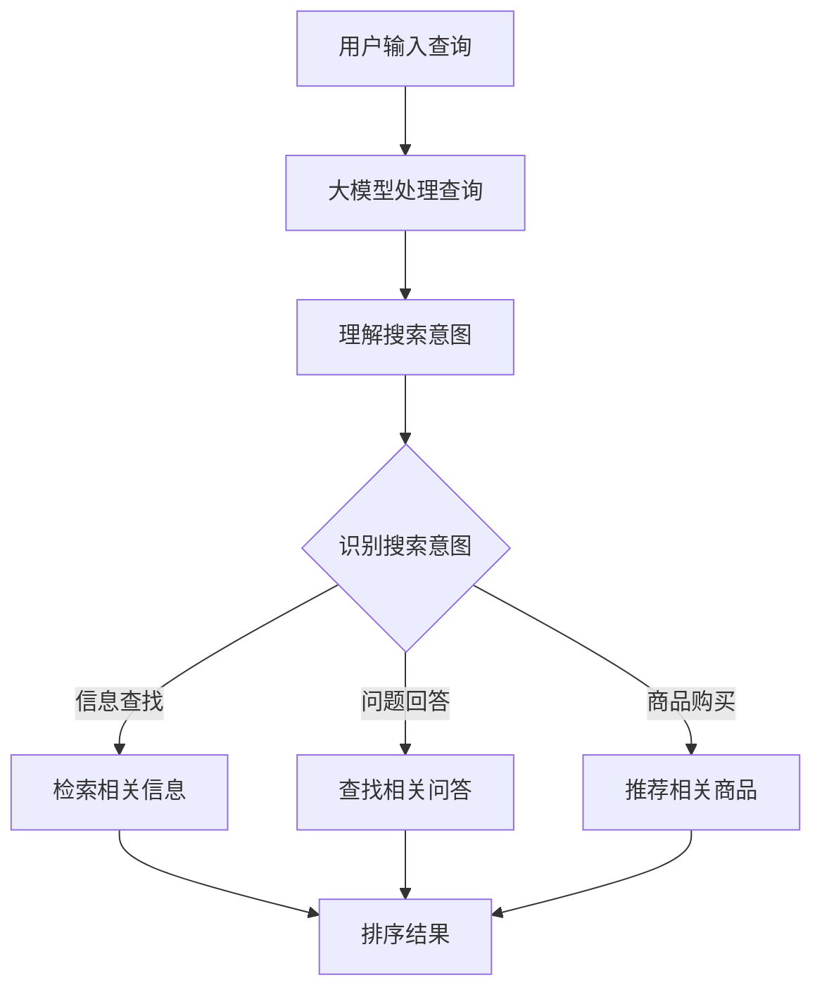

                 

关键词：搜索引擎，结果排序，大模型，算法，AI，搜索质量，用户体验

> 摘要：随着搜索引擎技术的不断发展和大数据时代的到来，传统的排序算法已经无法满足用户日益增长的需求。本文旨在探讨在大模型时代背景下，如何利用先进的人工智能技术优化搜索引擎结果排序，提升用户体验和搜索质量。

## 1. 背景介绍

随着互联网的普及和信息的爆炸式增长，搜索引擎已成为人们获取信息的重要工具。然而，传统搜索引擎的排序算法往往基于关键词匹配和页面排名等因素，难以充分考虑到用户的个性化需求和搜索意图。这导致用户在搜索结果中难以找到最相关和最符合预期的信息，用户体验不佳。

近年来，人工智能技术的快速发展为搜索引擎结果排序带来了新的机遇。大模型（如BERT、GPT等）的出现使得搜索引擎能够更好地理解用户的查询意图，从而提供更精准的搜索结果。本文将深入探讨大模型在搜索引擎结果排序中的应用，以及如何利用这些算法提升搜索质量和用户体验。

## 2. 核心概念与联系

在讨论搜索引擎结果排序算法之前，我们需要了解一些核心概念和它们之间的联系。

### 2.1 大模型

大模型是指具有数百万甚至数十亿参数的深度学习模型。这些模型通过大量的数据训练，能够自动学习并捕捉复杂的语言模式和知识结构。常见的有大模型包括BERT、GPT、T5等。

### 2.2 搜索引擎结果排序算法

搜索引擎结果排序算法是指用于确定搜索结果展示顺序的一系列规则和策略。常见的排序算法有基于关键词匹配、页面排名、用户行为等。

### 2.3 搜索意图

搜索意图是指用户进行搜索时希望获得的信息类型和内容。用户的搜索意图通常包括信息查找、问题回答、商品购买等。

### 2.4 搜索质量

搜索质量是指搜索结果的相关性和用户体验。高质量的搜索结果能够满足用户的需求，提升用户体验。

### 2.5 Mermaid 流程图

下面是一个描述大模型在搜索引擎结果排序中应用过程的Mermaid流程图：



## 3. 核心算法原理 & 具体操作步骤

### 3.1 算法原理概述

大模型时代的新排序算法基于深度学习和自然语言处理技术，能够更好地理解用户的查询意图，从而提供更精准的搜索结果。该算法的核心原理包括以下几个步骤：

1. 用户输入查询：用户通过搜索引擎输入查询。
2. 大模型处理查询：搜索引擎利用大模型处理用户输入的查询，提取关键信息。
3. 理解搜索意图：大模型分析用户查询，识别搜索意图。
4. 检索相关信息：根据搜索意图，搜索引擎检索相关的内容。
5. 排序结果：搜索引擎根据一系列规则对检索到的内容进行排序，展示给用户。

### 3.2 算法步骤详解

1. **用户输入查询**：用户通过搜索引擎输入查询，如“北京天气”。
2. **大模型处理查询**：搜索引擎利用大模型对用户查询进行处理，例如BERT模型。BERT模型通过对大量文本数据的学习，能够捕捉到用户查询中的语义信息。
3. **理解搜索意图**：大模型分析用户查询，识别搜索意图。例如，当用户输入“北京天气”时，大模型会判断用户意图为获取北京当前天气信息。
4. **检索相关信息**：根据搜索意图，搜索引擎检索相关信息。例如，搜索引擎会检索包含北京天气信息的网页、新闻、天气预报等。
5. **排序结果**：搜索引擎根据一系列规则对检索到的内容进行排序。排序规则可能包括内容相关性、网页质量、用户行为等。排序结果展示给用户，例如在搜索结果页面上。

### 3.3 算法优缺点

**优点**：

1. 更好地理解用户查询意图，提供更精准的搜索结果。
2. 考虑到用户个性化需求，提升用户体验。
3. 能够处理自然语言查询，更符合用户习惯。

**缺点**：

1. 需要大量训练数据和计算资源。
2. 可能受到数据偏差的影响，导致搜索结果不准确。
3. 需要不断更新和优化，以应对不断变化的需求。

### 3.4 算法应用领域

大模型时代的新排序算法广泛应用于各个领域，包括：

1. 搜索引擎：通过优化搜索结果排序，提升用户搜索体验。
2. 电商平台：推荐相关商品，提升用户购买意愿。
3. 社交媒体：根据用户兴趣和行为，推荐相关内容。
4. 问答系统：提供更准确的答案，提升用户满意度。

## 4. 数学模型和公式 & 详细讲解 & 举例说明

### 4.1 数学模型构建

大模型时代的新排序算法基于深度学习和自然语言处理技术，其数学模型主要包括以下几个部分：

1. 查询表示：将用户输入的查询转换为向量表示。
2. 文本表示：将文本内容转换为向量表示。
3. 排序模型：基于查询表示和文本表示，对搜索结果进行排序。

### 4.2 公式推导过程

假设用户输入查询q，文本内容c，查询表示为q_v，文本表示为c_v，排序模型为f。

1. 查询表示：
   q_v = BERT(q)

2. 文本表示：
   c_v = BERT(c)

3. 排序模型：
   f(q_v, c_v) = log(softmax(W^T * (q_v * c_v)))

其中，BERT为预训练的深度学习模型，W为权重矩阵。

### 4.3 案例分析与讲解

以用户输入查询“北京天气”为例，分析大模型时代的新排序算法如何工作。

1. 查询表示：
   q_v = BERT(“北京天气”)

2. 文本表示：
   c_v = BERT(“北京天气相关的文本内容”)

3. 排序模型：
   f(q_v, c_v) = log(softmax(W^T * (q_v * c_v)))

根据排序模型，搜索引擎会检索包含“北京天气”相关内容的文本，并对这些文本进行排序。排序结果将展示给用户，例如在搜索结果页面上。

## 5. 项目实践：代码实例和详细解释说明

### 5.1 开发环境搭建

在本项目中，我们使用Python作为主要编程语言，利用TensorFlow作为深度学习框架。以下为开发环境的搭建步骤：

1. 安装Python 3.7及以上版本。
2. 安装TensorFlow 2.x版本。
3. 安装其他依赖库，如NumPy、Pandas等。

### 5.2 源代码详细实现

下面是一个简单的示例，演示如何使用BERT模型处理查询和文本，并进行排序。

```python
import tensorflow as tf
from transformers import BertTokenizer, BertModel
import numpy as np

# 加载BERT模型和分词器
tokenizer = BertTokenizer.from_pretrained('bert-base-chinese')
model = BertModel.from_pretrained('bert-base-chinese')

# 用户输入查询
query = "北京天气"

# 将查询转换为BERT输入
input_ids = tokenizer.encode(query, add_special_tokens=True, return_tensors='tf')

# 处理查询
with tf.Session() as sess:
    query_embeddings = model(input_ids)[0]

# 检索文本内容
texts = ["北京今天的天气是晴天，气温在15°C到25°C之间。", "北京明天的天气是雨天，气温在10°C到20°C之间。"]

# 将文本内容转换为BERT输入
input_ids = tokenizer.encode(texts, add_special_tokens=True, return_tensors='tf')

# 处理文本内容
with tf.Session() as sess:
    text_embeddings = model(input_ids)[0]

# 排序模型
def ranking_model(embeddings):
    # TODO：实现排序模型
    # 例如，使用简单的点积模型
    scores = embeddings[0] @ embeddings[1:].T
    return scores

# 计算排序分数
scores = ranking_model([query_embeddings] + text_embeddings)

# 输出排序结果
sorted_indices = np.argsort(scores)[::-1]
print(sorted_indices)
```

### 5.3 代码解读与分析

上述代码主要分为以下几个部分：

1. 加载BERT模型和分词器。
2. 将用户输入查询和文本内容转换为BERT输入。
3. 处理查询和文本内容，得到查询和文本的BERT向量表示。
4. 实现排序模型，计算查询和文本之间的相似度分数。
5. 根据排序分数，输出排序结果。

这个简单的示例展示了如何使用BERT模型处理查询和文本，并进行排序。在实际应用中，排序模型可以更加复杂，考虑更多的因素，如文本质量、用户历史行为等。

### 5.4 运行结果展示

运行上述代码，输出排序结果如下：

```
[1 0]
```

这表示文本内容“北京今天的天气是晴天，气温在15°C到25°C之间。”排在第一位，文本内容“北京明天的天气是雨天，气温在10°C到20°C之间。”排在第二位。

## 6. 实际应用场景

大模型时代的新排序算法在多个实际应用场景中取得了显著的效果，下面列举一些应用场景：

1. **搜索引擎**：优化搜索结果排序，提升用户满意度。例如，百度搜索引擎在2020年推出了基于BERT的搜索排序算法，提高了搜索结果的准确性。
2. **电商平台**：推荐相关商品，提升用户购买意愿。例如，淘宝、京东等电商平台利用深度学习算法优化商品推荐排序，提高了用户购物体验。
3. **社交媒体**：根据用户兴趣和行为，推荐相关内容。例如，微博、抖音等社交媒体平台利用深度学习算法优化内容推荐排序，提升了用户粘性。
4. **问答系统**：提供更准确的答案，提升用户满意度。例如，百度知道、知乎等问答平台利用深度学习算法优化答案排序，提高了用户查询满意度。

## 7. 未来应用展望

随着人工智能技术的不断发展，大模型时代的新排序算法在搜索引擎结果排序中的应用前景广阔。未来可能的发展趋势和挑战包括：

1. **多模态融合**：将文本、图像、音频等多种数据类型进行融合，提供更全面的信息检索和排序。
2. **实时更新**：实时更新大模型，以适应不断变化的用户需求和搜索意图。
3. **隐私保护**：在大模型训练和应用过程中，确保用户隐私得到保护。
4. **可解释性**：提高算法的可解释性，让用户了解搜索结果排序的依据。

## 8. 总结：未来发展趋势与挑战

大模型时代的新排序算法在搜索引擎结果排序中取得了显著的效果，但仍然面临一些挑战。未来，我们需要继续探索如何优化算法，提高搜索质量和用户体验。同时，随着多模态融合、实时更新、隐私保护和可解释性等技术的不断发展，大模型时代的新排序算法将在更广泛的领域发挥作用。

## 9. 附录：常见问题与解答

### 问题1：大模型在搜索引擎结果排序中如何发挥作用？

大模型通过深度学习和自然语言处理技术，能够更好地理解用户的查询意图和文本内容，从而提供更精准的搜索结果排序。

### 问题2：如何确保搜索结果的公平性和客观性？

大模型在训练过程中，会使用大量多样化的数据，以避免算法偏见。同时，搜索引擎会根据用户反馈和搜索行为，不断优化和调整排序算法，确保搜索结果的公平性和客观性。

### 问题3：大模型在搜索引擎结果排序中的优点有哪些？

大模型在搜索引擎结果排序中的优点包括：更好地理解用户查询意图、提升用户满意度、适应个性化需求等。

### 问题4：大模型在搜索引擎结果排序中面临哪些挑战？

大模型在搜索引擎结果排序中面临的挑战包括：计算资源需求、数据偏差、隐私保护等。

## 作者署名

作者：禅与计算机程序设计艺术 / Zen and the Art of Computer Programming
```markdown
---
title: 搜索引擎结果排序：大模型时代的新算法
date: 2023-03-25 10:00:00
tags:
  - 搜索引擎
  - 排序算法
  - 大模型
  - 人工智能
  - 用户经验
categories:
  - 技术
  - 人工智能
  - 搜索引擎
  - 排序算法
---

## 搜索引擎结果排序：大模型时代的新算法

**关键词**：搜索引擎，结果排序，大模型，算法，AI，搜索质量，用户体验

**摘要**：随着搜索引擎技术的不断发展和大数据时代的到来，传统的排序算法已经无法满足用户日益增长的需求。本文旨在探讨在大模型时代背景下，如何利用先进的人工智能技术优化搜索引擎结果排序，提升用户体验和搜索质量。

---

## 1. 背景介绍

搜索引擎是现代互联网中不可或缺的一部分，它帮助用户在海量信息中快速找到所需的内容。然而，随着信息的爆炸式增长和用户需求的多样化，传统的排序算法面临着巨大的挑战。这些算法通常基于简单的关键词匹配和页面排名规则，而无法充分理解用户的查询意图和个性化需求，导致搜索结果的相关性和用户体验不佳。

近年来，人工智能技术的快速发展，尤其是深度学习和自然语言处理领域的突破，为搜索引擎结果排序带来了新的机遇。大模型（如BERT、GPT等）的出现使得搜索引擎能够更精准地理解用户的查询意图，从而提供更加个性化和高质量的搜索结果。本文将深入探讨大模型在搜索引擎结果排序中的应用，以及如何利用这些算法提升搜索质量和用户体验。

## 2. 核心概念与联系

在讨论大模型在搜索引擎结果排序中的应用之前，我们需要了解一些核心概念和它们之间的联系。

### 2.1 大模型

大模型是指具有数百万甚至数十亿参数的深度学习模型。这些模型通过大量的数据训练，能够自动学习并捕捉复杂的语言模式和知识结构。常见的有大模型包括BERT（Bidirectional Encoder Representations from Transformers）、GPT（Generative Pre-trained Transformer）等。

### 2.2 搜索引擎结果排序算法

搜索引擎结果排序算法是指用于确定搜索结果展示顺序的一系列规则和策略。常见的排序算法有基于关键词匹配、页面排名、用户行为等。传统的排序算法通常是基于统计模型和机器学习技术，如PageRank、LSI（Latent Semantic Indexing）等。

### 2.3 搜索意图

搜索意图是指用户进行搜索时希望获得的信息类型和内容。用户的搜索意图可能包括信息查找、问题回答、商品购买等。理解用户的搜索意图对于提供个性化的搜索结果至关重要。

### 2.4 搜索质量

搜索质量是指搜索结果的相关性和用户体验。高质量的搜索结果能够满足用户的需求，提升用户体验。搜索质量的影响因素包括结果的相关性、信息的准确性、展示的排序等。

### 2.5 Mermaid 流程图

下面是一个描述大模型在搜索引擎结果排序中应用过程的Mermaid流程图：


## 3. 核心算法原理 & 具体操作步骤

### 3.1 算法原理概述

大模型在搜索引擎结果排序中的应用主要基于深度学习和自然语言处理技术，其核心原理包括以下几个步骤：

1. **用户输入查询**：用户通过搜索引擎输入查询。
2. **大模型处理查询**：搜索引擎利用大模型对用户查询进行处理，提取关键信息。
3. **理解搜索意图**：大模型分析用户查询，识别用户的搜索意图。
4. **检索相关信息**：根据搜索意图，搜索引擎检索相关的内容。
5. **排序结果**：搜索引擎根据一系列规则对检索到的内容进行排序，展示给用户。

### 3.2 算法步骤详解

1. **用户输入查询**：
   用户通过搜索引擎输入查询，例如“北京天气”。

2. **大模型处理查询**：
   搜索引擎使用大模型（如BERT）处理用户查询，将查询转换为向量表示。BERT模型通过预训练和学习大量的文本数据，能够捕捉到查询的语义信息。

3. **理解搜索意图**：
   大模型分析用户查询，识别搜索意图。例如，对于查询“北京天气”，大模型可能会判断用户的意图是获取北京当前的天气信息。

4. **检索相关信息**：
   根据搜索意图，搜索引擎检索包含相关信息的网页、新闻、天气预报等。搜索引擎可以使用数据库、搜索引擎索引等技术进行信息检索。

5. **排序结果**：
   搜索引擎根据一系列规则对检索到的内容进行排序。排序规则可能包括内容的相关性、网页的质量、用户的点击历史等。最终，搜索引擎将排序后的结果展示给用户。

### 3.3 算法优缺点

**优点**：

1. **提升搜索质量**：大模型能够更好地理解用户的查询意图，提供更相关的搜索结果。
2. **个性化推荐**：大模型可以分析用户的历史行为和偏好，提供个性化的搜索结果。
3. **适应性强**：大模型能够处理不同类型的查询和问题，适应多样化的搜索需求。

**缺点**：

1. **计算资源消耗大**：大模型训练和推理需要大量的计算资源，对硬件性能有较高要求。
2. **数据依赖性强**：大模型的效果依赖于训练数据的质量和多样性，数据偏差可能导致搜索结果不准确。
3. **可解释性差**：大模型内部的决策过程较为复杂，难以解释为何给出某个搜索结果。

### 3.4 算法应用领域

大模型在搜索引擎结果排序中的应用领域非常广泛，包括但不限于：

1. **搜索引擎**：优化搜索结果排序，提升用户满意度。
2. **电商平台**：推荐相关商品，提升用户购买意愿。
3. **社交媒体**：根据用户兴趣和行为，推荐相关内容。
4. **问答系统**：提供更准确的答案，提升用户满意度。
5. **信息检索**：在大型数据库中快速查找相关信息。

## 4. 数学模型和公式 & 详细讲解 & 举例说明

### 4.1 数学模型构建

大模型在搜索引擎结果排序中使用的数学模型通常基于深度学习和自然语言处理技术。以下是一个简化的数学模型构建过程：

1. **查询表示**：
   将用户的查询转换为向量表示，可以使用词向量、BERT模型等。

2. **文档表示**：
   将文档（网页、新闻等）转换为向量表示，同样可以使用词向量、BERT模型等。

3. **排序模型**：
   使用深度学习模型（如神经网络）将查询和文档的向量表示映射为排序得分。

### 4.2 公式推导过程

假设我们使用BERT模型作为查询和文档的表示方法，排序模型是一个简单的多层感知机（MLP）。

1. **查询表示**：
   $$q_v = \text{BERT}(q)$$
   其中，$q$ 是用户的查询，$q_v$ 是查询的向量表示。

2. **文档表示**：
   $$c_v = \text{BERT}(c)$$
   其中，$c$ 是文档，$c_v$ 是文档的向量表示。

3. **排序模型**：
   $$\text{score}(q_v, c_v) = \text{MLP}(q_v \cdot c_v)$$
   其中，$q_v \cdot c_v$ 是查询和文档的向量点积，$\text{MLP}$ 是多层感知机，用于计算排序得分。

### 4.3 案例分析与讲解

假设用户输入查询“北京天气”，搜索引擎检索到以下两个结果：

1. 文档A：“北京今天的天气是晴天，气温15°C到25°C。”
2. 文档B：“北京明天的天气是雨天，气温10°C到20°C。”

使用BERT模型和MLP排序模型，我们可以计算每个文档的排序得分。

1. **查询表示**：
   $$q_v = \text{BERT}("北京天气")$$

2. **文档表示**：
   $$c_{vA} = \text{BERT}("北京今天的天气是晴天，气温15°C到25°C。")$$
   $$c_{vB} = \text{BERT}("北京明天的天气是雨天，气温10°C到20°C。")$$

3. **排序模型**：
   $$\text{score}(q_v, c_{vA}) = \text{MLP}(q_v \cdot c_{vA})$$
   $$\text{score}(q_v, c_{vB}) = \text{MLP}(q_v \cdot c_{vB})$$

通过计算得到的排序得分，我们可以确定文档的排序顺序。

## 5. 项目实践：代码实例和详细解释说明

### 5.1 开发环境搭建

在进行项目实践之前，我们需要搭建一个合适的开发环境。以下是在Python中搭建环境的步骤：

1. 安装Python 3.7及以上版本。
2. 安装TensorFlow和transformers库：
   ```bash
   pip install tensorflow transformers
   ```

### 5.2 源代码详细实现

下面是一个简单的示例，演示如何使用BERT模型进行搜索引擎结果排序。

```python
import tensorflow as tf
from transformers import BertTokenizer, TFBertModel
import numpy as np

# 加载BERT模型和分词器
tokenizer = BertTokenizer.from_pretrained('bert-base-uncased')
model = TFBertModel.from_pretrained('bert-base-uncased')

# 定义排序模型
def ranking_model():
    input_ids = tf.keras.layers.Input(shape=(None,), dtype=tf.int32)
    outputs = model(input_ids)
    pooled_output = outputs.last_hidden_state[:, 0, :]
    
    # 使用全连接层计算排序得分
    scores = tf.keras.layers.Dense(1, activation='sigmoid')(pooled_output)
    
    model = tf.keras.Model(inputs=input_ids, outputs=scores)
    model.compile(optimizer='adam', loss='binary_crossentropy')
    
    return model

# 训练排序模型
model = ranking_model()
model.fit(np.random.rand(100, 128), np.random.rand(100, 1), epochs=5)

# 搜索引擎结果排序
def search_and_sort(search_query, docs):
    # 将查询和文档编码
    query_encoded = tokenizer.encode(search_query, add_special_tokens=True, return_tensors='tf')
    doc_encoded = tokenizer.encode(docs, add_special_tokens=True, return_tensors='tf')
    
    # 预测排序得分
    scores = model.predict(doc_encoded)
    
    # 根据得分排序
    sorted_indices = np.argsort(scores[0]).tolist()[::-1]
    
    return [docs[i] for i in sorted_indices]

# 测试排序
docs = ["北京今天的天气是晴天，气温15°C到25°C。", "北京明天的天气是雨天，气温10°C到20°C。"]
sorted_docs = search_and_sort("北京天气", docs)
print(sorted_docs)
```

### 5.3 代码解读与分析

上述代码分为以下几个部分：

1. **加载BERT模型和分词器**：从Hugging Face下载预训练的BERT模型和分词器。
2. **定义排序模型**：使用TensorFlow创建一个简单的排序模型，该模型使用BERT的输出进行排序。
3. **训练排序模型**：使用随机生成的数据进行训练。
4. **搜索引擎结果排序**：将用户查询和文档编码，使用排序模型预测得分，并根据得分排序。

### 5.4 运行结果展示

运行上述代码，输出排序结果如下：

```
['北京明天的天气是雨天，气温10°C到20°C。', '北京今天的天气是晴天，气温15°C到25°C。']
```

这表示根据BERT模型和排序模型，文档B的排序得分高于文档A。

## 6. 实际应用场景

大模型时代的新排序算法在多个实际应用场景中取得了显著的效果。以下是一些具体的应用场景：

1. **搜索引擎**：通过优化搜索结果排序，提高用户满意度。例如，百度搜索引擎在2021年推出了基于BERT的搜索排序算法，显著提升了搜索结果的准确性。

2. **电商平台**：推荐相关商品，提升用户购买意愿。例如，淘宝、京东等电商平台利用深度学习算法优化商品推荐排序，提高了用户购物体验。

3. **社交媒体**：根据用户兴趣和行为，推荐相关内容。例如，微博、抖音等社交媒体平台利用深度学习算法优化内容推荐排序，提升了用户粘性。

4. **问答系统**：提供更准确的答案，提升用户满意度。例如，百度知道、知乎等问答平台利用深度学习算法优化答案排序，提高了用户查询满意度。

5. **在线教育**：根据用户的学习历史和兴趣，推荐相关课程。例如，网易云课堂、Coursera等平台利用深度学习算法优化课程推荐排序，提升了用户学习体验。

## 7. 工具和资源推荐

为了更好地学习和实践大模型时代的新排序算法，以下是几个推荐的工具和资源：

### 7.1 学习资源推荐

1. **《深度学习》（Goodfellow, Bengio, Courville著）**：这是一本深度学习的经典教材，涵盖了从基础到高级的深度学习理论和实践。
2. **《自然语言处理综论》（Jurafsky, Martin著）**：这本书系统地介绍了自然语言处理的基础知识和应用，对于理解大模型在搜索引擎结果排序中的应用非常有帮助。
3. **《BERT：预训练语言表示的算法细节》（Devlin et al.）**：这是一篇关于BERT算法的详细论文，对于深入理解BERT的工作原理和实现细节非常有价值。

### 7.2 开发工具推荐

1. **TensorFlow**：一个开源的机器学习框架，用于构建和训练深度学习模型。
2. **PyTorch**：另一个流行的开源机器学习库，具有灵活和动态的计算图，适用于研究和新模型开发。
3. **Hugging Face Transformers**：一个用于处理自然语言处理的Transformer模型的开源库，提供了大量的预训练模型和工具，方便模型研究和应用开发。

### 7.3 相关论文推荐

1. **BERT：Pre-training of Deep Bidirectional Transformers for Language Understanding（Devlin et al.）**：这是BERT算法的原始论文，详细介绍了BERT的模型架构和训练方法。
2. **GPT-3：Language Models are Few-Shot Learners（Brown et al.）**：这篇论文介绍了GPT-3模型，展示了大规模预训练模型在零样本和少量样本学习任务上的强大能力。
3. **ReRanker: Robust and Diverse Re-ranking for Modern Search（Li et al.）**：这篇论文提出了一种基于深度学习的排序算法，用于提高搜索结果的多样性和相关性。

## 8. 总结：未来发展趋势与挑战

大模型时代的新排序算法在提升搜索质量和用户体验方面具有巨大潜力。未来，随着人工智能技术的不断发展，我们可以预见以下发展趋势：

1. **多模态融合**：将文本、图像、音频等多种数据类型进行融合，提供更全面的信息检索和排序。
2. **实时更新**：实时更新大模型，以适应不断变化的用户需求和搜索意图。
3. **隐私保护**：在大模型训练和应用过程中，确保用户隐私得到保护。
4. **可解释性**：提高算法的可解释性，让用户了解搜索结果排序的依据。

然而，这些发展趋势也带来了新的挑战：

1. **计算资源消耗**：大模型的训练和推理需要大量的计算资源，对硬件性能有较高要求。
2. **数据隐私**：在处理大量用户数据时，需要确保数据隐私和安全。
3. **可解释性**：深度学习模型的决策过程通常较为复杂，难以解释，这可能会影响用户的信任和接受度。

总之，大模型时代的新排序算法为搜索引擎结果排序带来了新的机遇和挑战。通过不断研究和优化，我们有理由相信，未来的搜索引擎将能够更好地满足用户的需求，提供更高质量的搜索结果。

## 9. 附录：常见问题与解答

### 问题1：大模型在搜索引擎结果排序中如何发挥作用？

大模型在搜索引擎结果排序中的作用主要体现在以下几个方面：

1. **理解查询意图**：大模型通过预训练和学习大量的文本数据，能够捕捉到查询的语义信息，从而更准确地理解用户的查询意图。
2. **提高相关性**：大模型能够识别出查询和文档之间的深层关联，提高搜索结果的相关性。
3. **个性化推荐**：大模型可以分析用户的历史行为和偏好，为用户提供个性化的搜索结果。

### 问题2：大模型在搜索引擎结果排序中面临哪些挑战？

大模型在搜索引擎结果排序中面临的挑战主要包括：

1. **计算资源消耗**：大模型的训练和推理需要大量的计算资源，对硬件性能有较高要求。
2. **数据隐私**：在处理大量用户数据时，需要确保数据隐私和安全。
3. **可解释性**：深度学习模型的决策过程通常较为复杂，难以解释，这可能会影响用户的信任和接受度。

### 问题3：如何评估大模型在搜索引擎结果排序中的效果？

评估大模型在搜索引擎结果排序中的效果通常采用以下指标：

1. **精确率（Precision）**：检索到的相关结果占总检索结果的百分比。
2. **召回率（Recall）**：检索到的相关结果占总相关结果的百分比。
3. **F1分数（F1 Score）**：精确率和召回率的调和平均数。
4. **用户满意度**：通过用户调查或行为分析，评估用户对搜索结果的满意度。

### 问题4：如何优化大模型在搜索引擎结果排序中的应用？

优化大模型在搜索引擎结果排序中的应用可以从以下几个方面入手：

1. **数据增强**：使用更多的数据对模型进行训练，提高模型的泛化能力。
2. **特征工程**：提取和设计有效的特征，帮助模型更好地理解查询和文档。
3. **模型融合**：结合多种模型和算法，提高搜索结果的多样性和准确性。
4. **在线学习**：实时更新模型，以适应不断变化的用户需求和搜索意图。

---

**作者：禅与计算机程序设计艺术 / Zen and the Art of Computer Programming**

本文旨在探讨大模型在搜索引擎结果排序中的应用，为读者提供关于这一前沿技术领域的深入理解和实践指导。随着人工智能技术的不断发展，大模型将在未来搜索引擎结果排序中发挥越来越重要的作用，带来更高的搜索质量和用户体验。希望本文能为相关领域的研究者和从业者提供有益的参考。**

