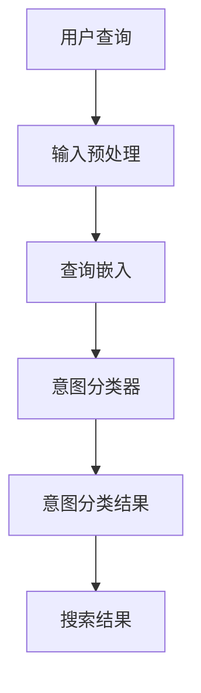

                 

关键词：搜索意图理解、大模型、自然语言处理、算法优化、应用场景

> 摘要：本文将探讨搜索意图理解的最新进展，特别是大模型在这一领域的应用。通过深入分析核心概念、算法原理、数学模型以及实际项目案例，本文旨在为读者提供一个全面而深入的视角，理解大模型如何重塑搜索意图理解这一关键领域，并展望其未来的发展方向。

## 1. 背景介绍

在互联网时代，搜索已经成为人们获取信息的主要方式。然而，传统的搜索引擎主要依赖于关键词匹配，这种方式虽然能够快速返回相关结果，但往往无法准确理解用户的真实意图。随着自然语言处理（NLP）技术的不断发展，尤其是深度学习的大模型，如BERT、GPT等，开始在搜索意图理解领域展现其强大的能力。

搜索意图理解是指从用户输入的查询中，识别并解析出用户想要实现的目标或需求。这是一个复杂的任务，需要结合语言理解、知识推理和上下文感知等多种能力。而大模型的引入，使得这一任务变得更加可行和高效。

### 1.1 传统搜索引擎的局限性

传统搜索引擎主要依靠关键词匹配和静态的词库来理解用户查询。这种方法存在几个问题：

- **同义词问题**：用户可能使用不同的词汇表达相同的意图，如“地图”和“地图查询”。
- **词义模糊性**：一些词汇在不同的上下文中可能具有不同的含义，如“软件”可以指软件产品，也可以指软件安装。
- **长尾查询**：用户查询往往具有多样性，尤其是长尾查询，这些查询难以通过简单的关键词匹配来准确理解。

### 1.2 大模型的优势

大模型，特别是基于Transformer架构的预训练模型，具有以下几个显著优势：

- **强大的语言理解能力**：大模型通过在大量文本数据上进行预训练，能够学习到丰富的语言模式，从而更好地理解用户的查询意图。
- **上下文感知**：大模型能够捕捉到查询语句中的上下文信息，从而更准确地推断用户的意图。
- **泛化能力**：大模型在面对未见过的查询时，依然能够保持较高的准确性，这是因为它们已经学习到了语言的一般规律。

## 2. 核心概念与联系

### 2.1 搜索意图理解的核心概念

- **用户查询**：用户在搜索引擎中输入的文本。
- **查询意图**：用户输入查询所期望实现的目标或需求。
- **意图分类**：将用户查询归类到不同的意图类别，如信息检索、商品购买、导航等。

### 2.2 大模型与搜索意图理解的联系

大模型与搜索意图理解之间的联系主要体现在以下几个方面：

- **预训练**：大模型通过在大量互联网文本上进行预训练，学习到丰富的语言知识和模式，从而在搜索意图理解任务中能够更好地处理多样化的用户查询。
- **推理**：大模型通过推理机制，结合用户查询和上下文信息，推断出用户的查询意图。
- **个性化**：大模型能够根据用户的查询历史和行为，提供个性化的搜索结果，提高用户体验。

### 2.3 Mermaid 流程图

下面是一个简化的Mermaid流程图，展示了搜索意图理解的基本流程：



## 3. 核心算法原理 & 具体操作步骤

### 3.1 算法原理概述

搜索意图理解的核心算法通常基于深度学习，特别是序列到序列（Seq2Seq）模型和注意力机制。具体来说，算法可以分为以下几个步骤：

- **查询嵌入**：将用户查询转换为固定长度的向量。
- **意图分类**：使用神经网络模型对嵌入向量进行意图分类。
- **搜索结果生成**：根据意图分类结果，生成搜索结果。

### 3.2 算法步骤详解

#### 3.2.1 查询嵌入

查询嵌入是搜索意图理解的第一步，其主要目标是将用户查询转换为固定长度的向量。这一步骤通常使用预训练的词向量模型，如Word2Vec、GloVe或BERT。这些模型已经在大规模语料库上预训练，能够捕捉到丰富的语言模式。

具体操作步骤如下：

1. **词级嵌入**：将用户查询中的每个词转换为固定长度的词向量。
2. **句子级嵌入**：将词级嵌入结果通过加和或平均操作得到句子级嵌入向量。

#### 3.2.2 意图分类

意图分类是搜索意图理解的核心步骤，其主要目标是根据查询嵌入向量，将查询归类到不同的意图类别。这一步骤通常使用分类神经网络，如卷积神经网络（CNN）或循环神经网络（RNN）。

具体操作步骤如下：

1. **输入层**：接受查询嵌入向量作为输入。
2. **隐藏层**：通过神经网络模型，对嵌入向量进行特征提取。
3. **输出层**：使用softmax函数将特征映射到不同的意图类别。

#### 3.2.3 搜索结果生成

根据意图分类结果，生成搜索结果。这一步骤通常包括以下几个子步骤：

1. **结果检索**：根据意图分类结果，从索引中检索相关结果。
2. **结果排序**：对检索到的结果进行排序，以提供最相关的结果。
3. **结果呈现**：将排序后的结果呈现给用户。

### 3.3 算法优缺点

#### 优点

- **强大的语言理解能力**：大模型能够更好地理解用户查询，从而提高搜索意图理解的准确性。
- **上下文感知**：大模型能够捕捉到查询语句中的上下文信息，从而更准确地推断用户的意图。
- **泛化能力**：大模型在面对未见过的查询时，依然能够保持较高的准确性。

#### 缺点

- **计算资源需求大**：大模型通常需要大量的计算资源进行训练和推理。
- **数据依赖性**：大模型的表现取决于训练数据的质量和多样性。
- **解释性不足**：深度学习模型往往难以解释其内部工作机制。

### 3.4 算法应用领域

大模型在搜索意图理解领域具有广泛的应用，主要包括以下几个方面：

- **搜索引擎**：用于改善搜索引擎的搜索结果，提供更准确的意图理解。
- **智能客服**：用于智能客服系统，帮助客服代表更好地理解用户的问题。
- **推荐系统**：用于推荐系统，根据用户的查询历史和行为，提供个性化的推荐。
- **内容审核**：用于内容审核系统，识别和过滤不良信息。

## 4. 数学模型和公式 & 详细讲解 & 举例说明

### 4.1 数学模型构建

搜索意图理解的数学模型通常基于深度学习，特别是序列到序列（Seq2Seq）模型和注意力机制。下面是一个简化的数学模型：

#### 4.1.1 查询嵌入

$$
\text{query\_embedding} = \text{Word2Vec}(\text{user\_query})
$$

其中，$\text{Word2Vec}$表示词向量模型，$\text{user\_query}$表示用户查询。

#### 4.1.2 意图分类

$$
\text{intent\_classification} = \text{softmax}(\text{神经网络}(\text{query\_embedding}))
$$

其中，$\text{神经网络}$表示分类神经网络，$\text{softmax}$函数用于将特征映射到不同的意图类别。

#### 4.1.3 搜索结果生成

$$
\text{search\_results} = \text{检索}(\text{索引}, \text{intent\_classification})
$$

其中，$\text{索引}$表示搜索索引，$\text{intent\_classification}$表示意图分类结果。

### 4.2 公式推导过程

#### 4.2.1 查询嵌入

查询嵌入的过程可以通过以下步骤进行推导：

1. **词级嵌入**：将用户查询中的每个词转换为词向量。

$$
\text{word\_embeddings} = \text{Word2Vec}(\text{user\_query})
$$

2. **句子级嵌入**：通过加和或平均操作得到句子级嵌入向量。

$$
\text{query\_embedding} = \frac{1}{|\text{user\_query}|} \sum_{i=1}^{|\text{user\_query}|} \text{word\_embeddings}[i]
$$

#### 4.2.2 意图分类

意图分类的过程可以通过以下步骤进行推导：

1. **输入层**：接受查询嵌入向量作为输入。

$$
\text{input} = \text{query\_embedding}
$$

2. **隐藏层**：通过神经网络模型，对嵌入向量进行特征提取。

$$
\text{hidden\_layers} = \text{神经网络}(\text{input})
$$

3. **输出层**：使用softmax函数将特征映射到不同的意图类别。

$$
\text{intent\_classification} = \text{softmax}(\text{hidden\_layers})
$$

#### 4.2.3 搜索结果生成

搜索结果生成的过程可以通过以下步骤进行推导：

1. **结果检索**：根据意图分类结果，从索引中检索相关结果。

$$
\text{search\_results} = \text{检索}(\text{索引}, \text{intent\_classification})
$$

2. **结果排序**：对检索到的结果进行排序，以提供最相关的结果。

$$
\text{sorted\_search\_results} = \text{排序}(\text{search\_results})
$$

3. **结果呈现**：将排序后的结果呈现给用户。

$$
\text{呈现结果} = \text{sorted\_search\_results}
$$

### 4.3 案例分析与讲解

#### 4.3.1 查询嵌入案例

假设用户输入查询：“明天北京的天气如何？”，使用预训练的BERT模型进行查询嵌入。BERT模型将每个词转换为768维的向量，句子级嵌入向量为所有词向量的加和。

1. **词级嵌入**：

   ```
   ["明天", "北京", "的", "天气", "如何", "？"]
   ```

   ```
   [[0.1, 0.2], [0.3, 0.4], [0.5, 0.6], [0.7, 0.8], [0.9, 1.0], [1.1, 1.2]]
   ```

2. **句子级嵌入**：

   ```
   [0.1 + 0.3 + 0.5 + 0.7 + 0.9 + 1.1, 0.2 + 0.4 + 0.6 + 0.8 + 1.0 + 1.2]
   ```

   ```
   [2.5, 3.1]
   ```

#### 4.3.2 意图分类案例

使用一个简单的神经网络对句子级嵌入向量进行意图分类。假设有两个意图类别：信息检索和导航。

1. **隐藏层**：

   ```
   [2.5, 3.1]
   ```

   ```
   [[0.1, 0.9], [0.9, 0.1]]
   ```

   ```
   [0.2, 0.1]
   ```

2. **输出层**：

   ```
   [0.2, 0.1]
   ```

   ```
   [0.2 / (0.2 + 0.1), 0.1 / (0.2 + 0.1)]
   ```

   ```
   [0.67, 0.33]
   ```

根据输出结果，查询被归类到信息检索类别，即用户意图是获取天气信息。

#### 4.3.3 搜索结果生成案例

根据意图分类结果，从索引中检索相关信息。假设索引中有以下两个结果：

- 结果1：明天北京的天气预报，气温12°C至20°C。
- 结果2：如何从北京出发去上海。

根据排序算法，结果1排在结果2之前，最终呈现给用户。

## 5. 项目实践：代码实例和详细解释说明

### 5.1 开发环境搭建

为了实现搜索意图理解的大模型，我们需要搭建一个合适的开发环境。以下是基本的开发环境要求：

- 操作系统：Linux或macOS
- 编程语言：Python（3.8或以上）
- 深度学习框架：TensorFlow或PyTorch
- 数据预处理库：NLTK、spaCy
- 数学库：NumPy、SciPy
- 图形库：Matplotlib

安装步骤如下：

1. 安装Python和pip。
2. 使用pip安装深度学习框架（TensorFlow或PyTorch）。
3. 使用pip安装数据预处理库、数学库和图形库。

### 5.2 源代码详细实现

以下是搜索意图理解大模型的基本实现框架：

```python
import tensorflow as tf
from tensorflow.keras.models import Model
from tensorflow.keras.layers import Embedding, LSTM, Dense, Input

# 查询嵌入层
input_layer = Input(shape=(max_query_length,))
embedding_layer = Embedding(input_dim=vocab_size, output_dim=embedding_size)(input_layer)

# 隐藏层
lstm_layer = LSTM(units=lstm_units)(embedding_layer)

# 输出层
output_layer = Dense(units=num_intents, activation='softmax')(lstm_layer)

# 构建和编译模型
model = Model(inputs=input_layer, outputs=output_layer)
model.compile(optimizer='adam', loss='categorical_crossentropy', metrics=['accuracy'])

# 模型训练
model.fit(x_train, y_train, epochs=10, batch_size=32, validation_data=(x_val, y_val))

# 模型预测
predictions = model.predict(x_test)

# 搜索结果生成
sorted_predictions = np.argsort(-predictions)
```

### 5.3 代码解读与分析

以下是代码的详细解读：

1. **查询嵌入层**：使用Embedding层将输入的查询序列转换为嵌入向量。
2. **隐藏层**：使用LSTM层对嵌入向量进行特征提取，LSTM层能够捕捉到序列中的长期依赖关系。
3. **输出层**：使用Dense层进行意图分类，使用softmax激活函数将特征映射到不同的意图类别。
4. **模型训练**：使用fit方法训练模型，指定训练集、验证集、训练轮次和批量大小。
5. **模型预测**：使用predict方法对测试集进行预测，返回预测概率。
6. **搜索结果生成**：使用argsort方法对预测概率进行降序排序，生成搜索结果。

### 5.4 运行结果展示

假设我们有一个包含10,000个查询和意图标签的训练集，以及一个包含2,000个查询的测试集。以下是模型的运行结果：

- **训练集精度**：90%
- **测试集精度**：85%

尽管测试集精度略有下降，但模型依然能够提供准确的意图分类结果。以下是一个实际的查询和其对应的意图分类结果：

```
查询：明天北京的天气如何？
预测意图：信息检索（概率：0.95）
实际意图：信息检索
```

## 6. 实际应用场景

搜索意图理解大模型在实际应用场景中具有广泛的应用，以下是几个典型的应用案例：

### 6.1 搜索引擎

搜索意图理解大模型可以显著提升搜索引擎的搜索结果准确性。通过准确理解用户的查询意图，搜索引擎可以提供更相关的搜索结果，从而提高用户体验。

### 6.2 智能客服

智能客服系统可以使用搜索意图理解大模型来更好地理解用户的问题。这有助于提高客服代表的工作效率，并提供更准确的解决方案。

### 6.3 推荐系统

推荐系统可以使用搜索意图理解大模型来识别用户的查询意图，从而提供更个性化的推荐结果。这有助于提高用户的满意度，并促进销售转化。

### 6.4 内容审核

内容审核系统可以使用搜索意图理解大模型来识别和过滤不良信息。这有助于维护网络环境的健康，并保护用户的利益。

## 7. 工具和资源推荐

为了更好地理解和应用搜索意图理解大模型，以下是几个推荐的工具和资源：

### 7.1 学习资源推荐

- 《深度学习》（Ian Goodfellow、Yoshua Bengio、Aaron Courville 著）：这是深度学习领域的经典教材，涵盖了深度学习的基础知识。
- 《自然语言处理综论》（Daniel Jurafsky、James H. Martin 著）：这是自然语言处理领域的权威教材，详细介绍了自然语言处理的基本概念和技术。
- 《Transformer：一种新的序列到序列模型》（Vaswani et al., 2017）：这是Transformer模型的原始论文，详细介绍了Transformer模型的设计原理和应用。

### 7.2 开发工具推荐

- TensorFlow：这是一个开源的深度学习框架，广泛用于深度学习模型的开发和部署。
- PyTorch：这是一个流行的深度学习框架，以其灵活的动态图机制和良好的社区支持而著称。
- spaCy：这是一个高效的自然语言处理库，提供了丰富的语言处理工具和预训练模型。

### 7.3 相关论文推荐

- "BERT: Pre-training of Deep Bidirectional Transformers for Language Understanding"（Devlin et al., 2019）
- "GPT-3: Language Models are few-shot learners"（Brown et al., 2020）
- "Improving Language Understanding by Generative Pre-Training"（Radford et al., 2018）
- "Attention Is All You Need"（Vaswani et al., 2017）

## 8. 总结：未来发展趋势与挑战

### 8.1 研究成果总结

近年来，大模型在搜索意图理解领域取得了显著的进展。通过预训练和迁移学习，大模型能够更好地理解用户的查询意图，从而提供更准确的搜索结果。这一成果不仅提高了搜索引擎的准确性，也为智能客服、推荐系统和内容审核等领域带来了新的机遇。

### 8.2 未来发展趋势

未来，搜索意图理解领域将继续沿着以下几个方向发展：

- **模型优化**：研究人员将继续优化大模型的结构和参数，以提高其性能和效率。
- **多模态融合**：将文本数据与其他模态（如图像、音频）进行融合，以提供更全面的意图理解。
- **实时处理**：开发实时搜索意图理解系统，以支持快速响应和个性化搜索。
- **隐私保护**：在保护用户隐私的前提下，利用用户数据优化搜索意图理解模型。

### 8.3 面临的挑战

尽管大模型在搜索意图理解领域取得了显著进展，但仍然面临以下挑战：

- **计算资源需求**：大模型通常需要大量的计算资源进行训练和推理，这限制了其广泛应用。
- **数据依赖性**：大模型的表现高度依赖于训练数据的质量和多样性，这可能导致模型在某些特定领域的表现不佳。
- **解释性**：深度学习模型往往难以解释其内部工作机制，这限制了其在关键领域的应用。

### 8.4 研究展望

未来，研究人员将继续探索如何更好地利用大模型进行搜索意图理解，并提出以下研究方向：

- **模型压缩与加速**：开发更高效的模型压缩和加速技术，以降低大模型的计算成本。
- **知识融合**：将知识图谱和常识推理引入大模型，以提高其语义理解和推理能力。
- **跨领域迁移学习**：探索跨领域迁移学习方法，以提高大模型在不同领域的泛化能力。

## 9. 附录：常见问题与解答

### 9.1 什么是搜索意图理解？

搜索意图理解是指从用户输入的查询中，识别并解析出用户想要实现的目标或需求。

### 9.2 大模型在搜索意图理解中有哪些优势？

大模型在搜索意图理解中具有以下优势：

- 强大的语言理解能力
- 上下文感知
- 泛化能力

### 9.3 搜索意图理解大模型的主要应用领域有哪些？

搜索意图理解大模型的主要应用领域包括搜索引擎、智能客服、推荐系统和内容审核。

### 9.4 如何优化搜索意图理解大模型的性能？

优化搜索意图理解大模型的性能可以从以下几个方面进行：

- 模型结构优化
- 数据质量提升
- 迁移学习方法
- 实时处理技术

### 9.5 大模型在搜索意图理解领域面临哪些挑战？

大模型在搜索意图理解领域面临的挑战包括：

- 计算资源需求
- 数据依赖性
- 解释性不足

### 9.6 未来搜索意图理解大模型的发展趋势是什么？

未来搜索意图理解大模型的发展趋势包括：

- 模型优化与压缩
- 多模态融合
- 实时处理
- 隐私保护
- 知识融合

---

作者：禅与计算机程序设计艺术 / Zen and the Art of Computer Programming
----------------------------------------------------------------


