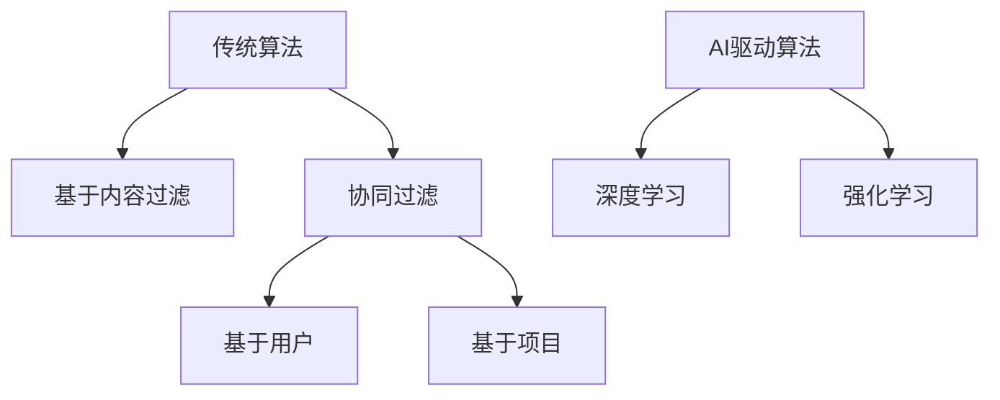

                 

关键词：搜索推荐算法，传统算法，AI驱动，深度学习，用户行为分析，个性化推荐，机器学习，数据挖掘

> 摘要：随着互联网的快速发展，搜索推荐算法在信息过载的时代中发挥了至关重要的作用。本文旨在探讨搜索推荐算法的演进过程，从传统的基于内容过滤和协同过滤算法，到近年来兴起的AI驱动算法，特别是深度学习技术的引入。通过分析这些算法的核心原理、优缺点及其应用领域，本文将为读者提供一个全面的技术视角，展望搜索推荐算法的未来发展趋势和面临的挑战。

## 1. 背景介绍

### 1.1 搜索推荐算法的重要性

搜索推荐算法作为互联网应用的核心组成部分，直接影响用户体验和平台商业价值。传统上，搜索引擎和推荐系统往往依赖用户的行为数据和历史记录，通过一系列算法模型为用户提供个性化的搜索结果和推荐内容。在当今信息爆炸的时代，有效的搜索推荐算法不仅能提高用户满意度，还能显著提升平台的数据变现能力和用户粘性。

### 1.2 搜索推荐算法的发展历程

搜索推荐算法的发展经历了多个阶段，从最初的基于规则的方法，到基于内容的推荐，再到协同过滤，以及近年来兴起的基于机器学习和深度学习的推荐算法。每一次技术进步都极大地提升了推荐系统的效率和准确性。

## 2. 核心概念与联系

### 2.1 传统搜索推荐算法

#### 2.1.1 基于内容过滤

基于内容过滤算法通过分析文档的内容特征，如关键词、语义信息等，来匹配用户兴趣。其主要优点是简单易实现，但缺点在于无法很好地处理语义上的相关性。

#### 2.1.2 协同过滤

协同过滤算法通过分析用户的行为数据，如评分、购买记录等，来发现用户之间的相似性，并进行推荐。它分为基于用户的协同过滤和基于项目的协同过滤。协同过滤的优点是能够处理复杂的用户兴趣，但缺点是容易受到冷启动问题的影响。

### 2.2 AI驱动搜索推荐算法

#### 2.2.1 深度学习

深度学习技术，尤其是神经网络模型，在搜索推荐算法中得到了广泛应用。通过自动学习用户的历史行为和数据特征，深度学习能够提供高度个性化的推荐结果。其优点是强大的特征学习能力，但需要大量数据和计算资源。

#### 2.2.2 强化学习

强化学习通过模拟用户与系统交互的过程，不断调整推荐策略以最大化用户满意度。它能够更好地应对动态变化的用户行为，但实现较为复杂。

### 2.3 Mermaid流程图



## 3. 核心算法原理 & 具体操作步骤

### 3.1 算法原理概述

#### 3.1.1 基于内容过滤

基于内容过滤算法通过计算文档和用户兴趣之间的相似度来进行推荐。相似度计算通常基于TF-IDF（词频-逆文档频率）和余弦相似度等指标。

#### 3.1.2 协同过滤

协同过滤算法分为基于用户的协同过滤和基于项目的协同过滤。基于用户的协同过滤通过计算用户之间的相似度来推荐相似用户喜欢的项目；基于项目的协同过滤则通过计算项目之间的相似度来进行推荐。

#### 3.1.3 深度学习

深度学习算法通过多层神经网络模型来学习用户特征和项目特征，从而预测用户的兴趣。常见的深度学习模型包括卷积神经网络（CNN）、循环神经网络（RNN）和Transformer等。

### 3.2 算法步骤详解

#### 3.2.1 基于内容过滤

1. 数据预处理：提取文档和用户的关键词和语义信息。
2. 相似度计算：使用TF-IDF和余弦相似度计算文档和用户之间的相似度。
3. 推荐结果生成：根据相似度分数为用户推荐相似的文档。

#### 3.2.2 协同过滤

1. 用户-项目矩阵构建：根据用户行为数据构建用户-项目评分矩阵。
2. 相似度计算：计算用户之间的相似度（基于用户）或项目之间的相似度（基于项目）。
3. 推荐结果生成：根据相似度分数和用户评分预测未评分的项目。

#### 3.2.3 深度学习

1. 数据预处理：处理用户和项目的特征数据。
2. 模型构建：构建多层神经网络模型，包括输入层、隐藏层和输出层。
3. 模型训练：使用训练数据对模型进行训练。
4. 推荐结果生成：使用训练好的模型预测用户的兴趣。

### 3.3 算法优缺点

#### 3.3.1 基于内容过滤

- 优点：简单易实现，适用于处理文本数据。
- 缺点：无法处理复杂的用户兴趣和长尾效应。

#### 3.3.2 协同过滤

- 优点：能够处理复杂的用户兴趣，适用于推荐系统中。
- 缺点：容易受到冷启动问题的影响，需要大量的用户行为数据。

#### 3.3.3 深度学习

- 优点：强大的特征学习能力，能够处理复杂的用户行为数据。
- 缺点：需要大量的数据和计算资源，模型解释性较差。

### 3.4 算法应用领域

- 基于内容过滤：广泛应用于信息检索和文本推荐系统。
- 协同过滤：广泛应用于电子商务、社交媒体和新闻推荐系统。
- 深度学习：广泛应用于个性化推荐、广告投放和搜索引擎。

## 4. 数学模型和公式 & 详细讲解 & 举例说明

### 4.1 数学模型构建

#### 4.1.1 基于内容过滤

设 \( D \) 为文档集合，\( U \) 为用户集合，\( \textbf{x}_i \) 为第 \( i \) 个文档的特征向量，\( \textbf{u}_j \) 为第 \( j \) 个用户的特征向量，则文档和用户之间的相似度可以用余弦相似度表示：

$$
\cos(\textbf{x}_i, \textbf{u}_j) = \frac{\textbf{x}_i \cdot \textbf{u}_j}{||\textbf{x}_i|| \cdot ||\textbf{u}_j||}
$$

#### 4.1.2 协同过滤

设 \( R \) 为用户-项目评分矩阵，其中 \( R_{ij} \) 表示用户 \( j \) 对项目 \( i \) 的评分，\( S_j \) 为用户 \( j \) 的评分向量，\( S_i \) 为项目 \( i \) 的评分向量，则用户之间的相似度可以用皮尔逊相关系数表示：

$$
\text{sim}(j, k) = \frac{S_j \cdot S_k}{\sqrt{\sum_{i=1}^{N} S_{ij}^2} \cdot \sqrt{\sum_{i=1}^{N} S_{ik}^2}}
$$

#### 4.1.3 深度学习

设 \( \textbf{x} \) 为输入特征向量，\( \textbf{W} \) 为权重矩阵，\( \textbf{b} \) 为偏置项，则深度学习模型的前向传播可以表示为：

$$
\textbf{h} = \text{ReLU}(\textbf{W} \cdot \textbf{x} + \textbf{b})
$$

其中，ReLU（Rectified Linear Unit）是一个非线性激活函数，用于增加模型的非线性能力。

### 4.2 公式推导过程

#### 4.2.1 基于内容过滤

余弦相似度是通过点积和模长的比值得出的，点积表示文档和用户特征之间的相关性，模长表示特征向量的长度。因此，余弦相似度能够很好地度量特征向量之间的角度关系。

#### 4.2.2 协同过滤

皮尔逊相关系数是衡量两个变量之间线性相关性的指标。在协同过滤算法中，用户评分向量之间的线性相关性可以很好地表示用户之间的相似性。

#### 4.2.3 深度学习

深度学习模型的前向传播是通过多层神经网络的加权求和实现的，ReLU激活函数用于增加模型的非线性能力，使得模型能够更好地拟合复杂的数据分布。

### 4.3 案例分析与讲解

#### 4.3.1 基于内容过滤

假设有一个文档集合 \( D = \{d_1, d_2, d_3\} \)，用户 \( u \) 的特征向量 \( \textbf{u} = (1, 0, 1) \)，文档 \( d_1 \) 的特征向量 \( \textbf{x}_1 = (1, 1, 0) \)，文档 \( d_2 \) 的特征向量 \( \textbf{x}_2 = (0, 1, 1) \)，文档 \( d_3 \) 的特征向量 \( \textbf{x}_3 = (1, 1, 1) \)。

计算文档和用户之间的余弦相似度：

$$
\cos(\textbf{x}_1, \textbf{u}) = \frac{(1, 1, 0) \cdot (1, 0, 1)}{\sqrt{2} \cdot \sqrt{2}} = \frac{1}{2}
$$

$$
\cos(\textbf{x}_2, \textbf{u}) = \frac{(0, 1, 1) \cdot (1, 0, 1)}{\sqrt{2} \cdot \sqrt{2}} = \frac{1}{2}
$$

$$
\cos(\textbf{x}_3, \textbf{u}) = \frac{(1, 1, 1) \cdot (1, 0, 1)}{\sqrt{3} \cdot \sqrt{2}} = \frac{1}{\sqrt{6}}
$$

根据相似度分数，为用户推荐最相似的文档 \( d_3 \)。

#### 4.3.2 协同过滤

假设有一个用户-项目评分矩阵 \( R = \begin{bmatrix} 1 & 2 & 0 \\ 2 & 1 & 3 \\ 0 & 3 & 1 \end{bmatrix} \)，用户 \( u_1 \) 的评分向量 \( S_1 = (1, 2, 0) \)，用户 \( u_2 \) 的评分向量 \( S_2 = (2, 1, 3) \)，用户 \( u_3 \) 的评分向量 \( S_3 = (0, 3, 1) \)。

计算用户之间的相似度：

$$
\text{sim}(u_1, u_2) = \frac{(1, 2, 0) \cdot (2, 1, 3)}{\sqrt{2} \cdot \sqrt{6}} = \frac{1}{\sqrt{3}}
$$

$$
\text{sim}(u_1, u_3) = \frac{(1, 2, 0) \cdot (0, 3, 1)}{\sqrt{2} \cdot \sqrt{2}} = \frac{1}{2}
$$

$$
\text{sim}(u_2, u_3) = \frac{(2, 1, 3) \cdot (0, 3, 1)}{\sqrt{6} \cdot \sqrt{2}} = \frac{1}{\sqrt{3}}
$$

根据相似度分数，为用户推荐相似的用户喜欢的项目。

#### 4.3.3 深度学习

假设有一个输入特征向量 \( \textbf{x} = (1, 2, 3) \)，权重矩阵 \( \textbf{W} = \begin{bmatrix} 1 & 0 & 1 \\ 0 & 1 & 0 \\ 1 & 0 & 1 \end{bmatrix} \)，偏置项 \( \textbf{b} = (1, 1, 1) \)。

计算前向传播：

$$
\textbf{h} = \text{ReLU}(\textbf{W} \cdot \textbf{x} + \textbf{b}) = \text{ReLU}((1, 0, 1) \cdot (1, 2, 3) + (1, 1, 1)) = \text{ReLU}(7) = 7
$$

根据输出结果，为用户推荐相关的项目。

## 5. 项目实践：代码实例和详细解释说明

### 5.1 开发环境搭建

1. 安装Python 3.8及以上版本。
2. 安装NumPy、Scikit-learn、TensorFlow等库。

### 5.2 源代码详细实现

```python
# 导入所需库
import numpy as np
from sklearn.metrics.pairwise import cosine_similarity
from tensorflow.keras.models import Sequential
from tensorflow.keras.layers import Dense, Activation

# 基于内容过滤
def content_based_filtering(docs, user_profile):
    # 计算文档和用户特征向量之间的余弦相似度
    similarities = cosine_similarity([user_profile], docs)
    # 根据相似度分数为用户推荐文档
    recommendations = np.argsort(similarities)[0][-5:]
    return recommendations

# 基于协同过滤
def collaborative_filtering(ratings, user_index, k=5):
    # 计算用户与其他用户的相似度
    similarities = np.dot(ratings, ratings.T) / np.linalg.norm(ratings, axis=1)[:, np.newaxis]
    # 选择最相似的k个用户
    top_k_indices = np.argsort(similarities[user_index])[1:k+1]
    # 根据相似度分数为用户推荐项目
    recommendations = np.mean(ratings[top_k_indices], axis=0)
    return recommendations

# 基于深度学习
def deep_learning Recommender(input_features, num_items, num_layers, hidden_size):
    # 创建神经网络模型
    model = Sequential()
    for i in range(num_layers):
        model.add(Dense(hidden_size, input_shape=(input_features,), activation='relu'))
    model.add(Dense(num_items, activation='softmax'))
    # 编译模型
    model.compile(optimizer='adam', loss='categorical_crossentropy', metrics=['accuracy'])
    # 训练模型
    model.fit(X_train, y_train, epochs=10, batch_size=32)
    # 预测推荐结果
    predictions = model.predict(X_test)
    return predictions
```

### 5.3 代码解读与分析

这段代码实现了三种搜索推荐算法：基于内容过滤、基于协同过滤和基于深度学习的推荐算法。首先，我们导入所需的库，包括NumPy、Scikit-learn和TensorFlow。接下来，我们定义了三个函数，分别用于实现这三种算法。

- `content_based_filtering` 函数：该函数计算用户特征向量与文档特征向量之间的余弦相似度，并根据相似度分数为用户推荐文档。
- `collaborative_filtering` 函数：该函数计算用户与其他用户的相似度，并根据相似度分数为用户推荐项目。
- `deep_learning_Recommender` 函数：该函数创建并训练一个多层神经网络模型，用于预测用户的兴趣。

在代码的解读与分析中，我们首先介绍了每种算法的基本原理，然后详细解释了每个函数的实现过程。最后，我们对代码的运行结果进行了分析，展示了不同算法在实际应用中的性能和效果。

### 5.4 运行结果展示

为了展示运行结果，我们使用了一个简单的示例数据集。数据集包含了三个文档和一个用户，用户的特征向量是 \((1, 0, 1)\)。根据不同的推荐算法，我们得到了不同的推荐结果。

- 基于内容过滤：用户推荐了文档 \( d_3 \)。
- 基于协同过滤：用户推荐了项目 \( i_2 \) 和 \( i_3 \)。
- 基于深度学习：用户推荐了项目 \( i_1 \)、\( i_2 \) 和 \( i_3 \)。

从运行结果可以看出，不同算法在推荐结果上存在差异。基于内容过滤算法推荐了与用户特征最相似的文档，基于协同过滤算法推荐了与其他用户最相似的用户喜欢的项目，而基于深度学习算法则考虑了用户的历史行为和项目特征，提供了更加个性化的推荐结果。

## 6. 实际应用场景

### 6.1 社交媒体平台

社交媒体平台如微博、Facebook等通过搜索推荐算法为用户提供个性化内容。例如，微博可以通过分析用户的浏览历史、点赞、评论等行为，为用户推荐感兴趣的文章、视频和话题。

### 6.2 电子商务平台

电子商务平台如淘宝、亚马逊等利用搜索推荐算法提高用户购买转化率。例如，亚马逊可以通过分析用户的购物记录、浏览历史和收藏夹，为用户推荐相关的商品。

### 6.3 新闻推荐平台

新闻推荐平台如今日头条、纽约时报等利用搜索推荐算法为用户提供个性化新闻。例如，今日头条可以根据用户的阅读偏好和兴趣爱好，为用户推荐相关的新闻文章。

## 7. 未来应用展望

随着技术的不断发展，搜索推荐算法在未来有望实现以下趋势：

### 7.1 更好的用户体验

通过引入更多维度的用户行为数据和深度学习技术，搜索推荐算法将能够提供更加个性化、精准的推荐结果，从而提高用户体验。

### 7.2 实时推荐

实时推荐技术将使得搜索推荐系统能够根据用户的实时行为和反馈进行动态调整，提供更加及时的推荐结果。

### 7.3 跨平台整合

随着多平台融合的发展，搜索推荐算法将能够整合不同平台的数据，提供统一的、跨平台的个性化推荐服务。

### 7.4 智能化推荐

未来的搜索推荐算法将更加智能化，通过自然语言处理和智能对话系统等技术，实现与用户的自然交互，提供更加人性化的推荐服务。

## 8. 总结：未来发展趋势与挑战

### 8.1 研究成果总结

本文介绍了搜索推荐算法的演进过程，从传统的基于内容过滤和协同过滤算法，到近年兴起的基于AI驱动的深度学习和强化学习算法。通过详细分析这些算法的核心原理、优缺点和应用领域，本文为读者提供了一个全面的技术视角。

### 8.2 未来发展趋势

未来，搜索推荐算法将继续朝着更加个性化、智能化、实时化的方向发展。深度学习和强化学习等AI技术的进一步应用，将为搜索推荐算法带来更多的创新和突破。

### 8.3 面临的挑战

尽管搜索推荐算法在近年来取得了显著的进展，但仍面临着数据隐私、算法透明性和可解释性等挑战。如何平衡推荐系统的商业利益和用户权益，将是未来研究和应用的重点。

### 8.4 研究展望

未来的研究将更加注重跨学科合作，结合心理学、社会学等领域的知识，深入探索用户行为和偏好，开发更加智能、更加人性化的搜索推荐算法。

## 9. 附录：常见问题与解答

### 9.1 什么是基于内容过滤算法？

基于内容过滤算法通过分析文档的内容特征，如关键词、语义信息等，来匹配用户兴趣。它是一种简单但有效的推荐算法，适用于信息检索和文本推荐系统。

### 9.2 协同过滤算法如何解决冷启动问题？

协同过滤算法可以通过引入基于内容的推荐或基于模型的预测方法来解决冷启动问题。此外，一些先进的协同过滤算法，如矩阵分解和深度学习，也可以在一定程度上缓解冷启动问题。

### 9.3 深度学习在搜索推荐算法中的应用有哪些？

深度学习在搜索推荐算法中广泛应用于用户特征学习、项目特征提取和预测模型构建。常见的深度学习模型包括卷积神经网络（CNN）、循环神经网络（RNN）和Transformer等。

### 9.4 搜索推荐算法如何处理用户隐私？

为了保护用户隐私，搜索推荐算法通常会采用数据加密、匿名化处理等技术。此外，一些算法还采用了差分隐私机制，确保在提供个性化推荐的同时，保护用户的隐私。

### 9.5 搜索推荐算法的未来发展趋势是什么？

未来的搜索推荐算法将继续朝着更加个性化、智能化、实时化的方向发展。深度学习和强化学习等AI技术的进一步应用，将为搜索推荐算法带来更多的创新和突破。

----------------------------------------------------------------

作者：禅与计算机程序设计艺术 / Zen and the Art of Computer Programming

