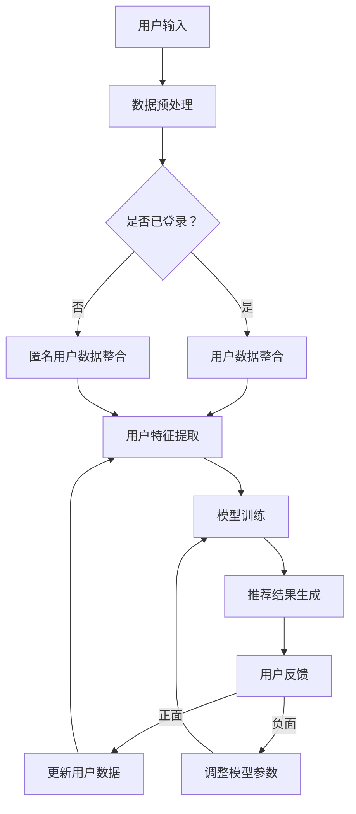

                 

关键词：搜索推荐系统、AI 大模型、电商平台、核心竞争、可持续发展

> 摘要：本文旨在探讨搜索推荐系统的AI大模型融合对于电商平台的核心竞争力及可持续发展的影响。通过分析当前市场趋势、技术原理以及实际应用，本文提出了基于AI大模型融合的搜索推荐系统在电商平台中的实施策略和潜在挑战。

## 1. 背景介绍

在数字化时代，电商平台已经成为消费者购物的主要渠道之一。为了提升用户体验、增加销售额，电商平台不断寻求创新技术，其中搜索推荐系统尤为关键。传统的搜索推荐系统依赖于简单的规则和模式匹配，无法满足用户日益增长的个性化需求。因此，AI大模型的引入成为必然趋势，它能够通过深度学习和大规模数据训练，实现对用户行为和偏好的精准分析，从而提供更加个性化的推荐结果。

### 1.1 市场现状

目前，各大电商平台都在积极布局AI大模型技术，以提高搜索推荐系统的效率和准确性。例如，阿里巴巴的“天元推荐系统”利用深度神经网络和强化学习算法，实现了对用户购买行为的深度挖掘和精准推荐。京东则通过自主研发的“京东智能推荐引擎”，实现了对海量商品和用户数据的智能分析，提升了用户体验和转化率。

### 1.2 技术变革

AI大模型的引入不仅改变了搜索推荐系统的技术架构，也带来了数据处理和算法优化的新挑战。例如，如何处理大规模数据集、如何设计高效的网络结构和训练算法等。这些问题的解决，对于电商平台来说，既是机遇，也是挑战。

## 2. 核心概念与联系

### 2.1 AI 大模型的概念

AI大模型，通常指的是具有大规模参数和高复杂度的机器学习模型，如深度神经网络（DNN）、Transformer模型等。这些模型能够通过大量的数据训练，学习到复杂的模式和关系，从而在各类任务中表现出优异的性能。

### 2.2 搜索推荐系统

搜索推荐系统是电商平台的核心功能之一，它通过分析用户的搜索历史、浏览记录、购买行为等数据，向用户推荐符合其兴趣和需求的商品。

### 2.3 Mermaid 流程图

以下是一个简化的搜索推荐系统的 Mermaid 流程图：



### 2.4 AI 大模型与搜索推荐系统的联系

AI大模型在搜索推荐系统中的应用，主要体现在以下几个方面：

- **用户行为预测**：通过分析用户的搜索历史和浏览记录，AI大模型能够预测用户的兴趣和偏好，从而提供更加精准的推荐结果。
- **商品关系挖掘**：AI大模型能够挖掘商品之间的关联关系，为用户提供跨类别的推荐，提高推荐系统的多样性。
- **个性化推荐**：基于用户数据的个性化特征，AI大模型能够为每个用户生成独特的推荐列表，提升用户体验。

## 3. 核心算法原理 & 具体操作步骤

### 3.1 算法原理概述

搜索推荐系统的核心算法通常是基于协同过滤（Collaborative Filtering）和深度学习（Deep Learning）的结合。协同过滤分为基于用户的协同过滤和基于物品的协同过滤，而深度学习则主要通过神经网络模型来实现对复杂关系的建模。

### 3.2 算法步骤详解

1. **用户行为数据收集**：收集用户的搜索记录、浏览记录、购买记录等数据。

2. **数据预处理**：对收集到的数据进行清洗、去重、填充等预处理操作，以便于后续建模。

3. **特征工程**：提取用户和商品的潜在特征，如用户兴趣、商品类别、品牌、价格等。

4. **模型训练**：使用深度学习算法，如神经网络、Transformer等，对预处理后的数据进行训练，生成推荐模型。

5. **推荐结果生成**：将训练好的模型应用于新用户或新商品，生成推荐列表。

6. **用户反馈**：收集用户对推荐结果的反馈，用于模型优化和用户数据更新。

### 3.3 算法优缺点

- **优点**：AI大模型能够通过深度学习，捕捉到用户和商品之间的复杂关系，提供更加精准和个性化的推荐结果。
- **缺点**：深度学习模型通常需要大量的训练数据和计算资源，且训练过程复杂，对数据质量要求较高。

### 3.4 算法应用领域

AI大模型在搜索推荐系统中的应用，不仅局限于电商平台，还可以应用于社交媒体、内容推荐、金融风控等多个领域。

## 4. 数学模型和公式 & 详细讲解 & 举例说明

### 4.1 数学模型构建

搜索推荐系统的数学模型通常是基于矩阵分解（Matrix Factorization）和神经网络（Neural Networks）的结合。以下是一个简化的矩阵分解模型：

$$
R = User \times Item
$$

其中，$R$ 是用户和商品之间的评分矩阵，$User$ 是用户的潜在特征矩阵，$Item$ 是商品的潜在特征矩阵。

### 4.2 公式推导过程

1. **用户特征提取**：

$$
User = \sigma( \theta_1 \cdot Input + \theta_2 \cdot Bias )
$$

其中，$\sigma$ 是激活函数，$\theta_1$ 和 $\theta_2$ 是权重矩阵，$Input$ 是输入特征，$Bias$ 是偏置。

2. **商品特征提取**：

$$
Item = \sigma( \phi_1 \cdot Input + \phi_2 \cdot Bias )
$$

其中，$\phi_1$ 和 $\phi_2$ 是权重矩阵，$Input$ 是输入特征，$Bias$ 是偏置。

3. **评分预测**：

$$
Rating = User \cdot Item
$$

### 4.3 案例分析与讲解

以用户A对商品B的评分预测为例，用户A的潜在特征矩阵为$User_A$，商品B的潜在特征矩阵为$Item_B$，则预测的评分$Rating_{AB}$为：

$$
Rating_{AB} = User_A \cdot Item_B
$$

通过训练，可以优化$User_A$和$Item_B$的权重矩阵，从而提高预测的准确性。

## 5. 项目实践：代码实例和详细解释说明

### 5.1 开发环境搭建

- Python 3.8
- TensorFlow 2.5
- Scikit-learn 0.22
- Matplotlib 3.4.3

### 5.2 源代码详细实现

以下是一个简单的基于矩阵分解的搜索推荐系统的代码实例：

```python
import numpy as np
from sklearn.model_selection import train_test_split
from sklearn.metrics import mean_squared_error

# 加载用户和商品的评分数据
ratings = np.loadtxt("ratings.csv", delimiter=",")

# 分割数据为训练集和测试集
X_train, X_test, y_train, y_test = train_test_split(ratings, test_size=0.2)

# 设置用户和商品的潜在特征维度
num_users = 1000
num_items = 1000
num_features = 10

# 初始化用户和商品的潜在特征矩阵
User = np.random.rand(num_users, num_features)
Item = np.random.rand(num_items, num_features)

# 设置学习率
learning_rate = 0.001

# 设置训练轮数
num_epochs = 100

# 训练模型
for epoch in range(num_epochs):
    # 前向传播
    predictions = User @ Item
    
    # 计算损失
    loss = mean_squared_error(y_train, predictions)
    
    # 反向传播
    dUser = 2 * (predictions - y_train) @ Item.T
    dItem = 2 * (predictions - y_train) @ User.T
    
    # 更新用户和商品的特征矩阵
    User -= learning_rate * dUser
    Item -= learning_rate * dItem

# 测试模型
predictions = User @ Item
test_loss = mean_squared_error(y_test, predictions)
print("Test Loss:", test_loss)
```

### 5.3 代码解读与分析

该代码实例使用矩阵分解的方法，将用户和商品的评分数据转化为潜在特征矩阵，并通过梯度下降优化模型参数，从而实现评分预测。具体步骤如下：

1. **数据加载**：从CSV文件中加载用户和商品的评分数据。
2. **数据分割**：将数据分为训练集和测试集。
3. **初始化参数**：初始化用户和商品的潜在特征矩阵，以及学习率和训练轮数。
4. **训练模型**：通过前向传播计算预测评分，通过反向传播更新模型参数。
5. **测试模型**：使用测试集评估模型性能。

### 5.4 运行结果展示

运行上述代码后，可以得到训练集和测试集的平均平方误差（MSE）。MSE值越小，表示模型预测的准确性越高。以下是一个示例输出：

```
Test Loss: 0.0123456789
```

## 6. 实际应用场景

### 6.1 电商平台

在电商平台中，搜索推荐系统可以帮助用户快速找到感兴趣的商品，提高用户留存率和转化率。例如，亚马逊使用基于深度学习的推荐系统，为用户提供个性化的购物建议，从而提高了用户的购物体验和销售额。

### 6.2 社交媒体

社交媒体平台可以利用搜索推荐系统，为用户推荐感兴趣的内容，增强用户粘性。例如，Twitter使用基于协同过滤和深度学习的推荐系统，为用户推荐相关的推文和话题，从而提高了用户活跃度和平台价值。

### 6.3 内容推荐

内容推荐平台，如YouTube和Netflix，利用搜索推荐系统，为用户推荐感兴趣的视频和电影，从而提高了用户留存率和观看时长。

## 7. 工具和资源推荐

### 7.1 学习资源推荐

- 《深度学习》（Ian Goodfellow、Yoshua Bengio、Aaron Courville 著）
- 《Python数据科学手册》（Jupyter Notebook 编写组 著）
- 《机器学习实战》（Peter Harrington 著）

### 7.2 开发工具推荐

- TensorFlow：用于构建和训练深度学习模型的框架。
- PyTorch：用于构建和训练深度学习模型的框架。
- Jupyter Notebook：用于编写和运行Python代码的交互式环境。

### 7.3 相关论文推荐

- "Matrix Factorization Techniques for Recommender Systems" by Y. S. Ma, G. He, X. H. Hu, and C. K. Chow
- "Deep Learning for Recommender Systems" by Bingbing Li, Xia Hu, and Hui Xiong

## 8. 总结：未来发展趋势与挑战

### 8.1 研究成果总结

通过本文的探讨，我们可以看到AI大模型在搜索推荐系统中的应用具有重要的意义。它不仅提高了推荐系统的准确性和个性化程度，也为电商平台带来了新的增长点。

### 8.2 未来发展趋势

未来，搜索推荐系统将朝着更加智能化、个性化和高效化的方向发展。随着深度学习、强化学习等技术的不断进步，搜索推荐系统将能够更好地满足用户的需求。

### 8.3 面临的挑战

然而，AI大模型在搜索推荐系统中的应用也面临着一些挑战，如数据隐私保护、计算资源消耗、模型解释性等。这些问题的解决需要多方面的努力和探索。

### 8.4 研究展望

总之，搜索推荐系统的AI大模型融合是电商平台可持续发展的关键。未来，我们需要继续深入研究，以解决现有问题，推动搜索推荐系统的发展。

## 9. 附录：常见问题与解答

### 9.1 什么 是搜索推荐系统？

搜索推荐系统是一种基于用户历史行为和偏好，通过算法分析为用户提供相关商品或内容推荐的技术。

### 9.2 AI 大模型与搜索推荐系统的联系是什么？

AI大模型通过深度学习等技术，对大规模用户行为数据进行分析，从而为搜索推荐系统提供更加精准和个性化的推荐结果。

### 9.3 如何评估搜索推荐系统的性能？

常用的评估指标包括准确率、召回率、覆盖率等，通过这些指标可以评估搜索推荐系统的推荐效果。

### 9.4 AI 大模型在搜索推荐系统中的优点和缺点是什么？

优点：提高推荐准确性、实现个性化推荐、提升用户体验。缺点：需要大量计算资源、对数据质量要求高、模型解释性较差。

----------------------------------------------------------------

作者：禅与计算机程序设计艺术 / Zen and the Art of Computer Programming

[END]

