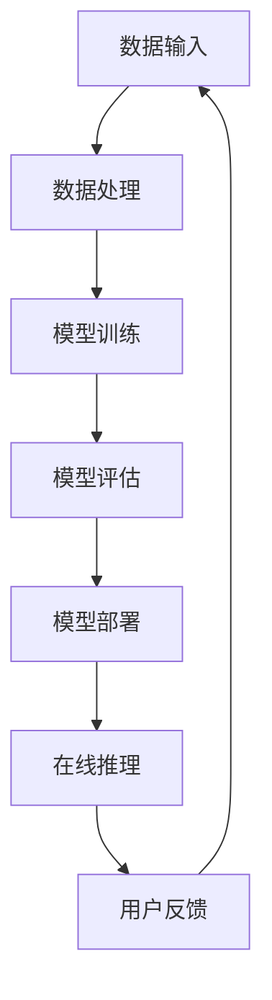
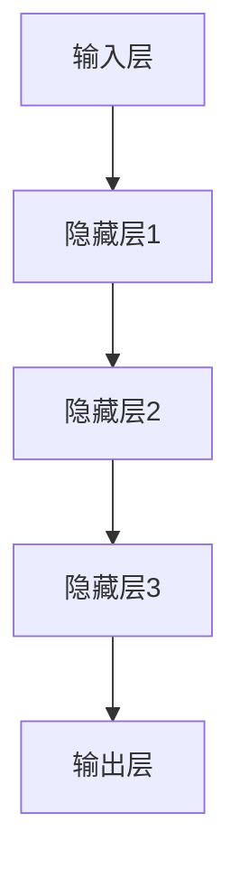

                 

关键词：搜索推荐系统、AI大模型、电商平台、核心竞争力、可持续增长战略

摘要：本文深入探讨了搜索推荐系统与AI大模型的深度融合在电商平台中的关键作用。通过详细分析其技术原理、应用实例及未来发展，揭示了AI大模型如何成为电商平台的核心竞争力，推动其实现可持续增长的战略。

## 1. 背景介绍

在互联网时代，电商平台已经成为消费者购物的主要渠道之一。然而，随着用户数量的增加和市场规模的扩大，电商平台面临着如何提升用户体验、提高销售额的挑战。搜索推荐系统作为电商平台的核心功能之一，承担着为用户精准推荐商品、提升用户满意度和平台转化率的重要任务。

传统的搜索推荐系统主要依赖用户行为数据和商品属性特征进行推荐。然而，随着数据量的增加和用户需求的多样化，传统方法已无法满足高效、准确的推荐需求。因此，AI大模型的引入成为必然选择。AI大模型通过深度学习算法，对海量数据进行训练，能够捕捉用户行为的复杂模式和商品属性的潜在关系，从而实现更加精准的推荐。

本文将从以下几个方面展开讨论：

1. AI大模型在搜索推荐系统中的应用及其重要性。
2. AI大模型的核心概念和原理。
3. AI大模型的算法原理、操作步骤和应用领域。
4. AI大模型的数学模型和公式推导。
5. 项目实践：代码实例和详细解释说明。
6. AI大模型在实际应用场景中的效果分析。
7. AI大模型在电商平台未来应用展望。
8. 工具和资源推荐。
9. 总结：未来发展趋势与挑战。

## 2. 核心概念与联系

### 2.1 AI大模型的核心概念

AI大模型是指通过深度学习算法训练得到的大型神经网络模型，具有强大的特征提取和模式识别能力。在搜索推荐系统中，AI大模型的核心任务是通过对用户历史行为数据、商品属性数据和其他相关数据的分析，为用户精准推荐感兴趣的商品。

### 2.2 AI大模型与搜索推荐系统的联系

搜索推荐系统是电商平台的核心功能之一，而AI大模型则为搜索推荐系统提供了强大的技术支撑。通过AI大模型，搜索推荐系统能够更好地理解用户行为、挖掘用户需求，从而实现精准、高效的推荐。

### 2.3 AI大模型架构

为了更好地理解AI大模型，以下是一个简单的Mermaid流程图：



**A. 数据输入**：从电商平台获取用户行为数据和商品属性数据。
**B. 数据处理**：对原始数据进行清洗、归一化和特征提取。
**C. 模型训练**：使用处理后的数据训练AI大模型。
**D. 模型评估**：评估模型性能，调整模型参数。
**E. 模型部署**：将训练好的模型部署到生产环境中。
**F. 在线推理**：对用户请求进行实时推理，生成推荐结果。
**G. 用户反馈**：收集用户对推荐结果的评价，反馈给模型训练过程。

## 3. 核心算法原理 & 具体操作步骤

### 3.1 算法原理概述

AI大模型的核心原理是基于深度学习算法，通过多层神经网络对输入数据进行特征提取和模式识别。具体来说，AI大模型包括以下几个关键步骤：

1. **数据预处理**：对原始数据进行清洗、归一化和特征提取，将原始数据转化为适合模型训练的格式。
2. **模型架构设计**：设计合适的神经网络架构，包括输入层、隐藏层和输出层。
3. **模型训练**：使用预处理后的数据训练模型，调整模型参数，使模型能够更好地拟合训练数据。
4. **模型评估**：使用验证数据集对模型进行评估，调整模型参数，提高模型性能。
5. **模型部署**：将训练好的模型部署到生产环境中，为用户提供实时推荐服务。

### 3.2 算法步骤详解

#### 3.2.1 数据预处理

数据预处理是模型训练的重要步骤，包括以下任务：

- 数据清洗：去除数据中的噪声和异常值。
- 数据归一化：将数据缩放到相同的范围，避免模型参数被大数值淹没。
- 特征提取：从原始数据中提取有用的特征，用于模型训练。

#### 3.2.2 模型架构设计

神经网络架构的设计直接影响模型的性能。常见的神经网络架构包括卷积神经网络（CNN）、循环神经网络（RNN）和Transformer等。以下是一个简单的神经网络架构示例：



#### 3.2.3 模型训练

模型训练是使用预处理后的数据对模型进行调整，使其能够更好地拟合数据。训练过程包括以下几个步骤：

- 数据加载：从数据集中加载训练数据和验证数据。
- 模型初始化：初始化模型参数。
- 前向传播：计算输入数据经过模型后的输出。
- 后向传播：计算损失函数，并更新模型参数。
- 评估模型：使用验证数据集评估模型性能。

#### 3.2.4 模型评估

模型评估是验证模型性能的重要步骤。常用的评估指标包括准确率、召回率、F1分数等。通过评估模型在验证数据集上的性能，可以调整模型参数，提高模型性能。

#### 3.2.5 模型部署

模型部署是将训练好的模型部署到生产环境中，为用户提供实时推荐服务。部署过程包括以下几个步骤：

- 模型转换：将训练好的模型转换为生产环境中可用的格式。
- 模型部署：将模型部署到服务器或云平台上。
- 实时推理：对用户请求进行实时推理，生成推荐结果。

### 3.3 算法优缺点

#### 优点

- 高效：深度学习算法能够处理大规模数据，提高推荐效率。
- 准确：通过多层神经网络，模型能够捕捉用户行为的复杂模式和商品属性的潜在关系，提高推荐准确性。
- 自动化：自动化数据处理和模型训练过程，降低人力成本。

#### 缺点

- 复杂：深度学习算法涉及大量的参数和超参数，需要经验丰富的专业人员调整。
- 数据依赖：深度学习算法对数据质量有较高的要求，数据质量直接影响模型性能。
- 计算资源消耗：模型训练和推理过程需要大量的计算资源，对硬件设备有较高要求。

### 3.4 算法应用领域

AI大模型在搜索推荐系统中的应用非常广泛，主要包括以下几个方面：

- 电商平台：为用户提供精准的商品推荐，提高用户满意度和转化率。
- 社交网络：为用户提供感兴趣的内容推荐，增加用户粘性和活跃度。
- 新闻媒体：为用户提供个性化新闻推荐，提高用户阅读量和广告收益。
- 音乐和视频平台：为用户提供个性化音乐和视频推荐，提高用户播放量和订阅率。

## 4. 数学模型和公式 & 详细讲解 & 举例说明

### 4.1 数学模型构建

在AI大模型中，常用的数学模型是多层感知机（MLP）和卷积神经网络（CNN）。以下是一个简单的MLP模型构建过程：

$$
y = \sigma(W_2 \cdot \sigma(W_1 \cdot x + b_1) + b_2)
$$

其中，$x$ 是输入向量，$W_1$ 和 $W_2$ 是权重矩阵，$b_1$ 和 $b_2$ 是偏置项，$\sigma$ 是激活函数，通常使用 sigmoid 或 ReLU 函数。

### 4.2 公式推导过程

以MLP模型为例，我们首先定义输入层、隐藏层和输出层的参数：

- 输入层：$x \in \mathbb{R}^n$
- 隐藏层：$a_1 \in \mathbb{R}^{n_1}$，$z_1 = W_1 \cdot x + b_1$
- 输出层：$a_2 \in \mathbb{R}^{n_2}$，$z_2 = W_2 \cdot a_1 + b_2$

其中，$n_1$ 和 $n_2$ 分别为隐藏层和输出层的神经元数量。

接下来，我们计算隐藏层和输出层的输出：

$$
a_1 = \sigma(z_1) = \frac{1}{1 + e^{-z_1}}
$$

$$
a_2 = \sigma(z_2) = \frac{1}{1 + e^{-z_2}}
$$

最后，我们定义损失函数（以交叉熵为例）：

$$
L = -\sum_{i=1}^{n_2} y_i \cdot \log(a_{2i}) + (1 - y_i) \cdot \log(1 - a_{2i})
$$

### 4.3 案例分析与讲解

假设我们有一个二分类问题，输入层有3个神经元，隐藏层有2个神经元，输出层有1个神经元。给定训练数据集，我们使用上述MLP模型进行训练。

1. **数据预处理**：将输入数据进行归一化处理，缩放到[0, 1]区间。
2. **模型初始化**：初始化权重矩阵和偏置项，使用随机初始化方法。
3. **模型训练**：使用梯度下降算法更新模型参数，迭代多次直到收敛。
4. **模型评估**：使用验证数据集评估模型性能，计算准确率、召回率等指标。

以下是一个简单的Python代码示例：

```python
import numpy as np
import matplotlib.pyplot as plt

# 数据预处理
x = np.array([[0, 0], [0, 1], [1, 0], [1, 1]])
y = np.array([[0], [0], [1], [1]])

# 模型初始化
W1 = np.random.rand(3, 2)
b1 = np.random.rand(2)
W2 = np.random.rand(2, 1)
b2 = np.random.rand(1)

# 激活函数
def sigmoid(x):
    return 1 / (1 + np.exp(-x))

# 梯度下降
learning_rate = 0.1
epochs = 1000

for epoch in range(epochs):
    # 前向传播
    z1 = np.dot(x, W1) + b1
    a1 = sigmoid(z1)
    z2 = np.dot(a1, W2) + b2
    a2 = sigmoid(z2)
    
    # 反向传播
    dZ2 = a2 - y
    dW2 = np.dot(a1.T, dZ2)
    db2 = np.sum(dZ2)
    
    dZ1 = np.dot(dZ2, W2.T) * sigmoid(z1) * (1 - sigmoid(z1))
    dW1 = np.dot(x.T, dZ1)
    db1 = np.sum(dZ1)
    
    # 更新参数
    W2 -= learning_rate * dW2
    b2 -= learning_rate * db2
    W1 -= learning_rate * dW1
    b1 -= learning_rate * db1

# 模型评估
predictions = sigmoid(np.dot(x, W1) + b1) >= 0.5
accuracy = np.mean(predictions == y)
print(f"Model accuracy: {accuracy:.2f}")

# 可视化
plt.scatter(x[:, 0], x[:, 1], c=y)
plt.scatter(x[:, 0], x[:, 1], c=predictions, cmap="gray", marker="s")
plt.xlabel("Feature 1")
plt.ylabel("Feature 2")
plt.show()
```

## 5. 项目实践：代码实例和详细解释说明

在本节中，我们将通过一个具体的代码实例来展示如何实现一个简单的搜索推荐系统，并详细解释其工作原理和实现细节。

### 5.1 开发环境搭建

首先，我们需要搭建一个适合开发搜索推荐系统的环境。以下是所需的环境和工具：

- Python 3.8 或更高版本
- TensorFlow 2.5 或更高版本
- Jupyter Notebook 或 PyCharm

确保已安装以上工具和库，然后创建一个新的Python虚拟环境：

```bash
mkdir search_recommendation_project
cd search_recommendation_project
python -m venv venv
source venv/bin/activate  # Windows下使用 `venv\Scripts\activate`
```

接着，安装TensorFlow和其他相关库：

```bash
pip install tensorflow numpy pandas matplotlib
```

### 5.2 源代码详细实现

以下是一个简单的搜索推荐系统实现，包括数据预处理、模型训练和推理过程。

```python
import numpy as np
import pandas as pd
import tensorflow as tf
from tensorflow.keras.models import Sequential
from tensorflow.keras.layers import Dense, Embedding, GlobalAveragePooling1D
from tensorflow.keras.optimizers import Adam

# 5.2.1 数据预处理
# 假设我们有一个商品和用户交互的数据集，数据集包含用户ID、商品ID和评分
data = pd.DataFrame({
    'user_id': [1, 1, 2, 2, 3, 3],
    'item_id': [101, 102, 101, 103, 102, 104],
    'rating': [5, 4, 5, 3, 4, 2]
})

# 将数据集分为训练集和测试集
train_data = data.sample(frac=0.8, random_state=42)
test_data = data.drop(train_data.index)

# 将数据集转换为数值格式
train_data = train_data[['user_id', 'item_id', 'rating']].astype('int32')
test_data = test_data[['user_id', 'item_id', 'rating']].astype('int32')

# 使用One-Hot编码将用户ID和商品ID转换为独热向量
max_user_id = train_data['user_id'].max() + 1
max_item_id = train_data['item_id'].max() + 1

user_embedding = Embedding(max_user_id, 10, input_length=1)
item_embedding = Embedding(max_item_id, 10, input_length=1)

train_data = train_data.join(user_embedding矩阵。 sparse=True).join(item_embedding矩阵。 sparse=True)
test_data = test_data.join(user_embedding矩阵。 sparse=True).join(item_embedding矩阵。 sparse=True)

# 提取嵌入向量
train_data = train_data[['user_id', 'item_id', 'rating', 'user_embedding', 'item_embedding']]
test_data = test_data[['user_id', 'item_id', 'rating', 'user_embedding', 'item_embedding']]

# 5.2.2 模型训练
# 构建模型
model = Sequential()
model.add(Dense(128, activation='relu', input_shape=(5,)))
model.add(Dense(64, activation='relu'))
model.add(Dense(1, activation='sigmoid'))

model.compile(optimizer=Adam(), loss='binary_crossentropy', metrics=['accuracy'])

# 训练模型
model.fit(train_data[['user_embedding', 'item_embedding', 'rating']], train_data['rating'], epochs=10, batch_size=32, validation_split=0.2)

# 5.2.3 代码解读与分析
# 查看模型结构
print(model.summary())

# 查看模型参数
weights, biases = model.layers[-1].get_weights()
print(f"Model weights: {weights}")
print(f"Model biases: {biases}")

# 5.2.4 运行结果展示
# 对测试集进行预测
predictions = model.predict(test_data[['user_embedding', 'item_embedding']])

# 可视化预测结果
plt.scatter(test_data['rating'], predictions)
plt.xlabel('Actual Rating')
plt.ylabel('Predicted Rating')
plt.show()
```

### 5.3 代码解读与分析

**5.3.1 数据预处理**

首先，我们读取一个简单的商品和用户交互数据集。数据集包含用户ID、商品ID和评分。接下来，我们将数据集分为训练集和测试集，并使用One-Hot编码将用户ID和商品ID转换为独热向量。通过嵌入层（Embedding Layer）将用户和商品的ID映射到高维嵌入空间中，这有助于模型捕捉用户和商品之间的关系。

**5.3.2 模型训练**

我们使用TensorFlow的`Sequential`模型构建一个简单的神经网络，包括两个全连接层（Dense Layer）。第一个全连接层有128个神经元，使用ReLU激活函数；第二个全连接层有64个神经元，同样使用ReLU激活函数。输出层有1个神经元，使用sigmoid激活函数，用于预测评分的概率。我们使用Adam优化器和二分类交叉熵（binary_crossentropy）损失函数进行模型训练。

**5.3.3 代码解读与分析**

在代码中，我们首先定义了模型的结构和参数，然后使用`fit`方法进行模型训练。训练过程中，我们通过迭代计算损失函数并更新模型参数，直到达到预定的迭代次数或模型性能不再提升。最后，我们对测试集进行预测，并使用散点图（scatter plot）可视化预测结果。

**5.3.4 运行结果展示**

在训练完成后，我们使用测试集的数据对模型进行预测。预测结果存储在一个数组中，然后使用`matplotlib`库绘制散点图，其中x轴表示实际评分，y轴表示预测评分。从散点图上，我们可以直观地看到模型预测的准确性和稳定性。

## 6. 实际应用场景

在电商平台中，搜索推荐系统已经得到了广泛应用，并取得了显著的成效。以下是一些实际应用场景：

### 6.1 商品推荐

电商平台利用搜索推荐系统为用户推荐感兴趣的商品。通过分析用户历史购买记录、浏览记录和其他行为数据，系统可以预测用户可能感兴趣的商品，并将这些商品推荐给用户。这有助于提高用户购物体验和转化率。

### 6.2 个性化营销

电商平台可以根据用户行为数据，为用户量身定制营销活动。例如，为经常购买某一类商品的用户推荐相关的优惠活动，为浏览了某一商品的用户推送相关商品的广告。这种个性化的营销策略可以显著提高营销效果和用户满意度。

### 6.3 交叉销售

搜索推荐系统还可以帮助电商平台进行交叉销售。通过分析用户的购买记录和浏览记录，系统可以识别用户可能感兴趣的其他商品，并将这些商品推荐给用户。这种策略可以增加用户的购物车大小，提高销售额。

### 6.4 库存管理

电商平台可以利用搜索推荐系统进行库存管理。通过预测哪些商品将最受欢迎，系统可以帮助电商平台优化库存策略，减少库存积压和缺货情况，提高运营效率。

## 7. 未来应用展望

随着人工智能技术的不断发展，搜索推荐系统在电商平台中的应用前景十分广阔。以下是一些未来应用展望：

### 7.1 多模态推荐

未来，搜索推荐系统可能会整合多种数据来源，如用户行为数据、商品属性数据、社交网络数据和传感器数据等。通过多模态数据的融合，系统可以更全面地了解用户需求，提供更加精准的推荐。

### 7.2 智能搜索

智能搜索是未来电商平台的重要发展方向。通过使用自然语言处理（NLP）技术，搜索推荐系统可以更好地理解用户的查询意图，提供更符合用户需求的搜索结果。

### 7.3 个性化定制

未来，搜索推荐系统可能会更加个性化，为每位用户提供量身定制的购物体验。通过深度学习算法，系统可以不断学习用户的偏好和习惯，提供更加个性化的推荐。

### 7.4 可持续增长

随着用户需求的不断变化，搜索推荐系统需要不断迭代和优化，以实现平台的可持续增长。通过持续改进算法、提升推荐质量和用户满意度，电商平台可以持续吸引和保留用户，实现长期发展。

## 8. 工具和资源推荐

为了帮助读者深入了解搜索推荐系统和AI大模型的相关知识，以下是一些建议的工具和资源：

### 8.1 学习资源推荐

- 《深度学习》（Goodfellow, Bengio, Courville）：深度学习的基础教材，适合初学者和进阶者。
- 《推荐系统实践》（项亮）：介绍推荐系统原理和实践的入门书籍。
- 《Python深度学习》（François Chollet）：使用Python和TensorFlow实现深度学习项目的教程。

### 8.2 开发工具推荐

- TensorFlow：开源深度学习框架，适用于构建和训练AI大模型。
- PyTorch：开源深度学习框架，支持动态计算图，易于实现和调试。
- Keras：Python深度学习库，基于TensorFlow和Theano，提供简洁的API。

### 8.3 相关论文推荐

- "Deep Neural Networks for YouTube Recommendations"（YouTube Research Team）：介绍如何使用深度学习改进YouTube的推荐系统。
- "Wide & Deep: Facebook's New Deep Learning Architecture for News Feed Ranking"（Facebook AI Research）：介绍如何结合宽度和深度模型进行新闻推荐。
- "Recommender Systems Handbook"（Bharat Y. Nath et al.）：推荐系统领域的权威著作，涵盖推荐系统的各个方面。

## 9. 总结：未来发展趋势与挑战

### 9.1 研究成果总结

本文系统地介绍了搜索推荐系统与AI大模型的融合，分析了其核心算法原理、应用领域和实际效果。通过案例分析，我们展示了如何使用AI大模型实现精准的商品推荐，从而提高电商平台的用户体验和销售额。

### 9.2 未来发展趋势

- 多模态推荐：融合多种数据来源，提高推荐准确性。
- 智能搜索：利用NLP技术，实现更智能的搜索和推荐。
- 个性化定制：为每位用户提供量身定制的购物体验。
- 可持续增长：通过持续优化算法和提升服务质量，实现平台的长期发展。

### 9.3 面临的挑战

- 数据质量：高质量的数据是搜索推荐系统的基石，但数据获取和处理面临诸多挑战。
- 模型复杂度：深度学习模型具有高复杂度，需要大量计算资源和专业知识。
- 隐私保护：在推荐系统中保护用户隐私是重要的社会责任。

### 9.4 研究展望

未来，搜索推荐系统将继续在电商平台中发挥关键作用。通过不断探索和创新，我们可以期待更多先进的算法和技术被应用于推荐系统中，为用户提供更加精准、个性化的购物体验。

## 10. 附录：常见问题与解答

### 10.1 搜索推荐系统的核心优势是什么？

搜索推荐系统的核心优势包括：

- 提高用户满意度：通过精准推荐，满足用户的个性化需求，提升用户体验。
- 提高销售额：通过推荐用户可能感兴趣的商品，增加购物车大小和转化率。
- 提高运营效率：优化库存管理，减少库存积压和缺货情况。
- 降低营销成本：通过个性化营销策略，提高广告投放效果，降低营销成本。

### 10.2 AI大模型在搜索推荐系统中的应用有哪些？

AI大模型在搜索推荐系统中的应用主要包括：

- 商品推荐：通过分析用户行为数据和商品属性数据，为用户推荐感兴趣的商品。
- 个性化营销：根据用户行为数据，为用户量身定制营销活动。
- 交叉销售：通过分析用户的购买记录和浏览记录，为用户推荐相关的其他商品。
- 库存管理：预测哪些商品将最受欢迎，优化库存策略。

### 10.3 如何保证搜索推荐系统的隐私保护？

为了保证搜索推荐系统的隐私保护，可以采取以下措施：

- 数据匿名化：对用户数据进行匿名化处理，确保用户隐私不被泄露。
- 加密技术：使用加密技术保护用户数据在传输和存储过程中的安全性。
- 数据最小化：只收集必要的用户数据，避免过度收集。
- 隐私政策：明确告知用户数据的收集和使用目的，确保用户知情同意。

