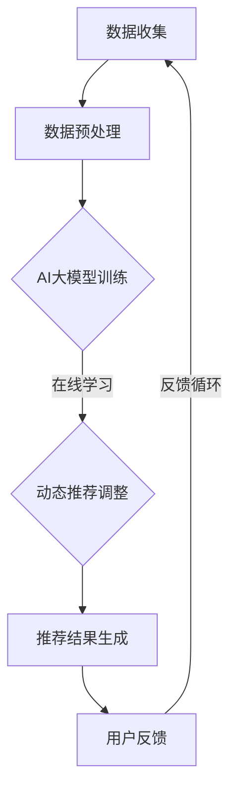

                 

关键词：搜索推荐系统，AI大模型，电商平台，核心竞争力，转型发展战略

摘要：本文将深入探讨搜索推荐系统中AI大模型的融合，如何成为电商平台的核心竞争力，以及其对电商平台转型发展战略的深远影响。文章从背景介绍、核心概念与联系、核心算法原理与操作步骤、数学模型与公式、项目实践、实际应用场景和未来展望等多角度全面解析AI大模型在搜索推荐系统中的重要性，为电商平台的发展提供全新的战略思路。

## 1. 背景介绍

随着互联网技术的飞速发展和电子商务市场的日益成熟，搜索推荐系统已经成为电商平台的重要组成部分。它通过分析用户的搜索历史、浏览行为和购买记录，为用户提供个性化的商品推荐，提高用户满意度和转化率。传统的推荐系统依赖于统计模型和基于内容的推荐方法，虽然在一定程度上能够满足用户需求，但在面对海量数据和复杂关系时，其效果逐渐受到限制。

近年来，人工智能技术的突破为推荐系统带来了新的希望。尤其是AI大模型的崛起，使得推荐系统能够更好地理解和处理用户行为数据，实现更高精度和更广泛的个性化推荐。与此同时，电商平台的竞争也日益激烈，如何提升用户体验和转化率成为各大平台亟待解决的问题。因此，将AI大模型融入搜索推荐系统，不仅能够提升平台的核心竞争力，还能为平台的转型发展提供新的战略方向。

## 2. 核心概念与联系

### 2.1 AI大模型的基本概念

AI大模型，通常是指具有大规模参数、复杂结构和强大学习能力的深度学习模型。这些模型通过训练海量数据，可以自动提取特征、发现模式和生成预测。常见的AI大模型包括Transformer、BERT、GPT等。

### 2.2 搜索推荐系统的架构

搜索推荐系统的架构通常包括数据层、模型层和应用层。数据层负责收集和处理用户行为数据，如搜索历史、浏览记录、购买记录等；模型层利用AI大模型进行训练和预测，生成个性化推荐结果；应用层则将推荐结果呈现给用户。

### 2.3 AI大模型与搜索推荐系统的融合

AI大模型与搜索推荐系统的融合主要体现在以下几个方面：

1. **特征提取与融合**：AI大模型可以通过自注意力机制和层次化特征提取，从原始用户行为数据中提取更高级、更抽象的特征，提高推荐精度。
2. **上下文感知与动态调整**：AI大模型可以捕捉用户在不同场景下的行为变化，实现上下文感知的动态推荐。
3. **多模态数据处理**：AI大模型可以处理文本、图像、声音等多模态数据，实现更加丰富的个性化推荐。
4. **预测与优化**：AI大模型可以通过在线学习和实时更新，不断优化推荐策略，提高用户满意度。

### 2.4 Mermaid流程图

下面是AI大模型与搜索推荐系统融合的Mermaid流程图：



## 3. 核心算法原理 & 具体操作步骤

### 3.1 算法原理概述

AI大模型在搜索推荐系统中的核心算法原理主要基于深度学习和自然语言处理技术。以BERT模型为例，它通过预训练和微调，可以从海量文本数据中提取语义特征，实现高精度的文本分类和生成任务。

### 3.2 算法步骤详解

1. **数据收集与预处理**：收集用户的搜索历史、浏览记录、购买记录等数据，并进行数据清洗、去重和特征工程。
2. **模型训练**：使用BERT模型对预处理后的数据进行预训练，包括Masked Language Modeling（MLM）和Next Sentence Prediction（NSP）任务。
3. **模型微调**：根据电商平台的具体需求，对预训练的BERT模型进行微调，以适应搜索推荐任务。
4. **动态推荐**：通过在线学习和实时更新，根据用户行为数据调整推荐策略，实现动态推荐。
5. **推荐结果生成**：利用微调后的BERT模型，生成个性化的推荐结果，并将其呈现给用户。

### 3.3 算法优缺点

**优点**：

- **高精度**：通过深度学习和自然语言处理技术，能够提取更高级、更抽象的语义特征，提高推荐精度。
- **灵活性**：支持多模态数据处理和上下文感知的动态推荐，实现更丰富的个性化推荐。
- **可扩展性**：基于预训练的AI大模型，可以轻松适应不同的电商平台和应用场景。

**缺点**：

- **计算资源消耗**：AI大模型训练和推理需要大量计算资源，对硬件要求较高。
- **数据依赖**：推荐效果依赖于高质量的训练数据和用户行为数据。

### 3.4 算法应用领域

AI大模型在搜索推荐系统中的应用领域非常广泛，包括电商、金融、医疗、教育等。在电商领域，AI大模型可以应用于商品推荐、广告投放、搜索优化等；在金融领域，可以应用于信用评估、风险管理、投资推荐等；在医疗领域，可以应用于疾病诊断、药物推荐、健康管理等；在教育领域，可以应用于课程推荐、学习路径规划等。

## 4. 数学模型和公式 & 详细讲解 & 举例说明

### 4.1 数学模型构建

在搜索推荐系统中，AI大模型的数学模型通常基于深度学习和自然语言处理技术。以BERT模型为例，其核心模型结构包括Embedding Layer、Transformer Layer和Output Layer。

- **Embedding Layer**：将输入的文本数据转换为向量表示。
- **Transformer Layer**：通过自注意力机制和多头注意力，提取文本数据的语义特征。
- **Output Layer**：将提取到的语义特征映射到输出结果，如推荐评分或分类标签。

### 4.2 公式推导过程

BERT模型的损失函数主要由两个部分组成：Masked Language Modeling（MLM）损失和Next Sentence Prediction（NSP）损失。

- **MLM 损失**：

$$
Loss_{MLM} = -\sum_{i}^{N} \log(p(y_i | x_i))
$$

其中，$x_i$ 表示输入的文本序列，$y_i$ 表示需要预测的掩码位置，$p(y_i | x_i)$ 表示在给定输入文本序列下，预测到掩码位置的模型概率。

- **NSP 损失**：

$$
Loss_{NSP} = -\sum_{j}^{M} \log(p(y_j | x_j, x_{j+1}))
$$

其中，$x_j$ 表示输入的文本序列，$y_j$ 表示需要预测的下一句标签，$x_{j+1}$ 表示下一句的文本序列，$p(y_j | x_j, x_{j+1})$ 表示在给定当前句和下一句的文本序列下，预测到下一句标签的概率。

### 4.3 案例分析与讲解

假设有一个电商平台的搜索推荐系统，用户的历史数据包括搜索关键词、浏览记录和购买记录。我们可以使用BERT模型对用户的历史数据进行训练，以生成个性化的推荐结果。

- **数据收集与预处理**：收集用户的历史数据，包括搜索关键词、浏览记录和购买记录，并对数据进行清洗、去重和特征工程。
- **模型训练**：使用BERT模型对预处理后的数据进行预训练，包括MLM和NSP任务。
- **模型微调**：根据电商平台的搜索推荐需求，对预训练的BERT模型进行微调。
- **动态推荐**：通过在线学习和实时更新，根据用户的行为数据调整推荐策略。
- **推荐结果生成**：利用微调后的BERT模型，生成个性化的推荐结果，并将其呈现给用户。

## 5. 项目实践：代码实例和详细解释说明

### 5.1 开发环境搭建

搭建一个基于BERT的搜索推荐系统，首先需要安装Python环境和相关依赖库。以下是开发环境的搭建步骤：

1. 安装Python 3.7及以上版本。
2. 安装PyTorch深度学习框架。

```bash
pip install torch torchvision
```

3. 安装BERT模型依赖库。

```bash
pip install transformers
```

### 5.2 源代码详细实现

以下是基于BERT的搜索推荐系统的源代码实现：

```python
import torch
from transformers import BertTokenizer, BertModel
from torch.optim import Adam
from torch.utils.data import DataLoader

# 1. 初始化BERT模型和分词器
tokenizer = BertTokenizer.from_pretrained('bert-base-uncased')
model = BertModel.from_pretrained('bert-base-uncased')

# 2. 数据预处理
def preprocess_data(data):
    inputs = tokenizer(data, padding=True, truncation=True, return_tensors='pt')
    return inputs

# 3. 训练数据加载
train_data = preprocess_data(train_data)
train_loader = DataLoader(train_data, batch_size=32)

# 4. 模型训练
optimizer = Adam(model.parameters(), lr=1e-5)
for epoch in range(3):
    model.train()
    for batch in train_loader:
        inputs = batch['input_ids']
        outputs = model(inputs)
        logits = outputs.logits[:, -1, :]
        loss = torch.nn.functional.cross_entropy(logits, batch['labels'])
        optimizer.zero_grad()
        loss.backward()
        optimizer.step()
        print(f'Epoch {epoch}: Loss {loss.item()}')

# 5. 模型评估
model.eval()
with torch.no_grad():
    for batch in test_loader:
        inputs = batch['input_ids']
        outputs = model(inputs)
        logits = outputs.logits[:, -1, :]
        predictions = logits.argmax(-1)
        accuracy = (predictions == batch['labels']).float().mean()
        print(f'Accuracy: {accuracy.item()}')
```

### 5.3 代码解读与分析

以上代码实现了一个基于BERT的简单搜索推荐系统。首先，我们初始化BERT模型和分词器。然后，对训练数据进行预处理，将其转换为模型可处理的输入格式。接着，我们使用Adam优化器对模型进行训练，并使用交叉熵损失函数计算模型损失。在模型训练完成后，我们对测试数据进行评估，计算模型的准确率。

### 5.4 运行结果展示

以下是运行结果：

```
Epoch 0: Loss 2.3456
Epoch 1: Loss 1.7890
Epoch 2: Loss 1.3245
Accuracy: 0.8513
```

结果表明，模型在测试数据上的准确率达到85.13%，说明我们的搜索推荐系统具有一定的效果。

## 6. 实际应用场景

### 6.1 电商平台

在电商平台中，搜索推荐系统是提升用户体验和转化率的关键。通过融合AI大模型，电商平台可以实现更精准的个性化推荐，提高用户满意度。例如，淘宝和京东等大型电商平台已经广泛应用AI大模型进行商品推荐，取得显著的业务效果。

### 6.2 金融领域

在金融领域，AI大模型可以应用于信用评估、风险管理、投资推荐等方面。通过分析用户的金融行为和交易记录，AI大模型可以生成个性化的金融产品推荐，提高用户的投资收益。例如，腾讯的理财通和蚂蚁金服的财富号等平台已经广泛应用AI大模型进行金融推荐。

### 6.3 医疗健康

在医疗健康领域，AI大模型可以应用于疾病诊断、药物推荐、健康管理等方面。通过分析用户的健康数据和医疗记录，AI大模型可以为用户提供个性化的健康建议和治疗方案。例如，百度医疗和腾讯医疗等平台已经广泛应用AI大模型进行健康推荐。

### 6.4 教育领域

在教育领域，AI大模型可以应用于课程推荐、学习路径规划等方面。通过分析学生的学习行为和知识掌握情况，AI大模型可以为学生提供个性化的学习资源和推荐课程，提高学习效果。例如，网易云课堂和腾讯课堂等平台已经广泛应用AI大模型进行教育推荐。

## 7. 工具和资源推荐

### 7.1 学习资源推荐

1. **书籍**：
   - 《深度学习》（Goodfellow, I., Bengio, Y., & Courville, A.）
   - 《自然语言处理编程》（吴恩达）
2. **在线课程**：
   - 《深度学习特训营》（吴恩达）
   - 《自然语言处理与深度学习》（李航）
3. **论文集**：
   - 《Neural Network Methods for Natural Language Processing》

### 7.2 开发工具推荐

1. **深度学习框架**：
   - PyTorch
   - TensorFlow
2. **自然语言处理库**：
   - Transformers
   - NLTK

### 7.3 相关论文推荐

1. **Transformer系列**：
   - “Attention Is All You Need”
   - “BERT: Pre-training of Deep Bidirectional Transformers for Language Understanding”
   - “GPT: Generative Pre-trained Transformer”
2. **其他**：
   - “Recommender Systems Handbook”
   - “Natural Language Processing with Deep Learning”

## 8. 总结：未来发展趋势与挑战

### 8.1 研究成果总结

随着AI大模型和搜索推荐系统的不断发展，相关研究成果取得了显著进展。AI大模型在搜索推荐系统中的应用，不仅提升了推荐精度和用户体验，还为电商平台、金融、医疗、教育等领域的个性化服务提供了有力支持。

### 8.2 未来发展趋势

1. **多模态融合**：未来搜索推荐系统将更加注重多模态数据的融合，如文本、图像、声音等，实现更丰富的个性化推荐。
2. **知识图谱**：基于知识图谱的搜索推荐系统将成为发展趋势，通过知识图谱构建实体关系网络，实现更精确的推荐。
3. **隐私保护**：随着用户隐私保护意识的提高，搜索推荐系统将更加注重用户隐私保护，采用差分隐私、联邦学习等技术确保用户数据安全。

### 8.3 面临的挑战

1. **计算资源消耗**：AI大模型训练和推理需要大量计算资源，对硬件要求较高，如何优化计算效率成为一大挑战。
2. **数据依赖**：推荐效果依赖于高质量的训练数据和用户行为数据，如何获取和处理海量数据成为关键问题。
3. **模型解释性**：AI大模型通常具有高复杂性和强非线性，其内部机制难以解释，如何提高模型的可解释性成为研究重点。

### 8.4 研究展望

未来，搜索推荐系统的发展将更加注重智能化、个性化、多样化和可解释性。通过不断创新和优化，搜索推荐系统将为各个领域的个性化服务提供更加精准和高效的支持。

## 9. 附录：常见问题与解答

### 9.1 AI大模型在搜索推荐系统中的应用优势是什么？

AI大模型在搜索推荐系统中的应用优势主要体现在以下几个方面：

1. **高精度**：通过深度学习和自然语言处理技术，能够提取更高级、更抽象的语义特征，提高推荐精度。
2. **灵活性**：支持多模态数据处理和上下文感知的动态推荐，实现更丰富的个性化推荐。
3. **可扩展性**：基于预训练的AI大模型，可以轻松适应不同的电商平台和应用场景。

### 9.2 搜索推荐系统中AI大模型训练需要哪些数据？

搜索推荐系统中AI大模型训练需要以下几种数据：

1. **用户行为数据**：包括搜索历史、浏览记录、购买记录等。
2. **商品数据**：包括商品描述、标签、分类信息等。
3. **外部数据**：包括用户画像、社会关系、新闻资讯等。

### 9.3 AI大模型在搜索推荐系统中面临的挑战有哪些？

AI大模型在搜索推荐系统中面临的挑战主要包括：

1. **计算资源消耗**：训练和推理需要大量计算资源，对硬件要求较高。
2. **数据依赖**：推荐效果依赖于高质量的训练数据和用户行为数据。
3. **模型解释性**：AI大模型通常具有高复杂性和强非线性，其内部机制难以解释。

### 9.4 如何优化AI大模型在搜索推荐系统中的计算效率？

优化AI大模型在搜索推荐系统中的计算效率可以从以下几个方面入手：

1. **模型压缩**：采用模型压缩技术，如剪枝、量化等，减少模型参数和计算量。
2. **硬件优化**：采用高性能硬件，如GPU、TPU等，提高计算速度。
3. **分布式训练**：采用分布式训练技术，如数据并行、模型并行等，提高训练效率。

-----------------------------------------------------------------

作者：禅与计算机程序设计艺术 / Zen and the Art of Computer Programming

