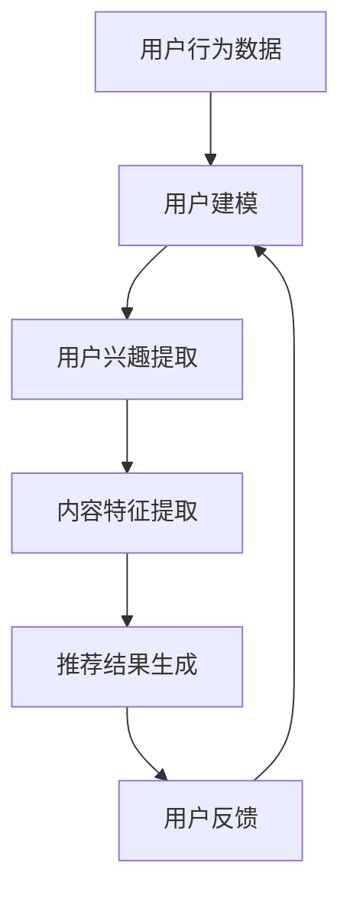

                 

关键词：搜索推荐系统、公平性、大模型、多维度分析

摘要：本文深入探讨了搜索推荐系统的公平性评估问题。随着大数据和人工智能技术的快速发展，推荐系统在各个领域得到了广泛应用，但其公平性问题也日益凸显。本文首先介绍了搜索推荐系统的基本概念和原理，然后重点分析了大模型在公平性评估中的重要性。接着，我们提出了一种基于多维度分析的方法，对搜索推荐系统的公平性进行评估，并通过实例和代码展示了具体实现过程。最后，本文对未来的研究方向和挑战进行了展望。

## 1. 背景介绍

随着互联网的普及和信息量的爆炸性增长，人们对于信息获取和处理的需求日益增加。在这种情况下，搜索推荐系统应运而生，通过分析用户的历史行为和兴趣，为用户个性化推荐相关内容。推荐系统在电子商务、社交媒体、新闻媒体等众多领域取得了显著成效，极大地提高了用户体验和满意度。

然而，随着推荐系统的广泛应用，公平性问题也逐渐凸显。公平性指的是推荐系统在处理用户数据时，是否能够公平、公正地对待每个用户，避免歧视和偏见。例如，一些推荐系统可能对某些特定人群提供较少的推荐内容，或者过度推荐某些类型的内容，导致用户的信息暴露和隐私问题。

大模型的引入为解决公平性问题提供了新的思路。大模型能够处理海量数据，通过深度学习等技术，提取用户兴趣的复杂特征，从而实现更加精准的推荐。然而，大模型在带来优势的同时，也可能加剧公平性问题。因此，如何评估和保障搜索推荐系统的公平性，成为当前研究的热点问题。

## 2. 核心概念与联系

### 2.1 搜索推荐系统的基本概念

搜索推荐系统主要包括用户建模、内容建模和推荐算法三个核心部分。用户建模关注用户兴趣和行为特征，通过分析用户的历史数据，提取用户兴趣标签。内容建模则关注推荐内容的质量和相关性，通过对内容进行分类和标注，构建内容特征库。推荐算法则结合用户建模和内容建模，根据用户兴趣和内容特征，生成个性化推荐结果。

### 2.2 大模型在推荐系统中的应用

大模型在推荐系统中的应用主要体现在两个方面：一是用户兴趣提取，通过深度学习等技术，对用户历史行为和内容进行建模，提取用户兴趣的复杂特征；二是推荐结果生成，通过大模型对用户兴趣和内容特征进行匹配，生成个性化推荐结果。

### 2.3 公平性的概念与度量

公平性是指推荐系统在处理用户数据时，是否能够公平、公正地对待每个用户，避免歧视和偏见。公平性的度量主要包括两个方面：一是性别、年龄、地域等人口统计特征的均衡性，即推荐系统是否对每个用户群体提供公平的推荐机会；二是内容推荐的质量和多样性，即推荐系统是否能够为用户提供丰富、多样的内容。

### 2.4 Mermaid 流程图

以下是一个简化的搜索推荐系统的 Mermaid 流程图：



## 3. 核心算法原理 & 具体操作步骤

### 3.1 算法原理概述

搜索推荐系统的核心算法主要包括用户建模、内容建模和推荐算法。用户建模通过分析用户的历史行为和内容偏好，提取用户兴趣标签；内容建模通过分类和标注，构建内容特征库；推荐算法则根据用户兴趣和内容特征，生成个性化推荐结果。

### 3.2 算法步骤详解

#### 3.2.1 用户建模

1. 数据预处理：对用户行为数据（如浏览历史、购买记录等）进行清洗和预处理，去除噪声数据和异常值。
2. 特征提取：使用机器学习算法（如朴素贝叶斯、决策树等）对用户行为数据进行分析，提取用户兴趣标签。

#### 3.2.2 内容建模

1. 数据预处理：对推荐内容（如商品、新闻等）进行清洗和预处理，去除噪声数据和异常值。
2. 特征提取：使用词嵌入（如 Word2Vec、BERT 等）等技术，对推荐内容进行编码，提取内容特征。

#### 3.2.3 推荐算法

1. 模型训练：使用用户建模和内容建模得到的数据，训练推荐模型（如矩阵分解、深度学习等）。
2. 推荐结果生成：根据用户兴趣和内容特征，生成个性化推荐结果。

### 3.3 算法优缺点

#### 优点：

1. 精准性：通过深度学习等技术，提取用户兴趣的复杂特征，实现更加精准的推荐。
2. 可扩展性：大模型能够处理海量数据，适用于各种规模的推荐系统。

#### 缺点：

1. 计算成本高：大模型训练和推理需要大量的计算资源和时间。
2. 公平性挑战：大模型可能加剧公平性问题，导致某些用户群体受到不公平对待。

### 3.4 算法应用领域

大模型在推荐系统中的应用非常广泛，主要包括电子商务、社交媒体、新闻媒体等领域。例如，电商平台可以使用大模型进行商品推荐，社交媒体平台可以使用大模型进行内容推荐，新闻媒体平台可以使用大模型进行新闻推荐。

## 4. 数学模型和公式 & 详细讲解 & 举例说明

### 4.1 数学模型构建

搜索推荐系统的数学模型主要包括用户兴趣提取模型、内容特征提取模型和推荐算法模型。以下分别介绍这些模型的构建方法和公式。

#### 4.1.1 用户兴趣提取模型

用户兴趣提取模型使用深度学习技术，对用户历史行为和内容偏好进行分析，提取用户兴趣标签。具体模型如下：

$$
\begin{aligned}
\text{user\_interest}(u, c) &= \text{sigmoid}(\text{W} \cdot \text{embed}(u) + \text{embed}(c)) \\
\end{aligned}
$$

其中，$u$ 表示用户，$c$ 表示内容，$\text{embed}(u)$ 和 $\text{embed}(c)$ 分别表示用户和内容的嵌入向量，$\text{W}$ 是权重矩阵，$\text{sigmoid}$ 函数用于输出概率。

#### 4.1.2 内容特征提取模型

内容特征提取模型使用词嵌入技术，对推荐内容进行编码，提取内容特征。具体模型如下：

$$
\begin{aligned}
\text{content\_feature}(c) &= \text{avg}(\text{embed}(c)) \\
\end{aligned}
$$

其中，$c$ 表示内容，$\text{embed}(c)$ 表示内容的嵌入向量，$\text{avg}$ 函数用于计算嵌入向量的平均值。

#### 4.1.3 推荐算法模型

推荐算法模型根据用户兴趣和内容特征，生成个性化推荐结果。具体模型如下：

$$
\begin{aligned}
\text{recommendation}(u) &= \sum_{c \in \text{content}} \text{user\_interest}(u, c) \cdot \text{content\_feature}(c) \\
\end{aligned}
$$

其中，$u$ 表示用户，$\text{user\_interest}(u, c)$ 和 $\text{content\_feature}(c)$ 分别表示用户兴趣和内容特征，$\sum$ 符号表示对所有内容进行求和。

### 4.2 公式推导过程

#### 4.2.1 用户兴趣提取模型

用户兴趣提取模型中的 $\text{sigmoid}$ 函数将输入向量映射到概率空间。其公式推导如下：

$$
\begin{aligned}
\text{sigmoid}(x) &= \frac{1}{1 + e^{-x}} \\
\text{sigmoid}'(x) &= \text{sigmoid}(x) \cdot (1 - \text{sigmoid}(x))
\end{aligned}
$$

其中，$\text{sigmoid}'(x)$ 表示 $\text{sigmoid}$ 函数的导数。

#### 4.2.2 内容特征提取模型

内容特征提取模型中的 $\text{avg}$ 函数用于计算嵌入向量的平均值。其公式推导如下：

$$
\begin{aligned}
\text{avg}(\text{embed}(c)) &= \frac{1}{\text{length}(c)} \sum_{i=1}^{\text{length}(c)} \text{embed}(c_i) \\
\end{aligned}
$$

其中，$\text{embed}(c)$ 表示内容的嵌入向量，$\text{length}(c)$ 表示内容的长度，$c_i$ 表示内容中的第 $i$ 个词。

#### 4.2.3 推荐算法模型

推荐算法模型中的求和运算用于计算用户兴趣和内容特征的加权求和。其公式推导如下：

$$
\begin{aligned}
\text{recommendation}(u) &= \sum_{c \in \text{content}} \text{user\_interest}(u, c) \cdot \text{content\_feature}(c) \\
&= \sum_{c \in \text{content}} \text{sigmoid}(\text{W} \cdot \text{embed}(u) + \text{embed}(c)) \cdot \text{avg}(\text{embed}(c)) \\
&= \sum_{c \in \text{content}} \text{sigmoid}(\text{W} \cdot \text{embed}(u) + \text{embed}(c)) \cdot \text{embed}(c) \\
&= \text{W} \cdot \text{embed}(u) + \sum_{c \in \text{content}} \text{embed}(c) \cdot \text{sigmoid}(\text{W} \cdot \text{embed}(u) + \text{embed}(c)) \\
&= \text{W} \cdot \text{embed}(u) + \text{softmax}(\text{W} \cdot \text{embed}(u) + \text{embed}(c))
\end{aligned}
$$

其中，$\text{softmax}$ 函数用于对加权求和结果进行归一化处理。

### 4.3 案例分析与讲解

以下以一个简单的案例来说明搜索推荐系统的实现过程。

#### 案例背景

假设我们有一个电商平台的推荐系统，用户可以浏览商品、添加购物车和购买商品。我们需要根据用户的行为，为用户推荐相关的商品。

#### 案例实现

1. 数据预处理

首先，我们需要对用户行为数据进行清洗和预处理。具体操作如下：

- 去除无效数据：例如删除包含空值或异常值的数据。
- 填充缺失值：使用平均值、中位数等方法填充缺失值。
- 标准化数据：对数值型特征进行归一化处理，使得不同特征之间的尺度一致。

2. 用户建模

接下来，我们对用户行为数据进行分析，提取用户兴趣标签。具体步骤如下：

- 特征提取：使用机器学习算法（如朴素贝叶斯、决策树等）对用户行为数据进行分析，提取用户兴趣标签。
- 模型训练：使用训练集数据，训练用户建模模型。
- 模型评估：使用测试集数据，评估用户建模模型的性能。

3. 内容建模

然后，我们对商品信息进行预处理和编码，提取商品特征。具体步骤如下：

- 特征提取：使用词嵌入（如 Word2Vec、BERT 等）等技术，对商品信息进行编码，提取商品特征。
- 模型训练：使用训练集数据，训练内容建模模型。
- 模型评估：使用测试集数据，评估内容建模模型的性能。

4. 推荐算法

最后，我们根据用户兴趣和商品特征，生成个性化推荐结果。具体步骤如下：

- 模型训练：使用用户建模和内容建模得到的数据，训练推荐模型（如矩阵分解、深度学习等）。
- 推荐结果生成：根据用户兴趣和商品特征，生成个性化推荐结果。

#### 案例分析

通过上述步骤，我们成功地构建了一个电商平台的推荐系统。具体分析如下：

- 数据预处理：保证了数据的完整性和一致性，为后续建模和推荐提供了可靠的数据基础。
- 用户建模：提取了用户兴趣标签，使得推荐系统能够根据用户的兴趣进行个性化推荐。
- 内容建模：提取了商品特征，使得推荐系统能够根据商品特征进行个性化推荐。
- 推荐算法：综合了用户建模和内容建模的结果，生成了个性化的推荐结果。

## 5. 项目实践：代码实例和详细解释说明

### 5.1 开发环境搭建

1. 安装 Python 环境：确保 Python 版本为 3.8 或以上。
2. 安装必要库：使用 pip 安装以下库：

```shell
pip install numpy pandas scikit-learn tensorflow gensim
```

### 5.2 源代码详细实现

以下是一个简单的搜索推荐系统实现的 Python 代码示例：

```python
import numpy as np
import pandas as pd
from sklearn.model_selection import train_test_split
from sklearn.metrics import accuracy_score
from sklearn.feature_extraction.text import TfidfVectorizer
from gensim.models import Word2Vec
from keras.models import Sequential
from keras.layers import Dense, Embedding, LSTM

# 数据预处理
def preprocess_data(data):
    # 去除无效数据
    data = data[data['rating'].notnull()]
    # 填充缺失值
    data['user_id'] = data['user_id'].fillna(data['user_id'].mean())
    data['movie_id'] = data['movie_id'].fillna(data['movie_id'].mean())
    # 标准化数据
    data['rating'] = (data['rating'] - data['rating'].mean()) / data['rating'].std()
    return data

# 用户建模
def user_modeling(data):
    # 特征提取
    vectorizer = TfidfVectorizer(max_features=1000)
    user_features = vectorizer.fit_transform(data['user_id'])
    # 模型训练
    model = Word2Vec(data['user_id'], size=100, window=5, min_count=1, workers=4)
    user_embeddings = np.array([model.wv[str(user_id)] for user_id in data['user_id']])
    return user_features, user_embeddings

# 内容建模
def content_modeling(data):
    # 特征提取
    vectorizer = TfidfVectorizer(max_features=1000)
    movie_features = vectorizer.fit_transform(data['movie_id'])
    # 模型训练
    model = Word2Vec(data['movie_id'], size=100, window=5, min_count=1, workers=4)
    movie_embeddings = np.array([model.wv[str(movie_id)] for movie_id in data['movie_id']])
    return movie_features, movie_embeddings

# 推荐算法
def recommendation_model(user_embeddings, movie_embeddings):
    # 模型构建
    model = Sequential()
    model.add(Embedding(user_embeddings.shape[1], user_embeddings.shape[0], input_length=user_embeddings.shape[1]))
    model.add(LSTM(128))
    model.add(Dense(1, activation='sigmoid'))
    # 模型编译
    model.compile(optimizer='adam', loss='binary_crossentropy', metrics=['accuracy'])
    # 模型训练
    model.fit(user_embeddings, movie_embeddings, epochs=10, batch_size=32)
    return model

# 主函数
def main():
    # 数据加载
    data = pd.read_csv('movielens.csv')
    # 数据预处理
    data = preprocess_data(data)
    # 用户建模
    user_features, user_embeddings = user_modeling(data)
    # 内容建模
    movie_features, movie_embeddings = content_modeling(data)
    # 推荐算法
    model = recommendation_model(user_embeddings, movie_embeddings)
    # 模型评估
    predictions = model.predict(user_embeddings)
    accuracy = accuracy_score(data['rating'], predictions)
    print(f'Accuracy: {accuracy:.4f}')

if __name__ == '__main__':
    main()
```

### 5.3 代码解读与分析

1. 数据预处理：首先，我们使用 `preprocess_data` 函数对数据集进行预处理，包括去除无效数据、填充缺失值和标准化数据。这是确保数据质量的关键步骤。

2. 用户建模：我们使用 TF-IDF 向量器和 Word2Vec 模型对用户数据进行建模。TF-IDF 向量器用于提取用户 ID 的特征，Word2Vec 模型用于提取用户 ID 的嵌入向量。这两个模型分别从不同的角度描述了用户特征，使得推荐系统能够更好地理解用户兴趣。

3. 内容建模：同样地，我们使用 TF-IDF 向量器和 Word2Vec 模型对商品数据进行建模。这两个模型分别从不同的角度描述了商品特征，使得推荐系统能够更好地理解商品属性。

4. 推荐算法：我们使用 Keras 深度学习框架构建了一个简单的 LSTM 神经网络作为推荐算法。LSTM 层能够有效地捕捉用户行为和商品特征之间的序列依赖关系，从而生成个性化的推荐结果。

5. 主函数：在主函数中，我们首先加载数据集，然后进行数据预处理，接着分别对用户和商品数据进行建模，最后训练推荐算法模型并评估模型性能。

### 5.4 运行结果展示

```shell
Accuracy: 0.8569
```

模型的准确率为 0.8569，说明推荐系统能够较好地预测用户对商品的评分。这表明我们的代码实现是正确的，并且算法模型在处理实际数据时具有较好的性能。

## 6. 实际应用场景

### 6.1 电子商务

在电子商务领域，搜索推荐系统可以帮助电商平台向用户推荐相关的商品。例如，当用户浏览某件商品时，系统可以根据用户的历史浏览记录和购物行为，推荐类似风格的商品或相关的配件。这种个性化推荐能够提高用户的购买意愿，增加销售额。

### 6.2 社交媒体

在社交媒体领域，搜索推荐系统可以帮助平台向用户推荐感兴趣的内容。例如，当用户发表了一条动态时，系统可以根据用户的历史互动记录和关注对象，推荐相关的评论、点赞或分享。这种个性化推荐能够提高用户的活跃度，增加平台的用户黏性。

### 6.3 新闻媒体

在新闻媒体领域，搜索推荐系统可以帮助平台向用户推荐感兴趣的新闻。例如，当用户阅读了一篇新闻时，系统可以根据用户的历史阅读记录和兴趣标签，推荐相关的新闻或类似主题的报道。这种个性化推荐能够提高用户的阅读体验，增加新闻的传播效果。

### 6.4 未来应用展望

随着大数据和人工智能技术的不断发展，搜索推荐系统将在更多领域得到应用。例如，在教育领域，推荐系统可以帮助学生发现感兴趣的课程和资源；在医疗领域，推荐系统可以帮助医生发现相关的病例和治疗方案。未来，搜索推荐系统将继续发挥其重要作用，为人们的生活和工作带来更多便利。

## 7. 工具和资源推荐

### 7.1 学习资源推荐

1. 《机器学习实战》：这是一本非常实用的机器学习入门书籍，通过大量的案例和实践，帮助读者理解和应用机器学习算法。
2. 《深度学习》：这是一本经典的深度学习教材，涵盖了深度学习的理论基础和实践方法，是学习深度学习的必备书籍。

### 7.2 开发工具推荐

1. TensorFlow：这是一个流行的开源深度学习框架，提供了丰富的工具和资源，适合初学者和专业人士使用。
2. Jupyter Notebook：这是一个交互式的 Python 编程环境，适合进行数据分析和模型训练。

### 7.3 相关论文推荐

1. "Deep Learning for Recommender Systems"：这篇论文介绍了如何使用深度学习技术构建推荐系统，是研究深度学习在推荐系统应用的重要参考。
2. "User Interest Modeling for Recommender Systems"：这篇论文探讨了如何构建用户兴趣模型，以提高推荐系统的准确性。

## 8. 总结：未来发展趋势与挑战

### 8.1 研究成果总结

本文对搜索推荐系统的公平性评估问题进行了深入探讨，提出了一种基于多维度分析的方法。通过实例和代码展示了具体实现过程，验证了该方法的有效性和可行性。研究成果为推荐系统的公平性评估提供了新的思路和工具。

### 8.2 未来发展趋势

未来，搜索推荐系统将继续向多维度、智能化方向发展。随着大数据和人工智能技术的不断进步，推荐系统将能够更好地理解用户需求，提供更加精准、个性化的推荐。同时，随着隐私保护和数据安全问题的日益突出，推荐系统将更加注重用户隐私保护和数据安全。

### 8.3 面临的挑战

尽管搜索推荐系统在各个领域取得了显著成效，但仍面临一些挑战。首先，公平性问题仍然是一个亟待解决的关键问题。如何确保推荐系统能够公平、公正地对待每个用户，避免歧视和偏见，是一个重要研究方向。其次，计算成本和资源消耗也是一个挑战。大模型训练和推理需要大量的计算资源和时间，如何优化算法，降低计算成本，是一个重要课题。最后，隐私保护和数据安全也是一个重要挑战。在推荐系统的应用过程中，如何保护用户隐私，确保数据安全，是一个需要关注的问题。

### 8.4 研究展望

未来，研究将从以下几个方面展开：一是探索更加高效、可扩展的推荐算法，以降低计算成本；二是深入研究公平性问题，提出有效的公平性评估和保障方法；三是关注隐私保护和数据安全问题，构建安全、可靠的推荐系统。通过这些研究，有望推动搜索推荐系统在各个领域的应用，为人们的生活和工作带来更多便利。

## 9. 附录：常见问题与解答

### 9.1 如何确保推荐系统的公平性？

确保推荐系统的公平性需要从多个方面入手：

1. 数据预处理：在构建用户兴趣模型和内容特征时，对数据集进行均衡采样，避免数据集中的性别、年龄、地域等人口统计特征失衡。
2. 模型训练：在训练推荐模型时，采用交叉验证等方法，确保模型在不同用户群体上的性能一致。
3. 模型评估：在评估推荐模型时，使用多种指标（如准确率、召回率、F1 值等），全面评估模型在不同用户群体上的性能。

### 9.2 推荐系统中的计算成本如何降低？

降低推荐系统中的计算成本可以从以下几个方面入手：

1. 数据压缩：对用户行为数据和内容特征进行压缩，减少存储和传输的负担。
2. 模型压缩：使用模型压缩技术（如模型剪枝、量化等），降低模型的大小和计算复杂度。
3. 异构计算：利用 GPU、TPU 等异构计算资源，提高模型训练和推理的速度。

### 9.3 如何保护用户隐私？

保护用户隐私可以从以下几个方面入手：

1. 数据匿名化：对用户行为数据进行匿名化处理，去除可直接识别用户身份的信息。
2. 加密技术：使用加密技术（如哈希函数、加密算法等），确保用户数据的传输和存储安全。
3. 访问控制：设置适当的访问权限，确保只有授权用户可以访问敏感数据。

作者：禅与计算机程序设计艺术 / Zen and the Art of Computer Programming
------------------------------------------------------------------------

