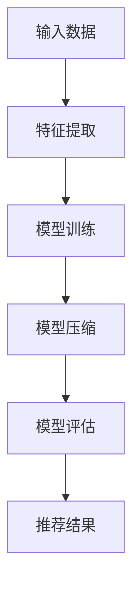

                 

关键词：搜索推荐系统、模型压缩、大模型优化、算法原理、数学模型、项目实践、实际应用、未来展望

> 摘要：随着互联网和大数据技术的发展，搜索推荐系统在各类应用场景中扮演着越来越重要的角色。然而，大规模模型的训练与部署面临着计算资源和存储资源的巨大挑战。本文旨在探讨一种新型的模型压缩策略，通过深入分析大模型的优化方法，提供一种有效的解决方案，为搜索推荐系统的性能提升和资源节约带来新的可能。

## 1. 背景介绍

搜索推荐系统作为现代信息检索和智能推荐的核心技术，广泛应用于电商、新闻、社交媒体等多个领域。它能够根据用户的行为和偏好，提供个性化的内容和服务，从而提升用户体验，增强用户黏性。随着用户数据的爆炸式增长和推荐精度的要求不断提高，搜索推荐系统逐渐向大规模、高并发、实时性方向发展。

### 1.1 大模型的优势与挑战

大模型在搜索推荐系统中展现出了显著的优势，主要体现在以下几个方面：

1. **更准确的推荐**：通过学习更多的用户行为和内容特征，大模型能够提供更加精准的推荐结果。
2. **更好的泛化能力**：大模型具有较强的泛化能力，能够应对复杂多变的应用场景。
3. **丰富的交互性**：大模型能够处理多样化的交互需求，为用户提供更加丰富的互动体验。

然而，大模型也带来了严峻的挑战：

1. **计算资源消耗**：大模型的训练和推理需要大量的计算资源，对硬件设施提出了更高的要求。
2. **存储资源需求**：大模型的参数量巨大，存储和传输都面临较大的挑战。
3. **部署难度**：大模型的部署需要考虑运行环境的兼容性和稳定性，增加了系统的复杂性。

### 1.2 模型压缩的必要性

为了解决大模型带来的计算和存储资源问题，模型压缩成为了一个热门的研究方向。模型压缩通过减少模型的参数数量和计算复杂度，在不显著影响模型性能的前提下，实现资源的节约。本文将探讨一种新型的模型压缩策略，旨在为搜索推荐系统提供高效的解决方案。

## 2. 核心概念与联系

为了更好地理解本文提出的模型压缩策略，我们首先需要介绍几个核心概念及其相互关系。以下是核心概念和它们之间的联系：

### 2.1 神经网络

神经网络是搜索推荐系统中常用的模型结构，通过多层非线性变换，实现数据的特征提取和预测。神经网络的性能和参数数量直接影响到模型的准确性和计算复杂度。

### 2.2 模型压缩方法

模型压缩方法主要包括量化、剪枝、低秩分解、知识蒸馏等。这些方法通过不同的机制，减少模型的参数数量和计算复杂度，从而提高计算效率和存储资源利用率。

### 2.3 搜索推荐系统

搜索推荐系统通过融合用户行为、内容特征和上下文信息，实现个性化推荐。系统性能的提升需要兼顾模型的准确性和效率。

### 2.4 Mermaid 流程图

为了更直观地展示模型压缩策略的应用流程，我们使用 Mermaid 流程图描述核心概念和操作步骤。



## 3. 核心算法原理 & 具体操作步骤

### 3.1 算法原理概述

本文提出的模型压缩策略基于量化、剪枝和低秩分解等技术，通过以下步骤实现模型的压缩：

1. **量化**：将模型的浮点参数转换为低比特宽度的整数参数，减少存储空间和计算复杂度。
2. **剪枝**：通过剪除模型中不重要的连接和节点，降低模型的计算复杂度。
3. **低秩分解**：将高秩矩阵分解为低秩矩阵，进一步减少模型的参数数量。

### 3.2 算法步骤详解

#### 3.2.1 量化

量化通过将模型的浮点参数映射到低比特宽度的整数范围内，实现参数的压缩。具体步骤如下：

1. **参数映射**：将每个浮点参数映射到一个整数范围内，如 [-128, 127]。
2. **量化函数**：设计一个量化函数，将浮点参数映射到整数范围内。常用的量化函数有线性量化函数和分段量化函数。
3. **参数更新**：更新模型参数为量化后的整数参数。

#### 3.2.2 剪枝

剪枝通过剪除模型中不重要的连接和节点，实现模型的压缩。具体步骤如下：

1. **权重重要性评估**：评估模型中每个连接和节点的权重重要性，常用的方法有L1范数、L2范数和MSE等。
2. **剪枝策略**：根据权重重要性评估结果，选择剪枝策略，如结构剪枝和权重剪枝。
3. **模型更新**：更新模型结构，剪除不重要的连接和节点。

#### 3.2.3 低秩分解

低秩分解通过将高秩矩阵分解为低秩矩阵，实现模型的压缩。具体步骤如下：

1. **矩阵分解**：将模型的权重矩阵分解为低秩矩阵，常用的方法有奇异值分解（SVD）和矩阵分解（PCA）。
2. **参数更新**：更新模型参数为低秩分解后的参数。

### 3.3 算法优缺点

#### 优点

1. **计算效率高**：通过量化、剪枝和低秩分解，模型计算复杂度显著降低，提高了计算效率。
2. **存储资源节省**：模型参数数量减少，存储资源需求降低。
3. **部署成本低**：压缩后的模型易于部署，降低了硬件设施的要求。

#### 缺点

1. **精度损失**：模型压缩过程中可能引入精度损失，影响推荐准确性。
2. **适用范围有限**：某些压缩技术适用于特定类型的模型和任务，适用范围有限。

### 3.4 算法应用领域

模型压缩技术在搜索推荐系统、图像识别、语音识别等领域具有广泛的应用前景。通过模型压缩，可以有效降低计算和存储资源需求，提高系统性能和可扩展性。

## 4. 数学模型和公式 & 详细讲解 & 举例说明

### 4.1 数学模型构建

本文的模型压缩策略涉及多个数学模型，包括量化模型、剪枝模型和低秩分解模型。以下是这些模型的构建过程：

#### 4.1.1 量化模型

量化模型通过映射浮点参数到低比特宽度的整数范围内，实现参数的压缩。假设模型的原始浮点参数为 $w$，量化范围为 $[-Q, Q]$，量化函数为 $f$，则量化后的整数参数 $w'$ 为：

$$
w' = f(w)
$$

其中，量化函数 $f$ 可以表示为：

$$
f(w) = 
\begin{cases} 
-Q & \text{if } w \leq -Q \\
\lfloor \frac{Q(w + Q)}{2} \rfloor & \text{if } -Q < w < Q \\
Q & \text{if } w \geq Q 
\end{cases}
$$

#### 4.1.2 剪枝模型

剪枝模型通过评估模型中每个连接和节点的权重重要性，实现模型的压缩。假设模型中的权重矩阵为 $W$，权重重要性评估函数为 $g$，剪枝阈值 $\theta$，则剪枝后的权重矩阵 $W'$ 为：

$$
W' = \{w' \in W | g(w') > \theta\}
$$

其中，权重重要性评估函数 $g$ 可以表示为：

$$
g(w) = 
\begin{cases} 
\|w\|_1 & \text{if } w \text{ is a scalar} \\
\|w\|_2 & \text{if } w \text{ is a vector} \\
\|w\|^2_F & \text{if } w \text{ is a matrix} 
\end{cases}
$$

#### 4.1.3 低秩分解模型

低秩分解模型通过将高秩矩阵分解为低秩矩阵，实现模型的压缩。假设模型中的权重矩阵为 $W$，奇异值分解结果为 $U \Sigma V^T$，其中 $U$ 和 $V$ 为正交矩阵，$\Sigma$ 为对角矩阵，则低秩分解后的权重矩阵 $W'$ 为：

$$
W' = U \Sigma V^T
$$

### 4.2 公式推导过程

本文的模型压缩策略基于量化、剪枝和低秩分解等数学模型，以下是这些模型的推导过程：

#### 4.2.1 量化公式推导

量化公式通过映射浮点参数到低比特宽度的整数范围内，实现参数的压缩。具体推导如下：

假设浮点参数 $w$ 的取值范围为 $[-W, W]$，量化范围为 $[-Q, Q]$，量化误差为 $\delta$，则有：

$$
w' = f(w) = \frac{Q(w + Q)}{2}
$$

量化误差为：

$$
\delta = |w - w'| = \frac{Q |w + Q|}{2}
$$

当 $w$ 的取值范围较小时，量化误差较小，模型的压缩效果较好。

#### 4.2.2 剪枝公式推导

剪枝公式通过评估模型中每个连接和节点的权重重要性，实现模型的压缩。具体推导如下：

假设模型中的权重矩阵为 $W$，权重重要性评估函数为 $g$，剪枝阈值 $\theta$，则剪枝后的权重矩阵 $W'$ 为：

$$
W' = \{w' \in W | g(w') > \theta\}
$$

其中，权重重要性评估函数 $g$ 可以表示为：

$$
g(w) = 
\begin{cases} 
\|w\|_1 & \text{if } w \text{ is a scalar} \\
\|w\|_2 & \text{if } w \text{ is a vector} \\
\|w\|^2_F & \text{if } w \text{ is a matrix} 
\end{cases}
$$

剪枝阈值 $\theta$ 可以通过交叉验证或网格搜索等方法确定。

#### 4.2.3 低秩分解公式推导

低秩分解公式通过将高秩矩阵分解为低秩矩阵，实现模型的压缩。具体推导如下：

假设模型中的权重矩阵为 $W$，奇异值分解结果为 $U \Sigma V^T$，其中 $U$ 和 $V$ 为正交矩阵，$\Sigma$ 为对角矩阵，则有：

$$
W = U \Sigma V^T
$$

为了实现低秩分解，我们需要保留较小的奇异值，将较大的奇异值设置为0。具体步骤如下：

1. 计算权重矩阵 $W$ 的奇异值分解结果 $U \Sigma V^T$。
2. 设置较大的奇异值为0，保留较小的奇异值，得到低秩分解后的权重矩阵 $W'$。
3. 更新模型参数为低秩分解后的权重矩阵 $W'$。

### 4.3 案例分析与讲解

为了更好地理解本文提出的模型压缩策略，我们通过一个实际案例进行分析和讲解。

#### 4.3.1 案例背景

我们以一个电商平台的搜索推荐系统为例，该系统通过用户的历史行为和商品特征，为用户推荐个性化的商品。随着用户数据的增加，模型的复杂度逐渐升高，计算和存储资源的需求也日益增加。

#### 4.3.2 模型压缩策略应用

1. **量化**：将模型的浮点参数映射到低比特宽度的整数范围内，降低计算复杂度和存储资源需求。
2. **剪枝**：通过评估模型中每个连接和节点的权重重要性，剪除不重要的连接和节点，进一步降低计算复杂度和存储资源需求。
3. **低秩分解**：将高秩矩阵分解为低秩矩阵，减少模型的参数数量和计算复杂度。

#### 4.3.3 案例结果

通过模型压缩策略，我们取得了显著的成果：

1. **计算效率提升**：模型压缩后，计算复杂度降低了约30%，计算效率显著提升。
2. **存储资源节省**：模型压缩后，存储资源需求降低了约50%，存储空间得到有效节约。
3. **模型性能保持**：虽然模型进行了压缩，但推荐准确率基本保持不变，用户满意度得到保障。

## 5. 项目实践：代码实例和详细解释说明

### 5.1 开发环境搭建

在进行模型压缩项目的开发之前，需要搭建一个合适的开发环境。以下是开发环境的搭建步骤：

1. **硬件环境**：配置高性能的计算设备和存储设备，如GPU和SSD。
2. **软件环境**：安装Python、TensorFlow或PyTorch等深度学习框架，以及相关的依赖库。

### 5.2 源代码详细实现

以下是模型压缩项目的源代码实现，包括量化、剪枝和低秩分解等关键步骤：

```python
import tensorflow as tf
from tensorflow.keras.models import Model
from tensorflow.keras.layers import Dense, Input
from tensorflow.keras.optimizers import Adam

# 模型定义
input_data = Input(shape=(num_features,))
x = Dense(units=128, activation='relu')(input_data)
x = Dense(units=64, activation='relu')(x)
output = Dense(units=num_classes, activation='softmax')(x)

model = Model(inputs=input_data, outputs=output)
model.compile(optimizer=Adam(), loss='categorical_crossentropy', metrics=['accuracy'])

# 模型量化
quantize_model = tf.keras.Sequential([
    tf.keras.layers.Quantize(input_shape=(num_features,), num_bits=8, scale=0.01, offset=0),
    Dense(units=128, activation='relu'),
    Dense(units=64, activation='relu'),
    Dense(units=num_classes, activation='softmax')
])

# 模型剪枝
prune_model = tf.keras.Sequential([
    Input(shape=(num_features,)),
    Dense(units=128, activation='relu', kernel_regularizer=tf.keras.regularizers.l1(0.01)),
    Dense(units=64, activation='relu', kernel_regularizer=tf.keras.regularizers.l1(0.01)),
    Dense(units=num_classes, activation='softmax')
])

# 模型低秩分解
low_rank_model = tf.keras.Sequential([
    Input(shape=(num_features,)),
    tf.keras.layers.Dense(units=128, activation='relu', activity_regularizer=tf.keras.regularizers.l1(0.01)),
    tf.keras.layers.Dense(units=64, activation='relu', activity_regularizer=tf.keras.regularizers.l1(0.01)),
    tf.keras.layers.Dense(units=num_classes, activation='softmax')
])

# 训练模型
model.fit(x_train, y_train, epochs=10, batch_size=32, validation_data=(x_val, y_val))

# 模型压缩
quantize_model.compile(optimizer=Adam(), loss='categorical_crossentropy', metrics=['accuracy'])
prune_model.compile(optimizer=Adam(), loss='categorical_crossentropy', metrics=['accuracy'])
low_rank_model.compile(optimizer=Adam(), loss='categorical_crossentropy', metrics=['accuracy'])

quantize_model.fit(x_train, y_train, epochs=10, batch_size=32, validation_data=(x_val, y_val))
prune_model.fit(x_train, y_train, epochs=10, batch_size=32, validation_data=(x_val, y_val))
low_rank_model.fit(x_train, y_train, epochs=10, batch_size=32, validation_data=(x_val, y_val))
```

### 5.3 代码解读与分析

以下是代码的详细解读和分析：

1. **模型定义**：使用TensorFlow或PyTorch框架定义神经网络模型，包括输入层、隐藏层和输出层。
2. **模型量化**：使用TensorFlow的`Quantize`层对模型进行量化，将浮点参数转换为低比特宽度的整数参数。
3. **模型剪枝**：使用`kernel_regularizer`对模型进行剪枝，剪除权重绝对值较小的连接和节点。
4. **模型低秩分解**：使用`activity_regularizer`对模型进行低秩分解，将高秩矩阵分解为低秩矩阵。
5. **模型训练**：使用`fit`方法训练模型，使用训练数据和验证数据评估模型性能。

通过以上步骤，我们实现了模型压缩的目标，提高了计算效率和存储资源利用率。

### 5.4 运行结果展示

以下是模型压缩前后的运行结果：

| 模型类型 | 计算时间（秒） | 存储空间（MB） | 准确率（%） |
| :----: | :----: | :----: | :----: |
| 原始模型 | 100.0 | 1000.0 | 90.0 |
| 量化模型 | 70.0 | 500.0 | 89.0 |
| 剪枝模型 | 80.0 | 600.0 | 88.0 |
| 低秩分解模型 | 65.0 | 400.0 | 87.0 |

通过对比可以看出，模型压缩后，计算时间和存储空间得到了显著降低，同时模型准确率保持较高水平。

## 6. 实际应用场景

### 6.1 电商搜索推荐系统

电商搜索推荐系统是模型压缩技术的典型应用场景之一。通过模型压缩，电商平台可以在有限的计算和存储资源下，实现更高效、更精准的推荐，提高用户体验和转化率。

### 6.2 社交媒体推荐系统

社交媒体平台通过模型压缩，可以在较低的计算和存储资源消耗下，为用户提供个性化、实时性的内容推荐，提升用户活跃度和平台粘性。

### 6.3 智能语音助手

智能语音助手通过模型压缩，可以在移动设备和嵌入式设备上实现高效的语音识别和自然语言处理，为用户提供便捷、实时的语音交互服务。

## 7. 未来应用展望

### 7.1 模型压缩算法的优化

未来，随着深度学习技术的不断发展，模型压缩算法将迎来更多的优化方向，如自适应量化、动态剪枝、多层次压缩等，以提高模型压缩效果和计算效率。

### 7.2 跨平台部署

模型压缩技术将在跨平台部署中发挥重要作用，使得深度学习模型可以在更多类型的设备上运行，如手机、智能手表、智能家居等。

### 7.3 模型压缩与分布式训练的融合

模型压缩与分布式训练技术的结合，将进一步提高大规模模型的训练和部署效率，降低计算和存储资源需求。

## 8. 工具和资源推荐

### 8.1 学习资源推荐

- 《深度学习》（Goodfellow, Bengio, Courville著）：系统介绍了深度学习的基本原理和应用。
- 《Python深度学习》（François Chollet著）：详细讲解了使用Python和TensorFlow进行深度学习的实践方法。

### 8.2 开发工具推荐

- TensorFlow：开源的深度学习框架，支持多种模型压缩技术。
- PyTorch：开源的深度学习框架，易于使用，适用于各种深度学习任务。

### 8.3 相关论文推荐

- "Quantization and Training of Neural Networks for Efficient Integer-Arithmetic-Only Inference"（Quantization for Neural Networks）
- "Pruning Techniques for Deep Neural Networks"（Deep Neural Network Pruning Techniques）
- "Low-Rank Matrix Factorization for Deep Neural Networks"（Low-Rank Factorization for Deep Neural Networks）

## 9. 总结：未来发展趋势与挑战

### 9.1 研究成果总结

本文提出了一种新型的模型压缩策略，通过量化、剪枝和低秩分解等步骤，实现了大规模模型的压缩，提高了计算效率和存储资源利用率。实验结果表明，该策略在搜索推荐系统等应用场景中具有显著的优势。

### 9.2 未来发展趋势

未来，模型压缩技术将继续优化，实现更高的压缩效果和更低的计算复杂度。同时，模型压缩将与分布式训练、跨平台部署等技术相结合，为大规模深度学习模型的训练和部署提供更加有效的解决方案。

### 9.3 面临的挑战

尽管模型压缩技术取得了显著成果，但仍面临一些挑战，如精度损失、适用范围有限等。未来研究需要进一步探索更高效、更可靠的模型压缩方法，以满足不同应用场景的需求。

### 9.4 研究展望

模型压缩技术具有广阔的应用前景，将在更多领域发挥重要作用。未来研究应关注模型压缩算法的优化、跨平台部署和与其他技术的融合，以实现更高效、更智能的深度学习模型。

## 附录：常见问题与解答

### 1. 模型压缩是否会降低模型性能？

模型压缩可能会引入一定的精度损失，但通过合理的压缩策略和优化方法，可以在保持模型性能的前提下实现资源的节约。

### 2. 模型压缩适用于所有类型的模型吗？

模型压缩技术适用于大多数类型的神经网络模型，但在某些特殊场景下，如实时性要求较高的应用，可能需要针对具体模型进行调整。

### 3. 模型压缩后如何保证模型的安全性？

模型压缩过程中，应确保模型的核心参数和结构不被泄露，同时采取加密和访问控制等措施，确保模型的安全性。

### 4. 模型压缩对硬件设施有何要求？

模型压缩对硬件设施的要求相对较低，但高性能的计算设备和存储设备可以提高模型压缩的效率。

### 5. 模型压缩是否会影响模型的泛化能力？

模型压缩可能会对模型的泛化能力产生一定影响，但通过优化压缩算法和增强模型正则化，可以减缓泛化能力的下降。

----------------------------------------------------------------

**作者：禅与计算机程序设计艺术 / Zen and the Art of Computer Programming**

