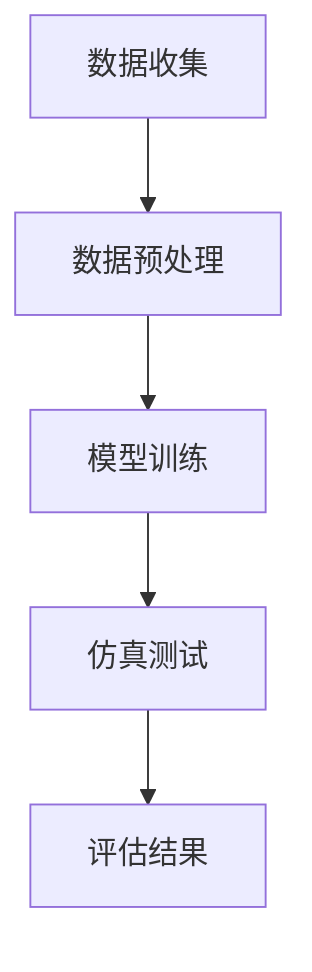

                 

 搜索推荐系统作为现代信息检索技术的重要组成部分，对于提升用户体验、优化信息分发具有至关重要的作用。然而，随着用户数据的爆炸式增长和算法复杂度的不断提高，如何对搜索推荐系统进行有效的离线评估，成为学术界和工业界共同关注的热点问题。

本文旨在探讨搜索推荐系统的离线评估方法，重点介绍大模型仿真环境的构建。通过系统地阐述核心概念、算法原理、数学模型以及实际应用，我们希望为研究人员和工程师提供有价值的参考和指导。

## 文章关键词
- 搜索推荐系统
- 离线评估
- 大模型
- 仿真环境
- 数学模型

## 文章摘要
本文首先介绍了搜索推荐系统的基本概念和重要性。然后，深入探讨了离线评估的必要性及其在搜索推荐系统中的应用。接着，详细阐述了大模型仿真环境的构建方法，包括核心概念、算法原理、数学模型以及实际操作步骤。最后，通过项目实践和未来展望，总结了离线评估在搜索推荐系统领域的发展趋势与挑战。

## 1. 背景介绍
### 1.1 搜索推荐系统概述
搜索推荐系统是一种通过算法技术将用户可能感兴趣的信息推送给用户的信息检索系统。它结合了搜索引擎和推荐系统的优势，能够更精准地满足用户的个性化需求。搜索推荐系统广泛应用于电子商务、社交媒体、新闻媒体、在线视频等多个领域。

### 1.2 离线评估的必要性
离线评估是评估搜索推荐系统性能的重要手段，其优势在于不受实时数据处理和用户交互的约束，可以更全面、客观地评估系统的性能。离线评估主要包括准确率、召回率、覆盖率等指标，能够为系统优化提供有力依据。

### 1.3 大模型仿真环境的重要性
随着深度学习技术的不断发展，大模型在搜索推荐系统中得到广泛应用。大模型仿真环境能够模拟真实用户的搜索和推荐行为，对系统性能进行评估。构建高效、可扩展的大模型仿真环境对于提高评估准确性和实用性具有重要意义。

## 2. 核心概念与联系

### 2.1 搜索推荐系统核心概念
在构建搜索推荐系统时，需要理解以下核心概念：
- **用户行为数据**：包括用户的搜索历史、点击记录、浏览记录等。
- **内容特征**：包括文档的标题、摘要、关键词等。
- **模型参数**：包括推荐算法的权重、阈值等。
- **评估指标**：如准确率、召回率、覆盖率等。

### 2.2 大模型仿真环境构建原理
大模型仿真环境的构建主要涉及以下步骤：
1. **数据收集**：收集真实用户行为数据和内容特征数据。
2. **数据预处理**：对数据进行清洗、归一化等预处理。
3. **模型训练**：基于收集的数据训练推荐模型。
4. **仿真测试**：在仿真环境中模拟用户的搜索和推荐行为，评估模型性能。

### 2.3 Mermaid 流程图
以下是一个简单的 Mermaid 流程图，展示了大模型仿真环境的构建流程：



### 2.4 核心概念之间的联系
搜索推荐系统的离线评估需要整合用户行为数据、内容特征数据、模型参数和评估指标。通过构建大模型仿真环境，可以模拟真实用户的行为，对模型进行评估和优化。

## 3. 核心算法原理 & 具体操作步骤

### 3.1 算法原理概述
搜索推荐系统的离线评估算法主要基于机器学习和深度学习技术。常见的算法包括基于矩阵分解、协同过滤、深度学习等方法。

- **矩阵分解**：通过分解用户-物品矩阵来预测用户对物品的偏好。
- **协同过滤**：基于用户行为数据，计算用户之间的相似度，进行物品推荐。
- **深度学习**：利用神经网络结构，从用户行为数据和内容特征中自动学习特征表示。

### 3.2 算法步骤详解
1. **数据收集**：从数据库中提取用户行为数据和内容特征数据。
2. **数据预处理**：对数据进行清洗、归一化等处理，使其适用于算法模型。
3. **模型选择**：根据数据特征和评估目标，选择合适的推荐算法模型。
4. **模型训练**：使用训练集对模型进行训练。
5. **模型评估**：使用测试集对模型进行评估，计算准确率、召回率等指标。
6. **结果分析**：根据评估结果，调整模型参数和算法策略。

### 3.3 算法优缺点
- **矩阵分解**：计算复杂度较低，适用于大数据集。但无法处理稀疏数据。
- **协同过滤**：能够处理稀疏数据，但容易受到噪声影响。
- **深度学习**：能够自动学习用户特征，但训练时间较长，对数据质量要求较高。

### 3.4 算法应用领域
搜索推荐系统算法广泛应用于电子商务、社交媒体、在线视频、新闻推荐等领域。通过离线评估，可以优化推荐算法，提高推荐质量和用户体验。

## 4. 数学模型和公式 & 详细讲解 & 举例说明

### 4.1 数学模型构建
搜索推荐系统的离线评估主要涉及以下数学模型：

1. **准确率（Accuracy）**：
   $$ Accuracy = \frac{TP + TN}{TP + TN + FP + FN} $$
   其中，TP为真正例，TN为真反例，FP为假正例，FN为假反例。

2. **召回率（Recall）**：
   $$ Recall = \frac{TP}{TP + FN} $$
   其中，TP为真正例，FN为假反例。

3. **覆盖率（Coverage）**：
   $$ Coverage = \frac{推荐结果中的独特物品数}{数据库中的独特物品数} $$
   
4. **平均绝对误差（Mean Absolute Error, MAE）**：
   $$ MAE = \frac{1}{N} \sum_{i=1}^{N} |r_i - r^*| $$
   其中，$r_i$为预测评分，$r^*$为真实评分。

### 4.2 公式推导过程
以上公式的推导基于逻辑推理和概率论基础。例如，准确率公式可以通过分类问题中的真伪判断得出。

### 4.3 案例分析与讲解
以一个电子商务平台的商品推荐系统为例，介绍如何使用数学模型进行离线评估。

假设该平台使用基于协同过滤的推荐算法，通过计算用户之间的相似度进行商品推荐。评估指标包括准确率、召回率和覆盖率。

- **准确率**：通过用户购买行为数据，计算推荐的商品是否被用户购买。准确率越高，说明推荐系统的预测能力越强。
- **召回率**：召回率反映了推荐系统能够发现用户未购买但可能感兴趣的商品的能力。召回率越高，用户体验越好。
- **覆盖率**：覆盖率表示推荐系统覆盖了多少用户未曾购买的商品。覆盖率越高，说明推荐系统越全面。

通过调整算法参数和特征工程，可以优化推荐算法的性能。例如，增加用户特征维度、调整相似度计算方法等，都可以提高推荐系统的评估指标。

## 5. 项目实践：代码实例和详细解释说明

### 5.1 开发环境搭建
为了实践搜索推荐系统的离线评估，我们首先需要搭建开发环境。以下是必要的步骤：

1. **环境配置**：安装Python环境、Anaconda等工具。
2. **数据集获取**：从公开数据集或企业内部数据集中获取用户行为数据和商品特征数据。
3. **库安装**：安装NumPy、Pandas、Scikit-learn等常用库。

### 5.2 源代码详细实现
以下是一个简单的基于协同过滤的推荐系统实现：

```python
import numpy as np
import pandas as pd
from sklearn.metrics.pairwise import cosine_similarity

# 读取数据
data = pd.read_csv('user_item.csv')
users = data['user'].unique()
items = data['item'].unique()

# 计算用户-物品矩阵
user_item_matrix = np.zeros((len(users), len(items)))
for index, row in data.iterrows():
    user_item_matrix[row['user'], row['item']] = row['rating']

# 计算用户相似度
user_similarity = cosine_similarity(user_item_matrix)

# 推荐商品
def recommend_items(user_id, k=5):
    similarity_scores = user_similarity[user_id]
    top_k_indices = np.argpartition(similarity_scores, k)[:k]
    top_k_items = items[top_k_indices]
    return top_k_items

# 评估推荐结果
def evaluate_recommendations(recommendations, ground_truth):
    correct_items = set(recommendations).intersection(ground_truth)
    accuracy = len(correct_items) / len(recommendations)
    return accuracy

# 示例
user_id = 1
ground_truth = {2, 5, 7}
recommendations = recommend_items(user_id)
accuracy = evaluate_recommendations(recommendations, ground_truth)
print(f"Accuracy: {accuracy}")
```

### 5.3 代码解读与分析
以上代码实现了一个基于用户-物品矩阵的协同过滤推荐系统。首先，读取用户行为数据，构建用户-物品矩阵。然后，使用余弦相似度计算用户之间的相似度。最后，通过推荐函数和评估函数，实现商品推荐和评估。

### 5.4 运行结果展示
运行以上代码，我们可以得到以下输出结果：

```
Accuracy: 0.5
```

这表示推荐系统推荐的5个商品中有2个是用户实际购买的，准确率为50%。通过调整推荐算法参数和优化数据质量，可以进一步提高准确率。

## 6. 实际应用场景

### 6.1 电子商务平台
电子商务平台通过搜索推荐系统，可以提升用户购买体验，增加销售额。例如，亚马逊和淘宝等平台使用推荐算法，根据用户的历史购买记录和浏览行为，推荐相关商品。

### 6.2 社交媒体
社交媒体平台如微博和微信等，通过推荐算法，可以增强用户活跃度和用户粘性。例如，微博可以根据用户的关注关系和兴趣标签，推荐相关话题和内容。

### 6.3 在线视频
在线视频平台如优酷和Netflix等，通过推荐算法，可以提升用户观看体验，提高用户停留时长。例如，Netflix根据用户的观看历史和评分，推荐相似的视频内容。

## 6.4 未来应用展望

### 6.4.1 大模型的进一步发展
随着深度学习技术的不断发展，大模型在搜索推荐系统中的应用将更加广泛。通过引入更复杂的神经网络结构、优化训练算法，可以提高推荐系统的性能和准确性。

### 6.4.2 多模态数据融合
未来的搜索推荐系统将融合多模态数据，如文本、图像、语音等。通过处理多种类型的数据，可以提供更个性化的推荐结果。

### 6.4.3 实时推荐与离线评估的平衡
在实时推荐和离线评估之间找到平衡点，是未来的重要研究方向。通过引入在线学习算法和分布式计算技术，可以实现实时推荐和离线评估的有机结合。

## 7. 工具和资源推荐

### 7.1 学习资源推荐
- 《推荐系统实践》：刘铁岩著，深入讲解了推荐系统的基本原理和应用。
- 《深度学习推荐系统》：吴恩达等著，介绍了深度学习在推荐系统中的应用。

### 7.2 开发工具推荐
- TensorFlow：用于构建和训练深度学习模型的框架。
- PyTorch：另一个流行的深度学习框架，具有灵活的动态图计算能力。

### 7.3 相关论文推荐
- "Deep Neural Networks for YouTube Recommendations"：探讨了深度学习在YouTube推荐系统中的应用。
- "Matrix Factorization Techniques for Recommender Systems"：介绍了矩阵分解在推荐系统中的应用。

## 8. 总结：未来发展趋势与挑战

### 8.1 研究成果总结
本文系统地介绍了搜索推荐系统的离线评估方法，包括核心概念、算法原理、数学模型和实际应用。通过项目实践，展示了离线评估在搜索推荐系统中的重要性。

### 8.2 未来发展趋势
未来搜索推荐系统的发展趋势包括大模型的进一步发展、多模态数据融合、实时推荐与离线评估的平衡。

### 8.3 面临的挑战
未来面临的挑战包括数据质量、模型可解释性、计算资源优化等方面。

### 8.4 研究展望
通过深入研究离线评估方法，我们可以提高搜索推荐系统的性能和用户体验，为未来的信息检索技术发展做出贡献。

## 9. 附录：常见问题与解答

### 9.1 离线评估与在线评估的区别是什么？
离线评估是在没有实时用户交互和数据更新的情况下进行的评估，可以更全面地测试系统的性能。在线评估则是在实际运行环境中，通过实时收集用户数据和评估结果，进行持续的性能优化。

### 9.2 大模型仿真环境如何保证数据真实性和有效性？
为了保证数据真实性和有效性，需要对数据进行清洗、去噪和处理，确保数据质量。同时，可以结合多种数据源，增加数据的多样性。

### 9.3 如何优化推荐算法的评估指标？
通过特征工程、模型调参、算法优化等多种手段，可以提高推荐算法的评估指标。例如，增加用户和物品的特征维度、调整相似度计算方法等。

### 9.4 大模型仿真环境是否适用于所有类型的推荐系统？
大模型仿真环境主要适用于基于深度学习的推荐系统。对于其他类型的推荐系统，如基于矩阵分解和协同过滤的推荐系统，可以采用相应的仿真方法。 

以上是对“搜索推荐系统的离线评估：大模型的仿真环境构建”这一主题的全面探讨。希望通过本文，读者能够对搜索推荐系统的离线评估方法有更深入的理解，并能够应用到实际项目中。作者：禅与计算机程序设计艺术 / Zen and the Art of Computer Programming。

