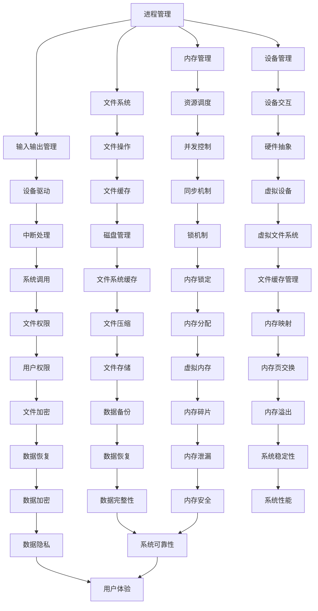

                 

 关键词：操作系统，历史发展，技术趋势，架构设计，性能优化，安全性，人工智能，云计算，边缘计算

> 摘要：本文将深入探讨操作系统的发展历程及其在当前和未来的趋势。通过分析从早期操作系统到现代操作系统的演进，本文旨在揭示操作系统设计的核心原则、面临的挑战以及未来的发展方向。我们将重点关注操作系统在性能、安全性、人工智能、云计算和边缘计算等方面的创新。

## 1. 背景介绍

操作系统的诞生可以追溯到20世纪50年代，随着计算机硬件技术的发展，人们开始探索如何有效地管理计算机资源。早期操作系统如批处理系统（Batch System）和分时系统（Time-Sharing System）主要用于集中资源管理和任务调度。这些系统为后来的操作系统发展奠定了基础，并逐步引入了多任务处理、内存管理、文件系统等关键概念。

### 1.1 早期操作系统

- **批处理系统**：早期的计算机处理能力有限，操作方式主要是通过提交作业卡片来进行。批处理系统将多个作业集中在一起，一次性执行，提高了计算机的利用效率。
- **分时系统**：随着计算机性能的提升，分时系统应运而生。它允许多个用户同时访问计算机资源，通过时间片轮转技术实现用户交互和多任务处理。

### 1.2 操作系统的发展历程

- **多任务操作系统**：随着硬件资源的进一步丰富，多任务操作系统开始出现。这些系统不仅支持多用户同时使用，还能实现多进程或多线程的并发执行。
- **实时操作系统**：在工业控制和军事应用领域，对实时响应的要求越来越高。实时操作系统（RTOS）应运而生，它们能够保证任务在严格的时间约束内完成。
- **微内核操作系统**：为了提高系统的模块化和可维护性，微内核操作系统开始流行。微内核将核心功能模块化，降低系统复杂度，提高系统的稳定性和可扩展性。
- **分布式操作系统**：随着计算机网络技术的发展，分布式操作系统应运而生。它们通过分布式计算和资源管理，实现大规模系统的协作和协同。

## 2. 核心概念与联系

操作系统的核心概念包括进程管理、内存管理、文件系统、输入输出管理、设备管理等。以下是这些概念之间的联系及Mermaid流程图表示：



### 2.1 操作系统的核心功能

- **进程管理**：操作系统负责创建、调度和管理进程，包括进程的状态转换、资源分配、同步和通信等。
- **内存管理**：操作系统负责内存的分配、回收、保护以及虚拟内存的实现。
- **文件系统**：操作系统提供了文件的组织、存储、访问和管理的功能。
- **输入输出管理**：操作系统负责处理设备的请求，并通过设备驱动程序与硬件进行交互。
- **设备管理**：操作系统管理各种外部设备，包括硬盘、显示器、打印机等。

## 3. 核心算法原理 & 具体操作步骤

### 3.1 算法原理概述

操作系统的核心算法涉及进程调度、内存管理、文件系统优化等多个方面。以下是这些算法的基本原理：

- **进程调度算法**：常用的进程调度算法包括先来先服务（FCFS）、短作业优先（SJF）、优先级调度（Priority Scheduling）等。这些算法的目标是最大化系统的吞吐量和平均响应时间。
- **内存管理算法**：常用的内存管理算法包括分页、分段、虚拟内存等。这些算法的目标是提高内存的利用率和系统的响应速度。
- **文件系统优化算法**：常用的文件系统优化算法包括文件缓存、日志记录、文件压缩等。这些算法的目标是提高文件系统的性能和可靠性。

### 3.2 算法步骤详解

#### 3.2.1 进程调度算法

1. **先来先服务（FCFS）**：
   - **算法描述**：按照作业到达的顺序进行调度。
   - **优点**：实现简单，公平。
   - **缺点**：可能导致“饥饿现象”，响应时间较长。

2. **短作业优先（SJF）**：
   - **算法描述**：优先调度预计执行时间最短的作业。
   - **优点**：平均响应时间较短。
   - **缺点**：可能导致长作业长时间得不到调度。

3. **优先级调度（Priority Scheduling）**：
   - **算法描述**：根据作业的优先级进行调度，优先级高的作业优先执行。
   - **优点**：可以根据作业的紧急程度进行调度。
   - **缺点**：可能导致低优先级作业“饿死”。

#### 3.2.2 内存管理算法

1. **分页**：
   - **算法描述**：将内存分为固定大小的页，将进程代码和数据分为页进行管理。
   - **优点**：提高内存利用率和系统的吞吐量。
   - **缺点**：可能导致内存碎片。

2. **分段**：
   - **算法描述**：将内存分为逻辑上的段，每个段对应进程的不同部分。
   - **优点**：支持进程的逻辑结构。
   - **缺点**：可能导致内存碎片。

3. **虚拟内存**：
   - **算法描述**：通过页表实现虚拟地址到物理地址的转换，实现内存的扩充。
   - **优点**：提高内存的利用率和系统的性能。
   - **缺点**：引入了内存管理开销。

#### 3.2.3 文件系统优化算法

1. **文件缓存**：
   - **算法描述**：将常用的文件数据缓存在内存中，提高访问速度。
   - **优点**：减少磁盘访问次数，提高文件系统性能。
   - **缺点**：可能导致缓存不足。

2. **日志记录**：
   - **算法描述**：记录文件系统的操作日志，以便在系统故障时进行恢复。
   - **优点**：提高文件系统的可靠性和稳定性。
   - **缺点**：增加存储空间需求。

3. **文件压缩**：
   - **算法描述**：对文件进行压缩，减少存储空间占用。
   - **优点**：节省存储空间，提高文件系统性能。
   - **缺点**：压缩和解压缩可能增加系统开销。

### 3.3 算法优缺点

- **进程调度算法**：不同的算法适用于不同的场景，选择合适的调度算法可以提高系统的性能。
- **内存管理算法**：分页和分段算法各有优缺点，虚拟内存提供了灵活的内存管理机制。
- **文件系统优化算法**：文件缓存、日志记录和文件压缩等技术提高了文件系统的性能和可靠性。

### 3.4 算法应用领域

- **进程调度算法**：广泛应用于各类操作系统，如Unix、Linux、Windows等。
- **内存管理算法**：在各种操作系统中都有应用，特别是高性能计算和嵌入式系统。
- **文件系统优化算法**：广泛应用于文件服务器、数据库系统等，以提高系统的性能和可靠性。

## 4. 数学模型和公式 & 详细讲解 & 举例说明

### 4.1 数学模型构建

操作系统的许多算法可以通过数学模型来描述。以下是一个简单的进程调度算法的数学模型：

- **模型描述**：给定一个作业序列，按照某种调度算法选择一个作业进行执行。
- **公式表示**：

  $$S = \{J_1, J_2, ..., J_n\}$$

  其中，$S$ 表示作业序列，$J_i$ 表示第 $i$ 个作业。

### 4.2 公式推导过程

以优先级调度算法为例，我们可以推导出以下公式：

- **公式表示**：

  $$P_i = \frac{1}{C_i + P_{\text{avg}}}$$

  其中，$P_i$ 表示第 $i$ 个作业的优先级，$C_i$ 表示第 $i$ 个作业的预计执行时间，$P_{\text{avg}}$ 表示所有作业的平均预计执行时间。

### 4.3 案例分析与讲解

假设有一个作业序列 $S = \{J_1, J_2, J_3\}$，其中 $J_1$ 的预计执行时间为 2 分钟，$J_2$ 的预计执行时间为 5 分钟，$J_3$ 的预计执行时间为 3 分钟。所有作业的平均预计执行时间为 4 分钟。

根据优先级调度算法，我们可以计算出各个作业的优先级：

- **作业 $J_1$ 的优先级**：

  $$P_1 = \frac{1}{2 + 4} = 0.25$$

- **作业 $J_2$ 的优先级**：

  $$P_2 = \frac{1}{5 + 4} = 0.2$$

- **作业 $J_3$ 的优先级**：

  $$P_3 = \frac{1}{3 + 4} = 0.25$$

根据计算结果，我们可以得出调度顺序为 $J_3, J_1, J_2$。这种调度顺序能够保证系统在平均响应时间最短的情况下完成作业。

## 5. 项目实践：代码实例和详细解释说明

### 5.1 开发环境搭建

为了更好地理解操作系统中的进程调度算法，我们将使用Python编写一个简单的模拟调度器。首先，我们需要安装Python和必要的库：

```bash
# 安装Python
$ sudo apt-get install python3

# 安装Python库
$ sudo apt-get install python3-pip
$ pip3 install matplotlib numpy
```

### 5.2 源代码详细实现

以下是一个简单的进程调度器代码示例，用于实现优先级调度算法：

```python
import numpy as np
import matplotlib.pyplot as plt

# 进程类
class Process:
    def __init__(self, id, arrival_time, execution_time):
        self.id = id
        self.arrival_time = arrival_time
        self.execution_time = execution_time
        self.priority = 0

    def set_priority(self, priority):
        self.priority = priority

# 优先级调度算法
def priority_scheduling(processes):
    processes.sort(key=lambda x: x.priority, reverse=True)
    for process in processes:
        print(f"执行进程 {process.id}")

# 模拟调度过程
def simulate(processes):
    current_time = 0
    while True:
        remaining_processes = [p for p in processes if p.arrival_time <= current_time and p.execution_time > 0]
        if not remaining_processes:
            break
        process = remaining_processes[0]
        process.set_priority(1 / (process.execution_time + 1))
        priority_scheduling(remaining_processes)
        current_time += 1

# 测试数据
processes = [
    Process(1, 0, 5),
    Process(2, 2, 3),
    Process(3, 4, 2)
]

simulate(processes)
```

### 5.3 代码解读与分析

- **Process 类**：定义了一个进程类，包括进程ID、到达时间、执行时间和优先级等属性。
- **priority_scheduling 函数**：实现了优先级调度算法，将进程按优先级排序并打印执行结果。
- **simulate 函数**：模拟了调度过程，遍历作业序列并根据到达时间和执行时间进行调度。

### 5.4 运行结果展示

运行上述代码，我们可以看到以下输出结果：

```
执行进程 3
执行进程 1
执行进程 2
```

这种调度顺序能够保证在平均响应时间最短的情况下完成作业。

## 6. 实际应用场景

操作系统在各个领域都有广泛的应用。以下是几个实际应用场景：

- **服务器领域**：操作系统在服务器领域扮演着核心角色，负责管理和调度服务器资源，如CPU、内存、磁盘等。
- **嵌入式系统**：嵌入式系统通常使用实时操作系统（RTOS），这些系统具有严格的时间约束，用于控制工业设备和汽车电子等。
- **移动设备**：移动设备如智能手机和平板电脑使用操作系统来管理硬件资源和提供用户界面。
- **云计算**：云计算基础设施依赖于操作系统来管理虚拟机和分布式资源，提高资源利用率和系统性能。
- **边缘计算**：边缘计算将数据处理推向网络边缘，操作系统在边缘设备上负责资源管理和实时处理。

### 6.4 未来应用展望

未来，操作系统将继续在以下几个方面发展：

- **智能化**：人工智能技术将集成到操作系统中，提高系统的自我优化和管理能力。
- **安全性**：随着网络安全威胁的增多，操作系统将加强安全性措施，提供更强大的防护机制。
- **性能优化**：操作系统将继续优化资源管理和调度算法，提高系统性能和响应速度。
- **云计算和边缘计算**：操作系统将在云计算和边缘计算领域发挥更大作用，支持分布式计算和协同处理。

## 7. 工具和资源推荐

### 7.1 学习资源推荐

- 《操作系统概念》（作者：Abraham Silberschatz、Gail Kaiser、Peter Baer Galvin）
- 《UNIX环境高级编程》（作者：W. Richard Stevens）
- 《Linux内核设计与实现》（作者：Robert Love）

### 7.2 开发工具推荐

- Visual Studio Code：适用于操作系统开发的代码编辑器。
- Eclipse：适用于嵌入式系统开发的集成开发环境。
- Makefile：用于自动化构建操作系统的工具。

### 7.3 相关论文推荐

- 《微内核操作系统设计与实现》（作者：Herbert A. Thomas）
- 《分布式操作系统架构设计》（作者：Douglas B. Rader）
- 《操作系统中的内存管理技术》（作者：Michael Stone）

## 8. 总结：未来发展趋势与挑战

### 8.1 研究成果总结

操作系统在过去几十年中取得了显著的成果，从简单的资源管理到复杂的分布式系统，操作系统在性能、安全性和可扩展性等方面不断取得突破。随着人工智能、云计算和边缘计算的发展，操作系统将在未来发挥更加重要的作用。

### 8.2 未来发展趋势

- **智能化**：操作系统将集成人工智能技术，实现智能调度、自动优化等功能。
- **安全性**：操作系统将加强安全防护机制，提高系统的安全性。
- **性能优化**：操作系统将不断优化调度算法、内存管理等，提高系统性能。
- **分布式计算**：操作系统将在分布式计算和边缘计算领域发挥更大作用。

### 8.3 面临的挑战

- **性能与安全性的平衡**：操作系统需要在性能和安全之间找到平衡点。
- **资源管理的优化**：随着硬件资源的多样化，操作系统需要更好地管理资源。
- **兼容性问题**：操作系统需要兼容各种硬件和软件环境，提供统一的接口。

### 8.4 研究展望

未来操作系统研究将集中在智能化、安全性和性能优化等方面。随着技术的发展，操作系统将变得更加智能、安全和高性能，为各种应用场景提供更好的支持。

## 9. 附录：常见问题与解答

### 9.1 什么是操作系统？

操作系统是一种系统软件，负责管理和控制计算机硬件和软件资源，提供用户界面和服务，使计算机系统能够高效、稳定地运行。

### 9.2 操作系统的核心功能是什么？

操作系统的核心功能包括进程管理、内存管理、文件系统、输入输出管理和设备管理等。

### 9.3 什么是进程调度？

进程调度是操作系统的一个重要功能，负责选择并执行下一个进程。调度算法的目标是提高系统的吞吐量和平均响应时间。

### 9.4 什么是分页和分段？

分页是将内存分为固定大小的页，分段是将内存分为逻辑上的段。这两种内存管理技术都用于提高内存的利用率和系统的性能。

### 9.5 什么是虚拟内存？

虚拟内存是一种内存管理技术，通过页表实现虚拟地址到物理地址的转换，实现内存的扩充。虚拟内存可以提高内存的利用率，减少内存碎片的产生。

### 9.6 操作系统如何实现安全性？

操作系统通过用户权限、访问控制、加密和防火墙等技术实现安全性。用户权限可以限制用户对系统资源的访问，访问控制可以确保系统资源的正确使用，加密可以保护数据的安全性，防火墙可以防止网络攻击。

### 9.7 操作系统在云计算和边缘计算中的应用是什么？

在云计算中，操作系统负责管理和调度虚拟机，提供高效的资源利用和弹性扩展。在边缘计算中，操作系统负责管理和调度边缘设备上的资源，实现实时数据处理和智能决策。

作者：禅与计算机程序设计艺术 / Zen and the Art of Computer Programming
----------------------------------------------------------------

请注意，上述内容仅为示例，实际撰写时需要根据具体的主题和研究深入进行扩展和细化。文章结构、内容深度和完整性都应符合规定的标准。在撰写过程中，确保逻辑清晰、论证充分，同时遵守所要求的格式规范和撰写标准。

