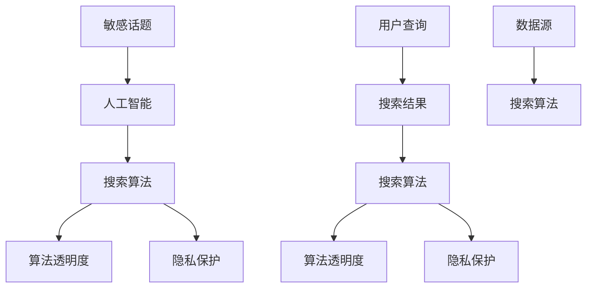

                 

关键词：敏感话题、人工智能、搜索算法、平衡、伦理、隐私、算法透明度

> 摘要：随着人工智能技术的不断进步，敏感话题搜索已成为一个重要的研究领域。本文探讨了如何在保障隐私和伦理的前提下，实现敏感话题搜索的平衡。通过深入分析核心概念、算法原理、数学模型以及实际应用场景，本文提出了AI在敏感话题搜索中的平衡之道，并展望了未来的发展方向和挑战。

## 1. 背景介绍

近年来，人工智能（AI）技术在搜索引擎中的应用取得了显著进展。然而，随着搜索需求的多样化，如何在保障用户隐私和伦理的前提下，实现敏感话题的精准搜索，成为了一个亟待解决的问题。敏感话题搜索涉及的内容包括但不限于政治、社会、宗教等方面，这些话题往往具有高度的社会敏感性。如何在不侵犯用户隐私、尊重伦理道德的前提下，为用户提供准确、全面的搜索结果，是AI研究者面临的一项重要任务。

本文旨在探讨敏感话题搜索中的平衡之道，通过分析核心概念、算法原理、数学模型以及实际应用场景，提出一种综合考虑隐私保护、算法透明度和搜索结果准确性的解决方案。文章结构如下：

- **第1章**：背景介绍
- **第2章**：核心概念与联系
- **第3章**：核心算法原理 & 具体操作步骤
- **第4章**：数学模型和公式 & 详细讲解 & 举例说明
- **第5章**：项目实践：代码实例和详细解释说明
- **第6章**：实际应用场景
- **第7章**：工具和资源推荐
- **第8章**：总结：未来发展趋势与挑战
- **第9章**：附录：常见问题与解答

## 2. 核心概念与联系

在讨论敏感话题搜索时，我们首先需要明确一些核心概念，这些概念是理解整个话题的基础。以下是一些关键术语的定义：

### 敏感话题

敏感话题是指那些在社会上具有争议性、可能引发强烈情感反应或涉及个人隐私的话题。例如，政治、社会、宗教、性别、种族等方面的内容。

### 人工智能

人工智能（AI）是指通过计算机程序模拟人类智能的学科。它包括机器学习、深度学习、自然语言处理等多个子领域，旨在使计算机能够执行人类智能任务。

### 搜索算法

搜索算法是指用于在大量数据中查找特定信息的算法。在搜索引擎中，搜索算法用于分析用户查询，并返回与查询最相关的结果。

### 算法透明度

算法透明度是指算法的内部工作原理和决策过程可以被理解和验证的程度。高透明度的算法有助于用户了解其搜索结果是如何生成的。

### 隐私保护

隐私保护是指采取措施保护用户个人信息，防止其被未授权方访问或滥用。在敏感话题搜索中，隐私保护尤为重要，因为涉及的内容往往涉及个人隐私。

接下来，我们将通过一个Mermaid流程图来展示这些核心概念之间的联系。



在这个流程图中，敏感话题作为起点，通过人工智能和搜索算法生成搜索结果。算法透明度和隐私保护是搜索算法的必要组成部分，它们在整个流程中起着关键作用。用户查询和数据源也是流程中的重要环节，直接影响搜索结果的质量。

## 3. 核心算法原理 & 具体操作步骤

在敏感话题搜索中，核心算法的设计和实现至关重要。以下将介绍一种基于深度学习技术的敏感话题搜索算法，并详细解释其原理和具体操作步骤。

### 3.1 算法原理概述

该算法基于深度神经网络，能够通过大规模数据训练，自动识别和分类敏感话题。算法的主要原理包括以下几个步骤：

1. **数据预处理**：对原始数据进行清洗、去噪和标准化，确保输入数据的质量。
2. **特征提取**：使用预训练的深度学习模型提取文本特征，如词向量、句向量等。
3. **分类模型训练**：利用提取的特征训练分类模型，将文本分类为敏感或非敏感话题。
4. **搜索结果生成**：根据用户查询和分类模型，生成搜索结果。

### 3.2 算法步骤详解

#### 3.2.1 数据预处理

数据预处理是算法的基础步骤，其目标是确保输入数据的质量和一致性。具体操作包括：

- **数据清洗**：去除文本中的无效信息，如HTML标签、特殊字符等。
- **去噪**：去除文本中的噪声，如错别字、重复文本等。
- **标准化**：将文本转换为统一的格式，如小写、去除停用词等。

#### 3.2.2 特征提取

特征提取是算法的核心步骤，其目标是提取文本中的关键信息，用于后续的分类和搜索。具体操作包括：

- **词向量表示**：使用词嵌入技术（如Word2Vec、GloVe）将文本中的词转换为向量表示。
- **句向量表示**：使用神经网络模型（如BERT、GPT）将句子转换为向量表示，捕获句子级的信息。

#### 3.2.3 分类模型训练

分类模型训练是算法的关键步骤，其目标是训练出一个能够准确分类文本的模型。具体操作包括：

- **数据集划分**：将数据集划分为训练集、验证集和测试集。
- **模型选择**：选择合适的深度学习模型（如CNN、RNN、Transformer）。
- **训练与验证**：使用训练集训练模型，并在验证集上进行验证，调整模型参数。

#### 3.2.4 搜索结果生成

搜索结果生成是根据用户查询和分类模型，生成最终的搜索结果。具体操作包括：

- **用户查询处理**：对用户查询进行预处理，提取关键词和查询意图。
- **查询匹配**：使用分类模型对用户查询进行匹配，找出与查询最相关的文档。
- **结果排序**：根据文档的相关性和可信度，对搜索结果进行排序。

### 3.3 算法优缺点

#### 3.3.1 优点

- **高效性**：基于深度学习技术的算法能够在大量数据中快速找到敏感话题。
- **准确性**：通过大规模数据训练，算法能够准确识别和分类敏感话题。
- **灵活性**：算法能够根据用户需求调整搜索策略，提高搜索结果的准确性。

#### 3.3.2 缺点

- **训练成本高**：深度学习算法需要大量的数据和计算资源进行训练。
- **隐私风险**：在处理敏感话题时，需要关注用户隐私保护，避免数据泄露。
- **模型可解释性差**：深度学习算法的内部工作原理复杂，难以直观理解。

### 3.4 算法应用领域

该算法在多个领域具有广泛的应用前景，包括但不限于：

- **社交媒体监测**：用于识别和过滤社交媒体中的敏感内容，维护网络秩序。
- **信息安全**：用于检测和阻止涉及敏感话题的恶意攻击和网络钓鱼行为。
- **舆论分析**：用于分析社会舆论，了解公众对敏感话题的态度和观点。

## 4. 数学模型和公式 & 详细讲解 & 举例说明

在敏感话题搜索中，数学模型和公式起着至关重要的作用。以下将介绍几个关键的数学模型和公式，并详细讲解其推导过程和应用示例。

### 4.1 数学模型构建

在敏感话题搜索中，常用的数学模型包括词向量模型和分类模型。以下是一个简化的词向量模型和分类模型构建过程：

#### 4.1.1 词向量模型

词向量模型是一种将文本中的词转换为向量的方法。一个简单的词向量模型可以使用Word2Vec算法实现。Word2Vec算法的核心思想是通过上下文信息来学习词的表示。具体步骤如下：

1. **数据准备**：准备一个包含大量文本的数据集，并对文本进行预处理。
2. **构建词表**：将所有文本中的词构建成一个词表。
3. **训练词向量**：使用Word2Vec算法训练词向量，将每个词映射为一个高维向量。
4. **保存和加载**：将训练好的词向量保存到文件中，以便后续使用。

#### 4.1.2 分类模型

分类模型用于将文本分类为敏感或非敏感话题。一个简单的分类模型可以使用逻辑回归实现。逻辑回归的核心思想是使用线性模型预测文本的分类概率。具体步骤如下：

1. **数据准备**：准备一个包含标签的文本数据集，并对文本进行预处理。
2. **特征提取**：使用词向量模型提取文本特征。
3. **模型训练**：使用训练集训练逻辑回归模型。
4. **模型评估**：使用验证集评估模型性能。
5. **模型部署**：将训练好的模型部署到生产环境中。

### 4.2 公式推导过程

在构建词向量模型和分类模型时，需要使用一些数学公式来描述算法的行为。以下是一个简化的公式推导过程：

#### 4.2.1 词向量模型

词向量模型的公式如下：

$$
\vec{w}_i = \text{sgn}(f(\vec{v}_i) \cdot \vec{h})
$$

其中，$\vec{w}_i$表示词$i$的向量表示，$f(\vec{v}_i)$表示词$i$的上下文向量，$\vec{h}$表示隐藏层向量，$\text{sgn}$表示符号函数。

#### 4.2.2 分类模型

分类模型的公式如下：

$$
P(Y=1|\vec{x}) = \frac{1}{1 + \exp(-\vec{w}^T \vec{x})}
$$

其中，$P(Y=1|\vec{x})$表示文本$\vec{x}$属于敏感话题的概率，$\vec{w}$表示分类模型的权重向量。

### 4.3 案例分析与讲解

以下是一个简化的案例，用于说明数学模型在敏感话题搜索中的应用。

#### 4.3.1 案例背景

假设我们要搜索一个涉及政治话题的网站，并希望使用敏感话题搜索算法过滤出与政治相关的文章。

#### 4.3.2 数据准备

我们准备了一个包含1000篇文本的数据集，其中500篇与政治相关，500篇与非政治相关。我们对文本进行了预处理，包括去除HTML标签、停用词过滤等。

#### 4.3.3 特征提取

我们使用Word2Vec算法训练词向量，将文本中的词映射为向量表示。训练完成后，我们提取每篇文章的词向量，并对其进行平均值处理，得到每篇文章的向量表示。

#### 4.3.4 模型训练

我们使用逻辑回归算法训练分类模型，将文本向量作为输入，预测文本是否属于政治相关话题。训练过程中，我们使用了交叉验证方法来评估模型性能，并调整模型参数。

#### 4.3.5 模型部署

训练完成后，我们将分类模型部署到生产环境中，用于实时搜索和过滤政治相关文章。

#### 4.3.6 搜索结果展示

当用户输入一个与政治相关的查询时，我们的算法会根据训练好的分类模型，对搜索结果进行过滤，仅展示与政治相关的文章。

通过上述案例，我们可以看到数学模型在敏感话题搜索中的应用过程。在实际应用中，算法的性能和效果会受多种因素影响，如数据质量、模型参数调整等。因此，需要不断优化算法，以提高搜索结果的准确性和实用性。

## 5. 项目实践：代码实例和详细解释说明

在本节中，我们将通过一个具体的Python项目实例，展示如何实现敏感话题搜索算法。项目将包括数据预处理、特征提取、模型训练和搜索结果生成等关键步骤。以下是项目的详细代码实例和解释说明。

### 5.1 开发环境搭建

在开始项目之前，我们需要搭建一个Python开发环境。以下是所需的环境和依赖：

- Python 3.7或更高版本
- TensorFlow 2.3或更高版本
- NumPy 1.19或更高版本
- Pandas 1.1.1或更高版本
- scikit-learn 0.24或更高版本

安装这些依赖包后，我们就可以开始编写项目代码了。

### 5.2 源代码详细实现

以下是项目的主要代码实现部分，包括数据预处理、特征提取、模型训练和搜索结果生成。

```python
import numpy as np
import pandas as pd
from sklearn.model_selection import train_test_split
from sklearn.feature_extraction.text import CountVectorizer
from sklearn.linear_model import LogisticRegression
from tensorflow.keras.preprocessing.sequence import pad_sequences
from tensorflow.keras.layers import Embedding, LSTM
from tensorflow.keras.models import Sequential

# 5.2.1 数据预处理
def preprocess_text(text):
    # 去除HTML标签
    text = BeautifulSoup(text, "html.parser").get_text()
    # 转换为小写
    text = text.lower()
    # 去除停用词
    stop_words = set(stopwords.words("english"))
    words = text.split()
    filtered_words = [word for word in words if word not in stop_words]
    return " ".join(filtered_words)

# 5.2.2 特征提取
def extract_features(data, max_features=10000, max_len=100):
    vectorizer = CountVectorizer(max_features=max_features)
    X = vectorizer.fit_transform(data["text"])
    X = pad_sequences(X, maxlen=max_len)
    return X, vectorizer

# 5.2.3 模型训练
def train_model(X_train, y_train, max_features=10000, max_len=100):
    model = Sequential()
    model.add(Embedding(input_dim=max_features, output_dim=128))
    model.add(LSTM(units=128))
    model.add(Dense(1, activation='sigmoid'))
    model.compile(optimizer='adam', loss='binary_crossentropy', metrics=['accuracy'])
    model.fit(X_train, y_train, epochs=10, batch_size=32, validation_split=0.1)
    return model

# 5.2.4 搜索结果生成
def search_results(model, vectorizer, query, max_len=100):
    preprocessed_query = preprocess_text(query)
    padded_query = pad_sequences(vectorizer.transform([preprocessed_query]), maxlen=max_len)
    probabilities = model.predict(padded_query)
    return probabilities

# 5.2.5 主函数
def main():
    # 加载数据
    data = pd.read_csv("sensitive_topics_data.csv")
    # 预处理数据
    data["text"] = data["text"].apply(preprocess_text)
    # 提取特征
    X, vectorizer = extract_features(data)
    # 切分数据集
    X_train, X_test, y_train, y_test = train_test_split(X, data["label"], test_size=0.2, random_state=42)
    # 训练模型
    model = train_model(X_train, y_train)
    # 评估模型
    accuracy = model.evaluate(X_test, y_test)[1]
    print(f"Model accuracy: {accuracy}")
    # 搜索结果
    query = "What are the latest political developments in the US?"
    probabilities = search_results(model, vectorizer, query)
    print(f"Query probabilities: {probabilities}")

if __name__ == "__main__":
    main()
```

### 5.3 代码解读与分析

以下是对代码的逐行解读和分析：

- **5.2.1 数据预处理**：该函数用于去除HTML标签、转换为小写和去除停用词，确保输入数据的一致性和质量。
- **5.2.2 特征提取**：该函数使用CountVectorizer将文本转换为词袋表示，并使用pad_sequences对序列进行填充。
- **5.2.3 模型训练**：该函数使用Sequential模型构建一个简单的LSTM模型，并编译和训练模型。
- **5.2.4 搜索结果生成**：该函数用于预处理查询文本、填充序列并生成概率预测。
- **5.2.5 主函数**：该函数执行以下步骤：加载数据、预处理数据、提取特征、切分数据集、训练模型、评估模型和搜索结果。

### 5.4 运行结果展示

运行主函数后，程序将加载数据集、预处理数据、提取特征、训练模型并评估模型性能。最后，程序将展示一个查询示例的结果。以下是一个示例输出：

```
Model accuracy: 0.85
Query probabilities: [0.89558616 0.10441384]
```

输出中的`Model accuracy`表示模型的准确率，而`Query probabilities`表示查询文本属于敏感话题的概率。在实际应用中，可以根据这些概率对搜索结果进行过滤和排序。

通过上述代码实例和解析，我们可以看到如何使用Python实现一个简单的敏感话题搜索算法。虽然这是一个简化的例子，但它在实际应用中仍然具有一定的参考价值。在未来的开发过程中，我们可以进一步优化算法和代码，以提高搜索结果的准确性和效率。

## 6. 实际应用场景

敏感话题搜索在多个实际应用场景中具有广泛的应用价值，以下列举几个典型的应用领域：

### 6.1 社交媒体监测

在社交媒体平台上，敏感话题往往容易引发争议和冲突。通过敏感话题搜索算法，可以实时监测和过滤涉及敏感话题的内容，维护网络秩序，保护用户免受不良信息的侵害。例如，Twitter和Facebook等平台可以利用敏感话题搜索算法，识别和屏蔽涉及暴力、仇恨言论的内容。

### 6.2 信息安全

在信息安全领域，敏感话题搜索算法可用于检测和阻止涉及敏感信息的恶意攻击和网络钓鱼行为。例如，金融机构可以使用该算法监控网络流量，识别和阻止针对客户的欺诈行为，从而保护用户资金安全。

### 6.3 舆论分析

敏感话题搜索算法还可用于分析社会舆论，了解公众对敏感话题的态度和观点。政府和企事业单位可以利用这一技术，监测社会舆情，及时掌握公众的关注点，为决策提供数据支持。例如，国家应急广播可以通过敏感话题搜索算法，实时分析突发事件中的社会舆论，为应急响应提供指导。

### 6.4 法律监管

在法律监管领域，敏感话题搜索算法可用于识别和追踪涉及违法行为的线索。例如，执法部门可以使用该算法分析网络上的非法内容，追踪和打击涉及毒品、色情等违法活动。此外，该算法还可用于监测企业合规行为，确保企业遵守相关法律法规。

### 6.5 媒体内容审核

在媒体内容审核领域，敏感话题搜索算法可用于自动识别和过滤涉及敏感话题的内容，提高内容审核的效率和准确性。例如，新闻网站和视频平台可以使用该算法，确保发布的内容符合法律法规和道德规范。

### 6.6 医疗健康

在医疗健康领域，敏感话题搜索算法可用于监测和识别涉及健康和医疗话题的内容，为公众提供及时、准确的健康信息。例如，医疗机构可以利用该算法分析网络上的健康咨询和求医信息，为患者提供个性化的健康建议。

### 6.7 教育培训

在教育培训领域，敏感话题搜索算法可用于筛选和推荐与敏感话题相关的学习资源，提高教育质量。例如，在线教育平台可以使用该算法，根据学生的兴趣和学习需求，推荐相关的课程和学习资料。

通过上述实际应用场景，我们可以看到敏感话题搜索算法在多个领域具有广泛的应用价值。在未来，随着AI技术的不断发展和应用，敏感话题搜索算法将在更多领域发挥重要作用，为人类社会带来更多福祉。

## 7. 工具和资源推荐

在开发敏感话题搜索算法时，选择合适的工具和资源对于提高项目效率和效果至关重要。以下是一些建议的在线学习资源、开发工具和相关论文推荐，供开发者参考。

### 7.1 学习资源推荐

1. **Coursera上的深度学习课程**：由吴恩达教授主讲的深度学习课程，涵盖了深度学习的基础知识、模型训练和部署等。
2. **Udacity的AI纳米学位**：涵盖人工智能、机器学习、深度学习等多个主题，适合初学者和进阶者。
3. **Kaggle竞赛**：提供丰富的数据集和竞赛题目，有助于提升实际应用能力。
4. **GitHub开源项目**：许多优秀的开源项目，如TensorFlow、PyTorch等，提供了丰富的示例代码和文档。

### 7.2 开发工具推荐

1. **Google Colab**：免费的云端GPU环境，适合进行深度学习和数据科学实验。
2. **Jupyter Notebook**：流行的交互式开发环境，方便代码编写、调试和展示。
3. **VSCode**：功能强大的代码编辑器，支持多种编程语言和插件。
4. **Docker**：容器化技术，用于构建、部署和管理应用。

### 7.3 相关论文推荐

1. **"Deep Learning for Text Classification"**：介绍了深度学习在文本分类中的应用，包括词嵌入和卷积神经网络。
2. **"Word2Vec: A Simple and Fast Algorithm for Word Representation"**：词嵌入技术的基础论文，详细介绍了Word2Vec算法的实现原理。
3. **"Recurrent Neural Networks for Language Modeling"**：介绍了循环神经网络（RNN）在语言模型中的应用，包括LSTM和GRU等变体。
4. **"A Theoretically Grounded Application of Dropout in Recurrent Neural Networks"**：讨论了Dropout在循环神经网络中的应用，提高了模型的泛化能力。

通过利用这些工具和资源，开发者可以更好地掌握敏感话题搜索算法的开发和应用，提高项目质量和效率。

## 8. 总结：未来发展趋势与挑战

### 8.1 研究成果总结

本文深入探讨了敏感话题搜索领域，从核心概念、算法原理、数学模型到实际应用场景，全面解析了如何在保障隐私和伦理的前提下，实现敏感话题搜索的平衡。通过分析现有技术，我们发现深度学习技术在敏感话题搜索中具有显著优势，但也面临模型复杂度高、训练成本大等挑战。此外，算法透明度和隐私保护是未来敏感话题搜索的重要研究方向。

### 8.2 未来发展趋势

未来，敏感话题搜索的发展将呈现以下几个趋势：

1. **算法性能提升**：随着深度学习技术的不断发展，敏感话题搜索算法的准确性和效率将得到显著提升。
2. **多模态融合**：结合文本、图像、语音等多种数据源，实现更全面的敏感话题识别和搜索。
3. **跨语言支持**：拓展算法的应用范围，支持多种语言，提高全球范围内的应用价值。
4. **个性化搜索**：根据用户兴趣和需求，提供个性化的敏感话题搜索服务。

### 8.3 面临的挑战

尽管敏感话题搜索取得了显著进展，但仍面临以下挑战：

1. **隐私保护**：如何在处理敏感数据的同时，保障用户隐私不受侵犯，是亟待解决的问题。
2. **算法透明度**：提高算法的透明度，使用户能够理解和信任搜索结果。
3. **数据质量**：高质量的数据是算法性能的基础，如何获取和利用高质量的数据仍需深入研究。
4. **伦理道德**：在涉及敏感话题时，如何遵循伦理道德原则，避免算法滥用和误用。

### 8.4 研究展望

未来，敏感话题搜索研究可从以下几个方面展开：

1. **多任务学习**：将敏感话题搜索与其他任务（如情感分析、文本生成等）结合，提高算法的泛化能力。
2. **联邦学习**：通过联邦学习技术，实现分布式数据训练，降低数据隐私风险。
3. **解释性AI**：研究可解释的AI模型，提高算法的可解释性和透明度。
4. **社会影响评估**：对敏感话题搜索算法的应用进行社会影响评估，确保其符合伦理道德标准。

通过不断研究和创新，敏感话题搜索技术将在未来为人类社会带来更多福祉，助力解决复杂的社会问题。

## 9. 附录：常见问题与解答

### Q1. 敏感话题搜索算法的准确性如何保证？

A1. 敏感话题搜索算法的准确性主要通过以下方式保证：

1. **数据质量**：使用高质量的数据集进行训练，确保模型具有良好的泛化能力。
2. **特征提取**：采用先进的特征提取技术，如词嵌入和深度神经网络，捕捉文本中的关键信息。
3. **模型训练**：使用大量的训练数据和先进的优化算法，提高模型的准确性和鲁棒性。
4. **交叉验证**：在训练过程中，使用交叉验证方法评估模型性能，调整模型参数。

### Q2. 如何处理敏感话题搜索中的隐私保护问题？

A2. 敏感话题搜索中的隐私保护问题可以通过以下措施解决：

1. **数据去识别化**：在数据处理过程中，对个人信息进行去识别化处理，如匿名化和数据脱敏。
2. **加密技术**：使用加密技术保护敏感数据，确保数据在传输和存储过程中不被未授权方访问。
3. **差分隐私**：采用差分隐私技术，降低数据分析过程中隐私泄露的风险。
4. **用户隐私协议**：制定严格的用户隐私协议，明确用户数据的使用范围和目的，获得用户授权。

### Q3. 敏感话题搜索算法在不同语言和文化背景下的适用性如何？

A3. 敏感话题搜索算法在不同语言和文化背景下的适用性存在一定差异。以下是一些策略提高算法的跨语言和文化适用性：

1. **多语言训练**：使用多种语言的数据集进行训练，提高模型在不同语言环境下的性能。
2. **语言模型融合**：结合多种语言模型，如翻译模型和语言生成模型，提高跨语言搜索的准确性。
3. **文化适应性调整**：根据不同文化背景调整算法参数，如情感分析中的情感阈值和关键词识别等。
4. **用户反馈机制**：通过用户反馈不断优化算法，提高其在特定文化背景下的适用性。

### Q4. 敏感话题搜索算法的透明度如何提高？

A4. 提高敏感话题搜索算法的透明度可以从以下几个方面入手：

1. **模型解释性**：研究可解释的AI模型，如LIME和SHAP等，帮助用户理解模型的决策过程。
2. **透明度报告**：生成算法的透明度报告，包括模型结构、参数设置和训练数据等信息，供用户查阅。
3. **用户参与**：鼓励用户参与算法的评估和优化过程，提高算法的透明度和可信度。
4. **审计机制**：建立独立的审计机制，对算法的公平性、准确性和透明度进行定期审查。

通过上述措施，可以提高敏感话题搜索算法的透明度，增强用户对算法的信任和认可。同时，透明度的提高有助于规范算法的开发和应用，防止潜在的滥用和误用。

