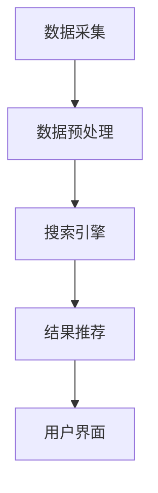

                 

关键词：教育、人工智能、搜索、应用、AI教育、智能搜索、学习资源、个性化学习、教育技术

> 摘要：本文将探讨人工智能在教育领域的搜索应用，分析其核心概念、算法原理、数学模型、项目实践、实际应用场景以及未来展望。通过深入研究AI在教育搜索中的应用，旨在为教育工作者和学生提供更加智能化、个性化的学习体验。

## 1. 背景介绍

随着信息技术的迅猛发展，人工智能（AI）逐渐成为改变人类生活方式的重要力量。在教育领域，AI的应用也愈加广泛，其中智能搜索作为一项核心技术，正在为教育资源的获取和个性化学习提供强有力的支持。传统的教育模式往往受限于教材、课堂时间和教师的能力，而AI搜索应用的出现，打破了这些限制，使得学生能够根据自身需求，随时随地获取高质量的学习资源，实现个性化学习。

### 1.1 教育现状

当前，教育领域正面临着一系列挑战，包括教育资源的不均衡、学生个性化需求的满足、教育质量的提升等。传统教育模式难以应对这些挑战，而人工智能的引入，有望为解决这些问题提供新的思路和方法。AI搜索应用作为人工智能在教育领域的具体应用，具有巨大的潜力和价值。

### 1.2 AI搜索在教育中的应用

AI搜索在教育中的应用主要体现在以下几个方面：

1. **个性化学习推荐**：基于学生的学习行为和兴趣，AI系统能够为学生推荐适合的学习资源，提高学习效率。
2. **教育资源挖掘**：通过自然语言处理技术，AI系统能够从大量非结构化的教育数据中挖掘出有价值的信息，为教育研究提供数据支持。
3. **学习过程监测**：AI系统可以实时监测学生的学习状态，及时发现学习中的问题，提供个性化的辅导和建议。
4. **智能问答与辅导**：AI系统可以模拟教师的角色，为学生提供智能问答和辅导服务，帮助学生解决学习中的困难。

## 2. 核心概念与联系

### 2.1 人工智能与教育搜索

人工智能（AI）是指使计算机系统能够模拟人类智能行为的技术和科学。教育搜索则是指利用信息技术手段，从海量的教育数据中检索出满足特定需求的信息。AI与教育搜索的结合，使得教育资源的获取更加智能化和高效化。

### 2.2 教育搜索应用架构

教育搜索应用的架构通常包括数据采集、数据预处理、搜索引擎、结果推荐和用户界面等几个主要模块。以下是教育搜索应用架构的 Mermaid 流程图：



### 2.3 数据采集与预处理

数据采集是教育搜索应用的基础。采集的数据包括学生行为数据、教育资源数据、教师教学数据等。数据采集后，需要进行预处理，如数据清洗、数据去重、数据格式转换等，以确保数据的质量和一致性。

### 2.4 搜索引擎与结果推荐

搜索引擎是教育搜索应用的核心。它利用自然语言处理技术，对用户输入的查询进行解析，并在海量的教育数据中检索出相关的结果。结果推荐模块则根据学生的兴趣和学习行为，为用户推荐相关的学习资源。

## 3. 核心算法原理 & 具体操作步骤

### 3.1 算法原理概述

教育搜索应用的核心算法主要包括自然语言处理（NLP）、机器学习（ML）、推荐系统（RS）等。以下是这些算法的简要概述：

1. **自然语言处理（NLP）**：NLP是使计算机能够理解、处理和生成自然语言的技术。在教育搜索中，NLP用于解析用户查询和文本数据的语义，从而提高搜索的准确性和效果。
2. **机器学习（ML）**：ML是一种通过数据训练模型，使计算机能够从数据中自动学习和发现规律的技术。在教育搜索中，ML用于构建个性化推荐模型，提高资源推荐的准确性。
3. **推荐系统（RS）**：推荐系统是一种根据用户的历史行为和偏好，为用户推荐相关物品或服务的系统。在教育搜索中，推荐系统用于为用户推荐适合的学习资源。

### 3.2 算法步骤详解

1. **用户查询解析**：首先，系统需要接收用户输入的查询，并使用NLP技术对其进行解析，提取出关键词和语义信息。
2. **教育资源检索**：然后，系统使用搜索引擎，在教育资源数据库中检索与用户查询相关的资源。
3. **资源推荐**：接着，系统使用推荐算法，根据用户的兴趣和学习行为，为用户推荐相关的学习资源。
4. **用户反馈与优化**：最后，系统收集用户的反馈，并根据反馈优化推荐算法和搜索引擎，提高系统的准确性和用户体验。

### 3.3 算法优缺点

1. **优点**：
   - 提高搜索效率：通过NLP和ML技术，系统可以快速检索和推荐相关资源，提高搜索效率。
   - 个性化推荐：根据用户的历史行为和兴趣，系统可以提供个性化的学习资源，满足用户的个性化需求。
   - 智能问答与辅导：AI系统可以模拟教师的角色，为学生提供智能问答和辅导服务，提高学习效果。

2. **缺点**：
   - 数据质量和一致性：教育搜索应用依赖于高质量和一致性的数据，数据质量和一致性问题可能影响系统的性能和效果。
   - 算法复杂度：教育搜索应用涉及多种算法，算法复杂度较高，实现和优化难度较大。
   - 用户隐私保护：在教育搜索中，用户隐私保护是一个重要问题，需要确保用户的隐私信息不被泄露。

### 3.4 算法应用领域

教育搜索算法主要应用于以下领域：

1. **在线学习平台**：为用户提供智能化的学习资源推荐，提高学习效率。
2. **教育管理系统**：为学生和教师提供智能化的教育资源检索和推荐服务，提高教育管理效率。
3. **教育研究**：通过分析教育数据，为教育研究提供数据支持。
4. **智能教育应用**：如智能问答系统、智能辅导系统等，为学生提供个性化的学习支持。

## 4. 数学模型和公式 & 详细讲解 & 举例说明

### 4.1 数学模型构建

在教育搜索中，常用的数学模型包括：

1. **向量空间模型**：将文本数据表示为向量，通过计算向量之间的相似度，实现文本数据的相似性检索。
2. **协同过滤模型**：基于用户的历史行为和偏好，为用户推荐相关的物品或服务。
3. **深度学习模型**：通过构建深度神经网络，实现文本数据的自动学习和特征提取。

### 4.2 公式推导过程

1. **向量空间模型**：

   假设有两个文档 \(D_1\) 和 \(D_2\)，分别表示为向量 \(V_1\) 和 \(V_2\)，其中：

   $$ V_1 = (v_{11}, v_{12}, ..., v_{1n}) $$
   $$ V_2 = (v_{21}, v_{22}, ..., v_{2n}) $$

   向量之间的相似度可以使用余弦相似度计算：

   $$ \cos(\theta) = \frac{V_1 \cdot V_2}{\|V_1\| \|V_2\|} $$

   其中，\( \cdot \) 表示向量的点积，\( \|V_1\| \) 和 \( \|V_2\| \) 分别表示向量 \(V_1\) 和 \(V_2\) 的模。

2. **协同过滤模型**：

   假设有两个用户 \(U_1\) 和 \(U_2\)，分别表示为向量 \(R_1\) 和 \(R_2\)，其中：

   $$ R_1 = (r_{11}, r_{12}, ..., r_{1n}) $$
   $$ R_2 = (r_{21}, r_{22}, ..., r_{2n}) $$

   用户之间的相似度可以使用皮尔逊相关系数计算：

   $$ r_{12} = \frac{\sum_{i=1}^{n} (r_{i1} - \bar{r_1}) (r_{i2} - \bar{r_2})}{\sqrt{\sum_{i=1}^{n} (r_{i1} - \bar{r_1})^2} \sqrt{\sum_{i=1}^{n} (r_{i2} - \bar{r_2})^2}} $$

   其中，\( \bar{r_1} \) 和 \( \bar{r_2} \) 分别表示用户 \(U_1\) 和 \(U_2\) 的平均评分。

   根据用户之间的相似度，可以为用户 \(U_2\) 推荐用户 \(U_1\) 没有评分的物品 \(i\)：

   $$ r_{i2} = r_{12} \times r_{i1} + \bar{r_2} $$

3. **深度学习模型**：

   深度学习模型通常使用反向传播算法进行训练。假设有一个多层神经网络，其中包含输入层、隐藏层和输出层，分别表示为 \(X\)、\(H\) 和 \(Y\)。网络中的每个神经元都可以表示为：

   $$ a_{ij}^{(l)} = \sigma(\sum_{k=1}^{n} w_{ik}^{(l)} a_{kj}^{(l-1)}) $$

   其中，\(a_{ij}^{(l)}\) 表示第 \(l\) 层的第 \(i\) 个神经元输出的第 \(j\) 个特征，\(w_{ik}^{(l)}\) 表示第 \(l\) 层的第 \(i\) 个神经元连接到第 \(l-1\) 层的第 \(k\) 个神经元的权重，\(\sigma\) 表示激活函数。

   神经网络的损失函数可以使用均方误差（MSE）计算：

   $$ J = \frac{1}{2} \sum_{i=1}^{m} \sum_{j=1}^{n} (y_{ij} - a_{ij}^{(L)})^2 $$

   其中，\(y_{ij}\) 表示第 \(i\) 个样本的第 \(j\) 个真实标签，\(a_{ij}^{(L)}\) 表示第 \(L\) 层的第 \(i\) 个神经元输出的第 \(j\) 个特征。

   使用梯度下降算法，可以通过以下公式更新权重：

   $$ w_{ik}^{(l)} = w_{ik}^{(l)} - \alpha \frac{\partial J}{\partial w_{ik}^{(l)}} $$

   其中，\(\alpha\) 表示学习率。

### 4.3 案例分析与讲解

假设有一个在线学习平台，学生可以通过平台搜索和推荐学习资源。以下是一个简单的案例：

1. **用户查询**：学生输入查询“线性代数教程”。
2. **教育资源检索**：平台从教育资源数据库中检索出与“线性代数教程”相关的资源，如电子书、视频教程、练习题等。
3. **资源推荐**：平台根据学生的历史行为和偏好，为该学生推荐相关的学习资源，如“线性代数基础教程”、“线性代数高级教程”等。
4. **用户反馈**：学生浏览推荐资源后，给出反馈，如“喜欢”、“不喜欢”等。
5. **推荐优化**：平台根据用户的反馈，调整推荐算法，提高推荐资源的准确性。

通过这个案例，我们可以看到教育搜索应用中数学模型的应用，以及如何通过用户反馈优化推荐效果。

## 5. 项目实践：代码实例和详细解释说明

### 5.1 开发环境搭建

为了实现教育搜索应用，我们需要搭建一个合适的开发环境。以下是搭建开发环境的步骤：

1. **安装Python**：Python是一种广泛应用于数据科学和机器学习的编程语言。确保安装了Python 3.x版本。
2. **安装必要的库**：安装用于自然语言处理、机器学习和Web开发的库，如NLTK、Scikit-learn、Flask等。
3. **配置数据库**：配置一个关系型数据库，如MySQL或PostgreSQL，用于存储教育资源数据。

### 5.2 源代码详细实现

以下是一个简单的教育搜索应用的源代码实例：

```python
# 导入必要的库
import nltk
from sklearn.feature_extraction.text import TfidfVectorizer
from sklearn.metrics.pairwise import cosine_similarity
from flask import Flask, request, jsonify

# 初始化Flask应用
app = Flask(__name__)

# 教育资源数据
教育资源 = [
    "线性代数教程",
    "微积分教程",
    "离散数学教程",
    "概率论与数理统计教程",
    "高等代数教程"
]

# 初始化TF-IDF向量器
vectorizer = TfidfVectorizer()

# 将教育资源转换为TF-IDF向量
教育资源向量 = vectorizer.fit_transform教育资源

# 定义搜索函数
@app.route("/search", methods=["POST"])
def search():
    # 获取用户查询
    query = request.form["query"]

    # 将用户查询转换为TF-IDF向量
    query_vector = vectorizer.transform([query])

    # 计算查询与教育资源之间的相似度
   相似度 = cosine_similarity(query_vector, 教育资源向量)

    # 为用户推荐教育资源
    推荐资源 = []
    for i, s in enumerate(相似度[0]):
        if s > 0.5:
            推荐资源.append(教育资源[i])
    
    # 返回推荐资源
    return jsonify(推荐资源)

# 运行Flask应用
if __name__ == "__main__":
    app.run()
```

### 5.3 代码解读与分析

1. **导入库**：首先，导入Python中用于自然语言处理、机器学习和Web开发的库，如NLTK、Scikit-learn和Flask。
2. **初始化应用**：使用Flask框架初始化Web应用。
3. **教育资源数据**：定义一个列表，存储教育资源数据。
4. **初始化TF-IDF向量器**：使用TfidfVectorizer将文本数据转换为TF-IDF向量。
5. **定义搜索函数**：定义一个搜索函数，用于接收用户查询，并将查询转换为TF-IDF向量。然后，计算查询与教育资源之间的相似度，并为用户推荐教育资源。
6. **运行应用**：在Flask应用中运行搜索函数，启动Web服务。

通过这个简单的实例，我们可以看到教育搜索应用的基本实现方法。在实际应用中，我们还需要考虑更多因素，如用户权限管理、推荐算法优化、前端界面设计等。

### 5.4 运行结果展示

当用户在Web界面输入查询“线性代数”时，系统将返回与“线性代数”相关的教育资源，如“线性代数教程”、“高等代数教程”等。用户可以根据推荐资源进行学习，并根据学习体验给出反馈，进一步优化推荐效果。

## 6. 实际应用场景

### 6.1 在线学习平台

在线学习平台是教育搜索应用最常见的一个场景。通过智能搜索和推荐系统，平台可以为用户提供个性化的学习资源，提高学习效率。例如，Coursera和edX等在线教育平台，都采用了人工智能技术，为学生提供智能化的学习推荐服务。

### 6.2 教育管理系统

教育管理系统也是教育搜索应用的一个重要场景。通过智能搜索和推荐系统，教育管理系统可以为教师和学生提供智能化的教育资源检索和推荐服务，提高教育管理效率。例如，教师可以通过系统快速查找教学资源，为学生推荐适合的学习内容。

### 6.3 智能教育应用

智能教育应用，如智能问答系统和智能辅导系统，也是教育搜索应用的一个重要场景。通过智能搜索和推荐系统，这些应用可以为用户提供个性化的问答和辅导服务，提高学习效果。例如，一些智能辅导应用可以为学生提供实时解答和个性化辅导，帮助学生解决学习中的困难。

## 7. 未来应用展望

随着人工智能技术的不断发展和完善，教育搜索应用将在未来得到更加广泛的应用。以下是教育搜索应用的一些未来发展方向：

### 7.1 更精准的推荐

随着数据积累和算法优化，教育搜索应用的推荐准确性将不断提高，为用户提供更加精准的学习资源推荐。

### 7.2 多模态搜索

未来的教育搜索应用将支持多模态搜索，如文本、图片、视频等，为用户提供更加丰富和多样化的学习资源。

### 7.3 智能学习路径规划

通过智能搜索和推荐系统，教育搜索应用将能够为用户规划个性化的学习路径，帮助用户高效地完成学习任务。

### 7.4 智能化教育评价

教育搜索应用将能够利用数据分析和机器学习技术，为用户提供智能化的教育评价，帮助教育工作者更好地了解学生的学习情况。

### 7.5 个性化教育服务

未来的教育搜索应用将更加注重个性化服务，根据学生的需求和兴趣，提供定制化的学习资源和辅导服务。

## 8. 工具和资源推荐

### 8.1 学习资源推荐

- **课程**：Coursera、edX、Udemy等在线学习平台提供了丰富的机器学习和自然语言处理课程。
- **书籍**：《自然语言处理入门》、《机器学习实战》等。

### 8.2 开发工具推荐

- **编程语言**：Python是机器学习和自然语言处理的首选编程语言。
- **库和框架**：NLTK、Scikit-learn、TensorFlow、PyTorch等。

### 8.3 相关论文推荐

- **NLP领域**：《词向量的自动获取与语义分析》、《基于深度学习的自然语言处理》等。
- **推荐系统领域**：《基于协同过滤的推荐系统》、《深度学习在推荐系统中的应用》等。

## 9. 总结：未来发展趋势与挑战

### 9.1 研究成果总结

近年来，人工智能在教育领域的应用取得了显著成果。智能搜索和推荐系统已经成为在线学习平台和智能教育应用的重要组成部分，为教育资源的获取和个性化学习提供了有力支持。

### 9.2 未来发展趋势

随着人工智能技术的不断发展和完善，教育搜索应用将在未来得到更加广泛的应用。多模态搜索、智能学习路径规划、个性化教育服务等新功能将不断涌现，为教育领域带来更多创新和变革。

### 9.3 面临的挑战

尽管教育搜索应用具有巨大的潜力，但在实际应用过程中也面临一些挑战：

- **数据质量和一致性**：教育搜索应用依赖于高质量和一致性的数据，如何确保数据的质量和一致性是一个重要问题。
- **算法复杂度**：教育搜索应用涉及多种算法，算法复杂度较高，实现和优化难度较大。
- **用户隐私保护**：在教育搜索中，用户隐私保护是一个重要问题，需要确保用户的隐私信息不被泄露。

### 9.4 研究展望

未来的研究应重点关注以下几个方面：

- **数据挖掘与知识表示**：通过数据挖掘技术，从海量的教育数据中挖掘出有价值的信息，为教育研究提供数据支持。
- **算法优化与性能提升**：优化推荐算法和搜索引擎，提高系统的准确性和性能。
- **用户体验与反馈机制**：设计更加智能化的用户体验，建立有效的用户反馈机制，持续优化系统性能。

## 10. 附录：常见问题与解答

### 10.1 教育搜索应用的关键技术是什么？

教育搜索应用的关键技术包括自然语言处理（NLP）、机器学习（ML）、推荐系统（RS）等。

### 10.2 教育搜索应用如何实现个性化推荐？

教育搜索应用通过分析用户的历史行为和兴趣，构建个性化推荐模型，为用户推荐相关资源。

### 10.3 教育搜索应用在教育资源获取方面有哪些优势？

教育搜索应用可以提高教育资源获取的效率，满足用户的个性化需求，提高学习效果。

### 10.4 教育搜索应用如何保护用户隐私？

教育搜索应用应采取数据加密、访问控制等措施，确保用户隐私信息不被泄露。

### 10.5 教育搜索应用在未来的发展趋势是什么？

未来的教育搜索应用将更加注重多模态搜索、智能学习路径规划、个性化教育服务等新功能。

